# AWS ELB(로드 밸런서) 적용하기

## 1. ELB(Elastic Load Balancer) 소개

- ELB는 인터넷 트래픽(부하)를 여러 대의 서버(일반적으로 EC2 인스턴스)에 분산시켜 처리한다.
- ELB의 주요 목적은 애플리케이션의 가용성과 내구성을 높이는 것이다.
- ELB는 요청을 여러 서버에 분산함으로써 단일 서버에 발생할 수 있는 과부하를 방지하고, 서버 중 하나가 실패하더라도 자동으로 트래픽을 건강한 서버로 리디렉션하여 서비스 중단 시간을 최소화한다.

AWS ELB에는 다음과 같은 세 가지 유형이 있다:

- **Application Load Balancer(ALB)**: HTTP와 HTTPS 트래픽에 최적화되어 있으며, 고급 라우팅 기능(경로 기반 라우팅, 호스트 기반 라우팅 등)을 제공한다. 애플리케이션의 특정 URL 또는 호스트 이름에 따라 트래픽을 다른 타겟 그룹으로 라우팅할 수 있다.
- **Network Load Balancer(NLB)**: TCP, UDP, TLS 트래픽에 최적화되어 있으며, 초고성능과 정적 IP 주소 할당을 필요로 하는 애플리케이션에 적합하다. NLB는 밀리초 단위의 지연 시간과 매우 높은 처리량을 제공한다.
- **Classic Load Balancer(CLB)**: 초기 ELB 서비스로, 단순한 로드 밸런싱 기능을 제공한다. CLB는 애플리케이션 계층과 네트워크 계층 모두에서 로드 밸런싱을 지원하지만, AWS는 새 애플리케이션에는 ALB나 NLB 사용을 권장한다.

이 문서에서는 ELB의 부가 기능 중 하나인 HTTPS를 적용시키는 방법을 중심으로 실습 과정을 정리한다.

## 2. SSL/TLS 소개

- SSL(보안 소켓 계층)과 TLS(전송 계층 보안)는 인터넷 상에서 데이터를 안전하게 전송하기 위해 사용되는 암호화 프로토콜이다.
- 이들은 데이터의 기밀성과 무결성을 보장하며, 클라이언트와 서버 간의 통신을 암호화하여 제3자가 데이터를 도청하거나 변경하는 것을 방지한다.
- TLS는 SSL의 후속 버전으로 간주되며, 현재는 SSL보다는 TLS가 더 널리 사용되고 권장된다.
- SSL/TLS를 쉽게 표현하면 HTTP를 HTTPS로 바꿔주는 인증서로 보면 된다.

이전 글에서 적용한 도메인 주소에 접속하면 보안 연결이 사용되지 않은 사이트로 표기된다. 이는 사용자에게 안전하지 않은 사이트라는 인식을 줄 수 있어 HTTPS 적용은 보안 뿐 아니라 사용자 유입에도 영향을 미친다.

HTTPS 인증을 받은 웹 사이트가 백엔드와 API 통신을 하려면 백엔드 서버 또한 HTTPS 인증을 받아야 한다.

- 웹 서비스: `https://xxxxxx.net`
- API 주소: `https://api.xxxxx.net`

로드 밸런서를 사용하기 전에는 Route 53에 EC2 IP 주소를 직접 연결한다. 하지만 ELB를 연결하게 되면 EC2 IP 주소가 아닌 ELB로 경로를 변경해야 한다.

## 3. 로드 밸런서 생성

EC2 안의 [로드밸런서] 메뉴를 클릭한다. 오른쪽 상단의 [로드 밸런서 생성]을 클릭한다. (리전이 서울로 설정되어 있는지 확인한다.)

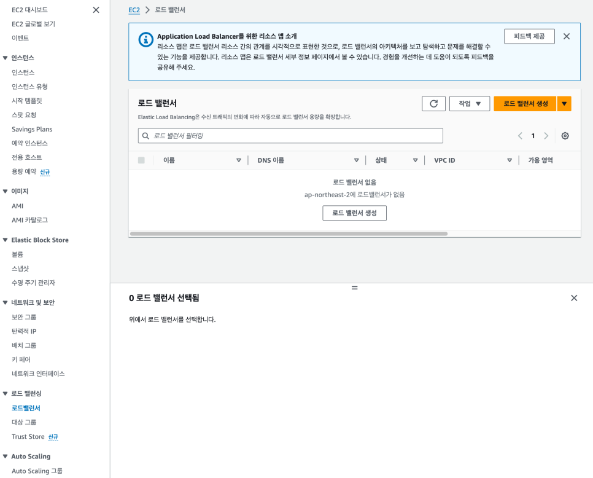

로드 밸런서 유형은 [Application Load Balancer]를 선택한다.

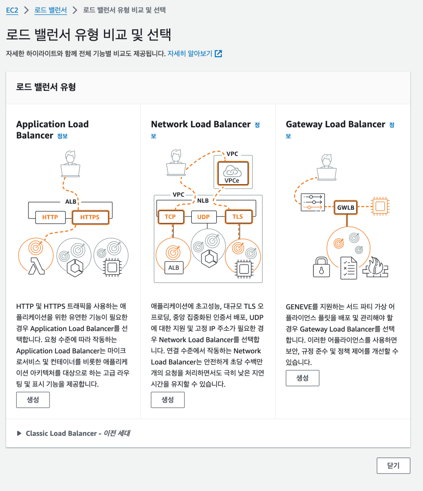

기본 구성에서 로드 밸런서 이름을 자유롭게 작성한다.

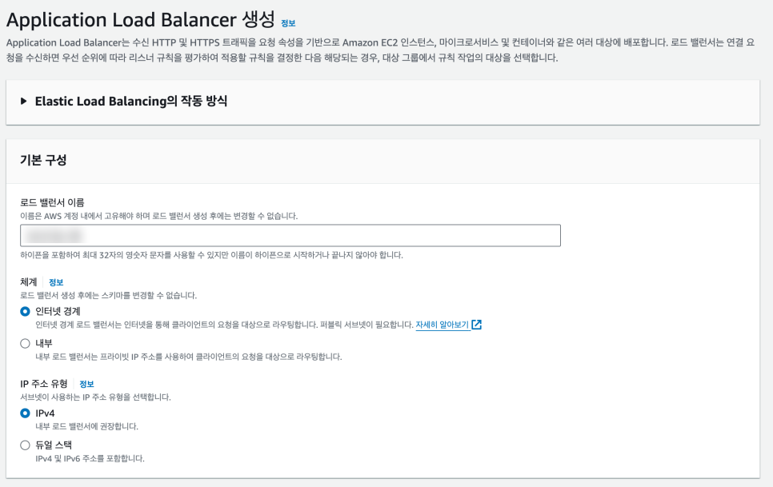

네트워크 매핑은 전부 체크한다.

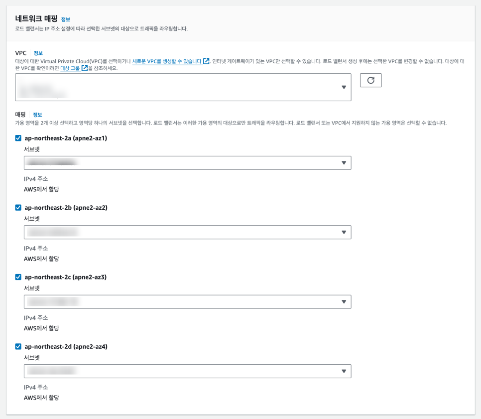

보안 그룹에서는 이전에 생성한 보안 그룹을 선택한다.


리스너 및 라우팅은 ELB로 들어온 요청을 어떤 EC2에 전달할지 지정할 수 있다. EC2 연결을 위해 [대상 그룹 생성]을 클릭한다.

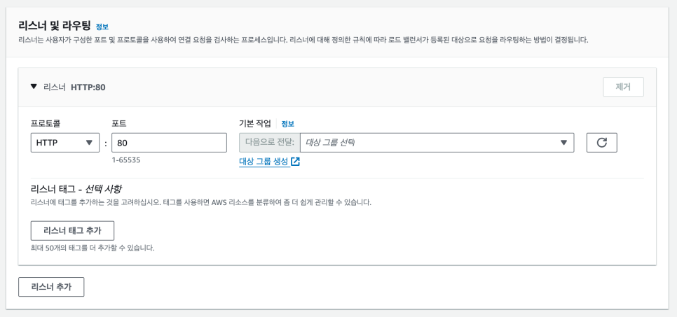

그룹 세부 정보 지정 페이지로 이동한다. 고객이 로드 밸런서에 접속시 EC2의 특정 인스턴스에 전달해야 하므로 대상 유형 선택은 인스턴스로 지정한다. 대상 그룹 이름은 자유롭게 작성한다.


다음 항목도 기본값으로 세팅한다. 아래 값들은 ELB가 사용자로부터 트래픽을 받아 대상 그룹에게 어떤 방식으로 전달할지 설정하는 부분이다.

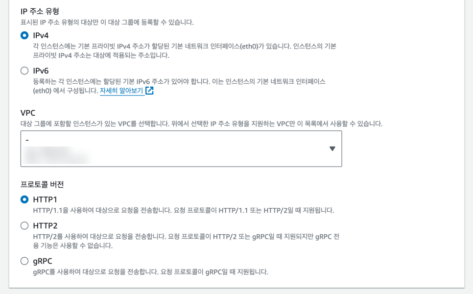

ELB의 부가 기능으로 상태 검사가 있다. 특정 인스턴스의 서버가 예상치 못한 오류가 발생했을 때 ELB 입장에서는 해당 서버에 요청(트래픽)을 보내는게 비효율적이다. 이러한 상황을 방지하기 위해 ELB는 주기적으로 대상 그룹에 속해 있는 인스턴스에게 요청을 보낸다. 그 요청 상태가 200으로 전달되면 서버에 문제가 없다고 판단한다. 응답이 오지 않는다면 ELB는 해당 인스턴스에 요청을 보내지 않는다.

다음은 인스턴스에 health API로 요청을 보내 상태를 체크하기 위한 설정이다. 이를 위해 EC2 인스턴스에 배포한 Nest.js에 health API를 추가해야 한다. 다음과 같이 작성하고 [다음]을 클릭한다.

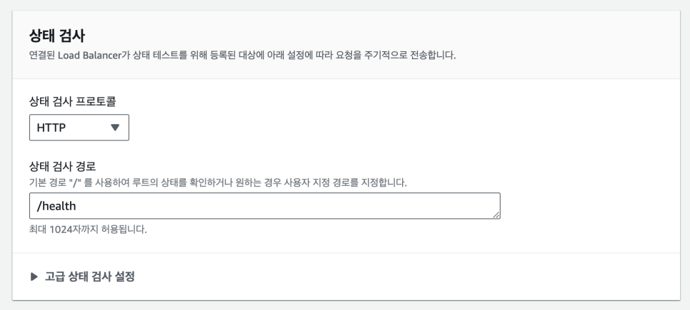

대상 등록을 한다. 생성된 EC2를 선택하고 [아래에 보류 중인 것으로 포함]을 클릭한다. 대상 보기에 해당 인스턴스가 추가되면 [대상 그룹 생성]을 선택한다.

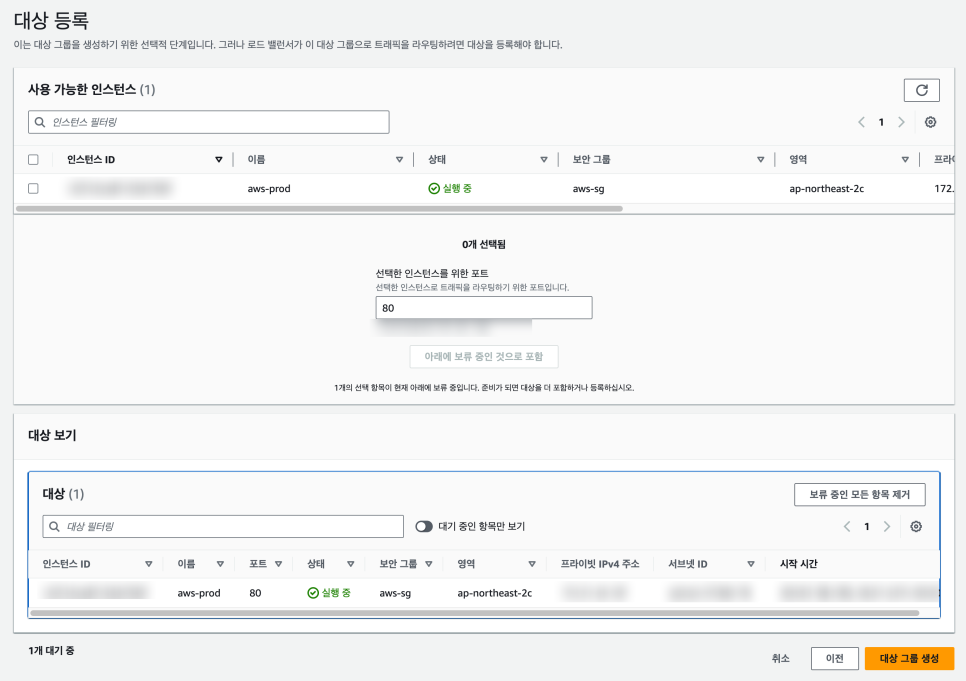

다시 리스너 및 라우팅에서 새로 고침을 한 다음에 앞에서 만든 대상 그룹을 선택한다.


[로드 밸런서 생성]을 클릭한다. 목록에 로드 밸런서가 추가되며, 현재 상태는 프로비저닝 중이라고 나오는데 이는 생성 중이라는 의미다. 생성이 완료되기 전까지 EC2에 health API를 추가한다.

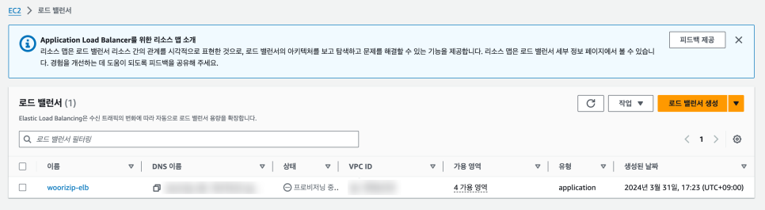

health API가 추가된 실습 코드는 별도 브랜치(`feature/health`)에서 확인할 수 있다. EC2 인스턴스의 Nest.js에 접속하여 해당 코드를 적용하고, 다시 빌드 후 서버를 재시작한다.

```bash
npm run build
pm2 reload main
```

브라우저에서 health API를 호출하면 정상적으로 응답값이 오는 것을 확인할 수 있다.

로드 밸런서 상태가 활성으로 변경되었다면 상세 페이지로 이동한다. 여기서 DNS 이름을 확인할 수 있는데, 해당 주소를 가지고도 사이트에 접속할 수 있다.

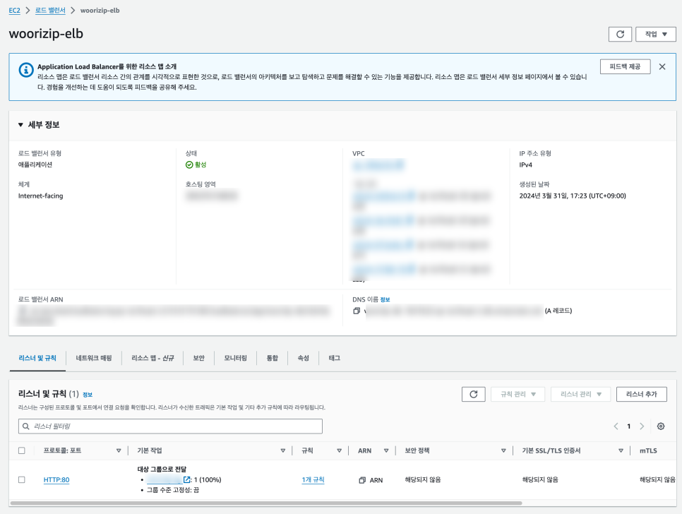

이는 ELB와 EC2 인스턴스가 정상적으로 연결이 되었다는 의미다.

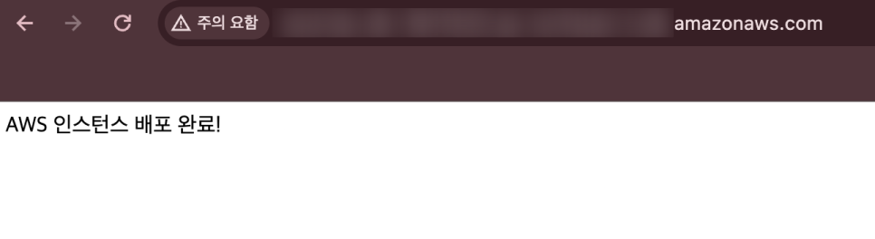

## 4. ELB에 도메인 연결

Route 53에 ELB의 DNS를 연결한다. 이전에 생성한 레코드를 편집하여 다음과 같이 수정한다.

- 레코드 유형: A
- 트래픽 라우팅 대상: Application/Classic Load Balancer, 아시아 태평양, 생성된 ELB 선택

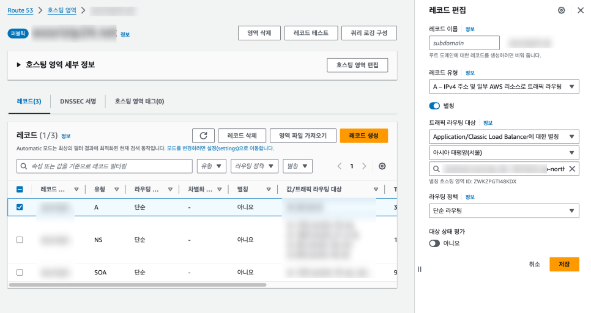

도메인 주소에 접속하면 이전과 동일한 결과가 출력되는 것을 확인할 수 있다.

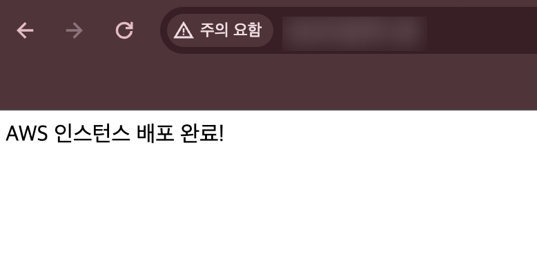

## 5. HTTPS 적용하기

HTTPS를 적용한다. AWS에서 [Certificate Manager] 페이지로 이동하여 [인증서 요청]을 클릭한다.

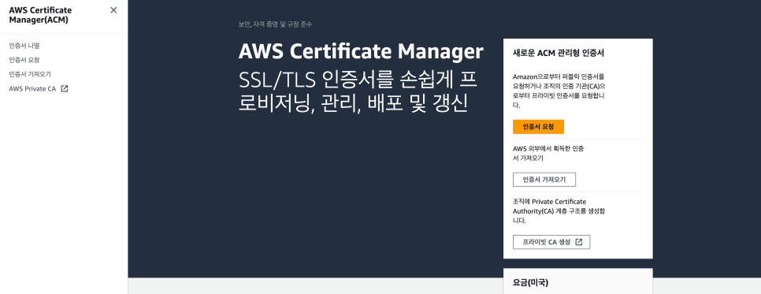

퍼블릭 인증서 요청을 선택하고 [다음]을 클릭한다.

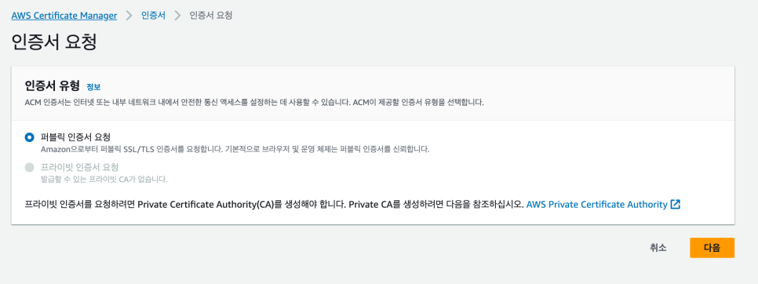

구입한 도메인 이름을 입력한다. 다른 항목은 기본값으로 두고 [요청]을 클릭한다.


검증 대기 중 상태로 나타난다.


인증서 상세에 들어가서 CNAME을 확인하고 [Route 53에서 레코드 생성]을 클릭한다.


[레코드 생성]을 클릭한다.


Route 53에 접속하면 CNAME 레코드가 추가된 것을 확인할 수 있다.


다시 Certificate Manager 페이지로 이동한다. 일정 시간이 지나면 인증서 상태가 발급됨으로 변경된다.


ELB에 HTTPS 인증서를 등록한다. 생성한 로드 밸런서의 상세 페이지로 이동한다. 리스너 및 규칙 항목에 있는 [리스너 추가]를 클릭한다.

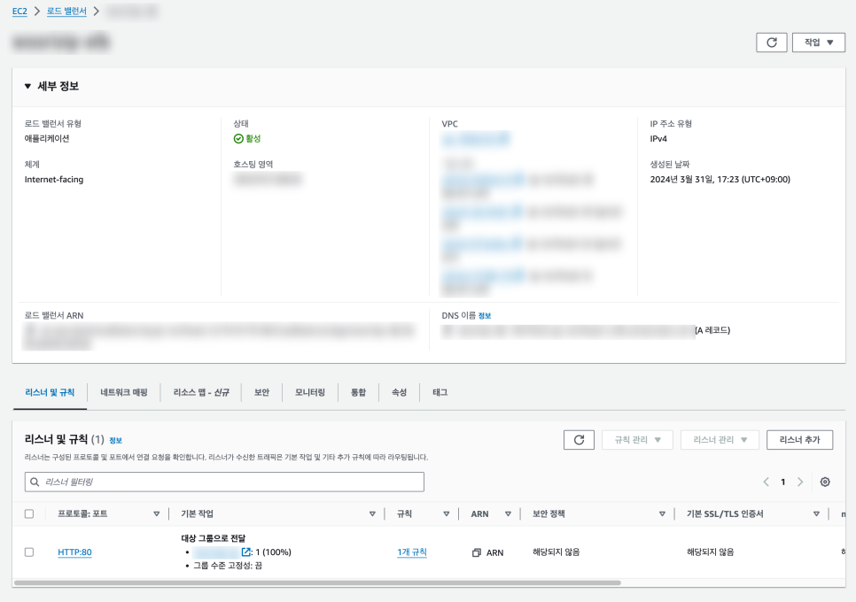

프로토콜은 HTTPS로 변경하고, 앞에서 생성한 대상 그룹을 선택한다.

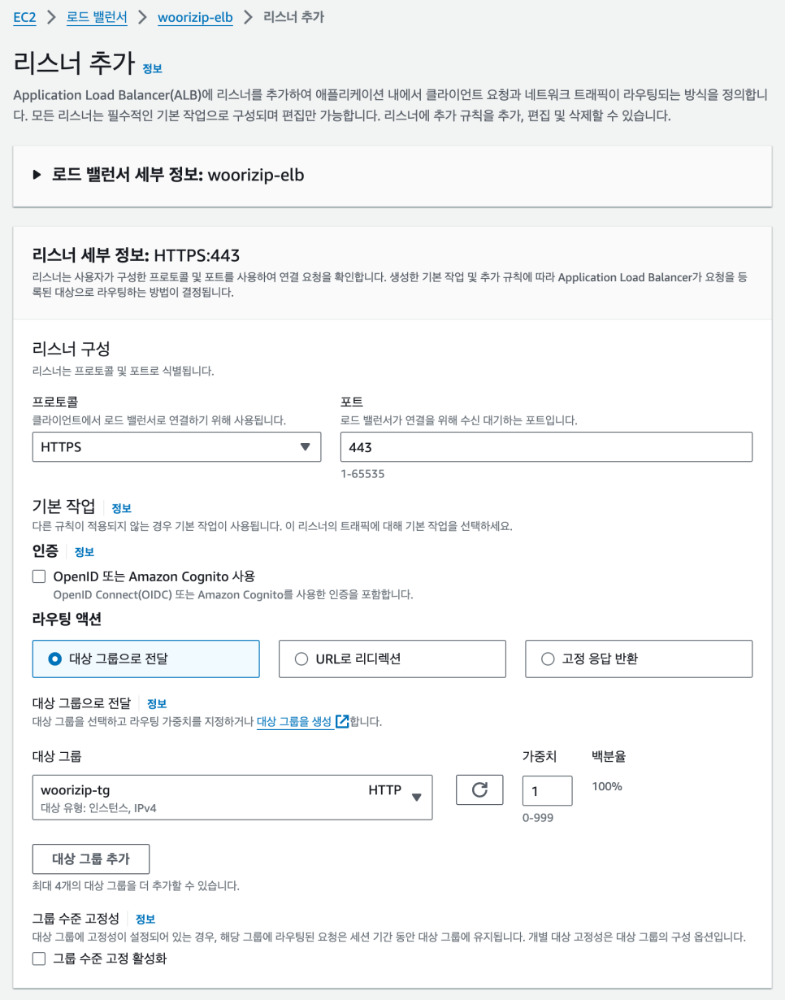

보안 리스너 설정에서도 앞에서 생성한 인증서를 선택하고 [추가]를 클릭한다.

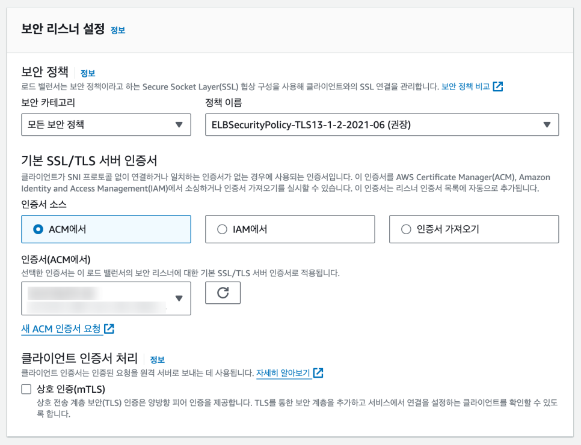

도메인에 HTTPS를 붙여서 접속하면 경고 문구가 사라진 것을 확인할 수 있다.

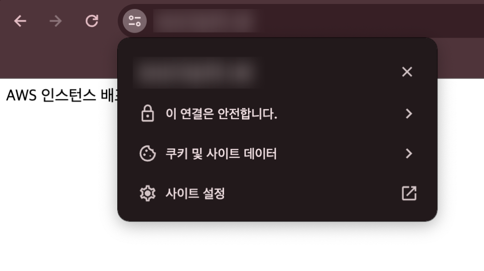

## 6. HTTP 접속시 HTTPS로 전환

현재는 HTTP, HTTPS 양쪽 모두로 접속이 가능하다. HTTP로 접속했을 시 HTTPS로 리다이렉팅 되도록 변경한다. 생성한 로드 밸런서 상세 페이지로 이동하여 리스너 및 규칙에서 HTTP:80을 삭제하고 [리스너 추가]를 클릭한다.

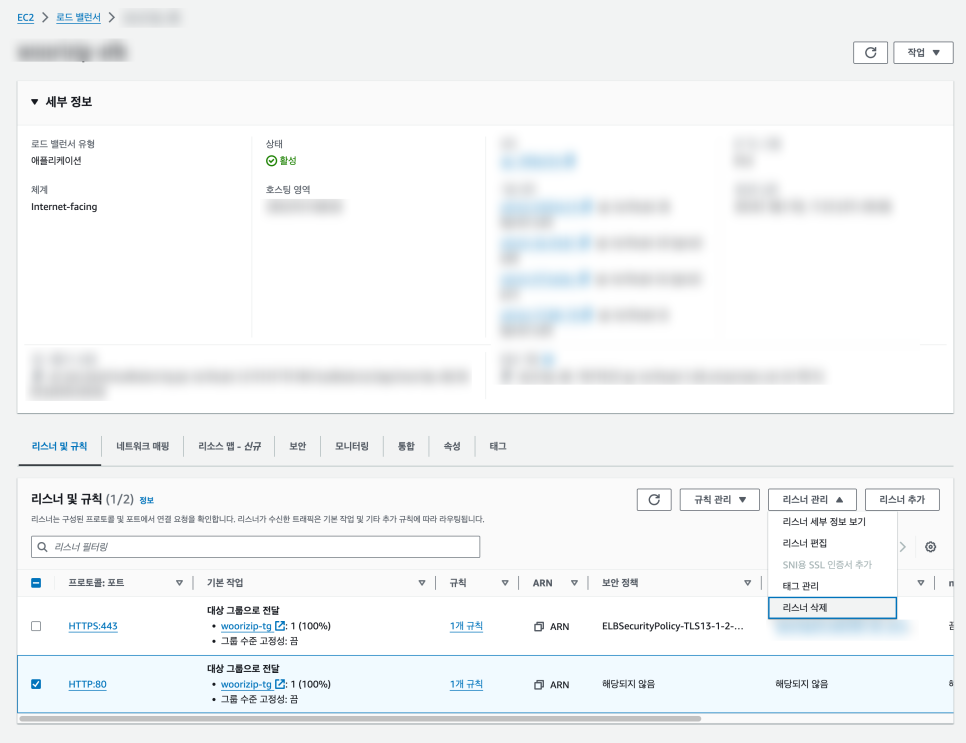

리스너 세부 정보에서는 다음과 같이 설정한다. 이는 HTTP 80번 포트로 접속시 URL 리디렉션을 적용하여 HTTPS로 전달하겠다는 의미다.

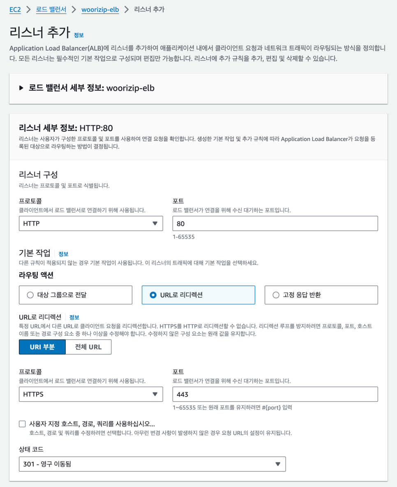

[추가]를 클릭하면 리디렉션 대상 항목이 추가된다.

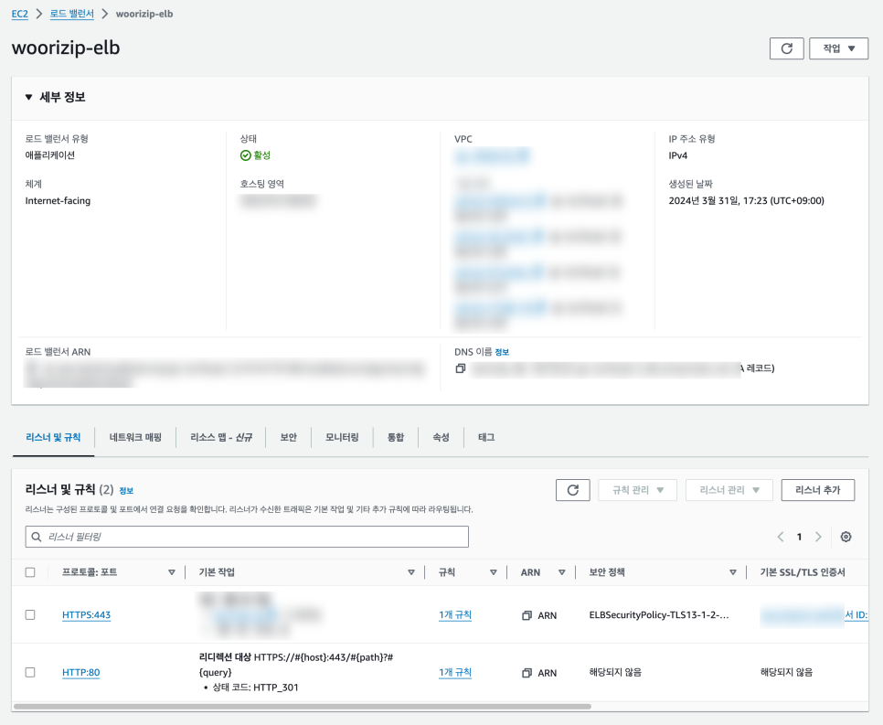

다시 브라우저에서 HTTP로 도메인에 접속하면 HTTPS로 변경되는 것을 확인할 수 있다.

> 관련: 이론 2.  AWS EC2 - 배포
