# WordPress 3-Tier 클러스터 구성하기 (RDS + EFS + S3 + ALB + Auto Scaling)

이 문서는 3-Tier Architecture(Presentation/Application/Data 계층) 기반으로 WordPress를 배포하는 절차를 다룬다. ALB가 요청을 분산하고, Auto Scaling으로 묶인 EC2가 웹 서버 역할을 하며, RDS가 데이터를 저장하고, EFS로 여러 EC2가 워드프레스 소스를 공유하는 구조다. 이론 5. AWS RDS, 이론 4. AWS S3, 가이드 6. AWS ALB + Auto Scaling + 대상 그룹 통합 가이드와 이어지는 구성이다.

## 1. 아키텍처 개요

- **Presentation Tier**: ALB가 사용자 요청을 받아 여러 EC2로 분산한다.
- **Application Tier**: EC2 인스턴스(웹 서버)가 Auto Scaling Group으로 묶여 트래픽 변화에 따라 자동으로 늘고 준다.
- **Data Tier**: Amazon RDS가 데이터베이스 역할을 수행한다.
- **EFS(공유 스토리지)**: 여러 EC2가 동일한 워드프레스 소스코드와 업로드 파일(이미지, 플러그인 등)을 공유해 데이터 일관성을 유지한다.
- **S3**: `wp-config.php`(DB 접속 정보가 담긴 설정 파일)를 보관해두고, EC2가 부팅될 때 내려받아 적용한다.

전체 구성 순서는 다음과 같다: IAM 역할 생성 → VPC 생성 → RDS 서브넷 그룹·RDS 생성 → 보안 그룹 정리 → EFS 생성 → S3 버킷 생성 → EC2에서 워드프레스 설치·wp-config 반영 → AMI 생성 → 시작 템플릿·대상 그룹·Auto Scaling Group·ALB 연결 → 트러블슈팅(사이트 주소 고정) → 보안 그룹 잠금.

## 2. IAM 역할 생성

EC2가 S3에서 `wp-config.php` 파일을 가져올 수 있도록 역할이 필요하다.

1. IAM 콘솔의 [역할]에서 [역할 생성]을 선택한다.
2. 신뢰할 수 있는 엔터티 유형은 [AWS 서비스], 사용 사례는 [EC2]를 선택한다.
3. 권한 정책에서 `s3full`을 검색해 `AmazonS3FullAccess`를 체크한다. (운영 환경에서는 특정 버킷만 허용하는 커스텀 정책으로 좁히는 것을 권장한다.)
4. 역할 이름을 입력하고(예: `wordpress-3tier-ec2-role`) 생성한다.

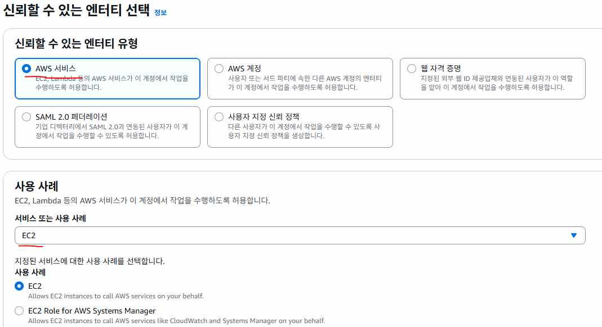

## 3. VPC 생성

1. VPC 콘솔에서 [VPC 생성]을 선택하고, 생성할 리소스는 [VPC 등]으로 지정한다.
2. 가용 영역(AZ) 수는 2, 퍼블릭 서브넷 수는 2, 프라이빗 서브넷 수는 2로 설정한다.
3. NAT 게이트웨이는 이 실습에서는 [없음]으로 둔다(비용 절감 목적. 실제 운영에서는 프라이빗 서브넷의 아웃바운드가 필요하면 NAT Gateway를 구성한다).
4. IPv4 CIDR 블록은 `10.0.0.0/16`으로 지정한다.

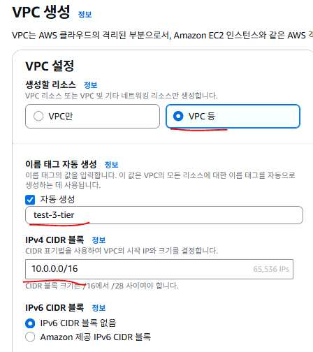

5. VPC를 생성하면 각 가용 영역에 퍼블릭 서브넷 1개, 프라이빗 서브넷 1개씩 총 4개의 서브넷이 만들어진다.

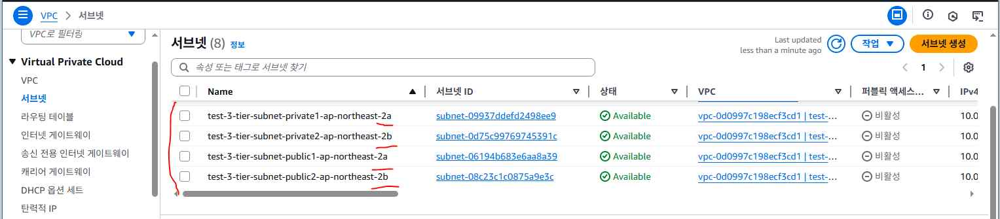

## 4. RDS 서브넷 그룹과 데이터베이스 생성

**RDS 서브넷 그룹**은 RDS가 어느 서브넷 범위 안에 만들어질지 정해주는 모음이다. RDS는 보통 프라이빗 서브넷에 만들어야 안전하고, Multi-AZ 배치를 위해 최소 2개 이상의 서브넷이 필요하다.

1. RDS 콘솔의 [서브넷 그룹]에서 [DB 서브넷 그룹 생성]을 선택한다.
2. VPC는 3번에서 만든 VPC를 선택하고, 가용 영역은 두 AZ를 모두 선택한다.
3. 서브넷은 두 AZ의 **프라이빗 서브넷**을 선택한다. RDS는 중요한 데이터(DB)를 저장하는 서비스라 외부 인터넷과 직접 연결되면 위험하므로, 프라이빗 서브넷에 두고 애플리케이션 서버(EC2)나 Bastion Host 같은 안전한 경유지에서만 접근하도록 설계한다.

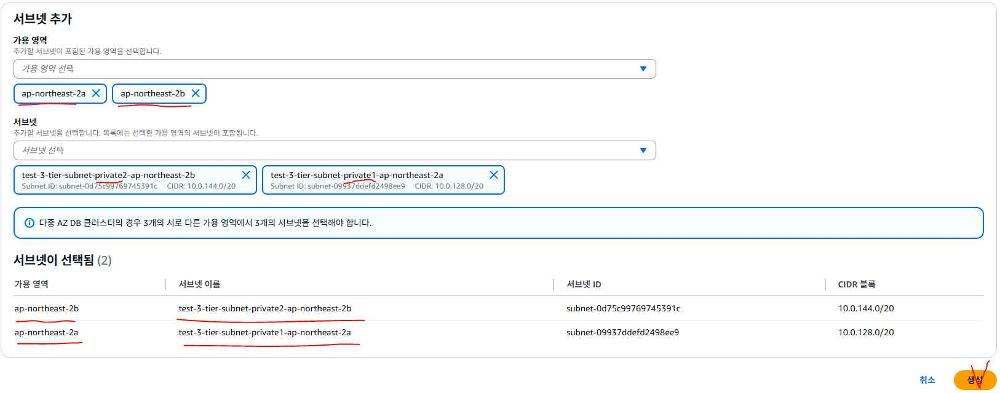

이어서 데이터베이스를 생성한다.

1. RDS 콘솔의 [데이터베이스]에서 [데이터베이스 생성]을 선택하고, 생성 방식은 [표준 생성], 엔진 옵션은 [MySQL]을 선택한다.
2. DB 인스턴스 식별자, 마스터 사용자 이름(예: `admin`), 마스터 암호를 입력한다.

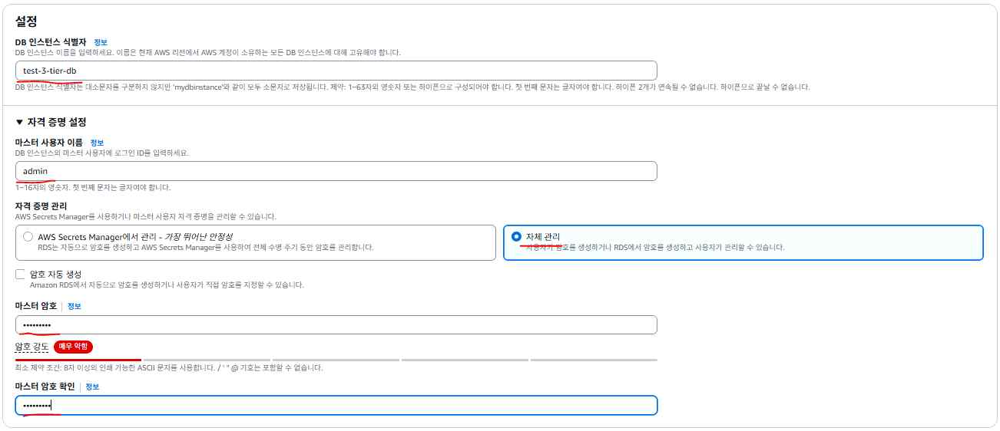

3. VPC는 3번에서 만든 VPC, DB 서브넷 그룹은 방금 만든 서브넷 그룹을 선택한다.
4. 퍼블릭 액세스는 [아니요]로 설정하고, VPC 보안 그룹은 기존 보안 그룹(default)을 선택한다.
5. [추가 구성]을 펼쳐서 초기 데이터베이스 이름을 `wordpress`로 지정한다.

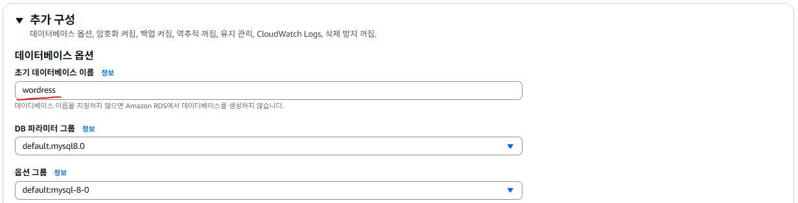

6. [데이터베이스 생성]을 선택한다.

## 5. 보안 그룹 임시 설정

실습 초기 단계에서는 default 보안 그룹의 인바운드 규칙에 [모든 트래픽 / 소스 `0.0.0.0/0`]을 임시로 추가해 EC2·RDS·EFS가 서로 통신하도록 열어둔다. (이 설정은 8장에서 EC2·ALB 전용 보안 그룹으로 교체해 잠근다.) 여러 보안 그룹을 구분하기 쉽도록 이름 태그를 붙여둔다(예: `wordpress-3tier-default-sg`).

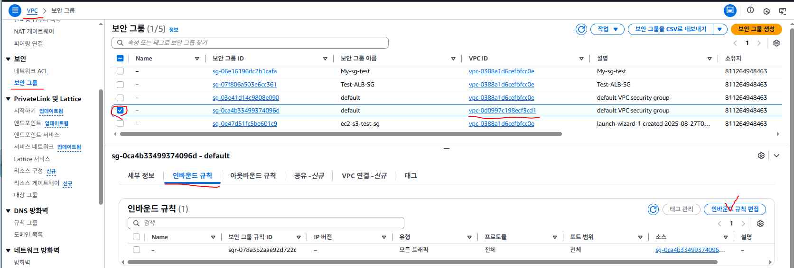

## 6. EFS 생성

AWS EFS(Elastic File System)는 여러 대의 EC2가 동시에 접근할 수 있는 공유 폴더 같은 서비스다. 네트워크로 연결되는 스토리지라서 서버가 늘어나도 같은 파일을 함께 쓸 수 있다.

- 파일을 저장할수록 용량이 자동으로 커지므로 미리 디스크 크기를 정해둘 필요가 없다.
- EC2 여러 대가 같은 EFS를 마운트하면 같은 파일을 함께 읽고 쓸 수 있어, 웹 서버 여러 대가 같은 업로드 파일을 공유할 때 유용하다.
- 리전의 여러 가용영역(AZ)에 자동으로 복제되어, 한 곳에 장애가 나도 데이터가 안전하게 유지된다.

1. EFS 콘솔의 [파일시스템]에서 [파일시스템 생성]을 선택한다.

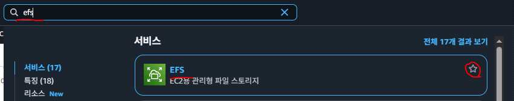

2. 이름을 입력하고, VPC는 3번에서 만든 VPC를 선택한다.

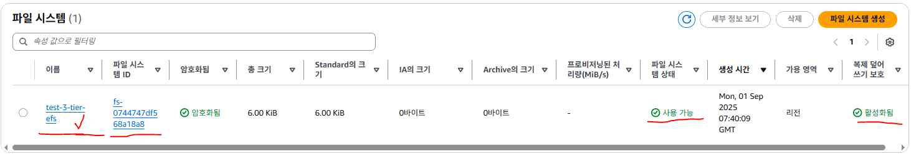

3. 생성 후 [네트워크] 탭에서 각 가용영역의 마운트 대상과 보안 그룹을 확인할 수 있다.

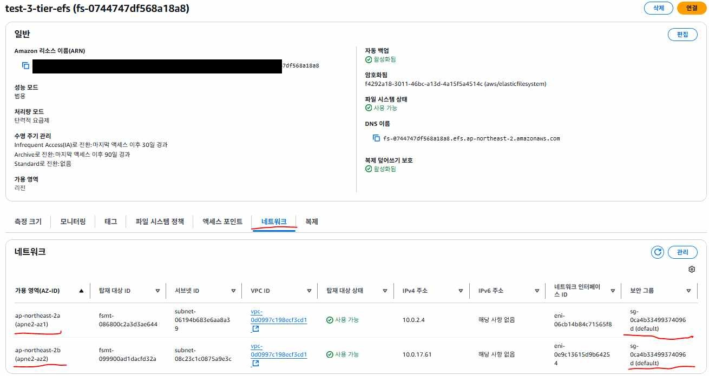

## 7. S3 버킷 생성과 wp-config.php 준비

1. S3 콘솔에서 [버킷 만들기]를 선택하고, 버킷 이름을 지정한다(전역적으로 고유해야 하므로 임의의 접미사를 붙인다).

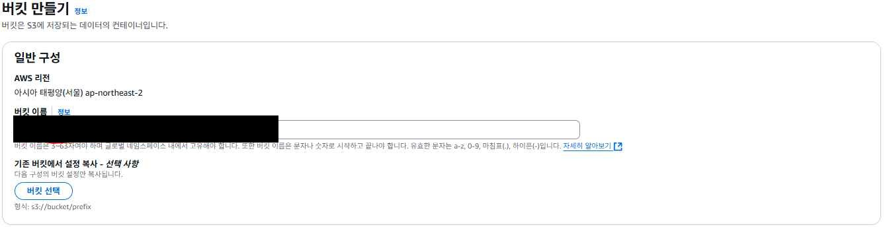
2. `wp-config.php` 템플릿 파일을 준비해 다음 항목을 RDS 정보에 맞게 채운다.

```php
// 데이터베이스 사용자 비밀번호
define( 'DB_PASSWORD', '<RDS 마스터 암호>' );

// 데이터베이스 호스트 (RDS 엔드포인트 주소, 필요시 포트 추가)
define( 'DB_HOST', '<RDS 엔드포인트 주소>' );

// 데이터베이스 문자셋 (utf8 권장)
define( 'DB_CHARSET', 'utf8' );
```

RDS 엔드포인트 주소는 RDS 콘솔에서 생성한 DB 인스턴스를 선택하면 [연결 및 보안] 탭에서 확인할 수 있다.

3. 이 `wp-config.php` 파일을 S3 버킷에 업로드해 둔다. EC2가 부팅될 때 이 파일을 내려받아 적용한다.

## 8. EC2에서 워드프레스 설치

먼저 수동으로 EC2 하나를 띄워 워드프레스 설치와 EFS 마운트를 검증한 뒤, 이 인스턴스를 AMI로 만들어 재사용한다.

1. EC2 인스턴스를 시작한다. VPC는 3번에서 만든 VPC, 서브넷은 퍼블릭 서브넷, 퍼블릭 IP 자동 할당은 [활성화]로 지정한다.

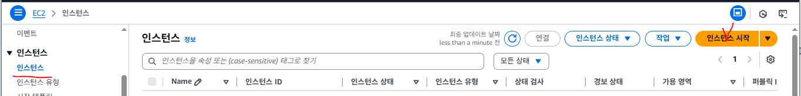

2. IAM 인스턴스 프로파일에 2번에서 만든 역할을 지정한다.

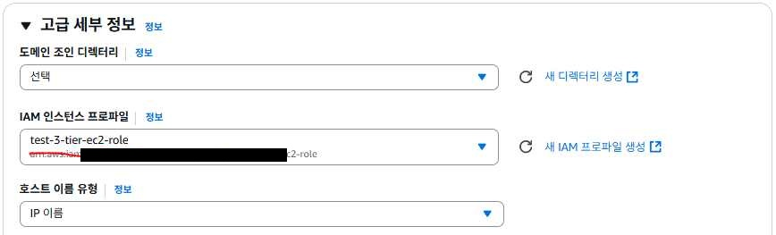

3. 사용자 데이터(User Data)에 다음 스크립트를 등록한다.

```bash
#!/bin/bash
# Apache 웹 서버 설치
dnf install httpd -y

# PHP 8.2, PHP-MySQL 모듈, MariaDB 클라이언트 설치
dnf install -y php8.2 php8.2-mysqlnd mariadb105 wget

# Apache 웹 서버 시작 및 부팅 시 자동 시작 설정
systemctl restart httpd
systemctl enable httpd

# /var/www/html 디렉터리 소유자 변경
chown -R ec2-user:ec2-user /var/www/html

# 워드프레스용 디렉터리 생성
mkdir -p /var/www/html/wordpress

# EFS 마운트 설정 (fstab에 등록해 재부팅 후에도 자동 마운트)
echo "<EFS ID>.efs.ap-northeast-2.amazonaws.com:/ \
/var/www/html/wordpress nfs4 defaults,_netdev 0 0" >> /etc/fstab
mount -a

# 워드프레스 최신 버전 다운로드 및 설치
wget https://wordpress.org/latest.tar.gz || exit 1
tar -xzf latest.tar.gz
cp -r wordpress /var/www/html/
chown -R ec2-user:ec2-user /var/www/html/wordpress
chmod -R 755 /var/www/html/wordpress

# S3에서 wp-config.php 파일 가져오기
aws s3 cp \
  s3://<S3 버킷 이름>/wp-config.php \
  /var/www/html/wordpress \
  --region ap-northeast-2
```

`<EFS ID>`는 6번에서 만든 EFS 파일시스템 ID(`fs-` 로 시작), `<S3 버킷 이름>`은 7번에서 만든 버킷 이름으로 바꿔 넣는다.

4. 인스턴스가 시작되면 퍼블릭 IP로 접속해 워드프레스 설치 마법사를 완료한다: `http://<EC2 퍼블릭 IP>/wordpress/`
   - Site Title, Username, Password, Email을 입력하고 [Install WordPress]를 선택한다.
   - 설치가 끝나면 주소 끝의 `wp-admin/install.php?step=2` 부분을 지우고 `http://<EC2 퍼블릭 IP>/wordpress/`로 다시 접속해 사이트가 정상적으로 뜨는지 확인한다.

## 9. AMI 생성과 시작 템플릿

지금 만든 EC2를 AMI로 만들고 Auto Scaling Group으로 확장한다.

1. 인스턴스를 선택하고 [작업] → [이미지 및 템플릿] → [이미지 생성]을 선택해 AMI를 만든다. IP·보안그룹·서브넷·인스턴스 ID, 그리고 EFS 같은 외부 스토리지의 데이터는 AMI에 포함되지 않는다는 점에 주의한다.
2. EC2 콘솔의 [시작 템플릿]에서 [시작 템플릿 생성]을 선택하고, Amazon Machine Image로 방금 만든 AMI를 지정한다.

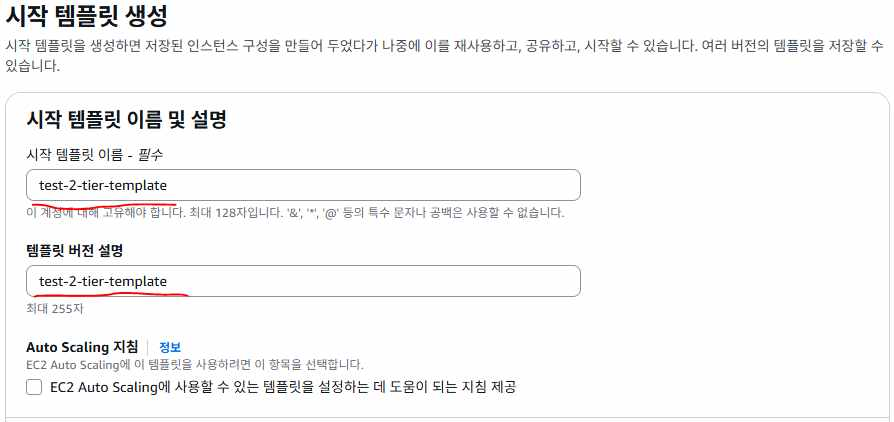

3. 인스턴스 유형(예: `t3.micro`)을 지정하고, 키 페어는 시작 템플릿에 포함하지 않는다(Auto Scaling으로 생성되는 인스턴스는 개별 SSH 접속이 필요 없는 경우가 많다).

## 10. 대상 그룹과 Auto Scaling Group 생성

1. EC2 콘솔의 [대상 그룹]에서 [대상 그룹 생성]을 선택한다. 대상 유형은 [인스턴스], VPC는 3번에서 만든 VPC를 선택한다.

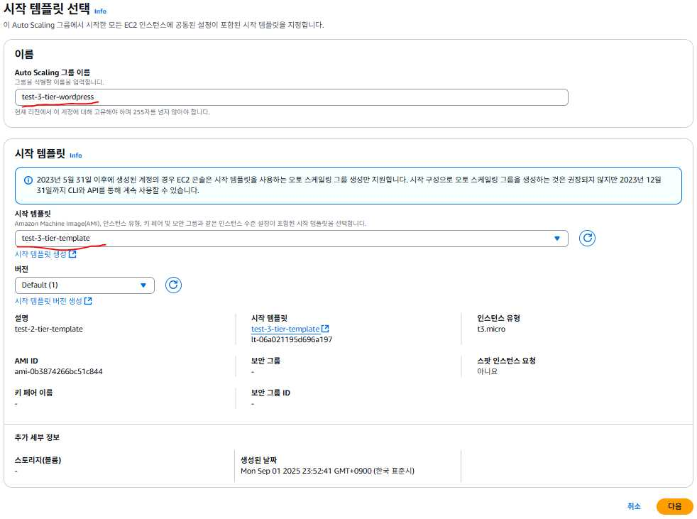

2. 상태 검사 경로를 `/wordpress`로 지정한다. 워드프레스 설치가 끝난 뒤 루트 경로가 302/301로 리다이렉트되는 경우가 있으므로, [고급 상태 검사 설정]에서 성공 코드에 `301`을 추가로 지정한다.
3. [Auto Scaling 그룹]에서 [Auto Scaling 그룹 생성]을 선택하고, 9번에서 만든 시작 템플릿을 지정한다.

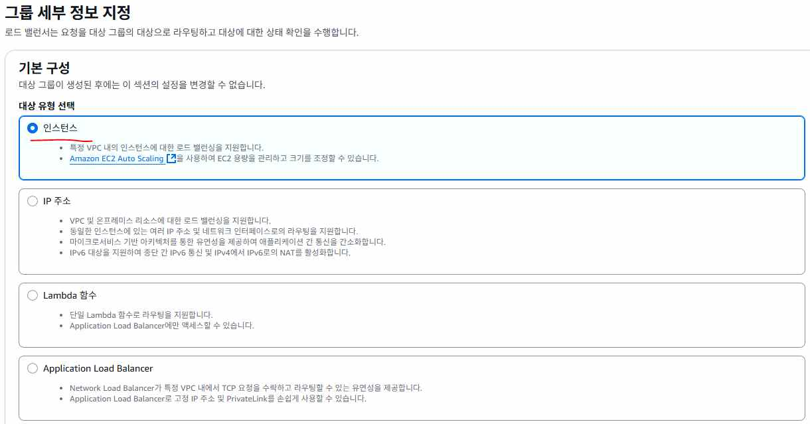

4. VPC와 4개 서브넷(퍼블릭 2개, 프라이빗 2개)을 모두 선택한다.
5. 로드 밸런싱은 [기존 로드 밸런서에 연결]을 선택하고, 방금 만든 대상 그룹을 지정한다. Elastic Load Balancer 상태 확인을 켠다.
6. 원하는 용량 2, 최소 용량 0, 최대 용량 2로 지정하고 그룹을 생성한다.

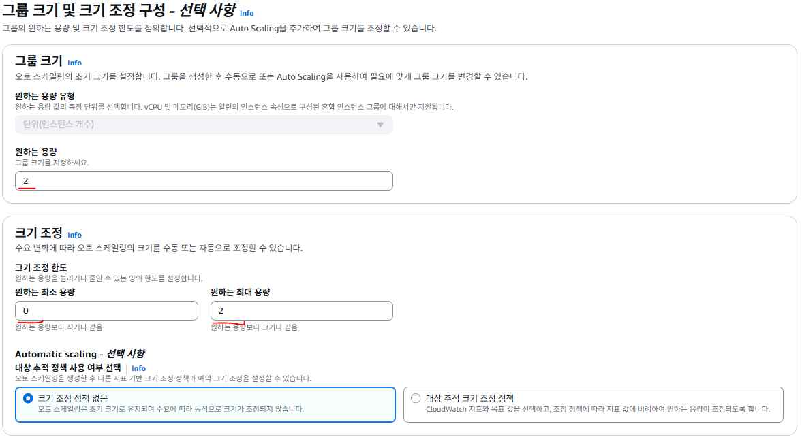

7. 그룹이 생성되면 EC2 인스턴스 2대가 자동으로 만들어지고 대상 그룹에 등록되는 것을 확인할 수 있다.

## 11. ALB 생성 및 접속 확인

1. EC2 콘솔의 [로드밸런서]에서 [로드 밸런서 생성] → [Application Load Balancer]를 선택한다.

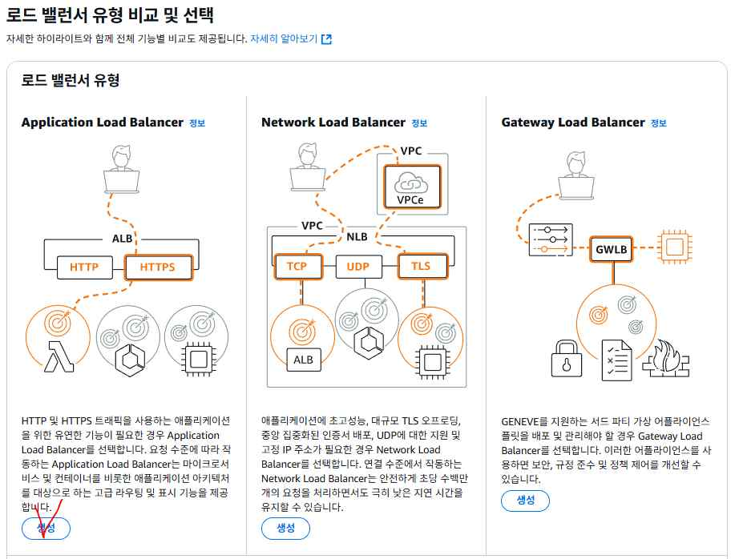

2. VPC는 3번에서 만든 VPC, 서브넷은 두 AZ의 퍼블릭 서브넷을 선택한다.
3. 리스너는 프로토콜 HTTP, 포트 80, 기본 작업은 10번에서 만든 대상 그룹을 지정한다.
4. 로드 밸런서가 활성 상태가 되면 [세부 정보]에서 DNS 이름을 복사해 접속한다: `http://<ALB DNS 이름>/wordpress/`

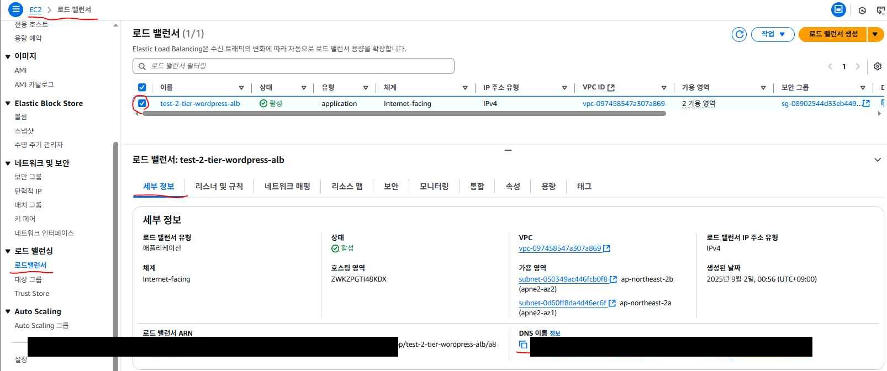

## 12. 트러블슈팅: 사이트 주소가 EC2 IP로 고정되는 문제

ALB DNS로 접속했을 때 콘솔(F12)에 `Failed to load resource`, `CORS policy blocked` 같은 에러가 뜨면서 CSS·JS·폰트가 깨지는 경우가 있다. 화면 자체는 보이지만 부가 리소스만 로드에 실패하는 것이 특징이다.

**원인**

1. 워드프레스는 설치가 완료되는 순간 접속한 주소를 사이트 주소로 데이터베이스에 저장하며, 이후 자동으로 바뀌지 않는다.
2. AMI는 서버 상태(프로그램, 설정 파일, 데이터베이스, 워드프레스 설정 등)를 그대로 복사한다.
3. AMI를 만들기 전에 EC2 퍼블릭 IP로 워드프레스를 설치했다면, 그 IP가 사이트 주소로 저장된 채로 AMI가 만들어지고, 이 AMI로 생성되는 모든 Auto Scaling 인스턴스에 동일한 주소 설정이 복제된다.
4. 이후 사용자는 ALB 주소로 접속하지만 워드프레스에 저장된 사이트 주소는 EC2 IP이므로 서로 달라져, 정적 리소스가 EC2 IP로 요청되면서 CORS 문제로 차단된다.

**해결**

1. 최초 설치한 EC2(퍼블릭 IP)로 워드프레스 관리자 페이지(`/wordpress/wp-admin`)에 로그인한다.
2. [Settings] → [General]에서 **WordPress Address (URL)**과 **Site Address (URL)**을 EC2 IP에서 ALB DNS 주소로 변경한다: `http://<ALB DNS 이름>/wordpress`

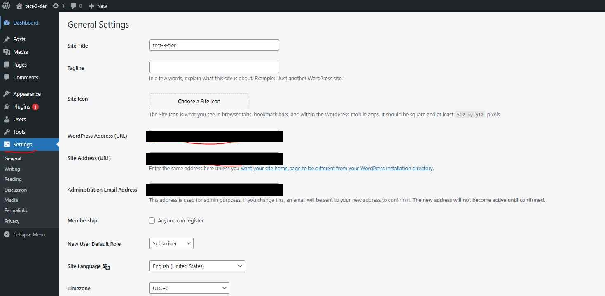

3. 저장한 뒤 ALB 주소로 다시 접속하면 CORS 에러 없이 정상적으로 표시된다.

이 문제를 애초에 피하려면, AMI를 만들기 전에 워드프레스 설치 자체를 ALB DNS 주소로 접속해서 진행하거나, 설치 직후 사이트 주소를 ALB DNS로 먼저 변경한 뒤 AMI를 생성한다.

## 13. 보안 그룹 잠금: EC2 직접 접속 차단

Auto Scaling으로 생성된 인스턴스에 여전히 모든 트래픽을 허용하는 default 보안 그룹이 적용되어 있다면, 사용자가 ALB를 거치지 않고 EC2 퍼블릭 주소로 직접 접속할 수 있는 상태다. 이를 막기 위해 보안 그룹을 2개로 나눠 재구성한다.

1. **ALB 전용 보안 그룹**(예: `wordpress-alb-sg`)을 만들고, 아웃바운드는 HTTP(`0.0.0.0/0`)를 허용한다.

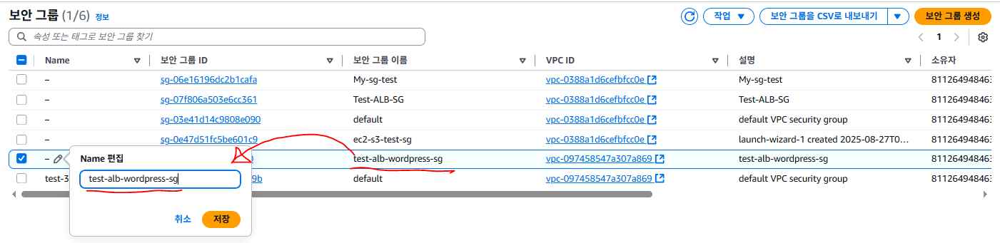

2. **EC2 전용 보안 그룹**(예: `wordpress-ec2-sg`)을 만들고, 인바운드는 HTTP를 ALB 보안 그룹(`sg-xxxxxxxx`)만 소스로 허용한다. SSH가 필요하면 관리자 IP 대역만 별도로 허용한다.
3. 최초 수동 생성한 EC2 인스턴스의 보안 그룹을 EC2 전용 보안 그룹으로 교체하고 default는 제거한다.

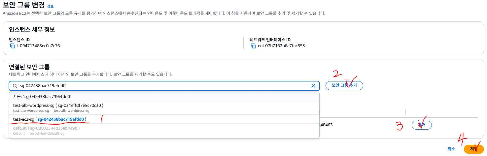
4. 시작 템플릿의 새 버전을 만들어 네트워크 설정의 보안 그룹을 EC2 전용 보안 그룹으로 교체한다.
5. Auto Scaling Group을 편집해 시작 템플릿 버전을 방금 만든 최신 버전(Latest)으로 변경한다. 이제부터 트래픽 증가로 새로 생성되는 인스턴스에는 EC2 전용 보안 그룹이 자동으로 적용된다.
6. ALB의 보안 그룹도 default에서 ALB 전용 보안 그룹으로 교체한다.

설정을 마치면 EC2 퍼블릭 주소로는 접속이 차단되고, ALB를 거친 요청만 EC2에 도달한다.

## 14. Bastion Host를 통한 RDS 데이터 확인(선택)

Bastion Host나 EC2에서 RDS에 직접 접속해 워드프레스 데이터베이스 내용을 확인할 수 있다.

```bash
mariadb -h <RDS 엔드포인트 주소> -u admin -p
```

```sql
SHOW DATABASES;
USE wordpress;
SHOW TABLES;

-- 작성된 게시물 목록 확인
SELECT ID, post_title, post_date FROM wp_posts WHERE post_type='post' ORDER BY ID DESC;
```

워드프레스는 게시물·댓글·사용자 정보를 `wp_posts`, `wp_comments`, `wp_users` 등의 테이블에 저장하며, 관리자 화면에서 새 글을 작성하면 이 테이블에 바로 반영되는 것을 확인할 수 있다.

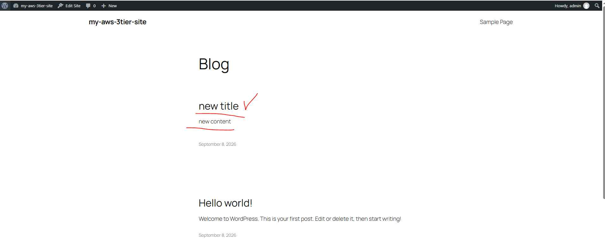

## 15. 리소스 정리

실습을 마친 뒤에는 다음 순서로 리소스를 삭제해 과금을 막는다. 역순으로 삭제하면 다른 리소스가 참조 중이라 삭제가 거부될 수 있다.

1. Auto Scaling 그룹 삭제 (그룹에 속한 EC2 인스턴스가 함께 종료된다.)
2. 로드밸런서 삭제
3. 대상 그룹 삭제
4. RDS 데이터베이스 삭제
5. S3 버킷 삭제
6. 수동으로 만든 EC2 인스턴스 삭제 (Auto Scaling으로 만든 EC2는 1번에서 이미 자동 삭제된다.)
7. EFS 파일 시스템 삭제
8. AMI 등록 취소(삭제)
9. AMI 생성 시 함께 만들어진 스냅샷 삭제

> 관련: 이론 5.  AWS RDS · 이론 4.  AWS S3 · 가이드 6.  AWS ALB + Auto Scaling + 대상 그룹 통합 가이드
