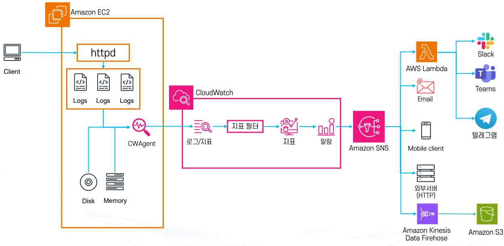

# CloudWatch 실습: EC2 커스텀 지표 수집 및 404 에러 알람 받아보기

이 문서는 EC2에 Apache(httpd)를 설치하고 CloudWatch Agent로 로그·커스텀 지표(메모리, 디스크 사용률)를 수집한 뒤, 404 에러 로그를 지표로 변환해 알람을 받는 과정을 다룬다. 이론 6. AWS CloudWatch와 이어지는 실습이다.

## 1. 전체 구성 개요

전체 흐름은 다음과 같다: 클라이언트 요청 → EC2의 httpd가 Access/Error 로그를 남김 → CloudWatch Agent(CWAgent)가 로그와 OS 지표(디스크·메모리)를 CloudWatch로 전송 → 로그에서 Metric Filter로 404 에러를 지표화 → 지표 기반 알람 생성 → Amazon SNS를 거쳐 Slack·Teams·텔레그램·Email·Lambda·모바일·외부 서버·Kinesis Data Firehose(S3 적재) 등으로 알림이 전달된다.

1. **EC2 환경 준비**: EC2 인스턴스를 생성하고 웹 서버(httpd)를 설치한다. 클라이언트에서 요청이 들어오면 웹 서버는 Access Log, Error Log 등 로그 파일을 남긴다.
2. **CloudWatch Agent 설치 및 설정**: EC2 인스턴스에 CloudWatch Agent(CWAgent)를 설치한다. CWAgent는 EC2의 메모리 사용량·디스크 사용량·CPU·네트워크 등 OS 수준의 지표를 수집하고, EC2 내부 로그 파일(Apache Access Log, Error Log 등)을 CloudWatch로 전송하는 역할을 한다.
3. **Custom Metric 수집**: EC2 기본 지표에는 메모리/디스크 사용량이 포함되지 않으므로, CloudWatch Agent를 통해 Custom Metric을 생성한다(`MemoryUtilization`: % 단위 메모리 사용률, `DiskUsedPercent`: 디스크 사용률). 이 지표들은 CloudWatch 콘솔에서 별도의 Custom Namespace로 확인할 수 있다.
4. **로그 지표화(Log to Metric)**: CloudWatch Logs에 전송된 Apache Access Log를 Metric Filter로 변환한다. 예를 들어 404 에러 로그만 필터링해서 `404ErrorCount`라는 지표를 생성하면, 특정 시간 동안 404가 몇 번 발생했는지 숫자로 집계할 수 있다.
5. **알람 생성(Alarm)**: CloudWatch에서 지표 기반 알람을 설정한다(예: `404ErrorCount >= N`이 분당 발생하면 경보 발생, 또는 메모리 사용량이 80% 이상일 때 알람 발생).
6. **알람 후 처리(SNS 연동)**: 알람이 발생하면 Amazon SNS를 통해 알림이 전달된다. SNS 구독 대상 예시로는 Email(운영자에게 메일 발송), Slack·Teams·Telegram(협업 툴로 실시간 알림), AWS Lambda(자동 대응 스크립트 실행, 예: 서버 확장), Mobile Client(모바일 푸시 알림), 외부 HTTP 서버(서드파티 모니터링 시스템 연동), Amazon Kinesis Data Firehose(로그/지표를 S3로 적재하여 장기 분석)가 있다.



## 2. Apache(httpd) 설치와 로그 디렉터리 준비

EC2 인스턴스에 접속해 Apache를 설치하고, CloudWatch Agent가 수집할 로그 디렉터리를 별도로 만든다.

```bash
# 1) 권한 상승
sudo -s

# 2) Apache HTTP Server 설치 및 기동
dnf install httpd -y
service httpd start          # AL2023에서는 systemctl start httpd 권장
chkconfig httpd on           # AL2023에서는 systemctl enable httpd 권장

# 3) 로그 디렉터리 준비
sudo mkdir -p /var/log/www/error         # 애플리케이션 에러 로그 디렉터리
sudo mkdir -p /var/log/www/access        # 애플리케이션 액세스 로그 디렉터리
```

기본 `/etc/httpd/conf/httpd.conf`를 CloudWatch Agent가 읽기 좋은 JSON 형식 로그가 남도록 수정한 설정 파일로 교체한다. 핵심은 `ErrorLog`/`CustomLog` 경로를 방금 만든 `/var/log/www/` 아래로 지정하고, JSON 형태의 `LogFormat`을 추가로 정의하는 것이다.

```apache
ErrorLog "/var/log/www/error/error_log"
ErrorLogFormat "{\"time\":\"%{%usec_frac}t\", \"function\" : \"[%-m:%l]\",\"process\" : \"[pid%P]\" ,\"message\" : \"%M\"}"

LogLevel warn

LogFormat "%h %l %u %t \"%r\" %>s %b" common
LogFormat "{ \"time\":\"%{%Y-%m-%d}tT%{%T}t.%{msec_frac}tZ\", \"process\":\"%D\", \"filename\":\"%f\", \"remoteIP\":\"%a\", \"host\":\"%V\", \"request\":\"%U\", \"query\":\"%q\",\"method\":\"%m\", \"status\":\"%>s\", \"userAgent\":\"%{User-agent}i\",\"referer\":\"%{Referer}i\"}" cloudwatch

CustomLog "logs/access_log" common
CustomLog "/var/log/www/access/access_log" cloudwatch
```

`cloudwatch` 포맷으로 남긴 access 로그는 한 줄이 JSON 객체이므로, 이후 Metric Filter에서 `{ $.status = "404" }` 같은 JSON 필드 조건으로 바로 필터링할 수 있다.

```bash
# 4) Apache 설정 반영
cp httpd.conf /etc/httpd/conf
service httpd restart
```

## 3. CloudWatch Agent 설치와 설정 적용

```bash
# 5) CloudWatch Agent 설치
sudo dnf install amazon-cloudwatch-agent -y
```

에이전트가 어떤 로그·지표를 수집할지는 JSON 설정 파일로 정의한다. 아래는 Apache 로그 두 종류(access/error)를 CloudWatch Logs로 보내고, 디스크·메모리 사용률과 StatsD 커스텀 지표를 수집하도록 구성한 예시다.

```json
{
  "agent": {
    "metrics_collection_interval": 60
  },
  "logs": {
    "logs_collected": {
      "files": {
        "collect_list": [
          {
            "file_path": "/var/log/www/error/*",
            "log_group_name": "apache/error",
            "log_stream_name": "[{instance_id}]"
          },
          {
            "file_path": "/var/log/www/access/*",
            "log_group_name": "apache/access",
            "log_stream_name": "[{instance_id}]"
          }
        ]
      }
    }
  },
  "metrics": {
    "append_dimensions": {
      "AutoScalingGroupName": "${aws:AutoScalingGroupName}",
      "ImageId": "${aws:ImageId}",
      "InstanceId": "${aws:InstanceId}",
      "InstanceType": "${aws:InstanceType}"
    },
    "metrics_collected": {
      "disk": {
        "measurement": ["used_percent"],
        "metrics_collection_interval": 60,
        "resources": ["*"]
      },
      "mem": {
        "measurement": ["mem_used_percent"],
        "metrics_collection_interval": 60
      },
      "statsd": {
        "metrics_aggregation_interval": 60,
        "metrics_collection_interval": 10,
        "service_address": ":8125"
      }
    }
  }
}
```

`log_stream_name`을 `[{instance_id}]`로 지정하면 여러 인스턴스가 같은 로그 그룹에 로그를 보내더라도 인스턴스별로 스트림이 구분된다. `append_dimensions`는 CloudWatch에 전송되는 지표에 AutoScalingGroupName·ImageId·InstanceId·InstanceType을 차원으로 자동으로 붙여준다.

```bash
# 6) 에이전트 설정 적용 및 시작
sudo /opt/aws/amazon-cloudwatch-agent/bin/amazon-cloudwatch-agent-ctl \
  -a fetch-config -m ec2 -s -c file:/home/ec2-user/EnablePHPCloudwatchlog.json
#   -a fetch-config : 설정을 가져오거나 로컬 파일을 읽어 반영하는 액션
#   -m ec2          : 실행 환경이 EC2임을 지정
#   -s               : 설정 적용 후 서비스를 즉시 시작
#   -c file:...      : 업로드한 에이전트 설정 JSON을 사용
# amazon-cloudwatch-agent-ctl이 위 JSON을 읽어서 설정을 적용하고, 그 설정대로 CloudWatch Agent가 동작한다.

# 7) 서비스 상태 보장 (위 -s가 시작까지 해주지만, 시작 상태를 보장하기 위해 한 번 더 실행)
sudo systemctl start amazon-cloudwatch-agent
```

## 4. 404 에러 로그를 지표로 변환하기 (Metric Filter)

CloudWatch Logs로 전송된 `apache/access` 로그 그룹에서 `status` 필드가 `"404"`인 로그만 걸러내는 Metric Filter를 만든다.

```text
{ $.status = "404" }
```

Metric Filter 조건은 상황에 따라 다양하게 조합할 수 있다.

```text
# status 값이 400, 404, 500 중 하나라도 맞으면 매칭
{ $.status = 400 || $.status = 404 || $.status = 500 }

# status 값이 4xx 전 범위 매칭 (숫자로 기록될 때만 가능)
{ $.status >= 400 && $.status < 500 }

# status 값이 500이면서 메서드가 GET인 로그만
{ $.status = 500 && $.method = "GET" }
```

Metric Filter를 생성할 때 지정하는 값들의 의미는 다음과 같다.

- **필터링 이름**(예: `My-WEB-404-NAMESPACE`): 이 Metric Filter 자체를 구분하기 위한 관리용 이름이며, 실제 지표 이름은 아니다.
- **지표 네임스페이스**: 생성되는 Custom Metric이 들어갈 분류로, CloudWatch → Metrics에서 이 Namespace 아래에 지표가 생성된다.
- **지표 이름**(예: `WEB-404`): 실제로 생성되는 CloudWatch Metric의 이름이며, 나중에 알람을 만들 때 이 지표를 선택한다.
- **지표 값**(예: `1`): 필터 패턴과 일치하는 로그 1건마다 지표에 더할 값이다. 즉 404 로그가 1개 발견될 때마다 지표 값이 1씩 증가한다.

```text
404 로그 1개 → +1   (5회 반복)

결과
test-404-metric = 5
```

## 5. 알람 생성과 확인

`WEB-404` 지표를 기준으로 CloudWatch 알람을 만든다. 예를 들어 1분 동안 404 로그가 N건 이상 발생하면 `ALARM` 상태로 전환되도록 임계치를 지정한다. 알람 상태는 OK(정상), ALARM(경보), INSUFFICIENT_DATA(데이터 부족) 세 가지로 나뉘며, ALARM 상태가 되면 연결된 SNS 주제를 통해 구독자에게 알림이 전달된다.

## 6. 참고: 수집되는 주요 지표

CloudWatch Agent와 EC2 기본 지표로 아래와 같은 항목을 함께 관찰할 수 있다.

**상태/헬스체크**

- `StatusCheckFailed`(0 또는 1): 인스턴스 상태 점검 실패의 종합 결과(아래 두 개 중 하나라도 실패하면 1).
- `StatusCheckFailed_System`(0/1): AWS 인프라 측 문제로 인스턴스에 접근 불가(호스트 장애, 네트워크/전원 등).
- `StatusCheckFailed_Instance`(0/1): OS 내부 문제로 에이전트/네트워크 응답 없음(커널 패닉, 과부하 등).

**CPU & 버스트 크레딧(T 계열 전용)**

- `CPUUtilization`(%): vCPU 사용률(평균). 지속적으로 높으면 과부하/스케일 필요 신호.
- `CPUCreditUsage`(크레딧/기간): 해당 기간 동안 쓴 CPU 크레딧 개수.
- `CPUCreditBalance`(크레딧): 남아 있는 CPU 크레딧 잔액. 0 근처면 성능이 베이스라인으로 제한될 수 있음.
- `CPUSurplusCreditBalance`(크레딧, Unlimited 모드): 잔액 0인데 추가로 쓴 초과 크레딧 누적치(아직 요금 청구 전).
- `CPUSurplusCreditsCharged`(크레딧, Unlimited 모드): 요금 청구된 초과 크레딧(비용 발생).

**네트워크**

- `NetworkIn` / `NetworkOut`(Bytes): 수신/송신 바이트 수. 대역폭 사용량 트렌드 파악.
- `NetworkPacketsIn` / `NetworkPacketsOut`(패킷 수): 초당/기간당 패킷 개수. 작은 페이로드 트래픽 특징 파악에 유용.

**EBS(블록 스토리지) 관측치**

- `EBSReadBytes` / `EBSWriteBytes`(Bytes): EBS로부터 읽은(쓴) 바이트 수. "얼마나 많이 읽고/썼냐"는 용량(바이트) 합계.
- `EBSReadOps` / `EBSWriteOps`(IOPS, 요청 수): 읽기/쓰기 I/O 요청 개수. "몇 번 읽고/썼냐"는 요청(횟수) 합계.

> 관련: 이론 6. AWS CloudWatch · 이론 2. AWS EC2 - 배포 · 가이드 3. AWS EC2 설정
