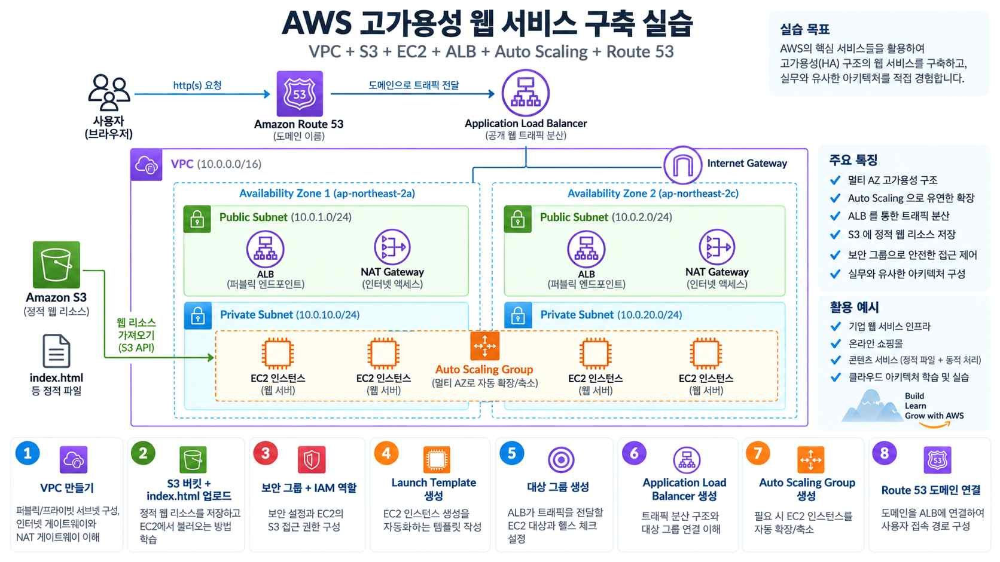

# VPC부터 Route 53까지: 고가용성 웹 서비스 구축

이 문서는 VPC·S3·EC2·ALB·Auto Scaling·Route 53을 처음부터 함께 구성하여, 멀티 AZ 기반 고가용성(HA) 웹 서비스를 만드는 종합 실습이다. 각 구성요소의 개념은 이론 3. AWS VPC, 이론 4. AWS S3, 이론 2. AWS EC2 - 배포, 이론 11. Amazon Route 53 문서를 참고한다.



## 1. 아키텍처 개요

- 사용자 요청은 `Route 53 --> ALB --> Target Group --> EC2(Auto Scaling Group) --> Apache --> index.html` 순서로 처리된다.
- EC2 인스턴스는 Public Subnet이 아닌 **Private Subnet**에 배치하고, 외부 접근은 ALB만 허용한다.
- Private Subnet의 EC2가 인터넷(S3 API 호출 등)에 나갈 때는 **NAT Gateway**를 경유한다.
- 웹 페이지 리소스(`index.html`)는 S3 버킷에 저장해 두고, EC2가 부팅 시 IAM 역할 권한으로 다운로드한다.

## 2. VPC 및 서브넷 구성

1. VPC 콘솔 왼쪽 탐색 메뉴의 [VPC]에서 [VPC 생성]을 선택한다.
2. 생성할 리소스는 [VPC만]을 선택하고, 이름 태그에 `my-web-vpc`를 입력한다.
3. IPv4 CIDR 블록에 `10.0.0.0/16`을 입력하고 [VPC 생성]을 선택한다.
4. VPC 콘솔 왼쪽 탐색 메뉴의 [서브넷]에서 [서브넷 생성]을 선택한다.
5. VPC ID에서 방금 만든 `my-web-vpc`를 선택한다.
6. [새 서브넷 추가]를 눌러 아래 4개의 서브넷을 한 번에 입력하고 [서브넷 생성]을 선택한다.

| 서브넷 | CIDR | 가용 영역 |
|---|---|---|
| public-subnet-a | 10.0.1.0/24 | AZ-a |
| public-subnet-b | 10.0.2.0/24 | AZ-b |
| private-subnet-a | 10.0.3.0/24 | AZ-a |
| private-subnet-b | 10.0.4.0/24 | AZ-b |

- Public Subnet 2개는 서로 다른 가용 영역에 배치한다.
- Private Subnet 2개도 서로 다른 가용 영역에 배치한다.
- ALB는 Public Subnet에 배치한다.
- Auto Scaling으로 생성되는 EC2는 Private Subnet에 배치한다.

## 3. 인터넷 게이트웨이와 퍼블릭 라우팅

1. VPC 콘솔 왼쪽 탐색 메뉴의 [인터넷 게이트웨이]에서 [인터넷 게이트웨이 생성]을 선택하고 이름을 입력한 뒤 생성한다.
2. 생성된 인터넷 게이트웨이 상세 화면에서 [작업] → [VPC에 연결]을 선택하고, `my-web-vpc`를 선택해 연결한다.
3. VPC 콘솔 왼쪽 탐색 메뉴의 [라우팅 테이블]에서 [라우팅 테이블 생성]을 선택한다. 이름은 `public-rt`, VPC는 `my-web-vpc`로 지정한다.
4. 생성한 라우팅 테이블 상세 화면의 [라우팅] 탭에서 [라우팅 편집]을 선택하고, 다음 경로를 추가한다.
   - Destination: `0.0.0.0/0`
   - Target: 방금 만든 인터넷 게이트웨이
5. 같은 상세 화면의 [서브넷 연결] 탭에서 [서브넷 연결 편집]을 선택하고, `public-subnet-a`와 `public-subnet-b`를 체크한 뒤 저장한다.

## 4. NAT Gateway와 프라이빗 라우팅

Private Subnet의 EC2가 인터넷으로 나갈 수 있도록 NAT Gateway를 구성한다.

1. VPC 콘솔 왼쪽 탐색 메뉴의 [NAT 게이트웨이]에서 [NAT 게이트웨이 생성]을 선택한다.
2. 서브넷은 `public-subnet-a`를 선택하고, 연결 유형은 [퍼블릭]을 선택한다.
3. 탄력적 IP 할당 ID에서 [탄력적 IP 할당]을 눌러 새 Elastic IP를 발급받은 뒤 [NAT 게이트웨이 생성]을 선택한다.
4. VPC 콘솔 왼쪽 탐색 메뉴의 [라우팅 테이블]에서 [라우팅 테이블 생성]을 선택한다. 이름은 `private-rt`, VPC는 `my-web-vpc`로 지정한다.
5. 생성한 라우팅 테이블의 [라우팅] 탭 → [라우팅 편집]에서 다음 경로를 추가한다.
   - Destination: `0.0.0.0/0`
   - Target: 방금 만든 NAT Gateway
6. [서브넷 연결] 탭 → [서브넷 연결 편집]에서 `private-subnet-a`와 `private-subnet-b`를 체크한 뒤 저장한다.

## 5. S3 버킷 구성

1. S3 콘솔에서 [버킷 만들기]를 선택한다.
2. 버킷 이름을 전역 고유 이름으로 입력한다(예: `my-web-vpc-static-<임의 문자열>`).
3. 퍼블릭 액세스 차단 설정은 기본값인 [모든 퍼블릭 액세스 차단]을 그대로 유지한 채 [버킷 만들기]를 선택한다.
4. 생성된 버킷으로 들어가 [업로드] → [파일 추가]에서 `index.html`을 선택하고 업로드한다.

- S3 버킷은 외부에 공개하지 않는다.
- Block Public Access는 활성화 상태로 유지한다.
- EC2는 버킷을 퍼블릭으로 열지 않고, 뒤에서 구성할 IAM 역할 권한으로만 파일을 읽는다.

## 6. IAM 역할 구성

1. IAM 콘솔 왼쪽 탐색 메뉴의 [역할]에서 [역할 생성]을 선택한다.
2. 신뢰할 수 있는 엔터티 유형은 [AWS 서비스], 사용 사례는 [EC2]를 선택하고 [다음]을 누른다.
3. 권한 정책 검색창에 `AmazonS3ReadOnlyAccess`를 입력해 체크하고 [다음]을 누른다.
4. 역할 이름에 `EC2-S3-Role`을 입력하고 [역할 생성]을 선택한다.

## 7. 보안 그룹 구성

1. VPC 콘솔 왼쪽 탐색 메뉴의 [보안 그룹]에서 [보안 그룹 생성]을 선택한다.
2. 보안 그룹 이름 `ALB-SG`, VPC는 `my-web-vpc`를 지정하고, 인바운드 규칙에 [규칙 추가]로 아래 항목을 추가한 뒤 생성한다.
   - Protocol: HTTP / Port: 80 / Source: `0.0.0.0/0`
3. 같은 방식으로 [보안 그룹 생성]을 다시 선택해 `EC2-SG`를 만든다. 인바운드 규칙의 소스 유형에서 [사용자 지정]을 선택하고 검색창에 `ALB-SG`를 입력해 지정한 뒤 생성한다.
   - Protocol: HTTP / Port: 80 / Source: `ALB-SG`

EC2-SG의 Source를 IP 대역이 아닌 ALB-SG로 지정하면, ALB를 거치지 않은 트래픽은 차단되고 ALB를 통한 트래픽만 자동으로 허용된다.

## 8. 시작 템플릿(Launch Template) 생성

1. EC2 콘솔 왼쪽 탐색 메뉴의 [인스턴스] 하위 [시작 템플릿]에서 [시작 템플릿 생성]을 선택한다.
2. 시작 템플릿 이름을 입력한다.
3. 애플리케이션 및 OS 이미지에서 [Amazon Linux 2023]을 선택하고, 인스턴스 유형은 `t3.micro`를 선택한다.
4. 네트워크 설정의 보안 그룹에서 앞서 만든 `EC2-SG`를 선택한다.
5. 고급 세부 정보를 펼쳐 IAM 인스턴스 프로필에서 `EC2-S3-Role`을 선택한다.
6. 같은 화면의 사용자 데이터(User Data)란에 아래 스크립트를 입력하고 [시작 템플릿 생성]을 선택한다.

사용자 데이터(User Data)를 이용해 EC2가 생성될 때 다음 작업이 자동으로 수행되도록 구성한다.

1. httpd 설치
2. httpd 서비스 시작
3. httpd 부팅 시 자동 시작
4. S3에서 `index.html` 다운로드
5. 자신의 EC2 Instance ID 확인
6. `index.html` 하단에 Instance ID 추가

```bash
#!/bin/bash
dnf install -y httpd
systemctl start httpd
systemctl enable httpd

aws s3 cp s3://<S3 버킷 이름>/index.html /var/www/html/index.html

INSTANCE_ID=$(curl -s http://169.254.169.254/latest/meta-data/instance-id)
echo "<hr><h3>Instance ID: $INSTANCE_ID</h3>" >> /var/www/html/index.html
```

예상 결과는 다음과 같은 형태로 출력된다.

```html
<h1>Soldesk AWS Web Service</h1>
<hr>
<h3>Instance ID: i-xxxxxxxxxxxxxxxxx</h3>
```

## 9. 대상 그룹(Target Group) 생성

1. EC2 콘솔 왼쪽 탐색 메뉴의 [로드 밸런싱] 하위 [대상 그룹]에서 [대상 그룹 생성]을 선택한다.
2. 대상 유형은 [인스턴스]를 선택한다.
3. 대상 그룹 이름을 입력하고, 프로토콜은 HTTP, 포트는 80, IP 주소 유형은 IPv4로 지정한다.
4. VPC는 `my-web-vpc`를 선택한다.
5. 상태 검사(Health Check) 항목을 펼쳐 상태 검사 경로에 `/index.html`을 입력하고 [다음]을 선택한다.
6. 이 단계에서는 아직 개별 인스턴스를 등록하지 않고 [대상 그룹 생성]을 선택한다. Auto Scaling 그룹 생성 시 이 대상 그룹을 지정하면 인스턴스가 자동으로 등록된다.

## 10. Application Load Balancer 생성

1. EC2 콘솔 왼쪽 탐색 메뉴의 [로드 밸런싱] 하위 [로드밸런서]에서 [로드 밸런서 생성]을 선택하고 [Application Load Balancer]의 [생성]을 선택한다.
2. 로드 밸런서 이름을 입력하고, 체계는 [Internet-facing]을 선택한다.
3. VPC는 `my-web-vpc`를 선택하고, 매핑에서 `public-subnet-a`, `public-subnet-b`를 체크한다.
4. 보안 그룹에서 `ALB-SG`를 선택한다(기본 선택된 보안 그룹은 제거한다).
5. 리스너 및 라우팅에서 프로토콜 HTTP·포트 80을 기본값으로 두고, 기본 작업의 대상 그룹은 9단계에서 만든 대상 그룹을 선택한다.
6. [로드 밸런서 생성]을 선택한다. 생성 직후에는 프로비저닝 중 상태로 표시되며, 완료되면 활성 상태로 바뀐다.

## 11. Auto Scaling 그룹 생성

1. EC2 콘솔 왼쪽 탐색 메뉴의 [Auto Scaling] 하위 [Auto Scaling 그룹]에서 [Auto Scaling 그룹 생성]을 선택한다.
2. 그룹 이름을 입력하고, 시작 템플릿에서 8단계에서 만든 템플릿을 선택한다.
3. 네트워크 설정에서 VPC는 `my-web-vpc`, 가용 영역 및 서브넷은 `private-subnet-a`, `private-subnet-b`를 선택한다.
4. 로드 밸런싱 옵션에서 [기존 로드 밸런서에 연결]을 선택하고, 대상 그룹에서 9단계에서 만든 대상 그룹을 선택한다. "ELB 상태 검사 사용" 옵션도 함께 체크한다.
5. 그룹 크기에서 아래 용량을 입력하고 [Auto Scaling 그룹 생성]을 선택한다.

용량 설정

- Desired Capacity: 2
- Minimum Capacity: 3
- Maximum Capacity: 5

## 12. Route 53 구성

1. Route 53 콘솔 왼쪽 탐색 메뉴의 [호스팅 영역]에서 사용할 도메인의 Hosted Zone을 선택한다(신규 도메인이라면 [호스팅 영역 생성]으로 먼저 만든다).
2. [레코드 생성]을 선택한다.
3. 레코드 이름에 서브도메인을 입력한다(예: `web`).
4. 레코드 유형은 [A – IPv4 주소와 일부 AWS 리소스로 라우팅]을 선택한다.
5. [별칭] 토글을 켜고, 엔드포인트 선택에서 [Application Load Balancer 및 Classic Load Balancer에 대한 별칭]을 선택한다.
6. 리전을 선택하고, 로드 밸런서 목록에서 10단계에서 만든 ALB를 선택한다.
7. [레코드 생성]을 선택한다.
   - 예) `web.example.com --> ALB`

생성한 도메인을 웹 브라우저에서 접속하여 웹 페이지가 정상적으로 출력되는지 확인한다. APEX 도메인에도 연결할 수 있는 이유와 Alias Record의 동작 방식은 이론 11. Amazon Route 53 문서를 참고한다.

## 13. 서비스 동작 확인

1. ALB의 DNS 이름을 확인하고 웹 브라우저로 접속한다(예: `http://ALB-DNS-NAME`).
2. 페이지에 `Instance ID: i-xxxxxxxxxxxxxxxxx`가 출력되는지 확인한다.
3. 브라우저에서 여러 번 새로고침하여 Instance ID가 바뀌는지 확인한다. ID가 바뀌면 ALB가 여러 EC2로 트래픽을 정상적으로 분산하고 있다는 뜻이다.

## 14. HTTP Access Log 확인

Auto Scaling으로 생성된 각 EC2에 접속하여 Apache Access Log를 확인한다.

```bash
tail -f /var/log/httpd/access_log
```

ALB 주소로 여러 번 접속하거나 새로고침한 후 각 EC2의 로그에 요청이 분산되어 기록되는지 확인한다.

## 15. 전체 트래픽 흐름

사용자가 `http://web.example.com`으로 접속했다고 가정하면, 요청은 다음 순서로 처리된다.

```text
사용자 --> Route 53 --> ALB --> Target Group --> EC2 --> Apache --> index.html --> 사용자에게 웹 페이지 반환
```

## 16. 장애 테스트

Auto Scaling 그룹에서 실행 중인 EC2 인스턴스 중 1대를 강제로 종료하고 다음을 확인한다.

1. 대상 그룹에서 종료된 인스턴스의 상태 변화
2. Auto Scaling 그룹에서 새로운 EC2 생성 여부
3. Desired Capacity가 다시 2개로 유지되는지 확인
4. 새 EC2가 대상 그룹에 자동 등록되는지 확인
5. Health Check 통과 후 ALB가 새로운 EC2로 트래픽을 전달하는지 확인

## 17. 리소스 정리

과금을 막으려면 다음 순서로 리소스를 삭제한다. 역순으로 삭제하면 다른 리소스가 참조 중이라 삭제가 거부될 수 있다.

1. Route 53의 A 레코드를 삭제한다.
2. Auto Scaling 그룹을 삭제한다(그룹에 속한 EC2 인스턴스가 함께 종료된다).
3. Application Load Balancer를 삭제한다.
4. 대상 그룹을 삭제한다.
5. 시작 템플릿을 삭제한다.
6. NAT Gateway를 삭제하고, 연결된 Elastic IP를 해제한다.
7. Internet Gateway를 VPC에서 분리한 뒤 삭제한다.
8. `EC2-SG`, `ALB-SG` 보안 그룹을 삭제한다.
9. `EC2-S3-Role` IAM 역할을 삭제한다.
10. S3 버킷의 객체를 비우고 버킷을 삭제한다.
11. 서브넷과 VPC를 삭제한다.

> 관련: 이론 11. Amazon Route 53 · 이론 3. AWS VPC · 이론 4. AWS S3 · 가이드 6. AWS ALB + Auto Scaling + 대상 그룹 통합 가이드
