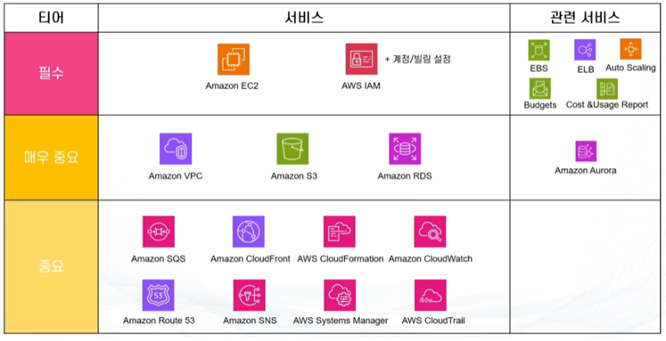
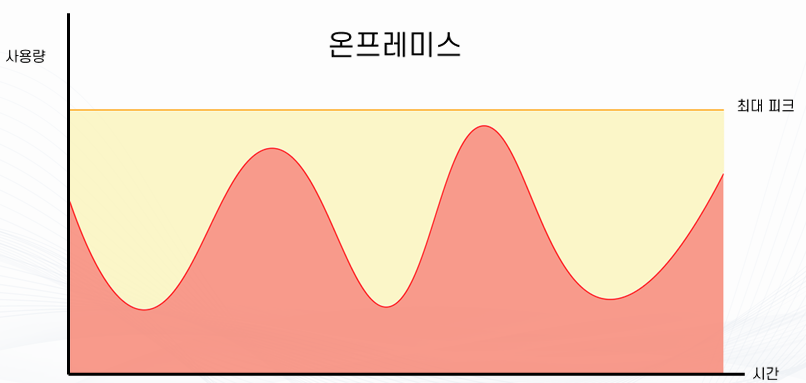
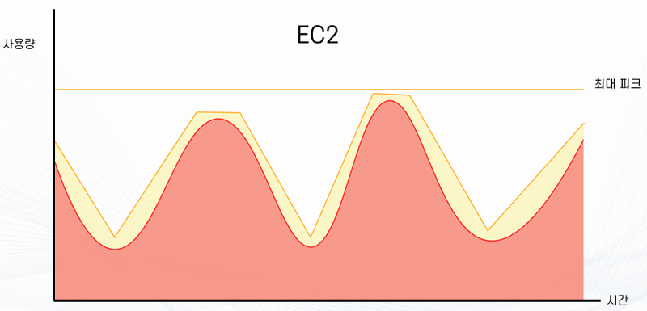
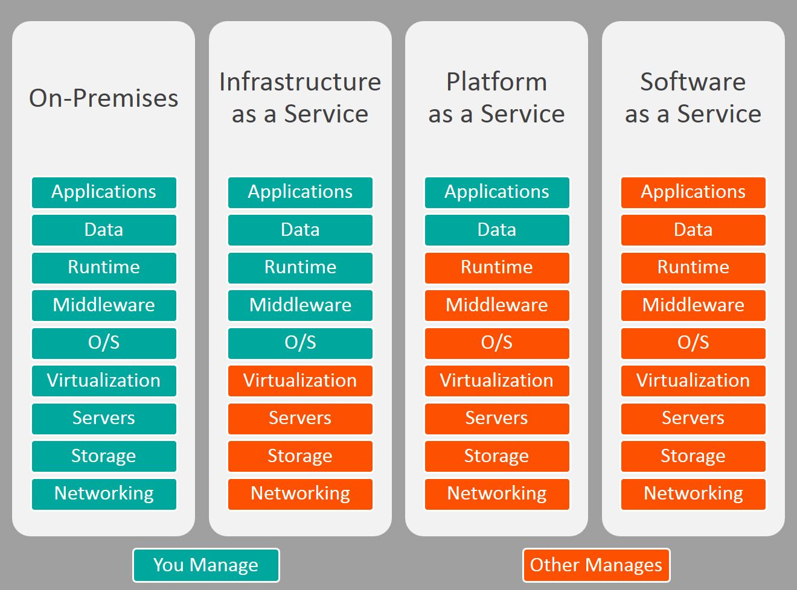
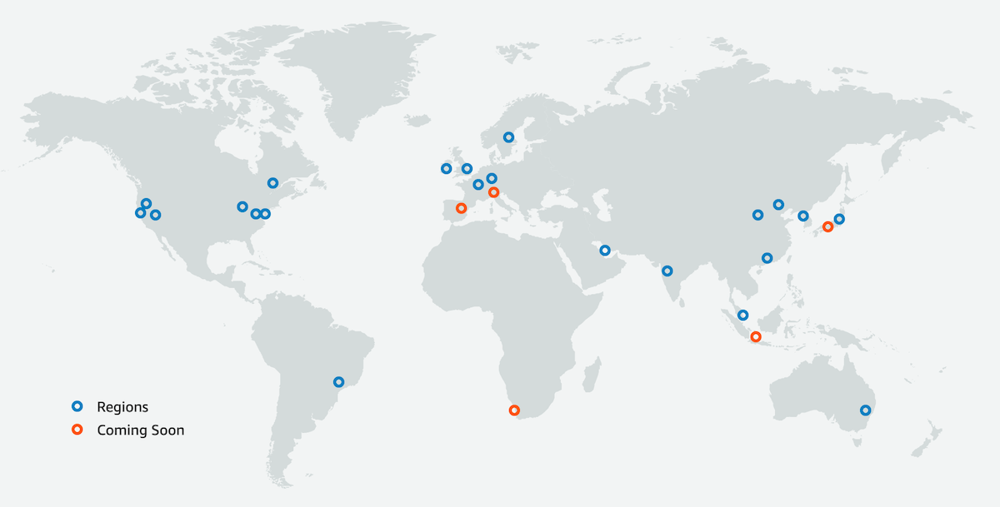
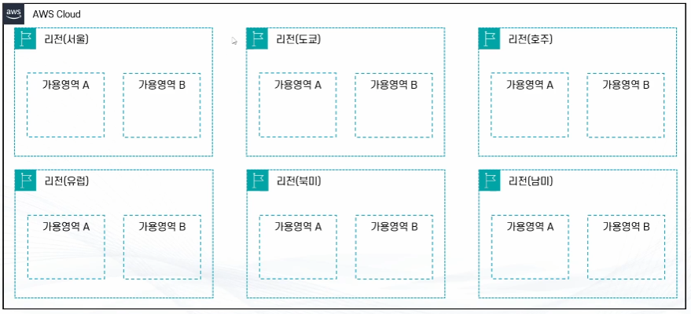
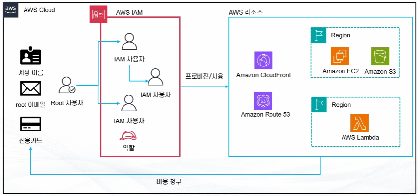
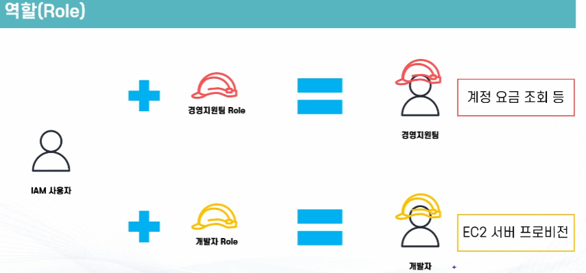

# AWS 클라우드 기초 개념 - 강의 노트

AWS 강의 노트(HWP) 원본을 이미지와 설정 코드, 주석까지 그대로 옮긴 문서다. 정리본은 이론·가이드 문서를 함께 본다.

## AWS

Amazon Web Services(AWS)는 전 세계적으로 분포한 데이터 센터에서 300개가 넘는 완벽한 기능의 서비스를 제공하는,
세계적으로 가장 포괄적이며, 널리 채택되고 있는 클라우드입니다.
빠르게 성장하는 스타트업, 가장 큰 규모의 엔터프라이즈, 주요 정부 기관을 포함하여
수백만 명의 고객이 AWS를 사용하여 비용을 절감하고, 민첩성을 향상시키고 더 빠르게 혁신하고 있다.

- AWS란?
  - Amazon에서 제공하는 클라우드 컴퓨팅 플랫폼
  - 소규모 스타트업부터 초거대 대기업까지 사용하는 글로벌 클라우드 플랫폼
  - 국내 점유율 1위
  - 전세계 점유율 1위 (지역에 따라 다름)

- AWS를 배워야 하는 이유
  - 대한민국 기준 가장 점유율이 높은 클라우드 프로바이더 (60.2%, 2023년 기준)
  - 많이 사용 -> 많은 레퍼런스, 많은 커뮤니티, 많은 리소스
  - 다양한 서비스와 지속적인 업데이트

제공자(업체)   아마존(AWS)   MS Azure   구글(GCP)   네이버   KT   NHN   삼성SDS   IBM   Oracle   기타

```
비중 (%)          60.2          24.0        19.9      20.5     8.2   7.0      1.2      0.6    8.2     1.4
```



- 클라우드 : 빌려 쓰기
- 클라우드 컴퓨팅: 컴퓨팅 빌려 쓰기
- EC2: 컴퓨팅을 빌려 쓰는 서비스

## EC2 (Elastic Compute Cloud)

- EC2는 AWS에서 제공하는 가상 서버 서비스다.
- 필요한 순간에 서버를 만들고, CPU, 메모리, 디스크, 네트워크를 원하는 만큼 선택해서 사용할 수 있다.
- 물리 서버를 직접 구매, 설치, 관리하지 않아도 된다.
- EC2를 한 문장으로 정리하면 클라우드 위에서 필요한 만큼 빌려 쓰는 리눅스/윈도우 서버다.

  - EC2의 핵심 개념

1) 인스턴스(Instance)

- EC2에서 실행되는 가상 서버 한 대 (실제로 접속해서 사용하는 대상)

2) 인스턴스 타입(Instance Type)
  - 서버의 성능 묶음
  - CPU, 메모리, 네트워크 성능이 미리 정해져 있다.
*EX) t3.micro: 실습, 테스트용
*EX) t3.small: 가벼운 웹 서버
*EX) m5.large: 일반적인 서비스
*EX) c 계열: CPU 중심
*EX) r 계열: 메모리 중심

## AWS IAM

  - AWS의 보안 및 관리를 담당하는 글로벌 서비스

- 주요 기능
  - AWS 어카운트 관리 및 리소스/사용자/서비스의 권한 제어
  - 임시 권한 부여
  - 서비스 사용을 위한 인증 정보 부여
  - 사용자의 생성, 관리, 계정의 보안
  - Multi-factor Authentication
  - 사용자의 패스워드 정책 관리

## VPC (Virtual Private Cloud)

- VPC(Virtual Private Cloud)는 AWS 안에 만드는 나만의 독립된 가상 네트워크다.
- EC2 같은 서버들이 아무 네트워크에 막 붙는 게 아니라, 반드시 VPC 안에 들어가서 통신한다.

- 왜 VPC가 필요한가
  - 모든 서버를 외부 인터넷에 바로 노출하면 위할 수 있다.
  - 서비스별로 네트워크를 분리해야 함
  - IP 대역, 접근 경로, 보안을 직접 제어해야 함
  - 그래서 AWS는 EC2보다 먼저 VPC부터 설계하게 만든다.

  - VPC의 핵심 구성 요소

1) CIDR 블록 (IP 대역)

- VPC를 만들 때 가장 먼저 정한다.
  - 예시 10.0.0.0/16
  - 예시 172.16.0.0/16
  - 이 VPC 안에서 사용할 수 있는 IP 범위
  - 실무에서는 보통 사설 IP 대역을 쓴다.

```
2) 서브넷 (Subnet)
```

- VPC 안을 쪼갠 네트워크 구역이다.

- 역할
  - 서버를 배치하는 실제 공간
  - 가용 영역(AZ) 단위로 생성

- 퍼블릭 서브넷
  - 인터넷과 직접 통신 가능
  - 웹 서버, 로드밸런서 배치

- 프라이빗 서브넷
  - 인터넷 직접 접근 불가
  - DB, 내부 서버 배치

- 서브넷이 없으면 EC2를 만들 수 없다.

3) 인터넷 게이트웨이 (Internet Gateway)

- VPC가 인터넷과 통신할 수 있게 해주는 출입문이다.
- 퍼블릭 서브넷에서 필수
- 프라이빗 서브넷에는 직접 연결하지 않는다.

- 주의
  - 인터넷 게이트웨이를 붙였다고 해서 모든 서버가 인터넷에 노출되지는 않는다.
  - 라우팅 설정이 있어야 한다.

4) 라우트 테이블 (Route Table)

- 네트워크의 길 안내 표지판이다.

- 의미
  - 목적지 IP --> 어디로 보낼지 결정
  - 예시 : 0.0.0.0/0 --> Internet Gateway
  - 인터넷으로 나가는 길

  - 예시 : 10.0.0.0/16 --> local
  - VPC 내부 통신

  - 서브넷은 반드시 하나의 라우트 테이블에 연결된다.

5) NAT 게이트웨이

- 프라이빗 서브넷 서버가 인터넷으로 나갈 수 있게 해주는 중계 장치

- 특징
  - 외부에서 프라이빗 서버로 직접 접속 불가
  - 내부에서 업데이트, 패키지 다운로드 가능
  - DB 서버가 인터넷 패키지 업데이트는 필요하지만 외부 접속은 막고 싶을 때 사용한다.

```
6) 보안 그룹 (Security Group)
```

- EC2 단위로 적용되는 방화벽이다.

- 특징
  - 허용 규칙만 설정
  - 상태 저장(Stateful)
  - 예시 22번 포트: 내 IP만 허용
  - 예시 80번 포트: 전체 허용

7) 네트워크 ACL (NACL)

- 서브넷 단위 방화벽이다.

- 특징
  - 예시 허용 + 거부 규칙
  - 예시 상태 비저장(Stateless)

- 보통은 보안 그룹만으로 충분해서 NACL은 기본값으로 두는 경우가 많다.

## S3 (Simple Storage Service)

- S3는 AWS에서 제공하는 객체 스토리지 서비스다.
- 파일을 서버 디스크처럼 붙여 쓰는 방식이 아니라, 버킷(bucket) 안에 객체(object) 형태로 저장하고 URL로 접근한다.
- 서버가 없어도 파일을 저장, 조회, 공유할 수 있는 저장소다.

  - S3의 기본 구조

```
1) 버킷(Bucket)
```

- S3의 최상위 컨테이너
- 파일을 담는 그릇
- 전 세계적으로 이름이 유일해야 한다. (버킷 이름 + 계정 ID를 사용한다.)
- 버킷은 리전 단위로 생성된다.

```
2) 객체(Object)
```

- S3에 저장되는 실제 파일
- 파일 데이터 + 메타데이터 + 키(Key)
- 객체는 수정 개념이 없다.
- 바꾸면 새 객체가 된다.

```
3) 키(Key)
```

- 객체의 경로 역할
- 폴더처럼 보이지만 실제로는 문자열
- 예시 images/logo.png
- S3에는 실제 디렉터리가 없다.

- S3의 주요 특징
  - 무제한 확장
  - 저장 용량 제한 없음
  - 파일 개수 제한 없음
  - 고가용성, 내구성
  - 여러 물리적 위치에 자동 복제
  - 데이터 내구성 99.999999999%
  - 서버 관리 불필요
  - OS 없음
  - 패치 없음
  - 디스크 관리 없음

## Amazon Route 53란 무엇인가

- Route 53은 AWS에서 제공하는 DNS(Domain Name System) 서비스다.
- 사람이 기억하기 쉬운 도메인 이름을 실제 서버의 IP 주소로 변환해 주고, 트래픽을 어떤 서버로 보낼지까지 제어한다.
- 전화번호부에 비유하면 이름을 넣으면 전화번호를 찾아주고, 상황에 따라 다른 번호로 연결해 주는 시스템이다.

- Route 53의 이름 의미

## Route: 트래픽을 어디로 보낼지 결정

## 53: DNS 기본 포트 번호(53번)

- 단순한 DNS 조회뿐 아니라 트래픽 분산과 장애 대응까지 포함한다.

  - Route 53의 핵심 구성 요소

1) 도메인(Domain)
- example.com 같은 인터넷 주소
- Route 53에서 직접 구매 가능
- 외부 도메인도 연결 가능

2) 호스티드 존(Hosted Zone)
- 도메인에 대한 DNS 설정 공간이다.
- public hosted zone: 인터넷에서 접근 가능한 도메인
- private hosted zone: VPC 내부에서만 사용하는 도메인
내부 API, 내부 서비스 주소용

3) 레코드(Record)
- 도메인 이름과 실제 대상 간의 매핑 정보다.

- 대표 레코드 타입
  - A: 도메인 (IPv4 주소)
  - AAAA: 도메인 (IPv6 주소)
  - CNAME: 도메인 (다른 도메인)
  - ALIAS: AWS 리소스 전용 가상 레코드

- 연결 대상 예시
  - ALB
  - CloudFront
  - S3 정적 웹 사이트
  - API Gateway

## Amazon RDS란 무엇인가

- RDS(Relational Database Service)는 AWS에서 제공하는 관리형 관계형 데이터베이스 서비스다.
- DB 서버를 직접 설치, 패치, 백업하지 않아도 되고, AWS가 운영을 대신 관리한다.
- 사용자는 스키마 설계, 쿼리, 성능 튜닝 같은 DB 사용 자체에만 집중하면 된다.

- RDS는 여러 DB 엔진을 선택해서 쓸 수 있다.
  - MySQL
  - PostgreSQL
  - MariaDB
  - Oracle
  - SQL Server
  - Amazon Aurora (AWS 전용 고성능 DB)

- 엔진만 다를 뿐, 운영 방식은 동일하다.

  - RDS의 특징

1) 완전 관리형 서비스

- AWS가 자동으로 처리하는 것
  - DB 설치
  - 패치 적용
  - 백업
  - 장애 복구
  - 모니터링

- 사용자가 직접 하는 것
  - 테이블 설계
  - 쿼리 작성
  - 인덱스 관리
  - 파라미터 튜닝

2) 자동 백업과 스냅샷

- 자동 백업
  - 지정 기간 동안 자동 저장
  - 특정 시점으로 복구 가능

- 수동 스냅샷
  - 사용자가 직접 생성
  - 장기간 보관 가능

- 실무에서는 자동 백업은 항상 켜두고 중요한 시점에 수동 스냅샷을 추가한다.

3) Multi-AZ 구성 (고가용성)
- Multi-AZ는 장애 대비용 이중화 구조다.

- 구조
  - 메인 DB (쓰기)
  - 대기 DB (읽기 불가, 대기 상태)

- 특징
  - 장애 발생 시 자동 전환
  - 애플리케이션 수정 거의 없음

```
4) Read Replica (읽기 확장)
```

- Read Replica는 성능 확장용 복제다.

- 특징
  - 읽기 전용 DB
  - 조회 트래픽 분산
  - 수동으로 쿼리 분기 필요
  - Multi-AZ와 목적이 다르다.

5) VPC 기반 보안
- RDS는 반드시 VPC 안에 생성된다.

- 보안 구조
  - 퍼블릭 액세스 차단 가능
  - 보안 그룹으로 접근 제어
  - 서브넷 그룹으로 배치 제어

- 일반적인 구조
  - RDS는 프라이빗 서브넷
  - EC2만 접근 허용

## 클라우드 컴퓨팅이란

- 예전부터 대부분의 IT 서비스는 서버–클라이언트 구조를 기반으로 만들어졌다.
이 구조에서는 항상 서버가 중심에 있다.

- 사용자, 즉 클라이언트가 어떤 행동을 하면 그 요청은 무조건 서버로 간다.
서버는 그 요청을 처리한 뒤 결과를 다시 클라이언트에게 전달한다.
예를 들어 게임에서 USER-A가 스킬을 사용하면 그 정보는 서버로 전달되고, 서버가 그 결과를 USER-B에게 전달한다.

- 이 구조의 장점은 명확하다.
구조가 단순하고, 모든 데이터가 서버에 모여 있어서 관리가 쉽다.
사용자 수가 적을 때는 매우 효율적이다.
하지만 클라이언트 수가 늘어나기 시작하면 문제가 생긴다.
USER-A, USER-B, USER-C처럼 접속자가 3명, 4명으로 늘어나면
서버는 단순히 한 명에게만 결과를 보내는 게 아니라 여러 사용자에게 동시에 데이터를 전달해야 한다.
즉, USER-A의 행동 하나가 USER-B, USER-C 모두에게 전달되어야 한다.

- 이때부터 서버는 모든 통신을 중계하는 역할을 하게 되고, 사용자가 늘어날수록 서버의 부하는 기하급수적으로 증가한다.
하지만 구조 자체는 여전히 같다.
모든 통신은 서버를 중심으로 이루어진다.

- 이와 반대 개념으로 등장하는 구조가 P2P(Peer to Peer) 구조다.

- P2P 구조에서는 서버가 중심이 아니다.
- 모든 클라이언트가 서로 직접 연결된다.

- USER-A가 스킬을 사용하면 그 정보가 USER-B, USER-C, USER-D에게 직접 전달된다.

- 이 구조는 서버를 거치지 않기 때문에 반응 속도가 빠를 수 있다.
하지만 그만큼 문제가 많다.
누가 진짜 정보를 가지고 있는지 애매해지고, 보안이 취약해지며, 데이터 동기화가 매우 어려워진다.
그래서 대규모 서비스에서는 순수한 P2P 구조를 거의 사용하지 않는다.

- 결국 대부분의 대규모 서비스는 멀티클라이언트 서버 중계 구조를 선택한다.

- 이 구조에서는 모든 클라이언트가 서버 하나만 바라본다.
USER-A가 서버에 스킬 시전을 요청하면 서버는 그 결과를
USER-B, USER-C, USER-D, USER-E에게 일괄적으로 전달한다.

- 이 방식의 핵심은 서버가 유일한 진실의 기준(Single Source of Truth)이라는 점이다.
(이 정보가 맞는지 틀린지를 최종적으로 판단하는 단 하나의 기준)

- 보안도 강하고, 데이터 관리도 명확하다.
대규모 게임이나 서비스에서 이 구조가 가장 많이 쓰이는 이유다.
하지만 여기에는 큰 전제가 하나 있다.
서버가 매우 강력해야 한다는 것이다.
이 서버들이 실제로 존재하는 공간이 바로 데이터센터다.

- 데이터센터는 애플리케이션 서버를 호스팅하는 실제 물리 시설이다.
- 여기에는 단순히 서버만 있는 게 아니다.
- 컴퓨팅 장비, 네트워크 장비, 전원 공급 장치, 전기 시스템, 백업 발전기, 냉각 장치, 운영 인력까지 모두 필요하다.
- 이 모든 것을 직접 갖추고 운영하는 방식이 바로 온프레미스 환경이다.

- 문제는 비용과 시간이다.
서버를 한 번 구매하면 수요가 줄어도 계속 보유해야 하고, 유저가 갑자기 늘어나면 서버를 바로 늘릴 수도 없다.
새 서버를 구매하고, 설치하고, 설정하는 데에는 며칠에서 몇 주가 걸린다.
장애가 나도 부품 교체나 복구에 시간이 오래 걸린다.

- 이 구조에서는 유저 수요 변화에 빠르게 대응하기가 거의 불가능하다.
이 문제를 해결하기 위해 등장한 개념이 바로 클라우드 컴퓨팅이다.

- 클라우드 컴퓨팅이란 서버, 스토리지, 네트워크 같은 IT 리소스를
인터넷을 통해 필요할 때 즉시 제공받고, 사용한 만큼만 비용을 지불하는 방식을 말한다.

- 여기서 핵심 키워드는 온디맨드(On-Demand)다.
  - 필요할 때 바로 쓰고, 필요 없으면 줄이거나 없애는 구조다.

- 서버가 필요하면 몇 분 안에 만들 수 있고, 트래픽이 늘어나면 자동으로 확장할 수 있으며, 줄어들면 다시 줄일 수 있다.
- 이 모든 과정에서 물리 서버를 직접 구매하거나 데이터센터를 직접 운영할 필요가 없다.

- 예전에는 서버를 먼저 사고, 그 위에 서비스를 올렸다면
클라우드에서는 "서비스 수요에 맞춰 서버를 그때그때 만든다.
즉, 인프라 중심 사고에서 서비스 중심 사고로 바뀐 것이다.

## 클라우드의 컴퓨팅의 장점

- 예전의 시스템 구축 방식은 대부분 온프레미스였다.
즉, 서버, 네트워크, 스토리지를 모두 직접 구매해서 회사 내부 전산실이나 데이터센터에 설치하고 운영하는 방식이다.

- 이 방식에서 가장 중요한 기준은 최대 피크 사용량이다.



- 서비스를 운영하다 보면 시간에 따라 사용량이 계속 변한다.

- 어떤 시간에는 트래픽이 몰리고, 어떤 시간에는 거의 사용자가 없다.
하지만 온프레미스 환경에서는 가장 바쁜 순간에 서비스가 멈추지 않도록
항상 최대 피크 기준으로 인프라를 미리 준비해야 한다.
그래서 그래프를 보면 사용량은 위아래로 출렁이는데, 서버 용량은 항상 최대 피크 선에 맞춰 고정돼 있다.

- 이 노란 영역이 의미하는 게 바로 낭비되는 자원이다.
- 사용량이 적은 대부분의 시간에도 서버는 풀로 켜져 있고, 전기, 공간, 유지비는 계속 들어간다.
- 이게 온프레미스의 구조적 한계다.

- 여기서 첫 번째 클라우드의 장점이  자본지출(CAPEX)을 운영지출(OPEX)로 전환할 수 있다는 점이다.
- 온프레미스에서는 서버 구매, 데이터센터 구축 같은 비용을 처음부터 한 번에 크게 투자해야 한다.
하지만 클라우드에서는 서버를 구매하는 게 아니라 필요할 때 빌려 쓰고, 쓴 만큼만 비용을 낸다.
즉, 막대한 초기 투자 대신 운영비 형태로 비용을 나눠 지불하는 구조다.

- 이게 바로 쓰는 만큼만 낸다는 클라우드의 핵심 개념이다.

- 두 번째 장점은 규모의 경제다.

- 개인이 서버 한 대를 사는 것보다 수천, 수만 대를 동시에 구매하는 쪽이 단가가 낮아질 수밖에 없다.

- AWS 같은 클라우드 사업자는 전 세계 규모로 서버와 장비를 대량 구매한다.
그래서 일반 기업이 직접 데이터센터를 운영하는 것보다 훨씬 낮은 단가로 인프라를 제공할 수 있다.
즉, 우리는 직접 대량 구매를 하지 않아도 AWS의 규모의 경제 효과를 그대로 누리는 셈이다.

- 세 번째가 가장 직관적인 장점이다.
- 용량을 미리 예측할 필요가 없다는 점이다.
- 온프레미스에서는 트래픽이 늘어날까?를 미리 예측해서 서버를 사야 한다.

- 예측이 틀리면 두 가지 문제가 생긴다.
  - 적게 사면 장애
  - 많이 사면 낭비

- 클라우드에서는 이 고민 자체가 줄어든다.
왜냐하면 사용량이 늘면 서버를 늘리고, 줄면 서버를 줄일 수 있기 때문이다.

- 이게 바로 오토 스케일링(Auto Scaling) 개념이다.



- 슬라이드의 EC2 그래프를 보면 사용량 그래프를 따라 서버 용량도 함께 위아래로 움직인다.
- 노란 영역은 필요 이상으로 유지되는 고정 자원이 아니라,
필요할 때 잠깐 늘었다가 사라지는 유연한 자원이다.
그래서 클라우드에서는 자원 낭비가 줄어들고, 비용도 함께 절감된다.

- 이 구조가 주는 실질적인 효과

첫째, 효율성이다.
필요한 만큼만 리소스를 쓰고 비용을 지불한다.
서버가 놀고 있는 시간이 줄어든다.

둘째, 속도와 민첩성이다.
서버 한 대를 추가하는 데 며칠, 몇 주가 걸리지 않는다.
클릭 몇 번이면 바로 확보된다.

셋째, 확장성이다.
국내 서비스가 글로벌 서비스로 커질 때도 새 데이터센터를 짓지 않아도 된다.
리전만 선택하면 바로 전 세계로 확장 가능하다.

넷째, 운영 부담 감소다.
데이터센터 전력, 냉각, 하드웨어 장애 같은 문제를 직접 신경 쓰지 않아도 된다.
기업은 인프라 관리가 아니라 비즈니스와 서비스에 집중할 수 있다.

## 클라우드 컴퓨팅 모델

- 클라우드 이야기를 할 때 가장 먼저 등장하는 개념이 IaaS, PaaS, SaaS다.
- 클라우드 서비스는 어디까지를 클라우드가 대신 해주고,
어디부터를 사용자가 직접 해야 하는지에 따라 IaaS / PaaS / SaaS로 나뉜다.
- 이 세 가지를 구분할 때 가장 중요한 것은 어디까지를 클라우드가 대신 해주고, 어디부터를 내가 직접 해야 하는가이다.



## IaaS (Infrastructure as a Service,)

- IaaS는 말 그대로 인프라를 서비스로 빌려주는 모델이다.
- 여기서 인프라라는 건 CPU, 메모리, 디스크, 네트워크 같은 서버의 뼈대다.

- IaaS를 사용하면 물리 서버를 직접 사지 않아도 가상 서버 한 대를 바로 만들어서 사용할 수 있다.
하지만 중요한 점은, 서버를 빌려줄 뿐 운영은 내가 한다는 것이다.
즉, 서버는 생겼지만 그 서버에 운영체제를 어떻게 쓸지, 웹 서버를 설치할지 말지,
보안 설정을 어떻게 할지는 전부 사용자의 몫이다.

- AWS 기준으로 보면 EC2와 VPC가 바로 IaaS에 해당한다.
EC2를 하나 만들면 리눅스 서버 한 대가 생기지만, 그 서버를 안전하게 운영하는 책임은 전부 사용자에게 있다.
그래서 IaaS는 자유도가 가장 높고, 대신 관리 부담도 가장 크다.

- 수업이나 실습에서 IaaS를 먼저 배우는 이유도 여기에 있다.
네트워크, 서버, 보안의 기본 구조를 직접 만져볼 수 있기 때문이다.

## PaaS (Platform as a Service)

- Platform as a Service를 직역하면 서비스로 제공되는 플랫폼이다.
풀어서 말하면 개발, 실행을 위한 플랫폼을 서비스 형태로 빌려준다. 라는 뜻이다.

- PaaS는 단순히 서버만 빌려주는 게 아니라, 애플리케이션을 실행하기 위한 환경까지 전부 준비해준다.

- 운영체제 설치, 웹 서버 설치, 런타임 설정 이런 것들을 사용자가 직접 하지 않는다.
- 개발자는 이 코드를 이런 환경에서 실행하고 싶다라고만 말하면
플랫폼이 알아서 서버를 만들고, 필요한 소프트웨어를 설치하고, 트래픽이 늘어나면 자동으로 확장까지 해준다.

- AWS에서 Elastic Beanstalk 같은 서비스가 여기에 해당한다.
코드를 업로드하면 EC2, 로드밸런서, 오토스케일링 같은 것들이 뒤에서 자동으로 구성된다.

- PaaS의 핵심 "서버를 의식하지 않아도 된다." 이다.
그래서 PaaS는 개발 속도가 빠르고, 운영 부담이 적지만, 플랫폼이 정해준 규칙 안에서만 동작해야 한다.

- 자유도는 IaaS보다 낮고, 편의성은 훨씬 높다.

## SaaS (Software as a Service)

- SaaS 단계에서는 더 이상 서버나 코드가 필요하지 않는다.
- 이미 완성된 프로그램을 인터넷을 통해 그대로 사용하는 모델이다.
- 이메일, 문서 작성, 협업 도구 같은 것들이 대표적이다.
- 로그인만 하면 바로 쓸 수 있고, 설치도 없고, 업데이트도 사용자가 신경 쓸 필요가 없다.
- 서버 운영, 코드 관리, 플랫폼 설정도 전부 서비스 제공자가 한다.
- 사용자는 어떻게 만들었는지 보다 어떻게 사용하는지만 알면 된다.
그래서 SaaS는 가장 편하지만, 가장 자유도가 낮다.

- IaaS는 서버를 직접 운영하고 싶은 사람을 위한 모델이다.

- PaaS는 서버 운영은 맡기고, 개발에 집중하고 싶은 사람을 위한 모델이다.

- SaaS는 개발이나 운영이 목적이 아니라, 기능을 바로 쓰고 싶은 사람을 위한 모델이다.
## 클리우드의 용어 및 개념

## 고가용성 (High Availability)

- 고가용성은 서버가 안 죽게 만드는 개념이 아니라,
서버가 죽어도 서비스가 계속되게 만드는 개념이다.

- 서버는 절대 장애가 나지 않게 만들 수 있을까?
현실적으로 불가능하다.
아무리 좋은 장비를 써도 디스크는 고장 나고, 전원은 나갈 수 있고, 네트워크는 끊길 수 있다.
그래서 고가용성의 출발점은 이 가정이다.

- 장애는 반드시 발생한다.

- 고가용성이 없는 구조 예시
  - 웹 서버가 한 대 있고, 그 서버가 모든 요청을 처리한다고 가정하자.
  - 이 서버가 멈추는 순간 서비스는 즉시 중단된다.
  - 이 구조의 가장 큰 문제는 단일 장애 지점(Single Point of Failure)이 존재한다는 점이다.
  - 이 한 대가 죽으면 모든 것이 함께 죽는다.

- 그래서 고가용성 설계의 첫 번째 목표는 이거다.

- 단일 장애 지점을 없애는 것 이를 위해 가장 기본적으로 하는 방법이 서버를 하나 더 두는 것이다.
웹 서버를 두 대로 늘리고, 앞단에 로드밸런서를 둔다.
이제 한 대가 장애가 나도 다른 한 대가 요청을 처리할 수 있다.

- 중요한 점은 사용자는 이 사실을 느끼지 못해야 한다는 것이다.
사용자 입장에서는 서비스가 계속 정상적으로 동작하는 것처럼 보여야 한다.

- 고가용성이란 장애가 발생해도 서비스 중단 없이 운영할 수 있는 능력이다.
즉, 장애 발생 가능성을 없애는 게 아니라 장애의 영향을 사용자에게 보이지 않게 만드는 것이다.

- 이 개념은 서버 한 대 수준에서 끝나지 않는다.
실무에서는 서버뿐 아니라 네트워크, 스토리지, 데이터베이스까지 모두 장애 대상이 된다.
그래서 고가용성은 항상 구성의 문제다.

- 서버를 여러 대로 나누었는가?
- 서로 다른 물리 환경에 배치했는가?
- 한 쪽이 죽었을 때 자동으로 전환되는가?

- 클라우드, 특히 AWS에서 고가용성이 중요해지는 이유도 여기에 있다.

- AWS에서는 가용 영역(Availability Zone)이라는 개념을 제공한다.
같은 리전 안에서도 서로 다른 가용 영역은 전력, 네트워크, 물리 시설이 분리되어 있다.
그래서 서버를 서로 다른 가용 영역에 나눠 배치하면
한 가용 영역 전체가 문제가 생겨도 다른 가용 영역에서 서비스가 계속된다.

- 이게 바로 클라우드 환경에서의 대표적인 고가용성 구조다.

- 고가용성은 무조건 서버가 많다는 뜻이 아니다.
서버가 많아도 같은 서버실, 같은 전원, 같은 네트워크에 있으면 고가용성이 아니다.

- 고가용성의 본질은 장애가 동시에 영향을 주지 않도록 분리하는 것이다.
그래서 고가용성을 설명할 때 항상 따라오는 말이 있다.
중복(Redundancy)과 분산(Distribution)이다.

- 중요한 구성 요소는 중복으로 두고 서로 다른 장애 영역에 분산시킨다
이 두 가지가 만족되어야 고가용성이라고 말할 수 있다.

## 장애 내구성 / 내결함성 (Fault Tolerance)

- 내결함성(Fault Tolerance)이란 시스템의 일부가 고장 나더라도
서비스가 중단되지 않고 계속 동작하도록 만드는 능력이다.
- 고가용성과의 차이점은 전환 시간이다.

- 고가용성은 장애 발생 시 다른 서버로 빠르게 전환하여 중단 시간을 최소화하는 구조이고,
내결함성은 장애가 발생해도 전환 과정 없이 즉시 정상 동작을 유지하는 구조이다.

- 내결함성 구조에서는 보통 여러 시스템이 동시에 동작한다.
이를 액티브-액티브(active-active) 구조라고 한다.

- 예를 들어 두 대의 서버가 동시에 같은 데이터를 처리하고,
한 대가 멈춰도 다른 한 대가 이미 동작 중이기 때문에 사용자는 장애를 거의 느끼지 못한다.
- 내결함성을 구현하기 위해서는 다음과 같은 기술이 사용된다.
  - 이중화된 전원 장치
  - 이중 네트워크 구성
  - 동기식 데이터 복제
  - 다중 노드 클러스터
  - 실시간 장애 감지 시스템

- 내결함성은 비용과 설계 난이도가 매우 높다.
그래서 모든 시스템에 적용하지 않고, 금융 시스템, 결제 시스템, 핵심 서비스에만 주로 적용한다.

- 실무에서는 보통 다음과 같이 설계한다.

- 일반 서비스: 고가용성(HA)
- 핵심 서비스: 내결함성(FT)

## 확장성 (Scalable)

- 시스템이 부하(트래픽, 사용자, 데이터량 등)가 증가해도 성능을 유지하거나 늘릴 수 있는 능력
즉, 사용자가 많아지거나 요청이 폭주해도 시스템이 버틸 수 있게 확장할 수 있느냐는 걸 의미

- 초기에 사용자가 적을 때는 괜찮지만, 앱이나 서비스가 성공해서 사용자 수가 늘어나면
서버가 느려지고, 멈추고, 에러가 날 수 있다.
이때 시스템을 확장(Scale in or out)하지 않으면 서비스 중단될 수 있다.

- 사용자가 적을때에는 서버를 1개만 운영하다가 사용자가 증가하게되면 서버를 증설할 수 있다.

  - 탄력성 (Elastic)

- 시스템이 변화하는 부하(트래픽, 사용자 수 등)에 따라 자원을 자동으로 늘리거나 줄이는 능력
즉 필요할 땐 늘리고, 안 필요할 땐 줄이는 ‘자동 조절 능력’을 의미합니다.

- 확장성과 탄력성의 차이
개념확장성 (Scalability)탄력성 (Elasticity)
핵심늘릴 수 있는 능력자동으로 늘리고 줄이는 능력
조절 방식수동 또는 자동자동 조절 (Auto)
예시서버를 추가할 수 있다트래픽이 많아지면 서버 자동 증가, 줄면 자동 종료
목표성능 유지성능 유지 + 비용 절감

## 가상화(Virtualization)

- 하나의 물리적인 컴퓨터(하드웨어)를 여러 개의 가상 컴퓨터(VM)처럼 나누어 사용하는 기술
이 가상 컴퓨터는 실제 컴퓨터처럼 보이지만, 사실은 물리적인 자원을 가상으로 나눈 것이다.

- 문제점

## 서버 1대에 하나의 OS, 하나의 앱만 설치  (자원 낭비)

## 테스트/운영 환경을 분리하려면 서버 여러 대 필요 (비용 증가)

해결책

## 가상화 기술로 하나의 서버에 여러 개의 가상 컴퓨터(VM)를 생성하여 각각 독립적으로 사용 가능

## 자원 효율 증가, 비용 절감, 유연한 관리

주요 개념
용어설명
VM (Virtual Machine)가상 컴퓨터. 실제 컴퓨터처럼 동작 (하드웨어 아님)
Host가상화를 실행하는 실제 물리적 컴퓨터
Guest가상화된 운영체제가 설치된 가상 머신(VM)

## 온프레미스(On-Premise)

- 온프레미스라는 말은 직역하면 "우리 공간 안에 있다.", "현장에 직접 설치되어 있다."는 의미다.

- IT에서 온프레미스라고 하면 서버, 네트워크, 스토리지 같은 모든 인프라를
기업이나 기관이 직접 보유하고 직접 운영하는 방식을 말한다.

- 예전에는 IT 서비스를 하려면 선택지가 거의 하나였다.
서버를 사야 했고, 그 서버를 놓을 공간을 마련해야 했고, 전산실이나 데이터센터를 직접 구축해야 했다.

- 기업 내부 전산실이나 자체 데이터센터에 랙을 설치하고, 서버를 꽂고, 스위치와 방화벽을 연결하고,
전원과 냉각을 관리하는 방식이 바로 온프레미스다.

- 이 환경에서는 서버가 고장 나면 직접 가서 확인해야 하고, 디스크가 나가면 새로 교체해야 하며,
용량이 부족해지면 서버를 추가로 구매해야 한다.

- 온프레미스의 가장 큰 특징은 모든 것을 직접 통제할 수 있지만, 그만큼 모든 책임도 직접 져야 한다.
- 보안, 장애 대응, 확장, 유지보수 전부 기업 내부 인력이 감당해야 한다.

- 이 때문에 클라우드가 등장하면서 온프레미스는 흔히 클라우드의 반대 개념으로 설명된다.
하지만 정확히 말하면 반대라기보다는 운영 방식의 차이라고 보는 게 맞다.

## 프로비저닝(Provision)

- 프로비저닝은 사용자가 IT 자원을 사용할 수 있도록 미리 준비하고 설정하는 과정 전체를 의미한다.

- 쉽게 말하면 서비스를 쓰기 전에 환경을 만들어 주는 작업이다.

- 예를 들어 서버 하나를 쓴다고 해보자.
운영체제를 무엇으로 쓸지 정해야 하고, CPU와 메모리를 얼마나 줄지 정해야 하고,
네트워크를 어디에 연결할지 정해야 하며, 누가 접속할 수 있는지도 설정해야 한다.

- 이 모든 준비 과정이 합쳐져서 프로비저닝이라고 부른다.

- 여기서 중요한 포인트는 온프레미스와 클라우드에서의 프로비저닝 방식이 완전히 다르다는 점이다.

- 온프레미스 환경에서의 프로비저닝은 대부분 사람이 직접 한다.
  - 서버 주문 --> 배송 대기 --> 랙 장착 --> 케이블 연결 --> OS 설치 --> 네트워크 설정 --> 보안 설정
  - 이 과정이 보통 며칠에서 몇 주, 몇 달 까지 걸린다.
그래서 온프레미스에서는 서버 하나 더 쓰고 싶다. 라는 말이 굉장히 무거운 말이었다.

- 클라우드에서의 프로비저닝은 다르다.
  - AWS에서 EC2를 하나 만든다고 생각해보면,
  - 운영체제 선택
  - CPU/메모리 선택
  - 보안 그룹 설정
  - 네트워크 설정
  - 이걸 콘솔에서 클릭 몇 번 하거나 스크립트 한 줄로 끝낼 수 있다.
  - 결과적으로 서버는 몇 분 안에 준비된다.

- 이 차이 때문에 클라우드의 핵심 장점 중 하나가 빠른 프로비저닝이라고 말하는 것이다.

- 온프레미스에서도 프로비저닝은 존재한다.
- 클라우드에서도 프로비저닝은 존재한다.
- 다만 누가, 얼마나 자동으로 하느냐가 다르다

- 온프레미스: 사람이 직접, 물리 장비 중심
- 클라우드: 자동화, 가상 자원 중심

- 이 차이가 운영 속도, 비용 구조, 확장성 차이로 이어진다.

## AWS의 구조





## AWS 리전(AWS Region)

- AWS는 추상적인 인터넷 서비스가 아니라, 전 세계에 실제로 존재하는 데이터센터들을 기반으로 한 서비스다.

- AWS 리전(AWS Region)은 AWS가 물리적으로 데이터센터를 운영하는 지리적 영역을 의미한다.

- 서울, 도쿄, 버지니아, 프랑크푸르트 같은 실제 지역 단위로 AWS의 데이터센터들이 묶여 있는 구역이 바로 리전이다.
그래서 AWS 콘솔에 들어가 보면 ap-northeast-2 (서울), us-east-1 (버지니아) 같은 이름이 보이게 된다.

- 리전은 단순한 이름이 아니라 내가 만든 서버와 데이터가 실제로 어느 나라, 어느 지역에 있는가를 의미한다.

- 리전은 화면에만 존재하는 논리적인 구분이 아니라, 완전히 분리된 물리적인 인프라 단위다.
서울 리전에 만든 EC2와 도쿄 리전에 만든 EC2는 같은 AWS를 쓰고 있어도
서로 다른 데이터센터, 다른 네트워크, 다른 전력 환경에서 동작한다.
그래서 리전이 다르면 기본적으로 데이터도 자동으로 공유되지 않는다.

  - AWS가 리전을 나눠 놓은 이유

- 첫 번째는 지연 시간이다.
한국 사용자가 사용하는 서비스가 미국에 있는 서버에만 있다면 요청이 바다를 건너가야 한다.
그래서 사용자가 많은 지역 근처에 리전을 만들어 두면 응답 속도를 크게 줄일 수 있다.

- 두 번째는 장애 분리다.
지진, 정전, 네트워크 장애 같은 문제가 한 지역에서 발생해도 다른 지역에는 영향을 주지 않게 하기 위함이다.
리전 단위로 인프라를 완전히 분리해 놓았기 때문에 한 리전이 문제가 생겨도 다른 리전의 서비스는 계속 운영할 수 있다.

- 세 번째는 법과 규제 때문이다.
국가마다 데이터는 반드시 국내에 보관해야 한다.
같은 법적 요구사항이 있다.
한국 기업이 한국 리전을 쓰는 이유 중 하나가 바로 이것이다.
데이터가 실제로 국내에 저장되기 때문이다.

- 주요 리전 예시
리전 이름코드위치

## 서울 리전ap-northeast-2대한민국

## 도쿄 리전ap-northeast-1일본

## 버지니아 리전us-east-1미국 동부

## 오하이오 리전us-east-2미국 동부

## 프랑크푸르트 리전eu-central-1독일

## 싱가포르 리전ap-southeast-1싱가포르

## 가용 영역(Availability Zone)

- AWS 리전은 하나의 지역 개념이고, 그 안에는 여러 개의 물리적으로 분리된 인프라 묶음이 존재한다.
- 이 각각의 묶음을 가용 영역, 즉 Availability Zone이라고 부른다.
- 가용 영역은 쉽게 말하면 서로 떨어져 있는 데이터센터 그룹이다.

- 같은 리전 안에 있어도 가용 영역끼리는 전력, 네트워크, 냉각 시스템이 서로 분리되어 있다는 것이다.
즉, 한 가용 영역에 문제가 생겨도 다른 가용 영역은 영향을 받지 않도록 설계되어 있다.

- AWS 문서에서는 "각 가용 영역은 하나 이상의 데이터센터로 구성된다."라고 설명한다.

- 가용 영역 하나는 작은 데이터센터 하나가 아니라, 하나의 독립된 데이터센터 단지라고 생각하면 된다.

- 그럼 AWS는 왜 이렇게 가용 영역을 나눠 놓았을까?
이유는 단 하나 장애 때문이다.
아무리 잘 만든 데이터센터라도 정전, 화재, 네트워크 사고, 장비 결함 같은 문제를 완전히 피할 수는 없다.

- 만약 리전 안에 데이터센터가 하나뿐이라면, 그 하나에 문제가 생겼을 때 해당 리전의 서비스는 전부 멈추게 된다.
그래서 AWS는 리전 하나를 여러 개의 가용 영역으로 나누고, 서로 독립적으로 운영되도록 설계했다.

- 리전과 가용 영역의 차이
  - 리전은 지리적으로 떨어진 큰 단위의 구분
  - 가용 영역은 같은 지역 안에서 장애를 분산하기 위한 물리적 분리 단위
  - 그래서 리전은 멀리 떨어져 있고, 가용 영역은 비교적 가까이 있다.
하지만 가까이 있다고 해서 같은 전력선이나 같은 네트워크를 쓰지 않는다.
이게 가용 영역의 핵심이다.

- 실제로 AWS에서 서비스를 만들 때는 가용 영역을 하나만 쓰지 말라는 말을 계속 듣게 된다.
예를 들어 EC2 서버를 하나만 만들고 그 서버를 하나의 가용 영역에만 두면,
그 가용 영역에 문제가 생겼을 때 서비스는 바로 중단된다.
그래서 실무에서는 같은 서비스를 최소 두 개 이상의 가용 영역에 나눠 배치한다.

- 웹 서버를 두 개 만들고 서로 다른 가용 영역에 두거나, 로드밸런서를 사용해서
여러 가용 영역의 서버로 트래픽을 분산시키는 구조를 만든다.
이렇게 하면 가용 영역 하나가 장애가 나도 다른 가용 영역의 서버가 서비스를 계속 제공할 수 있다.
그래서 AWS에서는 한 리전 안에서도 장애를 대비하려면 여러 AZ를 사용하라고 권장한다.

### AWS 계정과 프리티어

- AWS 계정(Account)은 AWS 리소스와 사용자, 결제 등을 관리하는 최상위 단위
즉, AWS 서비스를 사용하기 위해 반드시 하나의 계정이 필요하며, 이 계정 아래에서 다양한 리소스를 생성하고 관리한다.

- AWS 계정은 EC2, S3, RDS 등 AWS 리소스를 생성하고, 이를 사용할 사용자와 권한, 비용 등을 통합 관리하는 단위
- 계정은 사용자와 다르며, 계정 하나 안에 여러 명의 IAM 사용자나 역할(Role)이 포함될 수 있다.

- 특징

## 계정 단위로 리소스와 청구가 분리됨

## 하나의 계정 아래 여러 사용자나 역할이 존재 가능

## 보안을 위해 루트 계정은 제한적으로만 사용하고, 대부분의 작업은 IAM 사용자로 수행함

## 기업이나 조직에서는 부서/환경별로 계정을 분리해서 사용하는 멀티 계정 전략을 사용함

- 생성 시 기본 구성

## 계정 생성 시 루트(Root) 사용자가 자동으로 생성됨

## Root사용자는 계정의 모든 권한을 가지고있기 때문에 권한을 제한할 방법이 없다. (탈취당했을 때 복구가 어럽다.)

## 루트 사용자는 모든 권한을 가진 최고 관리자 계정이며, 로그인 전용으로 사용하고 실무에서는 사용 자제

## 루트 계정에는 반드시 MFA(다중 인증)를 설정하는 것이 권장됨 (첫 로그인 후 35일안에 MFA등록 필요)

- 생성 방법

## 이메일, 신용카드, 계정 이름을 입력하여 AWS 홈페이지에서 직접 생성

## AWS Organization 기능을 이용하여 하나의 마스터 계정 아래 여러 개의 하위 계정을 만들 수도 있다.

- 활용 사례

## 운영, 개발, 테스트 환경을 각각 다른 계정으로 구성해 리소스와 권한을 분리

## 팀, 부서, 프로젝트, 고객사별로 계정을 나눠 청구와 접근 권한을 독립적으로 관리

## 계정마다 리소스 할당량과 보안 설정을 따로 구성할 수 있어 효율적인 인프라 운영 가능

- Root 사용자

## 계정을 생성할 때 같이 생성되는 사용자

## Root 사용자는 계정의 모든 권한을 가지고있기 때문에 권한을 제한할 방법이 없다. (탈취당했을 때 복구가 어럽다.)

- Root 사용자만 가능한 작업

## AWS 계정 설정 변경 (메인 이메일 주소, 계정 이름, 연락처 정보 등)

## 요금 관련 설정 (IAM 사용자에게 위임 가능)

## AWS Support Plan (지원 플랜) 구독, 변경, 취소

## AWS 계정 삭제

- IAM

## IAM은 Identity and Access Management의 약자로,

## AWS 리소스에 대한 접근을 제어하고 관리하는 서비스입니다.

## IAM 계정은 IAM 사용자(IAM User)를 의미하며, 루트 사용자와 달리 AWS 계정 내에서 생성된 개별 사용자 계정

- IAM 사용자(IAM User)

## AWS 계정 안에서 생성되는 하위 사용자

## 개별적인 로그인 정보(아이디/비밀번호, 액세스 키)를 가짐

## EC2, S3, RDS 같은 AWS 리소스에 대해 정해진 권한만 부여해서 작업 가능

## IAM 사용자는 루트 사용자와는 달리 권한이 제한됨

- IAM 계정을 사용하는 이유

## 루트 사용자 사용 최소화

## 실무에서는 루트 계정은 봉인하고, IAM 계정으로만 AWS를 운영

## 팀원별로 역할/업무에 따라 권한을 분리해 보안 강화

## 로그 추적(CloudTrail)도 개별 IAM 사용자별로 가능



## AWS 계정 생성할 때 알아둘 점

- 처음 생성할 때 본인 명의의 신용카드 필요
- AWS 계정을 처음 생성하면 루트 사용자와 기본 리소스(기본 VPC) 등이 생성됨
- AWS 계정 아이디가 숫자가 부여된다. (로그인 할 때 해당 숫자를 기억해야 한다.)
- 숫자를 기억하기 힘들기 때문에 별명을 사용한다.

## IAM 사용자 계정을 사용

- IAM(Identity and Access Management)을 통해 생성한 사용자
- 만들 때 주어진 아이디로 로그인
- 기본 권한 없음: 따로 권한을 부여해야 한다.

## 예: 관리자 IAM User, 개발자 IAM User, 디자이너 IAM User, 회계팀 IAM User

## 권한 부여 시 루트 사용자와 같이 모든 권한을 가질 수 있지만, 빌링 관련 권한은 루트 사용자가 허용해야 함

- 꼭 사람이 아닌 애플리케이션 등의 가상의 주체를 대표할 수도 있음
- AWS의 관리를 제외한 모든 작업은 관리용 IAM User를 만들어 사용 권장

## AWS 프리티어(AWS Free Tier)

- AWS의 다양한 서비스를 일정 조건 하에 무료로 사용할 수 있도록 제공하는 체험용 서비스
- 초보자, 학생, 개발자, 스타트업 등이 AWS를 학습하거나 테스트 목적으로 사용할 수 있게 만든 제도

- AWS 프리티어의 목적

## AWS를 처음 사용하는 사용자에게 비용 부담 없이 체험할 기회 제공

## 클라우드 환경에서 실습, 테스트, 프로토타입 개발 등을 해볼 수 있도록 함

## 실제 사용량 기반으로 과금되기 때문에 초과 사용 시 요금이 발생할 수 있음

- 프리티어의 유형

## AWS 프리티어는 총 3가지 유형으로 나뉜다.

구분설명
12개월 무료계정 생성일 기준으로 12개월 동안 무료 제공
항상 무료특정 서비스는 계정 생성과 관계없이 계속 무료로 제공
단기 체험특정 서비스를 며칠, 몇 주 등 일정 기간 동안만 무료 제공

- 주요 무료 제공 서비스 예시 (12개월 기준)
서비스무료 제공 내용
EC2 (가상 서버)t2.micro 또는 t3.micro 인스턴스 월 750시간
S3 (객체 스토리지)5GB 저장, PUT/GET 요청 일부 포함

```
RDS (관계형 DB)750시간 사용 (MySQL, PostgreSQL 등)
Lambda (서버리스)매월 100만 건 요청, 40만 GB-초 실행 시간
CloudWatch (모니터링)지표 10개, 알람 10개
DynamoDB (NoSQL)25GB 저장, 초당 200만 읽기 요청
```

- 리전과 서비스 종류에 따라 세부 제공 조건은 달라질 수 있음

- 주의사항

## 프리티어 사용량을 초과하면 과금 발생함

(예: EC2 t2.micro 750시간을 넘기면 초과분 요금 청구)

## 12개월이 지나면 자동으로 유료로 전환

## 항상 무료 서비스도 있지만, 조건이 있음 (예: Lambda는 월별 사용량 제한 존재)

## 사용 종료 시 리소스 직접 삭제해야 요금이 발생하지 않음

- 확인 방법

## AWS 콘솔에서 사용량 확인 가능

## AWS Billing 대시보드에서 월별 프리티어 초과 여부 확인

## 비용 알림 알람(CloudWatch Billing 알람) 설정 권장

## IAM 기초

AWS IAM (Identity and Access Management를 사용하면 AWS 서비스와 리소스에 대한 액세스를
안전하게 관리할 수 있습니다. 또한, AWS 사용자 및 그룹을 만들고 관리하며
AWS 리소스에 대한 액세스를 허용 및 거부할 수 있다.

## IAM(Identity and Access Management)

- AWS의 보안 및 관리를 담당하는 글로벌 서비스
- 주요 기능
  - AWS 어카운트 관리 및 리소스/사용자/서비스의 권한 제어
(임시 권한 부여 , 서비스 사용을 위한 인증 정보 부여)
  - 사용자의 생성, 관리, 계정의 보안
(Multi-factor Authentication, 사용자의 패스워드 정책 관리)
  - 다른 계정과의 리소스 공유

## IAM 구성 요소

- 사용자

## 실제 AWS를 사용하는 사람 혹은 어플리케이션을 의미

- 그룹

## 사용자의 집합

## 그룹에 속한 사용자는 그룹에 부여된 권한을 행사

- 정책(Policy)

## 사용자와 그룹, 역할이 무엇을 할 수 있는지에 관한 문서

## JSON(JavaScript Object Notation) 형식으로 정의

- 역할(Role)

## AWS의 권한의 집합

## 특정 사용자나 그룹에 연결되어 있지 않음

## 다양한 어플리케이션, 서비스, IAM 사용자가 역할을 받아 사용

## Root 사용자

Root 사용자

## 계정을 생성할 때 같이 생성되는 사용자

## 계정의 모든 권한을 가지고 있으며 계정 권한을 제한할 방법이 없음 (탈취당했을 때 복구가 매우 어려움 = MFA 필수)

## 자격증명 부여 가능

Root 사용자만 가능한 작업

## AWS 계정 설정 변경 (메일 이메일 주소, 계정 이름, 연락처 정보 등)

## 요금 관련 설정 (IAM 유저에게 위임 가능)

## AWS Support Plan (지원 플랜) 구독, 변경, 취소

## AWS 계정 삭제

IAM 사용자

- IAM (Identity and Access Management) 을 통해 생성된 사용자

- AWS 리소스에 접근할 수 있는 개별 주체

## 실제 사람(개발자, 관리자 등)

## 어플리케이션, 서비스, 자동화 스크립트 등 프로그램도 가능

- 기본적으로 아무 권한도 없음
- 정책(Policy) 또는 그룹(Group)을 통해 명시적으로 권한을 부여해야 AWS 리소스를 사용할 수 있다.
- 자격증명(credential) 부여 가능 (Optional)

## Access Key, Secret Key, 비밀번호 등

- 콘솔 로그인 가능 (Optional)

## AWS 웹 콘솔에서 로그인하도록 설정 가능 (비밀번호 필요)

- IAM 사용자는 이런 경우 사용됨

## 사람 사용자: 예) AWS 관리 콘솔에 로그인하는 개발자, 관리자

## 프로그램/시스템 사용자: 예) EC2에서 S3 버킷 접근을 위해 사용하는 사용자

## 그룹

- IAM 사용자의 집합
- 그룹에 정책을 부여하여 그룹에 속한 모든 사용자에게 해당 정책에 따른 권한 부여 가능

## 역할(Role)

- AWS의 권한의 집합
- 역할에 맞는 다양한 권한의 집합을 만들고 IAM 사용자, AWS 서비스, 어플리케이션 등이 부여받아 활동



## 정책(Policy)

- 사용자와 그룹, 역할이 무엇을 할 수 있는지에 관한 문서
- JSON 형식으로 정의
- 그룹, 역할, 유저 등에 부여되어 각 주체가 행동 가능한 권한을 정의
- 구성
  - Resource: 어떤 AWS 리소스에 대해서
  - Action: 어떤 행동을
  - Effect: 허용/거부
  - Condition: 정책이 적용되는 조건 (예: IP주소, 시간, 태그 등)

```
Example)
{
  "Version": "2012-10-17",  // 정책 문서 버전 (항상 이 값을 사용)
  "Statement": [
    {
      "Action": ["s3:ListBucket"],  // 허용할 S3 작업: 버킷 목록 조회
      "Effect": "Allow",  // 허용(Allow) 또는 거부(Deny)
      "Resource": ["arn:aws:s3:::spark-test-rubywave1"],// 대상 리소스(S3 버킷 ARN)
      "Condition": {
        "DateGreaterThan": {
          "aws:CurrentTime": "2024-04-01T00:00:00Z"  // 2024년 4월 1일 이후부터
        },
        "DateLessThan": {
          "aws:CurrentTime": "2025-06-30T23:59:59Z"  // 2025년 6월 30일 이전까지
        }
      }
    }
  ## AWS 이용방법
```

- AWS 웹 콘솔

## 웹 기반의 콘솔에 로그인하여 AWS를 사용

## 콘솔 액세스 자격 증명을 사용하여 인증

- 프로그래밍 액세스 방식

## Command Line Interface(CLI): 명령줄 기반으로 AWS 서비스를 관리하는 통합 도구

## Software Development Kit(SDK): 다양한 프로그래밍 언어로 만들어진 AWS 서비스를 관리하는 패키지

## 프로그래밍 언어에 맞는 SDK를 사용해 개발에 활용

- 콘솔 액세스 자격 증명

## 콘솔 로그인을 위해 필요

## Root Email/Password: 루트사용자 로그인을 위해 사용

## IAM 사용자 이름/Password: IAM 사용자가 로그인 하기 위해 사용

## Multi-Factor authentication(MFA): 다른 자격 증명에 보안을 강화하기 위한 임시 비밀번호

- 프로그래밍 방식 액세스 자격 증명

## AWS의 CLI 혹은 SDK를 사용할 때 필요한 자격 증명

## Access Key 의 구성

## Access Key ID: 유저 이름에 해당하는 키. 일반적으로 공개되어도 무방

## Secret Access Key: 패스워드에 해당하는 키. 공개되면 안됨

## Secret Access Key의 경우 발급 시점 이외에 다시 확인이 불가능

## 생성한 IAM사용자의 권한을 행사 가능
