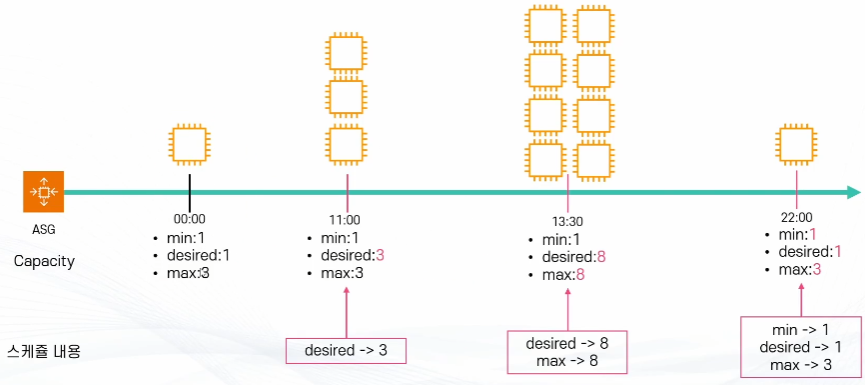
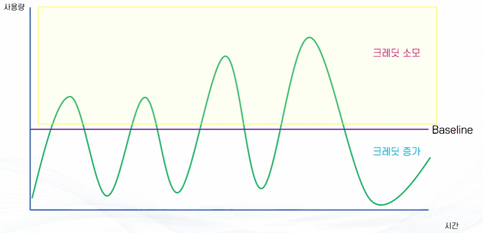
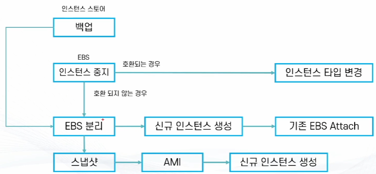

# AWS EC2 - 배포 (2) - 강의 노트

AWS 강의 노트(HWP) 원본을 이미지와 설정 코드, 주석까지 그대로 옮긴 문서다. 정리본은 이론·가이드 문서를 함께 본다.

## EC2 모니터링 기초

- Amazon CloudWatch는 DevOps 엔지니어, 개발자, SRE(사이트 안정성 엔지니어) 및
IT 관리자를 위해 구축된 모니터링 및 관찰 기능 서비스

- CloudWatch는 애플리케이션을 모니터링하고, 시스템 전반의 성능 변경 사항에 대응하며,
리소스 사용률을 최적화하고, 운영 상태에 대한 통합된 보기를 확보하는 데 필요한
데이터와 실행 가능한 통찰력을 제공한다.

## Amazon CloudWatch와 EC2

- AWS 통합 모니터링 서비스
: CloudWatch는 AWS에서 제공하는 클라우드 네이티브 모니터링 서비스로, EC2를 비롯한 다양한 AWS 서비스 및
애플리케이션의 상태와 성능을 관찰하고 로그와 지표를 수집할 수 있다.

- EC2 기본 모니터링 지원
: EC2 인스턴스를 실행하면 CloudWatch에서 별도 설정 없이도 기본적인 지표들을 자동으로 수집한다.
(무료 제공, 단 세부 모니터링은 유료 옵션 필요)

- EC2의 주요 지표 (시간 순서로 수집된 데이터 집합)
  - CPU 사용량 : 인스턴스의 CPU 활용도를 확인해 과부하 여부를 파악
  - 디스크 I/O : 디스크 읽기(Read), 쓰기(Write) 성능 모니터링
  - 네트워크 트래픽 : In/Out/Packet 단위 네트워크 흐름 확인
  - CPU Credit 관련 지표 : T 시리즈 버스트 성능 인스턴스의 크레딧 소모량 및 잔여량 추적

- 비용
  - EC2 기본 모니터링 : 무료, 5분 단위 데이터 제공
  - 상세 모니터링(Detailed Monitoring) 활성화 시: 1분 단위 데이터 수집 가능(유료)

## Amazon CloudWatch와 Auto Scaling

- Auto Scaling 지표 수집
: Auto Scaling 그룹에 대한 지표는 CloudWatch에서 확인 가능하지만,
일부 세부 지표(예: 스케일링 이벤트 추적, 정책 기반 동작 로그 등)는 별도 활성화가 필요

- 주요 지표
  - 용량(Capacity): Min(최소), Max(최대), Desired(희망 용량) 인스턴스 개수 추적
  - 인스턴스 상태: 서비스 중(Running), 종료(Terminated), 중지(Stopped) 등 상태 모니터링
  - 그룹 내 모든 인스턴스의 통합 지표: 그룹 단위로 평균 CPU 사용률, 네트워크 트래픽 등 집계된 정보 제공

- 활용 방식
  - CloudWatch 경보(Alarm)와 연동하여 Auto Scaling 그룹의 동작을 자동화할 수 있다.
*예: CPU 사용률이 70% 이상 : 인스턴스 1대 추가 (Scale Out)
*예: CPU 사용률이 30% 이하 : 인스턴스 1대 축소 (Scale In)
  - 단계적(step) 스케일링: 조건에 따라 점진적으로 인스턴스 수를 늘리거나 줄임
  - 타겟 추적(Target Tracking) 스케일링: 특정 지표(CPU 사용률 50% 유지 등)를 목표로 자동 조정

- 추가 기능
  - Auto Scaling 이벤트 로그 및 알람을 CloudWatch Logs에 기록 가능
  - CloudWatch 대시보드에서 Auto Scaling 그룹과 EC2 지표를 통합적으로 시각화 가능

## Amazon CloudWatch와 ELB

- ELB 지표는 기본 제공
: 별도 설정을 하지 않아도 CloudWatch에서 ELB(Elastic Load Balancer) 관련 지표가 자동으로 수집된다.

- 주요 지표
  - 요청/연결: 로드 밸런서를 통해 들어오는 요청 수, 연결 수
  - 상태 코드별 요청 수:
*3xx (리다이렉트)
*4xx (클라이언트 오류, 예: 잘못된 요청)
*5xx (서버 오류, 예: 대상 인스턴스 문제)
  - Pv6 처리: IPv6 트래픽이 얼마나 처리되고 있는지 확인
  - 네트워크 지표: 로드 밸런서를 거쳐 처리된 네트워크 트래픽 양

- 즉, CloudWatch를 통해 ELB가 얼마나 많은 요청을 처리했는지, 오류는 얼마나 발생했는지,
트래픽이 얼마나 오가는지를 손쉽게 확인할 수 있다.

## Autoscale Scaling 정책

- AutoScale Scaling 정책
:　Autoscale에서 관리하고 있는 인스턴스의 숫자를 조절하는 방식

- 크게 네 가지 분류

## 수동 스케일: 수동으로 직접 인스턴스 숫자를 증감

## 스케줄기반 스케일: 특정 시점에 인스턴스 숫자를 증감

* 주요 예측 가능한 시점의 부하 처리 목적으로 활용

## 동적 스케일: 특정 기준을 두고 기준치에 따라 인스턴스 숫자를 증감

* 예: CPU 사용률 기반, 요청 숫자 기반, 판매량 기반 등

## 예측기반 스케일: 과거의 기록과 패턴을 기반으로 수요량을 예측해서 인스턴스 숫자를 증감

- 오토 스케일링 정책의 주요 유형

(1) 수동 스케일링
  - 관리자가 직접 EC2 인스턴스 수를 조정.
  - 자동이 아니므로 돌발적인 상황에 대응 불가. (예: 새벽 3시에 사용자 급증)
  - 다른 정책을 적용하기 전 테스트용으로 활용 가능.

(2) 스케줄 기반 스케일링
  - 예측 가능한 시점의 변동사항에 대비해서 인스턴스 숫자를 조절하는 방식
  - 특정 시점에 맞춰 인스턴스 수를 조정.
* 예: 매주 수요일마다 주간 이벤트가 있는 게임의 경우
* 예: 매일 새벽 특정 시간에 하루동안 모인 데이터를 분석

- 트래픽 패턴이 뻔한 서비스
  - 쇼핑몰, 배달앱, 예약시스템, 교육사이트

- 이벤트 대비 (CPU 기다리면 늦는다.)
  - 수강신청, 콘서트 예매, 세일

- 비용 절감 목적
  - 야간 서버 줄이기

- 적용 방식
  - 특정 시점을 정해서 해당 시점 or Cron으로 표현하는 반복 시점에 적용
  - 범위 지정 (Min, Max, Desired 셋 중 최소 한가지)
* 지정한 범위보다 인스턴스가 작다면 Scale Out
* 지정한 범위보다 인스턴스가 크다면 Scale In



- Cron Expression은 특정 작업을 주기적으로 실행하기 위해 사용하는 표현식
- AWS CloudWatch Events, Kubernetes CronJob 등에서 일정 예약 작업을 지정할 때 활용

- 크론 표현식은 보통 5자리 또는 6자리로 구성된다. (AWS 같은 일부 서비스에서는 6자리 이상 사용)
- 분(Minute)   시(Hour)   일(Day of Month)   월(Month)   요일(Day of Week)   [연도(Year)]
- 각 자리는 실행 주기를 의미하며, 숫자 또는 기호를 조합해서 원하는 시점을 지정할 수 있습니다.

- 자주 쓰이는 기호
* : 모든 값 (예: 매분, 매일)
, : 여러 값 지정 (예: 1,15 -> 1일과 15일)
- : 범위 지정 (예: 1-5 -> 월~금)
/ : 주기 설정 (예: */10 -> 10분마다)
? : 특정하지 않음 (일/요일 칸에서만 사용, 예: ? -> 요일은 신경 안 쓰고 날짜 기준 실행)

크론 표현식 예시
0 9 * * * : 매일 오전 9시에 실행

```
*/5 * * * *: 5분마다 실행
0 0 * * 0 : 매주 일요일 0시(자정)에 실행
0 3 * * 1-5 : 월~금 새벽 3시에 실행
30 2 1 * * : 매달 1일 새벽 2시 30분에 실행
```

- 즉, 크론 표현식을 사용하면 정해진 패턴에 맞춰 반복적인 작업을 자동화할 수 있다.

(3) 동적 스케일링
- 지표에 반응해서 인스턴스 숫자를 조절하는 방식
  - 주로 CloudWatch의 지표 활용
  - 혹은 자신만의 기준으로 스케일링 정책 조절 가능

- 주로 Autoscale에서 지원하는 추적 조정 정책(Target Tracking Policy) 활용
  - 내부적으로 CloudWatch 경보(Alarm)을 생성해서 경보에 반응하여 자동으로 증감 (PCU , 네트워크등의 사용량 기반)
* 경보 : CloudWatch 지표에 반응하여 트리거되는 이벤트
  - 지표 증감에 따라 얼마나 민감하게 반응할 것인지 결정 가능

(4) 예측 기반 스케일링
- 사용 패턴의 히스토리를 기반으로 인스턴스 수요량을 예측하여 인스턴스 숫자를 조절하는 방식
  - 주로 반복되는 패턴이 명확한 경우, 혹은 인스턴스 준비가 오래 걸리는 경우 사용
  - 예: 매일 오후 2시에 레이드 이벤트가 열리는 게임 서비스의 서버

- CloudWatch 지표를 14일간 분석하여 패턴을 만들고 다음 48시간의 사용 패턴을 분석

- 수요량에 따라 증가만 가능
  - 즉 인스턴스 숫자를 감소시키려면 동적 스케일링 정책 필요

- 주의사항
  - Autoscale Group에 다양한 인스턴스 종류가 섞여있을 경우 효율성이 매우 떨어짐
  - 다양한 스케일링 정책이 공존할 경우 효율성이 떨어짐
  - Autoscale Group에 충분한 데이터가 쌓일 때까지(2주) 기다릴 필요 있음

## 동적 스케일링 실습

- Autoscale Group에서 인스턴스 프로비전
  - 모니터링 활성화

- 동적 스케일링 정책 중 타겟 추적 정책 활성화
  - CPU Utilization 추적
- 인스턴스에 강제로 부하를 발생시켜 CPU 사용량을 100%로 유지

- 이후 스케일링 확인

- 주의사항
  - Scale Out은 3분 정도이지만 Scale In은 15분 이상 소요
`
## Autoscaling의 기타 기능

## Health Check (헬스 체크)

- 인스턴스나 리소스의 상태를 주기적으로 점검하여 정상적으로 동작하는지 확인하는 기능

- 상태 확인 소스(Health Check Source)
  - EC2: 인스턴스가 실행 중인지, 하드웨어 상태가 정상인지, 네트워크 응답이 정상인지 확인
  - ELB: 클라이언트 요청 트래픽을 발생시켜 해당 인스턴스가 요청을 정상적으로 처리할 수 있는지 검사
  - VPC Lattice: 서비스 간 통신이 정상적으로 이뤄지는지 확인
  - 커스텀(Custom): 사용자가 직접 정의한 커스텀 로직을 통해 애플리케이션 특화 상태를 확인

- 상태 확인 동작 원리
  - Health Check는 정상일 경우 인스턴스를 Healthy 상태로 유지
  - 상태 확인에 여러 번 실패하면 Unhealthy 상태로 변경
  - Auto Scaling 그룹에 속한 경우 Unhealthy 인스턴스는 자동으로 종료되고, 새 인스턴스로 교체
  - 이를 통해 애플리케이션 가용성과 안정성을 자동으로 보장

- 활용 포인트
  - 단순 실행 여부(EC2 상태)뿐 아니라 실제 애플리케이션 응답 여부(ELB, Custom)까지 확인 가능
  - 비정상 인스턴스를 자동으로 교체하므로 장애 복구 속도가 빨라진다.
  - 고가용성(High Availability) 아키텍처 구현에 필수적인 기능

- Health Check Grace Period (새 인스턴스가 부팅 중일 때 헬스체크 실패했다고 바로 불량 처리하지 않는 옵션)
  - 새로 추가된 인스턴스가 Health Check 검사를 시작하기 전에 기다려주는 준비 시간
  - 기본값은 300초(콘솔 기준)이며, CLI/SDK로 생성할 경우 기본값은 0초
  - 인스턴스가 부팅 후 애플리케이션 구동까지 시간이 오래 걸리는 경우에 유용
  - Grace Period 동안은 Health Check 실패로 인한 Unhealthy 판정이 발생하지 않음
(인스턴스가 안정적으로 기동 완료될 때까지 교체되지 않도록 보장)

- 인스턴스 Warm Up (인스턴스 막 생겼을 때 나오는 지표를 스케일링 판단에 쓰지 말라는 옵션)
  - 새로 생성된 인스턴스가 트래픽을 받기 전에 일정 시간 동안 준비할 수 있도록 하는 대기 기간
  - 이 기간 동안은 CloudWatch 모니터링 지표(CPU 사용률, 네트워크 트래픽 등)가 수집되더라도
Auto Scaling 정책에 바로 반영되지 않음
  - 목적: 인스턴스가 부팅 중이거나 애플리케이션 초기화 작업 때문에 순간적으로 높은 부하가 발생하더라도
불필요한 스케일링을 방지
  - 설정 예시: Warm Up 시간을 300초로 지정하면, 인스턴스가 기동 후 5분 동안 수집된 지표는
스케일링 조건에서 제외

## Instance Scale-In Protection (인스턴스 축소 보호)

- 개념

## Auto Scaling 그룹이나 개별 인스턴스에서 Scale-In(축소) 동작으로 인해 인스턴스가 종료되지 않도록 보호하는 기능

## 특정 인스턴스가 중요한 작업을 수행 중일 때, 해당 작업이 끝나기 전까지 인스턴스가 강제로 종료되지 않도록 보장

- 주요 목적

## 대규모 목적 처리나 특정 로직 수행을 안정적으로 완료하기 위해 사용

## 예시: SQS 큐에서 메시지를 받아 데이터를 처리하는 작업이 진행 중일 때,

작업이 끝나기 전에 인스턴스가 Scale-In으로 종료되면 데이터 손실이 발생할 수 있다.
따라서 해당 로직이 끝날 때까지 Instance Protection을 활성화해 종료되지 않도록 설정

- Protection이 있어도 종료되는 예외 상황

## Health Check Fail : 인스턴스가 Unhealthy 상태로 판정되면 보호와 관계없이 교체

## Spot 인스턴스 : AWS가 자원을 회수할 경우 강제로 종료된다.

## 수동 삭제 : 콘솔, CLI, SDK 등에서 관리자가 직접 종료 명령을 내리면 보호와 상관없이 종료 가능

- SQS(Simple Queue Service)는 AWS에서 제공하는 메시지 큐 서비스

## 한쪽에서 메시지를 보내면  다른 쪽에서 그 메시지를 꺼내 처리 할 수 있도록 중간에 저장해두는 공간

## 즉, 보낸 쪽과 받는 쪽이 동시에 실행되지 않아도 안전하게 데이터를 주고받을 수 있다.

## 인스턴스 Lifetime 관리

- 개념

## 인스턴스가 최대 얼마 동안 실행될 수 있는지(초 단위)를 설정할 수 있는 기능

## 설정된 기간이 지나면 해당 인스턴스는 자동으로 교체(Replace)되어 새로운 인스턴스로 대체

## 최소 설정 가능 값은 86,400초(1일)

- 설정 방식

## Lifetime 값을 입력 --> 인스턴스가 해당 시간만큼 동작한 후 자동 교체

## 설정을 취소하려면 Lifetime 값을 0으로 입력  (이 경우 모든 인스턴스에 설정이 즉시 적용)

- Scale-In Protection과의 관계

## 인스턴스에 Scale-In Protection이 설정되어 있는 경우, Lifetime이 도래해도 보호 기능이 우선

## 즉, 보호가 걸려 있다면 인스턴스가 교체되지 않고 유지될 수 있다.

교체 방식

## 기본 동작: 기존 인스턴스를 종료한 후, 새로운 인스턴스를 생성

## 이 과정에서 일시적으로 인스턴스 수가 줄어들 수 있으므로,

고가용성이 중요한 서비스에서는 적절한 배치/롤링 교체 전략을 고려해야 한다.

## 인스턴스 유지 관리 기본 정책

```
====================================================================================================
| 이벤트 | 설명 | 동작 방식
====================================================================================================
| Health Check 실패 | Health Check 실패에 따른 인스턴스 종료/프로비전 | 종료 후 신규 실행
```

- ---------------------------------------------------------------------------------------------------
| 인스턴스 교체 | 인스턴스 교체 (AMI 교체, 설정 업데이트 등) | 종료 후 신규 실행
- ---------------------------------------------------------------------------------------------------
| 인스턴스 Lifetime | 인스턴스가 설정한 Lifetime을 넘어서 교체가 필요한 경우 | 종료 후 신규 실행
- ---------------------------------------------------------------------------------------------------
| Rebalance | 가용영역 간의 불균형, Capacity Rebalance 등의 이유로 리밸런싱| 실행 후 종료
| | | (최대 10% 단위)

```
====================================================================================================
```

- Rebalance
: Auto Scaling 그룹에서는 여러 가용영역(AZ, Availability Zone)에 인스턴스를 분산해서 배치한다.
그런데 시간이 지나면서 특정 AZ(가용영역)에 인스턴스가 더 많이 몰리거나,
AWS 내부 사정으로 특정 AZ에서 인스턴스를 줄여야 하는 상황이 생길 수 있다.
이런 경우 Auto Scaling은 Rebalance(리밸런싱) 동작을 해서 인스턴스 수를 균형 있게 맞추는 작업을 수행한다.

- 최대 10% 단위 의미
  - 한 번에 너무 많은 인스턴스를 종료해버리면 서비스가 불안정해질 수 있기때문에
전체 인스턴스 수의 최대 10%만 한 번에 조정하도록 제한이 걸려 있다.
  - 예) 인스턴스가 100대라면, 한 번의 Rebalance에서 최대 10대까지만 조정
  - 만약 1000대라면 100대를 늘린 후(1100대가 생성) Rebalancgin 하게되므로
안정성은 좋아지지만 더 많은 과금이 발생할 수 있다.

- 동작 방식
  - 새로운 인스턴스를 먼저 실행해서 여유분을 확보한다.
  - 여유 인스턴스가 준비되면, 기존에 과도하게 몰려 있던 AZ의 인스턴스를 종료
  - 이 과정을 반복해서 AZ 간 인스턴스 수를 균형 있게 유지한다.

## 인스턴스 유지 관리 커스텀 정책

```
====================================================================================================
방식 | 설명
====================================================================================================
Launch before terminating| 우선 프로비전 후 종료할 인스턴스 종료 (최대로 몇 퍼센트를 프로비전할지 설정)
Terminate and launch | 종료할 인스턴스 종료와 프로비전 동시 수행 (최대 몇 퍼센트까지 종료할지 설정)
Custom behavior | 종료할 인스턴스를 종료하고 교체 비율 설정
| (최대 몇 퍼센트까지 종료할지, 최대 몇 퍼센트를 프로비전할지 설정)
====================================================================================================
```

- Launch before terminating (먼저 새로 만들고, 그 다음에 종료)
  - 새로운 인스턴스를 먼저 띄운 다음 기존 인스턴스를 종료하는 방식
  - 장점: 서비스가 끊기지 않고 안정적임.
  - 단점: 잠시 동안 인스턴스 수가 많아져서 비용이 늘어날 수 있음.

- Terminate and launch (종료와 생성 동시에 진행)
  - 기존 인스턴스를 종료하면서 동시에 새 인스턴스를 띄움
  - 장점: 인스턴스 수가 크게 늘지 않아 비용 관리에 좋다.
  - 단점: 교체 과정에서 순간적으로 서비스 영향이 있을 수 있음
(10대 중 5대를 교체할 때 종료가 먼저 되면 새 인스턴스가 준비될 때까지는 5대만 운용된다.
이 시간 동안 접속 불가나 지연 발생 가능)

- Custom behavior (사용자 지정 방식)
  - 종료와 생성을 몇 % 단위로 조정할지 직접 설정 가능.
  - 예: "한 번에 최대 20%까지만 종료" 또는 "한 번에 최대 30%까지만 새로 생성" 같은 식으로 세밀하게 제어.
  - 장점: 상황에 맞게 유연하게 조정 가능.
  - 단점: 잘못 설정하면 서비스 안정성에 문제가 생길 수 있음

## Autoscale 기능 임시 비활성화

- Autoscale은 원래 상황에 맞게 인스턴스를 자동으로 늘리고 줄이는 기능
- 하지만 디버깅(테스트)이나 특별한 상황에서는 이 기능을 잠깐 꺼둘 수 있다.

- 비활성화할 수 있는 기능들

## Launch (새 인스턴스 시작 막기)

*원래는 부하가 늘어나면 새 인스턴스를 자동으로 띄우는데, 그걸 잠시 중지

## Terminate (인스턴스 종료 막기)

*부하가 줄거나 Health Check 실패 시 원래는 인스턴스를 종료하는데, 그걸 중지

## AddToLoadBalancer (로드밸런서 등록 막기)

*인스턴스를 로드밸런서에 붙이는 걸 막음

## AZRebalance (가용영역 간 균형 맞추기 중지)

*원래는 인스턴스를 여러 가용영역에 골고루 분산시키는데, 그 기능을 멈춤

## HealthCheck (상태 확인 중지)

*인스턴스가 정상인지 확인하는 기능을 끔

## ReplaceUnhealthy (비정상 인스턴스 교체 중지)

*Health Check에 실패해도 인스턴스를 교체하지 않음

## Autoscale 관리 임시 해제

- 특정 인스턴스를 잠시 Autoscale 관리에서 빼내어 StandBy 상태로 전환할 수 있다.
- StandBy 상태에서는 ELB 트래픽을 받지 않고, Health Check도 하지 않는다.

- 활용 목적

## 주로 업데이트, 디버깅, 점검 등의 작업을 하기 위해 사용

## 예: 인스턴스를 StandBy로 두고 소프트웨어를 업데이트한 뒤 다시 복구

- StandBy와 용량(desired capacity) 관계

## StandBy 설정 시, 그룹의 인스턴스 개수를 어떻게 유지할지 선택 가능.

*desired capacity 낮춤: StandBy 상태로 빼도 그룹 내 총 인스턴스 수는 줄지 않는다.
*desired capacity 변경 안 함: StandBy로 빼면, Autoscale이 새 인스턴스를 추가해서 개수를 맞춘다.

- AZRebalance와의 관계
*AZRebalance 기능이 꺼져 있지 않다면, StandBy 해제 시 인스턴스가 다시 그룹에 들어가면서
자동으로 균형 조정된다.

## Amazon EFS (Elastic File System)

- 웹 서비스에서 사용자가 로그인하면, 서버는 로그인 정보를 세션(Session) 이라는 형태로 저장한다.

## 온 프레미스 환경

- 온프레미스(회사 서버실) 환경에서는 보통 서버가 몇 대 안 되고, 잘 바뀌지도 않는다.

- 예
  - 온 프레미스는 웹 서버 2대를 1년 동안 그대로 사용한다.
  - 로그인 정보(세션)를 그냥 서버 안에 저장해도 문제가 없다.
  - 왜냐하면, 항상 같은 서버로 접속되기 때문이다.

## AWS 클라우드 환경

- 클라우드 환경에서는 Auto Scaling을 사용하여 서버 개수가 계속 변한다.
  - 평소: EC2 2대
  - 트래픽 증가: EC2 10대
  - 트래픽 감소: EC2 1대

- 이처럼 서버가 자동으로 늘고 줄어든다.

## 서버에 데이터를 저장시 문제가 발생한다.

- 클라우드 환경에서 세션을 서버 내부에 저장하면 문제가 발생한다.
  - 1) 사용자가 EC2-1 서버에 접속하여 로그인
  - 2) 세션 정보는 EC2-1에 저장
  - 3) 다음 요청이 EC2-2로 전달
  - 4) EC2-2에는 유저의 세션 정보가 없음
  - 5) EC2-2는 다시 유저에게 로그인 요구 발생

- 이로 인해 다음과 같은 문제가 생긴다.
  - 페이지 이동 시마다 로그아웃
  - 새로고침 시 로그인 해제
  - 장바구니, 사용자 정보 초기화
  - 사용자 불만 증가

이 구조는 실제 서비스에서 사용하기 어렵다.


## 클라우드 환경에서의 기본 해결 전략

- 클라우드 환경에서는 중요한 데이터를 서버 내부에 저장하지 않는다.

- 대신, 서버 외부에 중앙 저장소를 구축하여 모든 서버가 공통으로 접근하도록 설계한다.

- 이 방식의 목적은 다음과 같다.
  - 서버 수 변화와 무관한 데이터 유지
  - 장애 발생 시 데이터 보호
  - 서비스 연속성 확보

- 이 구조에서 핵심 역할을 하는 서비스가 Amazon EFS이다.

## Amazon EFS의 기본 개념

- Amazon EFS는 여러 EC2 인스턴스가 동시에 접근할 수 있는 공유 파일 시스템이다.
- 기술적으로는 네트워크를 통해 연결되는 파일 서버이며, 사용자 입장에서는 하나의 공용 폴더처럼 사용된다.
- 모든 EC2 인스턴스는 동일한 EFS 파일 시스템을 마운트하여 사용한다.

- 예시 구조
  - EC2-1  -->  /mnt/efs
  - EC2-2  -->  /mnt/efs
  - EC2-3  -->  /mnt/efs

- 모든 인스턴스가 동일한 디렉터리를 공유한다.
이로 인해 어느 서버에 접속하더라도 동일한 데이터를 사용할 수 있다.


  - EFS의 동작 방식 (NFS 기반)

- EFS는 NFS(Network File System) 프로토콜을 기반으로 동작한다.
- NFS는 원격 서버의 파일 시스템을 로컬 디렉터리처럼 사용하는 기술이다.
- EC2에서는 EFS를 네트워크 드라이브처럼 마운트하여 사용한다.
- 마운트 이후에는 일반 디렉터리와 동일한 방식으로 파일을 읽고 쓸 수 있다.

## 자동 확장 구조

- EFS는 스토리지 용량을 미리 지정할 필요 없이, 데이터를 저장하는 만큼 자동으로 늘어나고 줄어든다.
- 페타바이트 단위까지 확장 가능하며, 몇 천 개의 인스턴스가 동시에 접속할 수 있다.
- 파일이 저장되면 자동으로 용량이 증가하고, 파일이 삭제되면 자동으로 용량이 감소한다.
- 운영자는 용량 관리 작업을 수행할 필요가 없기 때문에 대규모 서비스 운영 시 관리 부담을 크게 줄여준다.

## 고가용성과 내구성 구조

- EFS의 데이터는 하나의 서버나 하나의 가용 영역에만 저장되지 않는다.
- 여러 가용 영역에 분산 저장되어 자동으로 복제된다.

- 이 구조를 통해 다음이 보장된다.
  - 특정 서버 장애 시 데이터 유지
  - 특정 AZ 장애 시 데이터 보호
  - 서비스 연속성 유지
- 따라서 운영 환경에서 안정적으로 사용할 수 있다.

## 데이터 일관성 보장

- EFS는 Read After Write 일관성을 제공한다.
- 이는 파일이 저장된 직후, 다른 서버에서 즉시 최신 데이터로 읽을 수 있음을 의미한다.
- 로그인 세션, 사용자 데이터 관리에 필수적인 기능이다.

## 보안 구조와 접근 방식

- EFS는 Private 서비스로 제공된다.
- 인터넷을 통한 직접 접근은 불가능하며, VPC 내부 리소스만 접근할 수 있다.
- 외부 환경에서 접근하려면 VPN 또는 Direct Connect와 같은 별도 연결 구성이 필요하다.
- 이를 통해 데이터 보안을 강화한다.

## Mount Target의 역할

- EFS는 각 가용 영역마다 Mount Target을 생성한다.
- Mount Target은 EC2 인스턴스와 EFS 간의 연결 지점 역할을 한다.
- 각 AZ의 인스턴스는 가장 가까운 Mount Target을 통해 파일 시스템에 접근한다.
- 이를 통해 네트워크 지연과 장애 위험을 최소화한다.

## EFS 유형(Type)

- Regional EFS
  - Regional EFS는 여러 가용 영역에 자동으로 데이터를 복제한다.
  - 고가용성과 내구성이 뛰어나며, 운영 환경에서 기본적으로 사용된다.
  - 웹 서비스, 세션 관리 시스템 등에 적합하다.

- One-Zone EFS
  - One-Zone EFS는 하나의 가용 영역에만 저장된다.
  - 비용이 저렴하지만 장애에 취약하다.
  - 테스트, 실습, 임시 데이터 저장 용도로 주로 사용된다.

- 퍼포먼스 모드
  - General Purpose
  - 낮은 지연 시간에 최적화된 기본 모드이다.
  - 대부분의 웹 서비스와 업무 시스템에서 사용된다.

- Max I/O
  - 대규모 병렬 작업과 높은 처리량이 필요한 환경에 적합하다.
  - 빅데이터 처리, 미디어 렌더링 등에 활용된다.

주요 활용 사례

- 로그인 세션 저장소
- 파일 업로드 저장 공간
- 로그 파일 저장
- 공용 설정 파일 관리
- 컨테이너 볼륨 공유


## EC2 인스턴스 T 타입의 활용

- T 인스턴스란?
  - 보통은 적당한 성능으로 동작하지만, 필요할 때 잠깐 성능을 확 높일 수 있는 인스턴스
  - 마치 일반 자동차가 평소엔 천천히 달리다가, 가속이 필요할 때 순간적으로 속도를 내는 것과 같음

- CPU 크레딧 제도
  - CPU 사용량이 낮을 때 -> 크레딧이 쌓임 (저축하는 느낌)
  - CPU 사용량이 많을 때 -> 크레딧을 꺼내 써서 성능을 높임 (Burst)
  - 즉, 크레딧 = 성능을 순간적으로 끌어올리는 연료

- Baseline(기본 성능)
  - 인스턴스마다 정해진 최소 성능 수준
  - Baseline보다 적게 쓰면 크레딧이 쌓이고,
  - Baseline보다 많이 쓰면 크레딧을 사용하게 됨

- 중요한 특징
  - 평소에는 저전력으로 운영 (비용 절감 가능)
  - 필요할 때만 성능을 높여서 효율적인 사용 가능
  - 크레딧이 다 떨어지면 CPU 성능이 크게 줄어들어 5% 미만으로 제한되기 때문에 문제가 발생할 수 있다.



## EC2 사이즈 변경

- AWS EC2 인스턴스는 한 번 생성하면 끝나는 서버가 아니다.
- EC2 생성 이후에도 서비스 상황과 업무 부하에 맞게 인스턴스 타입과 크기를 자유롭게 변경할 수 있다.
- 이는 클라우드 환경의 가장 큰 장점 중 하나이다.

- 온프레미스 환경에서는 서버 성능을 변경하려면 장비를 교체하거나 증설해야 했지만,
클라우드에서는 몇 번의 클릭만으로 서버 성능을 조절할 수 있다.

- 이를 통해 비용 절감과 성능 향상을 동시에 달성할 수 있다.

## EC2 사이즈 변경이 필요한 상황

- 인스턴스 사이즈 변경은 다음과 같은 상황에서 주로 발생한다.
  - 서비스 이용자가 증가한 경우
  - 애플리케이션 성능이 부족한 경우
  - 테스트 환경에서 운영 환경으로 전환하는 경우
  - 서버 자원이 낭비되고 있는 경우

- 예를 들어, 초기에는 t3.micro로 충분했지만, 트래픽이 증가하면서
성능이 부족해질 경우 더 큰 인스턴스로 변경해야 한다.
반대로, 서버 사용량이 줄어들면 작은 인스턴스로 줄여 비용을 절감할 수도 있다.

## EC2 인스턴스 변경 방식

EC2 인스턴스 변경은 크게 두 가지 방식으로 나뉜다.

1) 사이즈 변경 (Size Scaling)

- 사이즈 변경은 같은 인스턴스 패밀리 안에서 크기만 조절하는 방식이다.
즉, 성격은 그대로 두고 성능만 바꾸는 방법이다.

```
예시 : t3.micro --> t3.small
예시 : t3.small --> t3.medium
```

- 이 방식은 구조 변화가 거의 없기 때문에 가장 안전하고 많이 사용된다.
- 워크로드(작업량)가 증가하면 상향 조정하고, 감소하면 하향 조정하는 형태로 유연하게 사용한다.

```
2) 패밀리 변경 (Family Scaling)
```

- 패밀리 변경은 인스턴스의 성격 자체를 바꾸는 방식이다.
- 워크로드 특성에 따라 적합한 패밀리로 이동한다.

```
예시 : t3.micro --> m5.large
예시 : m5.large --> c6i.large
예시 : r5.large --> m5.large
```

- 패밀리별 특징
  - T 계열: 저비용, 저부하
  - M 계열: 범용 서버
  - C 계열: CPU 집중형
  - R 계열: 메모리 집중형
  - I/D 계열: 스토리지 집중형

- 서비스 성격에 따라 적절한 패밀리를 선택해야 한다.

## 변경 전 반드시 확인해야 할 호환성 조건

- 모든 인스턴스 타입이 서로 자유롭게 변경되는 것은 아니다.
- 변경 전에는 반드시 다음 항목을 확인해야 한다.

1) 가상화 방식

- HVM: 대부분 최신 인스턴스에서 사용
- PV: 구형 인스턴스에서 사용
- 서로 다른 가상화 방식 간에는 변경이 제한된다.

2) CPU 아키텍처

- x86_64 (Intel/AMD)
- ARM (Graviton)

예시 : t3 --> m5 (가능)
예시 : t3 --> t4g (불가능, ARM 기반)

- 아키텍처가 다르면 변경할 수 없다.

3) 운영체제 비트 구조

- 32bit
- 64bit
- 대부분 최신 서버는 64bit이지만, 구형 OS는 제한될 수 있다.

4) EBS 볼륨 및 네트워크 호환성

- 일부 인스턴스 타입은 연결 가능한 EBS 개수와 네트워크 성능이 다르다.
- 기존 설정이 새 인스턴스 타입에서 지원되지 않으면 변경할 수 없다.

## 인스턴스 정지(Stop)가 필요한 이유

- EC2 인스턴스 타입 변경은 실행 중에는 불가능기 때문에 반드시 인스턴스를 중지한 상태에서만 변경할 수 있다.

- 절차
1) 인스턴스 중지 (Stop)

```
2) 타입 변경 (Modify Instance Type)
3) 인스턴스 시작 (Start)
```

- 이 과정에서 서버는 일시적으로 중단된다.

## 서비스 운영 시 주의사항

- 인스턴스 타입 변경은 서비스에 직접적인 영향을 준다.

다음 사항을 반드시 고려해야 한다.

1) 서비스 중단 가능성
- Stop/Start 과정에서 서비스가 중단된다.
- 운영 환경에서는 점검 시간에 수행해야 한다.

```
2) Auto Scaling 영향
```

- Auto Scaling Group에 포함된 인스턴스는 직접 변경하면 정책에 의해 교체될 수 있다.
- ASG 환경에서는 Launch Template을 수정해야 한다.

```
3) Health Check 영향
```

- 변경 후 애플리케이션이 정상 기동되지 않으면 Health Check 실패로 자동 종료될 수 있다.

## 변경 후 유지되는 정보와 변경되는 정보

- 인스턴스 타입을 변경해도 일부 정보는 유지된다.

- 유지되는 항목
  - Instance ID
  - Private IP
  - 연결된 EBS 볼륨
  - 보안 그룹
  - IAM Role

- 변경되는 항목
  - Public IP (Elastic IP 미사용 시)
  - 임시 스토리지
  - 일부 네트워크 성능
  - Elastic IP를 사용하면 Public IP는 유지된다.




