# VPC Endpoint · EFS - 강의 노트

AWS 강의 노트(HWP) 원본을 이미지와 설정 코드, 주석까지 그대로 옮긴 문서다. 정리본은 이론·가이드 문서를 함께 본다.

## VPC Endpoint

- VPC Endpoint란?
  - VPC Endpoint는 VPC 안의 리소스가 인터넷 게이트웨이(IGW)나 NAT 게이트웨이 없이도
AWS 서비스(S3, DynamoDB 등)에 직접 연결할 수 있게 해주는 기능
  - VPC 내부에서 특정 AWS 서비스에 사설 네트워크(Private Network)로 접속할 수 있도록 하는 엔드포인트
  - 트래픽이 인터넷으로 나가지 않고 AWS 내부망을 통해 서비스에 도달 --> 보안 강화 + 비용 절감

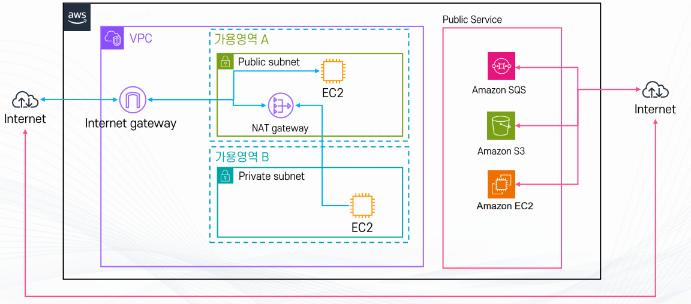

- 2 VPC Endpoint 종류

```
(1) Interface Endpoint (PrivateLink 기반)
 # 대상 서비스 : 대부분의 AWS 서비스 (SNS, SQS, KMS, CloudWatch, Secrets Manager, etc.)
 # ENI(Elastic Network Interface) 를 생성해서 서비스에 연결
 # VPC 내부 IP 주소를 통해 서비스 접근 가능
 # 서비스 제공자와 소비자 간 프라이빗 연결도 지원 (SaaS 연동)
```

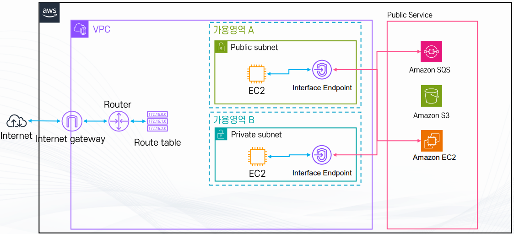

```
(2) Gateway Endpoint
 # 라우팅 테이블에서 경로의 대상으로 지정하는 서비스: S3, DynamoDB (2개 서비스만 지원)
 # 라우팅 테이블(Route Table)에 엔드포인트를 추가하는 방식
 # 퍼블릭 인터넷 없이도 S3/DynamoDB 접근 가능
 # 예: 프라이빗 서브넷의 EC2가 NAT 없이 S3에 파일 업로드
```

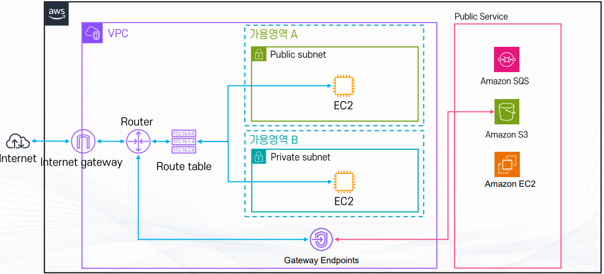

3. VPC Endpoint를 사용하는 이유?
- 보안 강화
  - 인터넷으로 나가지 않고 AWS 내부망에서만 통신
  - 기업 환경에서 보안 규정 준수에 필수

- 비용 절감
  - NAT Gateway 경유 아웃바운드 요금 절감

- 단순화
  - IGW, NAT 구성 없이도 S3, DynamoDB 등 접근 가능

4. 사용 사례
- 프라이빗 서브넷의 EC2 인스턴스가 NAT 없이 S3에 데이터 백업
- 보안상 인터넷을 전혀 열 수 없는 환경에서 AWS 서비스 이용

EC2가 다른 서비스와 연동되게 하기위해서 IAM 역할을 생성

- AWS에서 EC2 인스턴스가 다른 AWS 서비스와 연동되기 위해서는 반드시 IAM Role(역할)을 통해 권한을 부여해야 한다.
- EC2는 기본적으로 아무 권한도 없는 상태로 생성되며,IAM Role을 부여해야만 AWS 서비스에 접근할 수 있다.
- 권한은 Role에 직접 부여하는 것이 아니라, Policy를 Role에 연결한 후, 해당 Role을 EC2에 연결하는 방식으로 관리한다.
- 구조: EC2  -->  IAM Role  -->  Policy

## IAM Role이 필요한 경우

- EC2에서 실행되는 프로그램이나 스크립트가 AWS 서비스에 접근해야 하는 경우, IAM Role이 반드시 필요하다.
  - EC2에서 S3 버킷에 파일 업로드/다운로드
  - EC2에서 DynamoDB 데이터 조회 및 저장
  - EC2에서 CloudWatch Logs 로그 전송
  - EC2에서 Systems Manager(SSM) 에이전트로 원격 명령 실행
  - EC2에서 ECR 이미지 Pull
  - EC2에서 Secrets Manager 값 조회

이러한 경우, EC2에 IAM Role을 부여해야 Access Key를 직접 저장하지 않고도 안전하게 연동할 수 있다.

## IAM Role이 필요 없는 경우

- 다음과 같이 EC2가 AWS 서비스와 직접 연동하지 않는 경우에는 IAM Role이 필수가 아니다.
  - EC2가 단순 웹 서버로만 동작하는 경우 (Apache, Nginx, Tomcat 등)
  - 외부 인터넷이나 사용자 요청만 처리하는 서버
  - DB 연결을 RDS 사용자 계정(ID/Password)으로만 처리하는 경우
  - 내부 애플리케이션 로직만 수행하는 서버

- 이 경우에는 EC2가 AWS API를 호출하지 않기 때문에 IAM Role 없이도 운영이 가능하다.

## 왜 IAM Role을 사용하는가

- IAM Role을 사용하는 가장 큰 이유는 보안 때문이다.
- Access Key를 EC2 내부에 직접 저장하면 서버 침해 시 계정 전체가 유출될 위험이 있다.

- IAM Role을 사용하면 다음과 같은 장점이 있다.
  - 임시 자격증명 자동 발급
  - 자동 만료 및 갱신
  - 키 관리 불필요
  - 보안 사고 위험 감소
  - 따라서 실무 환경에서는 EC2 + IAM Role 방식이 표준이다.
`

## 실무 표준 구조

- 실무에서 가장 많이 사용하는 구조는 다음과 같다.

[사용자]
  - IAM User  -->  Policy

```
[서버]
 # EC2  --> IAM Role  --> Policy
```

- 계정 : IAM User에 직접 정책 부여
- 서버 : IAM Role을 통해 권한 사용

## EC2 Instance Connect Endpoint

- EICE (EC2 Instance Connect Endpoint)는 퍼블릭 IP나 Bastion 서버 없이도 Private Subnet에 있는
EC2 인스턴스에 SSH로 안전하게 접속할 수 있도록 해주는 AWS 관리형 서비스

- 즉, AWS가 대신 중간 접속 통로(Bastion 역할)를 제공해주는 방식
  - 연결 방법: SSH(Linux) / RDP(Windows)
  - 동작 방식: Endpoint를 통해 EC2로 터널 생성 후 접속
  - 연결 인증 방식: IAM 사용자/Role 기반 인증
  - 감사 방법: CloudTrail로 접속 기록 확인
  - 연결 요구사항: Endpoint 생성, 보안그룹 설정, 지원 인스턴스 사용
  - 주요 기능: Private EC2에 Bastion 없이 접속
  - 비용무료 (계정당 최대 5개, VPC당 1개, Subnet당 1개)

- 기존 방식(Bastion 방식)
  - PC --> Bastion --> Private EC2

- EICE 방식
  - PC --> AWS 인증 --> Connect Endpoint --> Private EC2

- Bastion 서버를 직접 운영하지 않아도 AWS가 대신 접속 중계 서버 역할을 해준다

.

## 인증 방식 (IAM 기반)

- EICE는 키 파일이 아닌 IAM 권한으로 인증한다.
- 접속 권한이 있는 사용자만 EC2에 접속할 수 있다.

- 네트워크 요구사항
  - EC2 Instance Connect Endpoint 생성
  - Endpoint가 위치한 서브넷 설정
  - 보안그룹 설정
  - VPC DNS 활성화

## 지원 환경 제한사항

- 다음 환경에서는 사용이 제한될 수 있다.
  - 일부 GPU 인스턴스(G1 등) 미지원
  - 구형 AMI 제한
  - 커스텀 OS 제한 가능
  - Windows 일부 버전 제한
  - 사용 전 공식 문서 확인 권장

## 장점

1) Bastion 서버 불필요
  - 별도 EC2 운영 필요 없음
  - 비용 절감
  - 관리 포인트 감소

2) 보안 강화
  - 퍼블릭 IP 불필요
  - 포트 최소 개방
  - IAM 기반 통제
  - 로그 기록 자동 저장

3) 운영 편의성
  - 키 파일 관리 불필요
  - 콘솔에서 바로 접속 가능
  - 사용자별 권한 제어 쉽다.

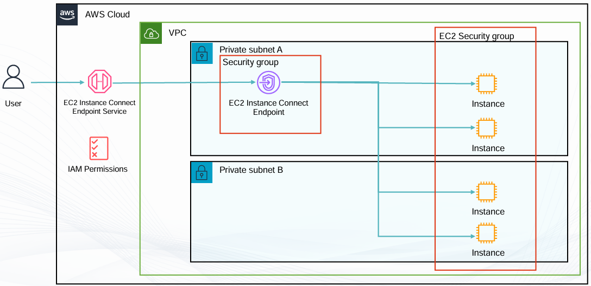

## VPC Peering

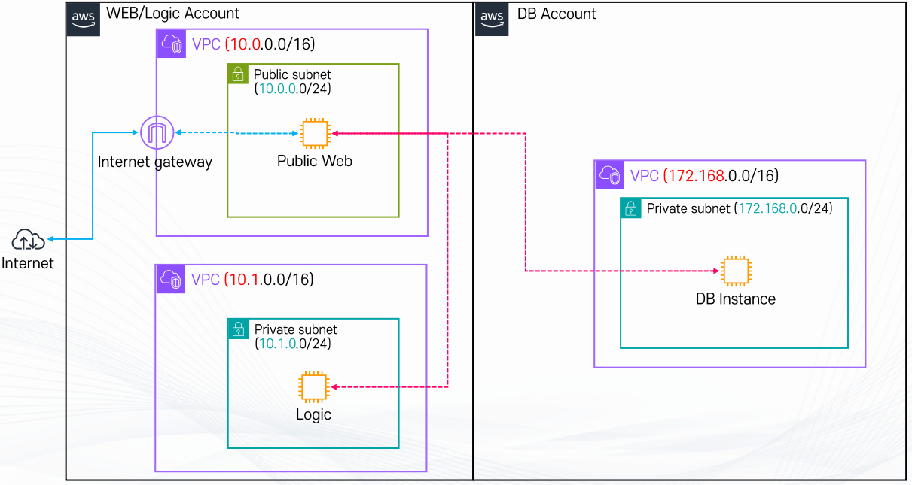

- AWS에서 하나의 VPC는 하나의 독립된 가상 네트워크 공간이다.

- 기본적으로 서로 다른 VPC는 서로 연결되어 있지 않기 때문에,
각 VPC 내부의 리소스들은 다른 VPC의 리소스와 바로 통신할 수 없다.

- 두 개의 VPC를 서로 연결하여 Private IP 주소를 이용해 직접 통신할 수 있도록 해주는 기능이 VPC Peering이다.

- VPC Peering을 설정하면 두 VPC 사이의 트래픽은 인터넷을 거치지 않고 AWS 네트워크를 통해 전달된다.
따라서 Public IP를 사용하지 않고도 서로 다른 VPC의 EC2, DB 등의 리소스가 통신할 수 있다.
단, VPC Peering Connection만 생성했다고 바로 통신되는 것은 아니다.

1) Peering 연결 생성 및 승인
2) VPC의 Route Table에 상대방 VPC CIDR로 향하는 경로 추가

```
3) Security Group 및 필요 시 NACL 허용
```

- 이 설정들이 함께 되어 있어야 실제 통신이 가능하다.

## VPC Peering이 동작하는 구조

- VPC Peering은 두 VPC를 1:1로 직접 연결하는 구조를 가진다.
즉, 중간에 서버나 장비를 두지 않고, AWS 내부 네트워크를 통해 바로 연결된다.

- 구조
  - VPC A와 VPC B가 Peering으로 연결되면, A에 있는 서버는 B에 있는 서버의 사설 IP로 바로 접근할 수 있다.
  - 이때 통신 경로는 인터넷을 통과하지 않고 AWS 데이터센터 내부 백본망을 이용한다.
  - 그래서 지연 시간이 짧고 안정성이 높다.

## VPC Peering을 사용하는 이유

- 실무 환경에서는 하나의 VPC 안에 모든 시스템을 넣지 않는다.

- 보통 다음과 같이 분리한다.
  - 웹 서버용 VPC
  - 업무 로직용 VPC
  - 데이터베이스용 VPC
  - 이렇게 나누는 이유는 보안과 관리 때문이다.

- 만약 모든 서버가 하나의 VPC에 있다면, 한 곳이 침해되었을 때 전체 시스템이 위험해질 수 있다.
- VPC를 나누면 영역별로 보안을 강화할 수 있지만, 서로 통신이 안 되면 서비스 자체가 동작하지 않는다.
- 이 문제를 해결하기 위해 VPC Peering을 사용한다.

## VPC Peering의 주요 특징

1) 프라이빗 IP 통신이 가능하다.
  - 퍼블릭 IP를 사용할 필요가 없기 때문에 외부 노출 위험이 줄어든다.

2) 별도의 장비가 필요 없다.
  - NAT Gateway, VPN, Internet Gateway 같은 장치를 추가로 설치하지 않아도 된다.

3) 다른 계정이나 다른 리전과도 연결할 수 있다.
  - 즉, 회사 내부 여러 AWS 계정을 하나의 네트워크처럼 운영할 수 있다.

4)  성능이 뛰어나다.
  - AWS 내부망을 사용하기 때문에 트래픽 속도가 빠르고 안정적이다.

## 제한 사항 (트랜짓 라우팅 불가)

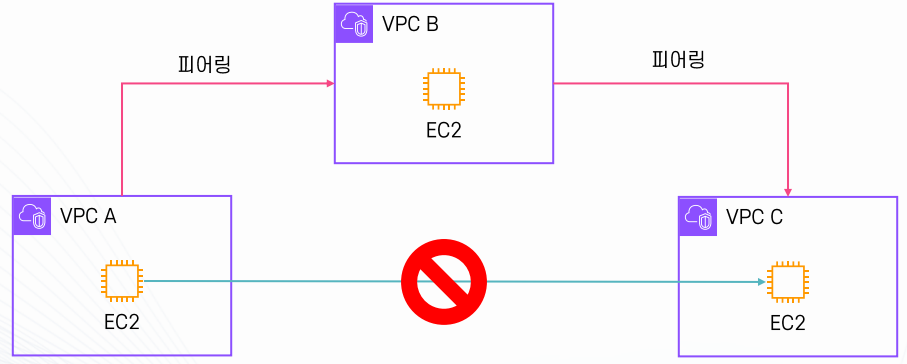

- VPC Peering의 가장 큰 한계는 중계 기능이 없다는 것이다.

- VPC A와 VPC B는 연결되어 있고, VPC B와 VPC C도 연결되어 있다.
하지만 A와 C는 직접 연결되어 있지 않다.
이 경우 A에서 C로 통신하는 것은 불가능하다.
B가 중간에서 전달해주지 않기 때문이다.
이것을 트랜짓 라우팅 불가라고 한다.
그래서 VPC가 많아지면 Peering 방식은 관리가 매우 복잡해진다.

- 활용 예시
  - 동일 조직 내 여러 VPC 환경을 연결하여 애플리케이션 모듈 분리 후 내부 통신 가능
  - 별도 계정으로 분리된 개발 환경과 운영 환경을 안전하게 연결
  - 멀티리전 환경에서 데이터 복제, 백업, 장애조치(Failover) 지원

## 제한 사항 (CIDR 대역이 겹치면 안된다.)

- VPC1과 VPC2는 IP 주소 대역이 달라야 한다.
- VPC1 = 10.0.0.0/16
- VPC2 = 10.0.0.0/16

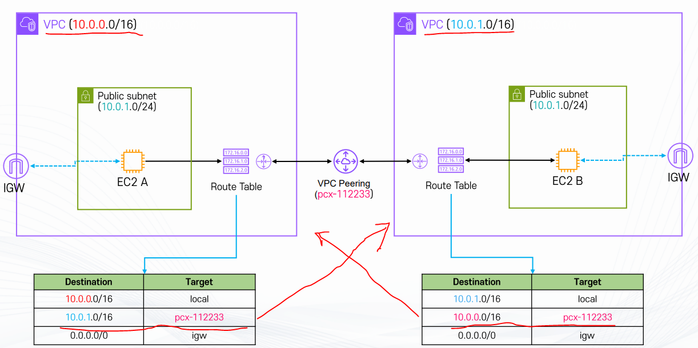

- VPC Peering에는 중요한 제약 조건이 있다.

- 가장 중요한 것은 CIDR 대역이 겹치면 안 된다는 점이다.

- 예를 들어, VPC A가 10.0.0.0/16을 사용하고 있고, VPC B도 10.0.0.0/16 또는 그 일부를 사용한다면
Peering 연결 자체가 불가능하다.
또 하나 중요한 점은 라우팅 설정이다.

- Peering 연결만 만들고 라우팅 테이블을 수정하지 않으면 서버끼리는 서로를 찾지 못한다.
따라서 반드시 상대 VPC로 가는 경로를 라우팅 테이블에 등록해야 한다.

## Transitve Gateway

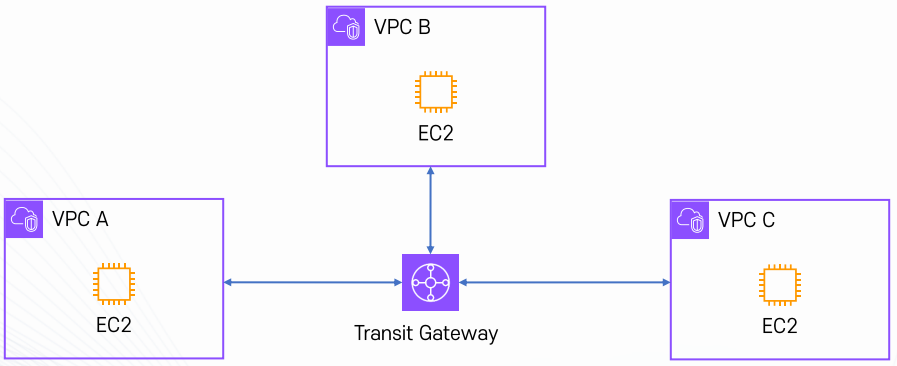

- Transitve Gateway란 여러 개의 길(네트워크)을 한 번에 이어주는 큰 터미널과 같다.
- 버스 터미널이 여러 노선을 한 곳에 모아서 연결해주듯이,
Transitve Gateway는 여러 VPC(가상 네트워크)와 온프레미스(회사 내부망)를 한 곳에 모아서 연결해 준다.

- 왜 필요한가?
  - VPC Peering(1:1 연결)만 쓰면, VPC가 많아질수록 선이 거미줄처럼 복잡해질 수 있다.
  - Transitve Gateway는 중앙 허브처럼 동작해서, 모든 VPC를 여기에 연결만 하면 서로 통신이 가능

- 안정성: AWS가 관리하는 서비스라 고가용성 보장
  - 정책 관리 쉬움: 중앙에서 어떤 VPC끼리 통신 가능한지 설정할 수 있음

- 안정성: AWS가 관리하는 서비스라 고가용성 보장
  - 정책 관리 쉬움: 중앙에서 어떤 VPC끼리 통신 가능한지 설정할 수 있음

- 장점
  - 간단한 연결: 각 VPC가 Transitve Gateway 하나만 연결
  - 확장성 좋음: 수천 개의 VPC까지 연결 가능
  - 트랜짓 라우팅 지원: A <--> B, B <--> 연결 시 A <--> C도 자동 연결 가능

- 단점
  - 무료가 아니라 연결 수 + 전송량에 따라 요금이 발생
  - 작은 규모라면 Peering이 더 경제적일 수 있음

- 소규모 네트워크: VPC Peering으로 충분
- 대규모 네트워크: Transitve Gateway가 꼭 필요

## AWS Direct Connect

- 정의
  - AWS Direct Connect는 기업의 온프레미스 데이터센터(사무실, IDC 센터 등)와
AWS 클라우드를 전용 회선으로 직접 연결하는 서비스
  - 보통 인터넷을 거쳐 AWS에 접속하지만, Direct Connect는 인터넷을 거치지 않고 전용망으로
AWS에 바로 연결하는 방식

- 장점
  - 인터넷망 대신 전용 회선을 쓰기때문에 지연(latency)과 끊김이 적고, 대역폭이 보장
  - 인터넷을 거치지 않고 폐쇄망을 통해 AWS로 접속하기 때문에 보안이 강화된다. (데이터 유출 위험 줄어듦)
  - 대량의 데이터를 AWS로 자주 올리거나 내릴 때, 인터넷 전송 대비 더 저렴할 수 있다.
  - 온프레미스와 AWS를 하나의 네트워크처럼 묶어서 운영할 수 있다.

- 동작 방식
  - 기업 IDC <--> AWS Direct Connect Location <--> AWS VPC(가상 네트워크)
  - 전용선은 보통 1Gbps, 10Gbps 속도를 제공하며, 필요 시 여러 회선을 묶어서 확장 가능
  - VPC 안에서는 Virtual Private Gateway(VGW)와 연결되며, 라우팅 테이블 설정을 통해
온프레미스 <--> 클라우드 간 통신을 제어해.

- 활용 사례
  - 금융, 공공기관처럼 보안, 지연 시간이 중요한 곳
  - 대규모 데이터 마이그레이션 : 온프레미스 데이터를 AWS로 이전할 때
  - 하이브리드 아키텍처: 일부는 온프레미스, 일부는 AWS에서 운영할 때 빠르고 안전한 연동

## Amazon EFS (Elastic File System)

- 웹 서비스에서 사용자가 로그인하면, 서버는 로그인 정보를 세션(Session) 이라는 형태로 저장한다.

## 온 프레미스 환경

- 온프레미스(회사 서버실) 환경에서는 보통 서버가 몇 대 안 되고, 잘 바뀌지도 않는다.

- 예
  - 온 프레미스는 웹 서버 2대를 1년 동안 그대로 사용한다.
  - 로그인 정보(세션)를 그냥 서버 안에 저장해도 문제가 없다.
  - 왜냐하면, 항상 같은 서버로 접속되기 때문이다.

## AWS 클라우드 환경

- 클라우드 환경에서는 Auto Scaling을 사용하여 서버 개수가 계속 변한다.
  - 평소: EC2 2대
  - 트래픽 증가: EC2 10대
  - 트래픽 감소: EC2 1대

- 이처럼 서버가 자동으로 늘고 줄어든다.

## 서버에 데이터를 저장시 문제가 발생한다.

- 클라우드 환경에서 세션을 서버 내부에 저장하면 문제가 발생한다.
  - 1) 사용자가 EC2-1 서버에 접속하여 로그인
  - 2) 세션 정보는 EC2-1에 저장
  - 3) 다음 요청이 EC2-2로 전달
  - 4) EC2-2에는 유저의 세션 정보가 없음
  - 5) EC2-2는 다시 유저에게 로그인 요구 발생

- 이로 인해 다음과 같은 문제가 생긴다.
  - 페이지 이동 시마다 로그아웃
  - 새로고침 시 로그인 해제
  - 장바구니, 사용자 정보 초기화
  - 사용자 불만 증가

이 구조는 실제 서비스에서 사용하기 어렵다.

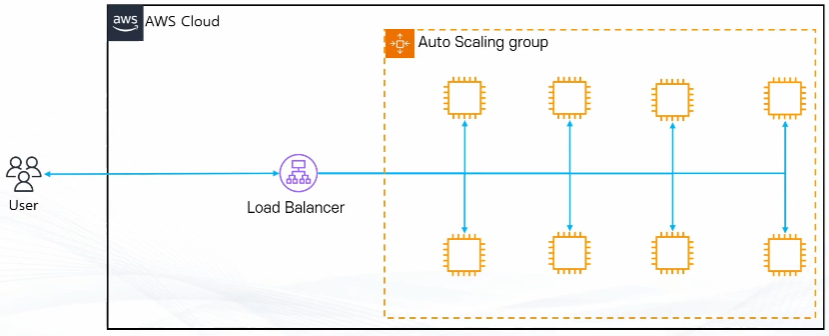

## 클라우드 환경에서의 기본 해결 전략

- 클라우드 환경에서는 중요한 데이터를 서버 내부에 저장하지 않는다.

- 대신, 서버 외부에 중앙 저장소를 구축하여 모든 서버가 공통으로 접근하도록 설계한다.

- 이 방식의 목적은 다음과 같다.
  - 서버 수 변화와 무관한 데이터 유지
  - 장애 발생 시 데이터 보호
  - 서비스 연속성 확보

- 이 구조에서 핵심 역할을 하는 서비스가 Amazon EFS이다.

## Amazon EFS의 기본 개념

- Amazon EFS는 여러 EC2 인스턴스가 동시에 접근할 수 있는 공유 파일 시스템이다.
- 기술적으로는 네트워크를 통해 연결되는 파일 서버이며, 사용자 입장에서는 하나의 공용 폴더처럼 사용된다.
- 모든 EC2 인스턴스는 동일한 EFS 파일 시스템을 마운트하여 사용한다.

- 예시 구조
  - EC2-1  -->  /mnt/efs
  - EC2-2  -->  /mnt/efs
  - EC2-3  -->  /mnt/efs

- 모든 인스턴스가 동일한 디렉터리를 공유한다.
이로 인해 어느 서버에 접속하더라도 동일한 데이터를 사용할 수 있다.

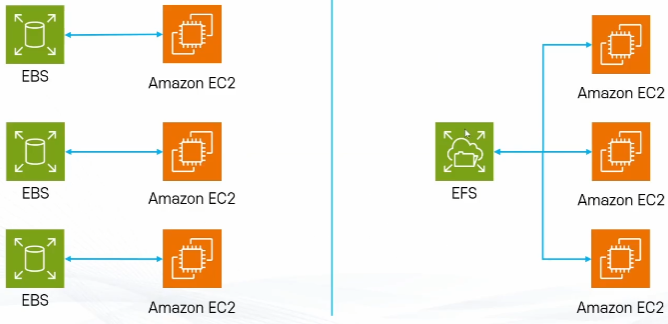

  - EFS의 동작 방식 (NFS 기반)

- EFS는 NFS(Network File System) 프로토콜을 기반으로 동작한다.
- NFS는 원격 서버의 파일 시스템을 로컬 디렉터리처럼 사용하는 기술이다.
- EC2에서는 EFS를 네트워크 드라이브처럼 마운트하여 사용한다.
- 마운트 이후에는 일반 디렉터리와 동일한 방식으로 파일을 읽고 쓸 수 있다.

## 자동 확장 구조

- EFS는 스토리지 용량을 미리 지정할 필요 없이, 데이터를 저장하는 만큼 자동으로 늘어나고 줄어든다.
- 페타바이트 단위까지 확장 가능하며, 몇 천 개의 인스턴스가 동시에 접속할 수 있다.
- 파일이 저장되면 자동으로 용량이 증가하고, 파일이 삭제되면 자동으로 용량이 감소한다.
- 운영자는 용량 관리 작업을 수행할 필요가 없기 때문에 대규모 서비스 운영 시 관리 부담을 크게 줄여준다.

## 고가용성과 내구성 구조

- EFS의 데이터는 하나의 서버나 하나의 가용 영역에만 저장되지 않는다.
- 여러 가용 영역에 분산 저장되어 자동으로 복제된다.

- 이 구조를 통해 다음이 보장된다.
  - 특정 서버 장애 시 데이터 유지
  - 특정 AZ 장애 시 데이터 보호
  - 서비스 연속성 유지
- 따라서 운영 환경에서 안정적으로 사용할 수 있다.

## 데이터 일관성 보장

- EFS는 Read After Write 일관성을 제공한다.
- 이는 파일이 저장된 직후, 다른 서버에서 즉시 최신 데이터로 읽을 수 있음을 의미한다.
- 로그인 세션, 사용자 데이터 관리에 필수적인 기능이다.

## 보안 구조와 접근 방식

- EFS는 Private 서비스로 제공된다.
- 인터넷을 통한 직접 접근은 불가능하며, VPC 내부 리소스만 접근할 수 있다.
- 외부 환경에서 접근하려면 VPN 또는 Direct Connect와 같은 별도 연결 구성이 필요하다.
- 이를 통해 데이터 보안을 강화한다.

## Mount Target의 역할

- EFS는 각 가용 영역마다 Mount Target을 생성한다.
- Mount Target은 EC2 인스턴스와 EFS 간의 연결 지점 역할을 한다.
- 각 AZ의 인스턴스는 가장 가까운 Mount Target을 통해 파일 시스템에 접근한다.
- 이를 통해 네트워크 지연과 장애 위험을 최소화한다.

## EFS 유형(Type)

- Regional EFS
  - Regional EFS는 여러 가용 영역에 자동으로 데이터를 복제한다.
  - 고가용성과 내구성이 뛰어나며, 운영 환경에서 기본적으로 사용된다.
  - 웹 서비스, 세션 관리 시스템 등에 적합하다.

- One-Zone EFS
  - One-Zone EFS는 하나의 가용 영역에만 저장된다.
  - 비용이 저렴하지만 장애에 취약하다.
  - 테스트, 실습, 임시 데이터 저장 용도로 주로 사용된다.

- 퍼포먼스 모드
  - General Purpose
  - 낮은 지연 시간에 최적화된 기본 모드이다.
  - 대부분의 웹 서비스와 업무 시스템에서 사용된다.

- Max I/O
  - 대규모 병렬 작업과 높은 처리량이 필요한 환경에 적합하다.
  - 빅데이터 처리, 미디어 렌더링 등에 활용된다.

주요 활용 사례

- 로그인 세션 저장소
- 파일 업로드 저장 공간
- 로그 파일 저장
- 공용 설정 파일 관리
- 컨테이너 볼륨 공유

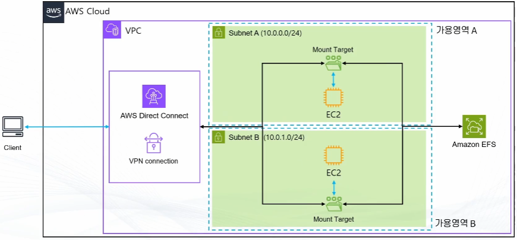
