# AWS S3 - 강의 노트

AWS 강의 노트(HWP) 원본을 이미지와 설정 코드, 주석까지 그대로 옮긴 문서다. 정리본은 이론·가이드 문서를 함께 본다.

## AWS S3 (Simple Storage Service)

- Amazon S3(Simple Storage Service)는 AWS에서 제공하는 객체 스토리지 서비스
- 데이터를 파일 단위(객체)로 저장하고, 필요할 때 인터넷을 통해 어디서든 접근할 수 있다.

- 주요 특징
  - 확장성 : 저장 용량에 제한이 없으며, 몇 개의 파일부터 수십억 개의 데이터까지 무제한으로 확장 가능
  - 내구성 : 99.999999999% (일명 11 9) 내구성을 제공하도록 설계되어, 데이터 손실 위험을 최소화
  - 가용성 : 전 세계 리전(Region)에 걸쳐 높은 가용성을 제공
  - 보안: IAM(Identity and Access Management), 버킷 정책, 암호화 기능을 통해 데이터 보안을 강화
  - 비용 효율성 : 사용한 만큼만 지불하는 종량제(Pay-as-you-go) 모델.
  - 다양한 스토리지 클래스: Standard, Intelligent-Tiering, Glacier 등 요구사항에 따라 비용/성능 최적화 가능

- 활용 사례
  - 웹사이트 정적 콘텐츠(HTML, 이미지, 동영상) 저장 및 배포
  - 백업 및 복구(Backup & Restore)
  - 로그 저장 및 데이터 레이크(Data Lake) 구축
  - 빅데이터 분석 및 머신러닝 데이터 저장소
  - 애플리케이션과 모바일 앱의 파일 저장소

## 파일 스토리지 vs 오브젝트 스토리지

- 파일 스토리지 (File Storage)
  - 구조: 파일을 계층적 구조(폴더/디렉토리)로 관리
  - 경로를 통해 빠르게 파일을 찾고 업데이트 가능
  - 확장이 제한적 : 보통 수십 TB(테라바이트) 수준에서 관리
  - 게임 설치 파일, PC 프로그램 등 (컴퓨터 로컬 드라이브, NAS)

- 오브젝트 스토리지 (Object Storage)
  - 구조: 파일을 오브젝트 단위(데이터 + 메타데이터 + 고유 ID)로 저장
  - 계층 구조가 아닌 ID(키)로 접근 (정확한 경로를 몰라도 접근 가능)
  - 확장성이 매우 뛰어남 (수십~수백 PB(페타바이트) 이상 가능)
  - 데이터 검색, 백업, 대용량 저장에 적합
  - AWS S3, 구글 드라이브, 네이버 클라우드
  - 대규모 데이터 저장소, 웹/모바일 서비스 파일 저장

- 파일 스토리지: 게임 설치해서 실행할 수 있는 PC 저장소
- 오브젝트 스토리지: 구글 드라이브처럼 단순 저장/공유는 가능하지만 게임 및 프로그램 설치는 불가능

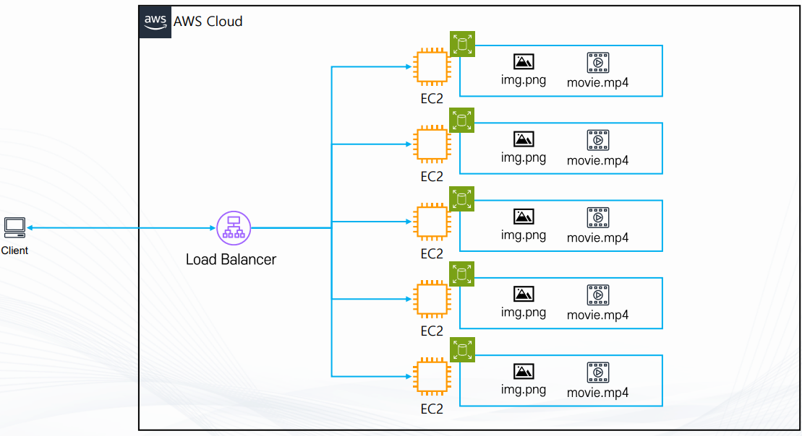

- 로드밸런서 뒤에 여러 개의 EC2 인스턴스가 있고 각 EC2에 웹페이지에서 제공할 이미지나 동영상 같은
파일을 저장하는 경우, 모든 인스턴스마다 동일한 파일을 따로 보관해야 하므로 중복 저장이 발생하고
디스크 용량이 낭비된다.
또한 파일을 수정하려면 각 EC2에 일일이 업데이트해야 하므로 인스턴스 수가 늘어나면 관리가 매우 불편해진다.
이런 구조에서는 효율성이 떨어지고 유지보수 비용도 커진다.

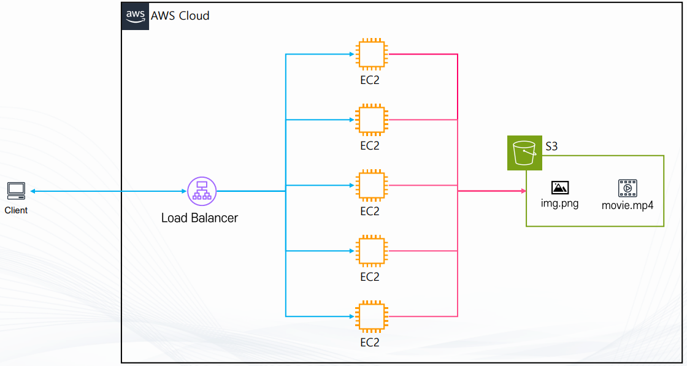

- 이 문제를 해결하기 위해 AWS S3를 활용하면 모든 EC2가 중앙의 하나의 스토리지에서
파일을 공유하도록 구성할 수 있다.
EC2에는 최소한의 웹 애플리케이션 코드만 두고, 이미지나 동영상 같은 정적 파일은 S3 버킷에 저장하여 관리한다.
이렇게 하면 중복 저장이 필요 없고 파일을 한 번만 업데이트해도 모든 EC2에서 최신 파일을 동시에 사용할 수 있다.
인스턴스를 수십, 수백 대로 늘려도 파일 관리에 추가적인 부담이 없으며, 운영 효율성과 비용 절감 효과가 크다.
즉, S3를 이용하면 파일 관리가 중앙화되고 유지보수가 간편해지며,
변경 사항이 전체 웹 서버에 즉시 반영되는 장점이 있다.

## EC2에 직접 파일 저장하는 방식

- 로드 밸런서 뒤에 여러 개의 EC2 인스턴스가 존재
- 각 EC2가 독립적으로 이미지(img.png), 동영상(movie.mp4) 파일을 저장하고 서비스

- 문제점
  - 중복 저장
  - 같은 파일을 모든 EC2에 저장해야 하므로 불필요하게 디스크 용량 낭비
  - 인스턴스 수가 늘어나면 용량과 관리 비용이 급격히 증가
  - 관리 어려움
  - 파일을 변경하려면 모든 EC2에 있는 파일을 각각 수정해야 함
  - 인스턴스가 수십, 수백 대가 되면 운영 효율이 급격히 떨어짐

## S3를 활용한 통합 스토리지 방식

- 각 EC2 인스턴스는 웹 서버 역할만 담당
- 정적 파일(이미지, 동영상 등)은 중앙의 Amazon S3 버킷에 저장
- EC2는 필요할 때 S3에 접근하여 파일을 제공

- 장점:
  - 파일 중앙화
  - 모든 EC2가 하나의 S3 버킷에서 동일한 파일을 참조 (중복 저장 불필요)

- 확장성
  - EC2 인스턴스를 수십, 수백 대 늘려도 파일 관리 부담 없음
  - 유지보수 용이성
  - 파일을 S3에서 한 번만 업데이트하면, 모든 EC2가 동일하게 최신 파일을 서비스

- 비용 절감
  - EC2 디스크에는 최소한의 웹 애플리케이션 코드만 두고, 정적 파일은 저렴한 S3에 보관

## Amazon S3 특징

- 객체 스토리지(Object Storage)
- 파일을 객체 단위(데이터 + 메타데이터 + 고유 ID)로 저장
- S3 : 파일 보관 전용, 애플리케이션 설치 불가

- 서비스 제공 방식
  - 전 세계적으로 접근 가능
  - 데이터는 사용자가 지정한 리전(Region)에 저장

- 확장성 및 용량
  - 무제한 용량 제공
  - 사실상 저장 용량에 제한 없음
  - 최소: 0 Byte
  - 최대: 5 TB

- 활용 사례
  - 정적 콘텐츠 저장 (이미지, 동영상, HTML 파일)
  - 로그 및 백업 파일 저장
  - 빅데이터 분석용 원시 데이터 저장
  - 머신러닝 학습 데이터 저장
  - 글로벌 애플리케이션을 위한 데이터 공유

## 버킷(Bucket)

- 기본 개념
  - Amazon S3에서 데이터를 저장하는 가장 기본적인 단위
  - 파일 시스템의 디렉토리/폴더와 유사한 개념
  - 모든 객체(Object)는 반드시 하나의 버킷에 속해 저장됨

- 네이밍 규칙
  - 버킷 이름은 전 세계에서 고유해야 함
  - 특정 리전에 버킷을 생성하더라도, 이름 자체는 글로벌하게 유일해야 하므로 중복된 이름 불가
  - 인터넷 도메인 네임 시스템(DNS) 규칙과 유사한 형식으로 지어야 함

- 리전(Region)과의 관계
  - 버킷을 만들 때 특정 리전을 선택해야 하며, 데이터는 해당 리전에 실제로 저장됨
  - 하지만 버킷 이름은 글로벌 단위에서 유일하게 관리됨
  - 따라서 "서울 리전"과 "도쿄 리전"에 같은 이름의 버킷을 만들 수 없음

## S3 객체(Object)의 구성 요소

- Owner (소유자)
  - 이 파일을 만든 사람 또는 계정

- Key (파일 이름)
  - 파일을 구분하는 고유한 이름 (폴더 안의 파일명 같은 개념)

- Value (파일 데이터)
  - 실제 저장된 파일의 내용 (예: 이미지, 동영상, 문서 등)

- Version Id (버전 아이디)
  - 같은 이름의 파일이 여러 버전으로 저장될 때, 각각을 구분하는 번호

- Metadata (메타데이터)
  - 파일에 대한 추가 정보 (예: 파일 생성일, 파일 형식, 크기 등)

- ACL (Access Control List, 권한 설정)
  - 이 파일을 누가 읽거나 쓸 수 있는지 정하는 권한 정보

- Torrents (토렌트 정보)
  - 대용량 파일을 여러 사용자와 동시에 빠르게 공유할 수 있도록 하는 기능 (현재는 잘 사용되지 않음)

## S3 보안 설정

- 기본 접근 권한
  - 새로 만든 S3 버킷은 기본적으로 Private(비공개) 상태
  - 즉, 만든 사람(소유자)만 접근할 수 있고 외부에서는 볼 수 없음
  - 필요하다면 설정을 바꿔 특정 사용자나 불특정 다수에게 공개 가능 (예: 웹 호스팅 시 이미지 파일을 공개)

- 보안 단위
  - 버킷 단위: Bucket Policy로 설정 (버킷 전체의 접근 권한 관리)
  - 객체 단위: ACL(Access Control List)로 설정 (특정 파일(객체)에 대한 접근 권한 관리)

- 보안 기능
  - MFA 삭제 방지: MFA(다중 인증)를 활성화하면, 실수나 해킹으로 파일이 삭제되는 것을 방지할 수 있음
  - 버전 관리(Versioning): 같은 이름의 파일을 여러 버전으로 보관 가능 (잘못 저장했을 때 이전 버전으로 복구 가능)
  - 액세스 로그 기록: 누가, 언제, 어떤 요청을 했는지 로그로 남길 수 있다.
(이 로그는 다른 버킷이나 다른 계정으로 전송 가능)

## S3 비용 종류

- 데이터 보관 비용 (Storage Cost)
  - 데이터를 S3에 저장할 때 GB당 요금이 부과됨.
  - 예시: Standard 스토리지 기준 1GB당 약 0.023 USD
  - 즉, 100GB를 저장하면 약 2.3달러/월 정도 발생

- 데이터 요청 비용 (Request Cost)
  - 파일을 업로드하거나(put), 복사(copy), 전송(post), 목록 조회(list)할 때 요청 단위로 요금 발생
  - 보통 1,000번 요청당 0.005 USD

- 데이터 전송 비용 (Transfer Cost)
  - S3에서 인터넷으로 데이터를 꺼낼 때(OutBound) 요금 발생 (GB당 약 0.09 USD)
  - 예시: 10GB를 다운로드하면 0.9달러 청구됨.
  - 단, 같은 리전 내 EC2 <--> S3 간 전송은 무료

- 기타 부가 비용 (Additional Cost)
  - 암호화: 서버 측 암호화 사용 시 추가 요금 발생할 수 있음.
  - 스토리지 관리 기능: 수명 주기 정책(Lifecycle Policy) 사용 시 일부 비용
  - 복제(Replication): 여러 리전에 복제 저장 시 복제 데이터 용량과 전송 요금 추가

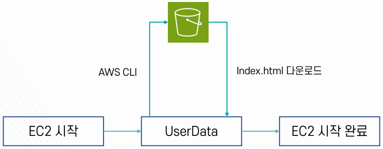

## S3 스토리지 클래스

- S3는 저장 목적, 예산에 따라 파일 저장 클래스(File Storage Classes)와
아카이브 클래스(Archive Storage Classes)로 나뉘어진다.

## 파일 저장 클래스 (File Storage Classes)

- 주로 실시간 서비스 운영용
- 데이터를 바로바로 읽고 쓸 수 있음 (밀리초 단위 응답)
- 다중 AZ(가용영역)에 복제 저장되어 높은 내구성과 가용성 보장
- 저장 비용은 상대적으로 높음
- S3 Express One Zone  -->  S3 Standard  -->  S3 Standard-IA  -->  S3 One Zone-IA
(우측으로 넘어갈수록 저렴)
- 웹사이트 이미지, 동영상 스트리밍, 앱 로그, 빅데이터 분석 데이터
- 자주 사용하거나 실시간으로 접근해야 하는 데이터 (분석,로그 처리, 웹/모바일 서비스 파일 저장)

- S3 스탠다드 (S3 Standard)
  - 가용성 : 99.99%
  - 내구성 : 99.999999999% (11 9’s)
  - 저장 방식: 최소 3개 이상의 가용영역(AZ)에 분산 보관
  - 보관 제한: 최소 보관 기간 없음, 최소 보관 용량 없음
  - 요청 비용: $0.0045/1000 requests (ap-northeast-2 기준)
  - 저장 비용: $0.025/GB (ap-northeast-2 기준)

- S3 스탠다드 IA (Infrequently Accessed)
  - 특징: 자주 사용되지 않는 데이터를 저렴한 가격에 보관 (비용 절감 목적)
  - 저장 방식: 최소 3개 이상의 가용영역(AZ)에 분산 보관 (내구성과 가용성 확보)
  - 최소 저장 용량: 128 KB (이보다 작은 파일은 비용 효율성이 떨어짐)
  - 최소 저장 기간: 30일 (30일 이전 삭제 시 패널티 비용 발생)
  - 데이터 요청 비용: 데이터를 불러올 때마다 추가 비용 발생 (저장 비용은 저렴하지만 조회 시 비용이 큼)

```
   * 요청 비용: $0.01/1000 requests (IA 기준)
   * 비교: $0.0045/1000 requests (Standard 기준)
   * (ap-northeast-2 기준)
 # 사용 사례 : 자주 접근하지 않지만 보관해야 하는 중요 파일 (백업, 재해복구 등)
 # 저장 비용
   * $0.0138 / GB (IA, Standard보다 저렴)
   * vs $0.025 / GB (Standard)
   * (ap-northeast-2 기준)
```

- S3 One Zone-IA (One Zone Infrequently Accessed)
  - 특징: 자주 사용되지 않고, 중요하지 않은 데이터를 저렴한 가격에 보관 (비용 절감 목적)
  - 저장 방식: 단 한 개의 가용영역(AZ)에만 보관 (AZ 장애 시 데이터 손실 가능)
  - 최소 저장 용량: 128 KB (작은 파일 저장 시 비효율적)
  - 최소 저장 기간: 30일 (30일 이전 삭제 시 추가 비용 발생)
  - 데이터 요청 비용: 데이터를 불러올 때마다 비용이 더 많이 발생 (조회 비용이 저장 비용보다 큼)

```
   * 요청 비용: $0.01 / 1000 requests (One Zone-IA 기준)
   * 비교: $0.0045 / 1000 requests (Standard 기준)
   * (ap-northeast-2 기준)
 # 사용 사례: 자주 사용하지 않으며 쉽게 복구할 수 있는 파일 (EX :  된 썸네일 이미지)
 # 저장 비용
   * $0.011 / GB (One Zone-IA, 가장 저렴한 IA 옵션) s $0.0138 / GB (Standard-IA)
   * (ap-northeast-2 기준)
```

- S3 Express One Zone
  - 특징: 매우 빠른 퍼포먼스를 위해서 하나의 가용영역(AZ)에 위치한 특별한 저장소에 저장 (장애 시 위험 있음)
  - 응답 속도: millisecond 단위의 응답속도 (약 10배 빠름, 초저지연 처리 가능)
  - 요청 비용: Standard와 비교해 50% 저렴한 요청 비용 (데이터 호출 시 비용 절감)
  - 저장 방식: Amazon S3 Directory Bucket에 저장 (Express 전용 버킷)
  - 장점: 컴퓨팅 리소스와 스토리지 리소스를 같은 공간(리전 내 동일 AZ)에 위치시켜 더 빠른 액세스 가능
  - 리전 지원: 몇몇 리전만 사용 가능 (예: ap-northeast-2 서울 리전 사용 불가)
  - 저장 비용: $0.16 / GB (us-east-1 리전 기준, Standard보다 고비용이지만 속도가 강점)

- S3 Intelligent-Tiering
  - 머신 러닝 기반 자동 티어링: 데이터 접근 패턴을 분석해 Standard  <-->  IA (Infrequent Access) 간
자동으로 클래스 변경 (사용자가 직접 관리하지 않아도 됨)
  - 비용 최적화: 자주 접근하는 데이터는 Standard 요금으로, 드물게 접근하는 데이터는 IA 요금으로 자동 이동
  - 퍼포먼스 손실 없음: 데이터가 어느 티어에 있든 밀리초 단위 응답 제공 (성능 저하 없음)
  - 운영 오버헤드 없음: 관리자가 직접 모니터링하거나 수동으로 티어 이동할 필요 없음 (자동화된 최적화)
  - 사용 사례: 접근 패턴을 미리 알기 어려운 데이터 (예: 로그, IoT 데이터, 연구용 데이터셋 등)

## 아카이브 클래스 (Archive Storage Classes)

- 장기 보관용 데이터 대상
- 저장 비용이 매우 저렴함
- 대신 데이터를 꺼내려면 검색 요청 과정 필요 (몇 분 ~ 수 시간)
- 아카이브 특성상 자주 접근하지 않는 데이터에 적합
- S3 Glacier Instant Retrieval  -->  S3 Glacier Flexible Retrieval  -->  S3 Glacier Deep Archive
(우측으로 넘어갈수록 저렴)
- 의료 기록, 금융,세무 자료, 법적 규제 데이터, 장기 백업
- 수년간 거의 사용하지 않지만 반드시 보관해야 하는 데이터

- S3 Glacier Instant Retrieval
  - 용도: 아카이브용 저장소 (장기 보관 데이터, 드물게 조회)
  - 최소 저장 용량: 128 KB (작은 파일 저장 시 비효율적)
  - 최소 저장 기간: 90일 (90일 이전 삭제 시 패널티 비용 발생)
  - 접근 속도: 바로 액세스 가능 (밀리초 단위 응답, 아카이브 계열 중 가장 빠름)
  - 사용 사례: 의료 이미지, 뉴스 아카이브 등 (자주 쓰이지 않지만 즉시 조회가 필요한 경우)
  - 저장 비용: $0.005/GB (ap-northeast-2 기준, Standard 대비 약 1/5 수준)

- S3 Glacier Flexible Retrieval
  - 용도     : 아카이브용 저장소 (장기 보관, 낮은 비용, 느린 검색 속도 허용)
  - 최소 저장 용량 : 40 KB (작은 파일 저장 시 비효율적)
  - 최소 저장 기간 : 90일 (90일 이전 삭제 시 패널티 비용 발생)
  - 접근 속도  : 분 ~ 시간 단위 이후 액세스 가능 (즉시 조회 불가, 검색 요청 필요)
  - 사용 사례  : 장애 복구용 데이터, 백업 데이터 등 (자주 쓰이지 않고 긴급 상황에 필요)
  - 저장 비용  : $0.0045/GB (ap-northeast-2 기준, Glacier Instant Retrieval보다 저렴)

- S3 Glacier Deep Archive
  - 용도: 아카이브용 저장소 (가장 저렴한 스토리지, 장기 보관 전용)
  - 최소 저장 용량: 40 KB (작은 파일 저장 시 비효율적)
  - 최소 저장 기간: 180일 (90일 이전 삭제 시 패널티 비용 발생)
  - 데이터 검색 속도: 데이터를 가져오는 데 12~48시간 소요 (아주 느림, 장기 보관 전용)
  - 사용 사례: 오래된 로그 저장, 사용 가능성은 거의 없지만 법적으로 보관해야 하는 문서등(규제 준수 목적)
  - 저장 비용: $0.002 / GB (ap-northeast-2 기준, S3 클래스 중 최저가)

## S3 권한

- Amazon S3에서 권한(permissions)은 누가 어떤 작업을 어떤 객체(Object)나
버킷(Bucket)에 대해 수행할 수 있는지를 정의하는 보안 메커니즘

- S3 권한은 크게 IAM 기반 권한, 리소스 기반 권한, 액세스 제어 리스트(ACL) 로 나눌 수 있다.
  - IAM 정책
*IAM 사용자, 그룹, 역할에게 권한을 주는 방식
*예: "이 사용자는 S3 버킷 안에서 파일을 읽기만 할 수 있다"

  - 버킷 정책
*버킷 자체에 적용하는 권한 설정
*특정 사용자나 계정이 해당 버킷을 읽거나 쓸 수 있도록 허용/거부 가능
*예: "협력사 계정만 이 버킷 안 파일을 다운로드할 수 있다"

  - ACL (Access Control List)
*객체나 버킷 단위로 권한을 주는 옛날 방식
*지금은 거의 쓰지 않고, IAM 정책이나 버킷 정책을 주로 사용 (AWS 비권장)

## S3의 계층 구조

- 폴더처럼 보이지만 실제 폴더는 아님
- AWS S3 콘솔에서는 마치 디렉토리(폴더) 구조처럼 보이지만,
내부적으로는 계층 구조가 존재하지 않고 단순히 "키(Key)" 문자열로 관리됨 (폴더 구조 처럼 보이지만 실제 폴더는 아님)

- 키(Key)와 버킷(Bucket)
  - S3 객체는 항상 버킷(bucket) 안에 저장된다.
  - 각 객체는 고유한 키(Key) 값을 갖는다.
  - 키(Key) 안에 / 문자가 있으면 콘솔에서 디렉토리처럼 표시될 뿐, 실제 폴더는 아니다.
  - 예시 : s3://mybucket/world/southkorea/seoul/guro/map.json

```
  * 버킷명(bucket name): mybucket
  * 키(Key): world/southkorea/seoul/guro/map.json (단일 문자열)
  * 콘솔에서는 / 기준으로 worl --> southkorea --> seoul --> guro --> map.json 구조처럼 보일뿐이다.
```

## S3 버킷 정책 (Bucket Policy)

- 버킷 단위로 부여되는 리소스 기반 정책(Resource-based Policy)
- 해당 버킷 안의 데이터에 대해 누가, 언제, 어디서, 어떻게, 무엇을 할 수 있는지 정의

- 권한 조절 방법
  - 리소스의 계층 구조(Key 경로)에 따라 세부적으로 권한 부여 가능
  - 예시 : "Resource": "arn:aws:s3:::my-bucket/images/*"
  - my-bucket 안의 images/ 폴더로 시작하는 모든 객체에 대해 정책 적용

- 설정 가능 대상
  - 다른 AWS 계정의 사용자/역할(Entity)에 권한 부여 가능 (외부 계정 접근 허용)
  - 익명 사용자(Anonymous) 에 대한 권한 설정 가능 (퍼블릭 액세스 허용 시 사용)

- 기본 동작
  - 모든 S3 버킷은 기본적으로 Private (비공개)
  - 즉, 정책을 설정하지 않으면 외부에서 접근 불가

```json
{
  "Version": "2012-10-17",      // 정책 버전 (항상 이 날짜 사용)
  "Statement": [                    // 실제 정책 내용 (여러 개 넣을 수 있음)
    {
      "Sid": "StatementAllow",      // 이 정책의 식별자(ID) (정책 이름.)
      "Effect": "Allow",            // 허용(Allow)인지 거부(Deny)인지 설정
      "Principal": "*",             // 누가 접근 가능한지 지정 ("*" = 모든 사용자)
      "Action": "s3:GetObject",     // 허용할 동작 (여기서는 객체 다운로드)
      "Resource": "arn:aws:s3:::test.soldesk.com/*"
                                    // 정책이 적용되는 대상 리소스
                                    // test.soldesk.com 버킷의 모든 객체("*")에 적용
    }
  ]
}
```

- 누가(Principal) : 모든 사용자(*)
- 무엇을(Action) : s3:GetObject (객체 다운로드)
- 어디서(Resource): demo.rwlecture.com 버킷의 모든 객체(/*)
- 결과(Effect) : 허용(Allow)
- 즉, 이 정책은 "모든 사람이 test.soldesk.com 버킷 안에 있는 파일을 다운로드할 수 있다"는 의미

## S3 권한 부여 (실습)

```
 (실습1)
```

- IAM 정책 / 버킷 정책으로 S3 버킷에 대한 권한 부여
  - IAM 사용자에 S3 접근을 허용하는 권한 부여 (IAM 정책)
  - IAM 사용자에 대한 접근을 허가하는 버킷 정책을 만들어 S3에 붙여 접근 허용 (버킷 정책)

```
 (실습2)
```

- 나만의 S3 홈 디렉토리 만들기
  - IAM 사용자를 생성해서 해당 사용자만 접근 가능한 S3 버킷 디렉토리 만들기

## IAM 사용자 (User)

- 정의: AWS 리소스에 접근할 수 있는 개별 계정 (사람 혹은 애플리케이션 단위)
- 고유한 자격 증명(Access Key, Secret Key, 비밀번호)을 가짐
- 콘솔 로그인, CLI, SDK를 통해 AWS에 접근 가능
- 권한은 직접 사용자에게 부여하거나 그룹을 통해 상속받음
- 예시
  - 개발자 A : IAM 사용자 계정 발급
  - 서버에서 자동화 스크립트를 돌리기 위한 프로그램용 사용자 생성

## IAM 사용자 그룹 (User Group)

- 정의: 여러 사용자를 묶어 공통된 권한을 부여할 수 있는 집합
- 사용자 그룹 자체에는 자격 증명이 없음
- 그룹에 정책을 연결하면 그룹에 속한 모든 사용자가 권한을 상속받음
- 권한 관리 효율성을 높이는 용도
- 예시
  - Developers 그룹 : 모든 개발자는 EC2 시작/중지 권한 부여
  - DBA 그룹: 모든 DBA는 RDS 관리 권한 부여

## 버전관리 및 객체 잠금

## S3 버전 관리 (Versioning)

- S3 객체의 변경 이력을 여러 버전으로 저장하는 기능

- 같은 Key 이름의 객체를 다시 업로드해도 기존 객체를 덮어써서 없애는 것이 아니라
새로운 Version ID를 가진 객체 버전으로 저장

- 객체를 삭제해도 기존 버전이 바로 삭제되는 것이 아니라
Delete Marker가 생성되어 현재 객체가 삭제된 것처럼 보이게 됨

- 이전 버전이 남아 있기 때문에 실수로 삭제하거나 덮어쓴 객체를 복구할 수 있음

- 활성화 조건
  - 버킷 단위로 설정하며 기본값은 비활성화 상태이다.
  - 한 번 활성화하면 완전히 비활성화 상태로 되돌릴 수 없다.
  - 필요하면 Suspend 상태로 변경 가능
  - Suspend 상태에서는 기존 버전은 유지되지만 이후 새 객체에 대한 일반적인 버전 생성은 중지된다.

- 특징 및 제약
  - 버전 관리 활성화 이전에 저장된 기존 객체도 그대로 유지된다.
  - 기존 객체는 처음에는 별도의 Version ID가 없는 null 버전으로 존재할 수 있다.
  - 버전 관리 활성화 이후 객체가 수정되면 새로운 버전이 계속 생성된다.
  - 동일한 Key의 객체라도 버전별로 각각 저장되므로 저장 공간 사용량이 증가할 수 있다.
  - 이전 버전들도 저장 용량에 포함되므로 버전 수가 많아질수록 저장 비용이 증가할 수 있다.

- 삭제 동작
  - 일반 삭제 : 객체 자체를 바로 삭제하지 않고 Delete Marker를 생성
  - Delete Marker를 제거하면 이전 버전을 다시 현재 객체처럼 복원 가능
  - 특정 Version ID를 지정하여 삭제하면 해당 버전 자체를 실제로 삭제할 수 있다.

- 운영 관리
  - Lifecycle 규칙과 연동 가능
  - 오래된 이전 버전을 다른 스토리지 클래스로 이동 가능
  - 일정 기간이 지난 이전 버전을 자동 삭제 가능
  - Delete Marker도 Lifecycle 규칙으로 관리 가능
  - 예 : 90일이 지난 이전 버전 삭제 또는 오래된 이전 버전을 Glacier 계열 스토리지로 이동

- 보안 강화
  - MFA Delete 기능 지원
  - 특정 버전의 영구 삭제 또는 버전 관리 설정 변경 시  MFA 인증을 요구하도록 설정 가능
  - 실수 또는 계정 탈취로 인한 중요 객체의 영구 삭제 위험을 줄일 수 있다.
  - MFA Delete는 일반적인 콘솔 설정만으로 활성화하는 방식이 아니라
버킷 소유자 Root 계정과 AWS CLI/API 등을 통해 설정

1단계 파일 생성
test.jpg를 처음 업로드하면 버전 ID 11111이 생성되고 최신 버전이 되어 사용자 요청 시 11111이 반환된다.

2단계 파일 업데이트
같은 키로 다시 업로드하면 새 버전 ID 22222가 생성되어 최신 버전이 되고 기존 11111은 과거 버전으로 남는다.

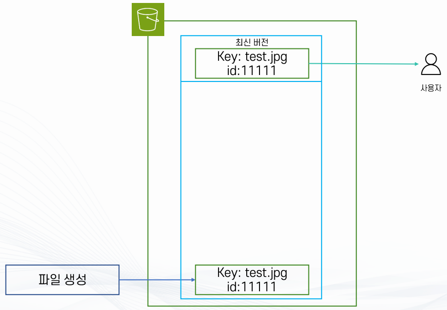

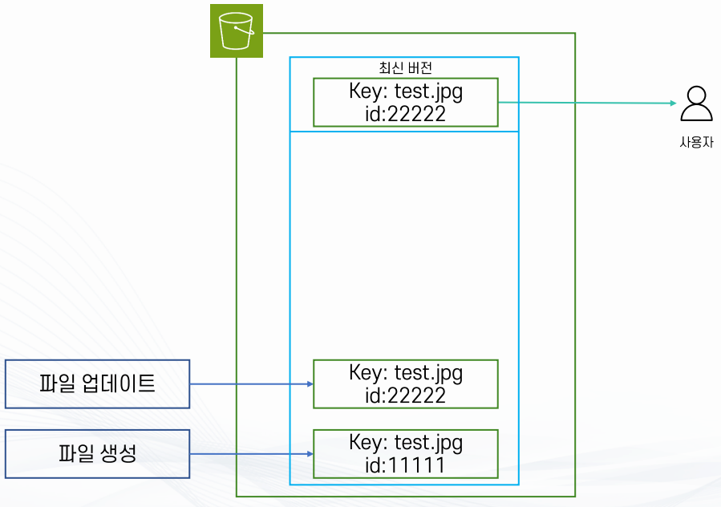

3단계 파일 삭제
삭제를 수행하면 실제 데이터를 지우지 않고 삭제 마커가 최신 버전으로 추가되어 객체가 없는 것처럼 보이지만
과거 버전 22222와 11111은 그대로 남아 복원할 수 있다.

4단계 삭제 마커 제거
삭제 마커만 삭제하면 삭제 상태가 해제되어 바로 아래 버전인 22222가 최신으로 복원된다.

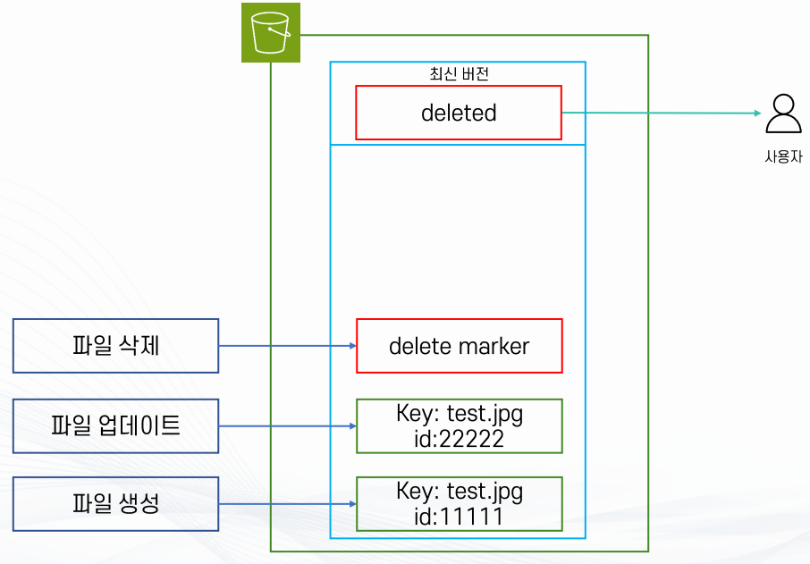

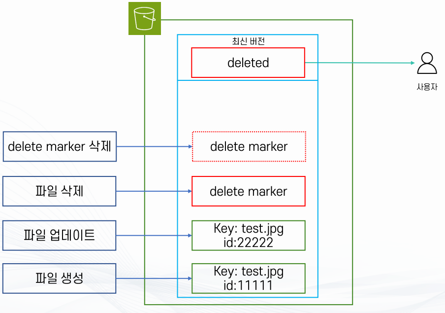

5단계 최신 버전 조회
별도로 버전 ID를 지정하지 않으면 항상 최신 버전이 반환되며 특정 과거 버전을 받으려면 해당 버전 ID를 명시해야 한다.

6단계 특정 버전 삭제
버전 ID를 지정해 과거 버전 하나만 영구 삭제할 수 있으며 최신 버전이 아닌 경우
사용자에게 보이는 결과는 변하지 않는다.


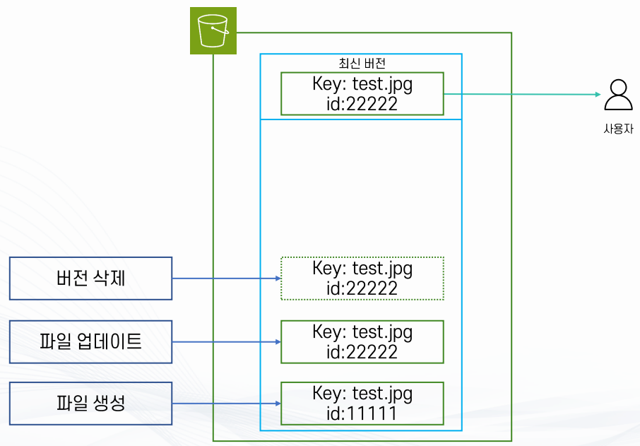

7단계 롤백
최신 버전 22222를 삭제하면 바로 아래 버전 11111이 자동으로 최신이 되어 과거 상태로 롤백된다.

8단계 MFA Delete 적용
버전 삭제나 삭제 마커 제거 같은 민감 작업에 MFA 토큰을 요구하도록 설정하면
오남용이나 계정 탈취에 의한 대량 삭제를 효과적으로 방지한다.

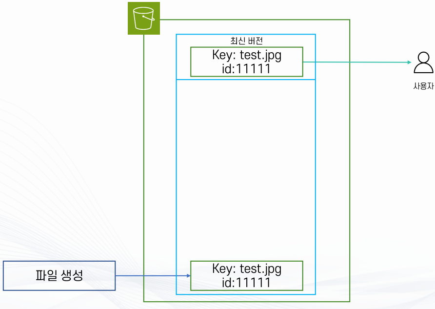

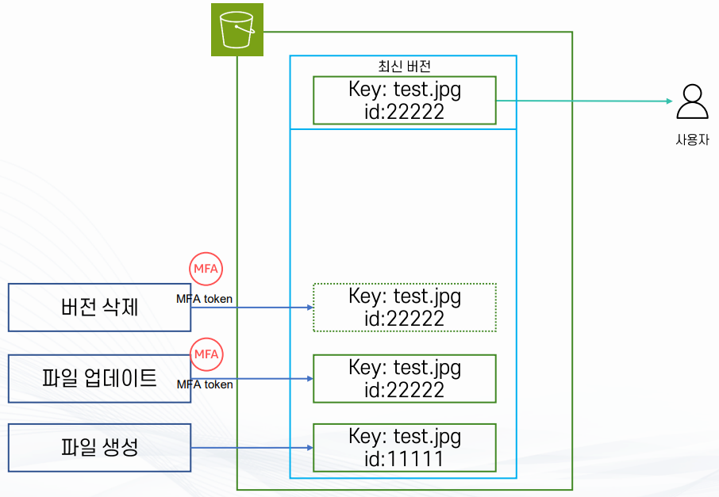

## S3 버전 관리 유의사항

- 버전 관리 비활성화 불가
  - 버전 관리는 버킷 단위로 활성화해야 하며 기본적으로 비활성화 상태다
  - 활성화 후에는 중지(Suspend)는 가능하지만, 완전히 비활성화는 불가능하다
  - 즉 한 번 버전 관리를 시작하면 되돌릴 수 없으며, 필요하다면 버킷을 삭제하고 새로 생성해야만
비활성화 효과를 얻을 수 있다

- 스토리지 비용 증가
  - 모든 버전에 대해 스토리지 비용이 발생한다
  - 예: 10GB짜리 객체가 있고 해당 객체의 버전이 5개라면 실제 사용량은 50GB로 계산되어 요금이 청구된다
  - 불필요한 오래된 버전을 정리하지 않으면 비용이 기하급수적으로 늘어날 수 있다

- 운영 상 고려할 점
  - 개발 환경에서는 불필요하게 활성화하지 않는 것이 좋다
  - 운영 환경에서는 데이터 보호가 중요하므로 활성화 후 Lifecycle 규칙으로 비용을 통제하는 것이 바람직하다

## S3 객체 잠금(Object Lock)

- S3 객체를 삭제하거나 덮어쓰지 못하도록 보호하는 기능
- WORM(Write Once, Read Many) 모델을 지원
  - 한 번 저장한 객체를 지정된 기간 동안 변경하거나 삭제하지 못하도록 보호
- 데이터의 무결성 유지와 규제 준수를 위해 사용
- 랜섬웨어, 실수로 인한 삭제, 내부자의 악의적인 삭제 등으로부터 중요 데이터 보호 가능

- 활성화 조건
  - S3 Object Lock은 Versioning이 활성화된 버킷에서 사용
  - Object Lock은 객체의 특정 버전(Version)을 보호하는 방식으로 동작
  - 버킷에 기본 보존 정책(Default Retention)을 설정할 수도 있고
객체별로 별도의 보존 정책을 설정할 수도 있음

- 사용 목적
  - 규제 준수(Compliance) : 법률이나 규정에서 요구하는 데이터 보존 기간을 충족하기 위해 사용
  - 데이터 보호(Security): 실수, 랜섬웨어, 내부자 위협 등으로부터 중요 데이터 보호
  - 감사 및 기록 보존: 로그, 거래 기록, 백업 데이터 등 변경되면 안 되는 데이터를 보호

## S3 객체 잠금의 종류

- S3 Object Lock의 보호 방식은 크게 다음 두 가지로 구분
  - Retention Mode: 지정된 기간 동안 객체를 삭제하지 못하도록 보호
  - Legal Hold: 종료 날짜 없이 Hold가 해제될 때까지 객체를 보호

## 보존 모드(Retention Mode)

- 객체에 보존 종료 날짜(Retain Until Date)를 지정하여 해당 날짜까지 객체 버전을 삭제하지 못하도록 보호
- Retention Mode는 다음 두 가지가 있다.
  - Compliance Mode
  - Governance Mode

  - Compliance Mode

- 가장 강력한 객체 보호 방식
- 보존 기간이 끝날 때까지 객체 버전을 삭제할 수 없다.
- 보존 기간을 단축하거나 잠금을 해제할 수 없다.
- Root 사용자를 포함하여 누구도 보존 설정을 우회할 수 없다.
- 엄격한 법적 규제나 데이터 보존 요구사항이 있는 환경에서 사용
- 예: 금융 거래 기록을 7년 동안 의무 보관, 의료 데이터 및 감사 기록 보관

  - Governance Mode

- 일반적인 사용자나 관리자에게는 객체 삭제가 제한됨
- 하지만 특별한 권한을 가진 사용자는 보존 설정을 우회할 수 있다.
  - 필요한 권한 : s3:BypassGovernanceRetention
- Compliance Mode보다 유연하게 운영 가능
- 내부 데이터 보호 정책이나 테스트 환경 등에 사용
- 필요한 경우 권한을 가진 관리자가 보존 기간을 변경하거나 우회 가능

## Legal Hold

- 특정 객체 버전에 대해 삭제를 무기한 차단하는 기능
- 보존 종료 날짜를 지정하지 않음
- Legal Hold가 ON 상태인 동안 객체 버전을 삭제할 수 없다.
- 필요한 시점에 Legal Hold를 해제하면 다시 삭제 가능
- Retention Mode와 독립적으로 사용할 수 있다.
  - Retention Mode와 Legal Hold를 동시에 적용하는 것도 가능

- 사용 사례
  - 법적 분쟁 관련 자료 보존
  - 감사 대응 자료 보존
  - 내부 조사 대상 데이터 보호
  - 삭제 시점을 미리 정할 수 없는 중요 데이터 보호

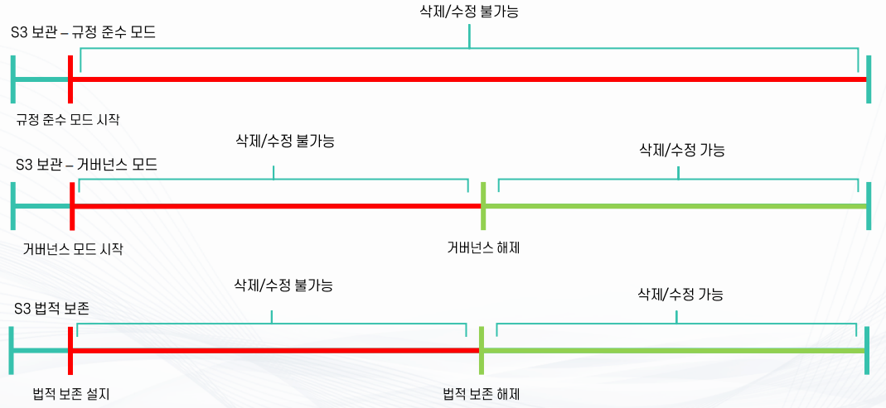

## Amazon S3 수명주기

- 많은 버전이 쌓이면 관리가 어려워지고 수십만 개 파일까지 늘어날 수 있다 오래된 버전이나
잘 사용하지 않는 파일들을 효율적으로 관리하기 위한 기능이 바로 S3 수명 주기이다.
- S3 수명 주기를 활용하면 일정 기간 이후 객체의 상태를 자동으로 변경하거나 정리할 수 있다

- 일정 기간이 지나면 객체(Object)에 대해 자동으로 상태를 변경하거나 삭제하는 기능
- 스토리지 비용 최적화와 데이터 보존 정책 준수를 위해 사용

- 작업 유형
  - 전환 작업(Transition actions) : 객체를 더 저렴한 스토리지 티어로 이동
*예 : 30일 후 Amazon S3 아카이브(Glacier)로 이동

```
   *예 : 50일 후 S3 Standard-IA(Infrequent Access)로 이동
 # 만료 작업(Expiration actions) : 객체를 자동 삭제
   *예: 업로드 후 90일 지난 로그 파일 자동 삭제
```

- 비용 절감 효과
  - 수명 주기 규칙은 기존 객체뿐만 아니라 이미 저장된 오래된 객체에도 소급 적용
  - 예 : "30일 후 만료" 규칙을 설정하면 이미 30일 이상 된 모든 객체도 동시에 삭제 처리

- 필터 및 조건 적용 가능
  - 디렉터리(접두사 Prefix)나 객체 태그(Tag)를 기준으로 특정 객체만 규칙 적용
  - 예시

```
   */image/thumbnail/production 경로의 5MB 이상 파일들을 30일 뒤 아카이브(Glacier)로 전환
   *2024-05-30 이후 /image/dev 경로의 1MB 이상 이미지 파일 자동 삭제
```

- 운영 활용 사례
  - 로그 파일, 백업 파일처럼 일정 기간만 보관 후 자동 삭제
  - 자주 접근하지 않는 이미지/동영상은 IA나 Glacier로 이동해 비용 절감
  - 규제 준수 및 데이터 보존 정책과 연계해 일정 기간 이후 데이터 폐기 자동화

## S3 전환 작업(Transition actions) 정리

- 일정 기간 이후 객체(Object)의 스토리지 클래스를 자동 변경하는 기능
- 자주 접근하는 데이터는 고성능,고비용 클래스에 두고 오래된 데이터는
저비용 클래스(IA, Glacier 등)로 자동 전환하여 비용 절감

- Waterfall 모델
  - 시간이 지남에 따라 데이터를 점점 더 저렴한 티어로 이동
  - 예: Standard --> IA --> Glacier --> Glacier Deep Archive

- 제약 사항
  - 다른 클래스에서 다시 Standard로 전환은 불가능
  - 128KB 미만 파일은 Standard-IA, Intelligent-Tiering, Glacier Instant Retrieval로 이동 불가

- 스토리지 클래스 전환 예시
  - S3 Standard: 자주 접근하는 데이터
  - S3 Standard-IA (Infrequent Access): 가끔 접근하는 데이터, 저비용
  - S3 Intelligent-Tiering: 자동으로 접근 패턴을 분석해 비용 최적화
  - S3 One Zone-IA: 한 개 AZ에만 저장, 저렴하지만 가용성 낮음
  - S3 Glacier Instant Retrieval: 거의 접근하지 않지만 즉시 조회 필요
  - S3 Glacier Flexible Retrieval: 장기 보관, 몇 분~시간 단위 복구
  - S3 Glacier Deep Archive: 최저가 보관, 복구에 수 시간~12시간 소요

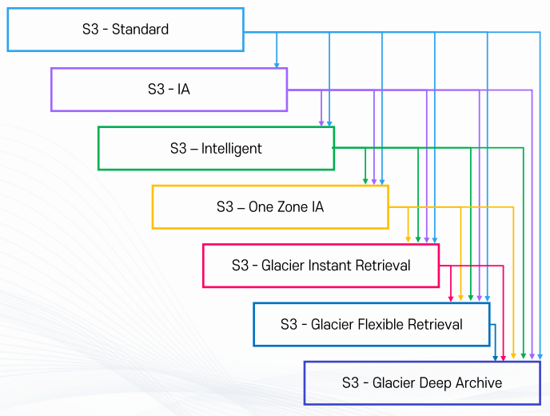

## 만료 작업(Expiration actions)

- 일정 기간이 지나면 객체(Object)를 자동으로 삭제하는 기능
- Lifecycle 규칙에서 만료(expiration)를 설정하면 적용

- 버전 관리 여부에 따른 차이
  - 버전 관리가 비활성화된 버킷 (객체는 async(비동기) 방식으로 영구 삭제됨)

- 버전 관리가 활성화된 버킷
  - 현재 버전이 delete marker가 아니면 새로운 delete marker를 추가하고 이를 최신 버전으로 표시
  - 만약 현재 버전 자체가 delete marker라면 아무런 동작을 하지 않음 (이미 삭제된 상태로 간주)

- 삭제 동작 특징
  - 삭제 날짜가 되더라도 즉시 삭제되지 않고 일정 지연(delay) 발생 가능
  - 이 지연 동안에는 스토리지 비용이 추가로 발생하지 않음
  - HeadObject, GetObject API로 삭제 예정 여부를 확인 가능

- 수행 시간
  - UTC 기준으로 Lifecycle 규칙이 실행됨
  - 첫 번째 규칙 수행까지 최대 약 48시간 정도 소요될 수 있음

- 활용 사례
  - 주기적으로 쌓이는 로그 파일을 자동 삭제
  - 규정 준수나 보안 정책에 따라 일정 기간 후 데이터를 반드시 폐기해야 할 때 사용
  - 실패한 멀티파트 업로드의 미완료 파일 자동 삭제도 Lifecycle 만료 규칙에 포함 가능

## S3 수명 주기 조건

- 객체의 수명
  - 전환(Transition)이나 만료(Expiration)는 객체가 생성된 시점부터 일정 기간이 지나야 동작
  - 예: 객체 생성 후 30일 : Standard에서 IA로 전환
  - 예: 객체 생성 후 365일: 자동 삭제

- 날짜 기반 조건
  - 특정 날짜를 기준으로 모든 객체에 대해 일괄 적용 가능
  - 단, 콘솔에서 직접 설정은 불가능하며 API나 CLI로만 지정 가능
  - 예: "2025년 5월 30일부터 모든 객체 삭제" 규칙을 설정하면 5월 30일 이전에 있던 객체들은 이 날짜에 일괄 삭제
  - 5월 30일 이후 새로 업로드된 객체도 즉시 삭제 처리된다.

## S3 수명 주기 필터링 조건

- 필터 개념
  - 수명 주기 정책은 버킷 전체에 적용할 수도 있지만, 필터를 이용하면 특정 객체만 선별 적용 가능
  - 불필요한 데이터만 정리하거나 특정 데이터만 장기 보관할 때 유용

- Prefix(접두사) 기반 필터
  - 객체 키(Key)의 시작 문자열을 기준으로 필터링
  - 예시

```
      */log : 로그 파일만 정책 적용
      */log/production : 운영 환경 로그만 정책 적용
      */image/thumbnails: 썸네일 이미지에만 정책 적용
```

- Tag 기반 필터
  - 객체에 붙은 태그(Key=Value 쌍)를 기준으로 필터링
  - 특정 태그가 있을 때만 적용 가능
  - 태그 조건은 AND 조건으로 묶을 수 있음
  - 예시
*Environment=Dev 태그가 붙은 객체만 삭제
*Project=A AND Backup=True 태그가 모두 있는 경우만 Glacier로 전환

- 객체(Object) 크기 기반 필터
  - 객체 크기를 조건으로 정책 적용 가능
  - 예시
*5MB 이상인 파일만 IA로 이동
*1GB 이상인 대형 객체만 Glacier로 전환

- 필터 조합 가능
  - Prefix + Tag + Size 조건을 함께 사용 가능

- 예시
  - /image 경로에 있으면서, 크기가 5MB 이상이고, Archive=True 태그가 있는 객체만 Glacier로 전환

## S3 정적 호스팅

## 정적 콘텐츠(Static Contents)

- 사용자나 요청 조건에 관계없이 동일한 내용이 제공되는 콘텐츠
- 서버에서 별도의 프로그램 연산이나 데이터베이스 조회 없이 저장되어 있는 파일을 그대로 전달
- HTML, CSS, JavaScript, 이미지, 동영상 등의 파일로 구성 가능
- 서버 처리 과정이 적기 때문에 빠르게 제공할 수 있다.
- CDN이나 Cache와 연계하여 성능을 더욱 향상시킬 수 있다.

- 특징
  - 모든 사용자에게 동일한 내용 제공
  - 서버에서 별도의 데이터 처리 과정이 거의 없다.
  - Cache 적용이 쉽고 서버 부하가 적다.
  - 빠른 응답 속도를 제공하기 쉬움

- 장점
  - 속도가 빠름
  - 서버 자원 사용량이 적다.
  - CDN과 연계하기 쉬움
  - 많은 사용자가 동시에 접속하더라도 비교적 안정적으로 서비스 가능

- 단점
  - 콘텐츠 변경 시 파일을 직접 수정하거나 다시 배포해야 함
  - 사용자별 맞춤형 콘텐츠 제공에 제한이 있다.
  - 실시간으로 변경되는 데이터를 표현하는 데 적합하지 않다.

- 사용 사례
  - 회사 소개 페이지
  - 안내 페이지
  - 이미지 및 동영상 파일
  - CSS, JavaScript 파일
  - 정적으로 작성된 HTML 페이지

## 동적 콘텐츠(Dynamic Contents)

- 사용자, 시간, 입력값, 데이터베이스 상태 등에 따라 제공되는 내용이 달라지는 콘텐츠

- 사용자가 요청할 때마다 서버가 프로그램을 실행하거나 데이터베이스를 조회하여 결과를 생성한 후 전달

- PHP, JSP, ASP.NET, Spring, Node.js 등의 서버 측 기술을 이용하여 구현할 수 있다.

- 특징
  - 사용자마다 서로 다른 콘텐츠 제공 가능
  - 요청 시점의 최신 데이터를 반영할 수 있다.
  - 서버에서 프로그램 연산이나 데이터베이스 조회가 필요할 수 있다.
  - 요청마다 처리 결과가 달라질 수 있다.

- 장점
  - 사용자 맞춤형 서비스 제공 가능
  - 실시간 데이터 반영 가능
  - 로그인 정보나 사용자 입력값에 따라 다른 결과 제공 가능
  - 복잡한 웹 서비스 구현 가능

- 단점
  - 요청할 때마다 서버 처리가 필요하므로 서버 부하가 증가할 수 있다.
  - 정적 콘텐츠에 비해 응답 속도가 느려질 수 있다.
  - Cache 적용이 상대적으로 복잡할 수 있다.
  - 서버나 데이터베이스 장애의 영향을 받을 수 있다.

- 사용 사례
  - 로그인 후 표시되는 사용자 정보
  - 게시판 및 댓글
  - 쇼핑몰 장바구니
  - 주문 내역
  - 검색 결과
  - 실시간 재고 및 가격 정보

## Amazon S3 Static Hosting

- Amazon S3 버킷을 이용해 정적(Static) 웹 콘텐츠(HTML, CSS, JS, 이미지 등)를 직접 웹 사이트처럼 호스팅하는 기능
- 특징: 별도의 서버(EC2 등)를 두지 않아도 정적 웹페이지를 제공할 수 있다.

- 사용 사례:
  - 대규모 접속이 예상되는 이벤트/사전 예약 페이지
  - 단순 홍보용 랜딩 페이지
  - 회사 소개 웹사이트

- 장점
  - 고가용성/장애 내구성
  - S3는 AWS가 관리하는 서비스라서 안정적이고 항상 접속 가능함

- Serverless 구조
  - 서버를 직접 운영할 필요 없다.
  - 사용한 만큼만 비용을 지불 (유지비 절감)
  - 배포와 수정이 쉬움
  - 파일만 업로드/수정하면 즉시 반영됨

- 제약사항 및 주의점
  - 기본적으로는 도메인 주소 변경 불가 / HTTPS 불가
  - 단, Route53(도메인 서비스)이나 CloudFront(콘텐츠 전송 네트워크)와 연동하면
도메인 연결, HTTPS(보안 접속) 적용 가능
  - 주의: Route53을 사용해 도메인을 연결하려면 버킷 이름과 도메인 이름이 동일해야 함

- 즉, Amazon S3 Static Hosting은 가볍고 빠르게 정적 웹사이트를 운영할 때 적합하며,
서버 운영 부담 없이 안정성과 비용 효율성을 확보할 수 있습니다.
다만, 보안(HTTPS)이나 도메인 연결은 별도 설정(Route53, CloudFront) 필요하다.

## AWS S3 기타 기능

## Amazon S3 액세스 로깅 (Access Logging)

- Amazon S3에서 특정 버킷에 대한 접근 기록(누가, 언제, 어떤 요청을 했는지)을 남기고,
이 로그를 다른 S3 버킷에 저장하는 기능

- 로그 저장 버킷 지정
  - 기록할 대상 버킷(예: my-bucket)과 로그를 저장할 별도의 버킷(예: my-log-bucket)을 분리해서 설정
  - 같은 버킷 안에 로그를 저장하면 무한 로그 파일 생성(자기 자신 로그 기록) 문제가 발생할 수 있다.(반드시 분리 필요)

- 로그 내용
  - 요청 시간, 요청자 IP, 요청 방식(GET, PUT 등), 요청 성공/실패 여부 등을 기록

- 활용 사례
  - 보안 감사: 누가 어떤 객체에 접근했는지 확인 가능 --> 의심스러운 접근 탐지
  - 분석: 사이트 트래픽 분석, 특정 파일의 다운로드 빈도 추적 가능
  - 문제 해결: 오류 발생 시 어떤 요청이 원인인지 추적 가능

- 장점
  - AWS가 자동으로 로그를 남겨주므로 관리자가 직접 추적하지 않아도 됨
  - 로그 파일은 일반 텍스트로 저장되어 분석 도구(Athena, CloudWatch, ELK 등)와 연동 가능

## Amazon S3 이벤트 호출 (Event Notification)

- S3 버킷 안에서 객체(Object)가 생성, 삭제, 수정되는 이벤트가 발생했을 때,
이를 자동으로 감지하고 다른 AWS 서비스로 알림을 보내는 기능

- 이벤트 발생: 파일 업로드, 삭제, 덮어쓰기(변경) 같은 작업이 S3에서 발생
- 알림 전송: 미리 지정해둔 서비스(SNS, SQS, Lambda 등)로 이벤트 정보를 전달
- 후속 작업 실행: 알림을 받은 서비스가 자동으로 후속 처리 수행

- 사용 예시
  - 보안 검사: 새 파일이 업로드되면 Lambda 함수가 자동 실행 --> 파일을 검사해서 바이러스나 무결성 확인
  - 알림 서비스: 새 파일이 추가되면 SNS를 통해 관리자에게 알림 전송
  - 비동기 처리: 대량의 업로드 이벤트를 SQS 큐에 쌓아두고, 후속 애플리케이션에서 순차적으로 처리
