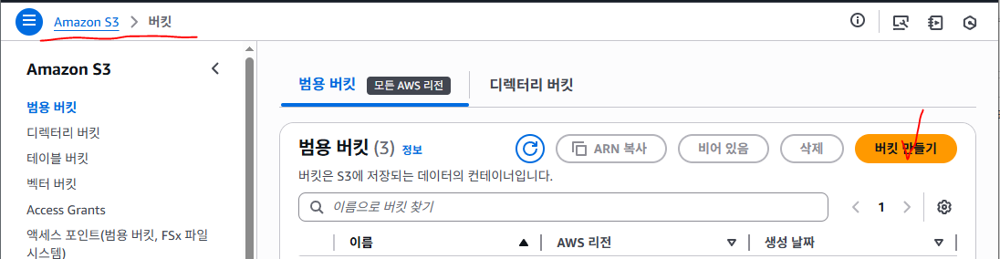
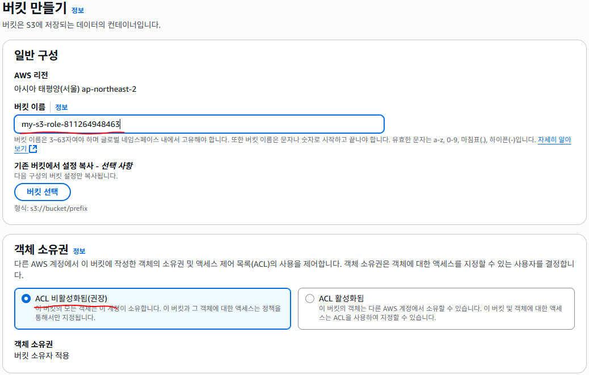
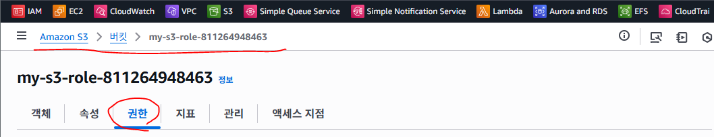
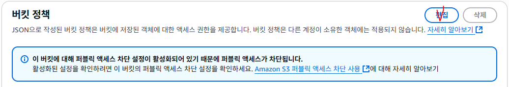
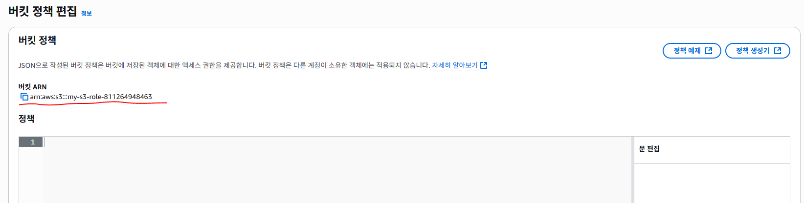
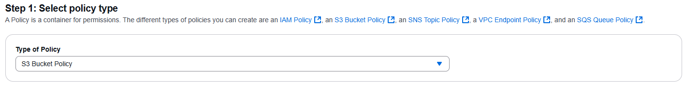
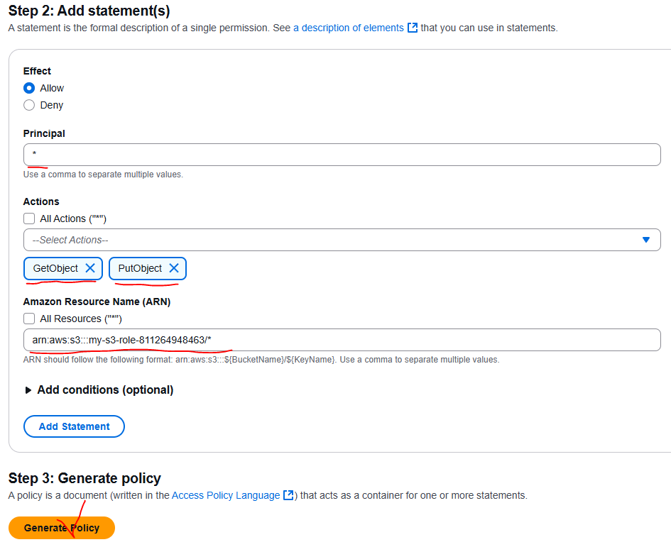
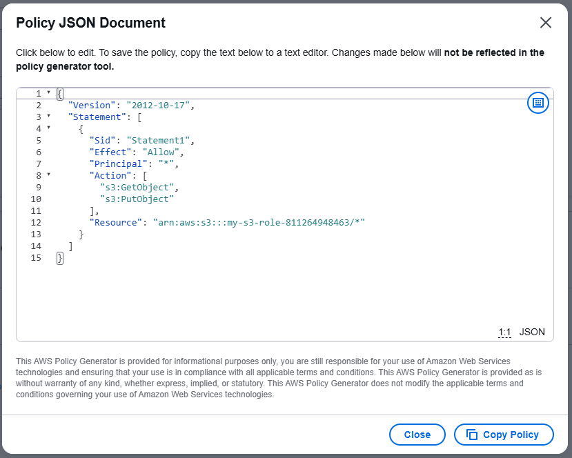

# S3 정책 만들기 - 강의 노트

AWS 강의 노트(HWP) 원본을 이미지와 설정 코드, 주석까지 그대로 옮긴 문서다. 정리본은 이론·가이드 문서를 함께 본다.

## S3 버킷 정책 만들기



- 버킷 이름: my-s3-role-123456789012
- 객체 소유권: ACL 비활성화됨(권장)




- Amazon S3  -->  버킷  -->  my-s3-role-123456789012  -->  권한 탭 이동



- 버킷 정책 편집



- 정책 부분에 json 형식으로 정책을 만들수도 있고 정책 생성기를 사용해서 만들 수 도 있다.

## 정책 생성기 Principal 입력 방법

- 의미 : 전 세계 모든 사용자에게 허용
- Principal : *

- 의미 : 특정 계정(계정 ID: 12자리 숫자)만 버킷을 사용하도록 제한
(해당 AWS 계정(123456789012)에 속한 모든 사용자(User)와 역할(Role)을 포함)
- Principal : arn:aws:iam::123456789012:root

- 의미 : 해당 AWS 계정(123456789012)에 존재하는 IAM 사용자(User) 중 이름이 admin인 사용자
- Principal : arn:aws:iam::123456789012:user/admin

- 의미 : arn:aws:iam::123456789012:role/RoleName
- Principal : arn:aws:iam::123456789012:role/RoleName

## Get 계열 (조회/읽기)

- 리소스를 읽거나 정보를 가져오는 권한
s3:GetObject: 객체 다운로드
s3:GetObjectAcl : 객체의 ACL 확인
s3:GetObjectTagging : 객체 태그 조회
s3:GetObjectVersion : 버전 관리된 객체의 특정 버전 조회
s3:GetBucketAcl : 버킷 ACL 조회
s3:GetBucketPolicy : 버킷 정책 조회
s3:GetBucketLocation : 버킷의 리전 정보 확인

```
s3:GetLifecycleConfiguration : 수명주기(Lifecycle) 규칙 조회
s3:GetEncryptionConfiguration: 암호화 설정 조회
```

## Put 계열 (생성/수정)

- 리소스를 새로 만들거나 업데이트하는 권한
s3:PutObject : 객체 업로드
s3:PutObjectAcl : 객체 ACL 설정
s3:PutObjectTagging : 객체 태그 추가/수정
s3:PutBucketAcl : 버킷 ACL 설정
s3:PutBucketPolicy : 버킷 정책 생성/수정

```
s3:PutLifecycleConfiguration : 수명주기(Lifecycle) 규칙 생성/수정
s3:PutReplicationConfiguration: 복제 규칙 생성/수정
s3:PutEncryptionConfiguration: 암호화 설정 변경
```

## Delete 계열 (삭제)

- 리소스를 제거하는 권한
s3:DeleteObject : 객체 삭제
s3:DeleteObjectTagging : 객체 태그 삭제
s3:DeleteObjectVersion : 특정 버전 객체 삭제
s3:DeleteBucket : 버킷 삭제
s3:DeleteBucketPolicy : 버킷 정책 삭제
s3:DeleteLifecycleConfiguration : 수명주기 규칙 삭제
s3:DeleteReplicationConfiguration: 복제 규칙 삭제

## List 계열 (목록 보기)

- 여러 개 리소스를 한꺼번에 나열하는 권한
s3:ListBucket : 버킷 안 객체 목록 조회
s3:ListAllMyBuckets : 계정 내 모든 버킷 목록 조회
s3:ListBucketVersions : 버전 관리된 객체 목록 조회
s3:ListBucketMultipartUploads: 멀티파트 업로드 중인 객체 목록 조회

## Create 계열 (생성)

새로운 리소스를 만드는 권한
s3:CreateBucket : 버킷 생성
s3:CreateAccessPoint: S3 Access Point 생성
s3:CreateJob : S3 Batch Operations 작업 생성

#Update 계열 (갱신/변경)

- 이미 있는 설정을 바꾸는 권한 (Put과 비슷하지만 설정 변경에 집중)
s3:UpdateJobPriority: Batch Operation 작업 우선순위 수정
s3:UpdateJobStatus: Batch Operation 작업 상태 수정
s3:UpdateAccessPoint: Access Point 속성 변경
s3:UpdateStorageLensConfiguration : Storage Lens 설정 변경

```
Amazon Resource Name (ARN)
```



```
arn:aws:s3:::my-s3-role-123456789012/*  : 버킷 안의 모든 객체(Object)
arn:aws:s3:::my-s3-role-123456789012/upload/*  : 버킷 안에서 Key가 upload/ 로 시작하는 모든 객체 (key=폴더)
```

- Type of Policy: S3 Bucket Policy (S3 버킷 정책)



- Effect: Allow
- Principal: *
- Actions: GetObject, PutObject
- Amazon Resource Name (ARN): arn:aws:s3:::my-s3-role-123456789012/*
- Add Statement (목록에 추가해야만 적책이 만들어진다.)





## JSON 형식

```json
{
  "Version": "2012-10-17",
  "Statement": [
    {
      "Sid": "AllowEveryone", // 정책 ID
      "Effect": "Allow",         // 허용
      "Principal": "*",        // 전 세계 모든 사용자 (익명 포함)
      "Action": "s3:*",     // S3의 모든 작업
      "Resource": "arn:aws:s3:::example-bucket/*"// 버킷 안의 모든 객체
    }
  ]
}

{
  "Version": "2012-10-17",
  "Statement": [
    {
      "Sid": "AllowSpecificAccount",       // 정책 ID
      "Effect": "Allow",                    // 허용
      "Principal": {
        "AWS": "arn:aws:iam::123456789012:root"// 특정 계정 전체 (root + 모든 IAM User/Role)
      },
      "Action": "s3:*",                       // S3의 모든 작업
      "Resource": "arn:aws:s3:::example-bucket/*"// 버킷 안의 모든 객체
    }
  ]
}

{
  "Version": "2012-10-17",
  "Statement": [
    {
      "Sid": "AllowSpecificUser",  // 정책 ID
      "Effect": "Allow",                  // 허용
      "Principal": {
        "AWS": "arn:aws:iam::123456789012:user/admin"// 해당 계정의 admin 사용자만
      },
      "Action": "s3:*",                            // S3의 모든 작업
      "Resource": "arn:aws:s3:::example-bucket/*"// 버킷 안의 모든 객체
    }
  ]
}

{
  "Version": "2012-10-17",
  "Statement": [
    {
      "Sid": "AllowSpecificRole",    // 정책 ID
      "Effect": "Allow",             // 허용
      "Principal": {
        "AWS": "arn:aws:iam::123456789012:role/RoleName"// 해당 계정의 특정 RoleName 역할만
      },
      "Action": "s3:*",                             // S3의 모든 작업
      "Resource": "arn:aws:s3:::example-bucket/*"     // 버킷 안의 모든 객체
    }
  ]
}
```
