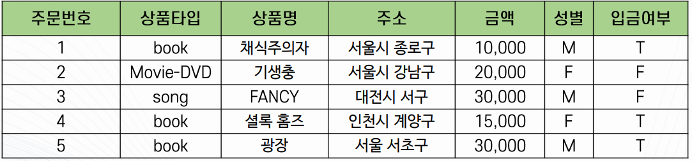
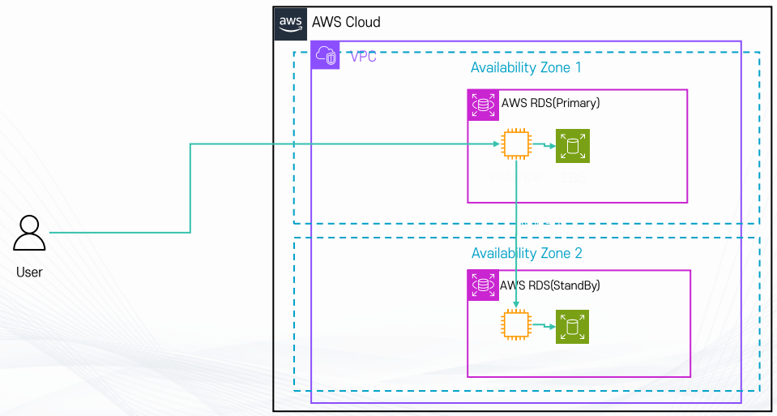
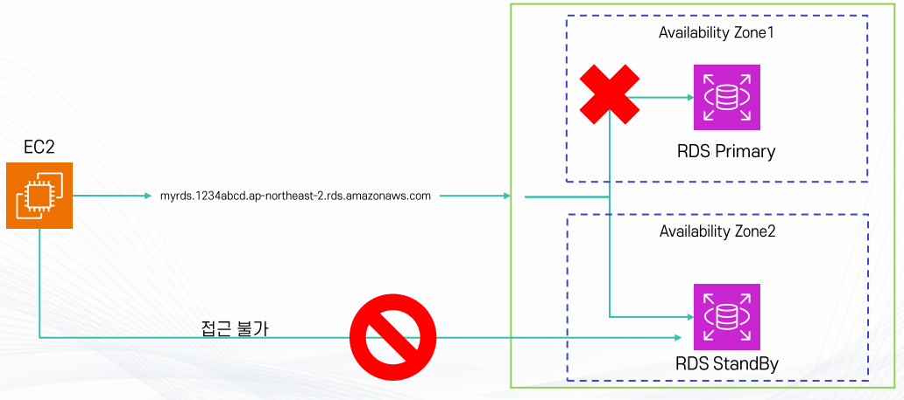
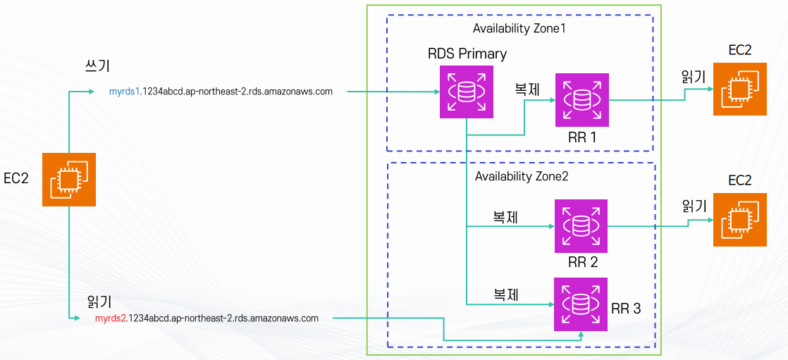
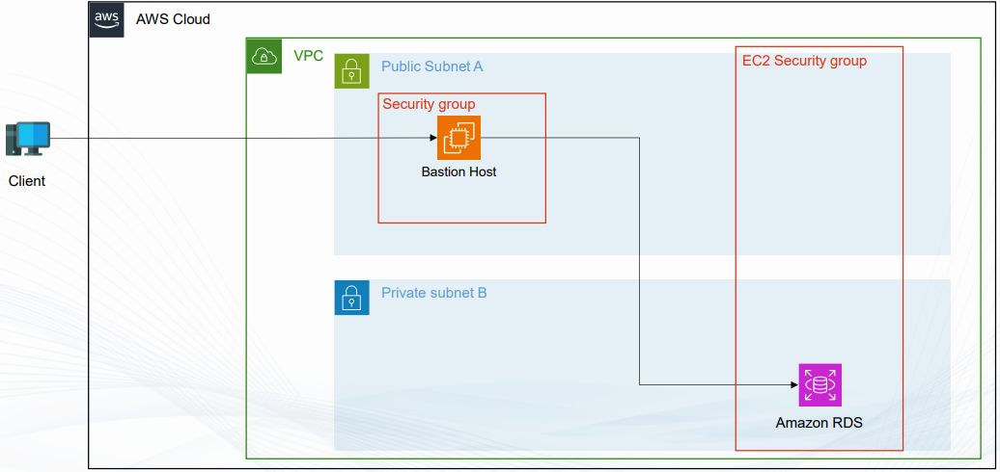
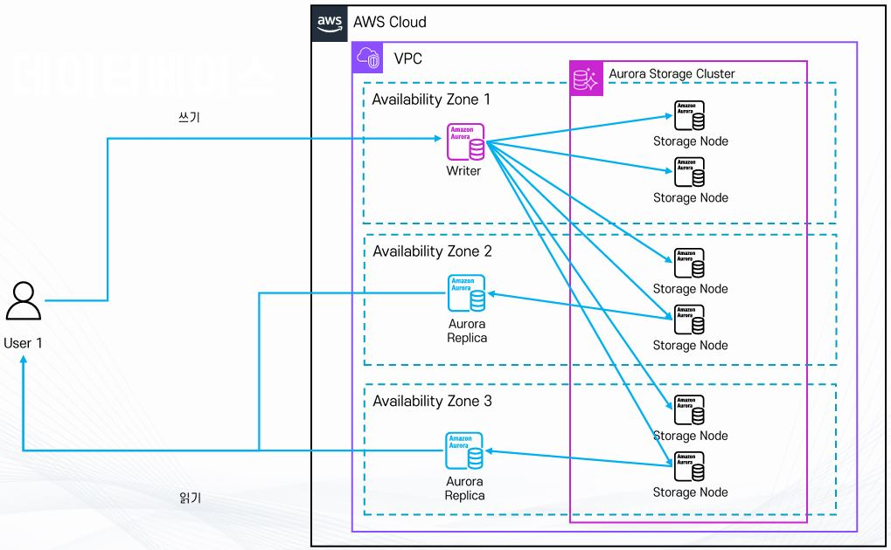
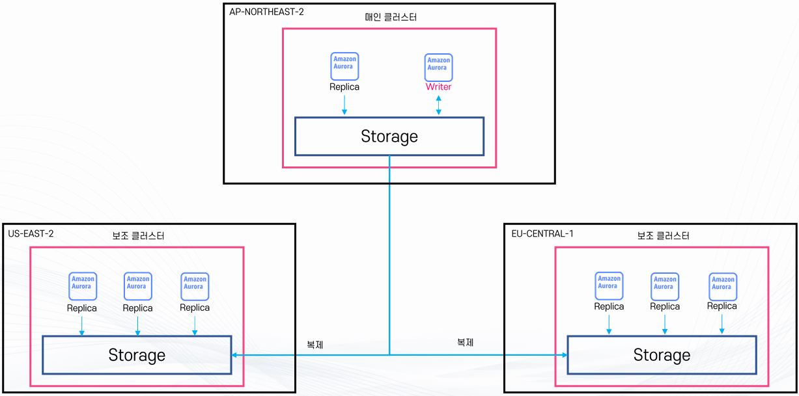
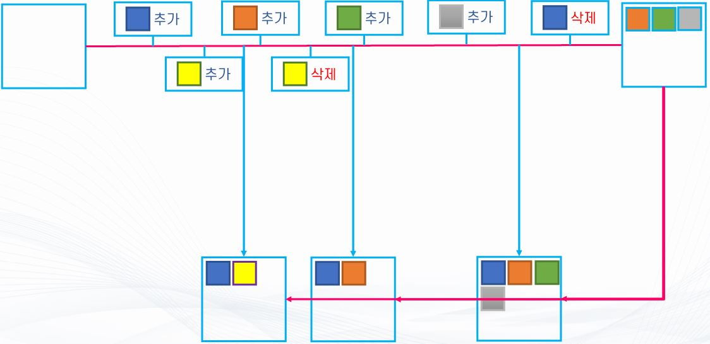

# AWS RDS - 강의 노트

AWS 강의 노트(HWP) 원본을 이미지와 설정 코드, 주석까지 그대로 옮긴 문서다. 정리본은 이론·가이드 문서를 함께 본다.

## RDB (Relational DataBase)

- 데이터 간의 관계에 집중하는 데이터베이스
- 사전에 정의된 구조(스키마)에 따라 데이터를 저장
- 엑셀처럼 행(Row)과 열(Column) 형태로 구성된 테이블 단위로 데이터 관리

## 특징

- 스키마 기반 저장
  - 미리 데이터의 형식(숫자, 문자, 날짜 등)을 정의
  - 정의된 형식에 맞는 데이터만 입력 가능

- 테이블 간 관계 정의
  - 여러 테이블을 연결(Join)해서 데이터 활용 가능
  - 예: 회원 테이블 + 주문 테이블 어떤 회원이 어떤 상품을 샀는지 확인

- 고유한 키(Primary Key)로 데이터 식별
  - 각 행을 구분하는 고유값 필요 (예: 주민번호, 회원 ID)

- 트랜잭션 지원 (ACID 특성)
  - 원자성(Atomicity): 작업은 전부 성공하거나 전부 실패
  - 일관성(Consistency): 정의된 규칙을 항상 지킴
  - 격리성(Isolation): 여러 사용자가 동시에 접근해도 충돌 없음
  - 지속성(Durability): 한번 저장된 데이터는 시스템 장애에도 보존

## 장점

- 데이터 구조가 명확하고, 규칙에 맞게 관리 (데이터 신뢰성 높음)
- SQL이라는 표준 언어로 데이터 검색, 추가, 수정, 삭제 가능
- 안정적이고 중요한 데이터 처리에 적합

## 단점

- 유연성이 떨어짐 : 새로운 데이터 형식을 추가하려면 스키마 수정 필요
- 대규모 데이터(빅데이터) 처리에는 속도가 느릴 수 있음

## 사용 사례

  - 은행, 쇼핑몰, 병원 같은 업무 시스템
  - 온라인 게임 (회원 정보, 아이템, 결제 내역 관리)
  - 일반적인 기업용 애플리케이션

- 대표적인 관계형 DBMS
  - Oracle (대규모 기업용)
  - MySQL (오픈소스, 웹 서비스에 많이 사용)
  - PostgreSQL (강력한 기능, 오픈소스)
  - MS SQL Server (마이크로소프트 환경에 최적화)
  - Amazon RDS (AWS에서 관리형으로 제공하는 RDB 서비스, MySQL과 PostgreSQL와 연동된다.)
  - Oracle , MS SQL Server는 RDS 사용료에 추가로 라이센스 비용이 더해서 과금된다.



- 테이블 구조
  - 관계형 데이터베이스에서는 데이터를 테이블(Table) 형태로 저장한다.
  - 행(Row): 하나의 데이터 단위 (예: 주문 1건)
  - 열(Column): 데이터 속성 (예: 주문번호, 상품명, 금액 등)

- 데이터 타입
  - 주문번호: 숫자(Number)
  - 상품타입: 문자열(String)
  - 상품명: 문자열(String)
  - 주소: 문자열(String)
  - 금액: 숫자(Number)
  - 성별: 한 글자(String)
  - 입금여부: 논리(Boolean)

- 특징
  - 같은 열(Column)에는 반드시 같은 타입의 데이터가 들어감
  - 예: 금액 열에는 숫자만, 상품명 열에는 문자만 저장
  - 행(Row)은 각각 하나의 완전한 데이터 단위
  - 예: 주문 1건에 대한 모든 정보가 한 행에 들어 있음
  - 여러 행이 모여 하나의 테이블을 구성
  - 예: 주문 테이블 = 주문번호, 상품, 금액 등 모든 데이터의 집합

## AWS RDS (Relational Database Service)

- RDS는 AWS에서 제공하는 관리형 관계형 데이터베이스 서비스
- 사용자는 직접 서버를 설치하거나 운영하지 않고도, 클라우드에서 손쉽게 DB를 생성, 설정, 운영, 확장할 수 있음
- MySQL, PostgreSQL, MariaDB, Oracle, SQL Server, Amazon Aurora 등 다양한 DB 엔진 지원

## RDS의 장점

- 운영 자동화
  - 하드웨어 프로비저닝, OS 패치, DB 설치, 보안 패치, 백업 등 반복적 관리 작업을 AWS가 자동 처리
  - 관리자는 애플리케이션 개발에 집중 가능

- 비용 효율성
  - 사용한 만큼 지불 (Pay-as-you-go)
  - 운영 및 관리 인력 비용 절감

- 확장성
  - 필요 시 인스턴스 크기 변경, 스토리지 용량 확장 가능
  - 읽기 전용 복제본(Read Replica)으로 읽기 성능 향상

- 고가용성 및 안정성
  - Multi-AZ 배포 시 장애 발생해도 자동 장애조치 (Failover)
  - 자동 백업 및 스냅샷 제공 --> 시점 복구(Point-in-Time Restore) 가능

- 보안
  - 데이터 암호화 지원 (KMS)
  - TLS 통신으로 데이터 전송 암호화
  - IAM과 통합하여 접근 제어

- 특징
  - 관계형 데이터베이스(Relational Database) 기반 --> SQL 사용 가능
  - NoSQL(DynamoDB, DocumentDB, ElastiCache 등)과 대비됨
  - 가상 머신 위에서 동작
*직접 시스템에 로그인 불가 --> OS 관리, 패치 등은 AWS 담당
  - Serverless 아님
*단, Amazon Aurora는 Aurora Serverless라는 별도의 서버리스 DB 제공
*암호화 및 자동 백업 기능 기본 제공

- 사용 사례
  - 기업용 ERP, CRM 시스템
  - 온라인 쇼핑몰, 금융 서비스
  - 온라인 게임(회원 정보, 결제 내역 관리)
  - 데이터 분석 및 BI 도구와 연계

## RDS와 EC2

- Amazon RDS는 내부적으로 EC2 인스턴스 위에서 동작한다.
즉, 우리가 직접 EC2에 DB를 설치하지 않아도, AWS가 대신 EC2 + DB 환경을 관리해주는 형태

- 동작 환경
  - VPC(가상 네트워크) 안에서 실행됨
*기본적으로 Public IP가 없으면 외부 접근 불가
*Public IP를 부여하거나, DNS를 통해 인터넷에서 접근 가능
  - 접근을 위해서는 반드시 서브넷과 보안 그룹 설정 필요

- EC2 타입과 스토리지
  - RDS도 결국 EC2 인스턴스 위에서 돌아가기 때문에 EC2 인스턴스 타입 지정 필요
*예: db.t3.micro, db.m5.large 등
  - 스토리지는 EBS(Elastic Block Store)를 사용
*EBS 종류(범용 SSD, 프로비저닝 IOPS SSD 등)와 용량 선택 가능

- 운영 관련
  - 중지 가능 (단, 중지 후 7일 이내에 다시 시작해야 함 (7일이 지나면 자동으로 다시 시작된다.))

- 백업 기능 제공
  - 자동 백업 및 스냅샷 생성 가능 --> 데이터 복구 용이

- 비용 최적화
  - 온디맨드(On-Demand) : 사용한 만큼 지불
  - 리저브드 인스턴스(Reserved Instance) 활용 가능
  - 일정 기간(1년, 3년 등)을 약정하면 최대 70% 할인



## RDS의 고가용성 아키텍처 (Primary & Standby 구조)

- Primary DB (주 DB)
  - 사용자가 직접 접속하는 메인 데이터베이스
  - 모든 읽기/쓰기 요청을 처리
  - 우리가 흔히 "RDS 인스턴스"라고 부르는 것이 바로 이 Primary DB

- Standby DB (대기 DB)
  - 별도의 가용영역(Availability Zone, AZ)에 위치
  - 평상시에는 사용자 요청을 처리하지 않음
  - Primary DB에서 발생하는 데이터 변경 사항을 실시간으로 동기화

- 장애 발생 시 동작
  - Primary DB에 장애가 생기면 AWS가 자동으로 Standby DB를 승격(Promotion)
  - 사용자는 동일한 DB 접속 주소(엔드포인트)로 접속하기 때문에 별도 조치 필요 없다.
  - 이 과정을 자동 Failover라고 한다.

- 읽기 전용 구성 (옵션)
  - Standby DB는 기본적으로 대기용이지만, 읽기 전용(Read Replica) DB로 만들어 부하 분산에 활용할 수도 있다.

## RDS의 인증방법

- 전통적인 유저/패스워드 방식
  - 가장 기본적인 인증 방식
  - 데이터베이스에 접속할 때 사용자 이름(ID)과 비밀번호를 입력
  - AWS Secrets Manager와 연동 가능
*Secrets Manager는 DB 비밀번호를 안전하게 저장하고 관리
*비밀번호를 자동으로 주기적으로 변경(로테이션)하여 보안 강화

- IAM DB 인증
  - AWS IAM(Identity and Access Management)을 이용한 인증 방식
  - 데이터베이스에 접속할 때 비밀번호 대신 IAM 사용자 자격증명이나 IAM 역할(Role) 사용
  - 장점: 비밀번호 관리 필요 없음, 중앙에서 접근 권한 제어 가능
  - 예: 특정 사용자에게 RDS에 접근할 권한을 IAM 정책으로 부여

## RDS Multi AZ (다중 가용 영역 배포)



- RDS 데이터베이스를 두 개 이상의 가용 영역(AZ, Availability Zone) 에 걸쳐 배포
- 하나는 주 데이터베이스(Primary), 다른 하나는 대기 데이터베이스(Standby)
- 두 DB는 자동으로 동기화(Sync) 되어 같은 데이터를 유지

- 동작 방식
  - 평상시: 모든 읽기 , 쓰기 작업은 Primary DB에서 처리
  - 장애 발생 시: Primary DB에 문제가 생기면 Standby DB가 자동으로 승격(Promotion)
  - DNS 주소가 자동으로 Standby DB로 연결된다. (사용자는 별도의 설정 없이 DB를 계속 사용 가능)

- 특징
  - Standby DB는 직접 접근 불가 (읽기/쓰기 불가능)
  - 따라서 성능 향상(Read Replica처럼 읽기 분산 목적)이 아니라, 안정성과 가용성 보장이 목적

- 장점
  - 장애 발생 시 서비스 중단 최소화 (자동 장애 조치, Failover)
  - 데이터 손실 위험 줄어듦 (실시간 동기화)
  - 기업용 서비스에서 안정성을 확보하는 핵심 기능

## 읽기 전용 복제본 (Read Replica)



- RDS에서 원본 데이터베이스(Primary)의 읽기 전용 복제본(Read Replica) 을 생성
- 복제는 비동기(Async) 방식 --> 원본 DB와 복제본 간에 약간의 지연(Lag)이 있을 수 있음

- 동작 방식
  - 쓰기(Write) 작업은 반드시 원본 DB에서 처리
  - 읽기(Read) 작업은 복제본에서 처리 가능 --> 여러 복제본을 두면 읽기 요청을 분산 처리하여 성능 향상

- 특징
  - 안정성보다는 성능(읽기 처리량 향상, 워크로드 분산) 목적
  - 원본 DB에 장애가 나면, 복제본을 직접 승격(Promotion)시켜 원본으로 사용할 수 있지만,
이 경우 DNS 주소 변경을 수동으로 해줘야 함

- 장점
  - 읽기 요청이 많은 애플리케이션(예: 뉴스 사이트, 전자상거래 사이트 상품 조회 등)에 유리
  - 데이터베이스 부하를 분산하여 응답 속도 개선
  - 여러 지역(Region)에 복제본을 두면 전 세계 사용자에게 빠른 응답 제공

## Amazon RDS의 인증과 접속

## Amazon RDS 접속

- RDS 생성 시 IP 종류
  - Private IP (기본 할당)
*VPC 내부 리소스가 RDS에 접속하기 위해 사용
*RDS가 위치한 서브넷에 따라 IP Range(범위)가 결정됨
  - Public IP (옵션)
*퍼블릭 접근 허용을 선택했을 경우 할당
*단, RDS가 Private 서브넷에 있으면 Public IP는 할당되지 않음

- RDS의 IP는 고정되지 않는다.
  - 인스턴스 중지 후 재시작
  - DB 인스턴스 교체
  - AWS 점검
  - OS 패치
  - DB 엔진 버전 업데이트 등

- 권장 방식
  - IP로 직접 접속하지 말고, DNS(엔드포인트 주소)를 이용해야 함
  - RDS 엔드포인트는 AWS에서 자동으로 연결된 IP를 갱신해주므로 안정적이다.

## Amazon RDS 접속 (Production 환경 기준)

- 일반적인 배치
  - 실제 운영(Production) DB는 프라이빗 서브넷에 두는 경우가 많다.
  - 이유 : 보안적으로 외부에서 바로 접근할 수 없으므로 매우 안전하다.

- 접속 방법
  - Bastion Host 사용
*퍼블릭 서브넷에 Bastion Host(점프 서버)를 두고, 이를 통해 프라이빗 서브넷의 RDS에 접속

  - Instance Connect Endpoint 활용 (무료)
*AWS에서 제공하는 기능으로, 엔드포인트가 있으면 원격 접속 가능
*단, 3389 포트만 활용 가능 --> 즉, RDS도 3389 포트로만 사용해야 함

- VPN / Direct Connect
  - 회사 내부망과 AWS VPC를 연결하여 RDS에 안전하게 접근



## Amazon RDS 인증 방식

- 일반적인 Username/Password 방식
  - RDS에 접속할 때 가장 기본적으로 사용하는 방법
*단순히 사용자 이름과 비밀번호로 접속
*비밀번호는 AWS Secrets Manager에 안전하게 저장하고 관리 가능 --> 비밀번호를 코드에 직접 넣지 않아도 됨

- IAM 인증 방식
  - IAM(Identity and Access Management)을 활용해 임시 토큰(약 15분 유효)을 발급받아 RDS에 접속하는 방법
  - 이 방식은 비밀번호를 저장하지 않아도 되므로 보안성이 높음
  - 토큰을 생성하려면 rds-db:connect 권한이 필요
  - DB 유저 계정에 IAM 인증 허용을 설정해 주어야 함

- IAM 조건부 인증 활용
  - IAM 정책에 조건을 걸어 세밀한 접근 제어 가능
  - 예시:
*"인턴은 type:devonly 태그가 붙은 RDS 인스턴스에 회사 아이피로 1월 1일부터 1월 16일까지
오전 8시~오후 6시에만 접속 가능"
*즉, 시간, 날짜, 위치, 리소스 태그 기반으로 접근을 제한할 수 있음

- 핵심 요약

## 비밀번호 기반: 간단하지만 관리 필요 (Secrets Manager 활용 권장)

## IAM 인증 기반: 비밀번호 없이 토큰으로 접속 (더 안전)

## 조건부 접근: 시간, 날짜, 위치, 리소스 태그 등 다양한 조건을 걸어 보안 강화

## Amazon Aurora

- Amazon Aurora는 AWS가 클라우드 환경에 맞게 직접 설계한 완전 관리형 관계형 데이터베이스 서비스이다.

- MySQL 및 PostgreSQL과 호환되며, 기존 MySQL 또는
PostgreSQL용 애플리케이션과 드라이버를 비교적 적은 변경으로 사용할 수 있다.

- Aurora는 고성능, 고가용성, 자동 확장에 초점을 맞춘 구조를 제공한다.

- DB 인스턴스와 스토리지를 분리하고, 여러 DB 인스턴스가 하나의 분산 스토리지를 공유하는 방식으로 동작한다.

- Aurora는 기존 MySQL 대비 최대 5배, PostgreSQL 대비 최대 3배 수준의 처리량을 제공하도록 설계되었다.

- Aurora는 상용 데이터베이스와 비교하여 낮은 비용으로 높은 성능과 가용성을 제공하는 것을 목표로 한다.

## Aurora의 주요 특징

- Aurora는 다음과 같은 특징을 가진다.

- 스토리지는 데이터 증가에 따라 자동으로 확장된다.
  - 최소 10GiB부터 시작
  - 데이터가 증가하면 자동으로 용량 증가
  - 관리자가 직접 디스크 크기를 늘릴 필요 없음
  - 엔진 버전에 따라 최대 128TiB 또는 256TiB까지 확장 가능

- Reader 인스턴스를 최대 15개까지 구성할 수 있다.
  - 읽기 작업을 여러 Reader에 분산 가능
  - 대규모 조회 트래픽 처리에 유리

- 자동 백업과 Point-in-Time Recovery 기능을 제공한다.

- Writer 장애 발생 시 Reader를 Writer로 승격하여 자동 Failover가 가능하다.

- 여러 AZ에 데이터를 분산 저장하여 높은 내구성과 가용성을 제공한다.

## Aurora 기본 구조

- Aurora는 컴퓨팅 영역과 스토리지 영역을 분리한 구조를 사용한다.

- DB 인스턴스는 다음과 같은 작업을 담당한다.
  - SQL 처리
  - 사용자 연결 관리
  - 메모리 처리
  - 트랜잭션 처리

- 실제 데이터는 Aurora 전용 분산 스토리지인 Cluster Volume에 저장된다.
- 여러 DB 인스턴스가 각각 별도의 데이터 디스크를 사용하는 것이 아니라 하나의 Cluster Volume을 함께 사용한다.
- DB 인스턴스에 장애가 발생해도 실제 데이터는 Cluster Volume에 그대로 유지된다.
- 다른 DB 인스턴스가 Writer 역할을 이어받아 서비스를 복구할 수 있다.

## 분산 스토리지 구조

- Aurora는 데이터를 하나의 위치에만 저장하지 않는다.
- 기본적으로 3개의 가용영역(AZ)에 데이터를 분산하여 저장한다.
- 각 AZ마다 2개의 스토리지 복제본을 유지한다.

- 하나의 데이터는 총 6개의 복제본으로 유지된다.
  - AZ A : 2개
  - AZ B : 2개
  - AZ C : 2개
  - 총 6개
  - 리전에 AZ가 4개 이상 존재한다고 해서 8개 이상의 복제본이 생성되는 것은 아니다.
  - 기본 구조는 3개의 AZ에 2개씩 총 6개의 복제본을 유지하는 방식이다.

- 일부 복제본에 장애가 발생해도 읽기와 쓰기를 계속 수행할 수 있다.
  - 최대 2개의 복제본이 손실되어도 쓰기 가능
  - 최대 3개의 복제본이 손실되어도 읽기 가능



- 손상된 스토리지 복제본은 Aurora가 자동으로 검사하고 복구한다.
- 이 기능을 Self-Healing이라고 한다.

- 이 구조를 통해 일부 서버나 AZ에 장애가 발생해도 데이터 손실 없이 서비스를 유지할 수 있다.
  - 3개 이상을 잃어버리기 전엔 쓰기 능력 유지
  - 4개 이상을 잃어버리기 전에는 읽기 능력 유지
  - 손실된 복제본은 자가 치유 : 지속적으로 손실된 부분을 검사 후 복구

## Self-Healing

- Self-Healing은 손상되거나 누락된 스토리지 복제본을 Aurora가 자동으로 복구하는 기능이다.
- Aurora는 스토리지 상태를 지속적으로 검사한다.
- 손상된 복제본이 발견되면 정상 복제본의 데이터를 이용하여 자동으로 복구한다.
- 관리자가 직접 디스크를 복구하거나 데이터를 다시 복제할 필요가 없다.

- 동작 구조
  - 복제본 장애 발생
  - Aurora가 장애 감지
  - 정상 복제본 확인
  - 손상된 복제본 자동 복구
  - 다시 정상적인 6개 복제본 구조 유지

## Quorum 방식

- Aurora는 데이터를 여러 스토리지 복제본에 분산하여 저장한다.
- 쓰기 작업 시 6개의 복제본이 모두 응답할 때까지 기다리면
하나의 느린 복제본 때문에 전체 처리 속도가 느려질 수 있다.
그래서 Aurora는 일정 개수 이상의 복제본이 성공하면 작업을 완료로 판단하는 Quorum 방식을 사용한다.

- 쓰기 작업
  - 6개의 복제본 중 4개 이상이 성공하면 쓰기 완료로 판단

- 읽기 작업
  - 필요한 수의 정상 복제본을 이용하여 올바른 데이터를 확인하고 읽기 처리

- Quorum은 일부 복제본에 장애가 발생해도 서비스를 계속 수행할 수 있도록 하는 방식이다.

- Self-Healing과 Quorum은 서로 다른 기능이다.
  - Quorum  : 일부 복제본에 장애가 있어도 읽기/쓰기를 계속 수행하기 위한 방식
  - Self-Healing : 손상된 복제본을 자동으로 복구하는 기능

## Aurora Cluster 구조

- Aurora는 단일 DB 서버로 운영되지 않고, Cluster 단위로 운영된다.
- 하나의 Cluster는 여러 DB 인스턴스와 하나의 공용 저장소로 구성된다.
- 모든 인스턴스는 개별 디스크를 사용하지 않고, 하나의 Cluster Volume을 함께 사용한다.

- Cluster 구성 요소
  - 하나의 Aurora Cluster는 다음으로 구성된다.
  - Primary인스턴스:  1대 (Read/Write 모두 가능)
  - Aurora Replica: 인스턴스 최대 15대 (Read만 가능)
  - Aurora 전용 분산 스토리지(Cluster Volume)

- Writer는 INSERT, UPDATE, DELETE와 같은 쓰기 작업을 담당한다.
- Reader는 SELECT 전용으로 조회 작업만 처리한다.
- 이 구조를 통해 읽기 트래픽을 여러 서버로 분산할 수 있다.

- 인스턴스 간 복제
  - Writer에서 발생한 변경 사항은 스토리지를 통해 Reader로 비동기(Async) 방식으로 전달된다.
  - 이 구조로 인해 Writer 장애 발생 시 Reader가 즉시 Writer로 승격될 수 있다.

## 장애 복구(Failover) 구조

- Aurora에서는 Writer 인스턴스에 장애가 발생하면 자동 Failover가 수행된다.
- Writer에 장애가 발생하면 Aurora가 상태를 감지하고 Reader 인스턴스 중 하나를 새로운 Writer로 승격한다.

- 장애 복구 과정
1) Writer 장애 감지
2) 승격 가능한 Reader 선택
3) 선택된 Reader를 새로운 Writer로 승격
4) Cluster Endpoint가 새로운 Writer를 가리키도록 변경
5) 애플리케이션이 새로운 Writer로 다시 연결
6) 서비스 재개

- 이 과정은 관리자가 직접 서버를 교체하지 않아도 자동으로 수행된다.
- Reader가 여러 개 존재하면 Failover Priority를 이용해 Writer로 승격할 우선순위를 설정할 수 있다.
- Reader를 Writer와 다른 AZ에 배치하면 Writer가 위치한 AZ에 장애가 발생해도
다른 AZ의 Reader를 Writer로 승격할 수 있다.

- 애플리케이션에서는 특정 Writer 인스턴스 주소보다 Cluster Endpoint를 사용하는 것이 좋다.
  - Writer가 변경되어도 Endpoint 주소는 그대로 유지
  - Endpoint가 새로운 Writer를 가리키도록 자동 변경

- Reader가 없는 단일인스턴스 구성에서는 승격할 Reader가 없기 때문에 새로운 DB인스턴스를 생성하여 복구해야 한다.
따라서 Reader가 있는 구성보다 복구 시간이 더 길어질 수 있다.

- 장애 전
  - AZ A : Writer
  - AZ B : Reader

- Writer 장애  -->  Reader 승격
  - AZ B : # Writer

## Aurora Global Database

- Aurora Global Database는 여러 리전에 데이터베이스를 복제하여 운영하는 구조이다.
- 하나의 리전을 Primary로 설정하고, 다른 리전에는 Secondary 복제본을 생성한다.

- 사용 목적
1) 첫째, 해외 사용자 응답 속도 개선이다.
  - 사용자와 가까운 리전의 DB를 사용하여 지연 시간을 줄인다.
2) 둘째, 재해 복구이다.
  - 메인 리전 장애 발생 시 보조 리전으로 즉시 전환한다.
3) 셋째, 글로벌 시스템 구축이다.
  - 여러 국가 지사의 데이터를 하나로 관리할 수 있다.

- Aurora Global Database의 안정성은 RPO와 RTO라는 지표로 평가된다.

```
(1) RPO (Recovery Point Objective)
 # RPO는 장애가 났을 때, 최대 몇 분 전 데이터까지 포기할 수 있느냐를 의미한다.
 # 허용 가능한 최대 데이터 손실 시간이다.
 # 예시) RPO 10분 : 최대 10분 전 데이터까지 손실 가능
 # Aurora Global DB는 거의 실시간으로 복제되므로 RPO ≈ 0에 가깝다.

(2) RTO (Recovery Time Objective)
 # RTO는 장애 발생 후, 서비스가 언제 다시 살아나는가를 의미한다.
 # 즉, 복구까지 걸리는 시간이다.
 # 예시) RTO 1시간 : 장애 나면 1시간 동안 서비스 중단
 # Aurora Global DB는 자동 전환 구조이므로 RTO ≈ 1분 이내이다.
```



## 백업 시스템

- Aurora는 자동 백업 기능을 기본 제공한다.
- 데이터는 지속적으로 백업되며, 최대 35일까지 보관된다. (S3에 저장된다.)
- Point-in-Time Recovery 기능을 통해 특정 시점으로 복구할 수 있다.
또한 수동 스냅샷을 통해 장기 백업도 가능하다.

## 데이터베이스 클론(Clone)

- Aurora Clone은 운영 중인 데이터베이스를 그대로 복사하여 새로운 데이터베이스를 빠르게 생성하는 기능이다.
이 기능은 주로 개발, 테스트, 검증 환경을 만들기 위해 사용된다.

- Clone은 운영 DB를 보호하면서 동일한 데이터 환경을 안전하게 복제하는 목적을 가진다.

- 일반 복사 방식과 Clone의 차이

- 일반적인 DB 복사 방식은 전체 데이터를 새로 복사하는 방식이다.
이 경우 생성 시간 오래 걸리고 저장 공간 많이 사용한다.

- 반면 Aurora Clone은 전체 데이터를 복사하지 않고 Copy-on-Write 구조를 사용한다.
  - 처음에는 데이터를 공유하고, 변경이 발생하면 그때 복사하는 구조이다.
  - Clone을 생성하면 기존 DB의 데이터를 새로 복사하지 않고, 공용 스토리지를 함께 사용한다.
  - 공용 스토리지 : A B C D
* 원본 DB, Clone DB 공동 사용
* 이 시점에서는 원본과 Clone의 데이터가 완전히 동일하다.
  - Clone에서 데이터 수정이 발생하면, 해당 부분만 새로 복사하여 Clone 전용 영역으로 분리한다.
  - 예시) users 테이블 수정
* 원본 : A B C D
* Clone : A B' C D
  - B만 Clone 전용 데이터로 분리된다.
  - 나머지는 계속 공유된다.

- Clone의 실제 활용 목적
  - Aurora Clone은 대부분 다음 용도로 사용된다.
  - 개발 테스트 환경
  - 기능 검증 서버
  - 장애 재현 환경

- 일반적으로 실서비스 운영 DB로는 사용하지 않는다.

## Backtrack

- Backtrack은 Aurora MySQL에서 제공하는 기능이다.
- 현재 사용 중인 Aurora DB Cluster를 과거 특정 시점의 상태로 되돌릴 수 있다.
- Point-in-Time Recovery와 달리 새로운 DB Cluster를 생성하여 복원하는 방식이 아니다.
- 현재 Cluster 자체를 과거 시점으로 되돌린다.
- 따라서 일반적인 백업 복원 방식보다 빠르게 이전 상태로 되돌릴 수 있다.
- Backtrack은 Aurora PostgreSQL에서는 사용할 수 없다.

## Backtrack 사용 예

- 관리자가 다음 SQL을 실수로 실행했다고 가정한다.
  - DELETE FROM users;
  - WHERE 조건을 사용하지 않아 모든 사용자 데이터가 삭제되었다.

- Backtrack을 사용하면 실수 발생 직전 시점으로 DB Cluster를 되돌릴 수 있다.
  - 정상 상태 --> 잘못된 DELETE --> 데이터 삭제 --> Backtrack 실행 --> DELETE 이전 시점으로 복구

## Backtrack의 주요 특징

- -빠른 복구
  - 전체 Snapshot을 복원하여 새로운 DB를 만들 필요가 없음
  - 기존 Cluster를 이전 시점으로 되돌림

- 관리자 실수 복구
  - 잘못된 DELETE
  - 잘못된 UPDATE
  - 잘못된 데이터 변경 등에 대응 가능

- 특정 과거 시점으로 이동 가능
  - 원하는 과거 시점을 지정하여 DB 상태를 되돌릴 수 있음

- Backtrack 사용 목적
  - 관리자 실수 대응: 데이터 손실 최소화
  - 장애 대응 시간 단축: 빠른 서비스 복구
  - 운영 안정성 확보: 시스템 신뢰도 향상
  - DB 재구성 방지: 신규 DB 생성 불필요

## Backtrack 동작 구조

- Backtrack은 로그 기반으로 동작한다.

- 데이터 변경 시 다음 정보가 저장된다.
  - Redo Log
  - Undo 정보
  - Flashback Log

- 이 로그를 이용해 과거 상태를 다시 만든다.
따라서 로그 저장을 위한 충분한 디스크 공간이 필수이다.

## Backtrack Window

- Backtrack Window는 현재 시점에서 얼마나 과거까지 Backtrack을 수행할 수 있는지를 나타내는 시간 범위이다.
- 설정된 Backtrack Window 범위 안에서 원하는 과거 시점으로 DB를 되돌릴 수 있다.
- Backtrack Window에는 Target Backtrack Window와 Actual Backtrack Window 개념이 있다.

- Backtrack Window는 두 가지 값으로 관리된다.
  - Target Window (목표값)
  - Actual Window (실제값)

## Target Backtrack Window

- Target Backtrack Window는 관리자가 Backtrack을 통해
어느 정도 과거까지 되돌릴 수 있도록 유지할 것인지 설정하는 목표 시간이다.
- 운영자가 미리 설정하는 기준값이다.
- 예시
  - Target Backtrack Window : 24시간
  - 최근 24시간 범위 내에서 DB를 과거 시점으로 되돌릴 수 있도록 목표 설정

## Actual Backtrack Window

- Actual Backtrack Window는 현재 시점에서 실제로 Backtrack이 가능한 시간 범위를 의미한다.
- 현재 시스템이 보관하고 있는 변경 기록을 기준으로 결정된다.
- Actual Backtrack Window는 데이터 변경량과 시스템 상태 등에 따라 달라질 수 있다.
- 실제 Backtrack을 수행할 때 확인해야 하는 값이다

- 역할
  - 현재 실제로 어느 시점까지 복구 가능한지 확인
  - 장애나 관리자 실수 발생 시 실제 복구 가능 범위 판단

- 특징
  - Aurora가 자동으로 계산
  - 시간에 따라 계속 변경될 수 있음
  - Target Window가 목표값이라면 Actual Window는 실제값

- 예시
  - Target Window : 24시간
  - Actual Window : 20시간
  - 현재 실제로는 약 20시간 전까지 Backtrack 가능

## Actual에 영향을 주는 요소

1) 데이터 변경량
- INSERT, UPDATE, DELETE 처럼 실제 데이터가 바뀌는 작업이 적으면 Backtrack용 변경 기록도 천천히 쌓인다.
- 변경 기록이 천천히 쌓이면 오래된 기록을 더 오래 유지하기 쉬워 Actual Backtrack Window를 길게 유지하는 데 유리
반대로 데이터 변경이 많으면 변경 기록이 빠르게 쌓인다.
변경 기록이 많이 쌓일수록 실제로 되돌아갈 수 있는 시간 범위가 줄어들 수 있다.

2) 트래픽
- 단순히 접속자가 많다고 해서 Actual Window가 줄어드는 것은 아니다.
- 중요한 것은 트래픽 증가로 인해 데이터 변경 작업이 얼마나 많이 발생하느냐이다.
- 조회(SELECT) 위주의 트래픽이라면 Backtrack 기록 증가에 큰 영향을 주지 않을 수 있다.
- 반대로 INSERT, UPDATE, DELETE가 많은 트래픽이면 변경 기록이 빠르게 증가하면
Actual Window에 영향을 줄 수 있다.

2) 트랜잭션
- INSERT, UPDATE, DELETE 같은 변경 트랜잭션이 적으면 생성되는 변경 기록도 적다.
- 변경 트랜잭션이 많으면 Backtrack을 위해 저장해야 하는 변경 기록도 많이 생성된다.
- 따라서 변경 트랜잭션이 많을수록 Actual Backtrack Window가 짧아질 가능성이 커진다.


