# WordPress 서버 클러스터 구성 - 강의 노트

AWS 강의 노트(HWP) 원본을 이미지와 설정 코드, 주석까지 그대로 옮긴 문서다. 정리본은 이론·가이드 문서를 함께 본다.

## WordPress 서버 클러스터 구성

## 3-Tier Architecture (3계층 아키텍처)

- 애플리케이션을 3가지 티어로 나누어 구성하는 방식이다. 이렇게 하면 역할이 명확해지고, 확장/유지보수가 쉬워진다.

- Presentation Tier (프리젠테이션 계층)
  - 사용자가 직접 보는 화면(UI) 부분
  - HTML, CSS, JavaScript 같은 기술로 구성
  - 웹 브라우저에서 동작하며, 사용자의 입력을 받아 Application Tier로 전달

- Application Tier (애플리케이션 계층)
  - 실제 로직(비즈니스 로직)을 처리하는 층
  - 예: 로그인 검증, 주문 처리, 게시글 등록 등
  - PHP, Java, Python 같은 프로그래밍 언어와 서버(EC2 같은 곳)에서 동작

- Data Tier (데이터 계층)
  - 데이터를 저장하고 관리하는 층
  - RDS(MySQL, PostgreSQL 등) 같은 데이터베이스 서비스가 위치
  - Application Tier가 요청한 데이터를 DB에서 읽거나 저장해

- AWS 환경에서의 3-Tier 예시
  - Presentation Tier: ALB(Application Load Balancer)
  - Application Tier: Web EC2 인스턴스
  - Data Tier: Amazon RDS (데이터베이스)

- 즉, ALB는 사용자의 요청을 받아 EC2에 전달하고, EC2는 로직을 처리하면서 RDS에서 데이터를 주고받는 구조
- 정리하면, 3-Tier는 UI(화면), 로직 처리(서버), 데이터(DB)를 분리해놓은 구조이고,
AWS에서는 ALB-EC2-RDS 조합으로 구현하는 경우가 많다.

## 실습

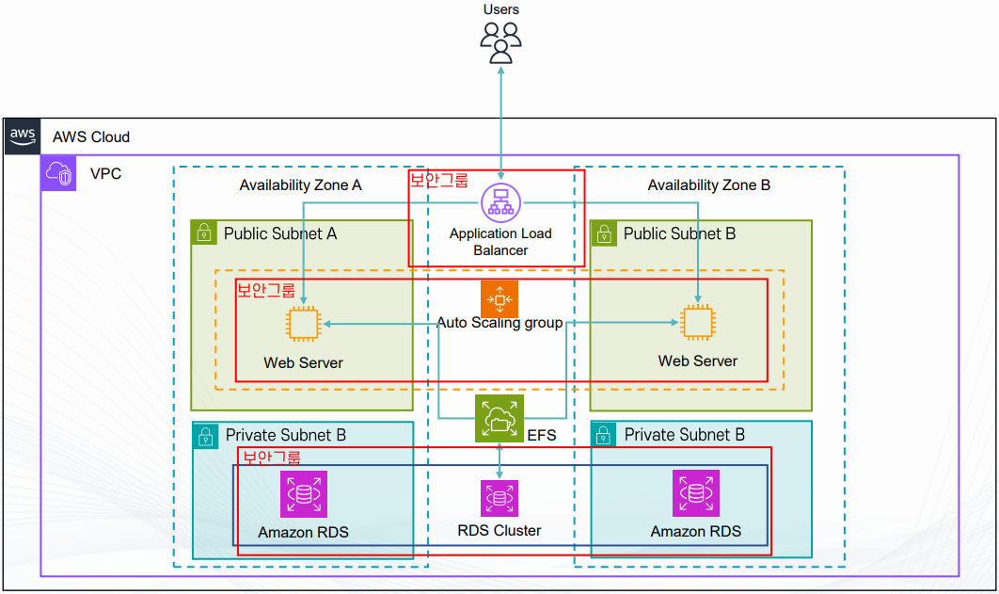

- 3-Tier Application 구조 기반 WordPress 웹 서버 클러스터
  - Presentation Tier: ALB(Application Load Balancer)가 사용자 요청을 받아 분산 처리
  - Application Tier: EC2 인스턴스(웹 서버)가 Auto Scaling Group으로 묶여 트래픽 변화에 따라 자동 증감
  - Data Tier: Amazon RDS 클러스터가 데이터베이스 역할 수행

- 고가용성 확보
  - ALB를 통해 다수의 EC2 인스턴스에 트래픽을 분산
  - Auto Scaling을 통해 부하 시 자동으로 서버를 늘리고, 부하가 줄면 줄임
  - Multi-AZ 배치를 통해 Availability Zone 장애에도 서비스 지속 가능

- EFS(Elastic File System) 공유 스토리지
  - 여러 EC2 인스턴스가 동일한 워드프레스 파일을 접근할 수 있도록 중앙 스토리지 역할
  - 웹 서버 간 데이터 일관성을 유지
  - 워드프레스 업로드 파일(이미지, 플러그인 등)을 EC2 간 공유 가능

## 워드프레스 서버 클러스터 실습 정리

- 구조
  - ALB : 사용자 요청을 받아서 여러 서버로 로드분산
  - EC2: 웹 서버 역할, 워드프레스 실행, Auto Scaling으로 자동 증감
  - RDS: 데이터베이스 저장
  - EFS: 여러 서버가 공유하는 저장소

- 구성 순서
  - VPC 만들기 (Public Subnet, Private Subnet 나누기)
  - RDS 만들고 DB 준비
  - EFS 만들고 소스코드 저장 공간으로 사용
  - EC2에 Apache, PHP 설치 후 워드프레스 설치
  - S3 버킷 생성 후 wp-config 업데이트 및 업로드
  - EC2를 이미지(AMI)로 만들어서 재사용
  - Auto Scaling Group과 ALB 연결해서 트래픽 자동 분산

- 특징
  - 서버가 많아도 EFS 덕분에 똑같은 소스코드를 공유
  - 사용자가 늘어나면 서버가 자동으로 늘어나고 줄어든다.
  - RDS와 다중 AZ 배치로 장애에도 서비스가 계속 유지된다.

- 핵심 포인트

```
3 Tier 구조 : ALB(분산) + EC2(웹 서버) + RDS(DB)
 # EFS 사용 : 모든 웹 서버가 같은 파일 사용
 # Auto Scaling : 자동으로 서버 수 조절
 # 고가용성 : 장애에도 서비스 멈추지 않음
```

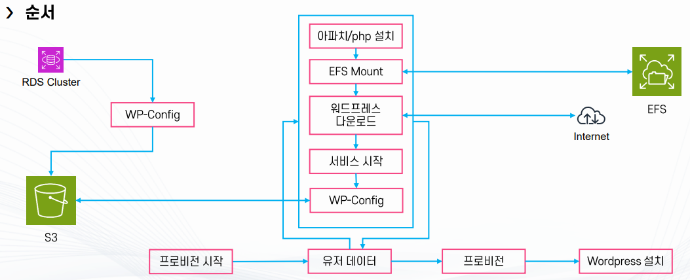

- 워드프레스 클러스터 아키텍처는 ALB를 통해 사용자의 요청을 받아 여러 웹 서버로 분산하고
웹 서버는 AMI 기반으로 만들어진 EC2 인스턴스로 Auto Scaling Group에 의해 자동으로 늘어나거나 줄어든다.
- 웹 서버는 EFS를 마운트해 소스코드와 업로드 데이터를 공유하며 세션 문제를 해결한다.
- 데이터는 RDS 클러스터에 저장되며 wp-config 파일을 통해 DB 접속 정보를 관리한다.
- wp-config 파일은 S3에 저장해두고 EC2가 프로비저닝될 때 불러와 적용한다.
- EC2는 Apache와 PHP 설치 후 워드프레스를 다운로드하고 wp-config 파일을 반영해 서비스가 시작된다.

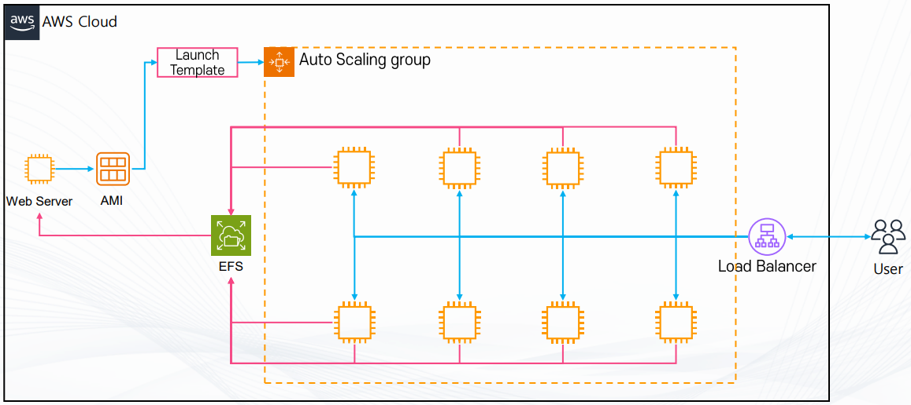

- 초기 설정이 완료된 EC2는 AMI로 저장해 동일한 환경을 쉽게 복제할 수 있으며
Launch Template을 활용해 Auto Scaling Group이 여러 인스턴스를 관리한다.
- 최종적으로 사용자는 ALB를 통해 접속하고 ALB는 헬스 체크를 통해 정상 서버에만 트래픽을 전달해 고
가용성과 확장성을 가진 워드프레스 클러스터 환경이 완성된다.

## 워드프레스(WordPress)

- 우리가 인터넷에서 보는 대부분의 홈페이지는 단순한 파일이 아니다.
특히 블로그, 쇼핑몰, 회사 홈페이지처럼 글이 계속 바뀌고, 회원이 있고,
댓글이 달리는 사이트는 프로그램 형태로 만들어진다.

- WordPress는 이런 사이트를 쉽게 만들 수 있도록 만들어진 대표적인 웹 프로그램

- 원래 이런 사이트를 직접 만들려면 HTML, CSS, JavaScript, PHP, 데이터베이스까지 모두 알아야 한다.
하지만 WordPress를 사용하면 이런 복잡한 기술을 몰라도, 화면에서 버튼을 눌러 글을 쓰고
디자인을 바꾸는 방식으로 사이트를 운영할 수 있다.
그래서 WordPress는 홈페이지 제작 도구이자 콘텐츠 관리 시스템(CMS)이라고 불린다.

```
# wp-config.php
```

- WordPress는 실행될 때마다 데이터베이스에 접속해야 한다.
그런데 프로그램은 DB의 위치와 비밀번호등을 알 수 없다.
그래서 해당 정보를 미리 적어둔 파일이 필요하다.

- 그 파일이 바로 wp-config.php이다.

- wp-config.php는 WordPress에게  데이터베이스에, 이 아이디와 비밀번호로 접속해서 데이터를 가져와라.
로그인은 이런 방식으로 암호화해라,  에러는 화면에 보여줄지 말지 이렇게 처리해라.
즉, WordPress의 기본 동작 방식을 미리 정해두는 설정서 역할을 한다.

- 정리
  - 워드프레스: 웹사이트를 손쉽게 만드는 프로그램
  - wp-config.php: 워드프레스가 데이터베이스와 연결되고 제대로 동작할 수 있게 해주는 설정 파일

## 워드프레스 클러스터 실습

- 네트워크 구성
  - VPC 생성 후 퍼블릭/프라이빗 서브넷을 멀티 AZ로 나눔
  - 퍼블릭 서브넷: ALB와 웹 서버(EC2) 배치
  - 프라이빗 서브넷: RDS와 EFS 배치
  - 보안그룹은 ALB --> EC2 --> RDS/EFS 접근만 허용

- 데이터 계층 준비
  - RDS 클러스터 생성 후 DB 이름·사용자·비밀번호 설정
  - EFS 생성 후 모든 웹 서버가 공유하는 스토리지로 사용

- 설정 파일 관리 (S3)
  - wp-config 파일에 DB 접속 정보, 암호, 사이트 주소 입력
  - wp-config를 S3 버킷에 업로드
  - EC2 프로비저닝 시 S3에서 wp-config를 다운로드해 적용

- EC2 서버 초기 세팅
  - Apache와 PHP 설치 후 워드프레스 다운로드
  - EFS를 마운트해 소스코드와 업로드 파일 공유
  - S3에서 가져온 wp-config를 적용 후 서비스 시작

- AMI 및 확장 구성
  - 세팅이 완료된 EC2를 AMI로 생성
  - Launch Template 작성 후 Auto Scaling Group에 연결
  - ALB를 통해 사용자 요청을 여러 EC2로 분산

- 운영 및 검증
  - 워드프레스 주소를 ALB DNS로 수정
  - Auto Scaling 확장/축소 동작 확인
  - 장애 시 새 EC2가 S3에서 wp-config를 받아 자동으로 서비스 가능 여부 확인
  - 검증 완료 후 RDS/EFS/ALB/EC2 등 리소스 삭제

## IAM 역할 만들기

- S3에서 파일을 가져올수 있게 역할을 생성해야 한다.

- IAM  -->  역할  -->  역할 생성

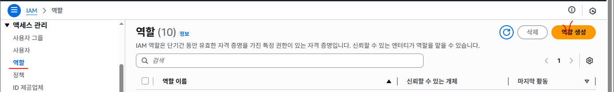

- 신뢰할 수 있는 엔터티 유형: AWS 서비스
- 서비스 또는 사용 사례: EC2

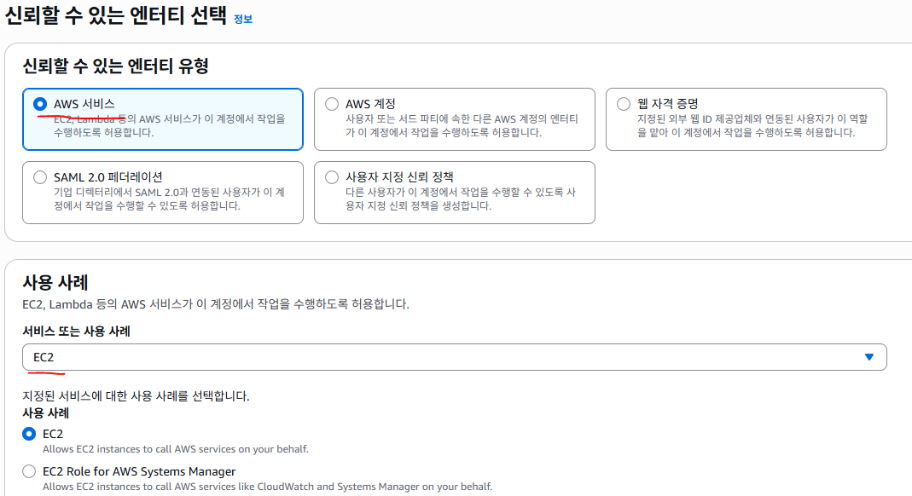


- s3full 검색 후  AmazonS3FullAccess 체크박스 클릭

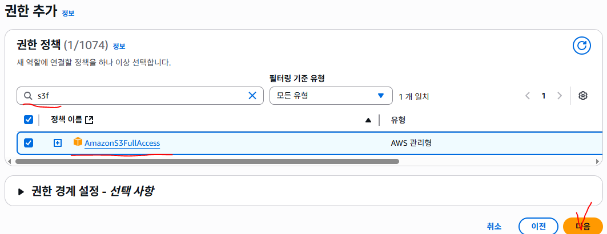

- 역할 이름 : test-3-tier-ec2-role

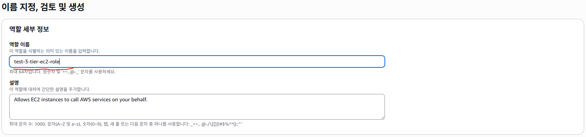


## VPC 생성

- VPC이동  -->  VPC  -->  VPC 생성

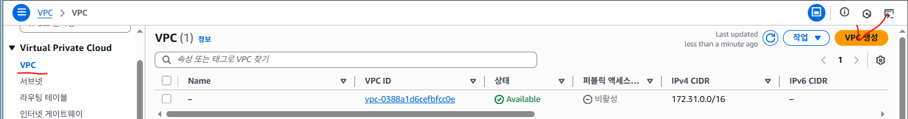

- 가용 영역(AZ) 수: 2
- VPC 설정: VPC 등-프라이빗 서브넷 수: 2
- 이름 태그 자동 생성: test-3-tier-NAT 게이트웨이($): 없음
- IPv4 CIDR 블록: 10.0.0.0/16-VPC 엔드포인트: 없음

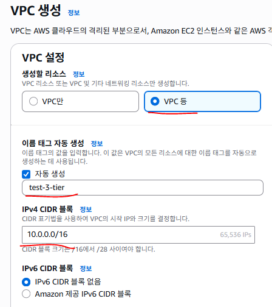

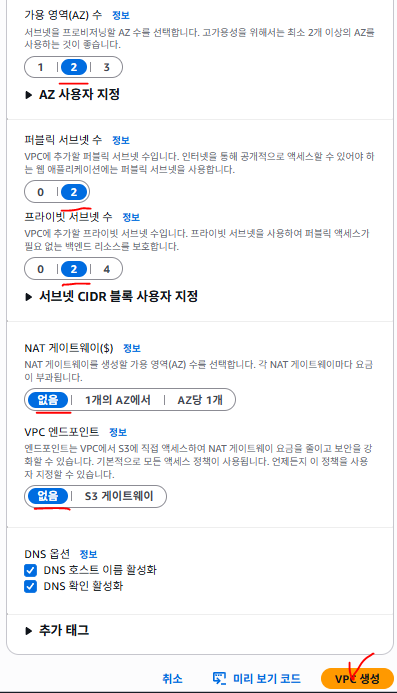


- VPC가 생성된 것을 확인할 수 있다.

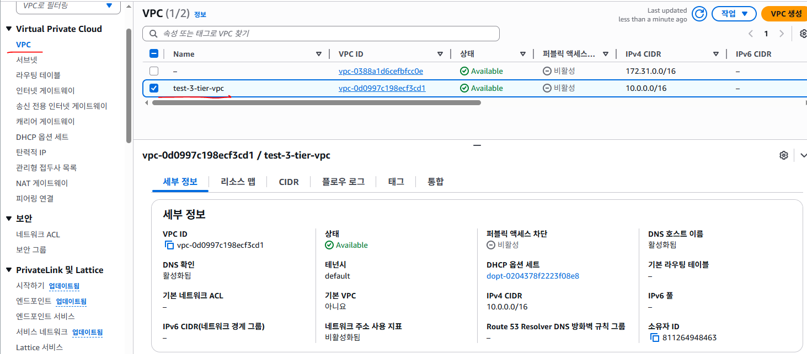

- 서브넷을 확인하게되면 퍼블릭 서브넷 2개, 브라이빗 서브넷이 2개 성성되어 있다. (아래 RDS에서 필요하므로 꼭 확인)
- ap-northeast-2a에 퍼블릭 서브넷 1개, 프라이빗 서브넷 1개가 생성
- ap-northeast-2b에 퍼블릭 서브넷 1개, 프라이빗 서브넷 1개가 생성

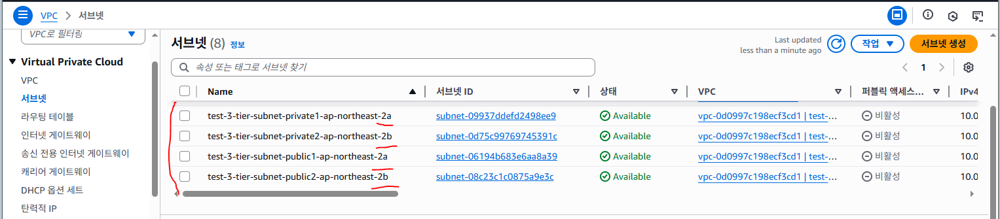

## AWS RDS 서브넷 그룹 생성

- RDS 서브넷 그룹이란
  - RDS가 어디에 만들어질지 범위를 정해주는 모음집
  - 서브넷 여러 개를 묶어놓은 것, 그게 바로 서브넷 그룹

- 왜 필요한가
  - RDS는 보통 프라이빗 서브넷에 만들어야 안전해
  - 멀티 AZ(가용영역) 배치를 위해 최소 2개 이상의 서브넷이 필요해
  - 그래서 RDS는 “이 서브넷 그룹 안에서만 만들어라” 하고 정해줘야 한다.

- RDS  -->  서브넷 그룹  -->  DB 서브넷 그룹 생성

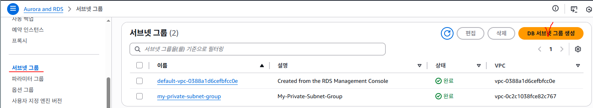

- 이름: test-3-tier-rds-subnet-group
- VPC: 조금전 생성한 VPC 선택 (test-3-tier-vpc (vpc-0d0997c198ecf3cd1))

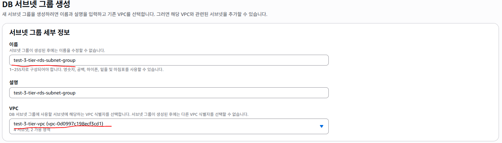

가용 영역: ap-northeast-2a , ap-northeast-2b (위의 VPC에서 2a와 2b 가용영역에 만들어져 있다.)
서브넷 (RDS를 프라이빗 서브넷에 위치시킨다.)
  - test-3-tier-subnet-private1-ap-northeast-2a (프라이빗 서브넷)
  - test-3-tier-subnet-private2-ap-northeast-2b (프라이빗 서브넷)
- RDS는 중요한 데이터(DB)를 저장하는 서비스라서 외부 인터넷과 직접 연결되면 위험하기 때문에
RDS는 프라이빗 서브넷에 두고, 애플리케이션 서버(EC2)나 Bastion Host 같은 안전한 경유지에서만 접근하도록 설계

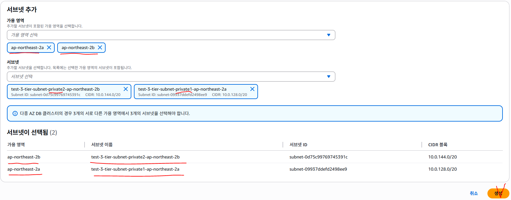

## 데이터베이스 생성

- RDS  -->  데이터베이스  -->  데이터베이스 생성

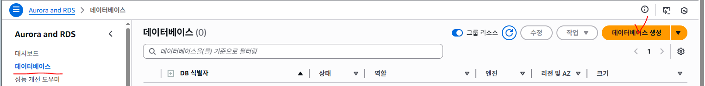

- 데이터베이스 생성 방식 선택: 표준 생성
- 엔진 옵션: MySQL

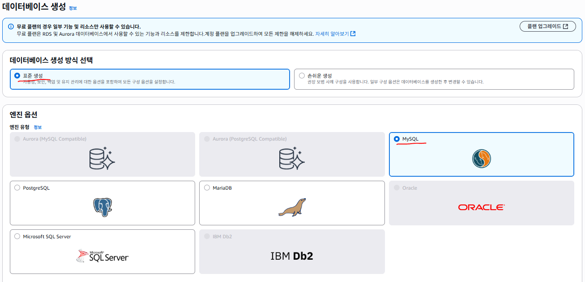

- DB 인스턴스 식별자: my-3tier-mysql-db
- 마스터 사용자 이름: admin
- 자격 증명 관리: 자체 관리
- 마스터 암호: admin1234

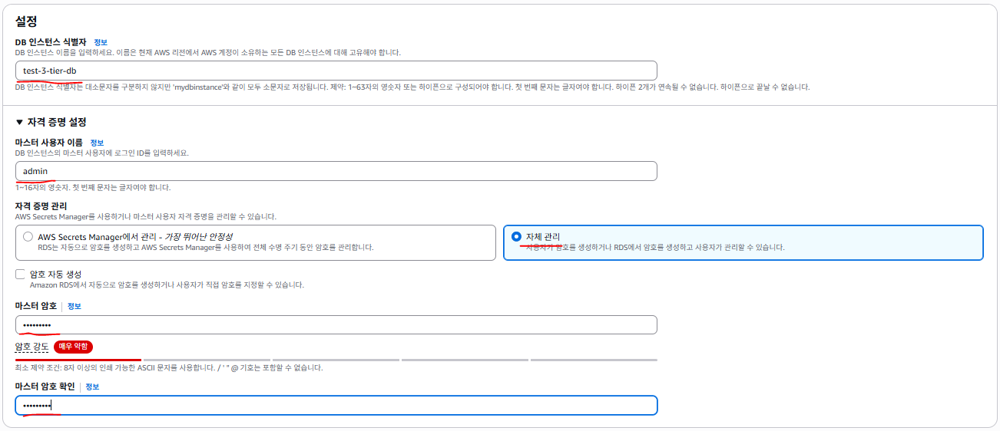

- Virtual Private Cloud(VPC): test-3-tier-vpc (vpc-0d0997c198ecf3cd1)
- DB 서브넷 그룹: test-3-tier-rds-subnet-group
- 퍼블릭 액세스: 아니요
- VPC 보안 그룹(방화벽): 기존 VPC 보안 그룹 (default)

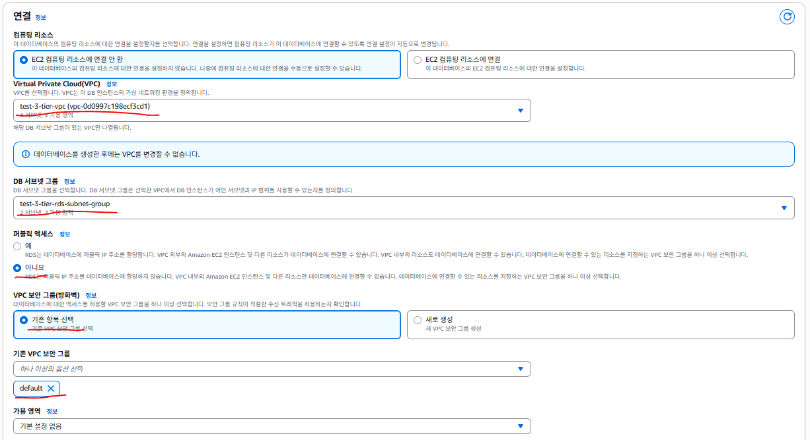

- 가장 아래의 추가구성 펼치기
- 초기 데이터베이스 이름: wordpress

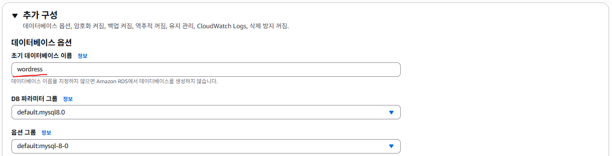


## 보안 그룹 수정

- VPC 클릭 후 새로만든 VPC ID 확인 (test-3-tier-vpc = vpc-0d0997c198ecf3cd1)

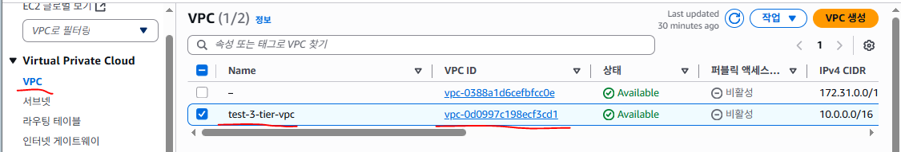

- VPC  -->  보안그룹  -->  vpc-0d0997c198ecf3cd1  선택 -->  인바운드 규칙  -->  인바운드 규칙 편집

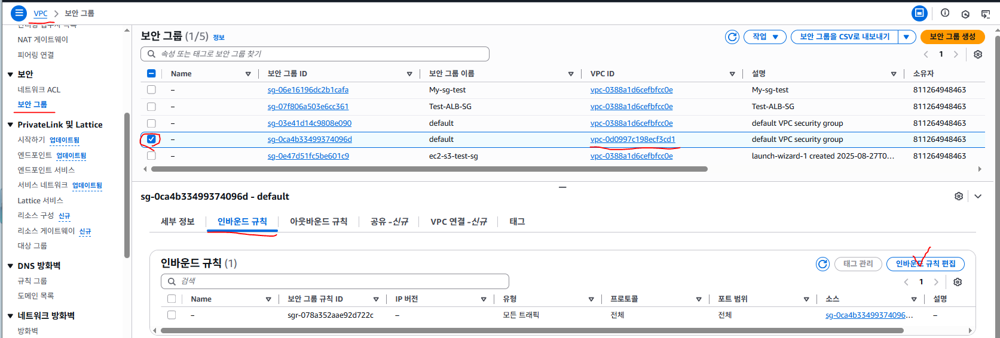

- 유형: 모든 트래픽 , -소스 : 0.0.0.0/0

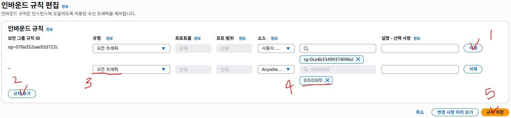

- 보안그룹을 구분하기위해서 Name 설정 (test-3-tier-default-sg)

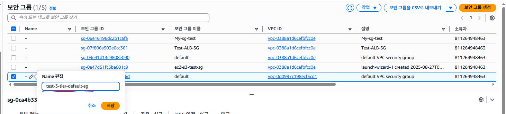

## EFS 생성

## AWS EFS(Elastic File System)

- EFS란 여러 대의 서버(EC2)가 동시에 접근할 수 있는 공유 폴더 같은 서비스
- 네트워크로 연결되는 스토리지라서 서버가 늘어나도 같은 파일을 함께 쓸 수 있다.

- 특징
  - 파일을 저장할수록 용량이 자동으로 커짐 (자동 확장)
  - 미리 디스크 크기를 정해둘 필요 없다.

- 여러 서버에서 동시에 사용
  - 자동 확장EC2 인스턴스 여러 대가 같은 EFS를 마운트하면 같은 파일을 함께 읽고 쓸 수 있다.
  - 자동 확장웹 서버 여러 대가 같은 업로드 파일을 공유할 때 유용

- 고가용성
  - 리전에 있는 여러 가용영역(AZ)에 자동으로 복제된다.
  - 한 곳에 장애가 나도 데이터가 안전하게 유지된다.

- EFS 검색 , 즐겨찾기 , EFS 이동

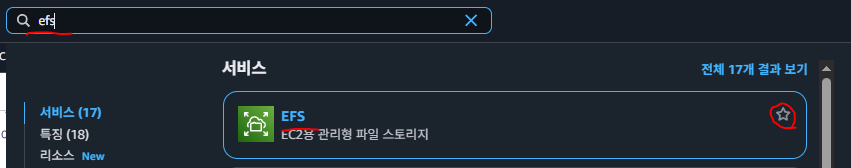

- EFS  -->  파일시스템  -->  파일시스템 생성

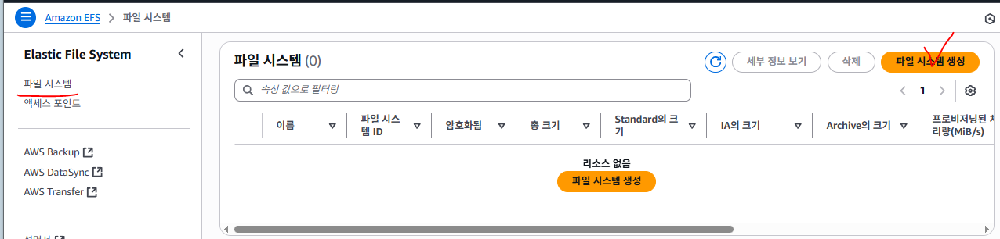

- 이름: my-3tier-efs
- Virtual Private Cloud(VPC): vpc-0d0997c198ecf3cd1 (test-3-tier-vpc)

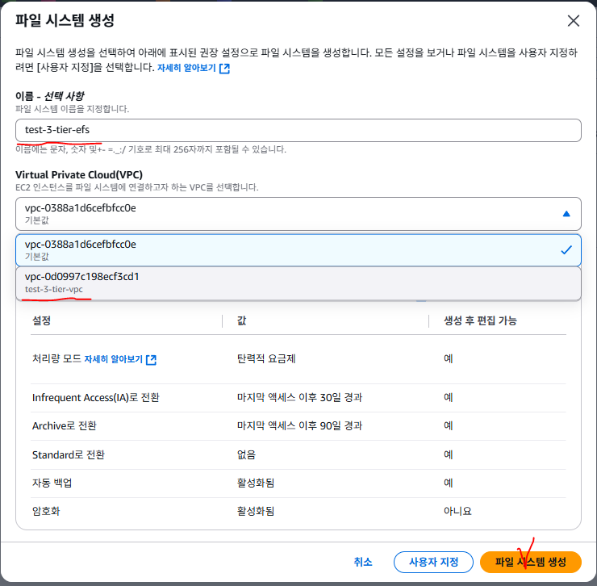

- 파일 시스템이 생성된 것을 확인할 수 있다. (my-3tier-efs 클릭)

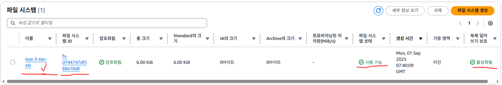

- 네트워크 탭으로 이동하게되면 가용영역과 보안그룹을 확인할 수 있다. (sg-0ca4b33499374096d (default))

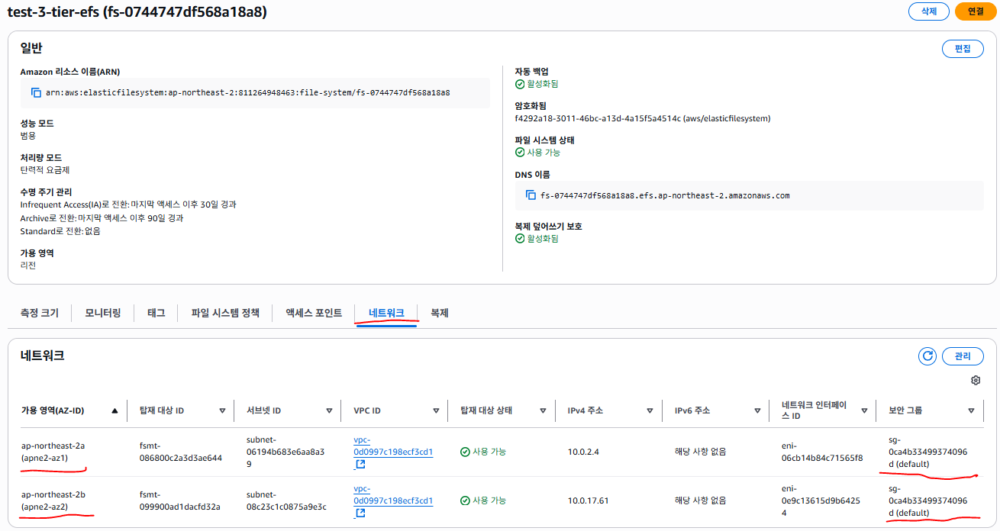

## S3 버킷 생성

- S3  -->  버킷 만들기

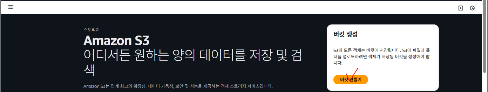

- 버킷이른 : test-3-tier-source-bucket-123456789012

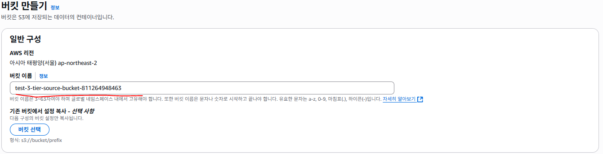


## wp-config 수정

## 워드프레스(WordPress)

- 웹사이트나 블로그를 만들 수 있는 무료 오픈소스 소프트웨어
- 특징
  - 코딩을 몰라도 글쓰기처럼 사이트를 만들 수 있음
  - 수많은 테마(디자인)와 플러그인(기능 확장)을 지원
  - 전 세계 웹사이트의 큰 비율이 워드프레스로 만들어진다.
- 예시
  - 블로그, 쇼핑몰, 회사 홈페이지, 포트폴리오 사이트 등

```
# wp-config.php
```

- 워드프레스가 설치된 서버 안에서 설정 정보를 담고 있는 파일
- 주요 역할
  - 데이터베이스 접속 정보 저장 (DB 이름, 사용자명, 비밀번호, DB 주소 등)
  - 보안 키(암호화용 비밀값) 저장
  - 사이트 동작에 필요한 중요한 환경 설정 포함
- 비유
  - 워드프레스가 집이라면, wp-config.php는 집 열쇠와 주소, 전기·수도 계량기 번호 같은 핵심 정보를 적어둔 문서
- 정리
  - 워드프레스: 웹사이트를 손쉽게 만드는 프로그램
  - wp-config.php: 워드프레스가 데이터베이스와 연결되고 제대로 동작할 수 있게 해주는 설정 파일
- RDS  -->  데이터베이스  -->  my-3tier-mysql-db 클릭  -->  엔드포인트 주소 복사

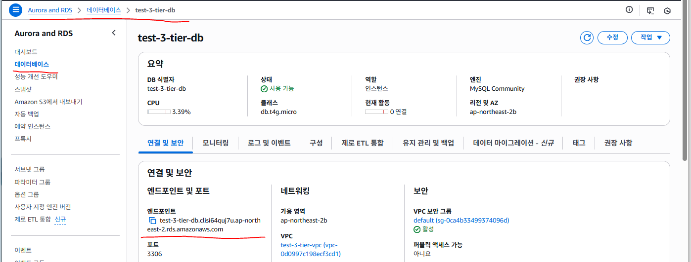

- wp-config.php를 메모장으로 연 후 복사한 RDS 엔드포인트 주소 붙여넣기

~~~~~~~~~~~~~ 중간 생략 ~~~~~~~~~~~~~

```
// 데이터베이스 사용자 비밀번호
define( 'DB_PASSWORD', '<DB_PASSWORD>' );

// 데이터베이스 호스트 (RDS 엔드포인트 주소, 필요시 포트 추가)
define( 'DB_HOST', 'RDS 엔드포인트 주소');

// 데이터베이스 문자셋 (utf8 권장)
define( 'DB_CHARSET', 'utf8' );
~~~~~~~~~~~~~ 중간 생략 ~~~~~~~~~~~~~

# demo_3_tier_userdata.txt 데이터 수정

#!/bin/bash
# Apache 웹 서버 설치
dnf install httpd -y

# PHP 8.2, PHP-MySQL 모듈, MariaDB 클라이언트 설치
dnf install -y php8.2 php8.2-mysqlnd mariadb105 wget

# Apache 웹 서버 재시작
systemctl restart httpd

# Apache를 부팅 시 자동 시작하도록 설정 (수정)
systemctl enable httpd

# /var/www/html 디렉터리 소유자 변경 (ec2-user에게 권한 부여)
chown -R ec2-user:ec2-user /var/www/html

# 워드프레스용 디렉터리 생성
mkdir -p /var/www/html/wordpress

# EFS 마운트 설정 (주소 형식 수정 + 옵션 추가)
echo "{efs_id}.efs.ap-northeast-2.amazonaws.com:/ \
/var/www/html/wordpress nfs4 defaults,_netdev 0 0" >> /etc/fstab

# /etc/fstab 설정 반영해 EFS 마운트
mount -a

# 워드프레스 최신 버전 다운로드
wget https://wordpress.org/latest.tar.gz || exit 1

# 다운로드한 압축 파일 해제
tar -xzf latest.tar.gz

# wordpress 디렉터리를 /var/www/html로 복사 (순서 수정)
cp -r wordpress /var/www/html/

# 워드프레스 디렉터리 소유자 변경 (재귀 옵션 추가)
chown -R ec2-user:ec2-user /var/www/html/wordpress

# 워드프레스 디렉터리 권한 수정 (보안 강화)
chmod -R 755 /var/www/html/wordpress

# S3에서 wp-config.php 파일 가져오기
aws s3 cp \
s3://{S3버킷-ID}/wp-config.php \
/var/www/html/wordpress \
```

- -region ap-northeast-2

- {efs_id} = fs-0744747df568a18a8

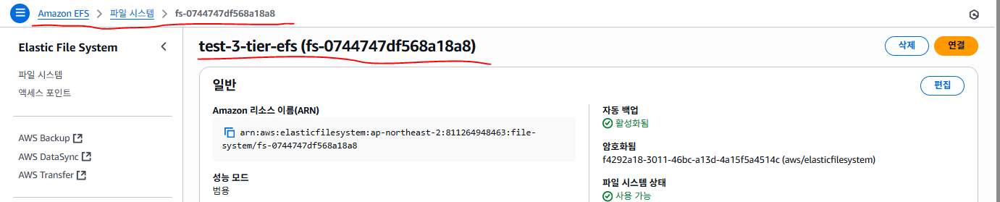

- {S3버킷} = test-3-tier-source-bucket-123456789012

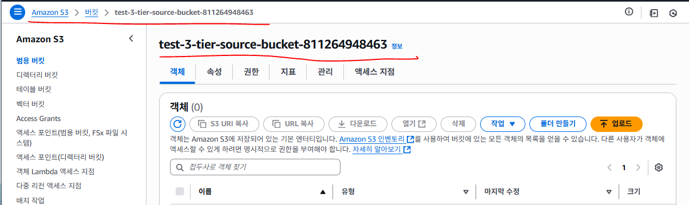

- S3  -->  test-3-tier-source-bucket-123456789012 클릭  -->  wp-config.php 파일 업로드

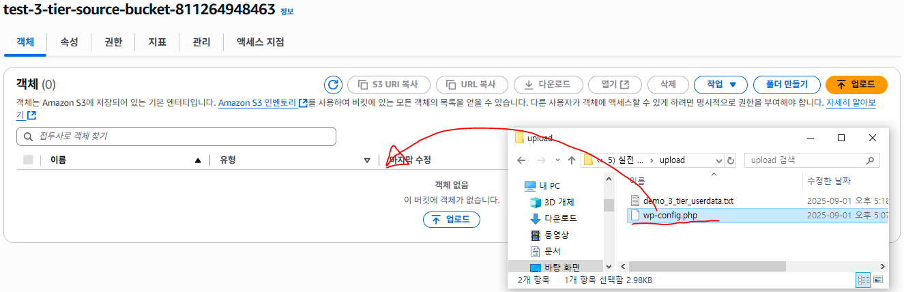

- 인스턴스 시작

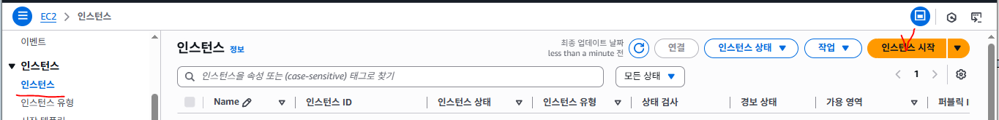

- 이름 : test-3-tier-ec2

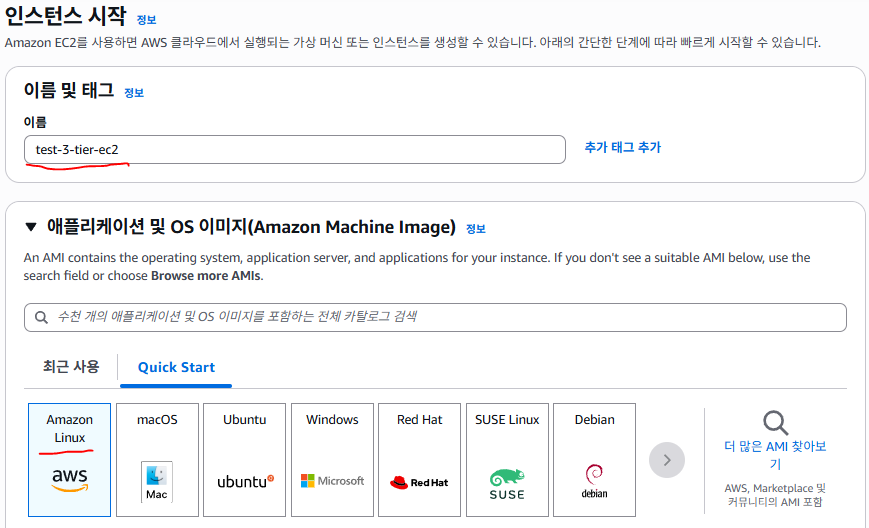

- 키 페어 이름: My-ec2-keypair
- VPC: vpc-0d0997c198ecf3cd1 (test-3-tier-vpc)
- 서브넷: 퍼블릭 서브넷 (test-3-tier-subnet-public1-ap-northeast-2a)
- 퍼블릭 IP 자동 할당: 활성화
- 방화벽(보안 그룹): 기존 보안 그룹 선택 (default)

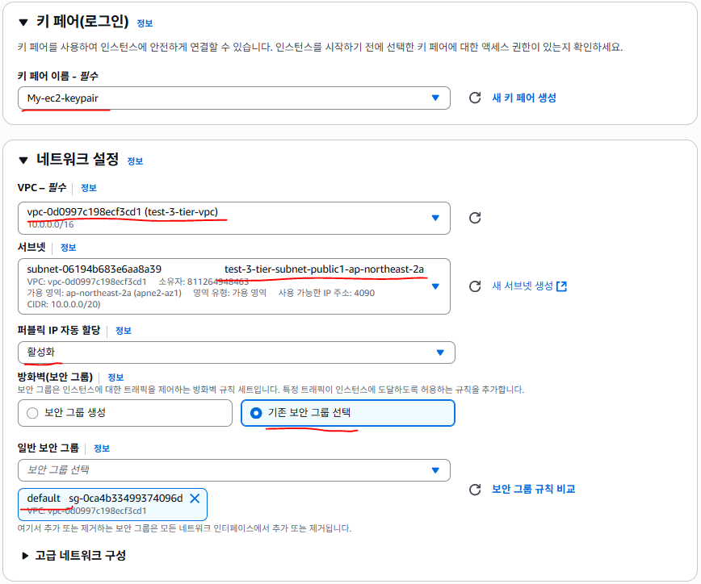

- IAM 인스턴스 프로파일: test-3-tier-ec2-role

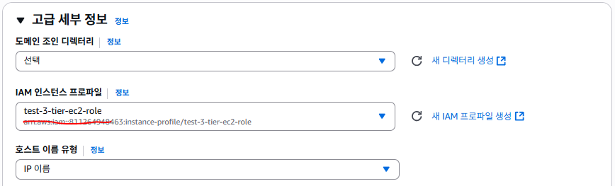

- 사용자 데이터에 demo_3_tier_userdata.txt 안의 데이터를 복사 후 붙여넣기

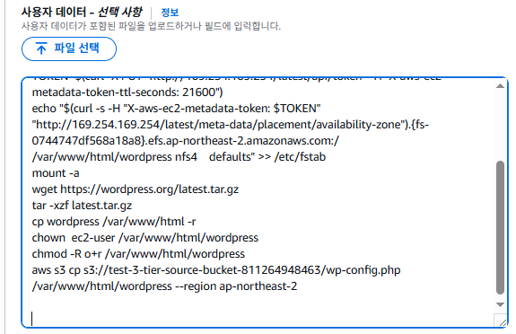


- EC2 인스턴스 연결

```
[ec2-user@ip-10-0-7-52 ~]$ sudo -s

[root@ip-10-0-7-52 ec2-user]# cd /var/www/html

[root@ip-10-0-7-52 html]# dir
wordpress

[root@ip-10-0-7-52 html]# systemctl status httpd
```

- EC2인스턴스 퍼블릭 IPv4 주소 복사

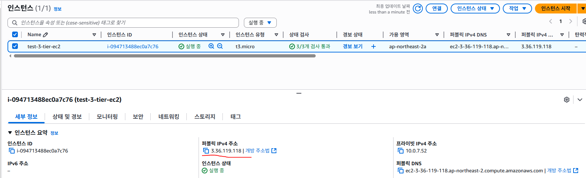

http://3.36.119.118/wordpress/

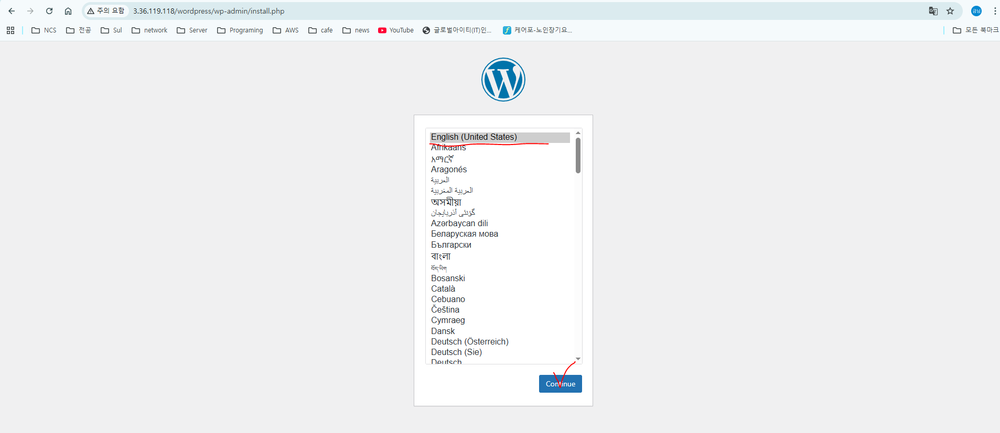

- Site Title: test-3-tier
- Username: admin
- Password: admin1234
- Your Email: konan7979@naver.com

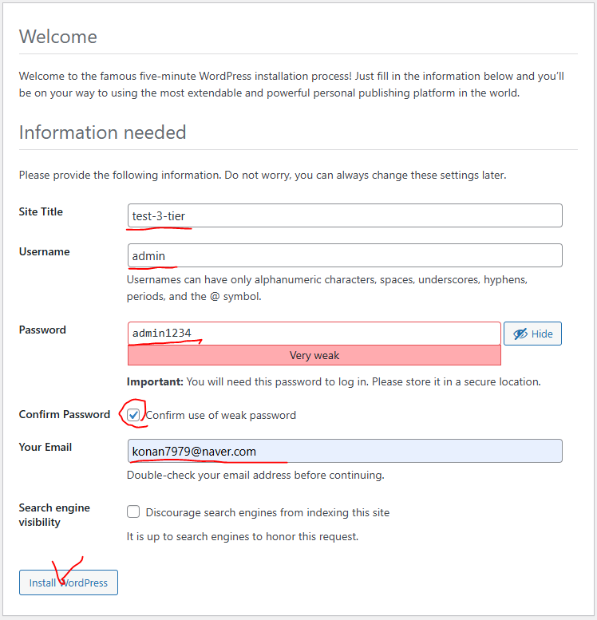

```
http://3.36.119.118/wordpress/wp-admin/install.php?step=2# 지우고 다시 접속

http://3.36.119.118/wordpress/
```

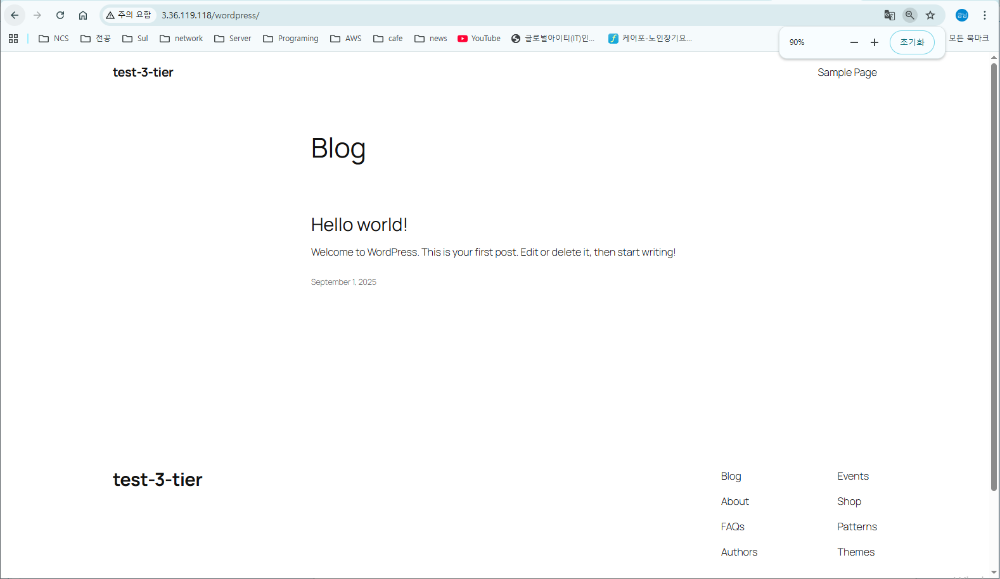

## 지금 만든 EC2 인스턴스를 AMI로 만든 후 Auto-Scaling그룹으로 만들어보자

```
1) 원본 EC2 -->  AMI 생성
```

- 지금 인스턴스의 디스크 상태(OS+설정+패키지)를 스냅샷 떠서 이미지(AMI) 로 든다.
- 주의: IP/보안그룹/서브넷/인스턴스ID, 그리고 EFS 같은 외부 스토리지의 데이터는 AMI에 포함되지 않는다.

2) 시작 템플릿(Launch Template) 작성
- 위 AMI를 참조 + 인스턴스 타입, 키페어, 보안그룹, 서브넷, User Data, IAM Role, EBS 크기 등 실행 파라미터를 저장
- 버전 관리(v1, v2…) 가능.

3) 오토 스케일링 그룹(ASG) 생성
- 시작 템플릿(특정 버전)을 지정하고, 최소/최대/원하는 용량, 가용영역(서브넷)을 설정
- (웹이면) ALB/Target Group에 연결하고 ELB 헬스체크 사용 권장
- CPU/요청수/스케줄 등 스케일링 정책을 붙이면, 같은 AMI 기반의 인스턴스를 자동으로 늘리고 줄일 수 있다.

- 인스턴스  -->  test-3-tier-ec2 선택  -->  작업  -->  이미지 및 템플릿  -->  이미지 생성

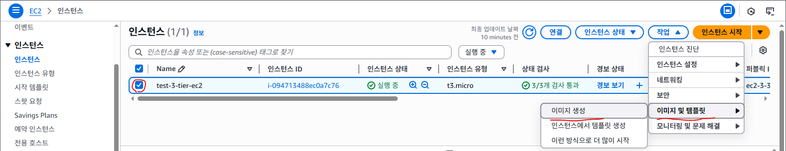

- 이미지 이름: test-3-tier-wordpress

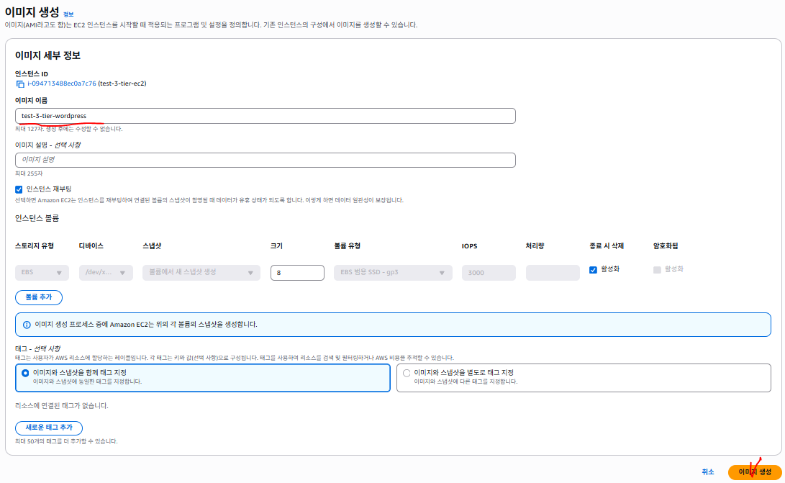

- 이미지가 생성되고 있다.

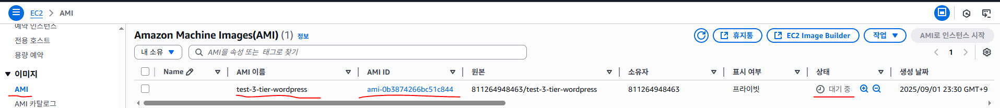

- EC2  -->  시작 템플릿  -->  시작 템플릿 생성

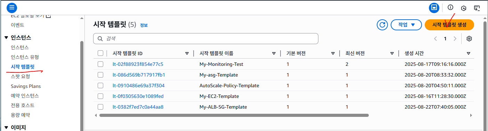

- 시작 템플릿 이름 : test-2-tier-template

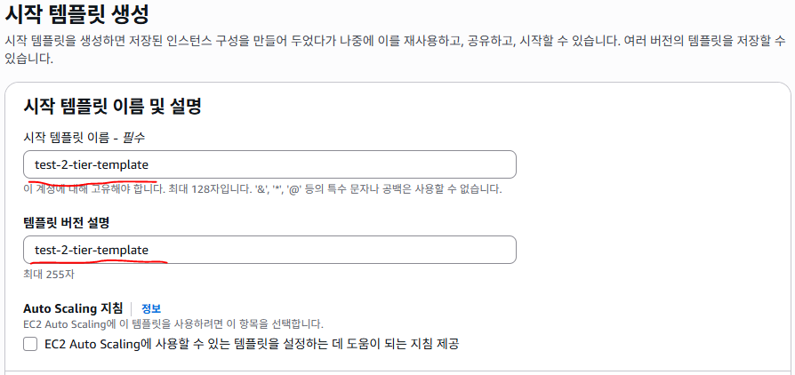

- Amazon Machine Image(AMI): test-3-tier-wordpress

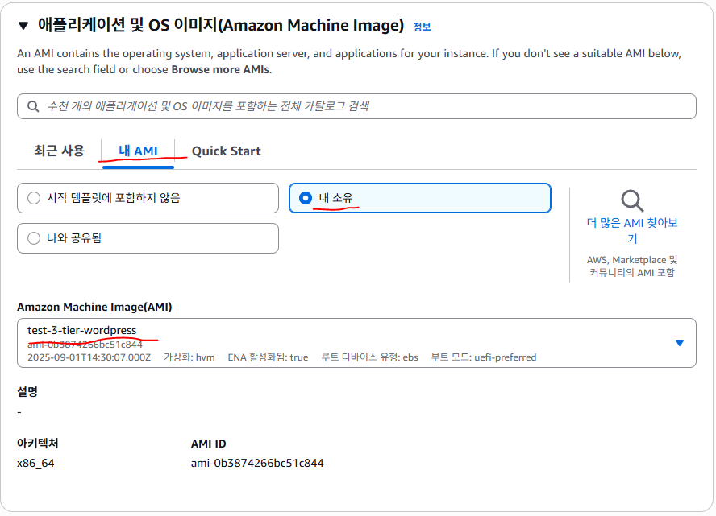

- 인스턴스 유형: t3.micro
- 키 페어(로그인)  정보: 시작 템플릿에 포함하지 않음


- 나머지는 모드 기본값 사용


## 대상 그룹(Target group) 지정

- 대상 그룹
  - 대상그룹은 로드 밸런서가 요청을 보낼 서버들을 한데 묶어 둔 목록이야
  - 이 묶음 안에는 EC2나 IP 같은 대상이 들어가고 포트와 헬스 체크를 함께 설정해 정상인 대상에게만 전송
  - Target group 오토 스케일링으로 서버가 늘어나면 대상그룹에 자동으로 들어오고 줄면 자동으로 빠진다.

- 흐름 한 줄로
  - 사용자 --> 로드 밸런서 --> 요청 규칙에 맞는 대상그룹 선택 --> 그 안에서 정상 서버로 분배
- EC2  -->  대상그룹  -->  대상그룹 생성


- 대상 그룹 이름 : test-3-tier-target-group
- VPC: vpc-097458547a307a869 (test-3-tier-vpc-vpc)


- 상태 검사 경로 : /wordpress
- 고급 상태 검사 설정 펼치기
- 성공 코드: 301


- 대상그룹 생성


## Auto Scaling 그룹 생성

- EC2  -->  Auto Scaling 그룹


- Auto Scaling 그룹 이름: test-3-tier-wordpress
- 시작 템플릿: test-3-tier-template


- VPC: vpc-097458547a307a869 (test-3-tier-vpc-vpc)
- 가용 영역 및 서브넷: 4개 모두 선택


- 로드 밸런싱 : 기존 로드 밸런서에 연결
- 기존 로드 밸런서 대상 그룹: test-3-tier-target-group


- Elastic Load Balancer 상태 확인 켜기 (체크박스 클릭)


원하는 용량: 2
원하는 최소 용량: 0
원하는 최대 용량: 2


- 나머지 기본값 사용


- 모두 기본값사용


```hcl
키 = Name , 값 = test-3-tier-wordpress-asg
```


- Auto Scaling 그룹이 생성된 것을 확인할 수 있다.
- 인스턴스 관리 탭을 확인해보면 인스턴스 2개가 생성된 것을 확인할 수 있다.


- 인스턴스를 확인해보면 Auto Scaling 그룹에 의해 인스턴스 2개가 생성된 것을 확인할 수 있다.
- Name test-3-tier-wordpress-asg로 확인된다. (이미지속의 이름은 오타 : test-2-tier-wordpress-asg)


- EC2  -->  로드밸런서  -->  로드밸런서 생성


- 로드 밸런서 이름 : test-2-tier-wordpress-alb


- VPC: vpc-097458547a307a869 (test-3-tier-vpc-vpc)
- ap-northeast-2a (apne2-az1): 퍼블릭 서브넷 선택 (test-3-tier-vpc-subnet-public1-ap-northeast-2a)
- ap-northeast-2b (apne2-az2): 퍼블릭 서브넷 선택 (test-3-tier-vpc-subnet-public2-ap-northeast-2b)


- 보안 그룹: default
- 프로토콜 : HTTP , 포트 : 80 , 기본 작업 : test-2-tier-target-group


- 로드밸런서가 생성되고 시간이 지나면 상태가 활성으로 변경된다.


- EC2  -->  로드밸런서  -->  test-2-tier-wordpress-alb 선택  -->  세부정보  -->  DNS 이름 복사


- DNS 이름을 복사해서 브라우저에 입력스 /wordpress를 추가해서 접속하면 사이트로 접속된다.
http://test-2-tier-wordpress-alb-331906121.ap-northeast-2.elb.amazonaws.com/wordpress/


- 사이트 접속후 F12 키를 누르면 에러가 확인된다.


- 처음 생성한 EC2 인스턴스의 퍼블릭 IP 주소를 확인해보면 위의 에러에서 표시되는 IP 주소와 동일하다.


## 콜스(Call) 에러란?

- 브라우저나 AWS가 서버로 요청(Call)을 보냈는데 응답이 실패한 것을 콜스 에러라고 한다.
(AWS에서 공식 용어는 아님)

- 콘솔(F12)에서 Failed to load resource, CORS policy blocked, ERR_CONNECTION_TIMED_OUT 같은
메시지가 나오는 게 대표적이다.

- 콜스 에러가 발생하는 주요 원인
  - 인스턴스 직접 접속 문제
  - 오토스케일링 + 로드밸런서 구조에서는 퍼블릭 IP로 직접 접근하시 차단된다.
  - 인스턴스 보안그룹이 ALB만 허용으로 돼 있거나, 퍼블릭 IP가 없는 경우 많음

- 워드프레스 설정 문제
  - 워드프레스가 사이트 주소(WP_HOME, WP_SITEURL)를 EC2 IP로 저장해두면,
정적 리소스(JS, CSS, 폰트 등)가 IP를 타고 요청됨.

- 브라우저 입장에서는 ALB 도메인으로 HTML은 받았는데, 리소스는 IP에서 오니
출처가 다르다(CORS) 해서 차단 (콘솔에 빨간 에러)

- 왜 사이트 화면은 보이나?
  - HTML 뼈대(본문)는 ALB 도메인에서 정상적으로 받을 수 있다.
  - 단, CSS·JS·폰트 같은 부가 리소스만 막혀서 화면이 깨지거나 기능이 일부 안 됨.

## 문제 원인

1. 실습 구성 순서

```
1) EC2 생성
2) Apache, PHP, WordPress 설치
3) WordPress 설치 완료
4) 해당 EC2를 이미지(AMI)로 생성
5) 시작 템플릿 생성
6) Auto Scaling Group 구성
7) Load Balancer 연결

2. WordPress 주소가 저장되는 시점
```

- WordPress는 설치가 완료되는 순간, 접속한 주소를 사이트 주소로 저장한다.
- 이 값은 wordpress 데이터베이스에 저장되며, 이후 자동으로 변경되지 않는다.

3. AMI의 역할

- AMI(이미지)는 서버 상태를 그대로 복사한다.
  - 프로그램
  - 설정 파일
  - 데이터베이스
  - WordPress 설정등이 모두 함께 복사된다.

- 따라서, AMI를 만들기 전에 저장된 WordPress 주소도 그대로 복제된다.

## 문제가 발생하는 이유

- AMI를 만들기 전에 EC2에서 WordPress를 먼저 설치하면, EC2 주소가 사이트 주소로 저장된다.

- 이 상태로 AMI를 만들고 ASG를 구성하면, 모든 서버에 동일한 주소 설정이 복사된다.

- 이후 Load Balancer로 접속하면,
  - 실제 접속 주소: ALB 주소
  - WordPress에 저장된 주소: EC2 주소
  - 서로 달라지게 된다.

- 이로 인해 화면 깨짐, 파일 로딩 실패 등의 문제가 발생한다.

- URL마지막에 /wp-admin을 추가하면 로그인 페이지로 접속이 가능하다.
http://test-2-tier-wordpress-alb-331906121.ap-northeast-2.elb.amazonaws.com/wordpress/wp-admin

- 로그인 페이지에서 username과 password를 입력하면 로그인할 수 있다.
- Username: admin
- Password: admin1234


- WordPress Address (URL): http://3.36.119.118/wordpress
- Site Address (URL): http://3.36.119.118/wordpress
- WordPress Address의 IP 주소와 Site Address의 IP 주소를 로드밸런서 DNS 주소로 변경해야 한다.


- 로드밸런서의 DNS 이름을 복사


- 로드밸런서 DNS 주소: test-2-tier-wordpress-alb-331906121.ap-northeast-2.elb.amazonaws.com

- WordPress Address (URL): http://3.36.119.118/wordpress
- http://test-2-tier-wordpress-alb-331906121.ap-northeast-2.elb.amazonaws.com/wordpress
- Site Address (URL): http://3.36.119.118/wordpress
- http://test-2-tier-wordpress-alb-331906121.ap-northeast-2.elb.amazonaws.com/wordpress


- 다시 접속하게되면 에러 메세지가 출력되지 않는다.
http://test-2-tier-wordpress-alb-331906121.ap-northeast-2.elb.amazonaws.com/wordpress/


## 마지막 실습은 외부에서 EC2 인스턴스로 직접 접속할 수 없도록 보안그룹을 수정해보자.

## 첫 번째 보안그룹 생성

- Auto Scaling에 의해 생성된 인스턴스는 default 보안 그룹이 적용되어 있다.
- default 보안그룹은 모든 트래픽을 허용한다.


- EC2  -->  보안 그룹  -->  보안 그룹 생성


- 보안 그룹 이름: test-alb-wordpress-sg
- VPC 정보: vpc-097458547a307a869 (test-3-tier-vpc-vpc)
- 아웃 바운드 규칙: HTTP , 0.0.0.0/0


- 가독성을 높이기 위해서 보안 그룹의 Name 설정


## 두 번째 보안그룹 생성 (EC2 인스턴스 적용)

- EC2  -->  보안 그룹  -->  보안 그룹 생성


- 보안 그룹 이름 정보: test-ec2-sg
- VPC 정보: pc-097458547a307a869 (test-3-tier-vpc-vpc)
- 인바운드 규칙 정보
  - 모든 트래픽sg-031effdf7e5c70c30 (위에서 만든 보안 그룹 적용 test-alb-wordpress-sg)
  - SSH0.0.0.0/0


- 인바운드 규칙 정보: SSH , 0.0.0.0/0


- 만들어진 보안그룹을 처음에 만든 EC2 인스턴스에 적용
- 인스턴스  -->  test-3-tier-ec2 인스턴스 선택  -->  작업  -->  보안  -->  보안 그룹 변경


```
1) 방금 만든 test-ec2-wordpress-sg 선택
2) 보안그룹 추가
3) 기존의 default 보안그룹 삭제
4) 저장
```


- test-3-tier-ec2의 퍼블릭 DNS 주소 복사


- 외부에서 EC2 인스턴스로 직접 접속할 수 없다.
ec2-3-36-119-118.ap-northeast-2.compute.amazonaws.com/wordpress


- 로드 밸런서의 DNS 주소를 복사


- 로드밸런서를 사용해서 접속하면 사이트로 접속된다.
http://test-2-tier-wordpress-alb-331906121.ap-northeast-2.elb.amazonaws.com/wordpress


- 트래픽이 증가해서 EC2 인스턴스가 추가될 때 위에서 만든 보안 그룹이 적용되도록 시작 템플릿을 수정해야 한다.
- 시작 템플릿 -->  test-3-tier-template 선택 -->  시작템플릿 버전 새부정보 -->  작업 -->  템플릿 수정(버전 생성)


- 네트워크 설정에서 두 번째로 만든 보안그룹을 적용해야 한다.
- 보안 그룹 선택: test-ec2-sg(sg-042438bac719efdd0)
- 나머지는 모두 그대로 사용


- 수정한 시작 템플릿이 Auto Scaling에서 동작하도록 수정해야 한다.
- Auto Scaling  --> test-3-tier-wordpress 선택  -->  동작 -->  편집


- 시작 템플릿의 버전을 default가 아니라 조금전 생성한 버전인 Latest(2)로 변경해야한다.
- 앞으로 트래픽이 증가해서 EC2 인스턴스가 생성될 때 수정한 시작 템플릿의 보안그룹이 적용되어 생성된다.


- 마지막으로 로드발란서에 첫 번째로 만든 보안그룹을 적용해야 한다.


- 기존의 default 보안그룹은 해제하고 test-alb-wordpress-sg를 적용하고 저장


- 새 게시물 작성


- 계시물 작성


- 메인 페이지로 접속하면 새로운 글이 작성이 확인된다.


## Bastion Host 로 EC2 접속

```
[root@ip-10-0-15-68 ec2-user]# mariadb -h [RDS EndPoint 주소] -u admin -p
Enter password:

MySQL [(none)]> SHPW DATABASES;
ERROR 1064 (42000): You have an error in your SQL syntax; check the manual that corresponds to your MySQL server version for the right syntax to use near 'SHPW DATABASES' at line 1
MySQL [(none)]> SHOW DATABASES;
+---------------------------+
| Database           |
+---------------------------+
| information_schema |
| mysql              |
| performance_schema |
| sys                |
| wordpress          |
+---------------------------+

MySQL [(none)]> USE wordpress;

MySQL [wordpress]> SHOW TABLES;
+---------------------------+
| Tables_in_wordpress   |
+---------------------------+
| wp_commentmeta        |
| wp_comments           |
| wp_links              |
| wp_options            |
| wp_postmeta           |
| wp_posts              |
| wp_term_relationships|
| wp_term_taxonomy      |
| wp_termmeta           |
| wp_terms              |
| wp_usermeta           |
| wp_users              |
+---------------------------+

MySQL [wordpress]>
SELECT ID, post_title, post_date FROM wp_posts WHERE post_type='post' ORDER BY ID DESC;
+----+---------------------+----------------------------+
| ID | post_title                 | post_date           |
+----+---------------------+----------------------------+
| 11 | 이거슨 첫글입니다.      | 2026-09-08 07:08:38 |
|  8 | new title               | 2026-09-08 06:48:46 |
|  6 | 새로은 글 작성         | 2026-09-08 06:47:40 |
|  5 | Auto Draft              | 2026-09-08 04:15:55 |
|  1 | Hello world!            | 2026-09-08 04:15:40 |
+----+---------------------+----------------------------+

MySQL [wordpress]>
SELECT ID, post_title, post_content post_date FROM wp_posts WHERE post_type='post' ORDER BY ID DESC;
+----+----------------------------+-------------------------------------------------------------------------------------------------------------------------------------------------------------------------------------------+
| ID | post_title                 | post_date                                                                                                                                                                                 |
+----+----------------------------+-------------------------------------------------------------------------------------------------------------------------------------------------------------------------------------------+
| 11 | 이거슨 첫글입니다.         | <!-- wp:paragraph -->
<p>아마 첫글일 꺼에요</p>
<!-- /wp:paragraph -->

<!-- wp:paragraph -->
<p></p>
<!-- /wp:paragraph -->                                                              |
|  8 | new title                  | <!-- wp:paragraph -->
<p>new content</p>
<!-- /wp:paragraph -->

<!-- wp:paragraph {"className":"is-style-text-display"} -->
<p class="is-style-text-display"></p>
<!-- /wp:paragraph --> |
|  6 | 새로은 글 작성             | <!-- wp:paragraph -->
<p>새로운글을 작성합니다.</p>
<!-- /wp:paragraph -->

<!-- wp:paragraph -->
<p></p>
<!-- /wp:paragraph -->                                                          |
|  5 | Auto Draft                 |                                                                                                                                                                                           |
|  1 | Hello world!               | <!-- wp:paragraph -->
<p>Welcome to WordPress. This is your first post. Edit or delete it, then start writing!</p>
<!-- /wp:paragraph -->                                                 |
+----+----------------------------+-------------------------------------------------------------------------------------------------------------------------------------------------------------------------------------------+

# 리소스 삭제

1) EC2  -->  Auto Scaling 삭제
2) EC2  -->  로드밸런서 삭제
3) EC2  -->  타겟 그룹 삭제
4) RDS  -->  데이터베이스 삭제
5) S3  -->  버킷 삭제
6) EC2  -->  인스턴스 삭제(수동으로 만든 EC2 삭제, Auto Scaling으로 만든 EC2는 Auto Scaling이 자동 삭제)
7) EFS  -->  EFS 파일 시스템 삭제
8) EC2  -->  AMI(이미지) 삭제 (AMI 등록 취소)
9) EC2   -->  스냅샷 삭제
```
