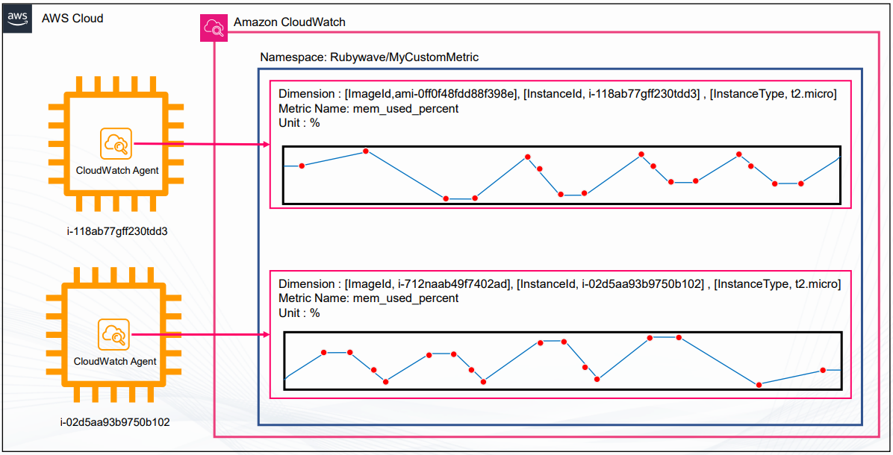
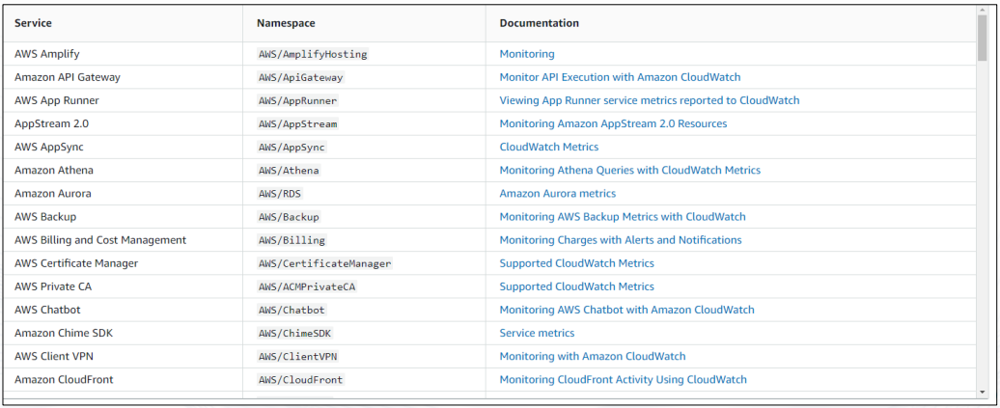
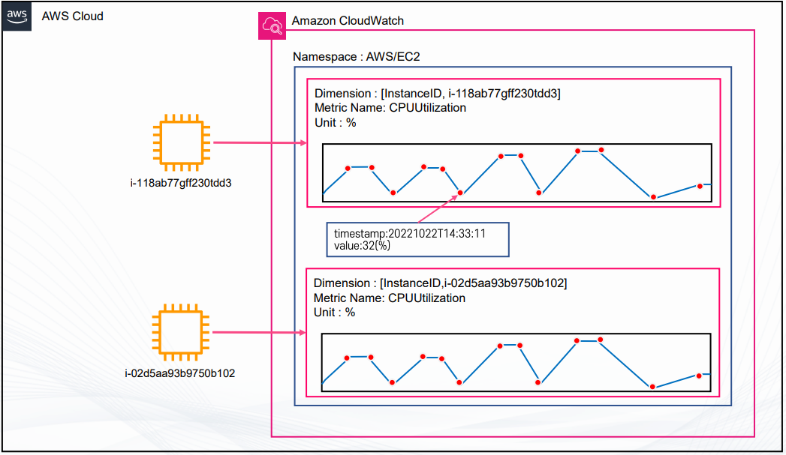
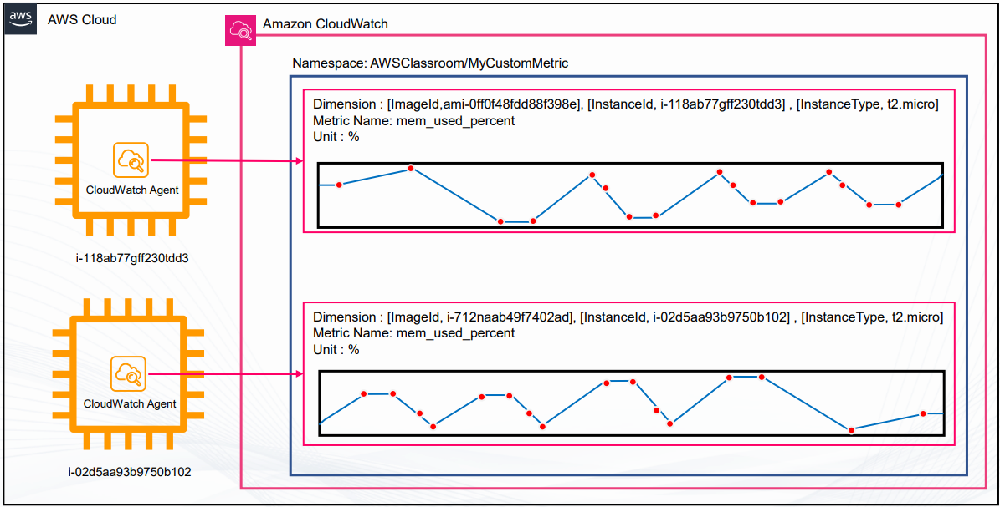
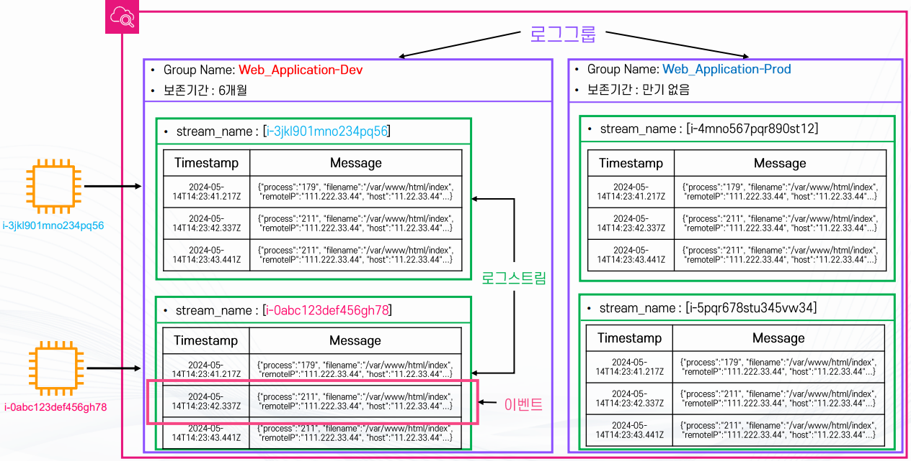
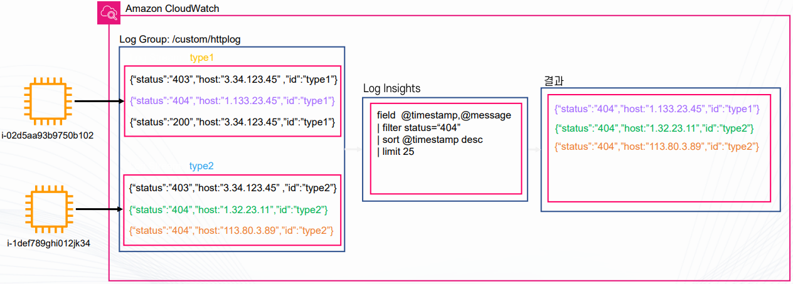
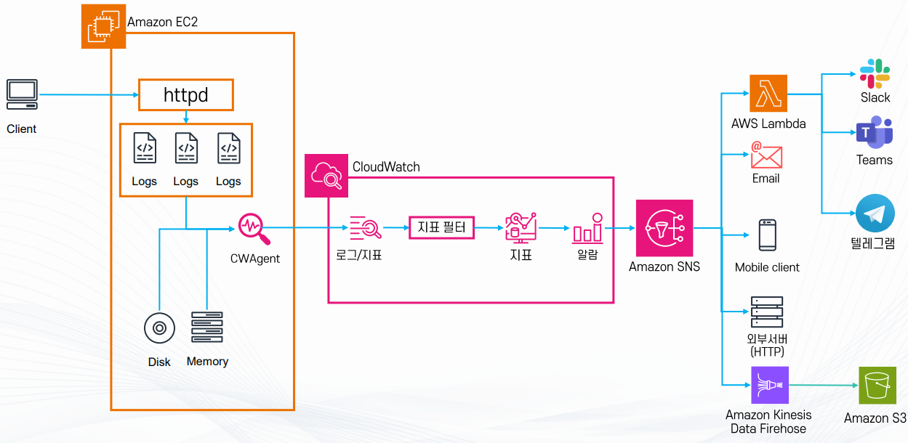
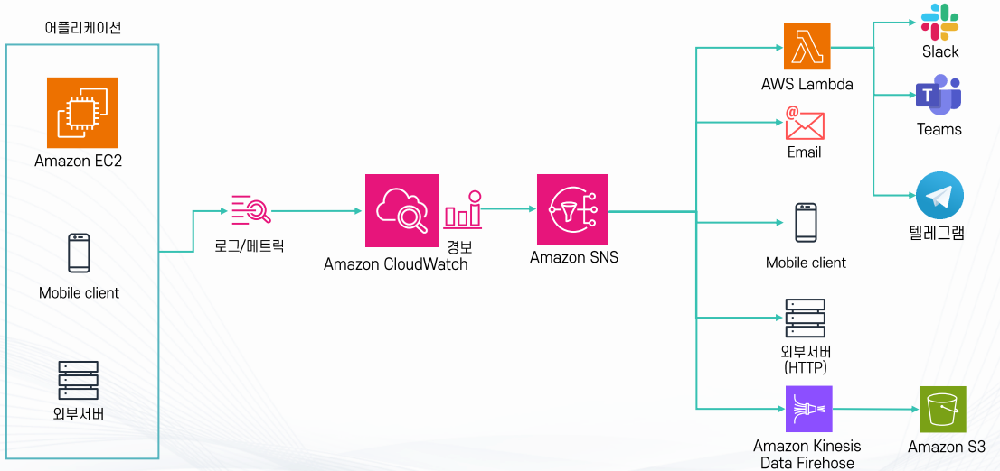
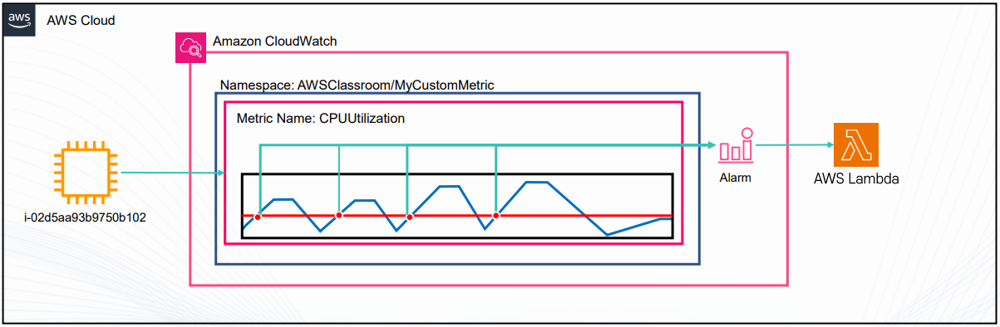

# Amazon CloudWatch 기초 - 강의 노트

AWS 강의 노트(HWP) 원본을 이미지와 설정 코드, 주석까지 그대로 옮긴 문서다. 정리본은 이론·가이드 문서를 함께 본다.

## Amazon CloudWatch 기초

## CloudWatch 개요

- Amazon CloudWatch는 AWS가 제공하는 대표적인 모니터링 서비스이다.
- DevOps 엔지니어, 개발자, SRE(사이트 안정성 엔지니어), IT 관리자가 시스템과 애플리케이션의 성능을 확인하고
운영 상태를 안정적으로 유지하기 위해 사용한다
- CloudWatch는 애플리케이션 상태를 모니터링하고, 시스템 전체의 성능 변화에 대응하며,
리소스 사용률을 최적화할 수 있도록 돕는다.
또한 운영자가 필요한 데이터를 수집해 실행 가능한 통찰력을 제공한다.

## 서비스 특징

- AWS 서비스와 애플리케이션 전반을 모니터링할 수 있다.
- Public 서비스이므로 인터넷을 통해 접근하거나, VPC 내부에서는 Interface Endpoint로도 접근할 수 있다
- 로그, 지표, 이벤트 같은 운영 데이터를 수집해 시각화하고 분석할 수 있다
- 수집된 데이터를 기반으로 경보를 생성하고 자동화된 대응을 실행할 수 있다
- AWS 대부분의 서비스와 기본적으로 연동되기 때문에 추가 설정 없이도 활용 범위가 넓다.
(EX) EC2의 CPU 사용률, RDS의 디스크 사용률, 람다의 실행 속도등)

## 지표(Metric) 수집

- 지표는 시간 순서대로 정리된 데이터의 집합이며 여러 개의 데이터 포인트로 구성된다.
- AWS 서비스들은 기본적으로 지표를 제공한다 (EC2 CPU 사용률, 네트워크 트래픽, 디스크 I/O 등)
- 커스텀 지표를 생성할 수도 있다.
  - CloudWatch Agent를 설치하면 메모리 사용률, 디스크 사용률 같은 추가 지표를 수집할 수 있다.
- 지표는 단위(Unit)와 차원(Dimension) 값을 가지며, 사용자가 원하는 대로 필터링하고 분석할 수 있다.

4. 커스텀 지표 예시 (각 점들이 데이터 포인트이다.)



## 경보(Alarm)

- CloudWatch는 수집한 지표를 기반으로 경보를 설정할 수 있다.

- 특정 임계치(Threshold)를 넘거나 내려갈 때 이벤트가 발생한다.

- 대응 방식
  - SNS를 통해 알림 전송
  - Lambda 함수를 실행해 자동 조치
  - Auto Scaling 그룹과 연계하여 인스턴스 수를 늘리거나 줄임
  - 예: 웹 서버에서 500 에러 발생률이 일정 수치 이상이면 슬랙 알림을 발송

- 장애 대응에서 가장 중요한 것은 얼마나 빨리 문제를 알아채느냐이다. 장애를 1분 만에 고칠 수 있더라도 10시간 후에 알게 되면 이미 피해가 커져 의미가 없다. 따라서 빠르게 고치는 것만큼이나 빠르게 감지하는 것도 중요하다 AWS CloudWatch는 이러한 장애를 조기에 감지하는 핵심적인 역할을 한다

- AWS CloudWatch의 알람은 특정 지표가 설정한 임계치를 넘을 때 자동으로 발생한다.
예를 들어 EC2의 CPU 사용률이 기준치를 초과하면 알람이 발생하고,
이를 이메일, 모바일 알림, 외부 서버 연동, S3 로그 저장 등 다양한 방식으로 처리할 수 있다.
또한 EC2뿐만 아니라 모바일 클라이언트, 온프레미스 서버에서도 로그나 지표를 받아 알람을 설정할 수 있다.
결과적으로 CloudWatch 알람은 자동화된 환경에서 문제 대응을 시작하는 첫 번째 트리거 역할을 한다.


## 로그(Log) 수집 및 관리

- CloudWatch Logs를 통해 AWS 서비스와 애플리케이션 로그를 수집한다.
- 예: Lambda, EC2, Route53, ECS 로그
- 운영자는 콘솔에서 직접 조회하거나, CloudWatch Logs Insights로 쿼리 분석을 수행할 수 있다.
- 로그를 기반으로 에러 패턴을 찾거나 성능 문제를 빠르게 진단할 수 있다

#대시보드
- CloudWatch Dashboard를 사용하면 수집한 지표와 로그를 시각적으로 표현할 수 있다.
- 운영자는 여러 리소스의 상태를 한 화면에서 확인할 수 있다.
- 외부 리소스를 연동해서 커스텀 대시보드도 만들 수 있다.
  - 예: S3 객체 상태 표시, HTML 기반의 커스텀 그래프 삽입
- 이를 통해 모니터링 환경을 팀에 맞게 최적화할 수 있다.

## 기타 기능

- Synthetics Canary: 웹 애플리케이션을 모니터링하는 기능으로,
사용자가 실제로 접속하는 것처럼 시뮬레이션해 동작을 확인한다.
- CloudWatch Contributor Insights: 애플리케이션, 컨테이너, Lambda 등의 문제 원인을 분석해준다
- Cross-account, Cross-region 모니터링을 지원해 여러 계정, 리전을 통합 관리할 수 있다

## 요금 및 프리 티어

- 프리 티어(월 단위)
  - 기본 모니터링 지표 10개
  - 대시보드 3개
  - 경보 10개
  - 로그 5GB 저장

- 요금 부과 기준
  - 로그 저장량, 분석량, 실시간 로그 조회(Live Tail) 사용량
  - 지표 개수와 커스텀 지표 생성량
  - 경보 개수
  - 대시보드 사용량

## CloudWatch 지표

## 지표(Metric) 개념

- 정의 : 시간 순서대로 수집, 정리된 데이터들의 집합
- 구성: 다수의 데이터 포인트(Data Point)로 이루어진다. (데이터 포인트는 시간과 값으로 구성된다.)
- AWS 대부분의 서비스는 지표 제공 (EC2 CPU 사용률, 네트워크, 디스크 I/O 등)

- 커스텀 지표 생성가능
  - 사용자가 원하는 데이터 포인트를 CloudWatch로 전송 가능
  - 예 : EC2 메모리 사용량은 기본으로 제공하는 지표가 아니기 때문에 별도로 지정해야 한다.
- 리전 단위 관리
- 보관: 최대 15개월, 이후 새로운 데이터가 들어오면 이전 데이터는 삭제된다. (영구 보존되지 않는다.)

## 네임스페이스 (Namespace)

- CloudWatch 지표를 논리적으로 묶는 컨테이너
- AWS 기본 네임스페이스 형식: AWS/{서비스명} (예: AWS/EC2, AWS/RDS)
- 필수 + 반드시 직접 지정해야 한다. (디폴트 없음)



## 지표 이름 (Metric Name)

- 네임스페이스 안에서 지표를 구분하는 세부 이름
- 무엇에 관한 지표인지 명확히 표현 필요
- 필수 항목

## 데이터 포인트 (Data Point)

- 지표를 구성하는 시간 - 값 단위 데이터
- 초 단위까지 기록 (예: 2025-10-31T23:59:59Z)
- UTC 기준 사용 권장 (통계 및 알람에 활용)

## 데이터 포인트의 해상도 (Data Point Resolution)

- 데이터 수집 주기를 의미
- 기본 : 60초 단위
- High-Resolution 모드: 1초 단위 수집 가능
- 이후 1, 5, 10, 30초 또는 60초 배수 단위로 조회 가능

## 데이터 포인트의 기간 (Period)

- 집계 기준 시간 단위 (얼마나 긴 구간을 묶어서 보여줄지 결정)
- 설정 가능 범위: 1초 ~ 86,400초(1일)

- 60초 미만은 High-Resolution 모드 전용
  - 60초 미만: 최대 3시간
  - 60초 단위: 15일
  - 300초 단위: 63일
  - 1시간 단위: 455일 (15개월)

- 보관 정책
  - 작은 단위 데이터는 보관 기한 이후 큰 단위로 자동 합쳐짐
  - 예: 1분 단위 (15일 후 5분 단위로만 확인 가능)
  - 63일 후에는 1시간 단위만 확인 가능

- 주의사항
  - 2주 이상 업데이트가 없는 Metric은 콘솔에서 자동 숨김 처리됨
  - CLI를 통해서는 확인 가능

## 차원 (Dimension)

- 지표를 구분하기 위한 태그/카테고리 (Key-Value 구조)
- 최대 30개까지 지정 가능
- 예: EC2 지표를 InstanceID Dimension으로 구분해 인스턴스별 확인 가능
- 조합 가능 (예: Server=prod, Domain=Seoul)

## 단위(Unit)

- 정의: CloudWatch에서 수집하는 지표 값이 어떤 의미를 가지는지 표현하는 척도
- 역할: 지표를 해석할 때 기준이 되는 물리적 단위 또는 비율
- 예시 단위

## % (퍼센트): CPU 사용률, 디스크 사용률 등

## Bytes (바이트): 네트워크 트래픽, 디스크 읽기/쓰기 바이트 수

## Seconds (초): 지연 시간(Latency), 실행 시간(Duration)

## Count (개수): 요청 수(RequestCount), 오류 횟수(Error Count)

## 기타 기능

- 지표 시각화: 다양한 지표를 선택하여 그래프로 분석 가능
- 비교 분석: 서로 다른 지표를 동시에 비교
- Metric Insight: SQL 형식으로 지표를 조회 및 분석 가능
  - 예: SELECT AVG(CPUUtilization) FROM SCHEMA("AWS/EC2", InstanceId)
- 자연어 쿼리 지원 (일부 리전만 지원)
  - 예: "EC2 인스턴스 중 네트워크 아웃이 가장 높은 인스턴스 보여줘"

AWS 지표



## 커스텀 지표



## CloudWatch Log

## CloudWatch 로그

- 정의: AWS 서비스 및 온프레미스 서비스에서 발생한 로그를 중앙에서 수집, 저장, 관리, 확인할 수 있는 서비스

- 특징
  - AWS의 대부분 서비스와 기본적으로 연동 (예: Lambda, API Gateway 등)
  - 로그 집계, 보관, 실시간 모니터링, 쿼리 및 분석 가능
  - 로그 수명 주기 관리(아카이빙/삭제) 지원

## 로그의 주요 구성요소

- 로그 그룹(Log Group)
  - 로그 관리 단위, 동일한 애플리케이션/서비스별로 그룹화
  - 예 : application-dev, lambda-function-A
  - 다양한 설정(보존 기간, 접근 권한 등)의 기본 단위

- 로그 스트림(Log Stream)
  - 같은 소스에서 순차적으로 수집되는 로그의 모음
  - 예 : EC2 인스턴스 단위로 수집된 웹 서버 로그

- 로그 이벤트(Log Event)
  - 실제 로그 데이터, 타임스탬프 + 메시지 형태
  - 예: 2025-09-02T09:00:01Z GET /index.html 200

- 보존 기간(Retention Period)
  - 로그 자동 삭제까지의 기간 지정 가능
  - 무한정 보관 설정도 가능



## 로그 클래스 (Log Class)

- Standard (기본): 실시간 모니터링이 필요하거나 자주 조회되는 로그

- Infrequent Access: 자주 쓰이지 않고 비용 효율적 저장만 필요한 경우
  - 제한: Subscription Filter, Metric Filter, Insight 같은 일부 기능 사용 불가

- 로그 그룹 생성 후 클래스 변경 불가

## Log Insights (로그 분석 기능)

- 대화형 쿼리 기반 로그 분석 서비스
- 특징
  - JSON 기반 로그를 쿼리 가능
  - 한 번에 최대 20개 로그 그룹 동시 조회
  - S3/OpenSearch로 별도의 로그 분석 작업 없이 로그 분석이 가능
  - 쿼리 저장 및 대시보드 시각화 가능



## Metric Filter (로그 기반 지표화)

- 로그에서 특정 패턴을 필터링해 CloudWatch 지표(Metric)로 변환하는 기능
- 예시:
  - { $.eventType = "*" && $.sourceIPAddress != 123.123.* }
- 정규식 및 비교식 적용 가능
- 필터가 적용된 시점부터 지표화 시작 (과거 로그는 지표화 되지 않는다.)

## 로그 관련 기타 기능

- Live Tailing: 실시간 로그 스트리밍 확인 (콘솔/CLI)
- 이상 탐지: ML 기반으로 로그 패턴 이상 징후 탐지
- Log Subscription: 로그를 다른 서비스/계정/S3/ElasticSearch로 전달 가능
  - 분석, 백업, 전송 등 용도로 활용
  - 필터링 후 전달 가능

- 정리
  - CloudWatch Log= 로그 수집/저장/조회/보관
  - Log Insights = 로그 분석 및 시각화
  - Metric Filter = 로그 기반 지표 생성
  - Log Subscription= 로그를 외부로 전달

## 실습



1. EC2 환경 준비
- Amazon EC2 인스턴스를 생성하고 웹 서버(httpd)를 설치
- 클라이언트에서 요청이 들어오면 웹 서버는 Access Log, Error Log 등 로그 파일을 남긴다.

2. CloudWatch Agent 설치 및 설정
- EC2 인스턴스에 CloudWatch Agent (CWAgent) 설치
- CloudWatch Agent 역할
  - EC2의 메모리 사용량, 디스크 사용량, CPU, 네트워크 등 OS 수준의 지표 수집
  - EC2 내부 로그 파일(Apache Access Log, Error Log 등)을 CloudWatch로 전송

3. Custom Metric 수집
- EC2 기본 지표에는 메모리/디스크 사용량이 포함되지 않으므로, CloudWatch Agent를 통해 Custom Metric을 생성
  - MemoryUtilization (% 단위 메모리 사용률)
  - DiskUsedPercent (디스크 사용률)
- 이 지표들은 CloudWatch 콘솔에서 별도의 Custom Namespace로 확인 가능

4. 로그 지표화(Log to Metric)
- CloudWatch Logs에 전송된 Apache Access Log를 Metric Filter로 변환
- 예: 404 에러 로그만 필터링해서 404ErrorCount라는 지표 생성

특정 시간 동안 404가 몇 번 발생했는지 숫자로 집계

5. 알람 생성 (Alarm)
- CloudWatch에서 지표 기반 알람을 설정
- 예: 404ErrorCount >= N이 분당 발생하면 경보 발생 또는 메모리 사용량이 80% 이상일 때 알람 발생

6. 알람 후 처리 (SNS 연동)
- 알람이 발생하면 Amazon SNS를 통해 알림 전달
- SNS 구독 대상 예시
  - Email: 운영자에게 메일 발송
  - Slack, Teams, Telegram: 협업 툴로 실시간 알림
  - AWS Lambda: 자동 대응 스크립트 실행 (예: 서버 확장)
  - Mobile Client: 모바일 푸시 알림
  - 외부 HTTP 서버: 서드파티 모니터링 시스템 연동
  - Amazon Kinesis Data Firehose: 로그/지표를 S3로 적재하여 장기 분석

## CloudWatch 경보

## 경보(Alarm)

- 정의 : 수집된 지표 값이 설정한 임계치(Threshold)에 도달하거나 초과/미달할 때 이벤트를 발생시키는 기능

- 상태 종류 (3가지)
  - OK : 정상 상태 (지표 값이 임계치 조건을 만족하지 않음)
  - ALARM : 경보 상태 (지표 값이 설정된 조건을 초과/미달하여 알람 발생)
  - INSUFFICIENT_DATA : 경보 상태를 판단할 충분한 데이터가 없음 (지표가 수집되지 않거나 부족한 경우)

- 알람 평가 주기 (Resolution에 따라 달라짐)
  - 기본: 60초 단위
  - High Resolution 모드: 1초 단위까지 가능
  - 그 외: 반드시 60초의 배수 단위로만 평가

- 대응 방법
  - SNS(Simple Notification Service)로 알림 발송
  - Lambda 실행 --> 자동 복구 또는 특정 조치 수행
  - 이메일/슬랙/챗봇 등 외부 시스템 연동
  - 예: 웹서버의 500 오류 발생 횟수가 일정 수치 이상일 때 알림 전송





## 결합 경보(Composite Alarm)

- 정의: 여러 개의 경보를 Boolean 연산(AND, OR, NOT)으로 조합하여 하나의 경보 조건을 만드는 기능

- 특징
  - 많은 경보를 효율적으로 관리하고 전달 가능
  - Suppressor Alarm 설정 (특정 조건일 때 Composite Alarm의 알림을 중단 가능)

- 예시
  - (EC2 CPU 사용량 경보 AND 네트워크 사용량 경보): 웹팀에 알림
  - (NOT 웹서버 CPU 사용량 경보 AND RDS CPU 사용량 경보): DB팀에 알림
  - (500 에러 경보 OR 400 에러 경보) AND 네트워크 사용량 경보: 사용자 피크 트래픽 알림

## AWS CloudTrail

- AWS CloudTrail은 AWS 계정에서 누가, 언제, 어떤 작업을 했는지 기록하는 서비스
- 쉽게 말하면 AWS 계정 활동을 기록하는 CCTV 역할

- 예
  - 누가 EC2를 종료했는지
  - 누가 S3 버킷을 생성하거나 삭제했는지
  - 누가 IAM 사용자를 변경했는지
  - 누가 AWS 콘솔에 로그인했는지

## 주요 기능

- 계정 활동 기록`
  - AWS Management Console
  - AWS CLI
  - AWS SDK
  - AWS 서비스 간 API 호출
  - 위와 같은 작업들을 이벤트로 기록

- 기록되는 정보
  - 누가 실행했는지
  - 언제 실행했는지
  - 어떤 작업을 했는지
  - 어떤 리소스에 작업했는지
  - 성공했는지 실패했는지
  - 어떤 IP에서 요청했는지

- 활용 목적
  - 보안 감사
  - 문제 원인 추적
  - 규정 준수
  - 비정상적인 활동 확인

- 저장
- CloudTrail의 Event history에서는 최근 90일의 관리 이벤트를 조회 가능
- Trail을 만들면 이벤트 로그를 S3에 저장해서 장기간 보관 가능
- CloudWatch Logs와 연동하면 로그를 모니터링하고 경보 설정 가능

## 활용 예시

- EC2가 갑자기 삭제된 경우
  - CloudTrail에서 누가 TerminateInstances 작업을 실행했는지 확인

- S3 버킷 설정이 변경된 경우
  - CloudTrail에서 누가 설정을 변경했는지 확인

## AWS CloudTrail Trail

- Trail은 CloudTrail 이벤트를 계속 수집해서 저장하도록 만드는 설정
  - CloudTrail = AWS 활동을 기록하는 서비스
  - Trail = 기록한 로그를 어디에 저장하고 관리할지 정하는 설정

- Trail을 만들면 로그를 S3에 장기 저장 가능

## S3 저장

- Trail 생성 시 S3 버킷을 지정
- CloudTrail 이벤트가 해당 S3 버킷에 로그 파일로 저장됨

- 구조
  - AWS 활동 발생
  - CloudTrail Event 생성
  - Trail이 이벤트 수집
  - S3 버킷에 저장

## 리전 설정

- 단일 리전 Trail
  - 특정 리전에서 발생한 이벤트를 기록

- 다중 리전 Trail
  - 여러 리전에서 발생한 이벤트를 한 곳에 수집
  - 일반적으로 다중 리전 Trail을 많이 사용

## 다른 서비스와 연동

- CloudWatch Logs
  - CloudTrail 이벤트를 CloudWatch Logs로 전달
  - 로그 검색 및 모니터링 가능

- Metric Filter
  - 특정 이벤트를 찾아 숫자 형태의 지표로 변환

- CloudWatch Alarm
  - 특정 이벤트가 발생하면 경보 발생

- EventBridge
  - 특정 AWS 이벤트가 발생하면 자동 작업 실행

- 예
  - EC2 종료
  - CloudTrail에 기록
  - EventBridge가 이벤트 감지
  - Lambda 실행

## AWS CloudTrail Event

- CloudTrail Event는 AWS에서 발생한 하나의 작업 기록
- 쉽게 말하면 CloudTrail 로그의 한 줄 한 줄의 기록
- JSON 형식으로 기록됨

- 예
  - 사용자가 EC2를 종료
  - CloudTrail Event 생성
  - eventName : TerminateInstances
  - userIdentity : 실행한 사용자
  - eventTime : 실행 시간
  - sourceIPAddress : 요청 IP

## CloudTrail Event 종류

- CloudTrail Event는 크게 3가지로 구분

  - 1. Management Event

- AWS 리소스를 생성, 변경, 삭제, 관리하는 작업을 기록
- 쉽게 말하면 AWS 인프라를 관리한 기록

- 예
  - EC2 시작/중지/삭제
  - VPC 생성/삭제
  - IAM Role 생성/삭제
  - 보안 그룹 변경
  - Trail 생성/삭제

- 활용
  - 누가 리소스를 만들었는지 확인
  - 누가 설정을 변경했는지 확인
  - 누가 리소스를 삭제했는지 확인

  - 2. Data Event

- 리소스 안에 있는 데이터에 접근하거나 작업한 기록
- 쉽게 말하면 리소스 내부 데이터 사용 기록

- 예
  - S3 객체 다운로드(GetObject)
  - S3 객체 업로드(PutObject)
  - S3 객체 삭제(DeleteObject)
  - Lambda 함수 호출
  - DynamoDB 데이터 접근

- 특징
  - Management Event보다 훨씬 많은 로그가 발생할 수 있음
  - 기본적으로 별도 설정이 필요
  - 추가 비용이 발생할 수 있음

  - 3. Insight Event

- 평소와 다른 비정상적인 API 활동 패턴을 탐지
- 쉽게 말하면 CloudTrail이 평소와 다른 이상 행동을 찾아주는 기능

- 예
  - 짧은 시간에 API 호출이 갑자기 급증
  - 평소보다 삭제 작업이 크게 증가
  - 실패하거나 거부되는 API 요청이 갑자기 증가

- 특징
  - 별도 활성화 필요
  - 추가 비용이 발생할 수 있음

## CloudTrail 실습

1. CloudTrail Trail 생성 및 모니터링 확인
  - 새로운 Trail을 만들어서 로그를 S3 버킷에 저장
  - 이때 Data Event 수집 활성화 설정 --> S3 객체 단위 동작이나 Lambda 호출 같은 세부 이벤트도 기록
  - 생성된 Trail이 정상적으로 로그를 남기고 있는지 확인

2. CloudShell에서 EC2 정보 조회 테스트
  - AWS CloudShell을 열고 EC2 인스턴스 정보를 가져오기 위한 API 호출 실행
  - 예: aws ec2 describe-instances
  - API 호출 로그가 CloudTrail에 기록됨
  - 이벤트 기록에는 호출한 시간, 호출자, API 이름(DescribeInstances), 실행 결과 등이 남음

3. S3 Object 생성 및 요청 이벤트 확인
  - S3 버킷에 객체(Object) 업로드 (예: aws s3 cp file.txt s3://mybucket/)
  - 객체 다운로드(Get) 혹은 삭제(Delete) 같은 요청 실행
  - Data Event가 활성화되어 있다면, S3 객체 단위의 동작이 CloudTrail에 기록됨
  - 이벤트 세부 정보:
*요청한 사용자/서비스 정보
*요청 시간 및 지역(Region)

```
    *동작 종류 (PutObject, GetObject, DeleteObject 등)
    *요청 결과(성공/실패)

## AWS KMS(Key Management Service)
```

- AWS KMS는 AWS에서 사용하는 암호화 키를 생성하고 관리하는 서비스이다.

- AWS 서비스의 데이터를 암호화할 때 사용하는 키를 중앙에서 관리할 수 있다.

- 대표적으로 다음과 같은 서비스와 연동해서 사용한다.
  - Amazon EBS 볼륨 암호화
  - Amazon S3 객체 암호화
  - Amazon RDS 데이터 암호화
  - Amazon EFS 파일 암호화

- KMS를 사용하면 사용자가 직접 암호화 키 파일을 서버에 저장하지 않고 AWS에서 안전하게 관리할 수 있다.

- KMS에서 생성하는 키를 KMS Key라고 한다.

- KMS Key는 실제 데이터를 암호화하거나 데이터 키를 보호하는 데 사용

- 예를 들어 실제 KMS 키 ID는 이런 식이라 기억하기 어렵습니다.
  - 실제키 : 1234abcd-12ab-34cd-56ef-1234567890ab

- 별칭을 붙여서 사용한다.
  - my-app-key
  - rds-key
  - s3-encryption-key
