# AWS 디커플링 서비스 (SQS) - 강의 노트

AWS 강의 노트(HWP) 원본을 이미지와 설정 코드, 주석까지 그대로 옮긴 문서다. 정리본은 이론·가이드 문서를 함께 본다.

## AWS 디커플링 서비스

## 디커플링(Decoupling)

- 서로 직접 연결된 서버(시스템) 사이에 중간 전달 역할을 해주는 AWS 서비스다.
쉽게 말하면, 서버와 서버를 바로 연결하지 않고 중간에 택배 보관소 같은 시스템을 하나 두는 것이다.

- 기존 방식
  - A 서버   --->   B 서버

- 디커플링 방식
  - A 서버   --->   중간 서비스   --->    B 서버
  - 이 중간에 있는 서비스가 바로 디커플링 서비스다.

- 직접 연결 구조에서 문제 상황 (주문 서버  -->  결제 서버 직접 호출)
  - 결제 서버가 잠깐 멈춤  -->  주문도 같이 멈춤
  - 결제가 느림  -->  주문도 느림
  - 결제 서버 교체  -->  주문 코드도 수정

- 디커플링의 핵심 서로 기다리지 말자이다.
  - 서버 A가 서버 B의 작업이 끝날 때까지 기다리지 않는다.
  - 대신 A는 할 일만 맡기고  B는 나중에 처리 이 구조를 만든다.
  - 그래서 중간에 저장소가 필요하다.

EX) 택배 시스템
  - 보내는 사람  -->  택배센터  -->  받는 사람
  - 보내는 사람은 받는 사람이 집에 있는지 신경 쓰지 않고 택배를 보낸다.
  - 받는 사람은 도착시 택배를 받는다.
  - 이게 디커플링 구조이다.

- 목표
  - 아키텍처의 유연성(Flexibility) 향상
  - 효율적인 변경/확장 가능
  - 시스템 안정성 강화

## 결합(Coupling)의 유형

```
1. 긴밀한 결합 (Tight Coupling)
```

- 서로 강하게 묶여 있는 상태
  - 의존성이 높아, 한쪽 변경 시 다른 쪽도 반드시 수정 필요
  - 시스템이 단단히 묶여 있어 확장·변경이 어렵다.
- 비유: 우리 몸 (심장, 폐, 신경이 서로 강하게 연결 : 한 부분에 문제가 생기면 전체에 영향)

```
2. 느슨한 결합 (Loose Coupling)
```

- 서로 느슨하게 연결된 상태
  - 의존성이 낮아 독립적으로 동작 가능
  - 쉽게 변경·대체 가능, 더 유연한 아키텍처 구현
- 비유: 전통 공구/로봇 (부품을 교체해도 전체 시스템은 계속 작동)

- 클라우드 아키텍처에서 디커플링 예시
  - S3 + Lambda : S3에 파일 업로드 --> Lambda 자동 실행 (S3나 Lambda가 각각 독립적으로 변경 가능)
  - SNS + SQS: 발행/구독 모델을 통해 서비스 간 의존성 줄임
  - 마이크로서비스(MSA) : 서비스별 독립 배포/확장 가능

- 정리
  - 긴밀한 결합 : 빠른 통합은 가능하지만 변경, 확장 어려움
  - 느슨한 결합(디커플링): 독립성과 유연성을 확보해 클라우드 아키텍처에 최적화

## 주요 서비스

- Amazon SQS (Simple Queue Service)
  - 완전관리형 메시지 큐 서비스
  - 생산자(Producer)는 메시지를 큐에 넣고, 소비자(Consumer)는 큐에서 꺼내 처리
  - 특징:
*메시지 순서 보장(FIFO 큐 지원)
*메시지 중복 방지
*확장성과 내구성 뛰어남
  - 활용 예: 주문 시스템에서 요청을 큐에 쌓고, 뒷단 서비스가 순차적으로 처리

- Amazon SNS (Simple Notification Service)
  - 발행/구독(Pub/Sub) 기반 알림 서비스
  - 하나의 메시지를 여러 구독자(메일, SMS, Lambda, SQS 등)에게 동시에 전달
  - 특징:
*푸시 기반 메시징
*다양한 프로토콜 지원 (Email, SMS, Lambda 호출 등)
  - 활용 예: 특정 이벤트 발생 시 여러 시스템에 동시에 알림

- Amazon Kinesis
  - 실시간 데이터 스트리밍 처리 서비스
  - 초당 수백만 건 이상의 데이터 이벤트를 실시간 수집·분석 가능
  - 특징:
*대규모 로그, IoT, 스트리밍 데이터 처리에 적합
*분석/시각화 서비스(Athena, Redshift, QuickSight)와 연계 가능
  - 활용 예: 실시간 클릭 로그 분석, 주식 시세 데이터 처리

## Amazon SQS (Simple Queue Service)

- Amazon SQS는 서버와 서버 사이에 메시지를 잠시 보관해 주는 중간 저장소 서비스이다.

- 서버들이 서로 직접 연결되지 않고, SQS를 통해서만 데이터를 주고받도록 만들어
시스템을 안정적으로 운영하기 위해 사용한다.

- 기존 구조
  - 웹서버(Apache) --> 처리서버(Tomcat) --> DB
  - 이 구조는 한 서버라도 장애가 나면 전체 서비스가 같이 멈춘다.

- SQS 구조
  - 웹서버 --> SQS --> 처리서버 --> DB
  - 중간에 SQS가 있기 때문에, 처리서버가 잠시 멈춰도 데이터는 SQS에 남아 있고 나중에 다시 처리할 수 있다.

- SQS의 가장 큰 목적은 다음 3가지이다.
  - 1) 서버 장애가 나도 데이터가 사라지지 않게 하기 위함이다.
  - 2) 요청이 몰릴 때 서버가 다운되지 않도록 부하를 나눈다.
  - 3) 서버끼리 직접 묶이지 않게 해서 구조를 단순만든다.

- SQS의 실제 동작 순서
  - 1단계 : Producer가 메시지를 SQS에 보낸다.
  - 2단계 : 메시지는 Queue에 저장된다.
  - 3단계 : Consumer가 메시지를 가져간다.
  - 4단계 : 가져간 메시지는 잠시 숨김 처리된다(Visibility Timeout)
  - 5단계 : 처리 성공하면 삭제한다.
  - 6단계 : 삭제하지 못하면 다시 큐로 돌아온다.

- 이 구조 덕분에 자동 재처리가 가능하다.

- 주요 특징
  - 메시지 지연 처리 가능: 메시지를 즉시 처리하지 않고 일정 시간 대기 후 전달 가능
  - 확장성: 초당 수십만 건 이상의 메시지 처리 가능
  - 보안: KMS 기반 암호화, IAM 권한 제어 지원
  - 중복 최소화: 메시지를 여러 소비자가 요청해도 최종적으로 한 번만 처리되도록 설계

- 느슨한 연결(Decoupling)
  - 생산자와 소비자가 동시에 작동할 필요 없이 독립적으로 운영 가능

- 처리 보장 필요할 때
  - 메시지 손실 방지
  - FIFO 큐를 통해 순서 보장

- 동작 방식
  - 메시지 저장: 메시지를 큐에 임시 저장 (최대 14일 보관 가능)
  - 메시지 전달: 소비자가 메시지를 요청하면 들어온 순서대로 전달(표준 큐는 대체로 순서 보장, FIFO 큐는 엄격히보장)
  - 메시지 처리 후 삭제: 소비자가 메시지를 처리 완료했다고 ACK(확인 요청)을 보내면 메시지가 삭제됨
  - 오류 처리: 일정 시간 안에 ACK를 못 보내면 메시지가 다시 큐로 반환되어 다른 소비자가 처리 가능
  - 한 번만 전달: 여러 소비자가 요청해도 메시지는 중복 없이 최종적으로 한 번만 처리됨

  - 큐 유형

- Standard Queue
  - Standard Queue는 처리 속도가 매우 빠른 큐이다.
  - 처리량 매우 큼, 대량 트래픽 처리 가능, 중복 가능성 있음, 순서 완벽 보장 안 됨
  - 일반적인 웹 서비스에서는 대부분 Standard Queue를 사용한다. (속도가 가장 중요할 때 사용)

- FIFO Queue (First In First Out)
  - FIFO Queue는 순서를 완벽하게 지켜주는 큐이다.
  - 순서 100% 보장
  - 중복 없음
  - 속도 제한 있음
  - 결제, 금융, 정산 시스템에서 주로 사용한다. (정확성이 가장 중요할 때 사용)

- 속도가 중요하면 Standard 정확성이 중요하면 FIFO를 쓴다.

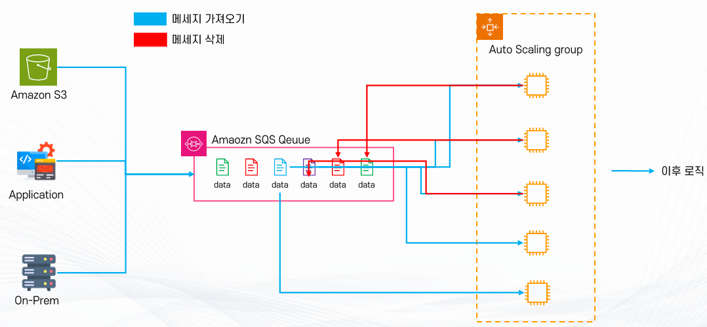

## Amazon SQS 주요 구성 요소

- 메시지 (Message)
  - 메시지는 SQS에서 전달되는 데이터의 가장 작은 단위이다.
  - SQS 안에서 이동하는 데이터 한 묶음
  - Producer가 어떤 정보를 보내면 그 정보는 전부 메시지 형태로 만들어져서 SQS에 저장된다.
  - 메시지 안에는 실제 업무에 필요한 데이터가 들어 있다.
* 예) 주문 시스템일 : 주문번호, 상품번호, 금액, 사용자 ID
* 예) 로그 시스템일 : 접속 시간, IP 주소, 에러 내용
  - 형태는 문자열, JSON, XML 등 다양하지만, 실무에서는 대부분 JSON 형태를 사용한다.
  - 이 메시지는 Consumer가 가져갈 때까지 Queue 안에서 대기 상태로 보관된다.
  - 즉, 바로 처리되지 않고 대기표처럼 줄을 서 있는 구조이다.

- Producer (생산자)
  - Producer는 메시지를 만들어서 SQS로 보내는 주체이다.
  - 쉽게 말하면, 일이 생겼다고 알려주는 역할만 한다.
* 예)  웹 애플리케이션, IoT 기기, 로그 수집 서버
  - 메시지를 보내고 나면 그 이후 처리는 전혀 신경 쓰지 않는다.
( 난 보냈다. 내 역할 끝... <--- 이런 구조이다. 이것을 비동기 구조라고 한다.)
  - Producer는 Consumer가 살아있는지, 처리했는지 모른다. 오직 SQS에만 보낸다.

- Queue (대기열)
  - Queue는 메시지를 임시로 저장하는 공간이다.
  - SQS에서 가장 핵심이 되는 부분이다.
  - Producer가 보낸 메시지는 전부 이 Queue에 저장된다.
  - Queue의 역할은 다음과 같다.
* 메시지 보관
* 순서 관리
* 중복 관리
* 재전송 관리
* 대기 관리
  - 즉, 메시지를 안전하게 쌓아두는 창고 역할이다.
  - Queue에는 두 종류가 있다. (Standard Queue , FIFO Queue)

- Consumer (소비자)
  - Consumer는 Queue에서 메시지를 가져가서 처리하는 주체이다.
  - 즉, 실제 일을 하는 서버이다.
  - 예) 주문 처리 서버, 로그 분석 서버, 메일 발송 서버, 알림 서버 등이 Consumer가 된다.
  - Consumer의 역할은 다음 순서로 진행된다.
1) Queue에서 메시지를 가져온다
2) 메시지 내용을 읽는다
3) 프로그램 로직으로 처리한다
4) DB에 저장하거나 작업 수행
5) 처리 완료 후 메시지 삭제 (삭제까지 해야 완료이다.)
  - 삭제하지 않으면 SQS는 아직 처리 안 된 것으로 판단한다.
그래서 자동 재처리가 가능하다.

- DLQ (Dead Letter Queue)
  - DLQ는 계속 실패하는 메시지를 모아두는 전용 Queue이다.
  - 어떤 메시지가 여러 번 처리에 실패하면 일반 Queue에서 빼서 DLQ로 이동시킨다.
  - 예) 5번 연속 실패 --> DLQ 이동
  - DLQ의 목적
* 에러 원인 분석
* 문제 데이터 확인
* 버그 수정
* 수동 재처리
  - 즉, 문제 있는 메시지 격리소 역할이다.
  - DLQ가 없으면 에러 메시지가 계속 반복 처리되면서 시스템이 불안정해진다.

- 액세스 정책 (Access Policy)
  - Access Policy는 누가 SQS를 사 , EC2만 수신 가능 , 특정 계정만 접근 가능 이런 식으로 제한한다.
  - 이 설정은 IAM 정책 기반으로 관리하며,JSON 형태로 작성한다.
  - Access Policy가 없으면외부에서 마음대로 접근할 수 있기 때문에 반드시 설정해야 한다.
  - 즉, Producer --> Queue --> Consumer 흐름으로 메시지가 전달되고,
실패 메시지는 DLQ로 분리되며, 모든 접근은 액세스 정책으로 제어된다.

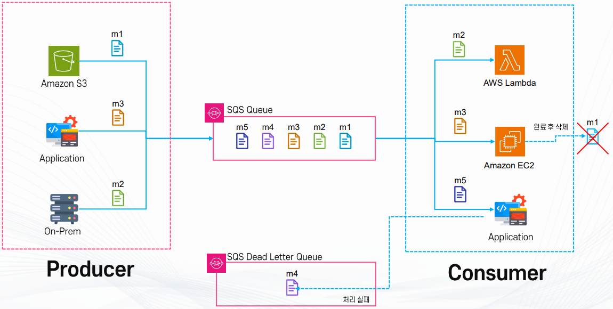

## 단순 S3 + Auto Scaling 구조의 한계

- 동영상 서비스를 Amazon S3에 올려 처리한다고 가정해보자.
- 이때 오토 스케일링 그룹에 속한 EC2 인스턴스들이 새로운 동영상이 업로드되었는지를 계속 확인해야 한다.
- 사용자 --> S3(원본) --> EC2(처리) --> S3(결과물)

- 문제1) 지속적인 체크 필요
  - EC2 인스턴스들이 S3를 계속 모니터링해야 하므로 불필요한 자원 낭비가 발생한다.
  - 영상이 올라오지 않아도 계속 체크를 수행해야 한다.

- 문제2) 중복 처리 가능성
  - 여러 인스턴스가 동시에 같은 파일을 가져오려고 시도할 수 있다.
  - 이로 인해 중복 작업, 충돌, 동기화 문제 등이 생긴다.

- 문제3) 장애 발생 시 로직 중단
  - EC2 인스턴스가 죽으면 작업이 끊기고, 업로드된 영상이 제대로 처리되지 않는다.

- 문제4) 스케일링 기준 불명확
  - 영상 업로드 속도를 미리 알 수 없기 때문에, 어떤 기준으로 Auto Scaling을 해야 할지 애매하다.
  - CPU 사용률이나 시간 기준만으로는 트래픽 폭주 상황을 예측하기 어렵다.

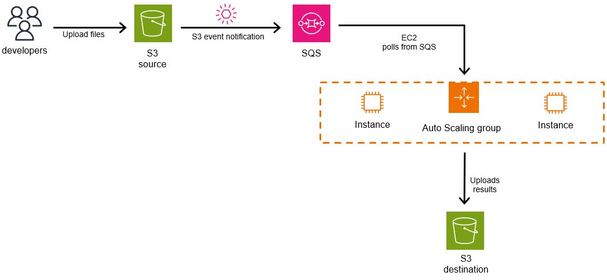

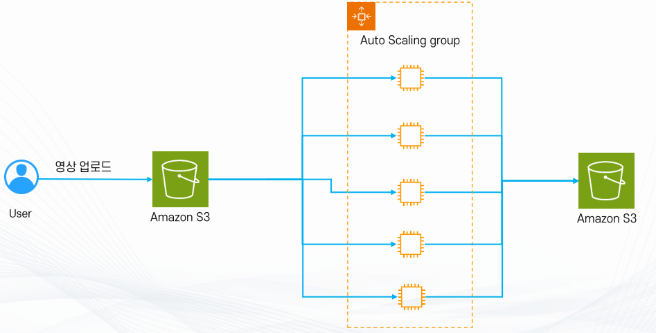

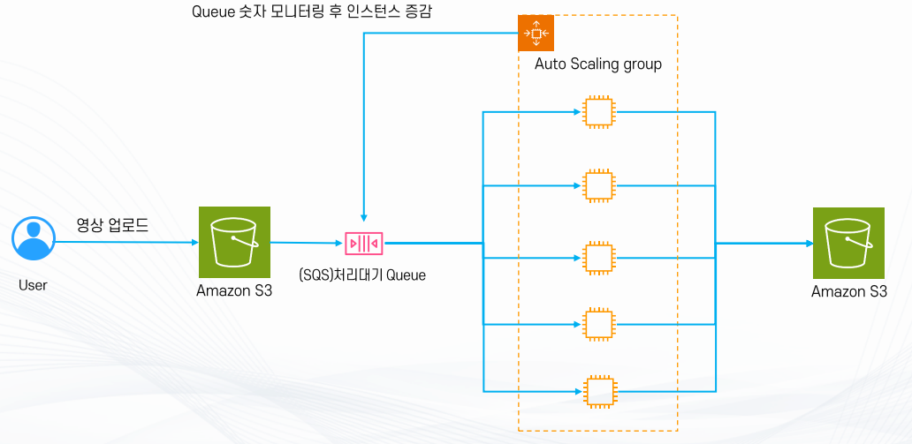

## 문제 해결 방법: SQS(대기열) 활용

- 이러한 문제를 해결하기 위해 Amazon SQS를 중간에 두어 메시지 기반으로 처리한다.
- 사용자가 영상을 업로드하면 Amazon S3에 저장된다.
- S3는 업로드 이벤트를 SQS Queue에 메시지로 전달한다.
- 메시지는 어떤 파일이 업로드되었는지를 알려준다.
- Auto Scaling Group의 EC2 인스턴스들이 Queue를 모니터링하여 메시지를 가져온다.
- 메시지는 처리 완료 후 삭제되며, 정상적으로 삭제된 경우에만 큐에서 제거된다.
- Queue의 메시지 수를 기준으로 Auto Scaling이 동작한다.
- 메시지가 많으면 인스턴스 수를 늘려 빠르게 처리하고, 메시지가 적으면 줄여 비용을 절감한다.
- EC2 인스턴스가 갑자기 죽더라도 메시지는 Queue에 남아 있기 때문에 다른 인스턴스가 이어서 처리할 수 있다.

- 단순히 S3 + Auto Scaling만으로는 확장성과 안정성에 한계가 있다.

- S3 + SQS + Auto Scaling 구조를 사용하면
  - 불필요한 체크 제거, 중복 처리 방지, 안정적인 장애 대응, 메시지 기반 Auto Scaling이 가능하다.
따라서 대규모 동영상 업로드·처리 서비스 같은 경우에는 SQS를 반드시 중간에 두는 구조가 가장 적합하다.

## Amazon SQS Queue의 타입

1. Standard Queue

- 특징
  - 무제한 처리량 지원 (높은 처리 성능)
  - 순서를 보장하지 않음
  - 메시지를 중복해서 전달할 수 있음 (At Least Once Delivery)

- 장점
  - 대규모 트래픽 처리에 적합
  - 빠른 전송과 확장성 보장

- 주의사항
  - 동일한 메시지가 여러 번 전달될 수 있으므로, 애플리케이션 레벨에서 멱등성(Idempotency)을 반드시 보장해야 한다.

```
2. FIFO Queue (First-In-First-Out Queue)
```

- 특징
  - 메시지 순서를 보장 (먼저 들어온 메시지가 먼저 처리됨)
  - 메시지를 단 한 번만 전달 (Exactly Once Processing)
  - 성능은 Standard Queue에 비해 제한됨 (초당 처리량 제한 존재)

- 장점
  - 순서가 중요한 애플리케이션에 적합 (예: 결제, 예약, 금융 트랜잭션)
  - 중복 메시지가 발생하지 않아 멱등성 고려가 줄어듦

- 주의사항
  - 성능이 제한적이므로 고성능 처리가 필요한 경우에는 적합하지 않을 수 있음

## 멱등성(Idempotency)

- 같은 요청이 여러 번 실행되더라도 최종 결과가 동일하게 유지되는 성질

- 필요성
  - Standard Queue에서는 메시지가 여러 번 전달될 수 있기 때문에 필수
  - FIFO Queue는 중복 방지가 내장되어 있지만, 안정성을 위해 멱등성을 구현하는 것이 권장됨

- 예시
  - 버스 표 구매: 같은 좌석을 여러 번 결제 시도하더라도 실제 결제는 한 번만 일어나야 한다.
  - 파일 업로드: 같은 파일이 여러 번 업로드 요청되더라도 최종적으로는 한 번만 저장되어야 한다.

요약 비교
구분Standard QueueFIFO Queue
순서 보장XO
중복 메시지발생 가능 (At Least Once)없음 (Exactly Once)
처리량무제한 (높음)제한적 (낮음)
멱등성 필요성반드시 필요상대적으로 덜 필요하지만 권장
적합한 사용 사례대규모 로그 처리, 알림 전송결제, 예약, 주문 시스템

- 속도, 장성이 중요하면 Standard, 정확한 순서·중복 방지 보장이 필요하면 FIFO를 선택

## Amazon SQS 메시지

- 메시지(Message)는 SQS에서 전달되는 데이터의 단위이다.
- 예시: 주문번호 1234 처리 요청, 영상 파일 A 업로드 완료 등
- 메시지를 통해 Producer와 Consumer가 직접 연결되지 않고, 비동기적으로 통신할 수 있다.

## 메시지 크기와 보관

- 최대 크기: 1MiB (Mebibyte : 1024 × 1024 = 1,048,576 Byte , 1MB = 1,000,000 Byte)
- 저장 기간: 최대 14일(기본값은 4일)
- 크기가 더 큰 데이터를 전송할 경우에는 S3와 연동 후 SQS에는 메타데이터만 저장하는 방식 사용

## 메시지의 세 가지 상태

- Stored (저장됨)
  - Producer가 메시지를 SQS Queue에 성공적으로 전달한 상태
  - Queue에 대기 중이며 아직 Consumer가 가져가지 않은 상태
  - 특징:
*최대 건수 제한 없음  (무한히 메시지를 쌓아둘 수 있음)
*메시지는 지정한 보관 기간(최대 14일) 동안 유지

- In Flight (처리 중)
  - Consumer가 Queue에서 메시지를 가져가서 처리 중인 상태
  - 이때 메시지는 다른 Consumer에게 보이지 않으며, Visibility Timeout 기간 동안 숨겨짐
  - Visibility Timeout 내에 메시지를 삭제하지 않으면 다시 Queue로 돌아와 다른 Consumer가 처리할 수 있다
(중복 방지 + 안정성 확보)
  - 동시 In Flight 메시지 최대 개수:
*Standard Queue: 약 120,000개
*FIFO Queue: 약 20,000개

- Deleted (삭제됨)
  - Consumer가 메시지를 성공적으로 처리하고, 삭제 요청(DeleteMessage)을 보낸 상태
  - Queue에서 완전히 제거되어 더 이상 다른 Consumer가 접근할 수 없음

## 메시지 상태 전환 흐름

- Producer  --> Queue에 메시지 저장 (Stored)
- Consumer --> 메시지를 가져와 처리 시작 (In Flight)
- Consumer --> 처리 완료 후 삭제 요청 (Deleted)

## 설계 시 고려사항

- 중복 가능성: Standard Queue에서는 같은 메시지가 두 번 전달될 수 있으므로 멱등성 보장이 필요하다.
- Visibility Timeout 조정: 처리 시간이 긴 작업일수록 Visibility Timeout을 충분히 길게 설정해야 한다.
- DLQ(Dead Letter Queue) 활용: 여러 번 실패하는 메시지는 DLQ로 보내 추후 분석 가능.

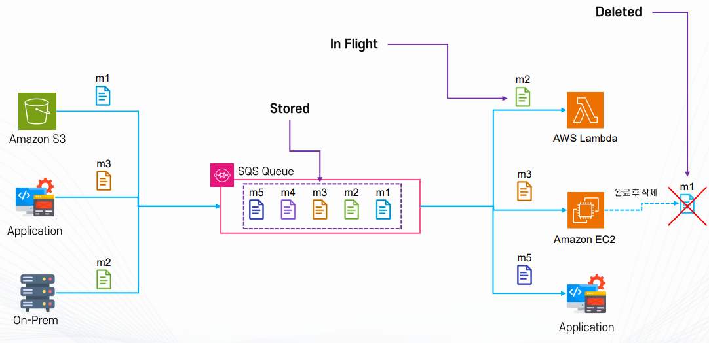

## Amazon SQS 메시지 구성

1. Message Body (메시지 본문)
- 실제 메시지의 데이터(String)
- 최대 크기: 1MiB (Message Attribute 포함)
- 큰 콘텐츠의 경우: S3 버킷/키 정보만 저장 후 전달 가능
  - 예: 동영상 파일을 직접 SQS에 담지 않고, S3에 저장 후 SQS 메시지에는 해당 파일의 경로(URL 또는 키)만 포함

```
2. Message Attribute (메시지 속성)
```

- Key-Value 형식의 메타데이터 (Message Body에는 포함되지 않음)
- 주 용도:
  - 메시지의 분류, 필터링, 컨텍스트(Context) 제공
  - 예: Attribute에 영상 처리 알고리즘 명시 또는 분류를 위한 Tag 정의
  - 최대 10개까지 추가 가능

```
3. Message System Attribute (시스템 속성)
```

- AWS 서비스 내부에서 사용하는 시스템 메타데이터
- 현재는 AWS X-Ray 분산 추적을 위한 AWSTraceHeader만 지원

4. ReceiptHandle
- 메시지를 삭제하기 위해 사용하는 고유 키
- 메시지를 큐에서 삭제하려면 반드시 ReceiptHandle이 필요

5. 기타 정보
- 메시지에 자동 포함되는 추가 정보
- Region (메시지가 생성된 AWS 리전)
- Event Source (메시지를 생성한 소스)
- MD5 (메시지 본문 무결성 검증 해시값)
- Timestamp (메시지 생성 시간)
- 해시 값 등 기타 메타데이터

6. FIFO Queue 전용 속성
- Message Group ID
  - 메시지를 그룹 단위로 처리할 수 있게 하는 식별자
  - 같은 그룹 ID를 가진 메시지는 순차적으로 처리됨
- Deduplication ID
  - 중복 메시지를 구분하기 위한 ID
  - 동일한 Deduplication ID를 가진 메시지는 중복으로 간주되어 5분 이내 재전송 시 큐에 추가되지 않음

- 정리
  - Message Body는 실제 데이터,
  - Message Attribute는 메시지에 부가적인 설명(메타데이터),
  - System Attribute는 AWS 내부 서비스용,
  - ReceiptHandle은 삭제용 키, 그 외에 Region, Event Source, MD5, Timestamp 같은 정보가 포함되며,
FIFO 큐의 경우 메시지 순서 및 중복 제어를 위한 별도 속성이 추가되는 구조

## Amazon SQS Producer (메시지 생산자)

1) 메시지 전송 방식
- Producer(생산자)는 API를 통해 메시지를 Push 할 수 있다.

- 메시지를 전송하려면 반드시 Queue URL을 알아야 한다.
  - Producer가 올바른 SQS Queue를 판별하여 메시지를 보낼 수 있도록 식별자 역할을 수행

- Queue URL은 리전(region), 계정 ID(account-id), 큐 이름(queue-name)으로 구성
  - 기본 형식 : https://sqs.<region>.amazonaws.com/<account-id>/<queue-name>
  - Region : 큐가 속한 AWS 리전
  - Account ID: 해당 큐를 소유한 AWS 계정
  - Queue Name: 생성한 큐의 고유 이름
  - 예시 : https://sqs.us-east-1.amazonaws.com/123456789012/MyQueue

2) 권한 관리
- 메시지를 전송하려면 IAM 권한이 필요함
- 필요한 권한: sqs:SendMessage
  - IAM 사용자/역할에 직접 권한을 부여하거나 리소스 기반 정책(Resource Policy)을 이용하여
특정 Queue에 대한 접근 권한 부여 가능
- 권한이 없으면 메시지 전송이 실패

3) AWS 서비스와의 연동
- SQS는 다양한 AWS 서비스와 이벤트 기반으로 연동 가능
- 연동 방식
  - 직접 연동: S3, SNS, Lambda 등 일부 서비스는 SQS와 바로 연결 가능
  - EventBridge 연동: EventBridge를 통해 더 정교한 이벤트 라우팅 및 조건 처리 가능

- 예시:
  - S3  -->  SQS (파일 업로드 이벤트 전송)
  - CloudWatch Alarm  -->  SQS (알람 발생 시 메시지 생성)
  - EventBridge  -->  SQS (특정 조건의 이벤트만 전달)

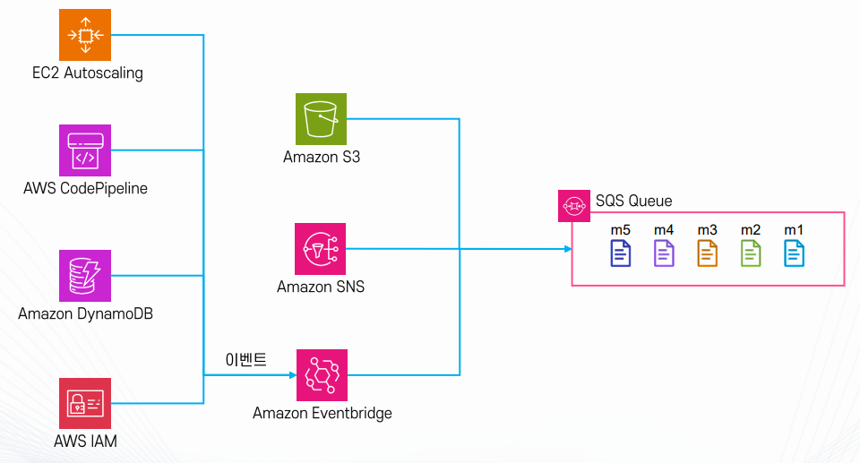

## Amazon SQS Consumer (메시지 소비자)

- 메시지 받기와 권한
  - Consumer(소비자)는 큐에서 메시지를 가져와 처리하는 역할
  - 주기적으로 Poll 요청(API 호출)으로 큐에 메시지가 있는지 확인
  - 메시지를 받거나 삭제하려면 권한이 필요
*sqs:ReceiveMessage: 메시지 받기
*sqs:DeleteMessage: 메시지 삭제

- 기본 동작 흐름 (workflow)
  - Poll --> 처리 --> 삭제
*Poll : 메시지를 큐에서 가져옴
*처리 : 비즈니스 로직에 따라 메시지를 처리
*삭제 : 처리가 끝나면 큐에서 메시지를 삭제

- Visibility Timeout (가시성 제한 시간)
  - 메시지를 가져오면 일정 시간 동안은 다른 Consumer가 그 메시지를 보지 못한다.
  - 이 시간을 Visibility Timeout이라고 한다.
  - Consumer가 이 시간 안에 메시지를 처리하고 삭제해야 한다.
  - 만약
* 삭제하지 않으면 --> 시간이 지나 다시 큐에 나타나고, 다른 Consumer가 가져갈 수 있다.
* 시간이 부족하면 --> Visibility Timeout을 늘려서 추가 처리 시간을 확보 가능

- 정리
  - Consumer는 권한을 가진 상태에서 큐를 Poll해서 메시지를 가져온다.
  - 메시지를 처리한 후 삭제해야 큐에서 완전히 사라진다.
  - Visibility Timeout 안에 삭제하지 않으면 메시지가 다시 큐로 돌아가 다른 Consumer에게 전달된다.

## Visibility Timeout (가시성 제한 시간)

- 메시지를 한 Consumer가 가져간 뒤, 다른 Consumer가 그 메시지를 가져갈 수 없도록 막는 시간
- 일종의 잠금(Lock) 역할
- 해당 시간 동안에는 다른 Consumer가 같은 메시지를 요청할 수 없음
- 즉, 메시지를 처리할 충분한 시간을 보장하기 위해 설정하는 값임

- 시간 범위
  - 기본값 : 30초
  - 최소값 : 0초
  - 최대값 : 12시간
  - 작업의 특성(빠른 처리 vs 오래 걸리는 처리)에 맞게 적절히 조정해야 함

- 처리 흐름

## Consumer가 메시지를 가져옴 --> 메시지는 Visibility Timeout 상태가 됨

## 이 시간 안에 메시지를 처리 후 삭제해야 함

## 만약 처리중 문제가 생겨 삭제되지않으면 시간이 지나면서 메시지가 다시큐에 나타난다. (다른Consumer가 가져갈 수 있음)

- 활용과 주의사항
  - Visibility Timeout은 큐 단위 또는 메시지 단위로 설정 가능
  - 필요할 때 Consumer가 메시지를 처리하는 도중에 Visibility Timeout 연장도 가능
  - 설정 시간이 너무 짧으면 --> 아직 처리 중인 메시지가 다시 큐에 나타나 중복 처리될 수 있음
  - 설정 시간이 너무 길면 --> 실패한 메시지가 다른 Consumer에게 전달되기까지 불필요하게 오래 걸림

- 예시 상황
  - 간단한 로그 처리 --> 10초 내 끝나므로 Visibility Timeout을 30초로 설정해도 충분
  - 동영상 인코딩 같은 작업 -> 수 분 이상 걸릴 수 있어 Visibility Timeout을 몇 분 단위로 늘려야 중복 처리를 막을 수 있음

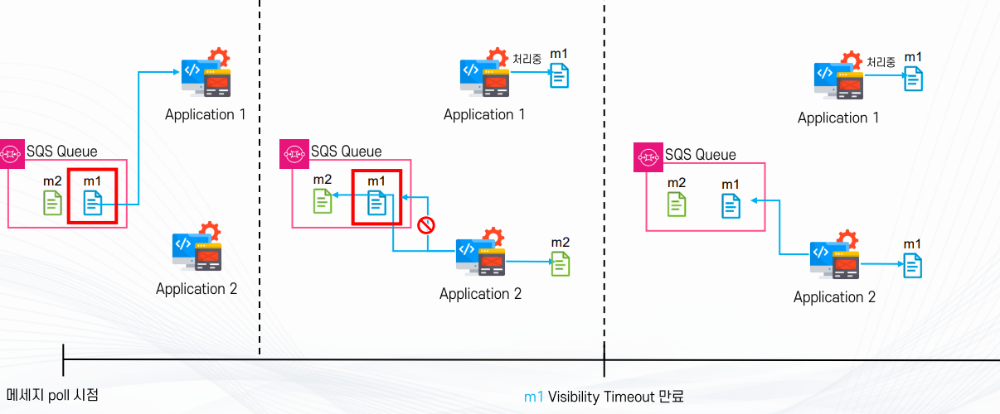

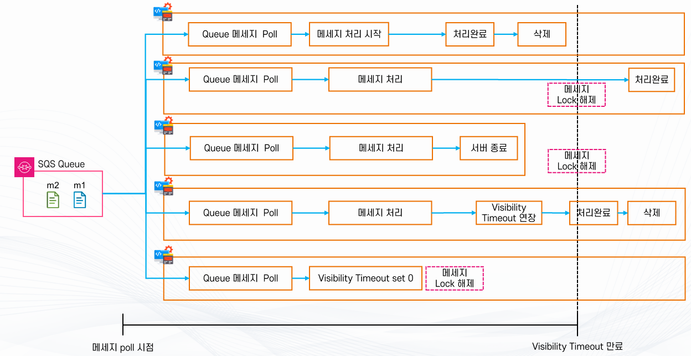

## Amazon SQS Polling 방식

- SQS는 메시지를 자동으로 안 보내준다.
- 항상 서버가 먼저 할 일이 있늕 확인하는데 이것을 Polling이라고 한다.

- Amazon SQS는 내부적으로 여러 대의 서버에 메시지를 분산 저장하는 구조이다.
즉, 하나의 큐처럼 보이지만 실제로는 여러 서버(A, B, C, D …)에 나뉘어 저장된다.

- 이 구조 때문에 Polling 방식이 필요하고, Short / Long 차이가 생긴다.

## Short Polling (기본 방식)

- Short Polling은 바로 확인하고 바로 돌아오는 방식이다. (기다리지 않는다.)

- 동작 방식
  - SQS는 내부 서버 중 일부만 확인한다.
  - A 서버 확인 --> 없음
* 없음을 바로 응답한다.
  - B 서버 확인 --> 없음 --> 없음
  - C 서버 확인 --> 있음 --> 받음

- 특징
  - 일부 서버만 조회한다.
  - 대기 시간 없다.
  - 응답이 빠르지만 요청 횟수 많다.
  - 비용 증가
  - 메시지 놓칠 수 있음

- 문제점
  - 메시지가 있어도 내가 본 서버에 없으면 못 가져온다.
그래서 계속 재요청해야 한다.

- 특수한 경우 아니면 거의 사용하지 않는다.

## Long Polling

- Long Polling은 처리 서버가 SQS에 메시지를 요청한 뒤, 바로 응답을 받지 않고 일정 시간 동안 기다리는 방식이다.
- SQS에 메시지가 없으면 바로 없음 이라고 응답하지 않고, 최대 20초까지 대기 상태를 유지한다.

- Long Polling은 서버를 돌아다니는 구조가 아니라 요청을 걸어두고, 메시지가 생성될때까지 대기한다.
AWS 내부 시스템이 메시지 들어오면 알려 깨워준다. (이벤트 기반)

- 동작 방식
1) 처리 서버(EC2, Lambda 등)가 SQS에 요청한다.
2) SQS는 바로 응답하지 않고 요청을 대기 상태로 둔다.
3) 대기 중에 새로운 메시지가 들어오면, 즉시 해당 메시지를 서버에게 전달한다.
4) 만약 최대 대기 시간(최대 20초) 동안 메시지가 들어오지 않으면, 없음으로 응답하고 연결을 종료한다.

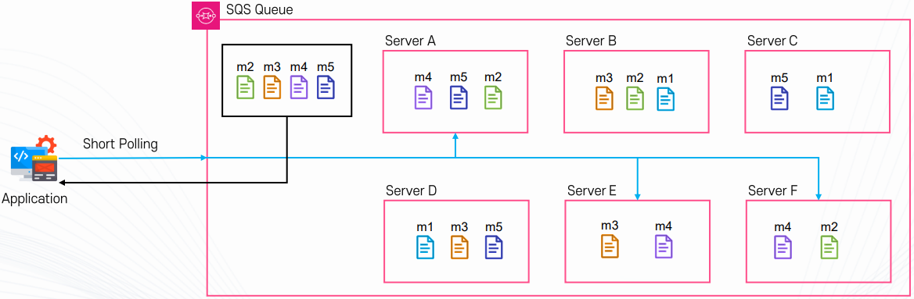

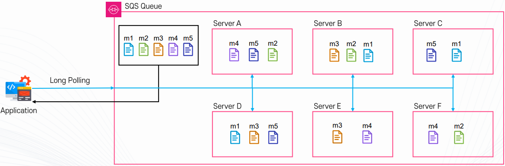
