# AWS 디커플링 서비스 (SNS) - 강의 노트

AWS 강의 노트(HWP) 원본을 이미지와 설정 코드, 주석까지 그대로 옮긴 문서다. 정리본은 이론·가이드 문서를 함께 본다.

## Amazon SNS (Simple Notification Service) 소개

## Amazon SNS

- Amazon SNS는 완전관리형 메시징 서비스로 애플리케이션 간(A2A) 또는 애플리케이션과 사용자간(A2P)의 메시징을 지원
- 발행-구독(Pub/Sub) 기반 구조를 사용하여 하나의 메시지를 여러 서비스나 구독자에게 동시에 전달(Fan Out) 및 처리

- 주요 특징
  - 여러 서비스에 메시지를 전달 (Fan Out)
*한 번 발행한 메시지가 여러 서비스(SQS, Lambda, HTTP/HTTPS 엔드포인트, 이메일, SMS 등)로 동시에 전달
  - PUSH 방식 전달
*소비자가 직접 가져가는(Pull) 방식이 아니라, 구독한 서비스로 메시지를 직접 밀어넣는 방식(Push)
  - 메시지 보관 불가
*메시지를 저장하지 않고 바로 전달하기 때문에 저장/재처리 목적이라면 SQS를 함께 활용해야 한다.
  - FIFO 지원
*메시지 순서를 보장해야 할 경우 FIFO 주제(토픽)를 사용하여 메시지 리플레이(재전송)도 가능하다.

- 사용 사례
  - 하나의 이벤트를 여러 서비스가 동시에 처리해야 할 때
(예: 이미지 업로드 시, Lambda로 썸네일 생성 + SQS로 로그 적재 + 이메일 알림 전송)
  - 서로 다른 서비스 간 메시지를 빠르게 전달해야 할 때
  - 임시 메시지를 여러 시스템에서 동시에 받아야 할 때

## SNS vs SQS 비교

```
=====================================================================================================
구분|SNS| SQS
=====================================================================================================
목적| 여러 서비스에 메시지를 동시에 전달 (Fan Out)| 특정 작업을 다음 서비스로 안전하게 넘겨 처리
```

- ----------------------------------------------------------------------------------------------------
메시지 처리 횟수| 하나의 메시지를 여러 서비스에서 처리| 하나의 메시지는 한 번만 처리
- ----------------------------------------------------------------------------------------------------
메시지 보관| 불가| 최대 14일 보관 가능
- ----------------------------------------------------------------------------------------------------
전달 방식| PUSH (즉시 전달)| PULL (소비자가 가져감)
- ----------------------------------------------------------------------------------------------------
아키텍처 활용| Fan Out| 디커플링 (생산자-소비자 분리)

```
=====================================================================================================
```

- 아키텍처 활용 예시
  - SNS 단독 활용
*알림(Notification) 성격이 강한 경우 사용 (예: 회원가입 시 이메일 + SMS 동시 발송)
  - SQS 단독 활용
*안정적인 작업 큐로, 백엔드 작업 처리 파이프라인에 사용 (예: 이미지 처리, 로그 처리, 대용량 데이터 적재)
  - SNS + SQS 혼합
*SNS를 통해 여러 SQS 큐로 메시지를 전달 --> 각각의 큐를 다른 서비스가 처리 (대규모 분산 처리 가능)
*예: 주문 발생 --> SNS 주제(토픽) 발행 --> SQS(재고 처리), SQS(배송 처리), SQS(결제 처리) 분리

## 긴밀한 결합

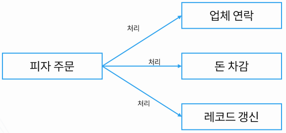

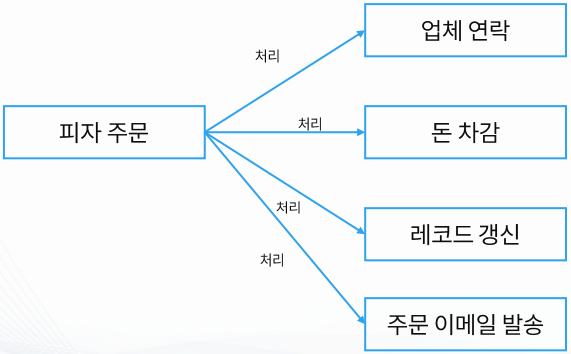

- 주문이 들어오면 주문 서비스가 직접 각각의 작업을 처리해야 함
- 예를 들어, 주문 서비스가 직접 업체에 연락하고, 직접 돈을 차감하고, 직접 레코드를 갱신하고, 직접 이메일까지 발송함
- 이렇게 되면 주문 서비스가 모든 일을 알고 있어야 해서 복잡하고 유지보수가 어려움
- 새로운 기능이 추가되면 주문 서비스 코드를 매번 수정해야 함

## 느슨한 결합 (Decoupling)

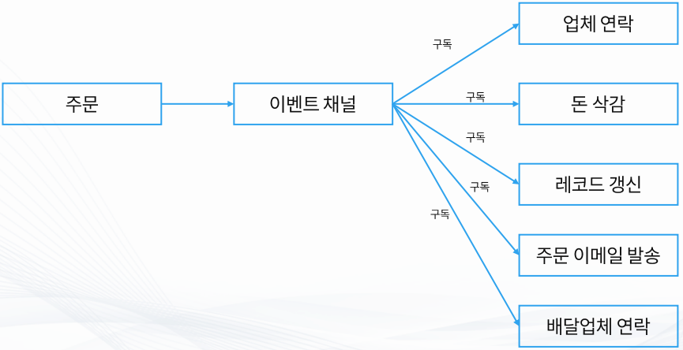

- 주문이 들어오면 주문 서비스는 단순히 이벤트 채널(SNS 같은 것) 에 주문이 발생했다고 알려줌
- 이후 각 작업(업체 연락, 돈 차감, 레코드 갱신, 이메일 발송, 배달업체 연락 등)은 이벤트 채널을 구독해서 스스로 처리
- 주문 서비스는 누가 그 일을 하는지 알 필요가 없다.
- 새로운 기능이 필요하면 이벤트 채널에 새로운 구독자를 붙이기만 하면 된다. (문 서비스는 수정할 필요 없음)
- 이렇게 하면 서비스 간 연결이 느슨해지고 확장과 유지보수가 쉬워짐

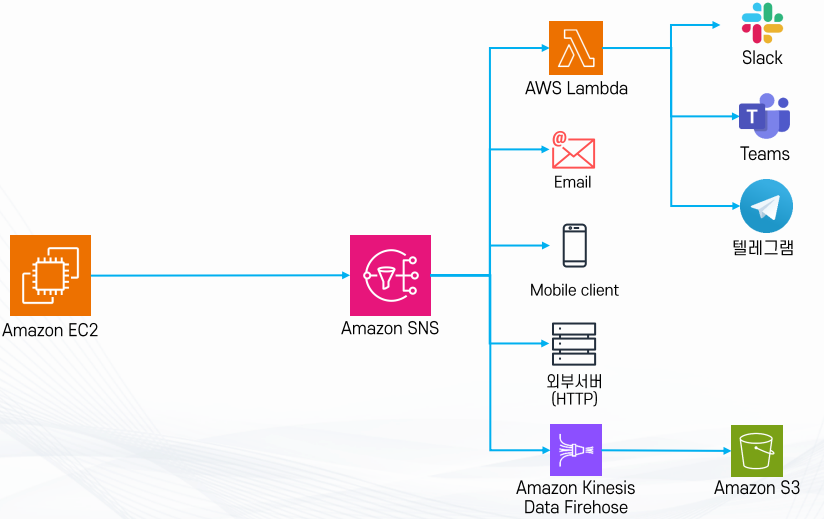

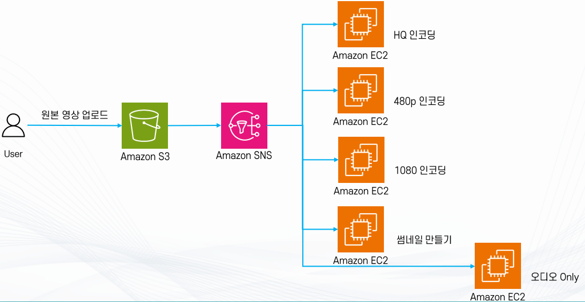

## Amazon SNS의 주요 구성 요소

- 주제 (Topic)
  - SNS에서 메시지를 주고받는 커뮤니케이션 채널
  - 메시지를 전달하려면 먼저 주제(토픽)를 만들어야 함
  - 예: OrderTopic이라는 주제(토픽)를 만들면 주문 관련 알림은 모두 이 주제(토픽)를 통해 전달

- 구독 (Subscription)
  - 특정 주제(토픽)를 구독하면 그 주제(토픽)에 올라오는 메시지를 받아볼 수 있음
  - 구독할 수 있는 대상: 이메일, SMS, SQS 큐, Lambda, HTTP/HTTPS 엔드포인트 등
  - 예: OrderTopic을 이메일로 구독하면 주문이 발생할 때마다 이메일로 알림이 온다.

- 퍼블리셔 (Publisher)
  - 메시지를 만들어서 SNS 주제(토픽)에 발행하는 주체
  - 애플리케이션, 서버, 다른 서비스 등이 퍼블리셔가 될 수 있음
  - 예: 주문 서비스가 주문 발생 이벤트를 OrderTopic에 발행

- 구독자 (Subscriber)
  - 실제 메시지를 받아서 처리하는 주체
  - 구독해둔 방식에 따라 이메일을 받거나, Lambda 함수가 실행되거나, SQS 큐에 메시지가 들어간다.
  - 예: 결제 서비스가 OrderTopic을 구독하고 있으면 주문 메시지를 받아 돈 차감을 처리

- 메시지 (Message)
  - SNS를 통해 전달되는 실제 데이터
  - 텍스트, JSON 형식 데이터 등 다양한 형태 가능
  - 예: { "orderId": 123, "status": "NEW" }

- 액세스 정책 (Access Policy)
  - 누가 주제(토픽)에 접근할 수 있는지 정하는 권한 정책
  - 메시지를 발행하거나 구독할 수 있는 주체를 제한하거나 허용할 수 있음
  - 예: 특정 IAM 역할만 OrderTopic에 발행 가능하도록 설정

- 정리
  - Publisher는 메시지를 만들고 Topic에 보낸다.
  - Subscriber는 Subscription을 통해 Topic을 구독하고 메시지를 받는다.
  - Message는 실제 데이터이고, Access Policy는 보안 규칙

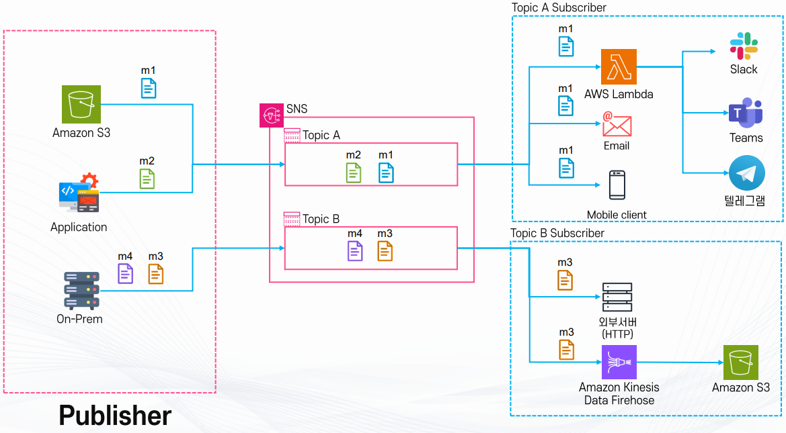

## Amazon SNS Topic / Subscription

- 주제 (Topic)
  - SNS의 메시지 전달 채널 역할
  - 퍼블리셔(Publisher)가 메시지를 주제(토픽)에 발행(Publish)하면,
해당 주제(토픽)를 구독(Subscribe)한 모든 구독자에게 동시에 메시지가 전달된다.
  - 이 방식은 Fan Out이라고 부르며, 하나의 이벤트가 여러 곳으로 확산되는 구조
  - 예: 주문 발생 --> OrderTopic --> 이메일 알림 + 결제 서비스 + 배송 시스템에 동시에 메시지 전달

- 구독 프로토콜 (Subscription Protocols)

## SNS 주제(토픽)에 구독할 수 있는 방식은 다양하다.

## 이메일 (E-mail): 메일로 알림 받기

## HTTP(S) : 특정 API 엔드포인트에 전달

## SQS : 큐에 메시지 저장 후 나중에 처리

## SMS : 문자메시지 전송

## Lambda : 이벤트를 받아 바로 코드 실행

## Kinesis Data Firehose: 데이터 스트림으로 전달

- 즉, SNS는 단순 알림 서비스가 아니라, 다양한 서비스와 연결할 수 있는 메시지 허브 역할을 함

- 최초 구독 확인 (Subscription Confirmation)
  - 구독을 신청하면 반드시 최초 확인 과정이 필요함
  - 이메일 구독의 경우: 확인 메일을 클릭해야 최종 구독 완료
  - Lambda 구독의 경우: 확인 이벤트가 발송되고 이를 승인해야 한다.
  - 이 과정을 통해 원하지 않는 구독을 방지하고 보안을 강화함

## Amazon SNS 메시지 구성 (Standard)

- Message Body (메시지 본문)
  - 일반적으로 제목, 내용 같은 기본 데이터가 들어감
  - 실제 메시지 내용이 들어가는 부분 (문자열 형태)
  - 최대 크기 : 256KiB (Message Attribute 포함)
  - 크기가 큰 데이터는 직접 넣지 않고 S3에 저장 후, 버킷/키 정보만 메시지에 담아 전달
  - Raw Message Delivery 옵션
*기본적으로 SNS는 자체 포맷(JSON 래핑)으로 메시지를 감싸 전달
*Raw Message Delivery를 켜면 감싸지 않고 메시지 원문 그대로 전달
*주로 S3 로그 전송, SQS에서 메시지를 원문 그대로 처리해야 하는 경우에 활용
  - 예:

```
   *일반 전달:  { "Type":"Notification", "Message":"{...}" }
   *Raw 전달:  "{...}" (원문만 전달)
```

- Message Attribute (메시지 속성)
  - Key-Value 형식 메타데이터
  - 메시지 본문에는 포함되지 않지만 메시지에 추가할 수 있는 부가 정보
  - 용도

```
   *분류(Classification)
   *필터링(Filtering)
   *Body 처리에 필요한 Context 제공
 # 예:
   *Attribute에 {"Algorithm":"VideoAI", "Tag":"Sports"} 같이 넣으면 구독자가 메시지를 받을 때 분류 기준으로 활용가능
   *Raw Message Delivery가 활성화된 경우에도 속성은 별도 전달 가능
   *최대 10개까지 정의 가능
```

- TTL (Time to Live, 모바일 전용)
  - 메시지를 얼마나 오래 저장할지에 대한 시간 제한
  - 주로 모바일 Push 알림(Firebase, APNS 등)에서 사용
  - TTL이 지나면 메시지는 더 이상 전달되지 않는다.

- 기타 포함 정보
  - Timestamp: 메시지가 생성된 시각
  - 주제(토픽) ARN: 메시지가 발행된 SNS 주제(토픽)의 Amazon Resource Name
  - 시그니처(Signature): 메시지 위·변조 여부를 확인하기 위한 검증 값
  - 구독 해제 URL: 이메일 등에서 구독자가 직접 구독을 취소할 수 있는 링크

## Amazon SNS 메시지 필터링

- 필터링의 필요성
  - 기본적으로 SNS 주제(토픽)에 메시지를 발행하면, 구독한 모든 Subscriber가 메시지를 다 받음
  - 하지만 어떤 구독자는 특정 조건에 맞는 메시지만 받고 싶을 수 있음
  - 이럴 때 메시지 필터링 기능을 활용하면 원하는 메시지만 골라 받을 수 있음

- 구독 필터 정책 (Subscription Filter Policy)
  - 구독자 단위로 필터 정책(Filter Policy)을 설정할 수 있음
  - 정책에서 지정한 조건에 맞는 메시지만 전달되고, 조건에 맞지 않으면 전달되지 않음
  - 즉, 구독자가 필요 없는 메시지를 받지 않도록 걸러주는 장치

예:

```json
{
  "type": ["Express"],
  "country": ["US", "EU"],
  "price": [{ "numeric": [">=", 20] }]
}
```

- "타입이 Express이고, 국가가 미국 또는 유럽이며, 가격이 20 이상인 메시지만 받는다"

- 필터링 대상
  - Message Body: 메시지 본문 안의 데이터
  - Message Attributes: 메시지와 함께 전달되는 추가 속성 (Key-Value 데이터)

- 동작 방식
  - 메시지 발행 시, SNS가 메시지를 각 구독자의 Filter Policy와 비교
  - 조건과 일치하면 메시지를 전달
  - 조건과 일치하지 않으면 메시지를 버림

- 활용 예시
  - 쇼핑몰 알림 시스템
  - 유럽/미국 사용자에게만 특정 세일 알림 발송
  - Express 배송 옵션을 선택한 주문만 물류팀으로 전달

- 다국어 서비스

## 한국어 사용자 : 한국어 알림만

## 영어 사용자 : 영어 알림만

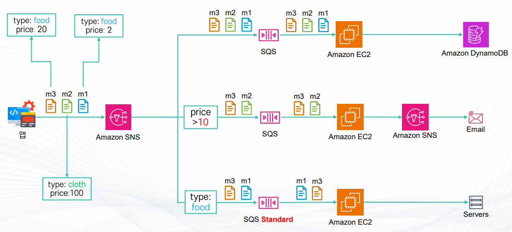

## Amazon SQS/SNS FIFO

- Standard Queue의 한계
  - 순서 보장 없음 : 기본 SQS(Standard)는 메시지가 들어온 순서대로 소비자에게 전달되지 않을 수 있음
  - 중복 발생 가능 : 메시지가 여러 번 전달될 가능성이 있음 (At-Least-Once 전달 보장 특성 때문)

- FIFO Queue의 특징
  - 순서 보장: 메시지가 들어온 순서를 그대로 보존하여 한 번만 전달
  - 중복 제거: 동일한 메시지를 여러 번 소비하지 않도록 보장
  - 추가 기능:
*메시지 그룹(Message Group) 기능 제공 (같은 그룹 내 메시지는 순서대로 처리)
*중복 제거 ID(Deduplication ID)로 동일 메시지 반복 전송 방지

## 성능 제약

- 처리량 제한
  - 기본 FIFO 큐: 초당 약 300 트랜잭션 요청 (300TPS)
  - Standard 큐: 사실상 무제한 트랜잭션 처리 가능
  - TPS(Transactions Per Second) : 초당 처리할 수 있는 트랙잭션 수

- High Throughput 모드 지원
  - 활성화 시 성능이 향상되지만 리전별로 상한치가 다름

- 리전별 최대 처리량 (High Throughput 모드)
  - 미국 동부(버지니아 북부, us-east-1): 최대 70,000 TPS
  - 아시아 태평양(도쿄, ap-northeast-1): 최대 9,000 TPS
  - 아시아 태평양(서울, ap-northeast-2): 최대 2,400 TPS

- 네이밍 규칙
  - FIFO 큐는 이름 끝에 반드시 ".fifo"를 붙여야 한다.
  - 예시: my-order.fifo

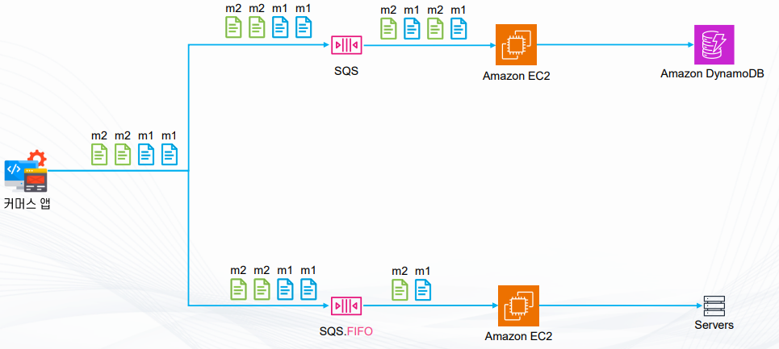

- 일반 SQS (Standard Queue)
  - 메시지(m1, m2)가 순서 보장 없이 큐에 들어감
  - Amazon EC2 인스턴스가 메시지를 받아 처리
  - 처리된 데이터는 Amazon DynamoDB에 저장

- SQS FIFO (First In First Out Queue)
  - 메시지(m1, m2)가 들어온 순서 그대로 큐에 저장
  - Amazon EC2 인스턴스가 메시지를 순서대로 처리
  - 처리 결과는 Servers(내부 서버/백엔드 시스템)로 전달

## SQS FIFO – Deduplication ID (중복 제거 ID)

- Deduplication ID
  - SQS FIFO 큐에서 메시지가 중복으로 들어오는 것을 방지하기 위한 고유 토큰
  - 메시지를 큐에 보낼 때 프로듀서가 이 값을 붙여주면,
SQS는 일정 시간(기본 5분) 동안 같은 Deduplication ID가 있으면 메시지를 무시하고 큐에 넣지 않는다.

- 동작 방식
  - 동일한 Deduplication ID로 5분 안에 다시 메시지를 보내면 메시지는 성공으로 응답하지만 실제 큐에는 저장되지 않음
  - 즉, 응답은 OK로 오지만 큐에는 새로 추가되지 않는 것
  - 이미 전달된 메시지는 계속 로그로 추적 가능

- Deduplication ID는 두 가지 방식으로 제공 가능
  - Amazon SQS에서 메시지를 보낼 때 Body와 Attribute로 구성된다.
  - Body: 메시지의 실제 데이터
  - Attribute: 부가적인 메타데이터(속성)
  - 1) Content-based
*메시지 본문(Body)의 내용을 자동으로 SHA-256 해시 처리해서 Deduplication ID로 사용
*이 경우 메시지의 속성(Attribute)은 해시에 포함되지 않음
*즉, 메시지 본문이 같으면 동일한 Deduplication ID가 생성되어 중복으로 인식됨
  - 2) Explicit (명시적 지정)
*메시지를 보내는 프로듀서가 직접 Deduplication ID를 생성해서 함께 전달
*예: Timestamp, Order ID, Transaction ID 등 고유한 값을 지정

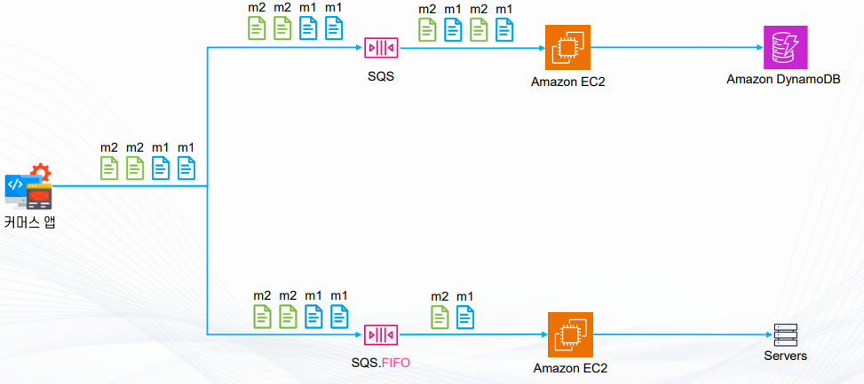

- Standard SQS 경로
  - 커머스 앱에서 m1, m2 메시지를 보냄
  - Standard SQS는 중복 방지 기능이 없음 (동일 메시지가 여러 번 들어가거나 순서가 뒤섞일 수 있음)
  - Amazon EC2가 메시지를 읽어 DynamoDB에 저장할 때, 중복된 m1이 여러 번 처리될 수 있음
  - 이 경우 중복 레코드가 DynamoDB에 쌓일 위험이 있음

- FIFO SQS 경로
  - 커머스 앱에서 동일한 메시지(m1, m2)를 보냄
  - FIFO 큐는 Deduplication ID를 이용해 중복 메시지 처리 여부를 결정함

## SQS/SNS FIFO – Message Group ID

- Message Group ID
  - SNS/SQS FIFO(First-In-First-Out) 큐 내부에서 순서를 보장하는 작은 그룹(채널)
  - 같은 Message Group ID를 가진 메시지는 반드시 순서대로 처리된다.

- 순서 보장의 범위
  - Message Group ID 단위로만 순서 보장이 이루어짐
  - 즉, 다른 Message Group ID 사이에서는 순서 보장이 되지 않음
  - 여러 그룹이 있을 경우, 그룹마다 독립적으로 순서가 유지된다.

- SQS FIFO 동작 방식
  - 동일한 Message Group ID를 가진 메시지는 동시에 하나씩만 처리 가능
  - 예를 들어, 특정 그룹에서 맨 앞 메시지가 처리되지 않으면, 그 그룹의 뒤 메시지들은 모두 대기 상태가 된다.

- SNS FIFO와의 관계
  - SNS FIFO에서 Message Group ID를 붙여 메시지를 전달하면,
구독자가 SQS FIFO일 경우 그 Message Group ID까지 함께 전달되어 SQS FIFO에서 순서를 그대로 보장받음

- 정리
  - Message Group ID = 순서를 지키는 그룹 키
  - 같은 ID끼리는 순서 보장, 다른 ID끼리는 순서 섞임 가능
  - SQS FIFO는 그룹별로 차례차례 처리 --> 맨 앞 메시지가 지연되면 뒤에 것도 모두 대기
  - SNS FIFO는 메시지와 함께 Group ID를 넘겨서 SQS FIFO와 연동 시 순서를 그대로 유지

## SQS Message Group

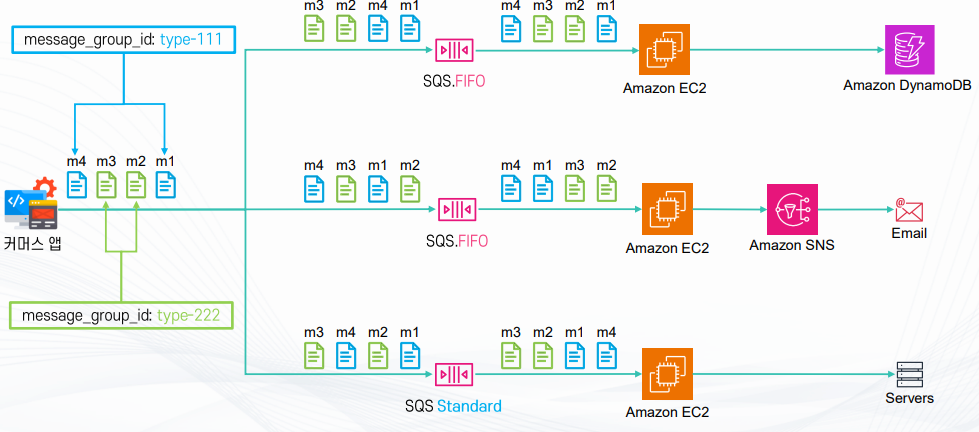

## SNS FIFO (First In First Out)

- Amazon SNS에서 메시지를 FIFO 방식으로 전달할 수 있는 모드
- 메시지 순서를 유지하면서 중복되지 않게 전송할 수 있음
- 금융, 주문, 결제 처리와 같이 순서 보장이 중요한 애플리케이션에 적합

주요 효과 (순서 보장, 중복 제거)

- 순서 보장 (Ordering Guarantee)
  - 동일한 메시지 그룹 내에서는 발행된 순서대로 구독자에게 전달
  - 예 : 주문 --> 결제 --> 배송 순서가 반드시 보장됨

- 중복 제거 (Deduplication)
  - 같은 메시지가 여러 번 발행되더라도 Deduplication ID를 기준으로 한 번만 전달
  - Content-based(본문 해시) 또는 Explicit(명시적 ID 지정) 방식을 사용

- 연동 제한
  - SNS FIFO는 SQS FIFO 및 SQS Standard Queue와만 연동 가능
  - 따라서 다음과 같은 일반적인 엔드포인트와는 연결 불가
*이메일(Email) , 휴대폰 SMS , HTTP/HTTPS 엔드포인트 , Lambda, Kinesis 등 일부 다른 Subscriber
  - 즉, SNS FIFO는 일반적인 Pub/Sub 용도보다는 SQS와 결합한 안정적 메시징에 최적화됨

- 기타 기능
  - 메시지 그룹 (Message Group)
*동일한 그룹 ID를 가진 메시지는 순서를 보장
*다른 그룹 간에는 병렬 처리 가능
  - 메시지 필터링 (Message Filtering)
*구독자가 특정 속성(Attribute)을 기준으로 원하는 메시지만 수신 가능

5. 네이밍 규칙
  - SNS FIFO 주제(Topic) 이름 끝에는 반드시 .fifo 확장자를 붙여야 함
  - 예시 : order-processing.fifo

## Standard SNS + SQS 아키텍처

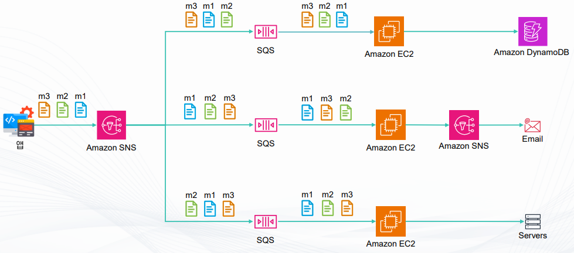

1. 메시지 발행
- 앱에서 메시지 m1, m2, m3를 생성합니다.
- 이 메시지들은 Amazon SNS(주제, Topic)에 발행(Publish)됩니다.

2. SNS --> 여러 SQS로 전달
- Amazon SNS는 구독된 여러 대상(SQS 큐들)로 메시지를 동시에 전달
- 각 SQS 큐는 동일한 메시지(m1, m2, m3)를 받아 저장
- Standard SNS이므로 메시지 순서는 보장되지 않고, 각 큐에 도착하는 순서가 다를 수 있다.

3. 특징
- SNS Standard: 메시지를 동시에 여러 SQS 큐로 전달할 수 있지만,
메시지 순서가 바뀔 수 있다 (예: m1 --> m2 --> m3를 보냈지만, 큐에는 m3 --> m1 --> m2 순으로 들어올 수 있음)
- 중복 메시지가 전달될 수 있음

## SNS FIFO – Message 순서

1. 일반 SNS + SQS의 한계
- 일반적인 SNS와 SQS 조합은 메시지 순서를 보장하지 않음
- 즉, 메시지를 보낸 순서와 실제 수신자가 받는 순서가 다를 수 있음
- 예: m1 --> m2 --> m3 순서로 발행했지만, SQS에서는 m3 --> m1 --> m2 순서로 수신 가능
- 따라서 순서가 중요한 경우에는 SNS FIFO와 SQS FIFO를 함께 사용해야 함

2. FIFO 조합의 특징
- SNS FIFO + SQS FIFO를 사용하면 메시지가 발행된 순서 그대로 구독자에게 전달됨
- 여러 Subscription이 있을 경우, 각 Subscription에 전달되는 메시지의 순서는 동일하게 유지됨
  - 단, 구독자별로 메시지를 받는 시점(속도)은 다를 수 있음 (메시지 자체의 순서는 반드시 동일)

3. Message Sequence Number
  - SNS FIFO는 각 메시지에 Message Sequence Number를 자동으로 부여
  - 이 번호는 연속적이지는 않아도 항상 증가하는 값
  - 덕분에 메시지 순서를 추적하고 재현 가능
  - Message Body에도 이 Sequence Number가 포함됨
  - 단, Raw Message Delivery 옵션을 켠 경우에는 Body에 포함되지 않음

## SNS FIFO + SQS FIFO

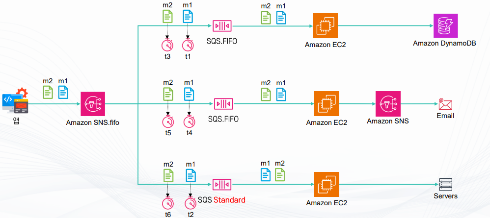

## SNS FIFO – Filtering

1. 메시지 필터링 개요
- SNS FIFO에서는 메시지 필터링 기능을 통해 모든 메시지를 구독자에게 전달하지 않고,
구독자가 원하는 조건에 맞는 메시지만 전달할 수 있음
- 이를 통해 불필요한 트래픽을 줄이고, 각 구독자가 자신에게 필요한 메시지만 처리 가능

2. Subscription Filter Policy
- 각 구독자(Subscription)마다 개별적으로 Filter Policy를 설정할 수 있음
- Filter Policy는 메시지의 Body 또는 Message Attributes(속성)을 기준으로 작성
- 구독 조건에 부합하는 메시지만 전달되고, 조건에 맞지 않으면 해당 구독자는 메시지를 받지 않음

3. 동작 방식
- 퍼블리셔가 SNS FIFO 주제에 메시지를 발행
- 메시지와 함께 Body 및 Attributes가 전달됨
- 구독자에게 설정된 Filter Policy를 확인
  - 조건 일치 : 메시지 전달
  - 조건 불일치 : 메시지 전달하지 않음

4. 활용 예시
- orderType="NEW" 인 메시지만 특정 SQS로 전달
- orderType="CANCEL" 인 메시지는 다른 구독자로 전달
- priority="high" 메시지만 알람 서비스로 전달
- region="ap-northeast-2" 메시지만 한국 서버 구독자가 받도록 설정

5. 장점
- 불필요한 메시지 처리 비용 절감
- 각 구독자에게 맞는 맞춤형 메시징 가능
- 메시지 중복 전달 최소화

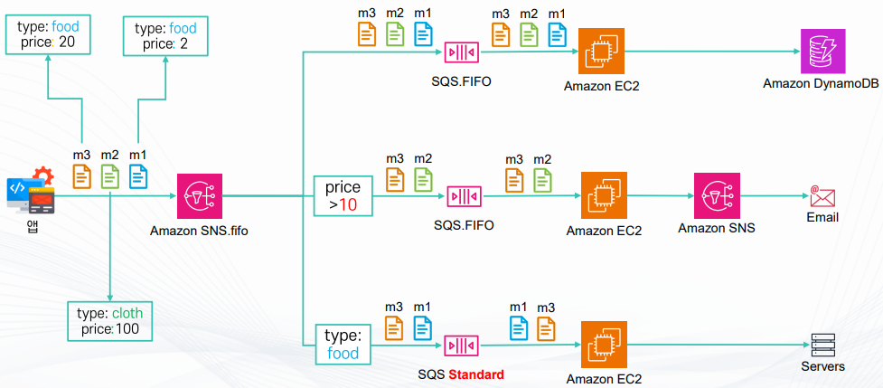

## SNS FIFO – Message Archive/Replay

- SNS FIFO는 전달된 메시지를 저장(Archive) 해두고, 필요할 때 다시 재전송(Replay) 할 수 있는 기능을 제공한다.
- 이 기능은 장애 복구, 애플리케이션 재처리, 신규 시스템 동기화 등에 유용

- 주요 사용 사례

## 전송 오류 복구 : 애플리케이션이 일시적으로 다운되거나 메시지를 놓쳤을 때, 저장된 메시지를 다시 받아서 복구 가능

## 장애 복구(Disaster Recovery) : 기존 애플리케이션 장애 시, Archive에 저장된 메시지를 재처리하여 정상 상태로 복원

## 신규 애플리케이션 동기화 : 새로 추가된 애플리케이션이 과거 메시지 내역을 필요로할때, Replay 기능으로 동기화 가능

- 메시지 보관 기간

## 보관 기간을 최소 1일에서 최대 365일까지 설정 가능

## 필요에 따라 단기 저장(예: 테스트 목적) 또는 장기 저장(예: 규제 준수, 로그 보관 등) 활용

- 비용 구조 (서울 리전 기준)

## 저장 비용 : 약 $0.025/GB/월

## 처리 비용 : 약 $0.13/GB (Replay 시 발생)

## 즉, 많이 저장할수록 월 비용이 늘고, Replay할 때마다 처리 비용이 추가됨

- Replay 동작 방식

## 관리자가 원하는 시점을 지정하여 특정 시간대의 메시지를 Replay 가능

## Replay된 메시지는 마치 새롭게 발행된 것처럼 구독자에게 다시 전달

## 순서 보장 및 중복 제거는 FIFO 특성을 그대로 유지

- 정리

## SNS FIFO Archive/Replay는 메시지 전달 신뢰성을 강화하는 기능

## 보관 --> 재전송 흐름으로 장애 복구, 테스트, 신규 서비스 연동에 최적화

## 단, 추가 스토리지와 처리 비용이 발생하므로 사용 목적과 비용을 함께 고려해야 함

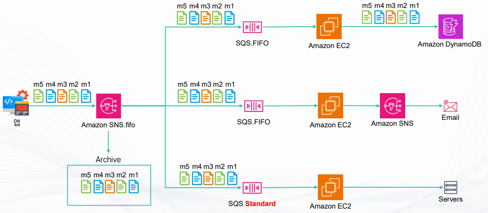

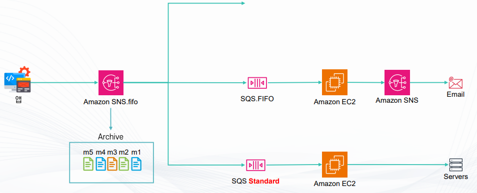

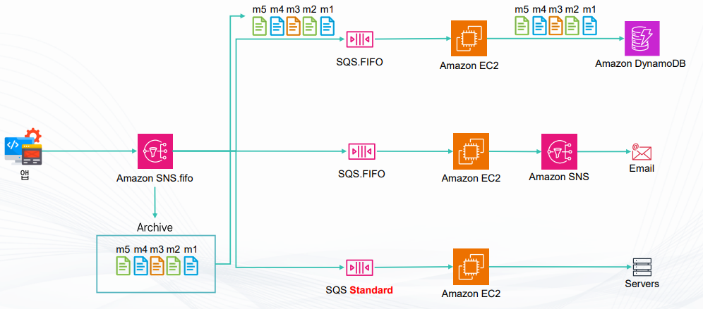
