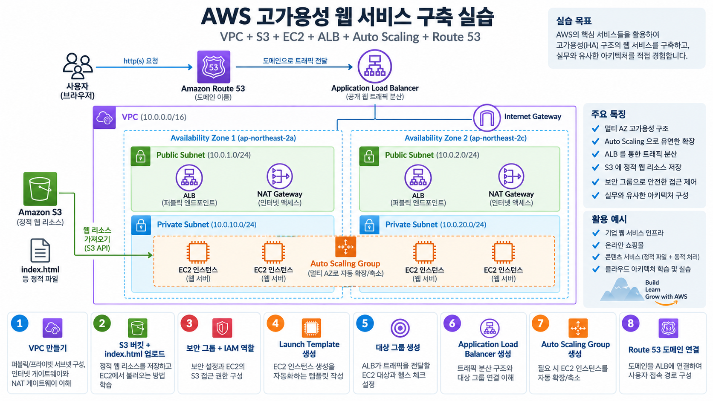

# Amazon Route 53 - 강의 노트

AWS 강의 노트(HWP) 원본을 이미지와 설정 코드, 주석까지 그대로 옮긴 문서다. 정리본은 이론·가이드 문서를 함께 본다.

## Amazon Route 53

- Route53이란?
  - AWS에서 제공하는 DNS(Domain Name System) 서비스
  - 이름의 유래: DNS에서 사용하는 기본 포트 번호가 53번이라서 붙은 이름
  - 역할 : 사람이 기억하기 쉬운 도메인 이름(www.example.com)을 실제 서버의 IP 주소로 바꿔준다.

## 주요 특징

- 글로벌 서비스
  - 전 세계 여러 리전에 분산된 인프라 기반으로 99.99% SLA(서비스 가용성) 제공
  - 빠른 응답 속도와 높은 안정성을 보장

- AWS 리소스와 연동
  - EC2, S3, ALB 같은 AWS 서비스와 손쉽게 연결 가능
  - 외부 도메인과도 연동 가능

## 주요 기능

- 도메인 관리
  - 도메인 등록 및 갱신
  - 레코드(A, CNAME, MX, TXT 등) 설정을 통한 리소스 연결

- Health Check
  - 주기적으로 지정한 서버나 엔드포인트가 정상적으로 응답하는지 확인
  - 문제가 발생하면 자동으로 다른 리소스로 트래픽 전환 가능

- 라우팅 정책
  - 단순 라우팅: 가장 기본적인 방식
  - 지리적 라우팅: 사용자의 위치에 따라 가까운 리소스로 연결
  - 가중치 라우팅: 여러 리소스 중 트래픽을 일정 비율로 분산
  - 지연 시간 라우팅: 가장 빠른 응답 속도를 제공하는 리소스로 연결

- 하이브리드 아키텍처 지원
  - 온프레미스(사내 서버)와 AWS 클라우드를 함께 사용하는 환경에서도 활용 가능

- 비용 구조
  - 호스팅 영역(Hosted Zone)
*도메인을 관리하기 위한 영역 생성 비용 발생 (월 0.50달러)
  - DNS 쿼리
*실제로 사용자가 도메인을 요청할 때마다 발생하는 요청 단위 과금
  - 추가 기능 비용
*Health Check, 트래픽 관리 같은 기능 사용시 별도 요금 발생

## Amazon Route 53 주요 개념

## 도메인(Domain)

- 정의 : 사람이 읽기 쉬운 문자 주소로, 실제 서버의 IP 주소와 매핑됨

- APEX 도메인(Zone Apex, Root Domain)
  - 가장 상위 단계의 순수한 도메인
  - 추가 문자열이 없는 형태
  - EX) example.com

- 서브도메인(Subdomain)
  - 도메인 이름 앞에 추가 문자열이 붙은 형태
  - EX) www.example.com
  - EX) api.example.com
  - EX) blog.example.com

## 레코드(DNS Record)

- 정의: 도메인이 어떤 방식으로 트래픽을 특정 대상으로 전달할지를 정의하는 데이터

- 종류
  - A 레코드 ---> 도메인을 IPv4 주소와 연결
  - AAAA 레코드 ---> 도메인을 IPv6 주소와 연결
  - CNAME 레코드 ---> 다른 도메인 이름으로 연결
  - MX 레코드 ---> 메일 서버 주소 지정
  - TXT 레코드 ---> 도메인 소유 검증이나 보안 설정

- TTL(Time To Live)
  - 레코드가 다른 DNS 서버에 캐싱되는 시간
  - 값이 높으면 쿼리 수는 줄어들지만 업데이트 반영이 늦음
  - 값이 낮으면 업데이트는 빨라지지만 쿼리 비용이 늘어난다.

## Hosted Zone

- 정의: 특정 도메인 및 서브도메인의 레코드를 모아 관리하는 공간 또는 컨테이너

- 특징
  - apex 도메인과 동일한 이름으로 생성된다.
  - 한 도메인에 대해 1개 Hosted Zone을 만들고, 그 안에 여러 레코드를 추가해 관리

- 정리
  - 도메인  --> 사람이 이해할 수 있는 주소
  - 레코드  --> 도메인을 어떤 방식으로 IP나 다른 리소스와 연결할지 정의
  - TTL  --> DNS 정보가 갱신·반영되는 속도 조절
  - Hosted Zone --> 도메인의 모든 레코드를 모아두는 집합

## 레코드(Record)의 종류

```
1. A (Address) Record
```

- 도메인을 IPv4 주소와 연결
- 예 : example.com --> 192.33.11.2
- 가장 기본적이고 많이 쓰이는 레코드

```
2. AAAA (IPv6 Address) Record
```

- 도메인을 IPv6 주소와 연결
- IPv6 환경에서 사용됨 (예 : 차세대 인터넷 주소체계)

```
3. CNAME (Canonical Name) Record
```

- 메인을 다른 도메인으로 연결
- 예 : www.example.com  -->  example.com
- 규칙: apex 도메인(example.com 같은 최상위 도메인)에는 CNAME 사용 불가
- 주로 www, api, mail 같은 서브도메인을 다른 도메인에 매핑할 때 사용

4. Alias Record (별칭 레코드)
- AWS Route53에서만 지원되는 특별한 레코드 타입
- 도메인과 AWS 리소스(S3, CloudFront, ALB 등)를 직접 연결 가능
- 장점
  - apex 도메인에도 사용 가능 (CNAME은 불가하지만 Alias는 가능)
  - 추가 비용 없음 (쿼리 비용 외 별도 과금 없음)
  - HTTPS 연결 시 더 효율적인 지원 제공

```
5. NS (Name Server) Record
```

- 도메인의 권한 있는 DNS 서버(Authoritative DNS)를 지정
- 도메인을 외부 업체에서 구입했을 때, Route53의 NS 레코드를 등록해야 정상 작동

```
6. MX (Mail Exchange) Record
```

- 도메인과 메일 서버를 연결
- 예 : gmail.com 메일 서버로 메일이 전달되도록 설정
- 이메일 송수신을 위해 반드시 필요한 레코드

```
7. TXT (Text) Record
```

- 도메인에 관련된 텍스트 정보를 저장
- 사용 예시
  - 도메인 소유권 검증 (Google, AWS, Microsoft 서비스 등록 시)
  - 이메일 보안 정책 (SPF, DKIM, DMARC 설정)

## Alias Record를 우선적으로 사용하는 이유

1. Apex 도메인(루트 도메인) 연결이 가능하다

- Alias Record의 가장 큰 장점은 APEX 도메인(example.com)을 AWS 리소스에 바로 연결할 수 있다는 점이다.

- DNS 표준 규칙상, APEX 도메인에는 CNAME 레코드를 설정할 수 없다.

- 예 :  awsclassroom.kr  -->  ALB 연결
  - CNAME으로는 설정이 불가능하다.
  - 왜냐하면 APEX 도메인에는 NS, SOA 같은 필수 DNS 정보가 이미 들어 있기 때문이다.
  - 이때 Alias Record를 사용하면, awsclassroom.kr  -->  ALB (Alias) 형태로 직접 연결할 수 있다.
  - 따라서, ALB , CloudFront , S3 Static Hosting 같은
AWS 서비스와 루트 도메인을 연결할 때는 Alias Record가 사실상 필수이다.

2. 비용이 발생하지 않는다 (무료)

- 일반 DNS 레코드(A, CNAME 등)는 DNS 조회(Query)마다 비용이 발생한다.
- Route53 요금 구조상 DNS 요청 수에 따라 과금이 발생한다. (트래픽이 많아질수록 비용이 증가)
하지만 Alias Record는 AWS 내부 리소스와 직접 연결되는 방식이기 때문에
별도의 DNS 쿼리 비용이 부과되지 않는다.
즉, Alias Record를 사용하면 도메인 조회 비용 절감, 운영 비용 감소 , 대규모 서비스에 유리하다는 장점이 있다.
운영 서버에서는 이 차이가 꽤 크다.

3. HTTPS 연결을 더 효율적으로 처리한다

- 일반 A / AAAA 레코드 방식에서는 클라이언트가 서버에 처음 접속할 때
서버가 어떤 프로토콜을 지원하는지 바로 알 수 없다.

1단계: HTTP로 접속
2단계: HTTPS 지원 여부 확인
3단계: HTTPS로 재연결

- 이런 과정이 발생할 수 있다.

- 이 과정에서 연결 지연 발생, 불필요한 통신 증가, 초기 접속 속도 저하같은 문제가 발생 할 수 있다.

```
 반면, Alias Record + AWS 리소스(ALB, CloudFront)를 사용하면,
 HTTPS가 미리 HTTPS 지원 여부, 인증서 정보, 프로토콜 설정을 알고 있기 때문에,
 첫 요청부터 바로 HTTPS 연결이 가능하다.
 결과적으로 접속 속도 향상, 보안 강화, 사용자 경험 개선 효과가 있다.

4. AWS 서비스와 자동 연동된다
```

- Alias Record는 AWS 전용 기능이다.
따라서 연결 대상이 변경되어도 DNS 설정을 다시 수정할 필요가 없다.

- 예를 들어 ALB 재생, CloudFront 재배포, S3 엔드포인트 변경 같은 상황이 발생해도,
Alias는 자동으로 대상 정보를 추적한다.
반면, CNAME이나 A 레코드는 IP나 도메인이 바뀌면 직접 수정해야 한다.

## Amazon Route 53 사용 과정

1. 도메인 등록
- 도메인은 Route53 또는 외부 도메인 등록 기관(Domain Registrar) 에서 구입 가능
- Route53에서는 일부 국가 도메인(.kr 등)은 직접 구매 불가능
- 이미 도메인을 가지고 있다면, Route53으로 가져와서 관리할 수 있음

2. Hosting Zone 생성
- Route53에서 도메인을 등록한 경우
  - 자동으로 Hosting Zone이 생성됨
- 외부에서 도메인을 구입한 경우
  - Route53에서 수동으로 Hosting Zone을 만든 뒤, 외부 도메인 관리 페이지에서
NS(Name Server) 레코드를 Route53에서 제공하는 네임서버로 변경해야 함
- Hosting Zone은 해당 도메인의 DNS 레코드를 관리하는 컨테이너 역할을 함

3. 레코드 생성
- Alias Record
  - AWS 리소스(S3 정적 웹사이트, CloudFront 배포, ALB 등)를 도메인과 연결할 때 사용
  - CNAME과 비슷하지만 apex 도메인에도 적용 가능
  - AWS 전용 기능이며 별도 비용 없음

- DNS 전파 시간
  - 변경된 레코드가 전 세계 DNS 서버에 반영되기까지 최대 하루(24시간) 이상 걸릴 수 있음
  - 일반적으로 몇 분 ~ 몇 시간 내에 반영되지만 TTL 값에 따라 차이 있음

- CNAME 레코드
  - 다른 도메인 이름으로만 연결 가능
  - Apex 도메인(example.com)에는 사용 불가

- Alias 레코드
  - AWS 리소스에 직접 연결 가능
  - Apex 도메인에도 사용 가능 (example.com 같은 최상위 도메인 연결 가능)
  - 별도 요금 없음 (쿼리 비용 외 추가 비용 없음)

Amazon Route53 도메인 등록

- Part 1: Route53에서 직접 도메인 구입
  - AWS Route53 콘솔에서 원하는 도메인을 검색하고 등록할 수 있음
  - 등록된 도메인을 Route53에서 바로 관리할 수 있도록 설정
  - 이후 필요한 레코드(예 : A, CNAME, MX)를 생성해 AWS 리소스(EC2, S3, ALB 등)와 연결 가능

- Part 2: 외부에서 구입한 도메인 연결
  - 이미 다른 업체(가비아, 카페24, GoDaddy 등)에서 구입한 도메인이 있다면,
해당 도메인의 네임서버(NS)를 Route53에서 생성한 Hosted Zone의 네임서버로 변경해야 함.
  - 특히 .kr 같은 일부 도메인은 Route53에서 직접 구입이 불가 --> 반드시 외부에서 구입 후 Route53으로 위임해야 함

- 비용 구조
  - 도메인 구입 비용
*도메인을 Route53에서 등록하면 연 단위 비용이 발생. (예 : .com 약 $12/년 수준)
*Route53에서 구입하든 외부에서 구입하든 상관없이 도메인 등록 자체에는 별도 비용이 들어간다.
*도메인 비용은 프리티어(무료 제공)가 없음
  - Hosted Zone 비용
*Route53에서 Hosted Zone을 만들면 매달 $0.50이 과금
*추가로 DNS 조회(Query) 횟수에 따라 요금이 발생
*이 부분도 프리티어 없음



## AWS 고가용성 웹 서비스 구축 종합 실습 문제

```
==================================================
문제 1. VPC 구성
==================================================
```

- 다음 조건으로 VPC를 생성
  - VPC 이름: my-web-vpc
  - CIDR     : 10.0.0.0/16

- 다음과 같이 4개의 서브넷을 생성
  - public-subnet-a  : 10.0.1.0/24
  - public-subnet-b  : 10.0.2.0/24
  - private-subnet-a : 10.0.3.0/24
  - private-subnet-b : 10.0.4.0/24

- 조건
  - Public Subnet 2개는 서로 다른 가용 영역에 배치한다.
  - Private Subnet 2개도 서로 다른 가용 영역에 배치한다.
  - ALB는 Public Subnet에 배치한다.
  - Auto Scaling으로 생성되는 EC2는 Private Subnet에 배치한다.

```
==================================================
문제 2. Internet Gateway 구성
==================================================
```

- Internet Gateway를 생성하여 my-web-vpc에 연결

- Public Subnet에서 인터넷 통신이 가능하도록 Public Route Table을 구성
  - Destination: 0.0.0.0/0
  - Target      : Internet Gateway

- 생성한 Public Route Table을 public-subnet-a, public-subnet-b에 연결

```
==================================================
문제 3. NAT Gateway 구성
==================================================
```

- Private Subnet의 EC2가 인터넷으로 나갈 수 있도록 NAT Gateway를 구성
  - NAT Gateway 위치 : public-subnet-a
  - 연결 유형         : Public
  - Elastic IP        : 새로 할당

- Private Route Table을 생성하고 다음 경로를 추가하시오.
  - Destination: 0.0.0.0/0
  - Target      : NAT Gateway

- 생성한 Private Route Table을 private-subnet-a, private-subnet-b에 연결

```
==================================================
문제 4. S3 구성
==================================================
```

- 웹 페이지 파일을 저장할 S3 버킷을 생성
  - 파일명 : index.html

- 조건
  - S3 버킷은 외부에 공개하지 않는다.
  - Block Public Access는 활성화 상태로 유지한다.
  - index.html 파일을 S3에 업로드한다.

```
==================================================
문제 5. IAM Role 구성
==================================================
```

- EC2가 S3의 index.html 파일을 읽을 수 있도록 IAM Role을 생성
  - 신뢰할 수 있는 엔터티 : AWS Service
  - 사용 사례: EC2
  - 권한: AmazonS3ReadOnlyAccess
  - Role 이름: EC2-S3-Role

```
==================================================
문제 6. 보안 그룹 구성
==================================================
```

- ALB용 보안 그룹과 EC2용 보안 그룹을 각각 생성

```
[ALB-SG] Inbound
 # Protocol: HTTP
 # Port     : 80
 # Source   : 0.0.0.0/0

[EC2-SG] Inbound
 # Protocol : HTTP
 # Port     : 80
 # Source   : ALB-SG

==================================================
문제 7. Launch Template 생성
==================================================
```

- Auto Scaling Group에서 사용할 Launch Template을 생성
  - AMI   : Amazon Linux 2023
  - Instance Type: t3.micro
  - Security Group: EC2-SG
  - IAM Role    : EC2-S3-Role

- User Data를 이용하여 EC2가 생성될 때 다음 작업이 자동으로 수행되도록 구성
  - 1. httpd 설치
  - 2. httpd 서비스 시작
  - 3. httpd 부팅 시 자동 시작
  - 4. S3에서 index.html 다운로드
  - 5. 자신의 EC2 Instance ID 확인
  - 6. index.html 하단에 Instance ID 추가

예상 결과

```
<h1>Soldesk AWS Web Service</h1>
<hr>
<h3>Instance ID: i-xxxxxxxxxxxxxxxxx</h3>

==================================================
문제 8. Target Group 생성
==================================================
```

- ALB가 트래픽을 전달할 Target Group을 생성
  - Target Type       : Instances
  - Protocol          : HTTP
  - Port              : 80
  - IP Address Type   : IPv4
  - VPC               : my-web-vpc
  - Health Check Path: /index.html

```
==================================================
문제 9. Application Load Balancer 생성
==================================================
```

- Application Load Balancer를 생성
  - Scheme           : Internet-facing
  - VPC              : my-web-vpc
  - Subnet           : public-subnet-a, public-subnet-b
  - Security Group   : ALB-SG
  - Listener         : HTTP 80
  - Target Group: 문제 8에서 생성한 Target Group

```
==================================================
문제 10. Auto Scaling Group 생성
==================================================
```

- 문제 7에서 생성한 Launch Template을 사용하여 Auto Scaling Group을 생성

- VPC : my-web-vpc

- Subnet
  - private-subnet-a
  - private-subnet-b

- Target Group

- 문제 8에서 생성한 Target Group 연결

용량 설정

Desired Capacity : 2
Minimum Capacity : 3
Maximum Capacity : 5

```
==================================================
문제 11. 서비스 동작 확인
==================================================
```

- ALB의 DNS 이름을 확인하고 웹 브라우저로 접속하시오.
  - 예) http://ALB-DNS-NAME

페이지에 다음과 같이 Instance ID가 출력되는지 확인

Instance ID: i-xxxxxxxxxxxxxxxxx

브라우저에서 여러 번 새로고침하여 Instance ID가 변경되는지 확인

```
==================================================
문제 12. HTTP Access Log 확인
==================================================
```

- Auto Scaling으로 생성된 각 EC2에 접속하여 Apache Access Log를 확인
  - 명령어 : tail -f /var/log/httpd/access_log

ALB 주소로 여러 번 접속하거나 새로고침한 후 각 EC2의 로그를 확인

```
==================================================
문제 13. Route 53 구성
==================================================
```

- Route 53 Hosted Zone에 ALB로 연결되는 레코드를 생성
  - Record Type: A
  - Alias: 활성화
  - Target: Application Load Balancer
  - 예) web.example.com  -->  ALB

- 생성한 도메인을 웹 브라우저에서 접속하여 웹 페이지가 정상적으로 출력되는지 확인

```
==================================================
문제 14. 전체 트래픽 흐름 설명
==================================================
```

- 사용자가 다음 주소로 접속했다고 가정한다.
  - http://web.example.com

- 아래 구성 요소를 모두 사용하여 요청이 처리되는 순서를 설명
  - Route 53
  - Application Load Balancer
  - Target Group
  - Auto Scaling Group
  - EC2
  - Apache

```
 # index.html

예
사용자 --> Route 53 --> ALB --> Target Group --> EC2 --> Apache --> index.html --> 사용자에게 웹 페이지 반환

==================================================
문제 15. 장애 테스트
==================================================
```

- Auto Scaling Group에서 실행 중인 EC2 인스턴스 중 1대를 강제로 종료

- 다음 내용을 확인
  - 1. Target Group에서 종료된 인스턴스 상태 변화
  - 2. Auto Scaling Group에서 새로운 EC2 생성 여부
  - 3. Desired Capacity가 다시 2개로 유지되는지 확인
  - 4. 새 EC2가 Target Group에 자동 등록되는지 확인
  - 5. Health Check 통과 후 ALB가 새로운 EC2로 트래픽을 전달하는지 확인
