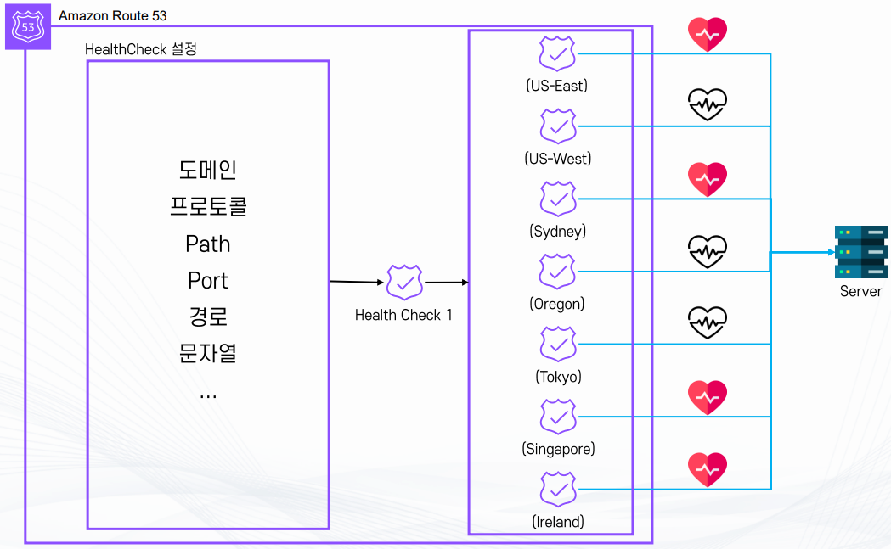
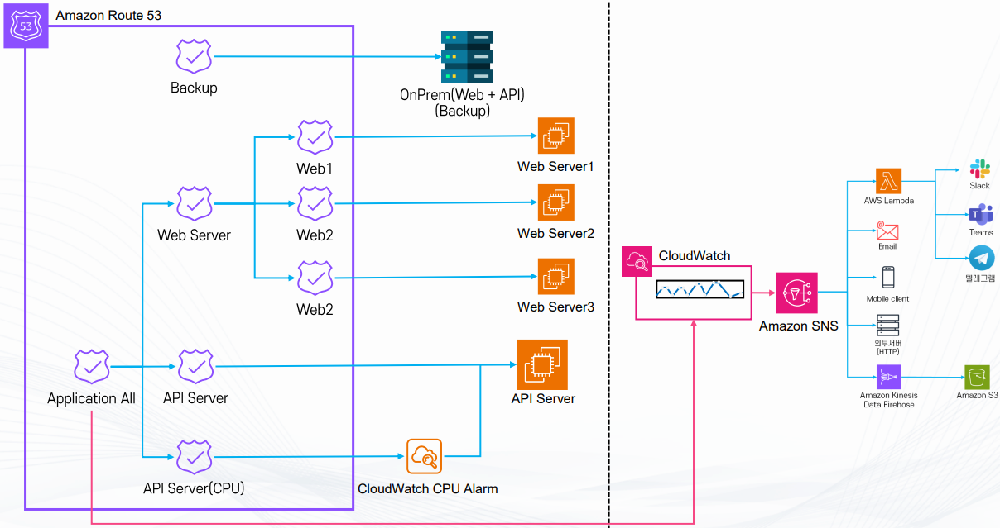
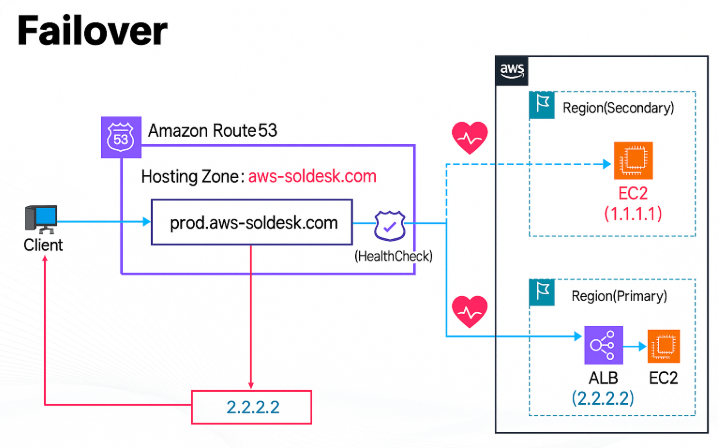
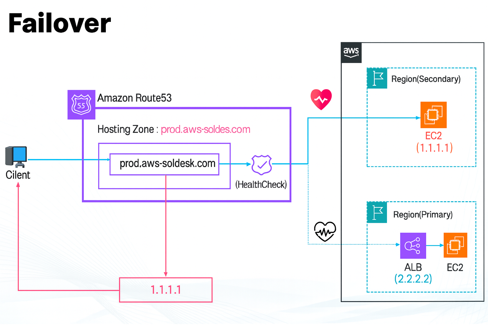

# Route 53 Health Check · Routing Policy - 강의 노트

AWS 강의 노트(HWP) 원본을 이미지와 설정 코드, 주석까지 그대로 옮긴 문서다. 정리본은 이론·가이드 문서를 함께 본다.

## Amazon Route 53 Health Check

1. 기본 개념
- Route 53 Health Check는 Route 53에서 설정한 리소스(웹 애플리케이션, 서버, API 엔드포인트 등)의
상태를 모니터링하는 기능

2. 주요 기능
- 모니터링 및 알림
  - 특정 리소스가 정상 응답을 하지 않으면 비정상 상태로 판별
  - 이 상태는 Routing Policy(가중치 라우팅, 장애 조치 라우팅 등)에서 활용 가능
  - Amazon CloudWatch와 연동하여 경보를 설정하고 장애가 발생하면 알림을 받을 수 있다

3. 지연(Latency) 정보 확인
- TCP Connection 시간
  - 서버와 TCP 연결을 맺는 데 걸린 시간

- HTTP/HTTPS First Byte Latency
  - 서버에서 첫 번째 응답 바이트를 보내기까지 걸린 시간

- SSL/TLS Handshake 시간
  - HTTPS 연결 시 암호화 과정(SSL/TLS 핸드셰이크)에 걸린 시간

4. CloudWatch와 연동
- Route 53 Health Check 결과는 CloudWatch Metrics로 전달됨
- CloudWatch 대시보드에서 시각화 가능
- CloudWatch Alarm을 설정해 Health Check가 실패하면 SNS 등을 통해 알림을 받을 수 있다

5. 리전 제한
- Route 53 Health Check는 미국 동부(버지니아 북부, us-east-1) 리전에서만 제공된다.
- 모니터링 대상 리소스는 전 세계 어디에 있어도 상관없다

6. 활용 예시
- 장애 조치(Failover) 라우팅
  - 기본 서버가 다운되면 자동으로 대체 서버로 트래픽 전송

- 성능 기반 라우팅
  - 지연 시간이 짧은 리전에 트래픽 분산

- 경보/알림
  - 특정 리소스가 장애 상태일 때 운영자에게 알림을 전송한다.

## Health Check 모니터링 대상 (무엇을 모니터링할 수 있느냐)

- Route 53 Health Check는 단순히 서버 하나만 보는 게 아니라 여러 가지 대상을 모니터링할 수 있다.

1. 특정 리소스
- 웹 서버, API 엔드포인트, 데이터베이스와 같은 개별 리소스의 상태를 확인할 수 있다.
- 예를 들어 EC2 인스턴스의 웹 애플리케이션이 정상적으로 응답하는지 확인 가능하다.

2. 다른 Health Check
- 하나의 Health Check 결과를 다른 Health Check의 입력으로 활용 가능하다
- 여러 개의 Health Check를 조합해 종합적인 상태를 판별하는 데 유용하다
  - 예: 두 리전의 서버가 모두 정상일 때만 정상으로 판단

3. Amazon CloudWatch 경보
- CloudWatch Alarm 상태를 Route 53 Health Check로 모니터링할 수 있다.
- 즉, 특정 메트릭(CPU 사용량, 메모리, 디스크, 네트워크 지연 등)에 기반한 알람을 Health Check와 연동 가능하다.
- 이렇게 하면 단순 네트워크 응답뿐 아니라 애플리케이션 내부 성능 문제까지 반영할 수 있다.

## Health Check 모니터링 대상 - 리소스 (특정 리소스를 어떻게 모니터링하느냐)

1. 대상 및 개념
- Health Check는 특정 IP 주소나 도메인에 주기적으로 요청을 보내 응답 여부를 확인함
- 이를 통해 해당 리소스(웹 서버, 애플리케이션 등)가 실제로 가용 상태(사용 가능)인지 판단한다.

2. 상태 확인 방법
- 전 세계 여러 리전에 분산된 Health Checker 노드에서 리소스를 점검한다.
- 요청은 미리 지정한 프로토콜(HTTP, HTTPS, TCP 등)과 주기에 맞춰 발송된다.
- 주기 설정
  - 10초 (추가 요금 발생)
  - 30초 (기본, Checker 간 동기화는 없음)

3. 상태 판단 기준 (2가지 지표)
- 응답 속도
  - HTTP 연결 수립: 4초 이내
  - TCP 연결 수립: 10초 이내
  - HTTP 문자열 검사(HTTP String Match): 2초 이내에 값 확인

- 응답 내용 및 실패 횟수
  - 정상 응답이 특정 횟수 이상 연속 실패하면 비정상으로 판별

4. Health 상태 판정 방식
- 모든 Health Checker의 결과를 종합하여 판정
- 전체 Health Checker 중 18% 초과해야 Healthy 상태를 유지해야 Health 상태로 간주된다.

5. 주의사항
- Health Check 대상이 AWS 외부 리소스(예: 온프레미스 서버, 다른 클라우드의 엔드포인트)일 경우
추가 요금이 발생한다.

## Health Check 모니터링 대상 - 리소스 지정 가능 값

1. 모드
- Route 53 Health Check에서 어떤 리소스를 대상으로 할지 지정할 수 있다.

(1) IP 주소 기반 모드
- 지원: IPv4, IPv6
- 제한: 로컬 IP, Private IP, Multicast 주소는 Health Check 불가
- 체크 방식
  - HTTP/HTTPS: 리소스가 2xx, 3xx 상태 코드를 반환하는지 확인
  - TCP: TCP 연결이 정상적으로 맺어지는지 확인

(2) 도메인 기반 모드
- 대상: 도메인 이름을 입력하여 Health Check 수행
- 체크 방식
  - HTTP/HTTPS: 리소스가 2xx, 3xx 상태 코드를 반환하는지 확인
- 제한: IPv4 주소만 지원 (즉, A 레코드만 지원)
  - A 레코드 외(예: AAAA 레코드, CNAME만 있는 경우)는 실패(Fail 처리)

2. 매칭 문자열 검사
- Health Check 요청에 대한 응답 Body 내부에 특정 문자열이 있는지 확인 가능
- 단순히 상태 코드만 확인하는 게 아니라 응답 내용까지 검증할 수 있음
- 예: "Success"라는 문자열이 응답 Body에 반드시 포함되어야 Healthy로 판정

3. Health Check Region
- 최소 3개 리전에서 Health Check가 수행됨
- 이렇게 해야 전 세계 어디서든 리소스 가용성을 공정하게 판단할 수 있음

4. 기타 옵션
- 포트 지정: 특정 포트(예: 80, 443, 8080 등)를 지정하여 체크 가능
- 경로(Path) 지정: HTTP/HTTPS 요청 시 특정 경로(/health, /status 등)로 요청 가능
- 주기(Interval): 10초(추가 요금) 또는 30초로 설정 가능
- Latency Graphs: 응답 지연 정보를 시각화하여 성능 모니터링 가능
- Inverse Check(역검증): 정상 상태일때 Fail로 간주하고 비정상 상태일때 Healthy로 판정하는 반대 로직도 설정 가능

## Health Check 모니터링 대상 – 다른 Health Check

1. 개념
- Route 53 Health Check는 단일 리소스(IP, 도메인 등)뿐만 아니라 다른 Health Check의 결과를
모니터링 대상으로 지정할 수 있다.
- 이를 통해 개별 Health Check 결과를 조합하여 더 복잡한 논리적 상태 판정을 구현할 수 있다.

2. 활용 예시
- 3개 이상의 Health Check를 설정해 두었을 때, 이 중 다수의 상태 검사자가 실패하면
장애로 간주하고 알림을 발송하거나 Failover 라우팅을 실행
- 즉, 단일 서버 상태만 보는 게 아니라 여러 서버나 여러 지역에 걸친 상태를 논리적 조건으로 묶을 수 있다.

3. 상태 판정을 위한 Health Check 조합 방식

- Route 53은 Health Check 성공/실패를 집계할 때 다양한 조건을 설정할 수 있다

1) 모든 Health Check 성공 시 (성공)
- 예: 3개의 서버 모두 응답해야만 정상으로 간주
- 신뢰성은 높지만 민감도가 커서 하나라도 실패하면 전체 실패로 본다

2) 단 하나의 Health Check 성공 시 (성공)
- 예: 3개의 서버 중 1개라도 살아 있으면 정상으로 간주
- 고가용성 환경(Active-Active 구조)에서 주로 사용

3) 지정한 Health Check 숫자 중 N개 이상 성공 시 (성공)
- 예: 5개 중 최소 3개 이상 성공해야 정상으로 간주
- Quorum(과반수) 개념을 적용해 특정 수준의 가용성을 보장

4. 장점
- 단순 리소스 모니터링보다 서비스 전체의 가용성 관점에서 상태를 판정할 수 있음
- 장애 감지 시 경보(CloudWatch Alarm), 라우팅 정책(Failover, Weighted, Latency 등)과 연동하여 자동 대응 가능
- 글로벌 서비스 운영 시 특정 리전이나 서버 몇 개에 문제가 생겨도
전체 서비스 장애로 잘못 판정하지 않게 유연하게 설정할 수 있다

## Amazon Route53 Routing Policy

- 도메인 레코드가 어느 리소스(예: EC2, ALB, S3, CloudFront 등)로 연결될지 결정하는 방식
- 단순히 DNS 이름 --> IP 매핑을 넘어서, 트래픽 분산, 장애 조치, 성능 최적화까지 지원한다.
- 종류
  - Simple
  - Failover
  - Geolocation
  - Geoproximity
  - Latency
  - IP-Based
  - Multivalue Answer
  - Weighted

## Simple Routing Policy (단순 라우팅 정책)

- 기본 개념
  - 가장 기본적이고 단순한 라우팅 방식
  - 하나의 DNS 레코드를 하나의 대상 리소스로만 연결
  - 별도의 트래픽 분산, 조건부 라우팅, 장애 조치 기능은 제공하지 않음

- 동작 방식
  - 사용자가 도메인(example.com)에 접속하면, 등록된 단일 IP 주소나 단일 엔드포인트로만 응답

- 주요 사용 사례
  - 단일 서버 운영 환경: 예) 웹 서버 1대에만 트래픽을 보내는 경우
  - 단순 테스트 환경: 예) 개발 환경이나 POC(Proof of Concept)에서 빠르게 도메인을 특정 서버로 연결
  - 소규모 개인 홈페이지, 블로그, 단일 애플리케이션 배포 등

- 장점
  - 설정이 매우 간단하고 빠름
  - 복잡한 구조가 필요 없는 경우 가장 효율적
  - 운영 관리가 쉬움

- 한계와 주의사항
  - 고가용성 불가: 서버가 다운되면 서비스 전체가 중단됨
  - 부하 분산 불가: 트래픽을 여러 서버로 나눌 수 없음
  - 글로벌 사용자 환경에는 적합하지 않음

## Failover Routing Policy (장애 조치 라우팅 정책)

- 기본 개념
  - 평소에는 기본 대상(Primary) 으로 모든 트래픽을 라우팅
  - 기본 대상에 장애가 발생하면 자동으로 보조 대상(Secondary)으로 트래픽을 전환하는 정책
  - 서비스 중단을 최소화하고 고가용성을 보장하기 위해 사용

- 동작 방식
  - Health Check를 활용해 기본 대상의 상태를 지속적으로 모니터링
  - 기본 대상이 Fail(비정상) 상태일 경우 자동으로 보조 대상으로 라우팅
  - 보조 대상은 대기 상태(Standby)로 있다가 필요할 때만 트래픽을 처리

- 주요 사용 사례
  - Active-Passive Failover
*평소에는 기본 대상이 모든 요청을 처리
*기본 대상에 장애가 발생하면 보조 대상이 준비되어 트래픽을 처리
*예: 서울 리전(Primary)이 다운되면 도쿄 리전(Secondary)으로 자동 전환
  - 재해 복구(Disaster Recovery)
*특정 리전에 장애가 발생했을 때 다른 리전으로 자동 장애 조치
*클라우드 환경에서 지리적 이중화를 구현할 때 자주 사용

- 장점
  - 서비스 중단을 최소화
  - 운영자가 직접 개입하지 않아도 자동으로 장애 조치 수행
  - 보조 대상은 필요할 때만 활성화되므로 비용 절감 가능

- 주의사항
  - Failover 라우팅은 반드시 Health Check와 함께 설정해야 정상 동작
  - 보조 대상이 항상 최신 상태로 준비되어 있어야 신속한 전환 가능
  - 다수의 보조 대상을 지정할 수 있지만, 일반적으로 1차 Primary와 1차 Secondary로 구성

## Geolocation Routing Policy (위치 기반 라우팅 정책)

- 기본 개념
  - DNS Query가 어느 지역에서 발생했는지에 따라 서로 다른 응답을 반환하는 정책
  - 즉, 요청자가 지리적으로 어디에 있느냐에 따라 응답을 달리 설정할 수 있음
*예 :동남아시아 지역 요청 : 한국 리전 서버
*예 :유럽 지역 요청 : 프랑크푸르트 리전 서버

- 설정 단위
  - 대륙(Continent), 나라(Country), 미국의 경우 주(State) 단위로 지정 가능
  - 겹치는 범위가 있을 경우, 더 세부적인 지역을 우선 적용
*예: "아시아"와 "한국"이 동시에 설정되어 있으면 한국에서 오는 요청은 “한국” 규칙이 적용됨

- 특징
  - 관리자가 직접 지역과 리소스를 지정해야 한다.
  - Route 53에서 자동으로 가장 가까운 리전을 선택해주는 것은 아님
  - 원칙: "내가 지정한 지역의 요청은 내가 지정한 지역의 리소스로 라우팅"

- 주요 사용 사례
  - 언어별 라우팅: 지역에 따라 현지화된 웹사이트(한국어, 영어, 일본어 등)를 제공
  - 지역별 콘텐츠 구분: 예를 들어 동영상 서비스에서 저작권 문제 때문에 특정 국가에만 콘텐츠 제공
  - 인프라 최적화: 인구 분포, 예상 사용자 부하 등을 고려해 각 지역 리소스로 요청을 분산

- 장점
  - 특정 국가/지역 사용자에게 맞춤형 서비스 제공 가능
  - 불필요한 해외 트래픽 감소 (네트워크 비용 절감)
  - 규제(예: 데이터 지역 규제, 저작권 제한)에 대응 가능

주의사항
  - Geolocation Routing은 자동 최적화가 아닌 수동 정책임
*Latency Routing처럼 지연 시간을 고려해 최적 경로를 선택하지 않음
  - 지정되지 않은 지역에서 요청이 오면 기본(Default) 응답을 별도로 설정해둬야 함
  - 잘못 설계하면 일부 지역 사용자가 접근 불가 상태가 될 수 있음

## Geoproximity Routing Policy (지리적 근접 라우팅 정책)

- 기본 개념
  - DNS Query가 발생한 사용자의 위치와 리소스(서버)의 위치를 동시에 고려하여 라우팅
  - 요청이 발생한 지점에서 가장 가까운 리소스로 트래픽을 전달
  - 핵심 원칙 : 요청한 지역과 리소스의 거리 기반 라우팅

- 동작 방식
  - 단순히 사용자의 위치만 고려하는 Geolocation Routing과 달리, 리소스의 위치까지 포함하여 판단
  - 기본적으로는 가장 가까운 리소스에 연결되지만, 관리자가 Bias(보정값)를 적용해 범위를 조정할 수 있음

- Bias (편향값)
  - 특정 지역 리소스가 더 많은 요청을 처리하도록 하거나, 반대로 더 적게 처리하도록 범위를 넓히거나 좁히는 조정값
  - 예시 :
*도쿄 리전 리소스에 Bias를 +값으로 설정하면 일본뿐만 아니라 주변 아시아 일부 지역 요청도 도쿄 리전으로 유도
*반대로 -값을 설정하면 도쿄 리전의 커버리지를 줄이고, 다른 리전으로 요청이 분산되도록 조정

- 주요 사용 사례
  - 지역별 콘텐츠 제공: 사용자가 가까운 리전에서 콘텐츠를 받아 지연(latency) 최소화
  - 부하 분산: 특정 리전에 트래픽이 집중되지 않도록 Bias를 활용해 트래픽 분산
  - 글로벌 서비스 최적화: 전 세계 사용자가 가장 근접한 인프라에 연결되어 빠른 응답 제공

- 장점
  - 사용자 경험 개선: 물리적으로 가까운 서버에 연결되므로 지연 시간이 줄어듦
  - 운영 유연성: Bias 조정을 통해 트래픽 비율을 의도적으로 제어 가능
  - 글로벌 서비스 운영에 적합

- 주의사항
  - Geoproximity Routing Policy는 Route 53 Traffic Flow 기능을 사용해야 설정 가능
  - 단순 DNS 레코드 수준에서는 제공되지 않음
  - Bias 설정을 잘못하면 의도치 않게 특정 리전에 부하가 집중될 수 있음

## Latency-Based Routing Policy (지연 시간 기반 라우팅 정책)

- 기본 개념
  - 유저 기준으로 가장 빠른 Latency(네트워크 지연 시간)를 가진 리소스로 트래픽을 라우팅하는 정책
  - Route 53은 여러 리전 간의 지연 시간을 측정하고, 사용자가 요청할 때 가장 응답 속도가 빠른 리전에 연결

- 동작 방식
  - 도쿄 리전과 버지니아 리전에 각각 ALB가 있다고 가정
  - 서울에서 요청이 발생하면, 서울에서 도쿄까지의 지연 시간과 서울에서 버지니아까지의 지연 시간을 비교
  - 도쿄 리전이 더 빠르다면 트래픽은 도쿄 리전으로 라우팅
  - 즉, 물리적 거리보다는 실제 네트워크 지연 시간에 따라 결정

- 특징
  - AWS 데이터 센터 간 지연 시간을 기반으로 하기 때문에, AWS 외부 네트워크 소스에서는 정확도가 떨어질 수 있음
  - 사용자의 위치에 따라 항상 가장 빠른 응답을 보장하려는 목적
  - Health Check와 함께 사용하면, 빠르면서도 정상 상태인 리소스로만 라우팅 가능

- 주요 사용 사례
  - 멀티 리전 서비스 최적화
*글로벌 웹사이트, 동영상 스트리밍, 게임 서비스 등에서 사용
*유저가 어느 지역에서 접속하든 가장 낮은 지연 시간의 리전으로 연결
  - Active-Active Failover 구조
*여러 리전이 동시에 서비스 중일 때, 지연 시간이 가장 낮은 리전으로 연결하여 고가용성과 성능을 모두 확보

- 장점
  - 사용자 경험 개선 : 전 세계 어디서 접속하든 빠른 응답 속도 보장
  - 리전 간 트래픽 분산: 특정 리전에 부하가 몰리는 것 방지

- 주의사항
  - Latency 기반이라 하더라도 실제 사용자의 ISP, 인터넷 경로 품질에 따라 오차가 발생할 수 있음
  - 지연 시간이 빠르다고 해서 항상 비용 효율적이지는 않음 (예: 특정 리전에 더 높은 요금이 발생할 수 있음)
  - Latency 측정은 AWS 내부 네트워크 기준이므로 외부 네트워크의 상황은 반영되지 않을 수 있음

## IP-based Routing Policy (IP 기반 라우팅 정책)

- 기본 개념
  - 사용자의 IP 주소를 기준으로 트래픽 라우팅을 제어하는 정책
  - 기존의 Geolocation Routing이나 Latency-Based Routing처럼 위치, 성능만 보는 것이 아니라,
IP 대역(CIDR Block Range)별로 세분화하여 트래픽 분리 가능
  - 네트워크 이해가 필요한 고급 라우팅 방식

- 동작 방식
  - Route 53에서 사용자의 IP를 식별하고, 관리자가 설정한 CIDR 범위와 매칭
  - 특정 IP 대역에 속한 요청은 지정된 리소스로 라우팅
  - 나머지 범위는 다른 리소스로 보내도록 설정 가능

- 활용 사례
  - 특정 네트워크 구분 라우팅
*특정 ISP(통신사)에서 오는 요청만 특정 리전에 연결
*예: 한국 통신사 SKT 대역은 서울 리전, 해외 ISP 대역은 도쿄 리전으로 분기
  - 기업 내부 네트워크 라우팅
*회사의 사설망 또는 특정 고정 IP 대역에서 오는 요청만 개발용 시스템(Development)으로 연결
*예: 사내 IP 대역만 개발 서버 접속 가능하게 설정
  - 보안 강화
*허용된 IP 대역만 특정 서비스에 접근하도록 제한
*예: 관리자용 백엔드 콘솔은 본사 IP 대역에서만 접근 가능하게 라우팅

- 장점
  - 사용자 그룹을 IP 기준으로 정확히 분리 가능
  - ISP, 기업망, 특정 고객사 전용 서비스 등 세밀한 라우팅 정책 구현 가능
  - 보안과 접근 제어 관점에서 유용

- 주의사항
  - CIDR 범위를 잘못 설정하면 정상 사용자도 접근이 차단될 수 있음
  - IP는 위치 정보처럼 변경될 수 있으므로, IP 기반 라우팅은 항상 최신 정보 유지 필요
  - IPv4는 물론 IPv6 대역까지 관리 가능하지만, 정책 관리가 복잡해질 수 있음

## Multivalue Routing Policy (다중 값 라우팅 정책)

- 기본 개념
  - 하나의 DNS 쿼리에 대해 여러 개의 IP 주소를 응답으로 반환하는 정책
  - 클라이언트는 반환된 여러 IP 중 하나를 무작위로 선택해 연결
  - 단순하지만 DNS 차원에서 부하 분산 효과를 얻을 수 있음

- 동작 방식
  - Route 53에서 하나의 레코드에 여러 개의 리소스(IP, 엔드포인트)를 등록
  - 클라이언트가 DNS 요청을 하면 여러 IP가 반환되고, 보통은 라운드 로빈 방식처럼 분산
  - Health Check와 연동하면, 비정상 상태의 리소스는 응답에서 제외 가능

- 주요 사용 사례
  - 로드밸런싱
*별도의 로드밸런서 없이 DNS 차원에서 단순하게 요청 분산
*소규모 서비스나 비용 절감이 필요한 경우에 적합
  - 간단한 Failover
*여러 IP 중 하나가 장애 상태여도 나머지 정상 IP로 연결 가능

- 장점
  - 설정이 간단하고 추가 비용이 거의 없음
  - Health Check를 통해 장애 리소스를 자동으로 제외
  - DNS 차원에서 빠르게 다중 리소스를 활용 가능

- 한계와 주의사항
  - DNS 캐싱 때문에 실제 장애 전환 속도가 느려질 수 있음
  - 부하 분산이 정교하지 않음 (클라이언트가 선택하는 방식에 따라 불균형 발생 가능)
  - 고급 트래픽 관리(가중치, 지연 시간 기반 등)는 지원하지 않음

## Weighted Routing Policy (가중치 기반 라우팅 정책)

- 기본 개념
  - 여러 리소스를 하나의 도메인에 묶고, 각 리소스에 가중치(Weight)를 부여해 트래픽을 비율로 분배하는 정책
  - 같은 이름과 타입의 레코드를 여러 개 만들고, 각각 다른 Weight 값을 지정
  - Weight 값이 높을수록 더 많은 요청이 해당 리소스로 분배됨

- 동작 방식
  - Weight 범위: 1 ~ 255
  - 예시:
*서버 A: Weight 70
*서버 B: Weight 30
*결과적으로 전체 요청의 70%는 A, 30%는 B로 분배
  - Health Check와 연동 가능 (비정상 리소스는 자동으로 제외됨)

- 주요 사용 사례
  - 로드밸런싱
*단순히 트래픽을 균등 분배하는 것이 아니라, 서버 성능이나 용량에 따라 가중치 조정 가능
  - A/B 테스트
*새로운 기능을 일부 사용자에게만 제공하고 반응을 확인할 때
*예: 기존 버전 Weight 90, 신규 버전 Weight 10
  - 카나리 릴리즈
*신규 애플리케이션을 점진적으로 배포하여 안정성을 확인
  - Active-Active Failover
*여러 리소스를 동시에 운영하면서 가중치를 조절하여 장애 발생 시에도 안정적으로 트래픽 분배

- 장점
  - 트래픽을 원하는 비율로 정교하게 조정 가능
  - 단계적 배포, 실험적 기능 제공 등 유연한 운영 가능
  - Health Check와 함께 사용하면 고가용성과 안정성 확보

- 주의사항
  - Weight는 상대적인 값이므로 반드시 합이 100%일 필요는 없음
*예: Weight 2와 Weight 8이면 비율은 20:80
  - DNS 캐싱 영향으로 실제 트래픽 분배가 약간 불균형할 수 있음
  - 글로벌 트래픽 분배보다는 특정 리소스 간 비율 조정에 적합
