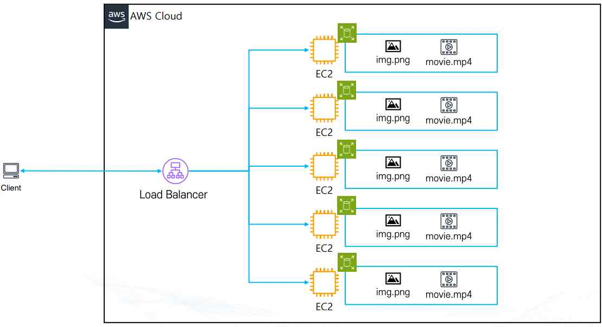
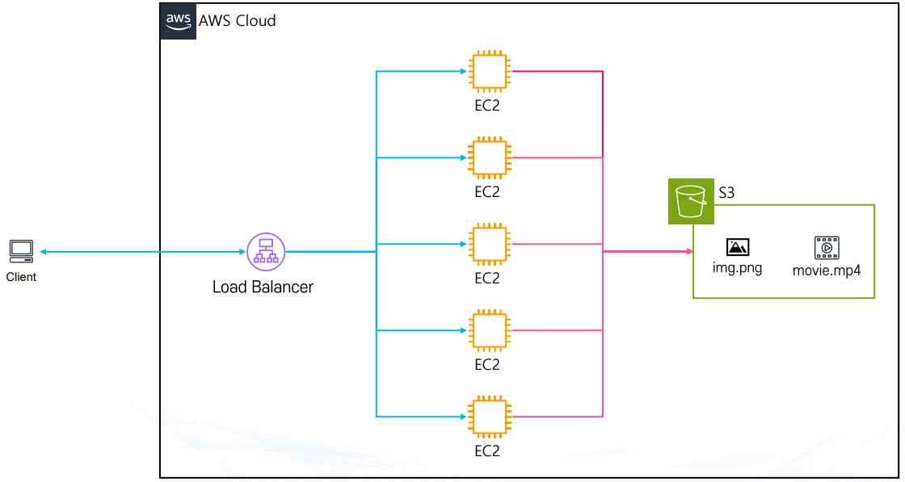
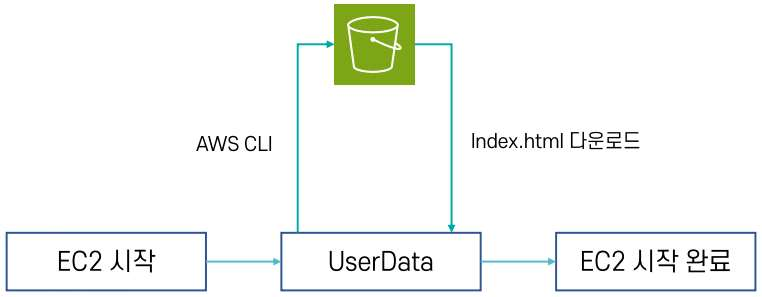
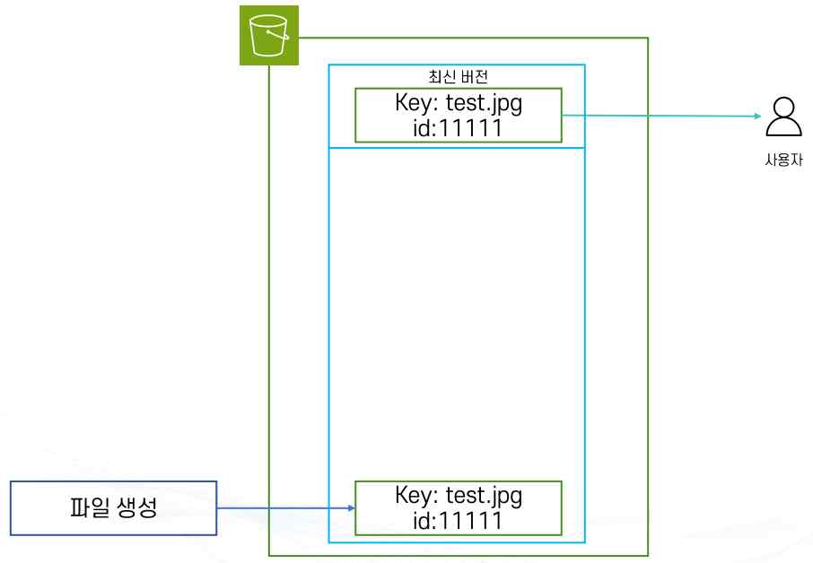
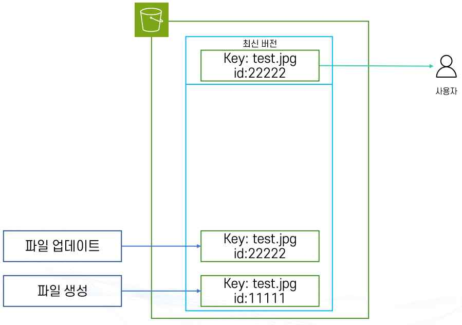
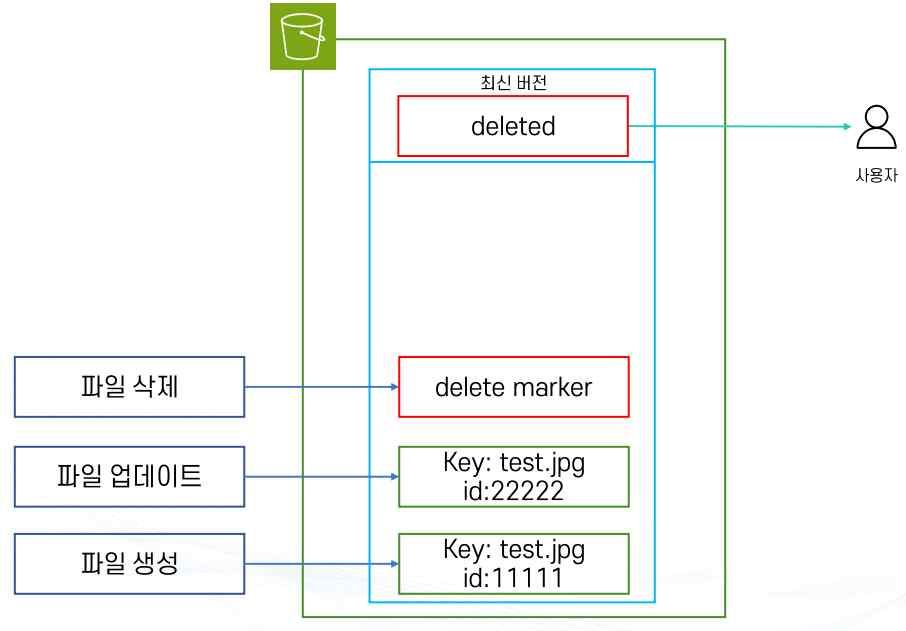
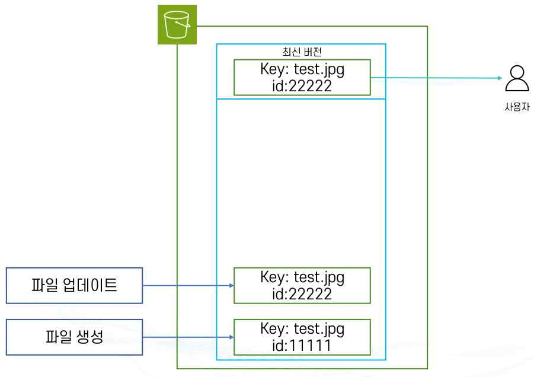
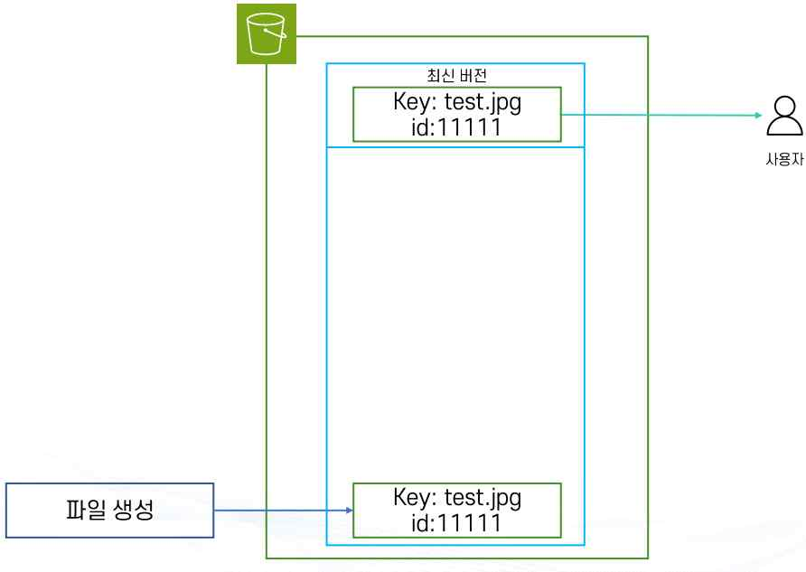
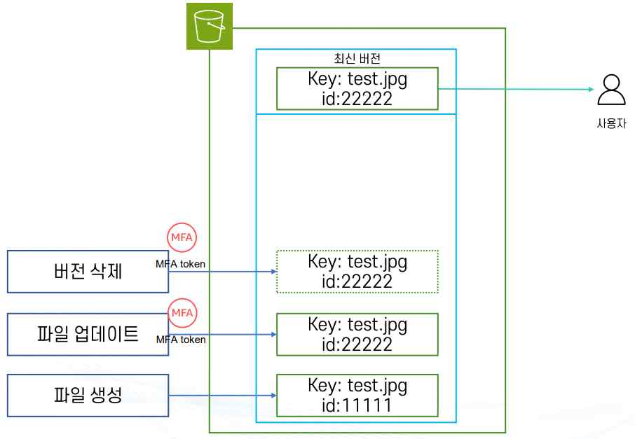

# AWS S3

## 1. Amazon S3(Simple Storage Service) 개요

Amazon S3는 AWS에서 제공하는 객체 스토리지 서비스다. 데이터를 파일 단위(객체)로 저장하고, 필요할 때 인터넷을 통해 어디서든 접근할 수 있다.

**주요 특징**

- **확장성**: 저장 용량에 제한이 없으며, 몇 개의 파일부터 수십억 개의 데이터까지 무제한으로 확장 가능하다.
- **내구성**: 99.999999999%(일명 11 9's) 내구성을 제공하도록 설계되어, 데이터 손실 위험을 최소화한다.
- **가용성**: 전 세계 리전(Region)에 걸쳐 높은 가용성을 제공한다.
- **보안**: IAM, 버킷 정책, 암호화 기능을 통해 데이터 보안을 강화한다.
- **비용 효율성**: 사용한 만큼만 지불하는 종량제(Pay-as-you-go) 모델이다.
- **다양한 스토리지 클래스**: Standard, Intelligent-Tiering, Glacier 등 요구사항에 따라 비용·성능을 최적화할 수 있다.

**활용 사례**: 웹사이트 정적 콘텐츠(HTML, 이미지, 동영상) 저장 및 배포, 백업 및 복구, 로그 저장 및 데이터 레이크 구축, 빅데이터 분석 및 머신러닝 데이터 저장소, 애플리케이션과 모바일 앱의 파일 저장소.

### 파일 스토리지 vs 오브젝트 스토리지

| 구분 | 파일 스토리지(File Storage) | 오브젝트 스토리지(Object Storage) |
|---|---|---|
| 구조 | 계층적 구조(폴더/디렉토리)로 관리 | 오브젝트 단위(데이터 + 메타데이터 + 고유 ID)로 저장 |
| 접근 방식 | 경로를 통해 접근 | 계층 구조가 아닌 ID(키)로 접근 |
| 확장성 | 보통 수십 TB 수준에서 관리(제한적) | 수십~수백 PB 이상 가능(매우 뛰어남) |
| 예시 | 게임 설치 파일, PC 프로그램(로컬 드라이브, NAS) | AWS S3, 구글 드라이브, 네이버 클라우드 |

파일 스토리지는 게임을 설치해서 실행할 수 있는 PC 저장소에 비유할 수 있고, 오브젝트 스토리지는 구글 드라이브처럼 단순 저장·공유는 가능하지만 게임이나 프로그램 설치는 할 수 없는 구조에 비유할 수 있다.

## 2. EC2에 직접 파일을 저장할 때의 문제와 S3를 통한 해결

로드밸런서 뒤에 여러 개의 EC2 인스턴스가 있고 각 EC2에 웹페이지에서 제공할 이미지나 동영상 같은 파일을 저장하는 경우, 모든 인스턴스마다 동일한 파일을 따로 보관해야 하므로 중복 저장이 발생하고 디스크 용량이 낭비된다. 또한 파일을 수정하려면 각 EC2에 일일이 업데이트해야 하므로 인스턴스 수가 늘어나면 관리가 매우 불편해진다.

**문제점**

- **중복 저장**: 같은 파일을 모든 EC2에 저장해야 하므로 디스크 용량이 낭비되고, 인스턴스 수가 늘어나면 용량과 관리 비용이 급격히 증가한다.
- **관리 어려움**: 파일을 변경하려면 모든 EC2에 있는 파일을 각각 수정해야 하며, 인스턴스가 수십·수백 대가 되면 운영 효율이 급격히 떨어진다.



**S3를 활용한 통합 스토리지 방식**

각 EC2 인스턴스는 웹 서버 역할만 담당하고, 정적 파일(이미지, 동영상 등)은 중앙의 Amazon S3 버킷에 저장한다. EC2는 필요할 때 S3에 접근하여 파일을 제공한다.



- **파일 중앙화**: 모든 EC2가 하나의 S3 버킷에서 동일한 파일을 참조하므로 중복 저장이 불필요하다.
- **확장성**: EC2 인스턴스를 수십, 수백 대로 늘려도 파일 관리 부담이 없다.
- **유지보수 용이성**: 파일을 S3에서 한 번만 업데이트하면, 모든 EC2가 동일하게 최신 파일을 서비스한다.
- **비용 절감**: EC2 디스크에는 최소한의 웹 애플리케이션 코드만 두고, 정적 파일은 저렴한 S3에 보관한다.

## 3. 버킷(Bucket)과 객체(Object)

**버킷 기본 개념**

- Amazon S3에서 데이터를 저장하는 가장 기본적인 단위이며, 파일 시스템의 디렉토리·폴더와 유사한 개념이다.
- 모든 객체(Object)는 반드시 하나의 버킷에 속해 저장된다.

**네이밍 규칙과 리전 관계**

- 버킷 이름은 전 세계에서 고유해야 하며, 인터넷 DNS 규칙과 유사한 형식으로 지어야 한다.
- 버킷을 만들 때 특정 리전을 선택해야 하며, 데이터는 해당 리전에 실제로 저장된다. 하지만 버킷 이름 자체는 글로벌 단위에서 유일하게 관리되므로, 서로 다른 리전이라도 같은 이름의 버킷을 만들 수 없다.

**확장성 및 용량**: 사실상 저장 용량에 제한이 없으며, 객체 하나의 크기는 최소 0 Byte부터 최대 5 TB까지 가능하다.

**S3 객체(Object)의 구성 요소**

- **Owner(소유자)**: 이 파일을 만든 사람 또는 계정
- **Key(파일 이름)**: 파일을 구분하는 고유한 이름
- **Value(파일 데이터)**: 실제 저장된 파일의 내용
- **Version Id(버전 아이디)**: 같은 이름의 파일이 여러 버전으로 저장될 때, 각각을 구분하는 번호
- **Metadata(메타데이터)**: 파일 생성일, 형식, 크기 등 추가 정보
- **ACL(Access Control List)**: 이 파일을 누가 읽거나 쓸 수 있는지 정하는 권한 정보
- **Torrents(토렌트 정보)**: 대용량 파일을 여러 사용자와 동시에 빠르게 공유하는 기능(현재는 잘 사용되지 않음)

### S3의 계층 구조는 실제 폴더가 아니다

AWS S3 콘솔에서는 마치 디렉토리(폴더) 구조처럼 보이지만, 내부적으로는 계층 구조가 존재하지 않고 단순히 "키(Key)" 문자열로 관리된다. S3 객체는 항상 버킷 안에 저장되며, 각 객체는 고유한 키 값을 갖는다. 키 안에 `/` 문자가 있으면 콘솔에서 디렉토리처럼 표시될 뿐, 실제 폴더는 아니다.

예를 들어 `s3://mybucket/world/southkorea/seoul/guro/map.json`에서 버킷명은 `mybucket`이고, 키는 `world/southkorea/seoul/guro/map.json`이라는 단일 문자열이다. 콘솔에서는 `/` 기준으로 `world → southkorea → seoul → guro → map.json` 구조처럼 보일 뿐이다.

## 4. S3 보안 설정 개요

- **기본 접근 권한**: 새로 만든 S3 버킷은 기본적으로 Private(비공개) 상태이며, 만든 사람(소유자)만 접근할 수 있다. 필요하다면 설정을 바꿔 특정 사용자나 불특정 다수에게 공개할 수 있다(예: 웹 호스팅 시 이미지 파일 공개).
- **보안 단위**: 버킷 단위는 Bucket Policy로, 객체 단위는 ACL(Access Control List)로 접근 권한을 관리한다.

**보안 기능**

- **MFA 삭제 방지**: MFA(다중 인증)를 활성화하면 실수나 해킹으로 파일이 삭제되는 것을 방지할 수 있다.
- **버전 관리(Versioning)**: 같은 이름의 파일을 여러 버전으로 보관하며, 잘못 저장했을 때 이전 버전으로 복구할 수 있다.
- **액세스 로그 기록**: 누가, 언제, 어떤 요청을 했는지 로그로 남길 수 있으며, 이 로그는 다른 버킷이나 다른 계정으로 전송할 수 있다.

## 5. S3 비용 종류

- **데이터 보관 비용(Storage Cost)**: GB당 요금이 부과된다. (예: Standard 스토리지 기준 1GB당 약 $0.023, 100GB 저장 시 약 월 2.3달러)
- **데이터 요청 비용(Request Cost)**: 파일 업로드(put), 복사(copy), 전송(post), 목록 조회(list) 등 요청 단위로 요금이 발생한다. (보통 1,000번 요청당 약 $0.005)
- **데이터 전송 비용(Transfer Cost)**: S3에서 인터넷으로 데이터를 꺼낼 때(Outbound) GB당 약 $0.09가 부과된다. (예: 10GB 다운로드 시 $0.9) 단, 같은 리전 내 EC2 ↔ S3 간 전송은 무료다.
- **기타 부가 비용**: 서버 측 암호화 사용 시, 수명 주기 정책(Lifecycle Policy) 사용 시, 여러 리전에 복제(Replication) 저장 시 추가 비용이 발생할 수 있다.

EC2 시작 시 사용자 데이터(User Data)에서 AWS CLI로 S3의 파일을 내려받아 배포하는 흐름은 다음과 같다.



## 6. S3 스토리지 클래스

S3는 저장 목적과 예산에 따라 파일 저장 클래스(File Storage Classes)와 아카이브 클래스(Archive Storage Classes)로 나뉜다.

### 파일 저장 클래스(File Storage Classes)

주로 실시간 서비스 운영용으로, 데이터를 밀리초 단위로 바로 읽고 쓸 수 있으며 다중 AZ에 복제 저장되어 높은 내구성과 가용성을 보장한다(저장 비용은 상대적으로 높음). 오른쪽으로 갈수록 저렴해지는 순서는 `S3 Express One Zone → S3 Standard → S3 Standard-IA → S3 One Zone-IA`이다.

| 클래스 | 특징 | 저장 비용(ap-northeast-2 기준) |
|---|---|---|
| S3 Standard | 가용성 99.99%, 내구성 11 9's, 최소 3개 AZ 분산 보관, 보관 기간·용량 제한 없음 | $0.025/GB |
| S3 Standard-IA | 자주 사용되지 않는 데이터용, 최소 저장 용량 128KB, 최소 저장 기간 30일, 조회 시 비용 발생 | $0.0138/GB |
| S3 One Zone-IA | 단일 AZ에만 보관(AZ 장애 시 데이터 손실 가능), 최소 저장 용량 128KB, 최소 저장 기간 30일 | $0.011/GB |
| S3 Express One Zone | 단일 AZ의 특별한 저장소, 밀리초 단위 응답(약 10배 빠름), 요청 비용 50% 저렴, 몇몇 리전만 지원(서울 리전 미지원) | $0.16/GB(us-east-1 기준) |
| S3 Intelligent-Tiering | 접근 패턴을 분석해 Standard ↔ IA 간 자동 전환, 성능 저하 없이 비용 최적화 | 접근 빈도에 따라 자동 적용 |

### 아카이브 클래스(Archive Storage Classes)

장기 보관용 데이터 대상으로 저장 비용이 매우 저렴하지만, 데이터를 꺼내려면 검색 요청 과정이 필요하다(몇 분~수 시간). 오른쪽으로 갈수록 저렴해지는 순서는 `S3 Glacier Instant Retrieval → S3 Glacier Flexible Retrieval → S3 Glacier Deep Archive`이며, 의료 기록·금융/세무 자료·법적 규제 데이터·장기 백업처럼 수년간 거의 사용하지 않지만 반드시 보관해야 하는 데이터에 적합하다.

| 클래스 | 최소 저장 기간 | 접근 속도 | 저장 비용(ap-northeast-2 기준) |
|---|---|---|---|
| S3 Glacier Instant Retrieval | 90일 | 밀리초 단위(즉시 액세스, 아카이브 계열 중 가장 빠름) | $0.005/GB |
| S3 Glacier Flexible Retrieval | 90일 | 분~시간 단위(검색 요청 필요) | $0.0045/GB |
| S3 Glacier Deep Archive | 180일 | 12~48시간 소요 | $0.002/GB |

**제약 사항(Waterfall 모델)**: 시간이 지남에 따라 데이터를 점점 더 저렴한 티어로 이동시킬 수 있지만(`Standard → IA → Glacier → Glacier Deep Archive`), 다른 클래스에서 다시 Standard로 되돌리는 전환은 불가능하다. 128KB 미만 파일은 Standard-IA, Intelligent-Tiering, Glacier Instant Retrieval로 이동할 수 없다.

## 7. S3 권한

Amazon S3에서 권한(permissions)은 누가 어떤 작업을 어떤 객체(Object)나 버킷(Bucket)에 대해 수행할 수 있는지를 정의하는 보안 메커니즘이다. 크게 세 가지로 나뉜다.

- **IAM 정책**: IAM 사용자, 그룹, 역할에게 권한을 주는 방식(예: "이 사용자는 S3 버킷 안에서 파일을 읽기만 할 수 있다")
- **버킷 정책(Bucket Policy)**: 버킷 자체에 적용하는 권한 설정으로, 특정 사용자나 계정이 해당 버킷을 읽거나 쓸 수 있도록 허용·거부할 수 있다(예: "협력사 계정만 이 버킷 안 파일을 다운로드할 수 있다")
- **ACL(Access Control List)**: 객체나 버킷 단위로 권한을 주는 옛날 방식으로, 지금은 거의 쓰지 않고 IAM 정책이나 버킷 정책을 주로 사용한다(AWS 비권장)

### 버킷 정책(Bucket Policy) 구조

버킷 정책은 버킷 단위로 부여되는 리소스 기반 정책(Resource-based Policy)이다. 모든 S3 버킷은 기본적으로 Private이므로, 정책을 설정하지 않으면 외부에서 접근할 수 없다.

```json
{
  "Version": "2012-10-17",
  "Statement": [
    {
      "Sid": "AllowEveryoneGetObject",
      "Effect": "Allow",
      "Principal": "*",
      "Action": "s3:GetObject",
      "Resource": "arn:aws:s3:::my-bucket/*"
    }
  ]
}
```

- **누가(Principal)**: 모든 사용자(`*`)
- **무엇을(Action)**: `s3:GetObject`(객체 다운로드)
- **어디서(Resource)**: `my-bucket` 버킷의 모든 객체(`/*`)
- **결과(Effect)**: 허용(Allow)

즉, 이 정책은 "모든 사람이 `my-bucket` 안에 있는 파일을 다운로드할 수 있다"는 의미다. 리소스의 계층 구조(Key 경로)에 따라 `"Resource": "arn:aws:s3:::my-bucket/images/*"`처럼 특정 폴더 이하 객체에만 세부적으로 권한을 부여할 수도 있다.

**Principal 표기법**

| Principal 값 | 의미 |
|---|---|
| `*` | 전 세계 모든 사용자에게 허용 |
| `arn:aws:iam::<계정ID>:root` | 해당 계정에 속한 모든 사용자·역할을 포함(계정 전체) |
| `arn:aws:iam::<계정ID>:user/admin` | 해당 계정의 `admin`이라는 이름을 가진 IAM 사용자만 |
| `arn:aws:iam::<계정ID>:role/RoleName` | 해당 계정의 특정 `RoleName` 역할만 |

### 실습: 콘솔에서 버킷 정책 만들기

1. Amazon S3 콘솔에서 [버킷 만들기]를 선택하고, 리전과 버킷 이름을 지정한다. 객체 소유권은 [ACL 비활성화됨(권장)]으로 둔다.
2. 생성한 버킷을 선택하고 [권한] 탭으로 이동한다.
3. [버킷 정책] 섹션에서 [편집]을 선택한다.
4. JSON을 직접 작성하거나, 정책 생성기(Policy Generator)를 사용해 Effect·Principal·Action·Resource를 입력한 뒤 [Add Statement]로 목록에 추가하고 [Generate Policy]로 JSON을 생성한다.
5. 생성된 JSON을 붙여넣고 저장하면 버킷 정책이 적용된다. 퍼블릭 액세스 차단 설정이 활성화되어 있으면 퍼블릭 권한을 부여하는 정책이 무시되므로, 공개가 필요하다면 퍼블릭 액세스 차단 설정도 함께 확인한다.

### 주요 S3 액션(Action) 목록

- **Get 계열(조회/읽기)**: `s3:GetObject`(객체 다운로드), `s3:GetObjectAcl`, `s3:GetObjectTagging`, `s3:GetObjectVersion`, `s3:GetBucketAcl`, `s3:GetBucketPolicy`, `s3:GetBucketLocation`, `s3:GetLifecycleConfiguration`, `s3:GetEncryptionConfiguration`
- **Put 계열(생성/수정)**: `s3:PutObject`(객체 업로드), `s3:PutObjectAcl`, `s3:PutObjectTagging`, `s3:PutBucketAcl`, `s3:PutBucketPolicy`, `s3:PutLifecycleConfiguration`, `s3:PutReplicationConfiguration`, `s3:PutEncryptionConfiguration`
- **Delete 계열(삭제)**: `s3:DeleteObject`, `s3:DeleteObjectTagging`, `s3:DeleteObjectVersion`, `s3:DeleteBucket`, `s3:DeleteBucketPolicy`, `s3:DeleteLifecycleConfiguration`, `s3:DeleteReplicationConfiguration`
- **List 계열(목록 보기)**: `s3:ListBucket`(버킷 안 객체 목록 조회), `s3:ListAllMyBuckets`, `s3:ListBucketVersions`, `s3:ListBucketMultipartUploads`
- **Create/Update 계열**: `s3:CreateBucket`, `s3:CreateAccessPoint`, `s3:CreateJob`, `s3:UpdateJobPriority`, `s3:UpdateAccessPoint`, `s3:UpdateStorageLensConfiguration`

**ARN 예시**: `arn:aws:s3:::my-bucket/*`는 버킷 안의 모든 객체를, `arn:aws:s3:::my-bucket/upload/*`는 버킷 안에서 키가 `upload/`로 시작하는 모든 객체(폴더처럼 보이는 접두사)를 가리킨다.

### 실습: IAM 사용자 이름 기반 홈 디렉토리 만들기

`${aws:username}` 정책 변수를 사용하면, 로그인한 IAM 사용자 이름과 동일한 경로에만 접근을 허용하는 "나만의 S3 홈 디렉토리"를 만들 수 있다.

```json
{
  "Version": "2012-10-17",
  "Statement": [
    {
      "Sid": "ListSpecificBucket",
      "Effect": "Allow",
      "Principal": "*",
      "Action": "s3:ListBucket",
      "Resource": "arn:aws:s3:::my-bucket-home",
      "Condition": {
        "StringLike": {
          "s3:prefix": [
            "",
            "home/",
            "home/${aws:username}/*"
          ]
        }
      }
    },
    {
      "Sid": "FullAccessToUserHome",
      "Effect": "Allow",
      "Principal": "*",
      "Action": "s3:*",
      "Resource": [
        "arn:aws:s3:::my-bucket-home/home/${aws:username}",
        "arn:aws:s3:::my-bucket-home/home/${aws:username}/*"
      ]
    }
  ]
}
```

- 첫 번째 문(`ListSpecificBucket`)은 `s3:ListBucket`(버킷 내부 객체 목록 조회)을 버킷 최상위 경로, `home/` 경로, 그리고 자신의 사용자 이름과 동일한 `home/${aws:username}/` 경로로만 제한한다.
- 두 번째 문(`FullAccessToUserHome`)은 자신의 `home/${aws:username}` 경로와 그 하위 객체 전체에 대해서만 모든 S3 작업(`s3:*`)을 허용한다.
- 결과적으로 IAM 사용자별로 자신의 홈 디렉토리 바깥은 조회조차 할 수 없고, 자신의 홈 디렉토리 안에서는 자유롭게 파일을 다루는 구조가 만들어진다. 이 정책은 실제 운영 시 `Principal`을 `*` 대신 특정 IAM 사용자·역할로 좁혀서 사용해야 안전하다.

## 8. S3 버전 관리(Versioning)

S3 객체의 변경 이력을 여러 버전으로 저장하는 기능이다. 같은 Key 이름의 객체를 다시 업로드해도 기존 객체를 덮어써서 없애는 것이 아니라, 새로운 Version ID를 가진 객체 버전으로 저장한다. 객체를 삭제해도 기존 버전이 바로 삭제되는 것이 아니라 Delete Marker가 생성되어 현재 객체가 삭제된 것처럼 보이게 되며, 이전 버전이 남아 있기 때문에 실수로 삭제하거나 덮어쓴 객체를 복구할 수 있다.

**활성화 조건과 제약**

- 버킷 단위로 설정하며 기본값은 비활성화 상태다.
- 한 번 활성화하면 완전히 비활성화 상태로 되돌릴 수 없다. 필요하면 Suspend(중지) 상태로 변경할 수 있으며, Suspend 상태에서는 기존 버전은 유지되지만 이후 새 객체에 대한 일반적인 버전 생성은 중지된다.
- 버전 관리 활성화 이전에 저장된 기존 객체도 그대로 유지되며, 처음에는 별도의 Version ID가 없는 null 버전으로 존재할 수 있다.
- 동일한 Key의 객체라도 버전별로 각각 저장되므로 저장 공간 사용량과 비용이 증가할 수 있다. (예: 10GB짜리 객체의 버전이 5개라면 실제 사용량은 50GB로 계산되어 요금이 청구된다.)

**동작 예시**

1. `test.jpg`를 처음 업로드하면 버전 ID `11111`이 생성되고 최신 버전이 되어 사용자 요청 시 `11111`이 반환된다.



2. 같은 키로 다시 업로드하면 새 버전 ID `22222`가 생성되어 최신 버전이 되고, 기존 `11111`은 과거 버전으로 남는다.



3. 삭제를 수행하면 실제 데이터를 지우지 않고 Delete Marker가 최신 버전으로 추가되어 객체가 없는 것처럼 보이지만, 과거 버전 `22222`와 `11111`은 그대로 남아 복원할 수 있다.



4. Delete Marker만 제거하면 삭제 상태가 해제되어 바로 아래 버전인 `22222`가 최신으로 복원된다.



5. 별도로 버전 ID를 지정하지 않으면 항상 최신 버전이 반환되며, 특정 과거 버전을 받으려면 해당 버전 ID를 명시해야 한다.
6. 버전 ID를 지정해 과거 버전 하나만 영구 삭제할 수 있으며, 최신 버전이 아닌 경우 사용자에게 보이는 결과는 변하지 않는다.
7. 최신 버전(`22222`)을 삭제하면 바로 아래 버전(`11111`)이 자동으로 최신이 되어 과거 상태로 롤백된다.



8. **MFA Delete**: 버전 삭제나 삭제 마커 제거 같은 민감한 작업에 MFA 토큰을 요구하도록 설정하면 오남용이나 계정 탈취로 인한 대량 삭제를 효과적으로 방지할 수 있다. MFA Delete는 일반적인 콘솔 설정만으로는 활성화할 수 없고, 버킷 소유자 Root 계정과 AWS CLI/API 등을 통해 설정해야 한다.



**Lifecycle 규칙과 연동**: 오래된 이전 버전을 다른 스토리지 클래스로 이동하거나, 일정 기간이 지난 이전 버전(및 Delete Marker)을 자동 삭제할 수 있다(예: 90일이 지난 이전 버전을 삭제하거나 Glacier 계열로 이동).

**운영 상 고려할 점**: 개발 환경에서는 불필요하게 활성화하지 않는 것이 좋고, 운영 환경에서는 데이터 보호가 중요하므로 활성화 후 Lifecycle 규칙으로 비용을 통제하는 것이 바람직하다.

## 9. S3 객체 잠금(Object Lock)

S3 객체를 삭제하거나 덮어쓰지 못하도록 보호하는 기능으로, WORM(Write Once, Read Many) 모델을 지원한다. 한 번 저장한 객체를 지정된 기간 동안 변경하거나 삭제하지 못하도록 보호하며, 데이터 무결성 유지와 규제 준수, 랜섬웨어·실수·내부자의 악의적인 삭제로부터 중요 데이터를 보호하는 데 사용한다.

**활성화 조건**: S3 Object Lock은 Versioning이 활성화된 버킷에서만 사용할 수 있으며, 객체의 특정 버전(Version)을 보호하는 방식으로 동작한다. 버킷에 기본 보존 정책(Default Retention)을 설정할 수도 있고, 객체별로 별도의 보존 정책을 설정할 수도 있다.

**보호 방식**

- **Retention Mode**: 지정된 기간 동안 객체를 삭제하지 못하도록 보호한다.
  - **Compliance Mode**: 가장 강력한 보호 방식. 보존 기간이 끝날 때까지 객체 버전을 삭제할 수 없고, 보존 기간을 단축하거나 잠금을 해제할 수 없다. Root 사용자를 포함해 누구도 보존 설정을 우회할 수 없다(예: 금융 거래 기록 7년 의무 보관, 의료 데이터·감사 기록 보관).
  - **Governance Mode**: 일반 사용자·관리자에게는 객체 삭제가 제한되지만, `s3:BypassGovernanceRetention` 권한을 가진 사용자는 보존 설정을 우회할 수 있다. Compliance Mode보다 유연하며 내부 데이터 보호 정책이나 테스트 환경에 적합하다.
- **Legal Hold**: 종료 날짜를 지정하지 않고, Hold가 해제될 때까지 객체를 무기한 보호한다. Retention Mode와 독립적으로(또는 동시에) 적용할 수 있다. 법적 분쟁 관련 자료, 감사 대응 자료, 내부 조사 대상 데이터처럼 삭제 시점을 미리 정할 수 없는 중요 데이터 보호에 사용한다.

## 10. Amazon S3 수명 주기(Lifecycle)

많은 버전과 오래된 파일이 쌓이면 관리가 어려워지므로, 일정 기간이 지나면 객체(Object)의 상태를 자동으로 변경하거나 정리하는 기능이 S3 수명 주기다. 스토리지 비용 최적화와 데이터 보존 정책 준수를 위해 사용한다.

**작업 유형**

- **전환 작업(Transition actions)**: 객체를 더 저렴한 스토리지 티어로 이동한다. (예: 30일 후 Glacier로 이동, 50일 후 Standard-IA로 이동)
- **만료 작업(Expiration actions)**: 객체를 자동 삭제한다. (예: 업로드 후 90일 지난 로그 파일 자동 삭제)

수명 주기 규칙은 기존 객체뿐 아니라 이미 저장된 오래된 객체에도 소급 적용된다. 예를 들어 "30일 후 만료" 규칙을 설정하면 이미 30일 이상 된 모든 객체도 동시에 삭제 처리된다.

**만료 작업의 세부 동작**

- 버전 관리가 비활성화된 버킷은 객체가 비동기(async) 방식으로 영구 삭제된다.
- 버전 관리가 활성화된 버킷은, 현재 버전이 Delete Marker가 아니면 새로운 Delete Marker를 추가해 최신 버전으로 표시하고, 현재 버전이 이미 Delete Marker라면 아무 동작도 하지 않는다.
- 삭제 날짜가 되더라도 즉시 삭제되지 않고 일정 지연(delay)이 발생할 수 있으며, 이 지연 동안에는 스토리지 비용이 추가로 발생하지 않는다.
- Lifecycle 규칙은 UTC 기준으로 실행되며, 첫 번째 규칙 수행까지 최대 약 48시간 정도 소요될 수 있다.

**필터링 조건**: 수명 주기 정책은 버킷 전체에 적용할 수도 있지만, 필터를 이용하면 특정 객체만 선별 적용할 수 있다.

- **Prefix(접두사) 기반**: 객체 키의 시작 문자열 기준(예: `/log`는 로그 파일만, `/image/thumbnails`는 썸네일 이미지에만 정책 적용)
- **Tag 기반**: 객체에 붙은 태그(Key=Value) 기준. 조건은 AND로 묶을 수 있다(예: `Environment=Dev` 태그가 붙은 객체만 삭제, `Project=A AND Backup=True` 태그가 모두 있는 경우만 Glacier로 전환)
- **객체 크기 기반**: 객체 크기를 조건으로 정책을 적용한다(예: 5MB 이상 파일만 IA로 이동, 1GB 이상 대형 객체만 Glacier로 전환)
- 위 조건들은 Prefix + Tag + Size처럼 함께 조합할 수도 있다.

**날짜 기반 조건**: 특정 날짜를 기준으로 모든 객체에 일괄 적용할 수도 있다. 단, 콘솔에서 직접 설정은 불가능하며 API나 CLI로만 지정할 수 있다.

## 11. S3 정적 웹 호스팅(Static Hosting)

### 정적 콘텐츠 vs 동적 콘텐츠

**정적 콘텐츠(Static Contents)**는 사용자나 요청 조건에 관계없이 동일한 내용이 제공되는 콘텐츠다. 서버에서 별도의 프로그램 연산이나 데이터베이스 조회 없이 저장된 파일을 그대로 전달하며, HTML·CSS·JavaScript·이미지·동영상 등으로 구성된다. 서버 처리 과정이 적어 빠르게 제공할 수 있고 CDN·Cache와 연계하면 성능을 더 높일 수 있지만, 콘텐츠 변경 시 파일을 직접 수정·재배포해야 하고 사용자별 맞춤형 콘텐츠 제공에는 제한이 있다(예: 회사 소개 페이지, 안내 페이지).

**동적 콘텐츠(Dynamic Contents)**는 사용자·시간·입력값·데이터베이스 상태 등에 따라 제공되는 내용이 달라지는 콘텐츠다. 요청할 때마다 서버가 프로그램을 실행하거나 데이터베이스를 조회해 결과를 생성하며(PHP, JSP, ASP.NET, Spring, Node.js 등으로 구현), 사용자 맞춤형 서비스와 실시간 데이터 반영이 가능하지만 서버 부하가 늘고 응답 속도가 느려질 수 있다(예: 로그인 후 사용자 정보, 게시판·댓글, 쇼핑몰 장바구니, 실시간 재고·가격 정보).

### Amazon S3 Static Hosting

Amazon S3 버킷을 이용해 정적 웹 콘텐츠(HTML, CSS, JS, 이미지 등)를 직접 웹 사이트처럼 호스팅하는 기능이다. 별도의 서버(EC2 등)를 두지 않아도 정적 웹페이지를 제공할 수 있다.

**사용 사례**: 대규모 접속이 예상되는 이벤트·사전 예약 페이지, 단순 홍보용 랜딩 페이지, 회사 소개 웹사이트

**장점**

- **고가용성·장애 내구성**: S3는 AWS가 관리하는 서비스라서 안정적이고 항상 접속 가능하다.
- **Serverless 구조**: 서버를 직접 운영할 필요가 없고, 사용한 만큼만 비용을 지불하며, 파일만 업로드·수정하면 즉시 반영된다.

**제약사항**: 기본적으로는 도메인 주소 변경과 HTTPS가 불가능하다. 단, Route 53(도메인 서비스)이나 CloudFront(콘텐츠 전송 네트워크)와 연동하면 도메인 연결과 HTTPS 적용이 가능하다. Route 53을 사용해 도메인을 연결하려면 버킷 이름과 도메인 이름이 동일해야 한다는 점에 주의한다.

퍼블릭으로 정적 사이트를 공개하려면 버킷 정책으로 `s3:GetObject`를 모든 사용자(`*`)에게 허용해야 한다(7. S3 권한 섹션의 버킷 정책 예시 참고).

## 12. AWS S3 기타 기능

### Amazon S3 액세스 로깅(Access Logging)

특정 버킷에 대한 접근 기록(누가, 언제, 어떤 요청을 했는지)을 남기고, 이 로그를 다른 S3 버킷에 저장하는 기능이다. 기록할 대상 버킷과 로그를 저장할 별도의 버킷을 반드시 분리해서 설정해야 하며, 같은 버킷 안에 로그를 저장하면 로그가 자기 자신을 계속 기록하는 무한 로그 파일 생성 문제가 발생할 수 있다. 로그에는 요청 시간, 요청자 IP, 요청 방식(GET, PUT 등), 요청 성공·실패 여부 등이 기록되며, 보안 감사(의심스러운 접근 탐지)·트래픽 분석·문제 해결(오류 원인 추적)에 활용할 수 있다.

### Amazon S3 이벤트 알림(Event Notification)

S3 버킷 안에서 객체(Object)가 생성·삭제·수정되는 이벤트가 발생했을 때, 이를 자동으로 감지하고 다른 AWS 서비스(SNS, SQS, Lambda 등)로 알림을 보내는 기능이다.

**실습: S3 업로드 이벤트로 Lambda 이미지 리사이저 실행**

S3 버킷에 이미지가 업로드되는 이벤트를 트리거로 Lambda 함수를 실행해, 이미지를 리사이징한 뒤 같은 버킷의 `resized/` 경로에 저장하는 예시다.

```javascript
const { S3Client, GetObjectCommand, PutObjectCommand } = require('@aws-sdk/client-s3');
const sharp = require('sharp');

// Lambda 배포 전 sharp는 Lambda 실행 환경(Linux x64)에 맞춰 설치해야 한다.
// npm install --platform=linux --arch=x64 sharp

const s3Client = new S3Client();

exports.handler = async (event) => {
  const srcBucket = event.Records[0].s3.bucket.name;
  const srcKey = decodeURIComponent(event.Records[0].s3.object.key.replace(/\+/g, ' '));

  const typeMatch = srcKey.match(/\.([^.]*)$/);
  if (!typeMatch) return; // 확장자를 알 수 없으면 종료

  const imageType = typeMatch[1].toLowerCase();
  if (imageType !== 'jpg' && imageType !== 'png') return; // 지원하지 않는 형식은 종료

  const origImageResponse = await s3Client.send(
    new GetObjectCommand({ Bucket: srcBucket, Key: srcKey })
  );
  const origImage = await streamToBuffer(origImageResponse.Body);

  const width = parseInt(process.env.width) || 200;
  const height = parseInt(process.env.height) || 200;
  const buffer = await sharp(origImage).resize(width, height).toBuffer();

  await s3Client.send(
    new PutObjectCommand({
      Bucket: srcBucket,
      Key: `resized/${srcKey}`,
      Body: buffer,
      ContentType: 'image',
    })
  );
};

const streamToBuffer = (stream) =>
  new Promise((resolve, reject) => {
    const chunks = [];
    stream.on('data', (chunk) => chunks.push(chunk));
    stream.on('end', () => resolve(Buffer.concat(chunks)));
    stream.on('error', reject);
  });
```

- Lambda 함수의 환경 변수 `width`, `height`로 썸네일 크기를 조절할 수 있다(기본값 200x200).
- 원본과 리사이징된 파일을 같은 버킷에 두되 `resized/` 접두사로 구분했으므로, 이 Lambda가 자기 자신이 만든 `resized/` 객체를 다시 트리거하지 않도록 S3 이벤트 알림 설정에서 접두사 필터(예: 원본 업로드 경로만 트리거)를 지정해야 한다. 그렇지 않으면 리사이징 결과물이 다시 이벤트를 발생시켜 무한 루프에 빠질 수 있다.
- 활용 예: 보안 검사(새 파일 업로드 시 Lambda로 바이러스·무결성 검사), 알림 서비스(새 파일 추가 시 SNS로 관리자 알림), 비동기 처리(대량 업로드 이벤트를 SQS 큐에 쌓아 순차 처리)

> 관련: 이론 2.  AWS EC2 - 배포 · 이론 3.  AWS VPC
