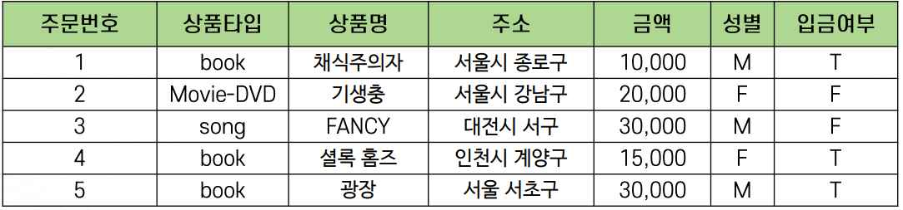
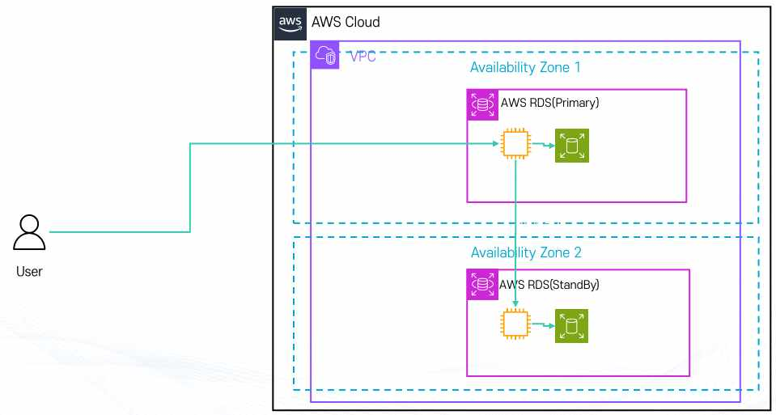
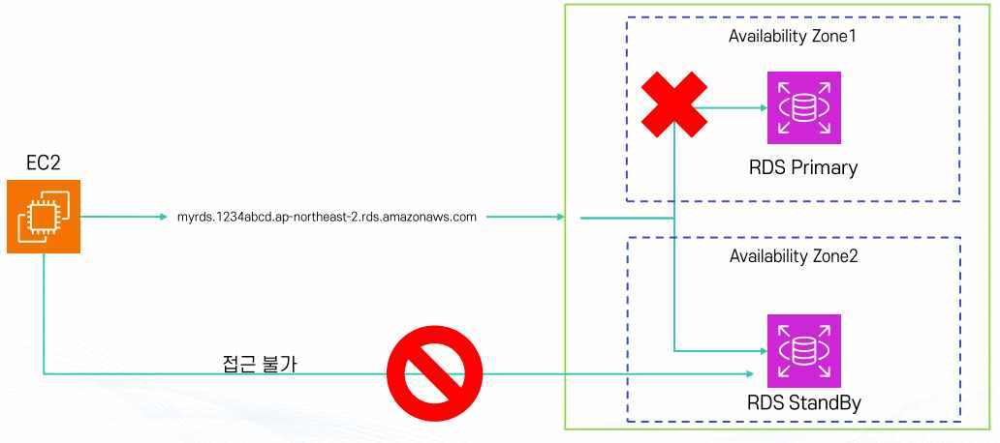
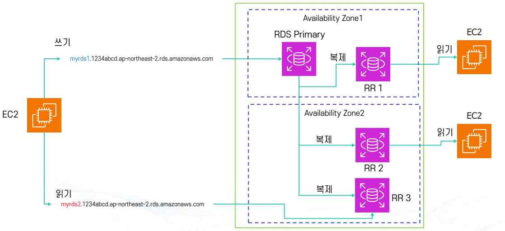
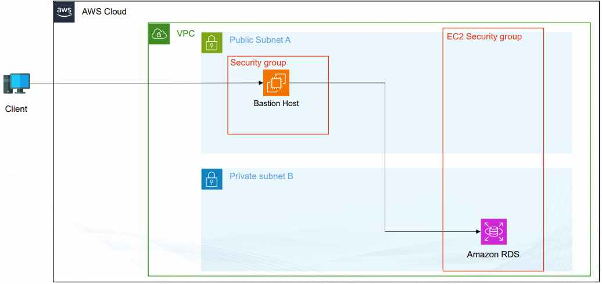
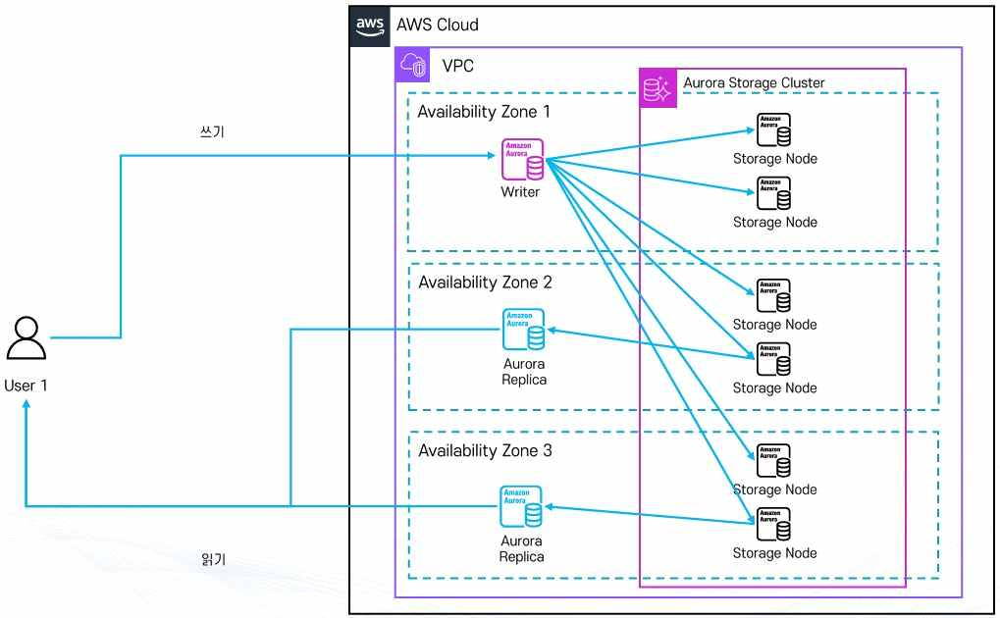
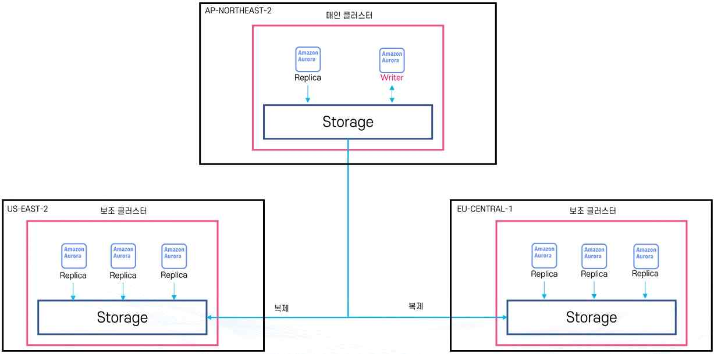
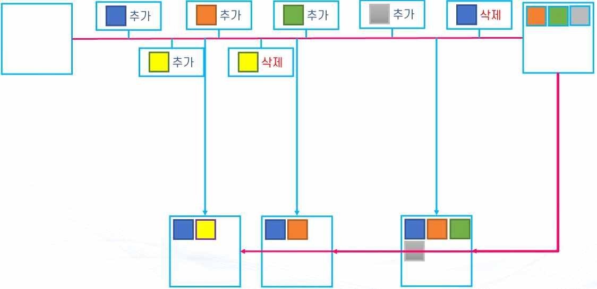

# AWS RDS

## 1. RDB(Relational Database) 개요

RDB(관계형 데이터베이스)는 데이터 간의 관계에 집중하는 데이터베이스로, 사전에 정의된 구조(스키마)에 따라 데이터를 저장한다. 엑셀처럼 행(Row)과 열(Column) 형태로 구성된 테이블 단위로 데이터를 관리한다.

**특징**

- **스키마 기반 저장**: 미리 데이터의 형식(숫자, 문자, 날짜 등)을 정의하고, 정의된 형식에 맞는 데이터만 입력할 수 있다.
- **테이블 간 관계 정의**: 여러 테이블을 연결(Join)해서 데이터를 활용할 수 있다. (예: 회원 테이블 + 주문 테이블 → 어떤 회원이 어떤 상품을 샀는지 확인)
- **고유한 키(Primary Key)로 데이터 식별**: 각 행을 구분하는 고유값이 필요하다(예: 주민번호, 회원 ID).
- **트랜잭션 지원(ACID 특성)**: 원자성(Atomicity, 작업은 전부 성공하거나 전부 실패), 일관성(Consistency, 정의된 규칙을 항상 지킴), 격리성(Isolation, 여러 사용자가 동시에 접근해도 충돌 없음), 지속성(Durability, 한번 저장된 데이터는 시스템 장애에도 보존)

**장점**: 데이터 구조가 명확하고 규칙에 맞게 관리되어 신뢰성이 높다. SQL이라는 표준 언어로 검색·추가·수정·삭제가 가능하며, 안정적이고 중요한 데이터 처리에 적합하다.

**단점**: 새로운 데이터 형식을 추가하려면 스키마 수정이 필요해 유연성이 떨어지고, 대규모 데이터(빅데이터) 처리에는 속도가 느릴 수 있다.

**사용 사례**: 은행·쇼핑몰·병원 같은 업무 시스템, 온라인 게임(회원 정보·아이템·결제 내역 관리), 일반적인 기업용 애플리케이션.

**대표적인 관계형 DBMS**

- Oracle(대규모 기업용), MySQL(오픈소스, 웹 서비스에 많이 사용), PostgreSQL(강력한 기능, 오픈소스), MS SQL Server(마이크로소프트 환경에 최적화)
- Amazon RDS는 AWS에서 관리형으로 제공하는 RDB 서비스로, MySQL·PostgreSQL 등과 연동된다. Oracle·MS SQL Server 엔진은 RDS 사용료에 추가로 라이선스 비용이 더해서 과금된다.

**테이블 구조**: 행(Row)은 하나의 데이터 단위(예: 주문 1건), 열(Column)은 데이터 속성(예: 주문번호, 상품명, 금액)이다. 같은 열에는 반드시 같은 타입의 데이터가 들어가며(금액 열에는 숫자만, 상품명 열에는 문자만), 행 하나는 완전한 데이터 단위이고, 여러 행이 모여 하나의 테이블을 구성한다.



## 2. AWS RDS(Relational Database Service) 개요

RDS는 AWS에서 제공하는 관리형 관계형 데이터베이스 서비스다. 사용자는 직접 서버를 설치하거나 운영하지 않고도 클라우드에서 손쉽게 DB를 생성·설정·운영·확장할 수 있다. MySQL, PostgreSQL, MariaDB, Oracle, SQL Server, Amazon Aurora 등 다양한 DB 엔진을 지원한다.

**RDS의 장점**

- **운영 자동화**: 하드웨어 프로비저닝, OS 패치, DB 설치, 보안 패치, 백업 등 반복적인 관리 작업을 AWS가 자동으로 처리해, 관리자는 애플리케이션 개발에 집중할 수 있다.
- **비용 효율성**: 사용한 만큼 지불하는(Pay-as-you-go) 모델로 운영·관리 인력 비용을 절감한다.
- **확장성**: 필요 시 인스턴스 크기 변경, 스토리지 용량 확장이 가능하고, 읽기 전용 복제본(Read Replica)으로 읽기 성능을 향상할 수 있다.
- **고가용성 및 안정성**: Multi-AZ 배포 시 장애가 발생해도 자동 장애조치(Failover)가 이루어지고, 자동 백업과 스냅샷을 통해 시점 복구(Point-in-Time Restore)가 가능하다.
- **보안**: 데이터 암호화(KMS)를 지원하고, TLS 통신으로 전송 구간을 암호화하며, IAM과 통합해 접근을 제어한다.

**특징**

- 관계형 데이터베이스 기반이라 SQL을 사용할 수 있다(DynamoDB·DocumentDB·ElastiCache 같은 NoSQL과 대비된다).
- 가상 머신 위에서 동작하지만 직접 시스템에 로그인할 수는 없고, OS 관리·패치 등은 AWS가 담당한다.
- Serverless는 아니다(단, Amazon Aurora는 Aurora Serverless라는 별도의 서버리스 DB를 제공한다).

**사용 사례**: 기업용 ERP·CRM 시스템, 온라인 쇼핑몰·금융 서비스, 온라인 게임(회원 정보·결제 내역 관리), 데이터 분석 및 BI 도구와의 연계.

## 3. RDS와 EC2

Amazon RDS는 내부적으로 EC2 인스턴스 위에서 동작한다. 즉, 직접 EC2에 DB를 설치하지 않아도 AWS가 대신 EC2 + DB 환경을 관리해주는 형태다.

**동작 환경**

- VPC(가상 네트워크) 안에서 실행되며, 기본적으로 Public IP가 없으면 외부 접근이 불가능하다. Public IP를 부여하거나 DNS를 통해 인터넷에서 접근할 수 있게 설정할 수 있다.
- 접근을 위해서는 반드시 서브넷과 보안 그룹 설정이 필요하다.

**EC2 타입과 스토리지**: RDS도 결국 EC2 인스턴스 위에서 돌아가기 때문에 인스턴스 타입 지정이 필요하다(예: `db.t3.micro`, `db.m5.large`). 스토리지는 EBS(Elastic Block Store)를 사용하며, EBS 종류(범용 SSD, 프로비저닝 IOPS SSD 등)와 용량을 선택할 수 있다.

**운영 관련**: 중지는 가능하지만 중지 후 7일 이내에 다시 시작해야 한다(7일이 지나면 자동으로 다시 시작된다). 자동 백업 및 스냅샷 생성 기능을 제공해 데이터 복구가 용이하다.

**비용 최적화**: 온디맨드(사용한 만큼 지불) 외에 리저브드 인스턴스를 활용하면 1년·3년 등 일정 기간을 약정해 최대 70% 할인을 받을 수 있다.

## 4. RDS의 고가용성 아키텍처(Multi-AZ, Primary & Standby)

- **Primary DB(주 DB)**: 사용자가 직접 접속하는 메인 데이터베이스로, 모든 읽기·쓰기 요청을 처리한다. 흔히 "RDS 인스턴스"라고 부르는 것이 이 Primary DB다.
- **Standby DB(대기 DB)**: 별도의 가용영역(AZ)에 위치하며 평상시에는 사용자 요청을 처리하지 않는다. Primary DB에서 발생하는 데이터 변경 사항을 실시간으로 동기화한다.



- **장애 발생 시 동작**: Primary DB에 장애가 생기면 AWS가 자동으로 Standby DB를 승격(Promotion)한다. 사용자는 동일한 DB 접속 주소(엔드포인트)로 접속하므로 별도 조치가 필요 없다. 이 과정을 자동 Failover라고 한다.
- Standby DB는 직접 접근이 불가능하다(읽기·쓰기 불가능). 따라서 성능 향상(Read Replica처럼 읽기 분산)이 목적이 아니라 안정성과 가용성 보장이 목적이다.



**RDS Multi-AZ 동작 방식**: 평상시에는 모든 읽기·쓰기 작업을 Primary DB에서 처리한다. 장애 발생 시 Primary DB에 문제가 생기면 Standby DB가 자동으로 승격되고, DNS 주소가 자동으로 Standby DB로 연결되어 사용자는 별도 설정 없이 DB를 계속 사용할 수 있다.

**장점**: 장애 발생 시 서비스 중단을 최소화하고(자동 Failover), 실시간 동기화로 데이터 손실 위험이 줄어들며, 기업용 서비스에서 안정성을 확보하는 핵심 기능이다.

## 5. 읽기 전용 복제본(Read Replica)

RDS에서 원본 데이터베이스(Primary)의 읽기 전용 복제본(Read Replica)을 생성할 수 있다. 복제는 비동기(Async) 방식이라 원본 DB와 복제본 간에 약간의 지연(Lag)이 있을 수 있다.

**동작 방식**: 쓰기(Write) 작업은 반드시 원본 DB에서 처리하고, 읽기(Read) 작업은 복제본에서 처리할 수 있다. 여러 복제본을 두면 읽기 요청을 분산 처리해 성능을 향상시킬 수 있다.

**특징**: 안정성보다는 성능(읽기 처리량 향상, 워크로드 분산)이 목적이다. 원본 DB에 장애가 나면 복제본을 직접 승격시켜 원본으로 사용할 수 있지만, 이 경우 DNS 주소 변경을 수동으로 해줘야 한다(Multi-AZ의 자동 Failover와 다른 점).

**장점**: 읽기 요청이 많은 애플리케이션(뉴스 사이트, 전자상거래 사이트 상품 조회 등)에 유리하고, 데이터베이스 부하를 분산해 응답 속도를 개선한다. 여러 지역(Region)에 복제본을 두면 전 세계 사용자에게 빠른 응답을 제공할 수 있다.



## 6. Amazon RDS 접속

**RDS 생성 시 IP 종류**

- **Private IP(기본 할당)**: VPC 내부 리소스가 RDS에 접속하기 위해 사용하며, RDS가 위치한 서브넷에 따라 IP 범위가 결정된다.
- **Public IP(옵션)**: 퍼블릭 접근 허용을 선택했을 경우에만 할당된다. RDS가 프라이빗 서브넷에 있으면 Public IP는 할당되지 않는다.

RDS의 IP는 고정되지 않는다(인스턴스 중지 후 재시작, DB 인스턴스 교체, AWS 점검, OS 패치, DB 엔진 버전 업데이트 등으로 바뀔 수 있다). 그래서 IP로 직접 접속하지 말고 DNS(엔드포인트 주소)를 이용해야 한다. RDS 엔드포인트는 AWS가 자동으로 연결된 IP를 갱신해주므로 안정적이다.

**Production 환경에서의 접속**

실제 운영(Production) DB는 외부에서 바로 접근할 수 없도록 프라이빗 서브넷에 두는 경우가 많다. 접속 방법은 다음과 같다.

- **Bastion Host 사용**: 퍼블릭 서브넷에 Bastion Host(점프 서버)를 두고, 이를 통해 프라이빗 서브넷의 RDS에 접속한다.
- **Instance Connect Endpoint 활용(무료)**: AWS에서 제공하는 기능으로, 엔드포인트가 있으면 원격 접속이 가능하다.
- **VPN / Direct Connect**: 회사 내부망과 AWS VPC를 연결해 RDS에 안전하게 접근한다.



## 7. Amazon RDS 인증 방식

- **Username/Password 방식**: 가장 기본적인 인증 방식으로, 사용자 이름과 비밀번호로 접속한다. 비밀번호는 AWS Secrets Manager에 안전하게 저장·관리할 수 있으며, Secrets Manager는 비밀번호를 주기적으로 자동 변경(로테이션)해 보안을 강화한다.
- **IAM 인증 방식**: IAM을 활용해 임시 토큰(약 15분 유효)을 발급받아 접속하는 방법이다. 비밀번호를 저장하지 않아도 되므로 보안성이 높다. 토큰을 생성하려면 `rds-db:connect` 권한이 필요하며, DB 유저 계정에도 IAM 인증 허용을 설정해 주어야 한다.
- **IAM 조건부 인증**: IAM 정책에 조건을 걸어 세밀한 접근 제어를 할 수 있다. 예를 들어 "인턴은 `type:devonly` 태그가 붙은 RDS 인스턴스에 회사 IP로 특정 기간·시간대에만 접속 가능"처럼 시간·날짜·위치·리소스 태그 기반으로 접근을 제한할 수 있다.

### 실습: IAM 인증 사용자 생성과 접속 흐름

MySQL 기반 RDS에서 IAM 인증 전용 사용자를 만드는 SQL 예시다.

```sql
-- 일반 비밀번호 기반 계정
CREATE USER 'testuser'@'%' IDENTIFIED BY 'password';

-- IAM 인증 전용 계정 (비밀번호 대신 IAM 토큰으로만 로그인 가능)
CREATE USER 'testuser' IDENTIFIED WITH AWSAuthenticationPlugin AS 'RDS';

-- 기존 계정도 IAM 인증으로 전환할 때
ALTER USER 'admin'@'%' IDENTIFIED WITH AWSAuthenticationPlugin AS 'RDS';

-- 사용자에게 필요한 권한 부여
GRANT ALL PRIVILEGES ON my_db.* TO 'testuser'@'%';
```

`IDENTIFIED WITH AWSAuthenticationPlugin AS 'RDS'`는 일반적인 비밀번호 기반 인증이 아니라 `AWSAuthenticationPlugin`을 이용해 인증하겠다는 의미이며, 이 사용자는 이후 IAM 인증 토큰으로만 로그인할 수 있다.

IAM 인증으로 접속하는 흐름은 다음과 같다.

1. 클라이언트(Bastion Host 등)가 자신이 가진 IAM 자격증명(Access Key 또는 IAM Role)을 이용해 RDS 접속용 임시 인증 토큰을 발급받는다.

```bash
aws rds generate-db-auth-token \
  --hostname <RDS 엔드포인트 주소> \
  --port 3306 \
  --region ap-northeast-2 \
  --username testuser
```

   AWS는 요청자의 IAM 자격증명을 확인하고, 해당 IAM 사용자·역할에 `rds-db:connect` 권한이 있는지 검사한 뒤 약 15분 동안 사용할 수 있는 임시 인증 토큰을 발급한다.

2. 발급받은 토큰을 비밀번호 자리에 그대로 입력해 접속한다.

```bash
mysql -h <RDS 엔드포인트 주소> -u testuser -p
# Enter password: <위에서 발급받은 토큰 문자열>
```

   RDS는 토큰이 AWS에서 정상적으로 발급된 것인지, 위조되지 않았는지, 만료되지 않았는지, 그리고 해당 IAM 사용자·역할이 `testuser`로 접속할 권한이 있는지를 확인한 뒤 접속을 허용한다.

3. 계정의 인증 방식은 다음 쿼리로 확인할 수 있다.

```sql
SELECT user, host, plugin FROM mysql.user WHERE user='testuser';
-- user      | host | plugin
-- testuser  | %    | AWSAuthenticationPlugin
```

   `plugin` 값이 `AWSAuthenticationPlugin`이면 해당 계정이 IAM Database Authentication을 사용하도록 설정되어 있다는 뜻이다.

즉, 일반 비밀번호를 미리 저장해두는 방식이 아니라 AWS IAM 권한으로 짧게 사용할 수 있는 임시 비밀번호를 발급받아 RDS에 접속하는 방식이며, 핵심 요약은 다음과 같다.

- 비밀번호 기반: 간단하지만 관리가 필요하다(Secrets Manager 활용 권장).
- IAM 인증 기반: 비밀번호 없이 토큰으로 접속해 더 안전하다.
- 조건부 접근: 시간·날짜·위치·리소스 태그 등 다양한 조건을 걸어 보안을 강화할 수 있다.

## 8. Amazon Aurora 개요

Amazon Aurora는 AWS가 클라우드 환경에 맞게 직접 설계한 완전 관리형 관계형 데이터베이스 서비스다. MySQL 및 PostgreSQL과 호환되며, 기존 MySQL·PostgreSQL용 애플리케이션과 드라이버를 비교적 적은 변경으로 사용할 수 있다.

Aurora는 고성능, 고가용성, 자동 확장에 초점을 맞춘 구조를 제공한다. DB 인스턴스와 스토리지를 분리하고, 여러 DB 인스턴스가 하나의 분산 스토리지를 공유하는 방식으로 동작한다. 기존 MySQL 대비 최대 5배, PostgreSQL 대비 최대 3배 수준의 처리량을 제공하도록 설계되었으며, 상용 데이터베이스 대비 낮은 비용으로 높은 성능과 가용성을 제공하는 것을 목표로 한다.

**Aurora의 주요 특징**

- **자동 확장 스토리지**: 최소 10GiB부터 시작해 데이터가 증가하면 자동으로 용량이 늘어난다. 관리자가 직접 디스크 크기를 늘릴 필요가 없으며, 엔진 버전에 따라 최대 128TiB 또는 256TiB까지 확장 가능하다.
- **Reader 인스턴스 최대 15개**: 읽기 작업을 여러 Reader에 분산할 수 있어 대규모 조회 트래픽 처리에 유리하다.
- 자동 백업과 Point-in-Time Recovery 기능을 제공한다.
- Writer 장애 발생 시 Reader를 Writer로 승격하는 자동 Failover가 가능하다.
- 여러 AZ에 데이터를 분산 저장해 높은 내구성과 가용성을 제공한다.

## 9. Aurora 기본 구조와 분산 스토리지

Aurora는 컴퓨팅 영역과 스토리지 영역을 분리한 구조를 사용한다. DB 인스턴스는 SQL 처리, 사용자 연결 관리, 메모리 처리, 트랜잭션 처리를 담당하고, 실제 데이터는 Aurora 전용 분산 스토리지인 Cluster Volume에 저장된다. 여러 DB 인스턴스가 각각 별도의 데이터 디스크를 쓰는 것이 아니라 하나의 Cluster Volume을 함께 사용하므로, DB 인스턴스에 장애가 발생해도 실제 데이터는 그대로 유지되고 다른 DB 인스턴스가 Writer 역할을 이어받아 서비스를 복구할 수 있다.

**분산 스토리지 구조**: Aurora는 기본적으로 3개의 가용영역(AZ)에 데이터를 분산 저장하며, 각 AZ마다 2개의 스토리지 복제본을 유지해 하나의 데이터가 총 6개의 복제본으로 유지된다(AZ A 2개 + AZ B 2개 + AZ C 2개). 리전에 AZ가 4개 이상 있다고 해서 복제본이 더 늘어나는 것은 아니며, 기본 구조는 항상 3개 AZ에 2개씩 총 6개다.



일부 복제본에 장애가 발생해도 읽기·쓰기를 계속 수행할 수 있다.

- 최대 2개의 복제본이 손실되어도 쓰기 가능
- 최대 3개의 복제본이 손실되어도 읽기 가능

### Self-Healing

Self-Healing은 손상되거나 누락된 스토리지 복제본을 Aurora가 자동으로 복구하는 기능이다. Aurora는 스토리지 상태를 지속적으로 검사하고, 손상된 복제본이 발견되면 정상 복제본의 데이터를 이용해 자동으로 복구한다. 관리자가 직접 디스크를 복구하거나 데이터를 다시 복제할 필요가 없다. 동작 순서는 복제본 장애 발생 → Aurora가 장애 감지 → 정상 복제본 확인 → 손상된 복제본 자동 복구 → 다시 정상적인 6개 복제본 구조 유지, 순이다.

### Quorum 방식

쓰기 작업 시 6개의 복제본이 모두 응답할 때까지 기다리면 느린 복제본 하나 때문에 전체 처리 속도가 느려질 수 있다. 그래서 Aurora는 일정 개수 이상의 복제본이 성공하면 작업을 완료로 판단하는 Quorum 방식을 사용한다.

- **쓰기 작업**: 6개의 복제본 중 4개 이상이 성공하면 쓰기 완료로 판단한다.
- **읽기 작업**: 필요한 수의 정상 복제본을 이용해 올바른 데이터를 확인하고 읽기 처리한다.

Quorum과 Self-Healing은 서로 다른 기능이다. Quorum은 일부 복제본에 장애가 있어도 읽기·쓰기를 계속 수행하기 위한 방식이고, Self-Healing은 손상된 복제본을 자동으로 복구하는 기능이다.

## 10. Aurora Cluster 구조와 장애 복구(Failover)

Aurora는 단일 DB 서버가 아니라 Cluster 단위로 운영된다. 하나의 Cluster는 여러 DB 인스턴스와 하나의 공용 저장소로 구성되며, 모든 인스턴스는 개별 디스크 없이 하나의 Cluster Volume을 함께 사용한다.

**Cluster 구성 요소**

- Primary 인스턴스: 1대(Read/Write 모두 가능)
- Aurora Replica: 최대 15대(Read만 가능)
- Aurora 전용 분산 스토리지(Cluster Volume)

Writer는 INSERT, UPDATE, DELETE 같은 쓰기 작업을 담당하고, Reader는 SELECT 전용으로 조회 작업만 처리한다. 이 구조로 읽기 트래픽을 여러 서버로 분산할 수 있다. Writer에서 발생한 변경 사항은 스토리지를 통해 Reader로 비동기 방식으로 전달되며, 이 구조 덕분에 Writer 장애 발생 시 Reader가 즉시 Writer로 승격될 수 있다.

**장애 복구 과정**

1. Writer 장애 감지
2. 승격 가능한 Reader 선택
3. 선택된 Reader를 새로운 Writer로 승격
4. Cluster Endpoint가 새로운 Writer를 가리키도록 변경
5. 애플리케이션이 새로운 Writer로 다시 연결
6. 서비스 재개

이 과정은 관리자가 직접 서버를 교체하지 않아도 자동으로 수행된다. Reader가 여러 개 존재하면 Failover Priority로 승격 우선순위를 설정할 수 있고, Reader를 Writer와 다른 AZ에 배치하면 Writer가 위치한 AZ에 장애가 발생해도 다른 AZ의 Reader를 Writer로 승격할 수 있다.

애플리케이션에서는 특정 Writer 인스턴스 주소보다 **Cluster Endpoint**를 사용하는 것이 좋다. Writer가 변경되어도 Endpoint 주소는 그대로 유지되며, Endpoint가 새로운 Writer를 자동으로 가리키도록 변경되기 때문이다. Reader가 없는 단일 인스턴스 구성에서는 승격할 Reader가 없어 새로운 DB 인스턴스를 생성해 복구해야 하므로, Reader가 있는 구성보다 복구 시간이 더 길어질 수 있다.

## 11. Aurora Global Database

Aurora Global Database는 여러 리전에 데이터베이스를 복제하여 운영하는 구조다. 하나의 리전을 Primary로 설정하고, 다른 리전에는 Secondary 복제본을 생성한다.

**사용 목적**

1. 해외 사용자 응답 속도 개선: 사용자와 가까운 리전의 DB를 사용해 지연 시간을 줄인다.
2. 재해 복구: 메인 리전 장애 발생 시 보조 리전으로 즉시 전환한다.
3. 글로벌 시스템 구축: 여러 국가 지사의 데이터를 하나로 관리할 수 있다.

**RPO와 RTO**

Aurora Global Database의 안정성은 RPO와 RTO라는 지표로 평가된다.

- **RPO(Recovery Point Objective)**: 장애가 났을 때 최대 몇 분 전 데이터까지 포기할 수 있는지를 뜻하는, 허용 가능한 최대 데이터 손실 시간이다. (예: RPO 10분 = 최대 10분 전 데이터까지 손실 가능) Aurora Global DB는 거의 실시간으로 복제되므로 RPO ≈ 0에 가깝다.
- **RTO(Recovery Time Objective)**: 장애 발생 후 서비스가 다시 살아나기까지, 즉 복구까지 걸리는 시간이다. (예: RTO 1시간 = 장애 나면 1시간 동안 서비스 중단) Aurora Global DB는 자동 전환 구조이므로 RTO ≈ 1분 이내다.



## 12. Aurora 백업과 데이터베이스 클론(Clone)

**백업 시스템**: Aurora는 자동 백업 기능을 기본 제공한다. 데이터는 지속적으로 백업되며 최대 35일까지 S3에 보관된다. Point-in-Time Recovery 기능으로 특정 시점으로 복구할 수 있고, 수동 스냅샷을 통한 장기 백업도 가능하다.

**Aurora Clone**: 운영 중인 데이터베이스를 그대로 복사해 새로운 데이터베이스를 빠르게 생성하는 기능으로, 주로 개발·테스트·검증 환경을 만들기 위해 사용한다. 운영 DB를 보호하면서 동일한 데이터 환경을 안전하게 복제하는 것이 목적이다.

일반적인 DB 복사 방식은 전체 데이터를 새로 복사하므로 생성 시간이 오래 걸리고 저장 공간을 많이 사용한다. 반면 Aurora Clone은 전체 데이터를 복사하지 않고 **Copy-on-Write** 구조를 사용한다.

- 처음에는 데이터를 공유하고, 변경이 발생하면 그때 복사하는 구조다. Clone을 생성하면 기존 DB의 데이터를 새로 복사하지 않고 공용 스토리지를 함께 사용한다(원본과 Clone의 데이터가 이 시점에는 완전히 동일하다).
- Clone에서 데이터 수정이 발생하면 해당 부분만 새로 복사해 Clone 전용 영역으로 분리한다. 예를 들어 원본이 `A B C D`이고 Clone에서 `users` 테이블(B)을 수정하면, Clone은 `A B' C D`가 되어 B만 Clone 전용 데이터로 분리되고 나머지는 계속 공유된다.

Aurora Clone은 대부분 개발·테스트 환경, 기능 검증 서버, 장애 재현 환경 용도로 사용되며, 일반적으로 실서비스 운영 DB로는 사용하지 않는다.

## 13. Aurora Backtrack

Backtrack은 Aurora MySQL에서 제공하는 기능으로(Aurora PostgreSQL에서는 사용할 수 없다), 현재 사용 중인 Aurora DB Cluster를 과거 특정 시점의 상태로 되돌릴 수 있다. Point-in-Time Recovery와 달리 새로운 DB Cluster를 생성해 복원하는 방식이 아니라, 현재 Cluster 자체를 과거 시점으로 되돌리므로 일반적인 백업 복원 방식보다 빠르게 이전 상태로 돌아갈 수 있다.

**사용 예**: 관리자가 `WHERE` 조건 없이 `DELETE FROM users;`를 실수로 실행해 모든 사용자 데이터가 삭제되었다고 가정하면, Backtrack을 사용해 실수 발생 직전 시점으로 DB Cluster를 되돌릴 수 있다. (정상 상태 → 잘못된 DELETE → 데이터 삭제 → Backtrack 실행 → DELETE 이전 시점으로 복구)

**주요 특징**: 전체 Snapshot을 복원해 새 DB를 만들 필요 없이 빠르게 복구할 수 있고, 잘못된 DELETE·UPDATE 등 관리자 실수에 대응할 수 있으며, 원하는 과거 시점을 지정해 DB 상태를 되돌릴 수 있다.

**동작 구조**: Backtrack은 로그 기반으로 동작한다. 데이터 변경 시 Redo Log, Undo 정보, Flashback Log가 저장되며, 이 로그를 이용해 과거 상태를 다시 만든다. 따라서 로그 저장을 위한 충분한 디스크 공간이 필수다.

**Backtrack Window**: 현재 시점에서 얼마나 과거까지 Backtrack을 수행할 수 있는지를 나타내는 시간 범위다. 두 가지 값으로 관리된다.

- **Target Backtrack Window(목표값)**: 관리자가 미리 설정하는, 어느 정도 과거까지 되돌릴 수 있도록 유지할 것인지에 대한 목표 시간이다. (예: Target Window 24시간 → 최근 24시간 범위 내에서 되돌릴 수 있도록 목표 설정)
- **Actual Backtrack Window(실제값)**: 현재 시스템이 보관하고 있는 변경 기록을 기준으로 실제로 Backtrack이 가능한 시간 범위다. 데이터 변경량과 시스템 상태에 따라 달라지며 Aurora가 자동으로 계산한다. (예: Target 24시간, Actual 20시간 → 실제로는 약 20시간 전까지만 Backtrack 가능)



**Actual Window에 영향을 주는 요소**

1. **데이터 변경량**: INSERT·UPDATE·DELETE처럼 실제 데이터가 바뀌는 작업이 적으면 변경 기록이 천천히 쌓여 Actual Window를 길게 유지하기 유리하다. 변경이 많으면 기록이 빠르게 쌓여 실제로 되돌아갈 수 있는 범위가 줄어들 수 있다.
2. **트래픽**: 단순 접속자 수가 많다고 Actual Window가 줄어드는 것은 아니다. 중요한 것은 트래픽 증가로 데이터 변경 작업이 얼마나 발생하느냐이며, 조회(SELECT) 위주 트래픽은 영향이 적고 INSERT·UPDATE·DELETE가 많은 트래픽은 영향을 줄 수 있다.
3. **트랜잭션**: 변경 트랜잭션이 많을수록 저장해야 하는 변경 기록이 많아져 Actual Backtrack Window가 짧아질 가능성이 커진다.

> 관련: 이론 2.  AWS EC2 - 배포 · 이론 3.  AWS VPC · 이론 4.  AWS S3
