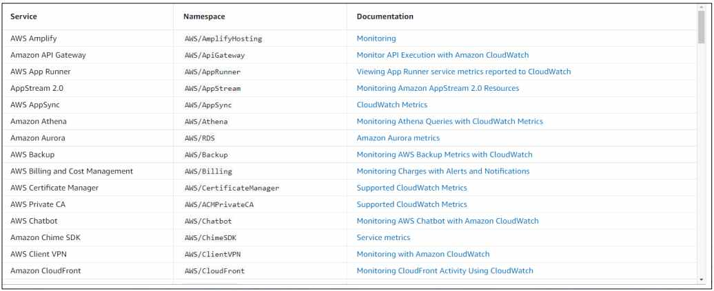
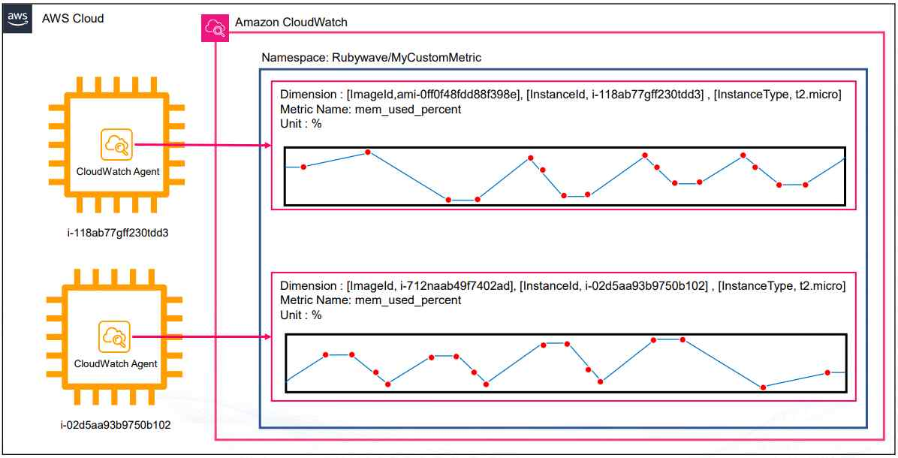
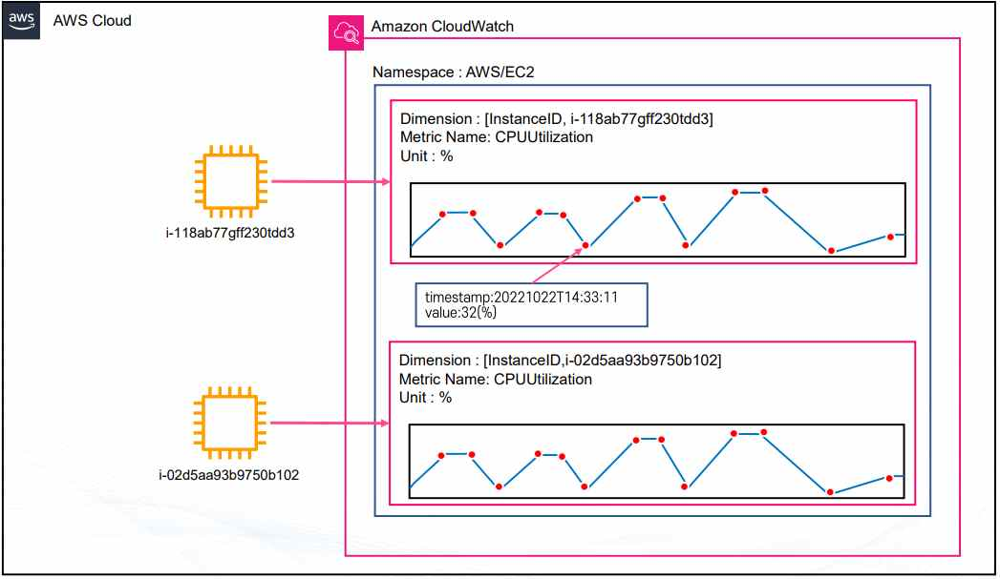
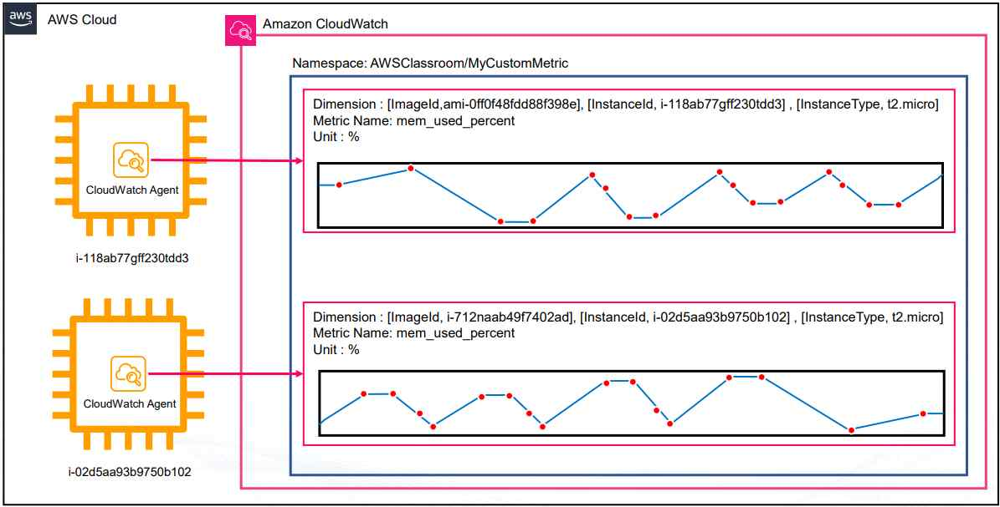
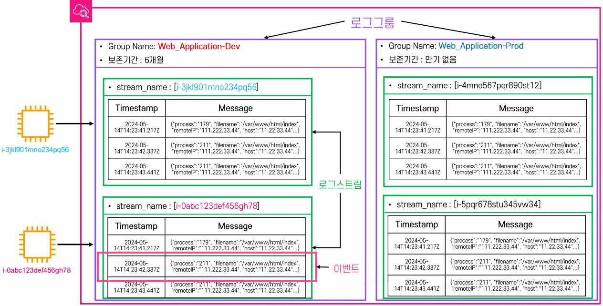
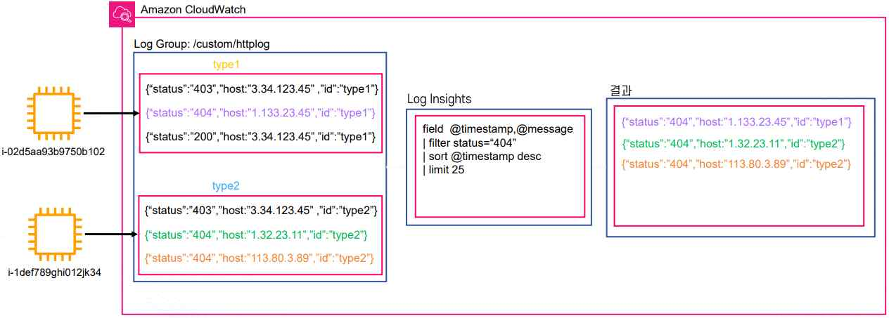
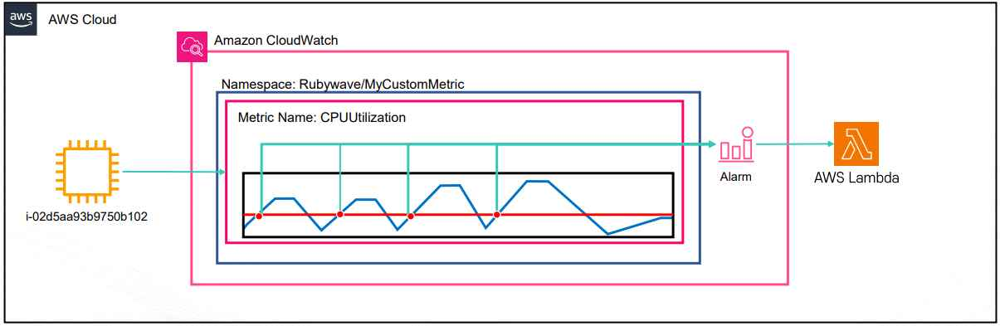
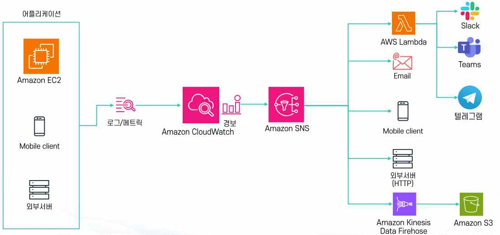
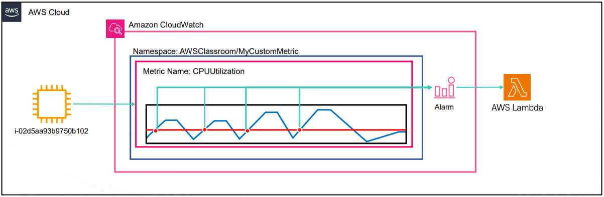

# AWS CloudWatch

## 1. CloudWatch 개요

Amazon CloudWatch는 AWS가 제공하는 대표적인 모니터링 서비스다. DevOps 엔지니어, 개발자, SRE(사이트 안정성 엔지니어), IT 관리자가 시스템과 애플리케이션의 성능을 확인하고 운영 상태를 안정적으로 유지하기 위해 사용한다. CloudWatch는 애플리케이션 상태를 모니터링하고, 시스템 전체의 성능 변화에 대응하며, 리소스 사용률을 최적화할 수 있도록 돕는다. 운영자가 필요한 데이터를 수집해 실행 가능한 통찰력을 제공하는 것이 핵심 목적이다.

**서비스 특징**

- AWS 서비스와 애플리케이션 전반을 모니터링할 수 있다.
- Public 서비스이므로 인터넷을 통해 접근하거나, VPC 내부에서는 Interface Endpoint로도 접근할 수 있다.
- 로그·지표·이벤트 같은 운영 데이터를 수집해 시각화하고 분석할 수 있다.
- 수집된 데이터를 기반으로 경보를 생성하고 자동화된 대응을 실행할 수 있다.
- AWS 대부분의 서비스와 기본적으로 연동되기 때문에 추가 설정 없이도 활용 범위가 넓다(예: EC2의 CPU 사용률, RDS의 디스크 사용률, Lambda의 실행 속도 등).

## 2. 지표(Metric)

지표는 시간 순서대로 정리된 데이터의 집합이며 여러 개의 데이터 포인트로 구성된다. AWS 서비스들은 기본적으로 지표를 제공하며(EC2 CPU 사용률, 네트워크 트래픽, 디스크 I/O 등), 커스텀 지표도 직접 생성할 수 있다. 예를 들어 EC2 메모리 사용량은 기본 제공 지표가 아니기 때문에 CloudWatch Agent를 설치해 별도로 수집해야 한다. 지표는 리전 단위로 관리되며, 최대 15개월까지 보관되고 그 이후 새로운 데이터가 들어오면 이전 데이터는 삭제된다(영구 보존되지 않는다).

**네임스페이스(Namespace)**: CloudWatch 지표를 논리적으로 묶는 컨테이너다. AWS 기본 네임스페이스 형식은 `AWS/{서비스명}`(예: `AWS/EC2`, `AWS/RDS`)이며, 필수 항목으로 반드시 직접 지정해야 한다(디폴트 없음).

**지표 이름(Metric Name)**: 네임스페이스 안에서 지표를 구분하는 세부 이름이다. 무엇에 관한 지표인지 명확히 표현해야 하며 필수 항목이다.

**데이터 포인트(Data Point)**: 지표를 구성하는 시간-값 단위 데이터로, 초 단위까지 기록한다(예: `2025-10-31T23:59:59Z`). 통계 및 알람에 활용할 때는 UTC 기준 사용이 권장된다.

**데이터 포인트의 해상도(Resolution)**: 데이터 수집 주기를 의미한다. 기본은 60초 단위이며, High-Resolution 모드로 전환하면 1초 단위까지 수집할 수 있다. 조회 시에는 1, 5, 10, 30초 또는 60초의 배수 단위로 확인할 수 있다.

**데이터 포인트의 기간(Period)**: 집계 기준 시간 단위로, 얼마나 긴 구간을 묶어서 보여줄지 결정한다. 설정 가능 범위는 1초~86,400초(1일)이며, 60초 미만은 High-Resolution 모드 전용이다.

- 60초 미만: 최대 3시간
- 60초 단위: 15일
- 300초 단위: 63일
- 1시간 단위: 455일(15개월)

작은 단위의 데이터는 보관 기한이 지나면 자동으로 더 큰 단위로 합쳐진다(예: 1분 단위 데이터는 15일이 지나면 5분 단위로만 확인 가능, 63일이 지나면 1시간 단위만 확인 가능). 2주 이상 업데이트가 없는 지표는 콘솔에서 자동으로 숨김 처리되지만 CLI로는 계속 확인할 수 있다.

**차원(Dimension)**: 지표를 구분하기 위한 태그/카테고리로 Key-Value 구조를 가지며 최대 30개까지 지정할 수 있다. 예를 들어 EC2 지표를 InstanceID Dimension으로 구분해 인스턴스별로 확인할 수 있고, 여러 차원을 조합할 수도 있다(예: `Server=prod`, `Domain=Seoul`).

**단위(Unit)**: 지표 값이 어떤 의미를 가지는지 표현하는 척도로, 지표를 해석할 때 기준이 되는 물리적 단위 또는 비율이다. `%`(퍼센트, CPU/디스크 사용률), `Bytes`(바이트, 네트워크 트래픽·디스크 읽기/쓰기), `Seconds`(초, 지연 시간·실행 시간), `Count`(개수, 요청 수·오류 횟수) 등이 대표적이다.

**기타 기능**: 다양한 지표를 선택해 그래프로 시각화하거나 서로 다른 지표를 동시에 비교할 수 있다. Metric Insight를 사용하면 SQL 형식으로 지표를 조회·분석할 수 있다(예: `SELECT AVG(CPUUtilization) FROM SCHEMA("AWS/EC2", InstanceId)`). 일부 리전에서는 자연어 쿼리도 지원한다(예: "EC2 인스턴스 중 네트워크 아웃이 가장 높은 인스턴스 보여줘").

위처럼 AWS가 기본 제공하는 지표(AWS/EC2 네임스페이스의 CPUUtilization)와 달리, 커스텀 지표는 사용자가 직접 정의한 네임스페이스(예: `AWSClassroom/MyCustomMetric`)에 CloudWatch Agent가 수집한 값(예: `mem_used_percent`)을 전송하는 구조다.

## 3. 로그(Log)

CloudWatch Logs는 AWS 서비스와 애플리케이션 로그를 수집한다(예: Lambda, EC2, Route53, ECS 로그). 운영자는 콘솔에서 직접 조회하거나 CloudWatch Logs Insights로 쿼리 분석을 수행할 수 있으며, 로그를 기반으로 에러 패턴을 찾거나 성능 문제를 빠르게 진단할 수 있다.

**로그의 주요 구성요소**

- **로그 그룹(Log Group)**: 로그 관리 단위로, 동일한 애플리케이션/서비스별로 그룹화한다(예: `application-dev`, `lambda-function-A`). 보존 기간·접근 권한 등 다양한 설정의 기본 단위가 된다.
- **로그 스트림(Log Stream)**: 같은 소스에서 순차적으로 수집되는 로그의 모음이다(예: EC2 인스턴스 단위로 수집된 웹 서버 로그).
- **로그 이벤트(Log Event)**: 실제 로그 데이터로, 타임스탬프+메시지 형태다(예: `2025-09-02T09:00:01Z GET /index.html 200`).
- **보존 기간(Retention Period)**: 로그 자동 삭제까지의 기간을 지정할 수 있으며, 무한정 보관 설정도 가능하다.

**로그 클래스(Log Class)**: Standard(기본)는 실시간 모니터링이 필요하거나 자주 조회되는 로그에 사용하고, Infrequent Access는 자주 쓰이지 않고 비용 효율적 저장만 필요한 경우에 사용한다(단, Subscription Filter·Metric Filter·Insight 같은 일부 기능은 사용 불가). 로그 그룹 생성 후에는 클래스를 변경할 수 없다.

**Log Insights(로그 분석 기능)**: 대화형 쿼리 기반 로그 분석 서비스다. JSON 기반 로그를 쿼리할 수 있고, 한 번에 최대 20개 로그 그룹을 동시 조회할 수 있다. S3/OpenSearch로 별도의 로그 분석 작업 없이 분석이 가능하며, 쿼리를 저장하고 대시보드로 시각화할 수 있다.

**Metric Filter(로그 기반 지표화)**: 로그에서 특정 패턴을 필터링해 CloudWatch 지표로 변환하는 기능이다(예: `{ $.eventType = "*" && $.sourceIPAddress != 123.123.* }`). 정규식 및 비교식을 적용할 수 있으며, 필터가 적용된 시점부터 지표화가 시작된다(과거 로그는 지표화되지 않는다).

**로그 관련 기타 기능**: Live Tailing으로 실시간 로그 스트리밍을 콘솔/CLI에서 확인할 수 있고, ML 기반으로 로그 패턴의 이상 징후를 탐지할 수 있다. Log Subscription을 사용하면 로그를 다른 서비스/계정/S3/ElasticSearch로 전달할 수 있으며(분석·백업·전송 용도), 필터링 후 전달도 가능하다.

정리하면 CloudWatch Log는 로그 수집/저장/조회/보관을, Log Insights는 로그 분석 및 시각화를, Metric Filter는 로그 기반 지표 생성을, Log Subscription은 로그를 외부로 전달하는 역할을 각각 담당한다.

## 4. 경보(Alarm)

CloudWatch는 수집한 지표를 기반으로 경보를 설정할 수 있다. 특정 임계치(Threshold)를 넘거나 내려갈 때 이벤트가 발생하며, 대응 방식으로는 SNS를 통한 알림 전송, Lambda 함수를 실행한 자동 조치, Auto Scaling 그룹과 연계한 인스턴스 수 조정 등이 있다(예: 웹 서버에서 500 에러 발생률이 일정 수치 이상이면 슬랙 알림을 발송).

장애 대응에서 가장 중요한 것은 얼마나 빨리 문제를 알아채느냐이다. 장애를 1분 만에 고칠 수 있더라도 10시간 후에 알게 되면 이미 피해가 커져 의미가 없다. 따라서 빠르게 고치는 것만큼이나 빠르게 감지하는 것도 중요하며, CloudWatch는 이러한 장애를 조기에 감지하는 핵심적인 역할을 한다.

CloudWatch 알람은 특정 지표가 설정한 임계치를 넘을 때 자동으로 발생한다. 예를 들어 EC2의 CPU 사용률이 기준치를 초과하면 알람이 발생하고, 이를 이메일·모바일 알림·외부 서버 연동·S3 로그 저장 등 다양한 방식으로 처리할 수 있다. EC2뿐만 아니라 모바일 클라이언트, 온프레미스 서버에서도 로그나 지표를 받아 알람을 설정할 수 있다. 결과적으로 CloudWatch 알람은 자동화된 환경에서 문제 대응을 시작하는 첫 번째 트리거 역할을 한다.

**알람 상태 종류(3가지)**

- **OK**: 정상 상태(지표 값이 임계치 조건을 만족하지 않음)
- **ALARM**: 경보 상태(지표 값이 설정된 조건을 초과/미달하여 알람 발생)
- **INSUFFICIENT_DATA**: 경보 상태를 판단할 충분한 데이터가 없음(지표가 수집되지 않거나 부족한 경우)

**알람 평가 주기**는 Resolution에 따라 달라진다. 기본은 60초 단위이며, High Resolution 모드는 1초 단위까지 가능하고, 그 외에는 반드시 60초의 배수 단위로만 평가한다.

**결합 경보(Composite Alarm)**: 여러 개의 경보를 Boolean 연산(AND, OR, NOT)으로 조합하여 하나의 경보 조건을 만드는 기능이다. 많은 경보를 효율적으로 관리·전달할 수 있고, Suppressor Alarm을 설정해 특정 조건일 때 Composite Alarm의 알림을 중단시킬 수도 있다.

- `(EC2 CPU 사용량 경보 AND 네트워크 사용량 경보)` → 웹팀에 알림
- `(NOT 웹서버 CPU 사용량 경보 AND RDS CPU 사용량 경보)` → DB팀에 알림
- `(500 에러 경보 OR 400 에러 경보) AND 네트워크 사용량 경보` → 사용자 피크 트래픽 알림

## 5. 기타 기능

- **Synthetics Canary**: 웹 애플리케이션을 모니터링하는 기능으로, 사용자가 실제로 접속하는 것처럼 시뮬레이션해 동작을 확인한다.
- **CloudWatch Contributor Insights**: 애플리케이션·컨테이너·Lambda 등의 문제 원인을 분석해준다.
- **Cross-account, Cross-region 모니터링**: 여러 계정·리전을 통합 관리할 수 있다.

## 6. 요금 및 프리 티어

**프리 티어(월 단위)**

- 기본 모니터링 지표 10개
- 대시보드 3개
- 경보 10개
- 로그 5GB 저장

**요금 부과 기준**

- 로그 저장량, 분석량, 실시간 로그 조회(Live Tail) 사용량
- 지표 개수와 커스텀 지표 생성량
- 경보 개수
- 대시보드 사용량

CloudWatch Dashboard를 사용하면 수집한 지표와 로그를 시각적으로 표현할 수 있다. 운영자는 여러 리소스의 상태를 한 화면에서 확인할 수 있고, 외부 리소스를 연동해 커스텀 대시보드도 만들 수 있다(예: S3 객체 상태 표시, HTML 기반의 커스텀 그래프 삽입). 이를 통해 모니터링 환경을 팀에 맞게 최적화할 수 있다.

> 관련: 이론 2. AWS EC2 - 배포 · 이론 5. AWS RDS · 이론 7. AWS CloudTrail
