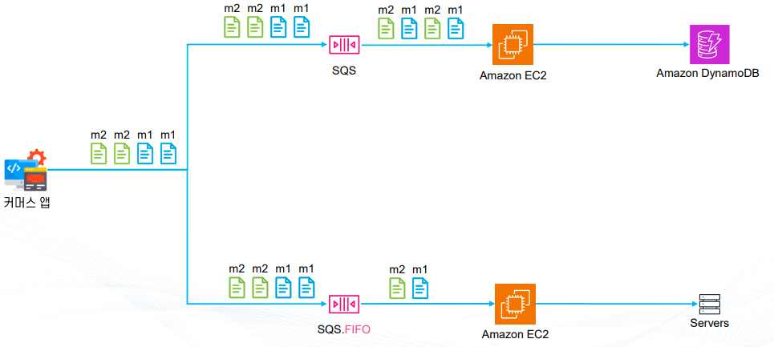
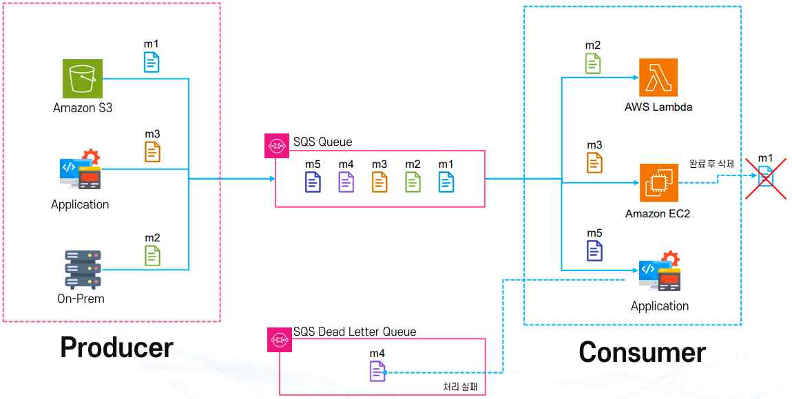
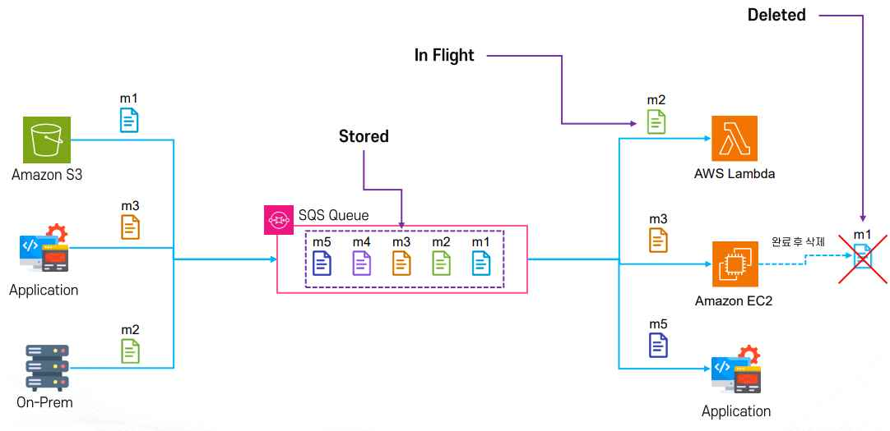

# AWS 디커플링 서비스와 Amazon SQS

## 1. 디커플링(Decoupling)이란

**디커플링(Decoupling)**은 서로 직접 연결된 서버(시스템) 사이에 중간 전달 역할을 해주는 AWS 서비스의 활용 방식이다. 쉽게 말하면 서버와 서버를 바로 연결하지 않고, 그 사이에 택배 보관소 같은 시스템을 하나 두는 구조다.

- 기존 방식: `A 서버 ---> B 서버`
- 디커플링 방식: `A 서버 ---> 중간 서비스 ---> B 서버` (이 중간에 있는 서비스가 디커플링 서비스다.)

직접 연결 구조에서는 여러 문제가 발생할 수 있다. 예를 들어 주문 서버가 결제 서버를 직접 호출하는 구조라면, 결제 서버가 잠깐 멈추면 주문도 같이 멈추고, 결제가 느리면 주문도 함께 느려지며, 결제 서버를 교체할 때 주문 코드까지 함께 수정해야 한다.

디커플링의 핵심은 서로 기다리지 말자는 것이다. 서버 A는 서버 B의 작업이 끝날 때까지 기다리지 않고, 대신 할 일만 맡긴 뒤 B가 나중에 처리하도록 만든다. 이 구조를 위해서는 중간에 작업을 잠시 보관할 저장소가 필요하다.

```text
보내는 사람 ---> 택배센터 ---> 받는 사람
```

택배 시스템을 예로 들면, 보내는 사람은 받는 사람이 집에 있는지 신경 쓰지 않고 택배를 보내며, 받는 사람은 도착했을 때 택배를 받으면 된다. 이것이 디커플링 구조다. 디커플링은 두 시스템을 직접 연결하는 대신 중간 저장소를 두어 서로의 상태를 기다리지 않게 만드는 설계 방식이며, 이를 통해 아키텍처의 유연성(Flexibility)을 높이고 효율적인 변경·확장을 가능하게 하며 시스템 안정성을 강화하는 것을 목표로 한다.

## 2. 결합(Coupling)의 유형

시스템 간의 연결 강도는 **긴밀한 결합(Tight Coupling)**과 **느슨한 결합(Loose Coupling)** 두 가지로 구분할 수 있다.

- **긴밀한 결합(Tight Coupling)**: 서로 강하게 묶여 있는 상태로, 의존성이 높아 한쪽을 변경하면 다른 쪽도 반드시 수정해야 한다. 시스템이 단단히 묶여 있어 확장·변경이 어렵다. 비유하자면 사람의 몸과 같다 — 심장, 폐, 신경이 서로 강하게 연결되어 있어 한 부분에 문제가 생기면 전체에 영향을 준다.
- **느슨한 결합(Loose Coupling)**: 서로 느슨하게 연결된 상태로, 의존성이 낮아 독립적으로 동작할 수 있다. 쉽게 변경하거나 대체할 수 있어 더 유연한 아키텍처를 구현할 수 있다. 비유하자면 표준 공구나 로봇과 같다 — 부품을 교체해도 전체 시스템은 계속 작동한다.

클라우드 아키텍처에서 느슨한 결합(디커플링)의 대표적인 예시는 다음과 같다.

- **S3 + Lambda**: S3에 파일이 업로드되면 Lambda가 자동으로 실행되며, S3와 Lambda는 각각 독립적으로 변경될 수 있다.
- **SNS + SQS**: 발행/구독 모델을 통해 서비스 간 의존성을 줄인다.
- **마이크로서비스(MSA)**: 서비스별로 독립적인 배포와 확장이 가능하다.

긴밀한 결합은 빠른 통합은 가능하지만 변경과 확장이 어렵고, 느슨한 결합(디커플링)은 독립성과 유연성을 확보해 클라우드 아키텍처에 최적화된 방식이다.

## 3. 디커플링 주요 서비스 개요

AWS에서 디커플링을 구현할 때 사용하는 대표적인 서비스는 Amazon SQS, Amazon SNS, Amazon Kinesis 세 가지다.

- **Amazon SQS (Simple Queue Service)**: 완전관리형 메시지 큐 서비스다. 생산자(Producer)는 메시지를 큐에 넣고, 소비자(Consumer)는 큐에서 메시지를 꺼내 처리한다. 메시지 순서 보장(FIFO 큐 지원), 메시지 중복 방지, 뛰어난 확장성과 내구성이 특징이며, 주문 시스템에서 요청을 큐에 쌓아 두고 뒷단 서비스가 순차적으로 처리하는 방식으로 활용된다.
- **Amazon SNS (Simple Notification Service)**: 발행/구독(Pub/Sub) 기반 알림 서비스다. 하나의 메시지를 메일, SMS, Lambda, SQS 등 여러 구독자에게 동시에 전달한다. 푸시 기반 메시징 방식이며 다양한 프로토콜을 지원한다. 특정 이벤트가 발생했을 때 여러 시스템에 동시에 알림을 보내는 용도로 활용된다.
- **Amazon Kinesis**: 실시간 데이터 스트리밍 처리 서비스로, 초당 수백만 건 이상의 데이터 이벤트를 실시간으로 수집하고 분석할 수 있다. 대규모 로그, IoT, 스트리밍 데이터 처리에 적합하며 Athena, Redshift, QuickSight 같은 분석·시각화 서비스와 연계할 수 있다. 실시간 클릭 로그 분석, 주식 시세 데이터 처리 등에 활용된다.

SQS는 메시지를 순서대로 안전하게 전달하는 큐, SNS는 여러 대상에 동시에 알리는 발행/구독 서비스, Kinesis는 대용량 실시간 스트림을 처리하는 서비스로 역할이 구분되며, 세 서비스 모두 서버 간 직접 연결을 없애는 디커플링 서비스라는 공통점을 가진다. SNS에 대한 심화 내용은 이론 10. AWS SNS에서 다루며, 이 문서에서는 SQS를 중심으로 심화한다.

## 4. Amazon SQS 개요와 동작 원리

**Amazon SQS**는 서버와 서버 사이에 메시지를 잠시 보관해 주는 중간 저장소 서비스다. 서버들이 서로 직접 연결되지 않고 SQS를 통해서만 데이터를 주고받도록 만들어 시스템을 안정적으로 운영하기 위해 사용한다.

```text
웹서버(Apache) ---> 처리서버(Tomcat) ---> DB
```

기존 구조에서는 한 서버라도 장애가 나면 전체 서비스가 같이 멈춘다. 반면 SQS를 중간에 둔 구조는 다음과 같다.

```text
웹서버 ---> SQS ---> 처리서버 ---> DB
```

이 구조에서는 처리서버가 잠시 멈춰도 데이터는 SQS에 남아 있고 나중에 다시 처리할 수 있다.

SQS의 가장 큰 목적은 세 가지다. 첫째, 서버 장애가 나도 데이터가 사라지지 않게 한다. 둘째, 요청이 몰릴 때 서버가 다운되지 않도록 부하를 나눈다. 셋째, 서버끼리 직접 묶이지 않게 해서 구조를 단순화한다.

SQS의 실제 동작 순서는 다음과 같다. 1단계, Producer가 메시지를 SQS에 보낸다. 2단계, 메시지는 Queue에 저장된다. 3단계, Consumer가 메시지를 가져간다. 4단계, 가져간 메시지는 잠시 숨김 처리된다(Visibility Timeout). 5단계, 처리에 성공하면 삭제한다. 6단계, 삭제하지 못하면 메시지는 다시 큐로 돌아온다. 이 구조 덕분에 자동 재처리가 가능하다.

SQS의 주요 특징은 다음과 같다.

- 메시지를 즉시 처리하지 않고 일정 시간 대기 후 전달하는 **지연 처리**가 가능하다.
- 초당 수십만 건 이상의 메시지를 처리할 수 있는 **확장성**을 갖는다.
- KMS 기반 암호화와 IAM 권한 제어를 지원하는 **보안** 기능을 제공한다.
- 여러 소비자가 같은 메시지를 요청해도 최종적으로 한 번만 처리되도록 설계된 **중복 최소화** 기능을 갖는다.
- 생산자와 소비자가 동시에 작동할 필요 없이 독립적으로 운영되는 **느슨한 연결(Decoupling)** 구조를 제공한다.
- 메시지 손실을 방지하고, FIFO 큐를 통해 순서를 보장하는 **처리 보장**을 제공한다.

SQS의 동작 방식은 메시지 저장(최대 14일 보관 가능), 메시지 전달(소비자가 요청하면 들어온 순서대로 전달하며 표준 큐는 대체로 순서를 보장하고 FIFO 큐는 엄격히 보장), 메시지 처리 후 삭제(ACK를 보내면 삭제), 오류 처리(일정 시간 안에 ACK를 보내지 못하면 다시 큐로 반환), 한 번만 전달(여러 소비자가 요청해도 최종적으로 한 번만 처리)로 구성된다.

## 5. Standard Queue와 FIFO Queue

Amazon SQS의 큐 유형은 **Standard Queue**와 **FIFO Queue** 두 가지로 나뉜다.

**Standard Queue**는 처리 속도가 매우 빠르며 무제한 처리량을 지원한다. 다만 순서를 보장하지 않고, 메시지를 중복해서 전달할 수 있다(At Least Once Delivery). 대규모 트래픽을 처리하기에 적합하고 빠른 전송과 확장성을 보장한다는 장점이 있지만, 동일 메시지가 여러 번 전달될 수 있으므로 애플리케이션 레벨에서 멱등성(Idempotency)을 반드시 보장해야 한다. 일반적인 웹 서비스에서는 속도가 가장 중요할 때 대부분 Standard Queue를 사용한다.

**FIFO Queue(First-In-First-Out)**는 먼저 들어온 메시지가 먼저 처리되도록 메시지 순서를 완벽하게 보장하며, 메시지를 단 한 번만 전달한다(Exactly Once Processing). 성능은 Standard Queue에 비해 제한적이며 초당 처리량에도 제한이 있다. 순서가 중요한 결제, 예약, 금융 트랜잭션 같은 애플리케이션에 적합하고, 중복 메시지가 발생하지 않아 멱등성 고려가 줄어든다는 장점이 있지만, 성능이 제한적이므로 고성능 처리가 필요한 경우에는 적합하지 않을 수 있다.

속도가 중요하면 Standard, 정확성이 중요하면 FIFO를 쓴다는 것이 기본 선택 기준이다.

| 구분 | Standard Queue | FIFO Queue |
|---|---|---|
| 처리량 | 무제한(높음) | 제한적(낮음) |
| 순서 보장 | 보장하지 않음 | 완벽히 보장 |
| 중복 메시지 | 발생 가능(At Least Once) | 없음(Exactly Once) |
| 적합한 사용 사례 | 대규모 트래픽 처리, 일반 웹 서비스 | 결제, 예약, 금융 트랜잭션 |

기본 FIFO 큐는 초당 약 300 트랜잭션(300TPS)까지 처리할 수 있는 반면 Standard 큐는 사실상 무제한이며, FIFO 큐는 이름 끝에 반드시 `.fifo`를 붙여야 한다(예: `my-order.fifo`).



## 6. 멱등성(Idempotency)

**멱등성(Idempotency)**은 같은 요청이 여러 번 실행되더라도 최종 결과가 동일하게 유지되는 성질을 말한다.

Standard Queue에서는 메시지가 여러 번 전달될 수 있기 때문에 멱등성 구현이 필수다. FIFO Queue는 중복 방지가 내장되어 있지만, 안정성을 위해 멱등성을 함께 구현하는 것이 권장된다.

멱등성이 필요한 대표적인 예로는 버스 표 구매와 파일 업로드가 있다. 같은 좌석을 여러 번 결제 시도하더라도 실제 결제는 한 번만 일어나야 하며, 같은 파일이 여러 번 업로드 요청되더라도 최종적으로는 한 번만 저장되어야 한다.

| 구분 | Standard Queue | FIFO Queue |
|---|---|---|
| 순서 보장 | X | O |
| 중복 메시지 | 발생 가능(At Least Once) | 없음(Exactly Once) |
| 처리량 | 무제한(높음) | 제한적(낮음) |
| 멱등성 필요성 | 반드시 필요 | 상대적으로 덜 필요하지만 권장 |
| 적합한 사용 사례 | 대규모 로그 처리, 알림 전송 | 결제, 예약, 주문 시스템 |

멱등성은 중복 실행에도 결과가 바뀌지 않도록 만드는 설계 원칙이며, 큐 유형과 무관하게 애플리케이션 레벨에서 갖추어 두는 것이 안전한 시스템 운영의 기본이다.

## 7. S3+Auto Scaling의 한계와 SQS를 통한 해결

동영상 처리 서비스를 예로 들어 SQS 없이 S3와 Auto Scaling만 사용하는 구조의 한계를 살펴본다.

```text
사용자 ---> S3(원본) ---> EC2(처리) ---> S3(결과물)
```

이 구조에서는 오토 스케일링 그룹에 속한 EC2 인스턴스들이 새로운 동영상이 업로드되었는지를 계속 확인해야 하며, 다음과 같은 문제가 발생한다.

- **지속적인 체크 필요**: EC2 인스턴스들이 S3를 계속 모니터링해야 하므로 불필요한 자원 낭비가 발생한다.
- **중복 처리 가능성**: 여러 인스턴스가 동시에 같은 파일을 가져오려고 시도할 수 있어 중복 작업, 충돌, 동기화 문제가 생긴다.
- **장애 발생 시 로직 중단**: EC2 인스턴스가 죽으면 작업이 끊기고, 업로드된 영상이 제대로 처리되지 않는다.
- **스케일링 기준 불명확**: 영상 업로드 속도를 미리 알 수 없어 어떤 기준으로 Auto Scaling을 해야 할지 애매하며, CPU 사용률이나 시간 기준만으로는 트래픽 폭주 상황을 예측하기 어렵다.

이 문제는 SQS를 중간에 두는 방식으로 해결할 수 있다.

```text
사용자 ---> S3(원본) ---> SQS ---> EC2(처리, Auto Scaling) ---> S3(결과물)
```

사용자가 영상을 업로드하면 S3에 저장되고, S3는 업로드 이벤트를 SQS Queue에 메시지로 전달해 어떤 파일이 업로드되었는지 알린다. Auto Scaling Group의 EC2 인스턴스들은 Queue를 모니터링하여 메시지를 가져오고, 처리가 완료된 메시지만 정상적으로 삭제되어 큐에서 제거된다.

Queue에 쌓인 메시지 수를 기준으로 Auto Scaling이 동작한다. 메시지가 많으면 인스턴스 수를 늘려 빠르게 처리하고, 메시지가 적으면 줄여 비용을 절감한다. 또한 EC2 인스턴스가 갑자기 죽더라도 메시지는 Queue에 남아 있기 때문에 다른 인스턴스가 이어서 처리할 수 있다.

S3 + SQS + Auto Scaling 구조를 사용하면 불필요한 체크 제거, 중복 처리 방지, 안정적인 장애 대응, 메시지 기반 Auto Scaling이 가능해진다. S3와 Auto Scaling만으로 구성한 처리 파이프라인은 지속적 폴링, 중복 처리, 장애 시 작업 유실, 불명확한 스케일링 기준이라는 네 가지 한계를 갖지만, SQS를 중간에 두면 메시지 수 기준의 Auto Scaling과 장애 시 재처리가 가능해져 이 한계를 모두 해소할 수 있다.

## 8. SQS 주요 구성 요소

Amazon SQS는 메시지, Producer, Queue, Consumer, DLQ, 액세스 정책이라는 여섯 가지 구성 요소로 이루어진다.

- **메시지(Message)**: SQS에서 전달되는 데이터의 가장 작은 단위다. Producer가 보낸 정보는 전부 메시지 형태로 만들어져 SQS에 저장된다. 형태는 문자열, JSON, XML 등 다양하지만 실무에서는 대부분 JSON 형태를 사용하며, Consumer가 가져갈 때까지 Queue 안에서 대기 상태로 보관된다.
- **Producer(생산자)**: 메시지를 만들어서 SQS로 보내는 주체로, 웹 애플리케이션·IoT 기기·로그 수집 서버 등이 해당한다. 메시지를 보내고 나면 이후 처리는 전혀 신경 쓰지 않는 비동기 구조로 동작한다.
- **Queue(대기열)**: 메시지를 임시로 저장하는 공간으로, SQS에서 가장 핵심이 되는 부분이다. 메시지 보관, 순서 관리, 중복 관리, 재전송 관리, 대기 관리 역할을 수행하며, Standard Queue와 FIFO Queue 두 종류가 있다.
- **Consumer(소비자)**: Queue에서 메시지를 가져가 처리하는 주체로, 주문 처리 서버·로그 분석 서버·메일 발송 서버·알림 서버 등이 해당한다. 삭제하지 않으면 SQS는 아직 처리되지 않은 것으로 판단해 자동 재처리를 수행할 수 있다.
- **DLQ(Dead Letter Queue)**: 계속 실패하는 메시지를 모아두는 전용 Queue다. 어떤 메시지가 여러 번 처리에 실패하면(예: 5번 연속 실패) 일반 Queue에서 빼서 DLQ로 이동시킨다. DLQ가 없으면 에러 메시지가 계속 반복 처리되면서 시스템이 불안정해진다.
- **액세스 정책(Access Policy)**: 누가 SQS에 접근 가능한지(EC2만 수신 가능, 특정 계정만 접근 가능 등)를 제한하는 정책이다. IAM 정책 기반으로 관리하며 JSON 형태로 작성하고, 설정하지 않으면 외부에서 마음대로 접근할 수 있기 때문에 반드시 설정해야 한다.

즉 Producer → Queue → Consumer 흐름으로 메시지가 전달되고, 실패 메시지는 DLQ로 분리되며, 모든 접근은 액세스 정책으로 제어된다.



## 9. SQS 메시지의 세 가지 상태와 메시지 구성

메시지의 최대 크기는 1MiB(Mebibyte, 1024×1024=1,048,576 Byte로, 1MB=1,000,000 Byte와는 구분된다)이며, 저장 기간은 최대 14일까지 가능하고 기본값은 4일이다. 크기가 더 큰 데이터를 전송해야 할 경우에는 S3와 연동한 뒤 SQS에는 메타데이터만 저장하는 방식을 사용한다.

메시지는 **Stored(저장됨)**, **In Flight(처리 중)**, **Deleted(삭제됨)**의 세 가지 상태를 거친다.

- **Stored(저장됨)**: Producer가 메시지를 SQS Queue에 성공적으로 전달한 상태로, Queue에 대기 중이며 아직 Consumer가 가져가지 않은 상태다. 최대 건수 제한이 없어 무한히 메시지를 쌓아둘 수 있으며, 지정한 보관 기간(최대 14일) 동안 유지된다.
- **In Flight(처리 중)**: Consumer가 Queue에서 메시지를 가져가 처리 중인 상태로, 이때 메시지는 다른 Consumer에게 보이지 않으며 Visibility Timeout 기간 동안 숨겨진다. Visibility Timeout 내에 메시지를 삭제하지 않으면 다시 Queue로 돌아와 다른 Consumer가 처리할 수 있게 되어 중복 방지와 안정성을 동시에 확보한다. 동시 In Flight 메시지의 최대 개수는 Standard Queue가 약 120,000개, FIFO Queue가 약 20,000개다.
- **Deleted(삭제됨)**: Consumer가 메시지를 성공적으로 처리하고 삭제 요청(DeleteMessage)을 보낸 상태로, Queue에서 완전히 제거되어 더 이상 다른 Consumer가 접근할 수 없다.

메시지 상태는 `Producer ---> Queue에 메시지 저장(Stored) ---> Consumer가 가져와 처리 시작(In Flight) ---> 처리 완료 후 삭제 요청(Deleted)` 순서로 전환된다.



설계 시에는 Standard Queue에서는 같은 메시지가 두 번 전달될 수 있으므로 멱등성을 보장해야 한다는 점, 처리 시간이 긴 작업일수록 Visibility Timeout을 충분히 길게 조정해야 한다는 점, 여러 번 실패하는 메시지는 DLQ로 보내 추후 분석할 수 있다는 점을 함께 고려해야 한다.

SQS 메시지는 다음 요소로 구성된다.

1. **Message Body(메시지 본문)**: 실제 메시지의 데이터(String)로, Message Attribute를 포함해 최대 크기는 1MiB다. 콘텐츠가 큰 경우에는 동영상 파일을 직접 SQS에 담지 않고 S3에 저장한 뒤, SQS 메시지에는 해당 파일의 경로(URL 또는 키)만 포함하는 방식으로 처리한다.
2. **Message Attribute(메시지 속성)**: Key-Value 형식의 메타데이터로 Message Body에는 포함되지 않는다. 메시지의 분류, 필터링, 컨텍스트(Context) 제공이 주 용도이며, 최대 10개까지 추가할 수 있다.
3. **Message System Attribute(시스템 속성)**: AWS 서비스 내부에서 사용하는 시스템 메타데이터로, 현재는 AWS X-Ray 분산 추적을 위한 AWSTraceHeader만 지원한다.
4. **ReceiptHandle**: 메시지를 삭제하기 위해 사용하는 고유 키로, 메시지를 큐에서 삭제하려면 반드시 필요하다.
5. **기타 정보**: 메시지가 생성된 AWS 리전(Region), 메시지를 생성한 소스(Event Source), 메시지 본문 무결성 검증 해시값(MD5), 메시지 생성 시간(Timestamp).
6. **FIFO Queue 전용 속성**: 메시지를 그룹 단위로 처리할 수 있게 하는 식별자인 Message Group ID(같은 그룹 ID를 가진 메시지는 순차적으로 처리됨)와, 중복 메시지를 구분하기 위한 ID인 Deduplication ID(동일한 Deduplication ID를 가진 메시지는 중복으로 간주되어 5분 이내 재전송 시 큐에 추가되지 않음)가 있다.

## 10. SQS Producer와 Consumer

**Producer(메시지 생산자)**는 API를 통해 메시지를 Push 하는 방식으로 동작한다. 메시지를 전송하려면 반드시 Queue URL을 알아야 하며, 이는 리전(region), 계정 ID(account-id), 큐 이름(queue-name)으로 구성된다. 기본 형식은 `https://sqs.<region>.amazonaws.com/<account-id>/<queue-name>`이다.

메시지를 전송하려면 `sqs:SendMessage` IAM 권한이 필요하다. IAM 사용자나 역할에 직접 권한을 부여하거나 리소스 기반 정책(Resource Policy)을 이용해 특정 Queue에 대한 접근 권한을 부여할 수 있으며, 권한이 없으면 메시지 전송이 실패한다.

SQS는 다양한 AWS 서비스와 이벤트 기반으로 연동할 수 있다. S3, SNS, Lambda 등 일부 서비스는 SQS와 직접 연결할 수 있고, EventBridge와 연동하면 더 정교한 이벤트 라우팅과 조건 처리가 가능하다. 예를 들어 S3에서 파일 업로드 이벤트를 SQS로 전송하거나, CloudWatch Alarm이 발생했을 때 SQS에 메시지를 생성하거나, EventBridge가 특정 조건의 이벤트만 SQS로 전달하는 방식으로 활용된다.

**Consumer(메시지 소비자)**는 큐에서 메시지를 가져와 처리하는 역할을 한다. 주기적으로 Poll 요청(API 호출)을 보내 큐에 메시지가 있는지 확인하며, 메시지를 받거나 삭제하려면 `sqs:ReceiveMessage`(메시지 받기)와 `sqs:DeleteMessage`(메시지 삭제) 권한이 필요하다.

Consumer의 기본 동작 흐름은 Poll → 처리 → 삭제다. Producer는 Queue URL과 `sqs:SendMessage` 권한을 가지고 메시지를 큐에 밀어 넣기만 하고, Consumer는 `sqs:ReceiveMessage`·`sqs:DeleteMessage` 권한을 가지고 Poll → 처리 → 삭제 흐름으로 메시지를 가져와 처리하며, Visibility Timeout 안에 삭제하지 않으면 메시지가 다시 큐로 돌아가 다른 Consumer에게 전달된다는 점을 함께 기억해야 한다.

## 11. Visibility Timeout

**Visibility Timeout(가시성 제한 시간)**은 한 Consumer가 메시지를 가져간 뒤, 다른 Consumer가 그 메시지를 가져갈 수 없도록 막는 시간이다. 일종의 잠금(Lock) 역할을 하며, 해당 시간 동안에는 다른 Consumer가 같은 메시지를 요청할 수 없다. 이는 메시지를 처리할 충분한 시간을 보장하기 위해 설정하는 값이다.

Visibility Timeout의 기본값은 30초이며, 최소값은 0초, 최대값은 12시간이다. 작업의 특성(빠른 처리인지, 오래 걸리는 처리인지)에 맞게 적절히 조정해야 한다.

처리 흐름은 다음과 같다. Consumer가 메시지를 가져오면 메시지는 Visibility Timeout 상태가 되고, 이 시간 안에 메시지를 처리한 뒤 삭제해야 한다. 만약 처리 중 문제가 생겨 삭제되지 않으면 시간이 지나면서 메시지가 다시 큐에 나타나 다른 Consumer가 가져갈 수 있게 된다.

Visibility Timeout은 큐 단위 또는 메시지 단위로 설정할 수 있으며, 필요할 때는 Consumer가 메시지를 처리하는 도중에 연장할 수도 있다. 설정 시간이 너무 짧으면 아직 처리 중인 메시지가 다시 큐에 나타나 중복 처리될 수 있고, 설정 시간이 너무 길면 실패한 메시지가 다른 Consumer에게 전달되기까지 불필요하게 오래 걸린다.

예를 들어 10초 내에 끝나는 간단한 로그 처리라면 Visibility Timeout을 기본값인 30초로 설정해도 충분하지만, 동영상 인코딩처럼 수 분 이상 걸릴 수 있는 작업은 Visibility Timeout을 몇 분 단위로 늘려야 중복 처리를 막을 수 있다.

## 12. SQS Polling 방식(Short/Long)

SQS는 메시지를 자동으로 보내주지 않으며, 항상 서버가 먼저 할 일이 있는지 확인해야 하는데 이를 **Polling**이라고 한다. Amazon SQS는 내부적으로 여러 대의 서버에 메시지를 분산 저장하는 구조를 가진다 — 하나의 큐처럼 보이지만 실제로는 여러 서버에 나뉘어 저장되어 있다. 이 구조 때문에 Polling 방식이 필요하며, Short Polling과 Long Polling의 차이가 생긴다.

**Short Polling(기본 방식)**은 바로 확인하고 바로 돌아오는 방식으로, 기다리지 않는다. SQS는 내부 서버 중 일부만 확인하는데, 예를 들어 A 서버를 확인해 없으면 바로 없음을 응답하고, B 서버를 확인해 없으면 다시 없음을 응답하며, C 서버를 확인해 있으면 그때 받는 식으로 동작한다. 일부 서버만 조회하고 대기 시간이 없어 응답은 빠르지만 요청 횟수가 많아지고 비용이 증가하며, 메시지가 있어도 확인한 서버에 없으면 가져오지 못해 계속 재요청해야 한다. 이 때문에 특수한 경우가 아니면 거의 사용하지 않는다.

**Long Polling**은 처리 서버가 SQS에 메시지를 요청한 뒤, 바로 응답을 받지 않고 일정 시간(최대 20초) 동안 기다리는 방식이다. SQS에 메시지가 없으면 즉시 없음이라고 응답하지 않고 최대 20초까지 대기 상태를 유지한다. 여러 서버를 돌아다니며 확인하는 구조가 아니라 요청을 걸어둔 채 메시지가 생성될 때까지 대기하며, AWS 내부 시스템이 메시지가 들어오면 알려서 깨워주는 이벤트 기반 구조로 동작한다.

Long Polling의 동작 방식은 다음과 같다. 첫째, 처리 서버(EC2, Lambda 등)가 SQS에 요청한다. 둘째, SQS는 바로 응답하지 않고 요청을 대기 상태로 둔다. 셋째, 대기 중에 새로운 메시지가 들어오면 즉시 해당 메시지를 서버에게 전달한다. 넷째, 최대 대기 시간(최대 20초) 동안 메시지가 들어오지 않으면 없음으로 응답하고 연결을 종료한다.

Short Polling은 일부 서버만 즉시 확인하고 끝내는 방식이라 메시지를 놓치기 쉽고 비용도 늘어나는 반면, Long Polling은 최대 20초까지 대기하며 메시지가 들어오는 즉시 전달받는 방식이라 대부분의 실무 환경에서는 Long Polling을 사용하는 것이 합리적이다.

> 관련: 이론 6. AWS CloudWatch · 이론 10. AWS SNS · 이론 2. AWS EC2 - 배포
