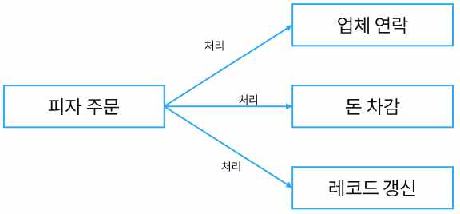
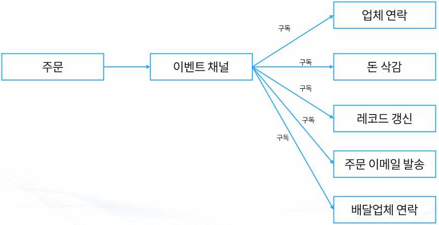
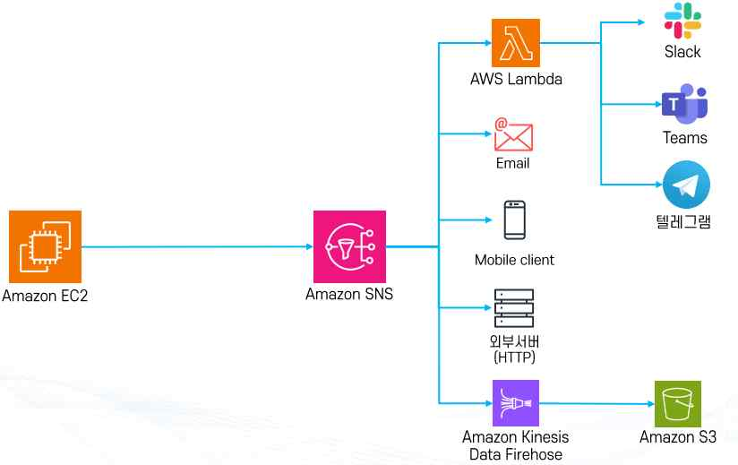
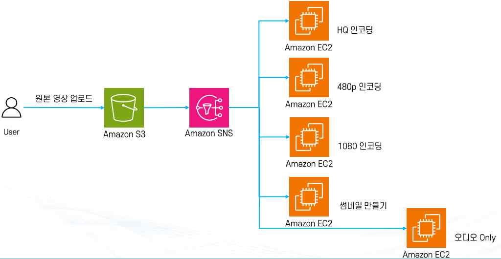
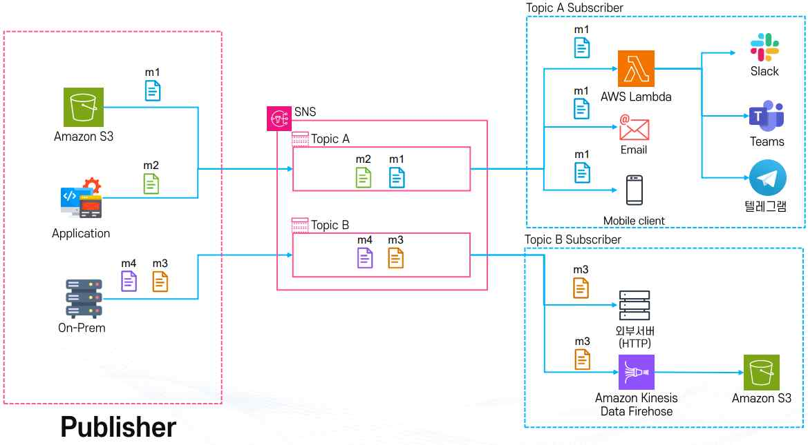
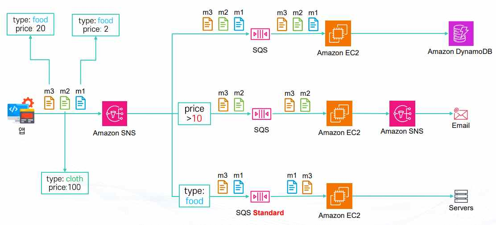
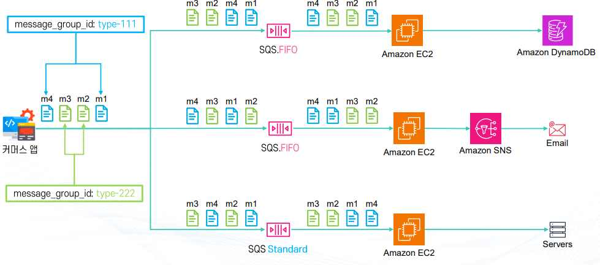
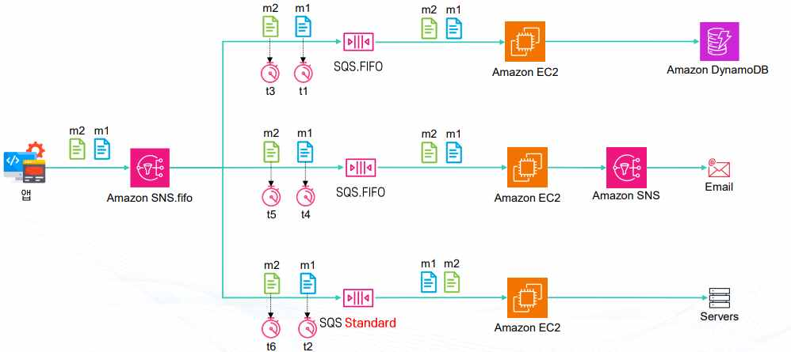
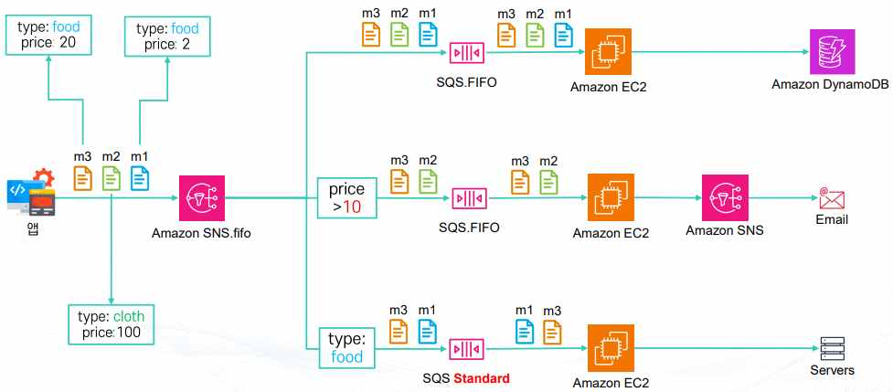
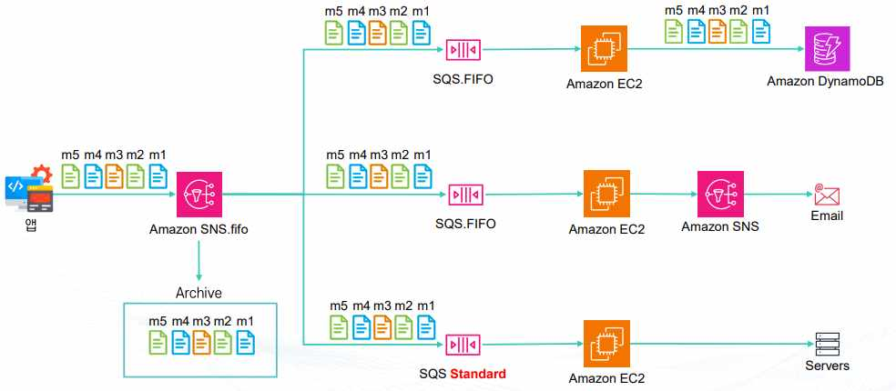

# Amazon SNS (Simple Notification Service)

## 1. SNS란

**Amazon SNS**는 완전관리형 메시징 서비스로, 애플리케이션 간(A2A) 또는 애플리케이션과 사용자 간(A2P)의 메시징을 지원한다. 발행-구독(Pub/Sub) 기반 구조를 사용하여 하나의 메시지를 여러 서비스나 구독자에게 동시에 전달하고 처리하는 것이 핵심 특징이다.

**주요 특징**

- **Fan Out**: 한 번 발행한 메시지가 SQS, Lambda, HTTP/HTTPS 엔드포인트, 이메일, SMS 등 여러 서비스로 동시에 전달된다.
- **PUSH 방식 전달**: 소비자가 직접 가져가는(Pull) 방식이 아니라, 구독한 서비스로 메시지를 직접 밀어넣는(Push) 방식이다.
- **메시지 보관 불가**: 메시지를 저장하지 않고 바로 전달하므로, 저장·재처리 목적이라면 SQS를 함께 활용해야 한다.
- **FIFO 지원**: 메시지 순서를 보장해야 할 경우 FIFO 주제(토픽)를 사용하며, 메시지 리플레이(재전송)도 가능하다.

**사용 사례**: 하나의 이벤트를 여러 서비스가 동시에 처리해야 할 때(예: 이미지 업로드 시 Lambda로 썸네일 생성 + SQS로 로그 적재 + 이메일 알림 전송), 서로 다른 서비스 간 메시지를 빠르게 전달해야 할 때, 임시 메시지를 여러 시스템에서 동시에 받아야 할 때 사용한다. SNS는 저장 없이 즉시 여러 대상으로 메시지를 밀어넣는 Pub/Sub 기반 Fan Out 서비스이며, 순서 보장이나 재처리가 필요하면 SQS나 FIFO 기능을 조합해야 한다는 점이 다른 메시징 서비스와의 근본적인 차이다.

## 2. SNS와 SQS 비교

SNS와 SQS는 모두 AWS의 대표적인 메시징 서비스지만, 목적과 동작 방식이 뚜렷하게 다르다.

| 구분 | SNS | SQS |
|---|---|---|
| 목적 | 여러 서비스에 메시지를 동시에 전달 (Fan Out) | 특정 작업을 다음 서비스로 안전하게 넘겨 처리 |
| 메시지 처리 횟수 | 하나의 메시지를 여러 서비스에서 처리 | 하나의 메시지는 한 번만 처리 |
| 메시지 보관 | 불가 | 최대 14일 보관 가능 |
| 전달 방식 | PUSH (즉시 전달) | PULL (소비자가 가져감) |
| 아키텍처 활용 | Fan Out | 디커플링 (생산자-소비자 분리) |

**아키텍처 활용 예시**

- **SNS 단독 활용**: 알림(Notification) 성격이 강한 경우 사용한다(예: 회원가입 시 이메일과 SMS를 동시에 발송).
- **SQS 단독 활용**: 안정적인 작업 큐로, 백엔드 작업 처리 파이프라인에 사용한다(예: 이미지 처리, 로그 처리, 대용량 데이터 적재).
- **SNS + SQS 혼합**: SNS를 통해 여러 SQS 큐로 메시지를 전달하면 각각의 큐를 다른 서비스가 처리할 수 있어 대규모 분산 처리가 가능하다.

```text
주문 발생 --> SNS 주제(토픽) 발행 --> SQS(재고 처리)
                                 --> SQS(배송 처리)
                                 --> SQS(결제 처리)
```

SNS는 하나의 메시지를 여러 곳에 동시에 뿌리는 Fan Out에, SQS는 생산자와 소비자를 분리하는 디커플링에 최적화되어 있으며, 실무에서는 SNS로 팬아웃한 뒤 각 SQS 큐가 독립적으로 처리하는 혼합 구조가 자주 쓰인다.

## 3. 긴밀한 결합과 느슨한 결합

**긴밀한 결합(Tightly Coupled)**: 주문이 들어오면 주문 서비스가 업체 연락, 결제 차감, 레코드 갱신, 이메일 발송 등 모든 작업을 직접 처리하는 구조다. 주문 서비스가 모든 후속 작업을 알고 있어야 하므로 복잡도가 높고 유지보수가 어려우며, 새로운 기능이 추가될 때마다 주문 서비스 코드를 매번 수정해야 한다.



**느슨한 결합(Decoupling)**: 주문이 들어오면 주문 서비스는 단순히 이벤트 채널(SNS 같은 것)에 주문이 발생했다고 알리기만 한다. 이후 업체 연락, 결제 차감, 레코드 갱신, 이메일 발송, 배달업체 연락 같은 각 작업은 이벤트 채널을 구독한 서비스가 스스로 처리한다. 주문 서비스는 누가 그 일을 하는지 알 필요가 없으며, 새로운 기능이 필요하면 이벤트 채널에 새로운 구독자를 붙이기만 하면 되므로 주문 서비스 자체는 수정할 필요가 없다.



**실무 아키텍처 예시**

```text
Amazon EC2 --> Amazon SNS --> AWS Lambda --> Slack / Teams / 텔레그램
                          --> Email
                          --> Mobile client
                          --> 외부 서버 (HTTP)
                          --> Amazon Kinesis Data Firehose --> Amazon S3
```



**영상 인코딩 파이프라인 예시**

```text
User 업로드 --> Amazon S3 --> Amazon SNS --> HQ 인코딩 EC2
                                        --> 480p 인코딩 EC2
                                        --> 1080p 인코딩 EC2
                                        --> 썸네일 만들기 EC2 --> 오디오 Only EC2
```



긴밀한 결합은 하나의 서비스가 모든 후속 작업을 직접 알고 처리해야 해서 변경에 취약한 반면, SNS 같은 이벤트 채널을 통한 느슨한 결합은 발행자가 구독자를 알 필요 없이 새로운 기능을 구독자 추가만으로 확장할 수 있어 대규모 아키텍처에서 훨씬 유리하다.

## 4. SNS 주요 구성 요소

- **주제(Topic)**는 SNS에서 메시지를 주고받는 커뮤니케이션 채널이다. 메시지를 전달하려면 먼저 주제(토픽)를 만들어야 하며, 예를 들어 `OrderTopic`이라는 주제를 만들면 주문 관련 알림은 모두 이 주제를 통해 전달된다.
- **구독(Subscription)**은 특정 주제를 구독하면 그 주제에 올라오는 메시지를 받아볼 수 있는 설정이다. 구독할 수 있는 대상은 이메일, SMS, SQS 큐, Lambda, HTTP/HTTPS 엔드포인트 등이다.
- **퍼블리셔(Publisher)**는 메시지를 만들어서 SNS 주제에 발행하는 주체다. 애플리케이션, 서버, 다른 서비스 등이 퍼블리셔가 될 수 있다.
- **구독자(Subscriber)**는 실제 메시지를 받아서 처리하는 주체다. 구독해둔 방식에 따라 이메일을 받거나, Lambda 함수가 실행되거나, SQS 큐에 메시지가 들어간다.
- **메시지(Message)**는 SNS를 통해 전달되는 실제 데이터로, 텍스트나 JSON 형식 데이터 등 다양한 형태를 가질 수 있다(예: `{ "orderId": 123, "status": "NEW" }`).
- **액세스 정책(Access Policy)**은 누가 주제에 접근할 수 있는지 정하는 권한 정책이다. 메시지를 발행하거나 구독할 수 있는 주체를 제한하거나 허용할 수 있다.

Publisher는 메시지를 만들어 Topic에 보내고, Subscriber는 Subscription을 통해 Topic을 구독하여 메시지를 받는다. Message는 실제 전달되는 데이터이고, Access Policy는 이 흐름 전체를 보호하는 보안 규칙이다.

## 5. Topic과 Subscription

**주제(Topic)**는 SNS의 메시지 전달 채널 역할을 한다. 퍼블리셔가 메시지를 주제에 발행(Publish)하면, 해당 주제를 구독(Subscribe)한 모든 구독자에게 동시에 메시지가 전달된다. 이 방식을 **Fan Out**이라 부르며, 하나의 이벤트가 여러 곳으로 확산되는 구조다.

```text
주문 발생 --> OrderTopic --> 이메일 알림
                        --> 결제 서비스
                        --> 배송 시스템
```

**구독 프로토콜(Subscription Protocols)**

- 이메일: 메일로 알림을 받는다.
- HTTP(S): 특정 API 엔드포인트로 전달한다.
- SQS: 큐에 메시지를 저장한 뒤 나중에 처리한다.
- SMS: 문자메시지로 전송한다.
- Lambda: 이벤트를 받아 바로 코드를 실행한다.
- Kinesis Data Firehose: 데이터 스트림으로 전달한다.

즉 SNS는 단순한 알림 서비스가 아니라, 다양한 서비스와 연결할 수 있는 메시지 허브 역할을 한다.



**최초 구독 확인(Subscription Confirmation)**: 구독을 신청하면 반드시 최초 확인 과정을 거쳐야 한다. 이메일 구독의 경우 확인 메일을 클릭해야 최종 구독이 완료되며, Lambda 구독의 경우 확인 이벤트가 발송되고 이를 승인해야 한다. 이 과정을 통해 원하지 않는 구독을 방지하고 보안을 강화한다.

## 6. SNS 메시지 구성

**Message Body(메시지 본문)**: 일반적으로 제목, 내용 같은 기본 데이터가 들어가며, 최대 크기는 256KiB다(Message Attribute 포함). 크기가 큰 데이터는 메시지에 직접 넣지 않고 S3에 저장한 뒤, 버킷·키 정보만 메시지에 담아 전달한다.

**Raw Message Delivery 옵션**: 기본적으로 SNS는 자체 포맷(JSON 래핑)으로 메시지를 감싸 전달한다. Raw Message Delivery를 켜면 감싸지 않고 메시지 원문 그대로 전달하며, 주로 S3 로그 전송이나 SQS에서 메시지를 원문 그대로 처리해야 하는 경우에 활용한다.

- 일반 전달: `{ "Type":"Notification", "Message":"{...}" }`
- Raw 전달: `"{...}"` (원문만 전달)

**Message Attribute(메시지 속성)**: Key-Value 형식의 메타데이터로, 메시지 본문에는 포함되지 않지만 메시지에 추가할 수 있는 부가 정보다. 분류(Classification), 필터링(Filtering), Body 처리에 필요한 Context 제공 등의 용도로 쓰인다. Raw Message Delivery가 활성화된 경우에도 속성은 별도로 전달할 수 있으며, 최대 10개까지 정의할 수 있다.

**TTL(Time to Live, 모바일 전용)**: 메시지를 얼마나 오래 저장할지에 대한 시간 제한으로, 주로 모바일 Push 알림(Firebase, APNS 등)에서 사용한다. TTL이 지나면 메시지는 더 이상 전달되지 않는다.

**기타 포함 정보**: Timestamp(메시지가 생성된 시각), 주제(토픽) ARN(메시지가 발행된 SNS 주제의 Amazon Resource Name), 시그니처(Signature, 메시지 위·변조 여부를 확인하기 위한 검증 값), 구독 해제 URL(이메일 등에서 구독자가 직접 구독을 취소할 수 있는 링크)이 함께 포함된다.

## 7. SNS 메시지 필터링

기본적으로 SNS 주제에 메시지를 발행하면 구독한 모든 Subscriber가 메시지를 전부 받는다. 하지만 어떤 구독자는 특정 조건에 맞는 메시지만 받고 싶을 수 있으며, 메시지 필터링 기능을 활용하면 원하는 메시지만 골라 받을 수 있다.

**구독 필터 정책(Subscription Filter Policy)**: 구독자 단위로 필터 정책을 설정할 수 있다. 정책에서 지정한 조건에 맞는 메시지만 전달되고, 조건에 맞지 않으면 전달되지 않는다.

```json
{
  "type": ["Express"],
  "country": ["US", "EU"],
  "price": [{ "numeric": [">=", 20] }]
}
```

이 정책은 "타입이 Express이고, 국가가 미국 또는 유럽이며, 가격이 20 이상인 메시지만 받는다"는 조건을 의미한다.

- **필터링 대상**: Message Body(메시지 본문 안의 데이터), Message Attributes(메시지와 함께 전달되는 추가 속성)
- **동작 방식**: 메시지 발행 시 SNS가 메시지를 각 구독자의 Filter Policy와 비교하여, 조건과 일치하면 메시지를 전달하고 일치하지 않으면 메시지를 버린다.

**활용 예시**: 쇼핑몰 알림 시스템에서 유럽/미국 사용자에게만 특정 세일 알림을 발송하거나, Express 배송 옵션을 선택한 주문만 물류팀으로 전달할 수 있다.



필터링은 발행자가 아닌 구독자 쪽에서 필요한 메시지만 골라 받도록 하는 장치이며, Message Body와 Message Attributes를 기준으로 조건을 걸어 불필요한 트래픽과 처리 비용을 줄이는 데 활용된다.

## 8. SQS/SNS FIFO 개요와 성능 제약

**Standard Queue의 한계**: 순서 보장이 없어 기본 SQS(Standard)는 메시지가 들어온 순서대로 소비자에게 전달되지 않을 수 있고, At-Least-Once 전달 보장 특성 때문에 메시지가 여러 번 전달될 가능성이 있다.

**FIFO Queue의 특징**: 메시지가 들어온 순서를 그대로 보존하여 한 번만 전달하며(순서 보장), 동일한 메시지를 여러 번 소비하지 않도록 보장한다(중복 제거). 같은 그룹 내 메시지는 순서대로 처리되는 메시지 그룹(Message Group) 기능과, 동일 메시지 반복 전송을 방지하는 중복 제거 ID(Deduplication ID) 기능을 제공한다.

**성능 제약**: 기본 FIFO 큐는 초당 약 300 트랜잭션(300TPS) 요청까지 처리할 수 있는 반면, Standard 큐는 사실상 무제한으로 트랜잭션을 처리할 수 있다.

**High Throughput 모드**: 활성화하면 성능이 향상되지만 리전별로 상한치가 다르다.

| 리전 | High Throughput 모드 최대 TPS |
|---|---|
| 미국 동부 (버지니아 북부, us-east-1) | 70,000 TPS |
| 아시아 태평양 (도쿄, ap-northeast-1) | 9,000 TPS |
| 아시아 태평양 (서울, ap-northeast-2) | 2,400 TPS |

**네이밍 규칙**: FIFO 큐는 이름 끝에 반드시 `.fifo`를 붙여야 한다(예: `my-order.fifo`).

Standard 큐는 순서와 중복 제거를 보장하지 않는 대신 처리량 제한이 사실상 없고, FIFO 큐는 순서와 중복 제거를 보장하는 대신 기본 300TPS라는 제약이 있으며 High Throughput 모드로 이를 완화할 수 있지만 그 상한조차 리전마다 다르다는 점을 설계 시 고려해야 한다.

## 9. Deduplication ID

**Deduplication ID(중복 제거 ID)**는 SQS FIFO 큐에서 메시지가 중복으로 들어오는 것을 방지하기 위한 고유 토큰이다. 메시지를 큐에 보낼 때 프로듀서가 이 값을 붙여주면, SQS는 일정 시간(기본 5분) 동안 같은 Deduplication ID가 있으면 메시지를 무시하고 큐에 넣지 않는다.

**동작 방식**: 동일한 Deduplication ID로 5분 안에 다시 메시지를 보내면, 메시지는 성공으로 응답하지만 실제 큐에는 저장되지 않는다. 이미 전달된 메시지는 계속 로그로 추적할 수 있다.

Deduplication ID는 두 가지 방식으로 제공할 수 있다.

1. **Content-based**: 메시지 본문(Body)의 내용을 자동으로 SHA-256 해시 처리해서 Deduplication ID로 사용한다. 메시지의 속성(Attribute)은 해시에 포함되지 않으며, 메시지 본문이 같으면 동일한 Deduplication ID가 생성되어 중복으로 인식된다.
2. **Explicit(명시적 지정)**: 메시지를 보내는 프로듀서가 직접 Deduplication ID를 생성해서 함께 전달한다(예: Timestamp, Order ID, Transaction ID 등 고유한 값을 지정).

Deduplication ID는 Content-based(본문 해시) 또는 Explicit(명시적 지정) 방식으로 부여되며, 5분이라는 시간 창 안에서 동일 ID의 재전송을 조용히 무시함으로써 Standard 큐에서는 막을 수 없는 중복 처리 문제를 FIFO 큐에서 해결한다.

## 10. Message Group ID

**Message Group ID**는 SNS/SQS FIFO 큐 내부에서 순서를 보장하는 작은 그룹(채널)이다. 같은 Message Group ID를 가진 메시지는 반드시 순서대로 처리된다.

**순서 보장의 범위**: Message Group ID 단위로만 순서 보장이 이루어진다. 다른 Message Group ID 사이에서는 순서 보장이 되지 않으며, 여러 그룹이 있을 경우 그룹마다 독립적으로 순서가 유지된다.

**SQS FIFO 동작 방식**: 동일한 Message Group ID를 가진 메시지는 동시에 하나씩만 처리할 수 있다. 특정 그룹에서 맨 앞 메시지가 처리되지 않으면, 그 그룹의 뒤 메시지들은 모두 대기 상태가 된다.

**SNS FIFO와의 관계**: SNS FIFO에서 Message Group ID를 붙여 메시지를 전달하면, 구독자가 SQS FIFO일 경우 그 Message Group ID까지 함께 전달되어 SQS FIFO에서 순서를 그대로 보장받는다.



Message Group ID는 순서를 지키는 그룹 키다. 같은 ID끼리는 순서가 보장되지만 다른 ID끼리는 순서가 섞일 수 있고, SQS FIFO는 그룹별로 차례차례 처리하므로 맨 앞 메시지가 지연되면 뒤에 것도 모두 대기하게 되며, SNS FIFO는 메시지와 함께 Group ID를 넘겨서 SQS FIFO와 연동할 때 순서를 그대로 유지시킨다.

## 11. SNS FIFO

**SNS FIFO(First In First Out)**는 Amazon SNS에서 메시지를 FIFO 방식으로 전달할 수 있는 모드로, 메시지 순서를 유지하면서 중복되지 않게 전송할 수 있다. 금융, 주문, 결제 처리와 같이 순서 보장이 중요한 애플리케이션에 적합하다.

- **순서 보장(Ordering Guarantee)**: 동일한 메시지 그룹 내에서는 발행된 순서대로 구독자에게 전달된다(예: 주문 → 결제 → 배송 순서가 반드시 보장된다).
- **중복 제거(Deduplication)**: 같은 메시지가 여러 번 발행되더라도 Deduplication ID를 기준으로 한 번만 전달되며, Content-based(본문 해시) 또는 Explicit(명시적 ID 지정) 방식을 사용한다.
- **연동 제한**: SNS FIFO는 SQS FIFO 및 SQS Standard Queue와만 연동할 수 있다. 따라서 이메일, SMS, HTTP/HTTPS 엔드포인트, Lambda, Kinesis 등 다른 Subscriber와는 연결할 수 없으며, 일반적인 Pub/Sub 용도보다는 SQS와 결합한 안정적 메시징에 최적화되어 있다.
- **기타 기능**: 동일한 그룹 ID를 가진 메시지는 순서를 보장하고 다른 그룹 간에는 병렬 처리가 가능한 메시지 그룹 기능, 구독자가 특정 속성을 기준으로 원하는 메시지만 수신할 수 있는 메시지 필터링 기능을 제공한다.
- **네이밍 규칙**: SNS FIFO 주제(Topic) 이름 끝에는 반드시 `.fifo` 확장자를 붙여야 한다(예: `order-processing.fifo`).

SNS FIFO는 순서 보장과 중복 제거라는 FIFO의 이점을 SNS 레벨까지 끌어올린 모드지만, 구독 대상을 SQS FIFO와 SQS Standard로 한정하는 대가를 치르므로 순서가 중요한 SNS+SQS 조합 아키텍처에서 선택적으로 적용해야 한다.

## 12. SNS FIFO의 순서 보장과 Message Sequence Number

**일반 SNS+SQS의 한계**: 메시지 순서를 보장하지 않는다. 메시지를 보낸 순서와 실제 수신자가 받는 순서가 다를 수 있다(예: m1 → m2 → m3 순서로 발행했지만, SQS에서는 m3 → m1 → m2 순서로 수신할 수 있다). 따라서 순서가 중요한 경우에는 SNS FIFO와 SQS FIFO를 함께 사용해야 한다.

**FIFO 조합의 특징**: SNS FIFO와 SQS FIFO를 함께 사용하면 메시지가 발행된 순서 그대로 구독자에게 전달된다. 여러 Subscription이 있을 경우 각 Subscription에 전달되는 메시지의 순서는 동일하게 유지되지만, 구독자별로 메시지를 받는 시점(속도)은 다를 수 있다.

**Message Sequence Number**: SNS FIFO는 각 메시지에 Message Sequence Number를 자동으로 부여한다. 이 번호는 연속적이지는 않아도 항상 증가하는 값이며, 덕분에 메시지 순서를 추적하고 재현할 수 있다. Message Body에도 이 Sequence Number가 포함되지만, Raw Message Delivery 옵션을 켠 경우에는 Body에 포함되지 않는다.

일반 SNS+SQS 조합은 순서를 보장하지 못해 m1-m2-m3가 m3-m1-m2처럼 뒤섞일 수 있는 반면, SNS FIFO+SQS FIFO 조합은 항상 증가하는 Message Sequence Number를 근거로 발행 순서 그대로 전달을 보장한다는 점이 두 조합의 근본적인 차이다.



## 13. SNS FIFO 필터링

**메시지 필터링 개요**: SNS FIFO에서는 메시지 필터링 기능을 통해 모든 메시지를 구독자에게 전달하지 않고, 구독자가 원하는 조건에 맞는 메시지만 전달할 수 있다. 이를 통해 불필요한 트래픽을 줄이고, 각 구독자가 자신에게 필요한 메시지만 처리할 수 있다.

**Subscription Filter Policy**: 각 구독자마다 개별적으로 Filter Policy를 설정할 수 있다. Filter Policy는 메시지의 Body 또는 Message Attributes를 기준으로 작성하며, 구독 조건에 부합하는 메시지만 전달되고 조건에 맞지 않으면 해당 구독자는 메시지를 받지 않는다.

```text
퍼블리셔가 SNS FIFO 주제에 메시지 발행
--> 메시지와 함께 Body 및 Attributes 전달
--> 구독자에게 설정된 Filter Policy 확인
--> 조건 일치 시 메시지 전달 / 조건 불일치 시 미전달
```

**활용 예시**: `orderType="NEW"`인 메시지만 특정 SQS로 전달하고, `orderType="CANCEL"`인 메시지는 다른 구독자로 전달한다. `priority="high"` 메시지만 알람 서비스로 전달하거나, `region="ap-northeast-2"` 메시지만 한국 서버 구독자가 받도록 설정할 수 있다.



**장점**: 불필요한 메시지 처리 비용을 절감하고, 각 구독자에게 맞는 맞춤형 메시징이 가능하며, 메시지 중복 전달을 최소화할 수 있다. SNS FIFO 필터링은 순서와 중복 제거가 보장된 메시지 흐름 위에서 구독자별로 필요한 메시지만 걸러 받도록 해, 비용 절감과 처리 효율을 동시에 달성하는 기능이다.

## 14. SNS FIFO Message Archive/Replay

SNS FIFO는 전달된 메시지를 저장(Archive)해두고, 필요할 때 다시 재전송(Replay)할 수 있는 기능을 제공한다. 장애 복구, 애플리케이션 재처리, 신규 시스템 동기화 등에 유용하다.

**주요 사용 사례**

- 전송 오류 복구: 애플리케이션이 일시적으로 다운되거나 메시지를 놓쳤을 때, 저장된 메시지를 다시 받아서 복구할 수 있다.
- 장애 복구(Disaster Recovery): 기존 애플리케이션 장애 시 Archive에 저장된 메시지를 재처리하여 정상 상태로 복원할 수 있다.
- 신규 애플리케이션 동기화: 새로 추가된 애플리케이션이 과거 메시지 내역을 필요로 할 때, Replay 기능으로 동기화할 수 있다.

**메시지 보관 기간**: 보관 기간을 최소 1일에서 최대 365일까지 설정할 수 있다. 필요에 따라 단기 저장(예: 테스트 목적) 또는 장기 저장(예: 규제 준수, 로그 보관 등)으로 활용한다.

**비용 구조(서울 리전 기준)**

| 항목 | 비용 |
|---|---|
| 저장 비용 | 약 $0.025/GB/월 |
| 처리 비용 (Replay 시 발생) | 약 $0.13/GB |

즉 많이 저장할수록 월 비용이 늘고, Replay할 때마다 처리 비용이 추가로 발생한다.

**Replay 동작 방식**: 관리자가 원하는 시점을 지정하여 특정 시간대의 메시지를 Replay할 수 있다. Replay된 메시지는 마치 새롭게 발행된 것처럼 구독자에게 다시 전달되며, 순서 보장 및 중복 제거는 FIFO 특성을 그대로 유지한다.



SNS FIFO Archive/Replay는 메시지 전달 신뢰성을 강화하는 기능으로, 보관에서 재전송으로 이어지는 흐름을 통해 장애 복구·테스트·신규 서비스 연동에 최적화되어 있다. 다만 저장 비용과 Replay 처리 비용이 추가로 발생하므로 사용 목적과 비용을 함께 고려해야 한다.

> 관련: 이론 9. AWS 디커플링 서비스와 Amazon SQS · 이론 6. AWS CloudWatch · 가이드 10. SNS 실습: S3 업로드 알림
