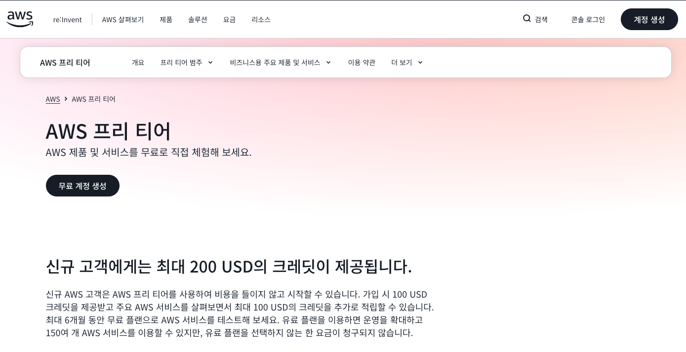
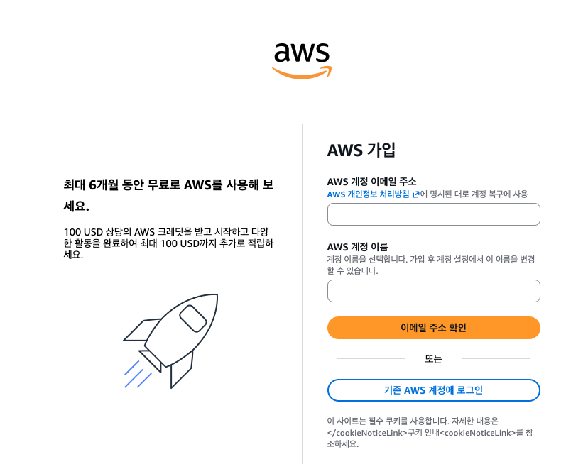
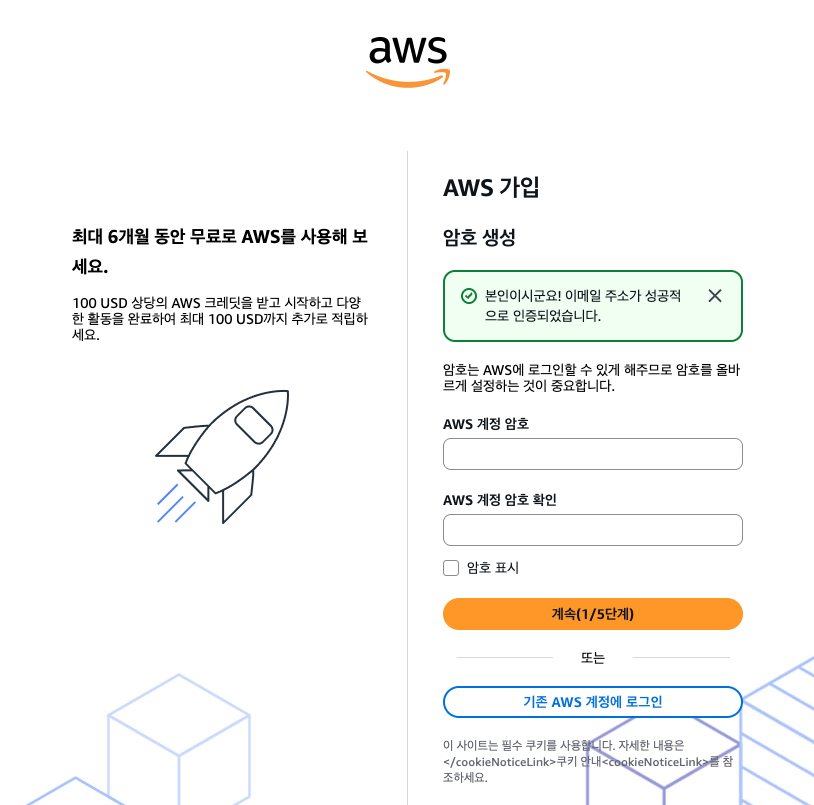
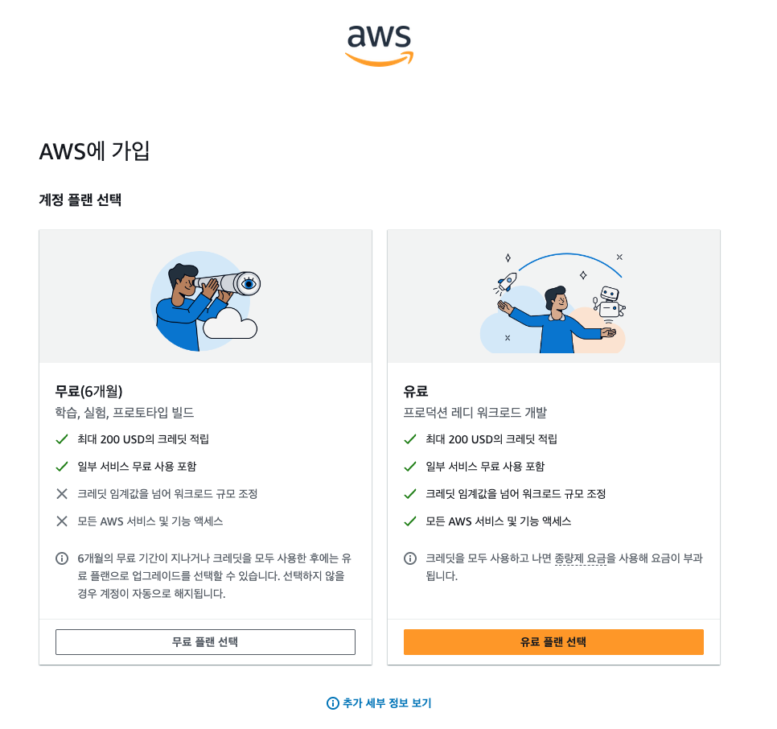
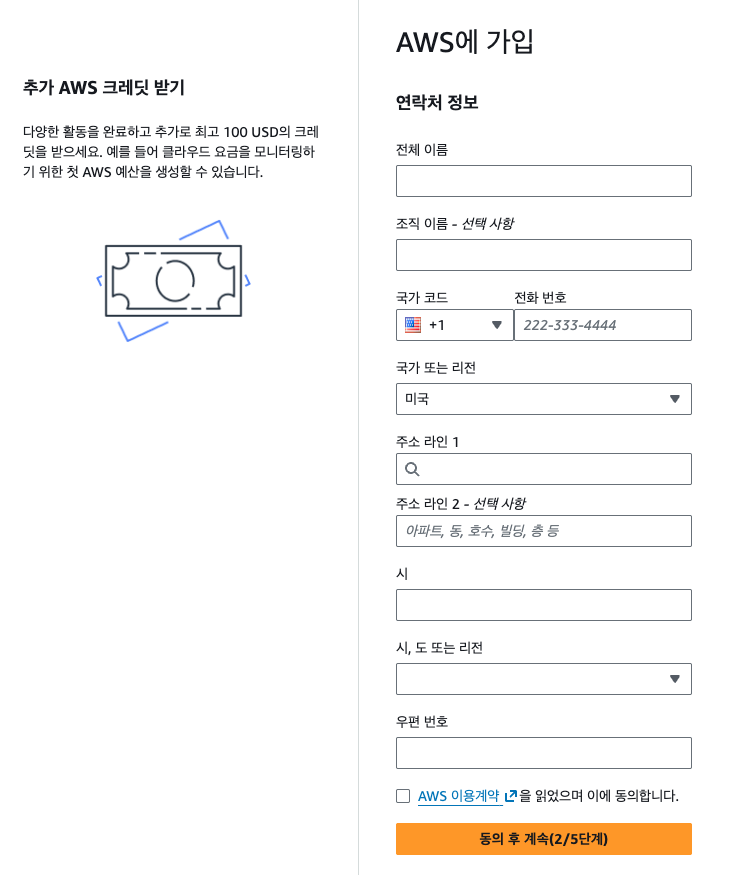
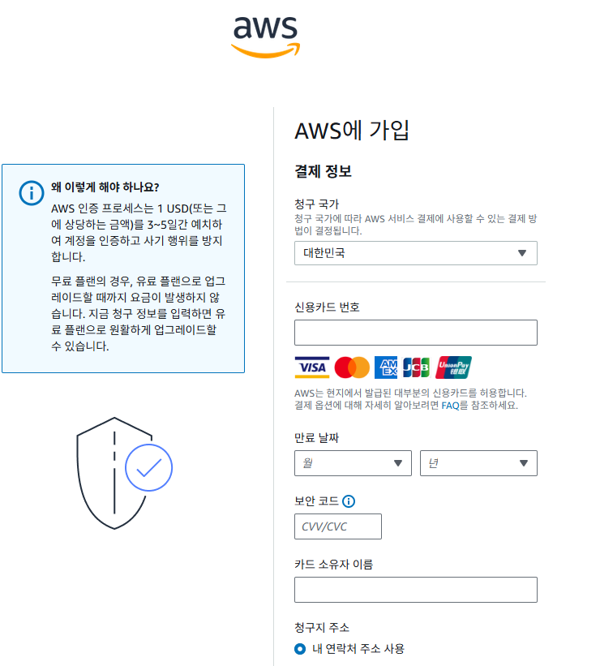
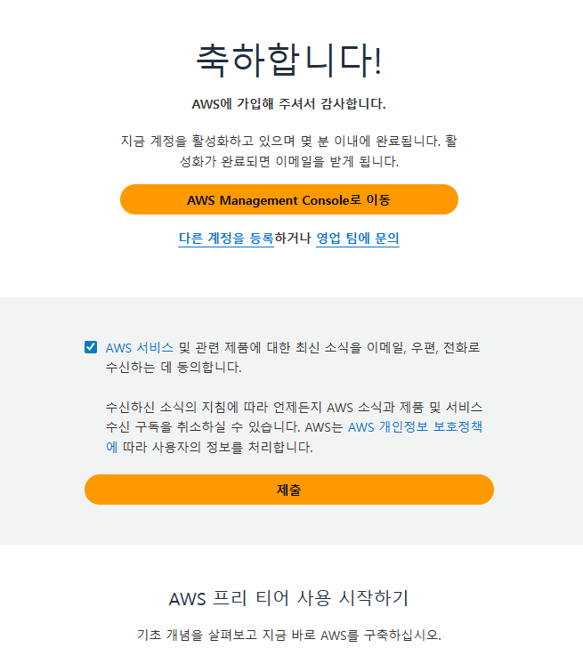

# AWS 프리 티어 가입 방법

2025년 7월 15일 이후 신규 AWS 계정은 가입 시 무료 플랜(최대 6개월)과 유료 플랜 중 하나를 선택하는 구조로 바뀌었다. 이 문서는 바뀐 구조를 기준으로 가입 과정을 정리한다.

## 무료 플랜과 유료 플랜 비교

2025-07-15 이후 만든 신규 AWS 계정은 가입 과정에서 무료 플랜(Free Plan)과 유료 플랜(Paid Plan) 중 하나를 선택한다.

| 구분 | 무료 플랜 | 유료 플랜 |
|---|---|---|
| 기간 | 최대 6개월(또는 크레딧 소진 시 먼저 종료) | 제한 없음 |
| 크레딧 | 가입 시 100달러, 온보딩 활동으로 최대 200달러까지 | 동일하게 최대 200달러 |
| 크레딧 소진 후 | 요금 청구 없이 서비스 중단 | 표준 요금으로 즉시 과금 |
| 서비스 범위 | 일부 서비스만 | 150여 개 전체 서비스 |
| 전환 | 유료 플랜으로 언제든 업그레이드 가능 | - |

## 시작하기 전 준비물

- 본인 명의 이메일 주소(인증 코드 수신 및 계정 복구용)
- 본인 명의 신용/체크카드(해외결제 가능한 카드. 무료 플랜 기간엔 청구되지 않지만 본인 확인 목적으로 요구됨)
- 전체 이름·주소 등 연락처 정보

## 1단계: 이메일·계정 이름 입력

aws.amazon.com/free 접속 후 [무료 계정 생성]을 누르면 가입 폼으로 이동한다. AWS 계정 이메일 주소는 계정 복구에 쓰이므로 실제로 받을 수 있는 주소를 입력하고, AWS 계정 이름은 나중에 설정에서 변경할 수 있다.

[이메일 주소 확인]을 누르면 입력한 이메일로 인증 코드가 발송된다. 이 시점부터 실제 계정 생성 절차가 시작되므로, 이메일 주소를 다시 한번 확인하고 누르는 것이 좋다.

## 2단계: 이메일 인증 + 비밀번호 설정

받은 코드로 이메일 인증을 마치면 "본인이시군요! 이메일 주소가 성공적으로 인증되었습니다" 메시지가 뜨고, 이어서 로그인에 쓸 비밀번호를 설정한다.

## 3단계: 계정 플랜 선택

무료(6개월)와 유료 중 하나를 선택한다. 각 카드에 포함/제외 항목이 체크·엑스 표시로 나와 있는데, 무료 플랜은 크레딧 임계값을 넘어선 워크로드 규모 조정과 모든 AWS 서비스 및 기능 액세스가 제외된다. 단순 학습·테스트 목적이면 무료 플랜으로 충분하다.

## 4단계: 연락처 정보 입력

전체 이름, 국가 코드·전화번호, 국가, 주소, 시/우편번호 등을 입력하고 AWS 이용계약 동의 체크박스를 선택한다.

## 5단계: 결제 정보 등록

청구 국가를 선택하고 신용카드 정보를 입력한다. AWS는 본인 확인·사기 방지 목적으로 카드에 1달러(또는 상당액)를 3~5일간 예치했다가 환급하며, 무료 플랜을 선택했다면 유료 플랜으로 직접 업그레이드하기 전까지 별도 요금이 청구되지 않는다.

## 6단계: 가입 완료

결제 정보까지 등록하면 "축하합니다! AWS에 가입해 주셔서 감사합니다" 화면과 함께 계정 활성화가 시작된다. 활성화는 보통 몇 분 안에 끝나고, 완료되면 이메일로 안내가 온다.

이번 가입 과정에서는 결제 정보 입력 직후 바로 완료 화면으로 넘어갔다. AWS 정책이나 계정 상태에 따라 전화번호 인증(SMS/음성 코드) 단계가 추가로 나타나는 경우도 있는 것으로 알려져 있으니, 화면 구성이 다르게 나온다면 그 단계를 거치면 된다.

## 가입 후 바로 할 일

- **루트 계정 대신 IAM 사용자 만들기**: 루트 계정은 결제·계정 설정 등 최소한의 작업에만 쓰고, 평소 작업은 IAM에서 별도 사용자를 만들어 사용한다.
- **예산 알림(Budget) 설정**: Billing 콘솔에서 예산을 만들고 특정 금액 도달 시 이메일 알림이 오도록 설정해두면, 무료 크레딧 소진 시점을 놓치지 않는다.
- **MFA(다단계 인증) 활성화**: 루트 계정에 MFA를 걸어두는 것을 AWS 공식 문서에서도 권장한다.
- **리전 확인**: 기본 리전이 의도한 곳(예: 서울 ap-northeast-2)인지 콘솔 우측 상단에서 확인한다.

> 관련: 2.  AWS - 클라우드 기초 개념
