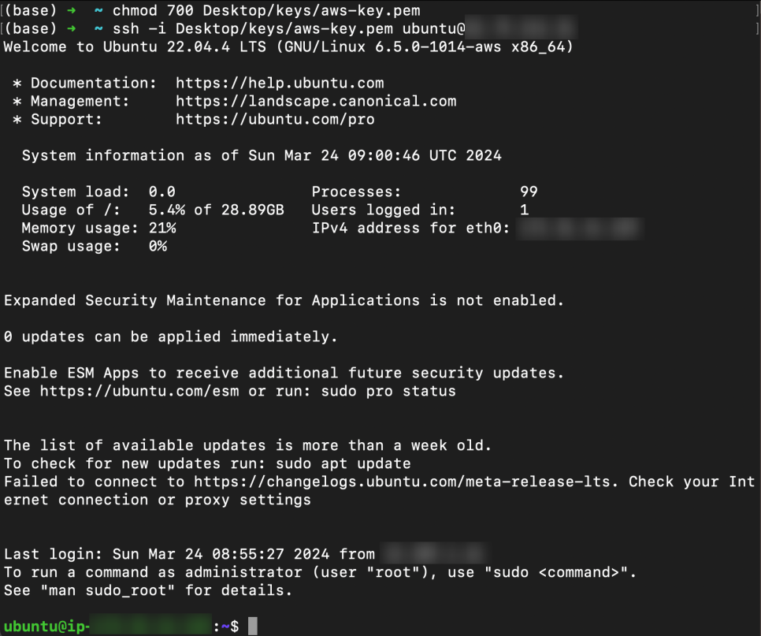

# EC2 인스턴스 접속하기

이제 대여받은 컴퓨터(인스턴스)에 접속하는 방법을 알아본다. 접속 방법은 크게 두 가지가 있다: AWS 콘솔 내에서 접속하는 방법과, 로컬 터미널에서 키 페어를 사용해 SSH로 접속하는 방법.

## 1. AWS 콘솔에서 접속하기 (EC2 Instance Connect)

생성한 인스턴스 상세 페이지에서 오른쪽 상단의 [연결] 버튼을 클릭한다.

EC2 인스턴스 연결의 값은 기본으로 둔 채로 하단의 [연결] 버튼을 클릭한다.


EC2 인스턴스에 바로 접속된다. 리눅스 명령어를 사용하여 내부 폴더를 살펴보거나 새로운 폴더를 생성할 수 있다. 외부 패키지를 설치하면 깃에 올려둔 파일을 다운로드 받아 EC2 내에서 설치할 수도 있다.


## 2. 터미널에서 키 페어로 SSH 접속하기

이전에 생성한 키 페어를 사용하여 터미널에서 EC2 인스턴스에 접속하는 방법을 다룬다. `ssh` 명령어를 사용하여 키 페어 파일 경로와 함께 EC2 인스턴스의 퍼블릭 IP를 입력한다.

```bash
ssh -i [pem 파일 경로]/aws-prod.pem ubuntu@x.xx.xxx.xx
```

해당 키 페어로는 접근이 안된다는 경고가 나온다.


`chmod` 명령어를 사용하여 키 페어의 권한을 변경해야 한다. 700은 읽기, 쓰기, 실행 모든 권한을 포함한다.

```bash
chmod 700 [pem 파일 경로]/aws-prod.pem

ssh -i [pem 파일 경로]/aws-prod.pem ubuntu@x.xx.xxx.xx
```

터미널에서도 EC2 인스턴스에 접속할 수 있게 된다.



> 관련: 2.  AWS EC2 - 배포
