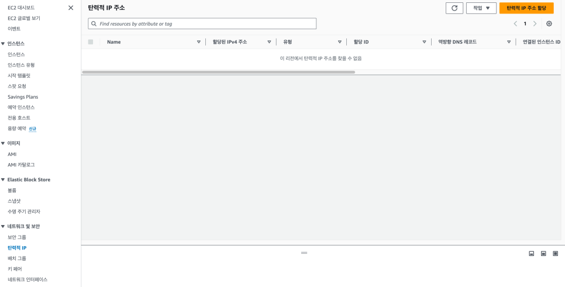
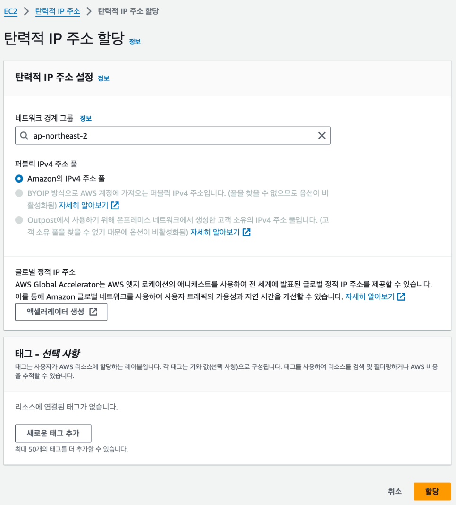
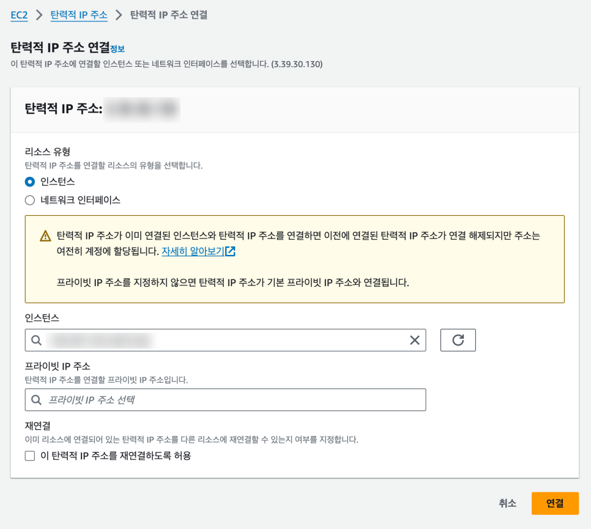

# AWS 탄력적 IP(Elastic IP) 적용하기

개념에 대한 자세한 설명은 3.  AWS EC2 - 배포 문서의 10. ENI와 Elastic IP 섹션 참고. 이 문서에서는 실제 콘솔에서 탄력적 IP를 할당하고 인스턴스에 연결하는 과정을 실습으로 다룬다.

## 탄력적 IP 소개

- EC2 인스턴스를 생성하면 고유의 퍼블릭 IP를 할당받는다. 하지만 이렇게 할당받은 IP는 인스턴스를 중지하고 다시 실행시키면 다른 IP로 변경된다. 이는 사용 중인 서비스나 애플리케이션에 큰 영향을 준다.
- 탄력적 IP(Elastic IP, EIP)는 동적 클라우드 컴퓨팅 환경에서 사용할 수 있는 정적 IPv4 주소다. 이 주소는 AWS 계정에 할당되며, 사용자가 명시적으로 해제하기 전까지 그 상태를 유지한다.
- 탄력적 IP를 사용하면 인스턴스의 장애 발생 시 다른 인스턴스로 IP 주소를 신속하게 재매핑하여 높은 가용성을 유지할 수 있다.

## 실습: 탄력적 IP 적용하기

인스턴스를 선택하여 퍼블릭 IP 주소를 확인한다. 오른쪽 상단의 [인스턴스 상태]에서 [인스턴스 중지]를 선택한다.

중지된 인스턴스를 다시 시작하면 퍼블릭 IP 주소가 변경된 것을 확인할 수 있다. 탄력적 IP를 사용하여 해당 인스턴스의 IP 주소를 고정한다. 탄력적 IP 페이지로 이동하여 [탄력적 IP 주소 할당] 버튼을 클릭한다.

기본 설정은 그대로 두고 [할당]을 클릭한다.

아이피 주소가 할당된다.

생성한 탄력적 IP의 이름을 변경한다.

EC2 인스턴스와 탄력적 IP를 연결한다. 오른쪽 상단의 [작업]에서 [탄력적 IP 주소 연결]을 선택한다.

인스턴스에서 EC2에서 생성한 인스턴스를 선택하고, 오른쪽 하단의 [연결]을 클릭한다. 연결이 완료된다.

EC2 인스턴스로 이동하면 탄력적 IP에서 할당받은 주소로 퍼블릭 IP 주소가 변경된 것을 확인할 수 있다. 이후 인스턴스를 중지하고 다시 시작해도 퍼블릭 IP 주소는 고정된다.

> 관련: 3.  AWS EC2 - 배포
