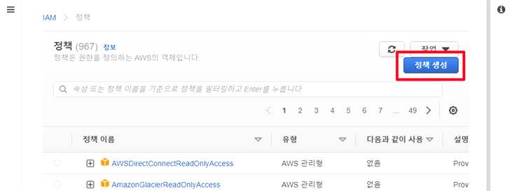
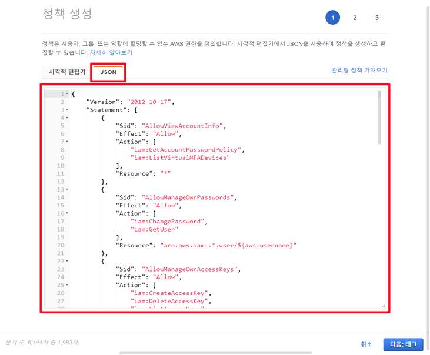
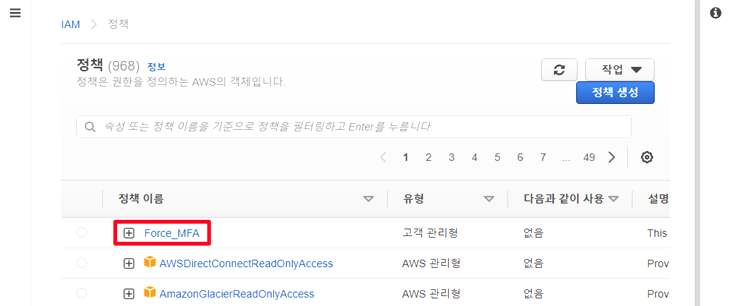
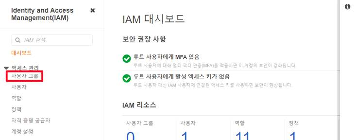
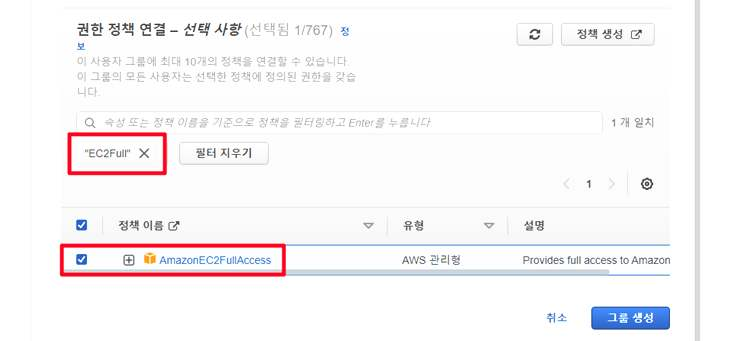
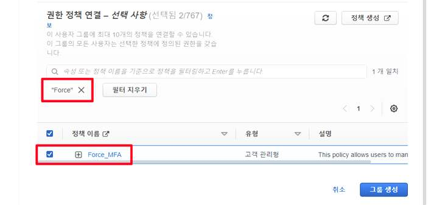
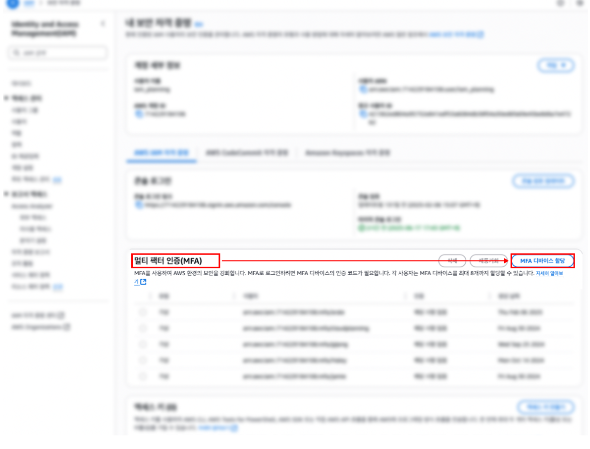
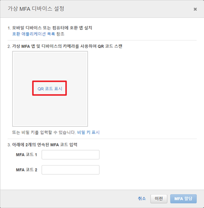
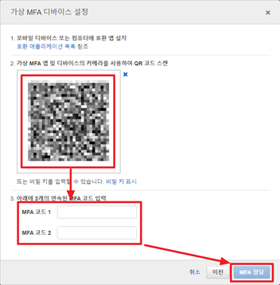

# AWS IAM - MFA 강제 정책 적용하기

IAM 사용자가 MFA(다단계 인증)를 활성화하기 전까지는 자신의 비밀번호·MFA 장치 관리 외의 어떤 작업도 할 수 없도록 강제하는 IAM 정책을 만들고, 이를 사용자 그룹에 연결해 특정 권한(EC2 전체 액세스)과 함께 적용하는 과정을 다룬다.

## 1. MFA 강제 정책(Force_MFA) 생성

IAM 대시보드 왼쪽 메뉴에서 [정책]으로 이동한다.


정책 목록 화면 오른쪽 상단의 [정책 생성] 버튼을 클릭한다.



정책 생성 화면에서 [JSON] 탭을 선택하고, MFA 인증 없이는 자신의 비밀번호·액세스 키·MFA 장치 관리 외의 모든 작업을 거부하는 정책을 작성한다.



```json
{
  "Version": "2012-10-17",
  "Statement": [
    {
      "Sid": "AllowViewAccountInfo",
      "Effect": "Allow",
      "Action": [
        "iam:GetAccountPasswordPolicy",
        "iam:ListVirtualMFADevices"
      ],
      "Resource": "*"
    },
    {
      "Sid": "AllowManageOwnPasswords",
      "Effect": "Allow",
      "Action": [
        "iam:ChangePassword",
        "iam:GetUser"
      ],
      "Resource": "arn:aws:iam::*:user/${aws:username}"
    },
    {
      "Sid": "AllowManageOwnAccessKeys",
      "Effect": "Allow",
      "Action": [
        "iam:CreateAccessKey",
        "iam:DeleteAccessKey",
        "iam:ListAccessKeys",
        "iam:UpdateAccessKey"
      ],
      "Resource": "arn:aws:iam::*:user/${aws:username}"
    },
    {
      "Sid": "AllowManageOwnVirtualMFADevice",
      "Effect": "Allow",
      "Action": [
        "iam:CreateVirtualMFADevice",
        "iam:DeleteVirtualMFADevice"
      ],
      "Resource": "arn:aws:iam::*:mfa/${aws:username}"
    },
    {
      "Sid": "AllowManageOwnUserMFA",
      "Effect": "Allow",
      "Action": [
        "iam:DeactivateMFADevice",
        "iam:EnableMFADevice",
        "iam:ListMFADevices",
        "iam:ResyncMFADevice"
      ],
      "Resource": "arn:aws:iam::*:user/${aws:username}"
    },
    {
      "Sid": "DenyAllExceptListedIfNoMFA",
      "Effect": "Deny",
      "NotAction": [
        "iam:CreateVirtualMFADevice",
        "iam:EnableMFADevice",
        "iam:GetUser",
        "iam:ListMFADevices",
        "iam:ListVirtualMFADevices",
        "iam:ResyncMFADevice",
        "sts:GetSessionToken"
      ],
      "Resource": "*",
      "Condition": {
        "BoolIfExists": {
          "aws:MultiFactorAuthPresent": "false"
        }
      }
    }
  ]
}
```

- **AllowViewAccountInfo**: 계정 비밀번호 정책 조회, 가상 MFA 장치 목록 조회를 허용한다.
- **AllowManageOwnPasswords**: 자신의 비밀번호 변경, 자신의 사용자 정보 조회를 허용한다.
- **AllowManageOwnAccessKeys**: 자신의 액세스 키 생성·삭제·조회·업데이트를 허용한다.
- **AllowManageOwnVirtualMFADevice**: 자신의 가상 MFA 장치 생성·삭제를 허용한다.
- **AllowManageOwnUserMFA**: 자신의 MFA 장치 활성화·비활성화·조회·재동기화를 허용한다.
- **DenyAllExceptListedIfNoMFA**: `aws:MultiFactorAuthPresent` 조건이 `false`인 경우, 즉 MFA로 인증하지 않은 세션에서는 위에 나열된 MFA 관련 작업을 제외한 모든 작업을 거부한다.

정책 검토 화면에서 이름을 `Force_MFA`로 지정하고 설명을 입력한 뒤 [정책 생성]을 클릭한다.


정책 목록에 Force_MFA가 고객 관리형 정책으로 추가된 것을 확인할 수 있다.



## 2. 사용자 그룹 생성 및 정책 연결

IAM 대시보드에서 [사용자 그룹] 메뉴로 이동한다.



사용자 그룹 화면 오른쪽 상단의 [그룹 생성] 버튼을 클릭한다.


그룹 이름을 `EC2MFA`로 지정한다.


권한 정책 연결 단계에서 `EC2Full`을 검색하여 AWS 관리형 정책인 `AmazonEC2FullAccess`를 체크한다.



이어서 `Force`를 검색하여 앞서 만든 `Force_MFA` 정책도 함께 체크하고 [그룹 생성]을 클릭한다.



이렇게 하면 EC2MFA 그룹에 속한 사용자는 MFA로 인증하기 전까지 EC2 관련 작업을 포함한 모든 작업이 차단되고, MFA 등록·활성화 관련 작업만 허용된다. MFA 인증을 마친 세션에서는 `DenyAllExceptListedIfNoMFA`의 거부 조건이 해제되어 그룹에 연결된 `AmazonEC2FullAccess` 권한이 정상적으로 적용된다.

## 3. 사용자 생성 및 그룹 할당

IAM 대시보드에서 [사용자] 메뉴로 이동한다.


사용자 목록 화면 오른쪽 상단의 [사용자 추가] 버튼을 클릭한다.


사용자 이름을 `MFAUser`로 입력한다. AWS 자격 증명 유형은 "암호 - AWS 관리 콘솔 액세스"를 선택하고, 콘솔 비밀번호는 자동 생성으로 두며, "사용자가 다음에 로그인할 때 새 비밀번호 생성 요청"을 체크한다.


권한 설정 단계에서 [그룹에 사용자 추가]를 선택하고, 앞서 만든 `EC2MFA` 그룹을 체크한 뒤 다음 단계로 진행한다.


사용자가 생성되면 IAM 대시보드의 리소스 현황(사용자 그룹/사용자/역할/정책 수)에 반영된다.


## 4. MFA 디바이스 등록

`Force_MFA` 정책이 적용된 사용자는 MFA 디바이스를 등록해야 다른 작업을 수행할 수 있다. 계정/패스워드 인증 방식만 사용할 경우 계정 정보 탈취나 서비스 이용 요금 과다 발생 등 AWS 이용에 심각한 위험이 발생할 수 있다. MFA(Multi-Factor Authentication)는 기존 인증 방식 외에 추가 인증 정보 입력을 요구하는 다중 인증 방식으로, AWS 콘솔 로그인 보안을 강화하며 사용 시 추가 비용은 발생하지 않는다.

AWS Management Console에 로그인한 뒤 오른쪽 상단의 계정 메뉴를 클릭하고 [보안 자격 증명]을 클릭한다.


보안 자격 증명 페이지에서 [멀티 팩터 인증(MFA)] 섹션의 [MFA 디바이스 할당] 버튼을 클릭한다.



MFA 디바이스는 패스키/보안 키, 인증 관리자 앱, 하드웨어 TOTP 토큰 세 가지 옵션이 있다. 가장 널리 쓰이는 모바일 또는 컴퓨터 앱 기반 인증 관리자 앱을 기준으로 진행한다. 디바이스 이름을 입력한다. 사용자는 MFA 디바이스를 최대 8개까지 할당할 수 있으므로, 여러 디바이스를 구분할 수 있는 이름을 붙이는 것이 좋다. 디바이스 옵션에서 [인증 관리자 앱]을 선택하고 [다음]을 클릭한다.


사용 중인 스마트폰 OS에 따라 Google Play Store 또는 Apple App Store에서 Google OTP(Google Authenticator) 등 OTP 애플리케이션을 설치한다. 가상 MFA 디바이스 설정 화면에서 [QR 코드 표시]를 클릭한다.



OTP 애플리케이션의 QR 코드 스캔 기능으로 화면에 표시된 QR 코드를 스캔하면 MFA 코드가 생성된다. 애플리케이션에 연속으로 표시되는 MFA 코드 2개를 각각 MFA 코드 1, MFA 코드 2 입력란에 입력한 뒤 [MFA 할당]을 클릭하면 설정이 완료된다.

- **MFA 코드 1**: 현재 확인되는 MFA 코드 6자리 입력
- **MFA 코드 2**: MFA 코드 1을 입력한 후 갱신되어 표시되는 새 MFA 코드 6자리 입력



설정 완료 후 AWS 콘솔에 로그인하면, 기존 계정 정보로 1차 인증을 마친 뒤 MFA 코드를 입력하는 2차 인증 과정이 추가된 것을 확인할 수 있다.


> 관련: 2.  AWS - 클라우드 기초 개념 · 3.  AWS EC2 - 배포
