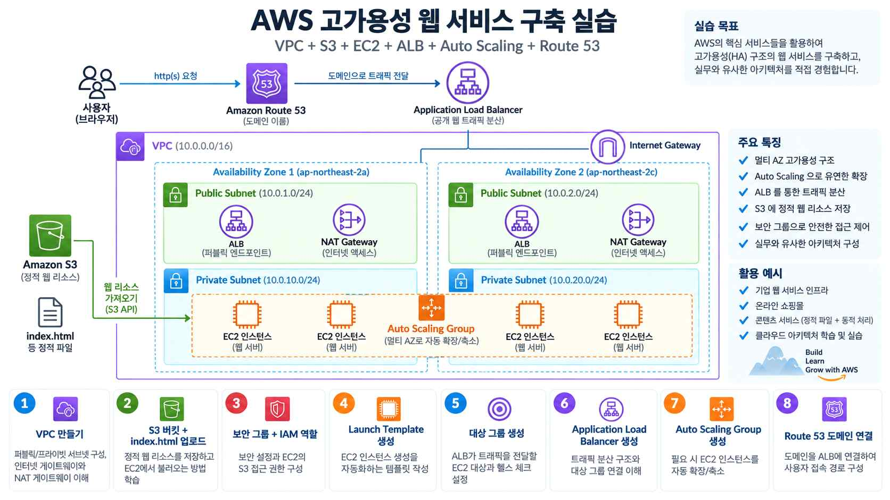
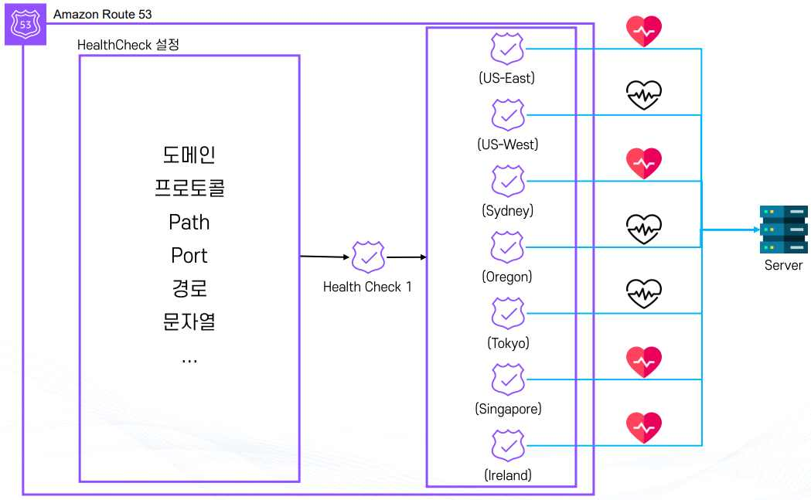
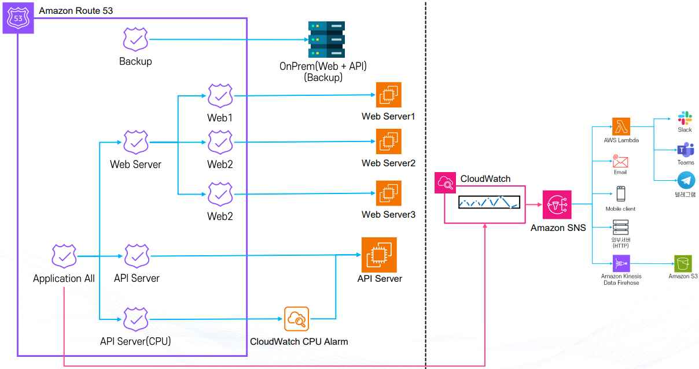
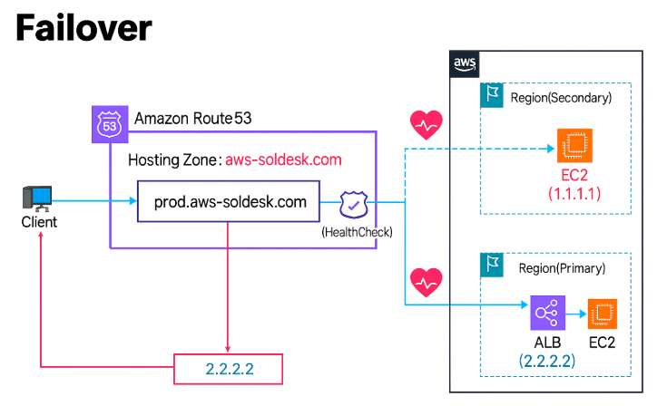
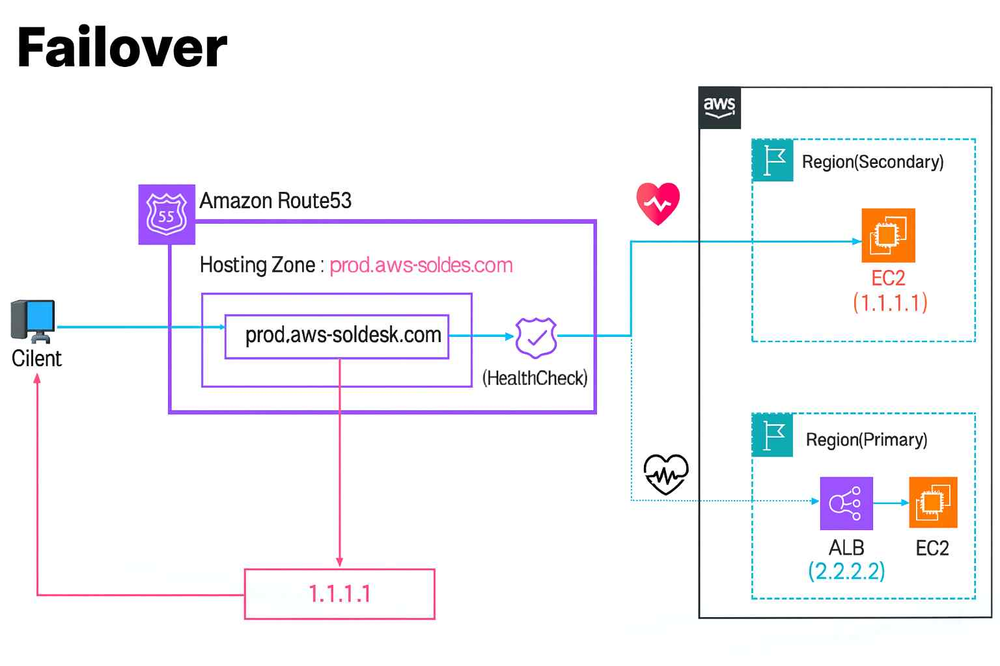

# Amazon Route 53

## 1. Route 53란

**Amazon Route 53**은 AWS에서 제공하는 DNS(Domain Name System) 서비스다. 이름은 DNS가 기본적으로 사용하는 포트 번호인 53번에서 따왔다. 사람이 기억하기 쉬운 도메인 이름(`www.example.com`)을 실제 서버의 IP 주소로 바꿔주는 역할을 한다.

**주요 특징**

* **글로벌 서비스**: 전 세계 여러 리전에 분산된 인프라를 기반으로 99.99% SLA(서비스 가용성)를 제공하며, 빠른 응답 속도와 높은 안정성을 보장한다.
* **AWS 리소스와 연동**: EC2, S3, ALB 같은 AWS 서비스와 손쉽게 연결할 수 있고, 외부 도메인과도 연동할 수 있다.

**주요 기능**

* **도메인 관리**: 도메인 등록 및 갱신, 레코드(A, CNAME, MX, TXT 등) 설정을 통한 리소스 연결
* **Health Check**: 지정한 서버나 엔드포인트가 정상적으로 응답하는지 주기적으로 확인하고, 문제가 발생하면 자동으로 다른 리소스로 트래픽을 전환한다.
* **라우팅 정책**: 단순 라우팅(가장 기본적인 방식), 지리적 라우팅(사용자 위치에 따라 가까운 리소스로 연결), 가중치 라우팅(여러 리소스에 트래픽을 일정 비율로 분산), 지연 시간 라우팅(가장 빠른 응답 속도를 제공하는 리소스로 연결)
* **하이브리드 아키텍처 지원**: 온프레미스(사내 서버)와 AWS 클라우드를 함께 사용하는 환경에서도 활용 가능

**비용 구조**

* **호스팅 영역(Hosted Zone)**: 도메인을 관리하기 위한 영역 생성 비용이 발생한다(월 $0.50).
* **DNS 쿼리**: 실제로 사용자가 도메인을 요청할 때마다 발생하는 요청 단위 과금이다.
* **추가 기능 비용**: Health Check, 트래픽 관리 같은 기능을 사용하면 별도 요금이 발생한다.

## 2. Route 53 주요 개념

\*\*도메인(Domain)\*\*은 사람이 읽기 쉬운 문자 주소로, 실제 서버의 IP 주소와 매핑된다.

* **APEX 도메인(Zone Apex, Root Domain)**: 가장 상위 단계의 순수한 도메인으로, 추가 문자열이 없는 형태다(예: `example.com`).
* **서브도메인(Subdomain)**: 도메인 이름 앞에 추가 문자열이 붙은 형태다(예: `www.example.com`, `api.example.com`, `blog.example.com`).

\*\*레코드(DNS Record)\*\*는 도메인이 어떤 방식으로 트래픽을 특정 대상으로 전달할지를 정의하는 데이터다.

| 레코드   | 역할                |
| ----- | ----------------- |
| A     | 도메인을 IPv4 주소와 연결  |
| AAAA  | 도메인을 IPv6 주소와 연결  |
| CNAME | 다른 도메인 이름으로 연결    |
| MX    | 메일 서버 주소 지정       |
| TXT   | 도메인 소유 검증이나 보안 설정 |

\*\*TTL(Time To Live)\*\*은 레코드가 다른 DNS 서버에 캐싱되는 시간이다. 값이 높으면 쿼리 수는 줄어들지만 업데이트 반영이 늦고, 값이 낮으면 업데이트는 빨라지지만 쿼리 비용이 늘어난다.

**Hosted Zone**은 특정 도메인 및 서브도메인의 레코드를 모아 관리하는 공간(컨테이너)이다. APEX 도메인과 동일한 이름으로 생성되며, 한 도메인에 대해 1개의 Hosted Zone을 만들고 그 안에 여러 레코드를 추가해 관리한다.

* 도메인 → 사람이 이해할 수 있는 주소
* 레코드 → 도메인을 어떤 방식으로 IP나 다른 리소스와 연결할지 정의
* TTL → DNS 정보가 갱신·반영되는 속도 조절
* Hosted Zone → 도메인의 모든 레코드를 모아두는 집합

## 3. 레코드의 종류

1. **A (Address) Record**: 도메인을 IPv4 주소와 연결한다(예: `example.com --> 192.33.11.2`). 가장 기본적이고 많이 쓰이는 레코드다.
2. **AAAA (IPv6 Address) Record**: 도메인을 IPv6 주소와 연결한다. 차세대 인터넷 주소 체계인 IPv6 환경에서 사용된다.
3. **CNAME (Canonical Name) Record**: 도메인을 다른 도메인 이름으로 연결한다(예: `www.example.com --> example.com`). APEX 도메인(`example.com` 같은 최상위 도메인)에는 사용할 수 없으며, 주로 `www`, `api`, `mail` 같은 서브도메인을 다른 도메인에 매핑할 때 사용한다.
4. **Alias Record(별칭 레코드)**: AWS Route 53에서만 지원되는 특별한 레코드 타입으로, 도메인과 AWS 리소스(S3, CloudFront, ALB 등)를 직접 연결할 수 있다. APEX 도메인에도 사용 가능하고(CNAME은 불가하지만 Alias는 가능), 쿼리 비용 외 추가 비용이 없으며, HTTPS 연결 시 더 효율적인 지원을 제공한다.
5. **NS (Name Server) Record**: 도메인의 권한 있는 DNS 서버(Authoritative DNS)를 지정한다. 도메인을 외부 업체에서 구입했을 때, Route 53의 NS 레코드를 등록해야 정상 작동한다.
6. **MX (Mail Exchange) Record**: 도메인과 메일 서버를 연결한다(예: `gmail.com` 메일 서버로 메일이 전달되도록 설정). 이메일 송수신을 위해 반드시 필요한 레코드다.
7. **TXT (Text) Record**: 도메인에 관련된 텍스트 정보를 저장한다. 도메인 소유권 검증(Google, AWS, Microsoft 서비스 등록 시)이나 이메일 보안 정책(SPF, DKIM, DMARC 설정)에 사용된다.

## 4. Alias Record를 우선적으로 사용하는 이유

**1) APEX 도메인(루트 도메인) 연결이 가능하다**

Alias Record의 가장 큰 장점은 APEX 도메인(`example.com`)을 AWS 리소스에 바로 연결할 수 있다는 점이다. DNS 표준 규칙상 APEX 도메인에는 CNAME 레코드를 설정할 수 없다. 예를 들어 `awsclassroom.kr --> ALB` 연결을 CNAME으로는 설정할 수 없는데, APEX 도메인에는 NS·SOA 같은 필수 DNS 정보가 이미 들어 있기 때문이다. 이때 Alias Record를 사용하면 `awsclassroom.kr --> ALB(Alias)` 형태로 직접 연결할 수 있다. 따라서 ALB, CloudFront, S3 정적 호스팅 같은 AWS 서비스와 루트 도메인을 연결할 때는 Alias Record가 사실상 필수다.

**2) 비용이 발생하지 않는다(무료)**

일반 DNS 레코드(A, CNAME 등)는 DNS 조회(Query)마다 비용이 발생하며, Route 53 요금 구조상 DNS 요청 수에 따라 과금된다(트래픽이 많아질수록 비용 증가). 반면 Alias Record는 AWS 내부 리소스와 직접 연결되는 방식이기 때문에 별도의 DNS 쿼리 비용이 부과되지 않는다. 즉 도메인 조회 비용 절감, 운영 비용 감소, 대규모 서비스에 유리하다는 장점이 있다.

**3) HTTPS 연결을 더 효율적으로 처리한다**

일반 A/AAAA 레코드 방식에서는 클라이언트가 서버에 처음 접속할 때 서버가 어떤 프로토콜을 지원하는지 바로 알 수 없다. HTTP로 접속 → HTTPS 지원 여부 확인 → HTTPS로 재연결하는 과정에서 연결 지연, 불필요한 통신 증가, 초기 접속 속도 저하 같은 문제가 발생할 수 있다. 반면 Alias Record + AWS 리소스(ALB, CloudFront)를 사용하면 HTTPS 지원 여부·인증서 정보·프로토콜 설정을 미리 알고 있기 때문에 첫 요청부터 바로 HTTPS 연결이 가능하다. 결과적으로 접속 속도 향상, 보안 강화, 사용자 경험 개선 효과가 있다.

**4) AWS 서비스와 자동 연동된다**

Alias Record는 AWS 전용 기능이므로 연결 대상이 변경되어도 DNS 설정을 다시 수정할 필요가 없다. ALB 재생성, CloudFront 재배포, S3 엔드포인트 변경 같은 상황이 발생해도 Alias는 자동으로 대상 정보를 추적한다. 반면 CNAME이나 A 레코드는 IP나 도메인이 바뀌면 직접 수정해야 한다.

## 5. Route 53 사용 과정

Route 53은 이처럼 사용자 요청을 가장 먼저 받아 ALB로 연결해주는 진입점 역할을 하며, 이후 ALB → Target Group → Auto Scaling Group의 EC2로 트래픽이 이어진다. 이 아키텍처를 처음부터 구성하는 실습은 가이드 12. VPC부터 Route 53까지: 고가용성 웹 서비스 구축 문서를 참고한다.

**1) 도메인 등록**

* 도메인은 Route 53 또는 외부 도메인 등록 기관(Domain Registrar)에서 구입할 수 있다.
* Route 53에서는 일부 국가 도메인(`.kr` 등)은 직접 구매할 수 없다.
* 이미 도메인을 가지고 있다면, Route 53으로 가져와서 관리할 수 있다.

**2) Hosted Zone 생성**

* Route 53에서 도메인을 등록한 경우: 자동으로 Hosted Zone이 생성된다.
* 외부에서 도메인을 구입한 경우: Route 53에서 수동으로 Hosted Zone을 만든 뒤, 외부 도메인 관리 페이지에서 NS(Name Server) 레코드를 Route 53에서 제공하는 네임서버로 변경해야 한다.
* Hosted Zone은 해당 도메인의 DNS 레코드를 관리하는 컨테이너 역할을 한다.

**3) 레코드 생성**

* **Alias Record**: AWS 리소스(S3 정적 웹사이트, CloudFront 배포, ALB 등)를 도메인과 연결할 때 사용한다. CNAME과 비슷하지만 APEX 도메인에도 적용할 수 있고, AWS 전용 기능이며 별도 비용이 없다.
* **CNAME 레코드**: 다른 도메인 이름으로만 연결 가능하며, APEX 도메인(`example.com`)에는 사용할 수 없다.
* **DNS 전파 시간**: 변경된 레코드가 전 세계 DNS 서버에 반영되기까지 최대 하루(24시간) 이상 걸릴 수 있다. 일반적으로 몇 분\~몇 시간 내에 반영되지만 TTL 값에 따라 차이가 있다.

## 6. Amazon Route 53 도메인 등록

**Part 1: Route 53에서 직접 도메인 구입**

AWS Route 53 콘솔에서 원하는 도메인을 검색하고 등록할 수 있다. 등록된 도메인은 Route 53에서 바로 관리할 수 있도록 설정되며, 이후 필요한 레코드(A, CNAME, MX 등)를 생성해 AWS 리소스(EC2, S3, ALB 등)와 연결할 수 있다.

**Part 2: 외부에서 구입한 도메인 연결**

이미 다른 업체(가비아, 카페24, GoDaddy 등)에서 구입한 도메인이 있다면, 해당 도메인의 네임서버(NS)를 Route 53에서 생성한 Hosted Zone의 네임서버로 변경해야 한다. 특히 `.kr` 같은 일부 도메인은 Route 53에서 직접 구입이 불가능하므로, 반드시 외부에서 구입한 뒤 Route 53으로 위임해야 한다.

**비용 구조**

* **도메인 구입 비용**: 도메인을 Route 53에서 등록하면 연 단위 비용이 발생한다(예: `.com` 약 $12/년 수준). Route 53에서 구입하든 외부에서 구입하든 상관없이 도메인 등록 자체에는 별도 비용이 들어가며, 프리 티어(무료 제공)가 없다.
* **Hosted Zone 비용**: Route 53에서 Hosted Zone을 만들면 매달 $0.50이 과금되고, 추가로 DNS 조회(Query) 횟수에 따라 요금이 발생한다. 이 부분도 프리 티어가 없다.

## 7. Route 53 Health Check

**Route 53 Health Check**는 Route 53에서 설정한 리소스(웹 애플리케이션, 서버, API 엔드포인트 등)의 상태를 모니터링하는 기능이다.

**주요 기능**

* **모니터링 및 알림**: 특정 리소스가 정상 응답을 하지 않으면 비정상 상태로 판별한다. 이 상태는 라우팅 정책(가중치 라우팅, 장애 조치 라우팅 등)에서 활용할 수 있고, Amazon CloudWatch와 연동하여 경보를 설정하고 장애가 발생하면 알림을 받을 수 있다.
* **지연(Latency) 정보 확인**: TCP Connection 시간(서버와 TCP 연결을 맺는 데 걸린 시간), HTTP/HTTPS First Byte Latency(서버에서 첫 번째 응답 바이트를 보내기까지 걸린 시간), SSL/TLS Handshake 시간(HTTPS 연결 시 암호화 과정에 걸린 시간)을 확인할 수 있다.
* **CloudWatch와 연동**: Health Check 결과는 CloudWatch Metrics로 전달되어 대시보드에서 시각화할 수 있고, CloudWatch Alarm을 설정해 Health Check가 실패하면 SNS 등을 통해 알림을 받을 수 있다.
* **리전 제한**: Route 53 Health Check는 미국 동부(버지니아 북부, `us-east-1`) 리전에서만 제공되지만, 모니터링 대상 리소스는 전 세계 어디에 있어도 상관없다.

**활용 예시**: 장애 조치(Failover) 라우팅(기본 서버가 다운되면 자동으로 대체 서버로 트래픽 전송), 성능 기반 라우팅(지연 시간이 짧은 리전에 트래픽 분산), 경보/알림(특정 리소스가 장애 상태일 때 운영자에게 알림 전송)

### 7-1. Health Check 모니터링 대상

Route 53 Health Check는 단순히 서버 하나만 보는 게 아니라 여러 가지 대상을 모니터링할 수 있다.

**1) 특정 리소스**

Health Check는 특정 IP 주소나 도메인에 주기적으로 요청을 보내 응답 여부를 확인하며, 이를 통해 해당 리소스(웹 서버, API 엔드포인트, 데이터베이스 등)가 실제로 가용 상태인지 판단한다.

* 전 세계 여러 리전에 분산된 Health Checker 노드에서 리소스를 점검한다.
* 요청은 미리 지정한 프로토콜(HTTP, HTTPS, TCP 등)과 주기에 맞춰 발송된다.
* 주기(Interval)는 10초(추가 요금 발생) 또는 30초(기본, Checker 간 동기화는 없음) 중에서 설정한다.

**상태 판단 기준(2가지 지표)**

* **응답 속도**: HTTP 연결 수립 4초 이내, TCP 연결 수립 10초 이내, HTTP 문자열 검사(HTTP String Match)는 2초 이내에 값을 확인한다.
* **응답 내용 및 실패 횟수**: 정상 응답이 특정 횟수 이상 연속 실패하면 비정상으로 판별한다.

**Health 상태 판정 방식**: 모든 Health Checker의 결과를 종합하여 판정하며, 전체 Health Checker 중 18%를 초과해 Healthy 상태를 유지해야 Health 상태로 간주된다.

**주의사항**: Health Check 대상이 AWS 외부 리소스(예: 온프레미스 서버, 다른 클라우드의 엔드포인트)일 경우 추가 요금이 발생한다.

**리소스 지정 가능 값**

* **IP 주소 기반 모드**: IPv4·IPv6를 지원하지만, 로컬 IP·Private IP·Multicast 주소는 Health Check가 불가능하다. HTTP/HTTPS는 리소스가 2xx·3xx 상태 코드를 반환하는지, TCP는 TCP 연결이 정상적으로 맺어지는지 확인한다.
* **도메인 기반 모드**: 도메인 이름을 입력하여 Health Check를 수행하며, IPv4 주소만 지원한다(즉 A 레코드만 지원). A 레코드 외(예: AAAA 레코드, CNAME만 있는 경우)는 실패(Fail) 처리된다.
* **매칭 문자열 검사**: Health Check 요청에 대한 응답 Body 내부에 특정 문자열이 있는지 확인할 수 있어, 상태 코드만이 아니라 응답 내용까지 검증할 수 있다(예: `"Success"`라는 문자열이 응답 Body에 반드시 포함되어야 Healthy로 판정).
* **Health Check Region**: 최소 3개 리전에서 Health Check가 수행되어, 전 세계 어디서든 리소스 가용성을 공정하게 판단할 수 있다.
* **기타 옵션**: 포트 지정(예: 80, 443, 8080 등), 경로(Path) 지정(HTTP/HTTPS 요청 시 `/health`, `/status` 등 특정 경로로 요청), Latency Graphs(응답 지연 정보 시각화), Inverse Check(역검증, 정상 상태일 때 Fail로 간주하고 비정상 상태일 때 Healthy로 판정하는 반대 로직)

### 7-2. Health Check 모니터링 대상 - 다른 Health Check

Route 53 Health Check는 단일 리소스(IP, 도메인 등)뿐만 아니라 다른 Health Check의 결과를 모니터링 대상으로 지정할 수 있다. 이를 통해 개별 Health Check 결과를 조합하여 더 복잡한 논리적 상태 판정을 구현할 수 있다.

**활용 예시**: 3개 이상의 Health Check를 설정해 두었을 때, 이 중 다수의 상태 검사자가 실패하면 장애로 간주하고 알림을 발송하거나 Failover 라우팅을 실행한다. 즉 단일 서버 상태만 보는 게 아니라 여러 서버나 여러 지역에 걸친 상태를 논리적 조건으로 묶을 수 있다.

**상태 판정을 위한 Health Check 조합 방식**

1. **모든 Health Check 성공 시(성공)**: 예를 들어 3개의 서버 모두 응답해야만 정상으로 간주한다. 신뢰성은 높지만 민감도가 커서 하나라도 실패하면 전체 실패로 본다.
2. **단 하나의 Health Check 성공 시(성공)**: 3개의 서버 중 1개라도 살아 있으면 정상으로 간주하며, 고가용성 환경(Active-Active 구조)에서 주로 사용한다.
3. **지정한 Health Check 숫자 중 N개 이상 성공 시(성공)**: 예를 들어 5개 중 최소 3개 이상 성공해야 정상으로 간주하며, Quorum(과반수) 개념을 적용해 특정 수준의 가용성을 보장한다.

**장점**: 단순 리소스 모니터링보다 서비스 전체의 가용성 관점에서 상태를 판정할 수 있고, 장애 감지 시 경보(CloudWatch Alarm)·라우팅 정책(Failover, Weighted, Latency 등)과 연동하여 자동 대응이 가능하다. 글로벌 서비스 운영 시 특정 리전이나 서버 몇 개에 문제가 생겨도 전체 서비스 장애로 잘못 판정하지 않게 유연하게 설정할 수 있다.

### 7-3. CloudWatch 경보를 Health Check로 모니터링

Amazon CloudWatch 경보(Alarm) 상태를 Route 53 Health Check로 모니터링할 수도 있다. 즉 특정 메트릭(CPU 사용량, 메모리, 디스크, 네트워크 지연 등)에 기반한 알람을 Health Check와 연동할 수 있으며, 이렇게 하면 단순 네트워크 응답뿐 아니라 애플리케이션 내부 성능 문제까지 반영할 수 있다.

위 구조처럼 Route 53 Health Check는 Web Server·API Server 같은 리소스를 직접 점검하는 동시에, API Server의 CPU 사용률을 감시하는 CloudWatch Alarm 상태까지 감시 대상으로 삼을 수 있다. 이렇게 조합하면 리소스가 응답은 하지만 내부적으로 CPU 과부하 같은 성능 저하를 겪고 있는 상황까지 장애로 판별하고, CloudWatch → SNS를 통해 운영자에게 알림을 전달할 수 있다.

## 8. Amazon Route 53 Routing Policy

\*\*라우팅 정책(Routing Policy)\*\*은 도메인 레코드가 어느 리소스(예: EC2, ALB, S3, CloudFront 등)로 연결될지 결정하는 방식이다. 단순히 DNS 이름 → IP 매핑을 넘어서, 트래픽 분산·장애 조치·성능 최적화까지 지원한다.

라우팅 정책의 종류는 다음과 같다: Simple, Failover, Geolocation, Geoproximity, Latency, IP-Based, Multivalue Answer, Weighted.

### 8-1. Simple Routing Policy(단순 라우팅 정책)

가장 기본적이고 단순한 라우팅 방식으로, 하나의 DNS 레코드를 하나의 대상 리소스로만 연결한다. 별도의 트래픽 분산, 조건부 라우팅, 장애 조치 기능은 제공하지 않는다.

* **동작 방식**: 사용자가 도메인(`example.com`)에 접속하면, 등록된 단일 IP 주소나 단일 엔드포인트로만 응답한다.
* **주요 사용 사례**: 단일 서버 운영 환경(웹 서버 1대에만 트래픽을 보내는 경우), 단순 테스트 환경(개발 환경이나 POC에서 빠르게 도메인을 특정 서버로 연결), 소규모 개인 홈페이지·블로그·단일 애플리케이션 배포 등
* **장점**: 설정이 매우 간단하고 빠르며, 복잡한 구조가 필요 없는 경우 가장 효율적이고 운영 관리가 쉽다.
* **한계와 주의사항**: 고가용성 불가(서버가 다운되면 서비스 전체가 중단됨), 부하 분산 불가(트래픽을 여러 서버로 나눌 수 없음), 글로벌 사용자 환경에는 적합하지 않음

### 8-2. Failover Routing Policy(장애 조치 라우팅 정책)

평소에는 기본 대상(Primary)으로 모든 트래픽을 라우팅하다가, 기본 대상에 장애가 발생하면 자동으로 보조 대상(Secondary)으로 트래픽을 전환하는 정책이다. 서비스 중단을 최소화하고 고가용성을 보장하기 위해 사용한다.

**동작 방식**: Health Check를 활용해 기본 대상의 상태를 지속적으로 모니터링한다. 기본 대상이 Fail(비정상) 상태일 경우 자동으로 보조 대상으로 라우팅하며, 보조 대상은 대기 상태(Standby)로 있다가 필요할 때만 트래픽을 처리한다.

평소(Primary 정상) 상태에서는 Health Check가 Primary(ALB+EC2)를 정상으로 판정하고, 클라이언트는 Primary 주소로 연결된다.

Primary에 장애가 발생하면 Health Check가 이를 감지해 Secondary 리전(EC2)으로 트래픽을 자동 전환하고, 클라이언트는 Secondary의 IP로 연결된다.

**주요 사용 사례**

* **Active-Passive Failover**: 평소에는 기본 대상이 모든 요청을 처리하다가, 기본 대상에 장애가 발생하면 보조 대상이 준비되어 트래픽을 처리한다(예: 서울 리전(Primary)이 다운되면 도쿄 리전(Secondary)으로 자동 전환).
* **재해 복구(Disaster Recovery)**: 특정 리전에 장애가 발생했을 때 다른 리전으로 자동 장애 조치하며, 클라우드 환경에서 지리적 이중화를 구현할 때 자주 사용한다.

**장점**: 서비스 중단을 최소화하고, 운영자가 직접 개입하지 않아도 자동으로 장애 조치를 수행하며, 보조 대상은 필요할 때만 활성화되므로 비용을 절감할 수 있다.

**주의사항**: Failover 라우팅은 반드시 Health Check와 함께 설정해야 정상 동작하며, 보조 대상이 항상 최신 상태로 준비되어 있어야 신속한 전환이 가능하다. 다수의 보조 대상을 지정할 수 있지만, 일반적으로 1차 Primary와 1차 Secondary로 구성한다.

### 8-3. Geolocation Routing Policy(위치 기반 라우팅 정책)

DNS Query가 어느 지역에서 발생했는지에 따라 서로 다른 응답을 반환하는 정책이다. 즉 요청자가 지리적으로 어디에 있느냐에 따라 응답을 달리 설정할 수 있다(예: 동남아시아 지역 요청은 한국 리전 서버로, 유럽 지역 요청은 프랑크푸르트 리전 서버로).

* **설정 단위**: 대륙(Continent), 나라(Country), 미국의 경우 주(State) 단위로 지정할 수 있다. 겹치는 범위가 있을 경우 더 세부적인 지역이 우선 적용된다(예: "아시아"와 "한국"이 동시에 설정되어 있으면 한국에서 오는 요청은 "한국" 규칙이 적용된다).
* **특징**: 관리자가 직접 지역과 리소스를 지정해야 하며, Route 53에서 자동으로 가장 가까운 리전을 선택해주는 것은 아니다. 원칙은 "내가 지정한 지역의 요청은 내가 지정한 지역의 리소스로 라우팅"한다는 것이다.
* **주요 사용 사례**: 언어별 라우팅(지역에 따라 현지화된 웹사이트를 제공), 지역별 콘텐츠 구분(저작권 문제로 특정 국가에만 콘텐츠 제공), 인프라 최적화(인구 분포·예상 사용자 부하를 고려해 각 지역 리소스로 요청 분산)
* **장점**: 특정 국가·지역 사용자에게 맞춤형 서비스를 제공할 수 있고, 불필요한 해외 트래픽을 줄여 네트워크 비용을 절감하며, 데이터 지역 규제·저작권 제한 같은 규제에 대응할 수 있다.
* **주의사항**: Geolocation Routing은 자동 최적화가 아닌 수동 정책이라 Latency Routing처럼 지연 시간을 고려해 최적 경로를 선택하지 않는다. 지정되지 않은 지역에서 요청이 오면 기본(Default) 응답을 별도로 설정해둬야 하며, 잘못 설계하면 일부 지역 사용자가 접근 불가 상태가 될 수 있다.

### 8-4. Geoproximity Routing Policy(지리적 근접 라우팅 정책)

DNS Query가 발생한 사용자의 위치와 리소스(서버)의 위치를 동시에 고려하여 라우팅하는 정책으로, 요청이 발생한 지점에서 가장 가까운 리소스로 트래픽을 전달한다. 핵심 원칙은 요청한 지역과 리소스의 거리 기반 라우팅이다.

**동작 방식**: 단순히 사용자의 위치만 고려하는 Geolocation Routing과 달리, 리소스의 위치까지 포함하여 판단한다. 기본적으로는 가장 가까운 리소스에 연결되지만, 관리자가 Bias(보정값)를 적용해 범위를 조정할 수 있다.

**Bias(편향값)**: 특정 지역 리소스가 더 많은 요청을 처리하도록 하거나, 반대로 더 적게 처리하도록 범위를 넓히거나 좁히는 조정값이다. 예를 들어 도쿄 리전 리소스에 Bias를 +값으로 설정하면 일본뿐만 아니라 주변 아시아 일부 지역 요청도 도쿄 리전으로 유도되고, 반대로 -값을 설정하면 도쿄 리전의 커버리지를 줄이고 다른 리전으로 요청이 분산되도록 조정된다.

**주요 사용 사례**: 지역별 콘텐츠 제공(사용자가 가까운 리전에서 콘텐츠를 받아 지연(latency) 최소화), 부하 분산(특정 리전에 트래픽이 집중되지 않도록 Bias를 활용해 트래픽 분산), 글로벌 서비스 최적화(전 세계 사용자가 가장 근접한 인프라에 연결되어 빠른 응답 제공)

**장점**: 물리적으로 가까운 서버에 연결되므로 지연 시간이 줄어들어 사용자 경험이 개선되고, Bias 조정을 통해 트래픽 비율을 의도적으로 제어할 수 있어 운영이 유연하며, 글로벌 서비스 운영에 적합하다.

**주의사항**: Geoproximity Routing Policy는 Route 53 Traffic Flow 기능을 사용해야 설정 가능하며, 단순 DNS 레코드 수준에서는 제공되지 않는다. Bias 설정을 잘못하면 의도치 않게 특정 리전에 부하가 집중될 수 있다.

### 8-5. Latency-Based Routing Policy(지연 시간 기반 라우팅 정책)

유저 기준으로 가장 빠른 Latency(네트워크 지연 시간)를 가진 리소스로 트래픽을 라우팅하는 정책이다. Route 53은 여러 리전 간의 지연 시간을 측정하고, 사용자가 요청할 때 가장 응답 속도가 빠른 리전에 연결한다.

**동작 방식**: 도쿄 리전과 버지니아 리전에 각각 ALB가 있다고 가정하면, 서울에서 요청이 발생했을 때 서울에서 도쿄까지의 지연 시간과 서울에서 버지니아까지의 지연 시간을 비교해, 도쿄 리전이 더 빠르다면 트래픽은 도쿄 리전으로 라우팅한다. 즉 물리적 거리보다는 실제 네트워크 지연 시간에 따라 결정된다.

**특징**: AWS 데이터 센터 간 지연 시간을 기반으로 하기 때문에, AWS 외부 네트워크 소스에서는 정확도가 떨어질 수 있다. 사용자의 위치에 따라 항상 가장 빠른 응답을 보장하려는 목적이며, Health Check와 함께 사용하면 빠르면서도 정상 상태인 리소스로만 라우팅할 수 있다.

**주요 사용 사례**: 멀티 리전 서비스 최적화(글로벌 웹사이트, 동영상 스트리밍, 게임 서비스 등에서 사용하며, 유저가 어느 지역에서 접속하든 가장 낮은 지연 시간의 리전으로 연결), Active-Active Failover 구조(여러 리전이 동시에 서비스 중일 때, 지연 시간이 가장 낮은 리전으로 연결하여 고가용성과 성능을 모두 확보)

**장점**: 전 세계 어디서 접속하든 빠른 응답 속도를 보장해 사용자 경험이 개선되고, 특정 리전에 부하가 몰리는 것을 방지해 리전 간 트래픽을 분산한다.

**주의사항**: Latency 기반이라 하더라도 실제 사용자의 ISP·인터넷 경로 품질에 따라 오차가 발생할 수 있고, 지연 시간이 빠르다고 해서 항상 비용 효율적이지는 않다(특정 리전에 더 높은 요금이 발생할 수 있음). Latency 측정은 AWS 내부 네트워크 기준이므로 외부 네트워크의 상황은 반영되지 않을 수 있다.

### 8-6. IP-based Routing Policy(IP 기반 라우팅 정책)

사용자의 IP 주소를 기준으로 트래픽 라우팅을 제어하는 정책이다. 기존의 Geolocation Routing이나 Latency-Based Routing처럼 위치·성능만 보는 것이 아니라, IP 대역(CIDR Block Range)별로 세분화하여 트래픽을 분리할 수 있는 네트워크 이해가 필요한 고급 라우팅 방식이다.

**동작 방식**: Route 53에서 사용자의 IP를 식별하고, 관리자가 설정한 CIDR 범위와 매칭한다. 특정 IP 대역에 속한 요청은 지정된 리소스로 라우팅하고, 나머지 범위는 다른 리소스로 보내도록 설정할 수 있다.

**활용 사례**

* **특정 네트워크 구분 라우팅**: 특정 ISP(통신사)에서 오는 요청만 특정 리전에 연결한다(예: 한국 통신사 대역은 서울 리전, 해외 ISP 대역은 도쿄 리전으로 분기).
* **기업 내부 네트워크 라우팅**: 회사의 사설망 또는 특정 고정 IP 대역에서 오는 요청만 개발용 시스템(Development)으로 연결한다(예: 사내 IP 대역만 개발 서버 접속 가능하게 설정).
* **보안 강화**: 허용된 IP 대역만 특정 서비스에 접근하도록 제한한다(예: 관리자용 백엔드 콘솔은 본사 IP 대역에서만 접근 가능하게 라우팅).

**장점**: 사용자 그룹을 IP 기준으로 정확히 분리할 수 있고, ISP·기업망·특정 고객사 전용 서비스 등 세밀한 라우팅 정책을 구현할 수 있어 보안과 접근 제어 관점에서 유용하다.

**주의사항**: CIDR 범위를 잘못 설정하면 정상 사용자도 접근이 차단될 수 있다. IP는 위치 정보처럼 변경될 수 있으므로 IP 기반 라우팅은 항상 최신 정보 유지가 필요하며, IPv4는 물론 IPv6 대역까지 관리 가능하지만 정책 관리가 복잡해질 수 있다.

### 8-7. Multivalue Routing Policy(다중 값 라우팅 정책)

하나의 DNS 쿼리에 대해 여러 개의 IP 주소를 응답으로 반환하는 정책이다. 클라이언트는 반환된 여러 IP 중 하나를 무작위로 선택해 연결하며, 단순하지만 DNS 차원에서 부하 분산 효과를 얻을 수 있다.

**동작 방식**: Route 53에서 하나의 레코드에 여러 개의 리소스(IP, 엔드포인트)를 등록한다. 클라이언트가 DNS 요청을 하면 여러 IP가 반환되고, 보통은 라운드 로빈 방식처럼 분산된다. Health Check와 연동하면 비정상 상태의 리소스는 응답에서 제외할 수 있다.

**주요 사용 사례**: 로드밸런싱(별도의 로드밸런서 없이 DNS 차원에서 단순하게 요청을 분산하며, 소규모 서비스나 비용 절감이 필요한 경우에 적합), 간단한 Failover(여러 IP 중 하나가 장애 상태여도 나머지 정상 IP로 연결 가능)

**장점**: 설정이 간단하고 추가 비용이 거의 없으며, Health Check를 통해 장애 리소스를 자동으로 제외하고, DNS 차원에서 빠르게 다중 리소스를 활용할 수 있다.

**한계와 주의사항**: DNS 캐싱 때문에 실제 장애 전환 속도가 느려질 수 있고, 부하 분산이 정교하지 않다(클라이언트가 선택하는 방식에 따라 불균형 발생 가능). 고급 트래픽 관리(가중치, 지연 시간 기반 등)는 지원하지 않는다.

### 8-8. Weighted Routing Policy(가중치 기반 라우팅 정책)

여러 리소스를 하나의 도메인에 묶고, 각 리소스에 가중치(Weight)를 부여해 트래픽을 비율로 분배하는 정책이다. 같은 이름과 타입의 레코드를 여러 개 만들고 각각 다른 Weight 값을 지정하며, Weight 값이 높을수록 더 많은 요청이 해당 리소스로 분배된다.

**동작 방식**: Weight 값의 범위는 1\~255다. 예를 들어 서버 A의 Weight를 70, 서버 B의 Weight를 30으로 설정하면 전체 요청의 70%는 A, 30%는 B로 분배된다. Health Check와 연동 가능하며, 비정상 리소스는 자동으로 제외된다.

**주요 사용 사례**

* **로드밸런싱**: 단순히 트래픽을 균등 분배하는 것이 아니라, 서버 성능이나 용량에 따라 가중치를 조정할 수 있다.
* **A/B 테스트**: 새로운 기능을 일부 사용자에게만 제공하고 반응을 확인할 때 사용한다(예: 기존 버전 Weight 90, 신규 버전 Weight 10).
* **카나리 릴리즈**: 신규 애플리케이션을 점진적으로 배포하여 안정성을 확인한다.
* **Active-Active Failover**: 여러 리소스를 동시에 운영하면서 가중치를 조절하여 장애 발생 시에도 안정적으로 트래픽을 분배한다.

**장점**: 트래픽을 원하는 비율로 정교하게 조정할 수 있고, 단계적 배포·실험적 기능 제공 등 유연한 운영이 가능하며, Health Check와 함께 사용하면 고가용성과 안정성을 확보할 수 있다.

**주의사항**: Weight는 상대적인 값이므로 반드시 합이 100%일 필요는 없다(예: Weight 2와 Weight 8이면 비율은 20:80). DNS 캐싱 영향으로 실제 트래픽 분배가 약간 불균형할 수 있으며, 글로벌 트래픽 분배보다는 특정 리소스 간 비율 조정에 적합하다.

> 관련: 이론 3. AWS VPC · 이론 2. AWS EC2 - 배포 · 이론 6. AWS CloudWatch · 가이드 12. VPC부터 Route 53까지: 고가용성 웹 서비스 구축 · 가이드 13. Route 53 Health Check와 라우팅 정책 실습
