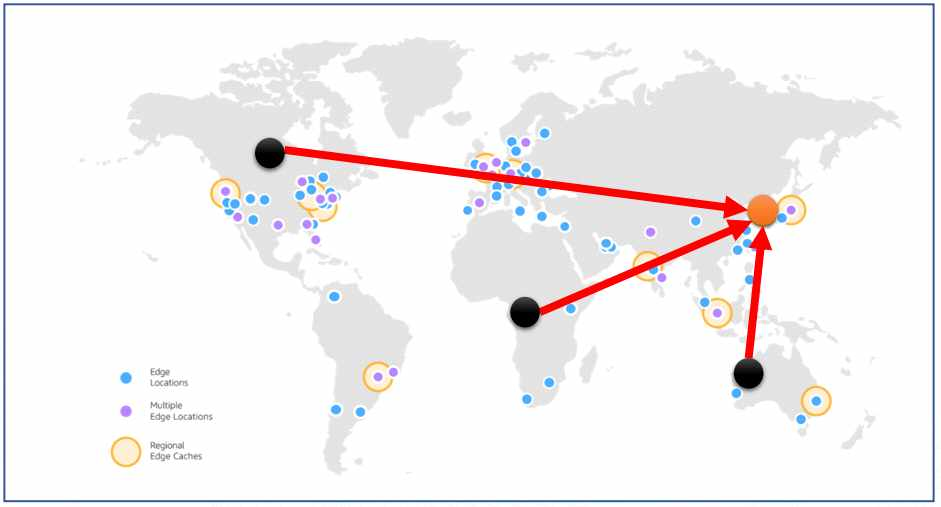
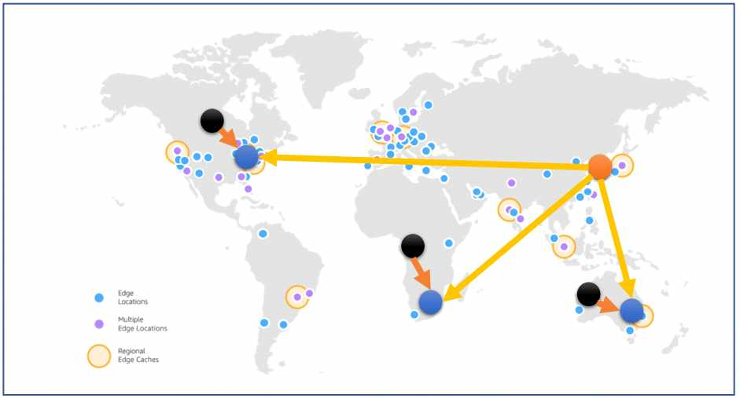
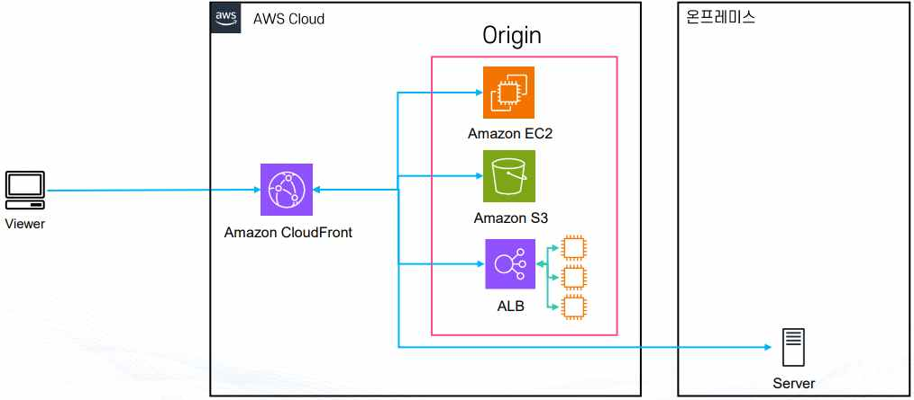
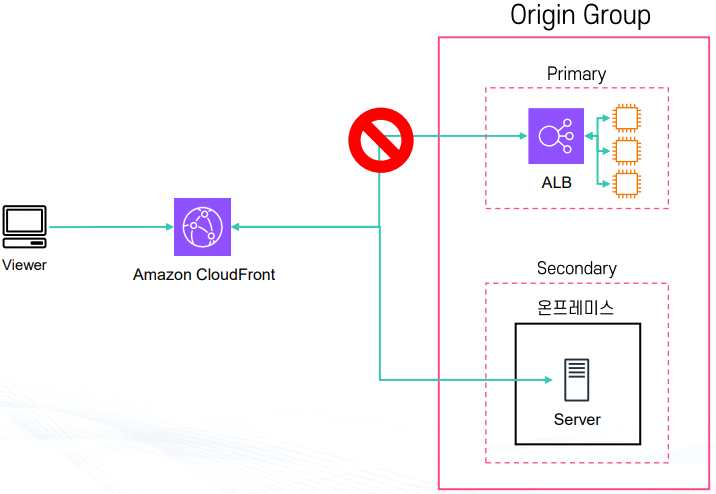
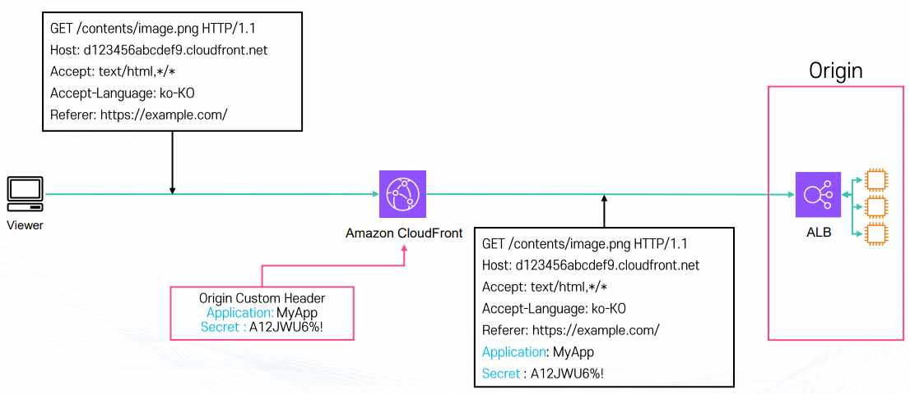
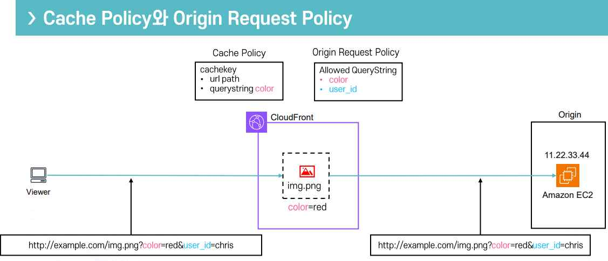
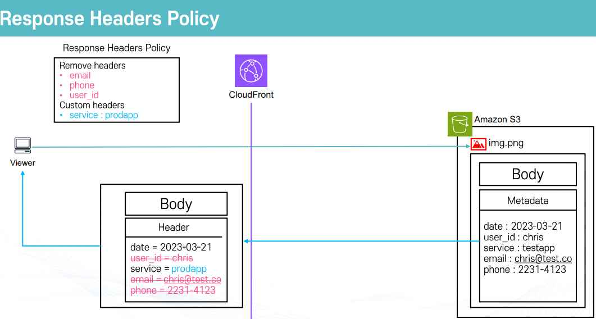
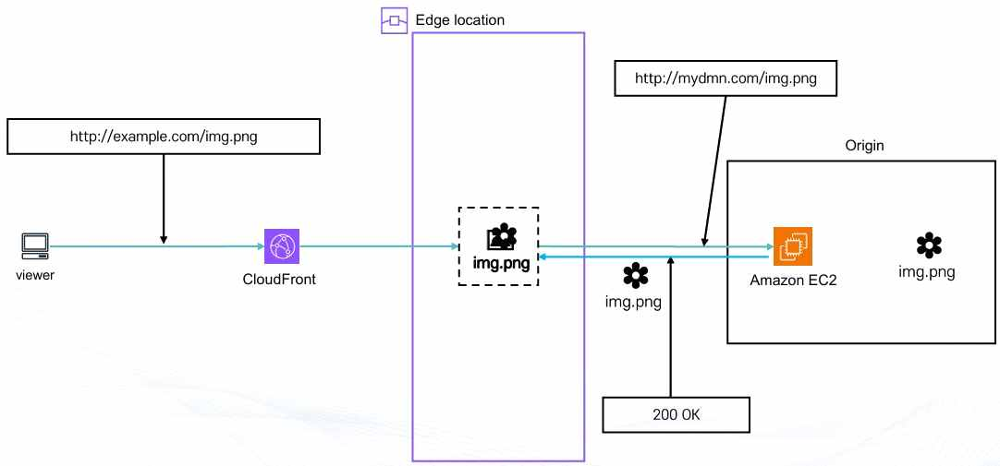
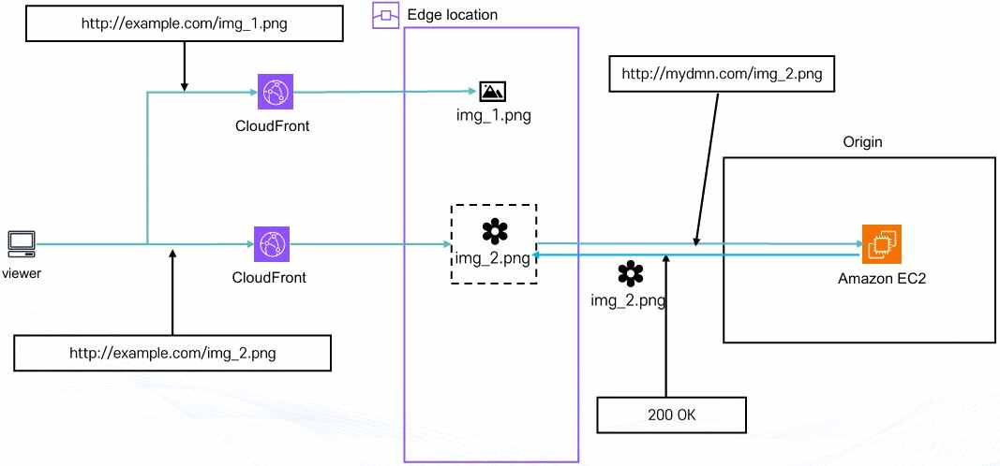

# Amazon CloudFront

## 1. CloudFront란

**Amazon CloudFront**는 AWS에서 제공하는 글로벌 콘텐츠 전송 네트워크(CDN: Content Delivery Network) 서비스다. 웹페이지, 이미지, 동영상, 애플리케이션, API와 같은 다양한 콘텐츠를 전 세계 사용자에게 빠르고 안전하게 전달하는 역할을 한다.

CloudFront는 원본 서버(Origin)의 콘텐츠를 전 세계에 분산된 엣지 로케이션(Edge Location)에 캐싱하고, 사용자는 자신과 가까운 엣지 로케이션에서 콘텐츠를 전달받는다.

**주요 특징**

* **콘텐츠 캐싱 및 제공**: 웹페이지·이미지·동영상 등의 콘텐츠를 Origin에서 가져와 엣지 로케이션에 캐싱한다. Origin은 S3 버킷, EC2, 온프레미스 서버 등이 될 수 있다. 사용자가 콘텐츠를 요청하면 가까운 엣지 로케이션에서 캐시된 콘텐츠를 전달하고, 캐시가 없는 경우에는 Origin에서 콘텐츠를 가져온 뒤 사용자에게 전달하고 엣지 로케이션에 저장한다. 같은 콘텐츠를 다시 요청하면 Origin까지 가지 않고 엣지 로케이션에서 바로 응답할 수 있다.
* **빠른 전송**: 사용자와 Origin 사이의 물리적 거리가 멀더라도 가까운 엣지 로케이션에서 콘텐츠를 받을 수 있어 네트워크 지연 시간(Latency)을 줄일 수 있다. 예를 들어 Origin이 미국에 있어도 한국 사용자는 미국 서버까지 직접 접근하지 않고 서울이나 도쿄 같은 가까운 엣지 로케이션에서 콘텐츠를 받을 수 있다.
* **일관된 콘텐츠 제공**: 엣지 로케이션에 캐싱된 콘텐츠는 설정된 캐싱 만료 시간(Expiry Time)까지 유지된다. Origin의 콘텐츠가 변경되더라도 기존 캐시가 남아 있으면 캐시가 갱신되기 전까지 사용자에게 기존 콘텐츠가 제공될 수 있다. 이를 통해 Origin의 요청 수와 서버 부하를 줄이고 안정적으로 콘텐츠를 제공할 수 있다.
* **글로벌 서비스**: 전 세계에 분산된 수많은 엣지 로케이션을 이용하며, 글로벌 사용자를 대상으로 웹사이트나 서비스를 운영할 때 유용하다.
* **정적/동적 콘텐츠 지원**: 정적 콘텐츠(HTML, CSS, JavaScript, 이미지, 동영상 등)와 동적 콘텐츠(사용자 요청에 따라 결과가 달라지는 API 응답, 데이터베이스 기반 웹 페이지 등)를 모두 지원한다.
* **보안 기능 제공**: HTTPS를 사용하여 사용자와 CloudFront 사이의 통신을 암호화할 수 있고, AWS WAF(Web Application Firewall)와 연동하여 웹 공격을 방어할 수 있으며, AWS Shield Standard가 기본 제공되어 DDoS 공격 방어에 사용할 수 있다.

**활용 사례**: 웹사이트의 HTML·CSS·JavaScript 같은 정적 파일 제공, 이미지 및 동영상 콘텐츠 전송, 동영상 스트리밍 서비스, API 응답 속도 향상, 전 세계 사용자를 대상으로 하는 웹 서비스, 글로벌 온라인 쇼핑몰에서 여러 지역의 사용자에게 빠르게 콘텐츠 제공

## 2. 엣지 로케이션(Edge Location)

**엣지 로케이션**은 CloudFront와 같은 AWS 글로벌 서비스에서 사용자와 가까운 위치에서 콘텐츠를 전달하기 위해 전 세계에 분산 배치된 네트워크 거점이다. 사용자가 웹사이트, 이미지, 동영상, API 등을 요청할 때 원본 서버까지 직접 접근하지 않고 가까운 엣지 로케이션에서 캐싱된 콘텐츠를 받을 수 있다. 이를 통해 콘텐츠 전송 속도를 높이고 Origin 서버의 부하를 줄일 수 있다.

**주요 특징**

* **빠른 전송 속도**: 사용자는 지리적으로 가까운 엣지 로케이션을 통해 콘텐츠를 전달받는다. Origin이 멀리 있어도 가까운 엣지 로케이션을 이용하기 때문에 지연 시간을 줄일 수 있다.
* **콘텐츠 캐싱**: 엣지 로케이션은 자주 요청되는 콘텐츠를 캐싱한다. 최초 요청 시 캐시가 없다면 Origin에서 콘텐츠를 가져와 엣지 로케이션에 저장하고 사용자에게 전달하며, 이후 같은 콘텐츠 요청이 들어오면 엣지 로케이션에 저장된 캐시를 바로 전달해 Origin 서버의 요청 수와 부하를 줄인다.
* **Global Accelerator와 연계**: Global Accelerator는 AWS 글로벌 네트워크를 이용하여 사용자와 애플리케이션 사이의 네트워크 연결 속도와 안정성을 향상시키는 서비스로, 사용자와 가까운 AWS 글로벌 네트워크 진입 지점을 이용해 AWS 내부 글로벌 네트워크를 통해 애플리케이션으로 트래픽을 전달한다.
* **전 세계 분산 구조**: 엣지 로케이션은 AWS Region이나 Availability Zone과는 다른 개념이다. Region과 AZ는 EC2, RDS 등의 AWS 리소스를 생성하고 운영하는 위치인 반면, 엣지 로케이션은 사용자에게 콘텐츠를 빠르게 전달하기 위한 네트워크 거점이며 서울, 도쿄, 홍콩, 미국, 유럽 등 전 세계 여러 지역에 분산되어 있다.

사용자의 요청은 지리적으로 가장 가까운 엣지 로케이션으로 우선 연결된다.



같은 방식으로, 여러 지역의 요청이 각기 가까운 엣지 로케이션으로 분산 연결된다.



## 3. 정적 콘텐츠와 동적 콘텐츠

\*\*정적 콘텐츠(Static Contents)\*\*는 서버에 저장된 파일이 모든 사용자에게 동일하게 전달되는 콘텐츠다. 사용자에 따라 내용이 달라지지 않고 항상 같은 결과를 제공하며, 내용이 자주 바뀌지 않기 때문에 캐싱(Cache)하기 좋다. 서버가 매번 새로운 결과를 계산할 필요가 없어 응답 속도가 빠르고 서버 부하가 적다. HTML, CSS, JavaScript, 이미지, 동영상 등이 해당하며, 이미지·글·뉴스 기사·정적 웹페이지가 대표적인 예시다.

* **장점**: 응답 속도가 빠르고, CDN을 사용하면 사용자와 가까운 위치에서 콘텐츠를 전달할 수 있어 성능이 더 좋아지며, 서버 부하를 줄일 수 있다.
* **단점**: 모든 사용자에게 같은 정보를 제공하기 때문에 개인화된 서비스에는 적합하지 않고, 내용이 변경되면 파일을 직접 수정하거나 새 파일로 교체해야 한다.

\*\*동적 콘텐츠(Dynamic Contents)\*\*는 시간, 사용자, 입력 값 등에 따라 내용이 달라지는 콘텐츠다. 사용자가 요청할 때마다 서버가 요청을 처리하여 새로운 결과를 만들어 전달하며, 사용자별로 서로 다른 결과를 제공할 수 있다. 정적 콘텐츠보다 서버 연산이 많이 필요하기 때문에 상대적으로 속도가 느리고 서버 부하가 커질 수 있다. PHP, JSP, ASP.NET, Node.js, Python 등 서버 사이드 기술로 구성되며, 로그인 사용자 정보·게시판·댓글·장바구니·결제 페이지가 대표적인 예시다.

* **장점**: 사용자에 맞는 개인화된 정보를 제공할 수 있고, 로그인·주문·결제·게시판 등 다양한 기능을 구현할 수 있다.
* **단점**: 요청마다 서버가 처리해야 하므로 서버 부하가 증가할 수 있고, 정적 콘텐츠보다 응답 속도가 느릴 수 있으며, 개발과 관리가 더 복잡하다.

## 4. Origin(원본)

**Origin**은 CloudFront가 사용자에게 전달할 콘텐츠를 실제로 가지고 있는 원래 서버 또는 저장소를 의미한다. CloudFront가 요청한 콘텐츠를 캐시에 가지고 있지 않으면 Origin에서 콘텐츠를 가져온다. 즉 Origin은 CloudFront가 콘텐츠를 가져오는 출발지라고 보면 된다.



**Origin 종류**

* **Amazon S3 Origin**: S3 버킷을 Origin으로 사용하는 방식이다. 이미지, HTML, CSS, JavaScript, 동영상 등 정적 콘텐츠 제공에 주로 사용하며, 별도의 웹 서버를 직접 운영하지 않아도 된다. S3 버킷 정책을 이용해 접근 권한을 제어할 수 있다.
  * **도메인 형식**: 기본 형식은 `{bucketname}.s3.{region}.amazonaws.com`이며, `s3.amazonaws.com/{bucketname}` 형식은 S3 Origin 주소로 사용하지 않는다. S3 정적 웹사이트 호스팅 기능을 사용하는 경우의 주소(`http://{bucketname}.s3-website-{region}.amazonaws.com`)는 일반 S3 Origin이 아니라 Custom Origin 형태로 처리된다.
  * **S3 전용 보안 기능**: OAI(Origin Access Identity)는 사용자가 S3에 직접 접근하지 못하게 하고 CloudFront를 통해서만 접근하도록 하는 기능이고, OAC(Origin Access Control)는 CloudFront가 S3에 안전하게 접근하도록 제어하는 기능으로 OAI보다 새로운 방식이며 더 세분화된 권한 제어와 서명 기능을 제공한다.
  * **HTTP Method**: GET 요청으로 파일을 조회할 수 있고, 설정에 따라 PUT·POST·DELETE 등의 요청도 사용할 수 있다.
  * **사용 사례**: 정적 웹사이트 배포, HTML·CSS·JavaScript·이미지 제공, 동영상·음악·PDF 등의 대용량 파일 전송, 다운로드 파일 제공
* **Custom Origin**: Amazon S3 Origin을 제외한 다른 서버를 Origin으로 사용하는 방식으로, CloudFront가 S3가 아닌 웹 서버나 애플리케이션 서버에서 콘텐츠를 가져오는 경우다. 대표적으로 MediaStore(미디어 스트리밍 콘텐츠 제공), S3 Static Hosting(S3 정적 웹사이트 호스팅 주소를 Origin으로 사용, Custom Origin으로 처리됨), Lambda Function URL(Lambda 함수가 직접 반환하는 응답을 CloudFront를 통해 제공), Application Load Balancer(여러 EC2 인스턴스에 트래픽을 분산하면서 CloudFront의 Origin으로 사용), EC2 또는 기타 HTTP 서버(Apache, Nginx, Spring, Node.js 등)가 있다.
  * **접속 방식**: HTTP와 HTTPS를 사용할 수 있으며, Origin은 도메인 이름을 사용하여 지정한다. IP 주소는 사용할 수 없다.
  * **사용 사례**: EC2에서 API나 동적 콘텐츠 제공, ALB를 통해 여러 EC2에 트래픽 분산, 온프레미스 서버를 CloudFront와 연결, 다른 클라우드의 웹 서버를 CloudFront와 연결
* **Origin 제한 사항**: 기본적으로 하나의 CloudFront Distribution에 여러 Origin을 등록할 수 있으며, 각 Origin은 Behavior와 연결하여 특정 URL 요청을 어느 Origin으로 보낼지 설정할 수 있다(예: 정적 콘텐츠는 S3에서, 동적 콘텐츠는 EC2 또는 ALB에서 제공).

### 4-1. Origin Group

**Origin Group**은 여러 Origin을 Primary와 Secondary로 묶어 Failover를 구성하는 기능이다. 평상시에는 Primary Origin에서 콘텐츠를 가져오고, Primary Origin에 장애가 발생하면 Secondary Origin으로 요청을 전환한다.

```
사용자
  |
CloudFront
  |
Origin Group
  |
  +-- Primary Origin
  |
  +-- Secondary Origin
```

* **평상시**: Primary Origin이 정상이라면 Primary에서 콘텐츠를 가져온다.
* **장애 발생 시**: Primary Origin이 정상적으로 응답하지 못하면 Secondary Origin으로 요청을 전환한다.
* **Failover 동작 조건**: Primary에서 지정된 HTTP 오류 코드가 발생한 경우, Primary와 네트워크 연결이 되지 않는 경우, 요청 시간이 초과되는 경우, 설정된 재시도 후에도 정상 응답을 받지 못하는 경우
* **적용 가능한 요청**: GET, HEAD, OPTIONS 같은 읽기 중심 요청에 대해 Failover를 사용할 수 있다.
* **추가 기능**: Primary와 Secondary가 모두 실패할 경우 사용자 정의 에러 페이지를 보여줄 수 있다(예: "현재 서버 점검 중입니다." 같은 안내 페이지).



**활용 예시**: Primary EC2 장애 발생 시 Secondary 서버로 전환, Primary 웹 서버 장애 발생 시 S3의 정적 장애 안내 페이지 제공, 특정 리전에 장애가 발생하면 다른 리전의 Origin으로 전환, 서비스 장애 시 자동으로 대체 Origin을 사용하여 서비스 중단을 최소화

### 4-2. Origin Custom Header

**Origin Custom Header**는 CloudFront가 Origin으로 요청을 보낼 때 사용자가 지정한 추가 Header를 함께 전달하는 기능이다. 쉽게 말하면 CloudFront가 Origin에 요청할 때 특정 값을 자동으로 추가해서 보내는 기능이며, 클라이언트가 같은 이름의 Header를 보내더라도 CloudFront에서 설정한 값으로 전달할 수 있다.

```
사용자
  |
CloudFront
  |
  | + Custom Header 추가
  |
Origin
```



**활용 예시**

* **보안 키 전달**: CloudFront에서만 알고 있는 특정 Header 값을 Origin에 전달한다. Origin에서는 이 Header 값이 있는 요청만 허용할 수 있어, 사용자가 Origin에 직접 접근하는 것을 제한하는 데 활용할 수 있다.
* **API Key 전달**: CloudFront가 Origin으로 API 요청을 전달할 때 필요한 값을 Header에 추가할 수 있다.
* **테스트 및 버전 구분**: 특정 API 버전이나 테스트 환경을 구분하기 위한 Header를 전달할 수 있다.
* **접근 제어**: Origin 서버에서 특정 Header 값이 있는 요청만 허용하도록 설정할 수 있다.

## 5. Amazon CloudFront 동작(Behavior)

\*\*Behavior(캐시 동작)\*\*는 CloudFront가 "요청 경로·특성"에 따라 어느 Origin으로 보낼지, 어떻게 캐시할지, 무슨 정책을 적용할지를 정의한 규칙 집합이다.

**매칭 방식**: 각 Behavior에는 경로 패턴(Path Pattern)이 있다(예: `*`(기본), `/images/*`, `*.png`, `/api/*`). 목록의 위에서부터 첫 매칭 규칙이 적용되며, 가장 범위가 넓은 기본 규칙은 보통 맨 아래 `*`로 두고 구체적인 규칙(예: `/api/*`, `/static/*`)을 위로 올린다.

**Behavior ↔ Origin(또는 Origin Group) 연결**: Behavior마다 연결할 Origin을 고른다(예: `/static/* --> S3 오리진`, `/api/* --> ALB/EC2 오리진`, `* --> 기본 오리진`). 장애 조치가 필요하면 Origin Group과 함께 사용한다.

**Cache Behavior 주요 구성 요소**

1. **Origin(원본)**: CloudFront가 실제 콘텐츠를 가져오는 곳이다(예: S3 버킷 → 이미지·정적 파일 저장소, EC2/ALB → 웹 서버·API 서버). Behavior 규칙마다 다른 Origin을 연결할 수 있다(예: `/static/* --> S3`, `/api/* --> EC2/ALB`).
2. **뷰어 설정(Viewer Settings)**: 사용자가 CloudFront에 요청을 보낼 때 어떻게 처리할지 정하는 설정이다.
3. **추가 정책 연결**: Cache Policy(캐시 정책, 어떤 값을 기준으로 캐시를 구분할지 정함), TTL(캐시 유지 시간)도 함께 설정하며, Viewer Response Policy(응답 헤더 정책), Lambda@Edge 연결(CloudFront 경계 지점에서 실행되는 코드)도 연결할 수 있다.

### 5-1. Viewer 설정

**Viewer**는 CloudFront에서 "콘텐츠를 요청하는 클라이언트"를 뜻한다(사용자 브라우저나 앱을 Viewer라고 한다).

1. **Viewer 프로토콜**(사용자가 어떤 방식으로 접근할 수 있는지)
   * **HTTP and HTTPS**: 두 가지 다 허용한다(실습 초반에는 편하지만 보안상 권장되지 않음).
   * **Redirect HTTP to HTTPS**: 사용자가 HTTP로 접속하면 자동으로 HTTPS로 리다이렉트한다(가장 많이 쓰는 옵션, 보안+편의).
   * **HTTPS only**: HTTPS 요청만 허용한다(보안에 가장 강력).
2. **HTTP Method**(사용자가 보낼 수 있는 요청 종류)
   * 정적 콘텐츠(이미지, HTML, CSS, JS)는 GET·HEAD 정도만 허용해도 충분하다.
   * API 요청(동적 처리 필요)은 GET, HEAD, OPTIONS, PUT, POST, PATCH, DELETE를 허용할 수 있다.
   * OPTIONS는 보통 CORS(교차 출처 요청) 확인용으로 필요하다.
3. **뷰어 액세스 제한**(콘텐츠 접근 제어)
   * **Presigned URL / Presigned Cookie**: 서명된 URL 또는 쿠키를 가진 사용자만 접근 가능하도록 제한한다(예: 영상 스트리밍 서비스에서 결제한 사용자만 접근, S3의 개인 파일을 프리사인드 URL을 발급받은 사람만 다운로드).

### 5-2. Policy 설정

**Policy**란 CloudFront에서 "어떤 규칙대로 요청과 응답을 다룰지" 정리해 놓은 설정 묶음이다. 즉 캐시·요청·응답 처리 방식을 표준화해 두고, 여러 Behavior에서 재사용할 수 있는 설정이다. 예를 들어 "모든 정적 파일은 1시간 캐시하고, 특정 헤더만 전달해라" 같은 규칙을 Policy로 만들어두면 다른 Behavior에도 그대로 붙여서 쓸 수 있다.

1. **Cache Policy(캐시 정책)**: 무엇을 기준으로 캐시를 다르게 저장할지 결정한다.
   * HTTP Header: 요청/응답에 담긴 부가 정보(브라우저, 언어, 인증 등)에 따라 캐시 구분
   * 쿠키(Cookie): 사용자 로그인 상태나 세션 값 같은 쿠키 값에 따라 캐시 구분
   * 쿼리스트링(Query String): URL 뒤에 붙는 파라미터 값(예: `?id=1`)에 따라 캐시 구분
   * 얼마 동안 캐시할지(TTL: Time To Live) 설정: 최소 TTL, 기본 TTL, 최대 TTL
   * 압축 관련 설정: 브라우저가 gzip이나 brotli를 지원할 때 자동 압축
2. **Origin Request Policy(원본 요청 정책)**: CloudFront가 Origin(EC2, S3 등)으로 요청을 보낼 때 어떤 헤더·쿠키·쿼리스트링을 전달할지 결정한다. 캐시 정책(Cache Policy)과는 별개로, Origin에 전달할 내용을 세밀하게 조정할 수 있다.
3. **Response Headers Policy(응답 헤더 정책)**: Origin에서 응답을 보낸 뒤, CloudFront가 최종적으로 Viewer에게 돌려줄 때 헤더를 추가·수정·삭제할 수 있다.

Cache Policy와 Origin Request Policy는 함께 사용되어, 캐시 키(cachekey)를 무엇으로 정할지와 Origin에 허용해서 넘길 쿼리스트링을 각각 정의한다.



Response Headers Policy는 Origin 응답에 담긴 헤더 중 일부를 제거하거나 새 헤더를 추가해 Viewer에게 돌려준다.



## 6. API와 CloudFront

\*\*API(Application Programming Interface)\*\*는 프로그램과 프로그램이 서로 정보를 주고받기 위한 약속된 통신 방법이다. 쉽게 말하면 사용자가 서버에게 "이 작업을 해줘"라고 요청할 때 사용하는 통로라고 보면 된다. 웹에서는 주로 HTTP 또는 HTTPS를 이용해서 API 요청을 보낸다.

**API를 쉽게 이해하기**: 쇼핑몰에서 상품 목록을 본다고 가정하면, 사용자가 상품 목록을 클릭 → 브라우저가 서버에 상품 목록 요청 → 서버가 상품 정보 확인 → 상품 목록을 다시 사용자에게 전달하는 흐름에서, 브라우저가 서버에 상품 정보를 요청하는 방식이 API라고 볼 수 있다(예: `/api/hello`는 API 서버 동작 확인용 테스트 주소, `/api/login`은 로그인 처리, `/api/products`는 상품 목록 조회, `/api/order`는 주문 처리).

**일반 파일과 API의 차이**: 웹사이트에는 크게 정적 파일과 동적으로 처리되는 요청이 있다. 정적 파일(`index.html`, `style.css`, `app.js`, `logo.png`, `image.jpg`)은 미리 만들어져 있는 파일을 그대로 전달하므로 서버에서 별도의 계산이 필요 없고 S3 같은 저장소에서 제공하기 좋다. 반면 API 요청(로그인, 회원가입, 상품 조회, 게시글 작성, 주문 처리, 데이터 수정·삭제)은 사용자의 요청을 서버가 직접 처리해야 하므로 단순히 파일만 전달해서 처리할 수 없고, 서버 프로그램이 요청을 받아서 필요한 작업을 수행해야 한다.

```
정적 파일 요청: 사용자 --> CloudFront --> S3 --> HTML/CSS/JavaScript/이미지 전달
API 요청:     사용자 --> CloudFront --> ALB --> EC2 --> 서버 프로그램이 요청 처리 --> 결과 반환
```

**CloudFront에서 API를 사용하는 이유**: CloudFront는 하나의 배포에 여러 Origin을 연결할 수 있다. 예를 들어 정적 파일은 S3에서 제공하고 API 요청은 ALB 또는 EC2에서 처리하도록 나눌 수 있으며, 이때 CloudFront의 Behavior를 이용해서 요청 경로별로 Origin을 구분한다(예: `* --> S3`, `/api/* --> ALB`). 사용자가 `https://example.com/index.html`로 접속하면 `/api/`로 시작하지 않기 때문에 기본 Behavior(`*`)가 적용되어 S3에서 `index.html`을 가져와 전달하고, `https://example.com/api/hello`로 접속하면 `/api/*` Behavior가 적용되어 요청이 ALB로 전달되고 ALB는 요청을 EC2로 전달하며 EC2에서 API 요청을 처리하고 결과를 반환한다.

```
사용자
  ↓
CloudFront
  ↓
요청 주소 확인
  ↓
/index.html      --> S3
/logo.png        --> S3
/style.css       --> S3

/api/hello        --> ALB --> EC2
/api/login        --> ALB --> EC2
/api/products     --> ALB --> EC2
```

**ALB를 사용하는 이유**: ALB(Application Load Balancer)는 여러 EC2 인스턴스에 요청을 분산해주는 서비스다. API 서버가 EC2 한 대만 있으면 해당 EC2에 장애가 발생했을 때 서비스가 중단될 수 있으므로, 여러 EC2 인스턴스를 사용하고 ALB를 앞에 두면 요청을 여러 서버에 분산할 수 있다(`CloudFront → ALB → EC2-1/EC2-2/EC2-3`). ALB는 정상적으로 동작하는 EC2에만 요청을 전달한다.

**OAC(Origin Access Control)를 통한 S3 보호**: CloudFront가 S3 같은 Origin에 안전하게 접근할 수 있도록 권한을 제어하는 기능이다. S3 버킷을 Public으로 공개하지 않고 Private 상태로 유지할 수 있으며, 사용자가 S3 주소로 직접 접근하는 것은 차단하고 CloudFront를 통해 들어오는 요청만 S3에서 허용할 수 있다. 즉 S3 콘텐츠를 인터넷에 직접 노출하지 않고 CloudFront를 통해서만 제공하도록 만드는 보안 기능이다(`사용자 --> CloudFront --> OAC를 이용한 인증된 요청 --> Private S3 Bucket`). S3 버킷을 Public으로 열 필요가 없고, 사용자의 S3 직접 접근을 차단할 수 있어 보안성이 높아진다.

## 7. CloudFront 파일 관리

CloudFront는 한 번 가져온 파일을 엣지 로케이션에 캐싱해서 사용자에게 전달한다. 그런데 원본 파일이 수정되더라도 CloudFront에 예전 파일이 캐싱되어 있으면 사용자는 일정 시간 동안 예전 파일을 받을 수 있다. 따라서 파일을 수정했을 때 최신 파일을 사용자에게 어떻게 전달할 것인지 관리할 필요가 있으며, 대표적인 방법은 2가지다.

### 7-1. 싱글 파일 관리 방식(Invalidation)

처음 사용자가 `style.css`를 요청하면 CloudFront는 Origin에서 파일을 가져와 캐싱하고 사용자에게 전달한다(`사용자 요청 --> CloudFront 캐시 확인 --> 캐시가 없으면 Origin에서 style.css 가져오기 --> CloudFront에 캐싱 --> 사용자에게 전달`). 이후 Origin의 `style.css` 내용을 수정해도 CloudFront에는 이전 파일이 캐싱되어 있을 수 있어(Origin: 최신 `style.css` / CloudFront: 이전 캐시가 남아 있을 수 있음), 이 상태에서 사용자가 다시 요청하면 최신 파일이 아니라 기존 캐시 파일을 받을 수 있다. 최신 파일을 바로 적용하려면 Invalidation(캐시 무효화)을 사용한다.



**Invalidation**은 CloudFront의 캐시에 저장된 파일을 강제로 무효화(삭제)해서, 원본 서버에서 최신 파일을 다시 가져오도록 만드는 과정이다. 즉 기존에 캐시에 남아 있던 오래된 파일 대신 새로 갱신된 파일을 사용자에게 바로 제공할 수 있게 한다.

* **필요한 경우**: 버저닝 방식이 아닌 경우, 예를 들어 파일 이름을 계속 동일하게 사용하면서(`style.css`) 내용을 바꿨다면 캐시에 저장된 예전 버전이 계속 사용자에게 전달될 수 있다. 이때 Invalidation을 통해 캐시를 지워야만 CloudFront가 원본 서버에서 새 파일을 다시 받아 사용자에게 최신 파일을 전달한다.
* **경로(Path) 기반 Invalidation**: 특정 파일만 무효화하거나 여러 파일을 한꺼번에 무효화할 수 있다(예: `/img/img1.png` — 단일 파일만 무효화, `/img/*` — img 폴더 안의 모든 파일 무효화, `/img/img*` — img로 시작하는 파일들을 무효화).
* **제한과 비용**: 한 번 요청으로 최대 3,000개의 파일까지 무효화 가능하다(예: 100개씩 30번, 혹은 1,000개씩 3번 요청). 한 달에 1,000개 경로(Path)까지는 무료(모든 배포 Distribution 합산 기준)이며, 무료 횟수를 넘으면 경로당 약 $0.005의 비용이 발생한다.
* **장점**: 파일 이름을 계속 동일하게 사용할 수 있어 HTML이나 JavaScript에서 파일 경로를 매번 변경할 필요가 없다.
* **단점**: 파일을 수정해도 기존 캐시 때문에 바로 최신 파일이 보이지 않을 수 있고, 최신 파일을 즉시 적용하려면 Invalidation 작업이 필요할 수 있다.

### 7-2. 버저닝 관리 방식(Versioning)

파일을 수정할 때 파일 이름에 버전 정보를 붙여 새로운 파일로 만드는 방식이다(예: `style_v1.css --> style_v2.css`). CloudFront는 파일 이름이 다르면 서로 다른 파일로 인식하므로(`style_v1.css`와 `style_v2.css`는 별개의 파일로 처리), 새로운 `style_v2.css`를 요청하면 기존 `style_v1.css` 캐시와 관계없이 Origin에서 새 파일을 가져와 캐싱한다.

**동작 방식**: `style_v1.css` 사용 → 새 버전 `style_v2.css` 생성 → HTML에서 파일 경로 변경 → CloudFront가 새로운 파일로 인식 → Origin에서 `style_v2.css`를 가져와 캐싱



* **장점**: 기존 캐시를 삭제할 필요가 없고, Invalidation을 하지 않아도 새로운 파일을 바로 배포할 수 있다.
* **단점**: 파일 이름이 변경되므로, HTML이나 JavaScript에서 사용하는 파일 경로도 새로운 버전으로 수정해야 한다.

> 관련: 이론 4. AWS S3 · 이론 2. AWS EC2 - 배포 · 이론 11. Amazon Route 53 · 가이드 14. CloudFront 실습: Origin·Behavior·버저닝
