# Terraform - ALB · ASG

이 문서는 Packer로 AMI를 만들고 Terraform으로 ALB와 Auto Scaling Group을 구성하는 방법과 SNS 알림 연동 실습을 정리한다.

## 1. ASG와 ELB 서비스 이해

## 2. Auto Scaling Group (ASG)의 이해

Auto Scaling Group은 AWS에서 EC2 인스턴스의 수를 자동으로 관리하는 서비스이다. 클라우드 환경에서 서비스 트래픽은 일정하지 않기 때문에, 서버 수를 사람이 직접 관리하는 것은 비효율적이다. 트래픽이 증가하면 서버가 부족해지고, 트래픽이 감소하면 서버가 과도하게 남아 비용이 증가한다.

이 문제를 해결하기 위해 AWS에서는 Auto Scaling Group(ASG)이라는 기능을 제공한다. ASG는 애플리케이션의 사용량이나 트래픽 상황에 따라 EC2 인스턴스를 자동으로 추가하거나 제거하여 시스템 성능을 유지하면서 비용을 최적화하는 서비스이다.

예를 들어 웹 서비스가 평소에는 사용자가 많지 않지만 특정 시간대나 이벤트 기간에 사용자가 급증한다고 가정해보자. 이 경우 서버를 항상 많이 실행하면 비용이 낭비되고, 반대로 서버를 적게 실행하면 트래픽 증가 시 서비스 장애가 발생할 수 있다.

Auto Scaling Group을 사용하면 이러한 상황에서 트래픽 증가 시 EC2 인스턴스를 자동으로 추가하고, 트래픽 감소 시 인스턴스를 자동으로 제거하여 시스템을 안정적으로 운영할 수 있다.

또한 ASG는 단순히 서버 수를 조절하는 것뿐만 아니라 장애가 발생한 인스턴스를 자동으로 교체하는 기능도 제공한다. 예를 들어 EC2 인스턴스가 갑자기 종료되거나 장애가 발생하면 ASG는 이를 감지하고 새로운 EC2 인스턴스를 생성하여 서비스 가용성을 유지한다.

따라서 Auto Scaling Group은 다음과 같은 목적을 가진다.

* 트래픽 변화에 따른 자동 확장
* 서비스 가용성 유지
* 장애 자동 복구
* 비용 최적화

이러한 이유로 Auto Scaling Group은 클라우드 환경에서 안정적인 서비스를 운영하기 위한 핵심 기능 중 하나이다.

## 3. ASG의 주요 개념

Auto Scaling Group은 EC2 인스턴스를 관리하기 위해 최소, 최대, 목표 인스턴스 수라는 세 가지 핵심 개념을 사용한다.

먼저 Minimum Capacity(최소 인스턴스 수)는 Auto Scaling Group이 항상 유지해야 하는 최소 EC2 인스턴스 개수이다. 예를 들어 최소 인스턴스 수를 1로 설정하면 어떤 상황에서도 최소 한 개의 EC2 인스턴스는 항상 실행된다. 이는 서비스가 완전히 중단되는 상황을 방지하기 위한 설정이다.

다음으로 Desired Capacity(목표 인스턴스 수)는 현재 Auto Scaling Group이 유지하려는 EC2 인스턴스 개수를 의미한다. 예를 들어 Desired Capacity가 2로 설정되어 있다면 ASG는 항상 EC2 인스턴스 2개를 유지하려고 한다. 만약 인스턴스 하나가 장애로 종료되면 새로운 인스턴스를 자동으로 생성하여 다시 2개를 유지한다.

마지막으로 Maximum Capacity(최대 인스턴스 수)는 Auto Scaling Group이 확장할 수 있는 최대 EC2 인스턴스 개수이다. 예를 들어 최대 인스턴스 수가 4로 설정되어 있다면 트래픽이 아무리 증가하더라도 EC2 인스턴스는 최대 4개까지만 생성된다.

이 세 가지 설정을 통해 Auto Scaling Group은 설정된 범위 내에서 EC2 인스턴스 수를 자동으로 조절한다.

예를 들어 다음과 같이 설정했다고 가정하자.

```hcl
Minimum = 1
Desired = 2
Maximum = 4

이 경우 기본적으로 EC2 인스턴스는 2개가 실행된다.
트래픽이 증가하면 인스턴스가 3개, 4개까지 자동으로 증가할 수 있으며,
트래픽이 감소하면 다시 2개 또는 1개까지 줄어들 수 있다.

# ASG의 동작 방식

Auto Scaling Group은 Scale Out과 Scale In이라는 두 가지 방식으로 동작한다.

Scale Out은 인스턴스를 추가하는 확장 방식이다.
예를 들어 CPU 사용률이 높거나 네트워크 트래픽이 증가하면 ASG는 새로운 EC2 인스턴스를 생성하여
서버 처리 능력을 증가시킨다. 이를 통해 갑작스러운 트래픽 증가에도 서비스 성능을 유지할 수 있다.

반대로 Scale In은 인스턴스를 제거하는 축소 방식이다.
트래픽이 감소하고 서버 사용률이 낮아지면 불필요한 EC2 인스턴스를 종료하여 비용을 절감한다.

이러한 확장과 축소 과정은 CloudWatch 모니터링 지표를 기반으로 자동으로 이루어진다.

예를 들어 CPU 사용률이 70% 이상이면 서버를 추가하고,
CPU 사용률이 20% 이하로 떨어지면 서버를 줄이는 방식으로 정책을 설정할 수 있다.

이와 같은 자동 확장 기능을 통해 Auto Scaling Group은 서비스 성능과 비용 효율성을 동시에 유지할 수 있다.

# Elastic Load Balancer (ELB)의 이해

Elastic Load Balancer는 여러 EC2 인스턴스에 네트워크 트래픽을 분산시키는 AWS 서비스이다.

웹 서비스에서는 많은 사용자 요청이 동시에 발생할 수 있다.
만약 모든 요청이 하나의 서버로 집중된다면 서버 부하가 증가하여 서비스가 느려지거나 장애가 발생할 수 있다.

Elastic Load Balancer는 이러한 문제를 해결하기 위해 사용자 요청을 여러 EC2 인스턴스에 분산하여 전달한다.

예를 들어 사용자의 요청이 들어오면 ELB는 다음과 같이 트래픽을 분산시킨다.
```

* 사용자 요청 ---> Load Balancer
* -> EC2 Instance 1
* -> EC2 Instance 2
* -> EC2 Instance 3

이러한 구조를 통해 서버 부하를 분산하고 시스템의 안정성을 높일 수 있다.

또한 Load Balancer는 단순히 트래픽을 분산하는 기능뿐만 아니라 헬스 체크 기능을 통해 장애가 발생한 서버를 자동으로 제외하는 기능도 제공한다.

## 4. ELB의 종류

AWS에서는 네 가지 종류의 Load Balancer를 제공한다.

Classic Load Balancer는 AWS에서 처음 제공된 로드 밸런서로, 애플리케이션 계층과 네트워크 계층에서 동작할 수 있다. 하지만 기능이 제한적이기 때문에 현재는 Application Load Balancer와 Network Load Balancer 사용이 권장된다.

Application Load Balancer(ALB)는 HTTP와 HTTPS 트래픽을 처리하는 애플리케이션 계층 로드 밸런서이다. URL 기반 라우팅이나 Host 기반 라우팅과 같은 고급 기능을 제공하기 때문에 마이크로서비스 아키텍처(MSA) 환경에서 많이 사용된다.

Network Load Balancer(NLB)는 네트워크 계층에서 동작하는 로드 밸런서로, 매우 높은 성능과 낮은 지연 시간을 제공한다. TCP와 UDP 트래픽을 처리할 수 있으며 대규모 트래픽을 처리해야 하는 서비스에 적합하다.

Gateway Load Balancer(GWLB)는 방화벽이나 침입 탐지 시스템과 같은 네트워크 보안 장비를 배포하고 관리할 때 사용하는 로드 밸런서이다.

## 5. ELB의 주요 기능

Elastic Load Balancer의 가장 중요한 기능은 트래픽 분산 기능이다. ELB는 여러 EC2 인스턴스에 트래픽을 균등하게 분배하여 서버 부하를 줄이고 서비스 성능을 향상시킨다.

또한 ELB는 헬스 체크 기능을 통해 각 EC2 인스턴스의 상태를 지속적으로 확인한다. 만약 특정 인스턴스에 문제가 발생하면 ELB는 해당 인스턴스로 트래픽을 보내지 않도록 자동으로 제외한다.

ELB는 Auto Scaling Group과 함께 사용될 때 더욱 강력한 기능을 제공한다. Auto Scaling Group이 새로운 EC2 인스턴스를 생성하면 ELB는 이를 자동으로 등록하여 트래픽을 전달한다. 반대로 Auto Scaling Group이 인스턴스를 종료하면 ELB는 해당 인스턴스를 트래픽 분산 대상에서 제거한다.

## 6. ASG와 ELB의 연동 구조

실제 AWS 환경에서는 ASG와 ELB를 함께 사용하여 안정적인 서비스 구조를 구축한다.

일반적인 웹 서비스 구조는 다음과 같다.

```
사용자  -->  Route53 (DNS)  -->  Load Balancer  -->  Auto Scaling Group  -->  EC2 Instances

사용자의 요청은 먼저 DNS를 통해 Load Balancer로 전달된다.
Load Balancer는 트래픽을 여러 EC2 인스턴스에 분산시키고, Auto Scaling Group은 EC2 인스턴스 수를 자동으로 관리한다.

이러한 구조를 통해 트래픽 증가에도 안정적인 서비스 운영이 가능하다.

# ASG와 ELB 연동 시 고려사항

ASG와 ELB를 함께 사용할 때는 몇 가지 중요한 설정을 고려해야 한다.

먼저 스케일링 정책을 적절히 설정해야 한다.
스케일링 정책은 특정 시간에 서버 수를 조절하는 스케줄 기반 방식과 CPU 사용률이나
네트워크 트래픽을 기준으로 동작하는 지표 기반 방식이 있다.

또한 로드 밸런싱 전략을 적절히 선택해야 한다.
Application Load Balancer는 URL 기반 또는 Host 기반 라우팅 기능을 제공하므로
애플리케이션 구조에 맞는 라우팅 전략을 설정해야 한다.

마지막으로 보안 설정도 중요하다. Load Balancer와 EC2 인스턴스 사이의 통신을 제어하기 위해
보안 그룹을 적절히 설정해야 하며, HTTPS 트래픽을 처리하기 위해 SSL 인증서를 구성해야 한다.
# EC2 이미지의 역할과 개념

EC2 인스턴스를 실행하려면 단순히 가상 서버만 준비되는 것이 아니라,
서버가 부팅될 때 필요한 운영체제와 여러 설정 정보가 함께 필요하다.
이러한 정보를 하나의 템플릿 형태로 만들어 놓은 것이 EC2 이미지(Image)이다.

EC2 이미지는 서버를 실행하기 위한 운영체제, 애플리케이션, 라이브러리, 환경 설정 등을 포함한 실행 템플릿이다.
이 이미지를 기반으로 EC2 인스턴스를 생성하면 동일한 환경의 서버를 매우 빠르게 만들 수 있다.

예를 들어 다음과 같은 환경을 갖춘 서버를 만든다고 가정해 보자.
 # Amazon Linux 운영체제
 # Nginx 웹 서버
 # 특정 애플리케이션 코드
 # 보안 설정
 # 네트워크 설정

이러한 환경을 매번 새로 설치하면 시간이 오래 걸리고 설정이 달라질 가능성이 있다.
하지만 이미지를 만들어 두면 동일한 환경을 가진 서버를 언제든지 빠르게 생성할 수 있다.

따라서 EC2 이미지는 다음과 같은 중요한 역할을 한다.
 # 서버 환경을 템플릿 형태로 저장
 # 동일한 서버 환경을 빠르게 복제
 # 인프라 환경의 일관성 유지
 # 자동화된 인프라 배포 지원

이러한 특성 때문에 EC2 이미지는 Infrastructure as Code 환경에서 매우 중요한 구성 요소로 사용된다.

# AMI (Amazon Machine Image)

EC2에서 사용하는 이미지의 공식 이름은 AMI(Amazon Machine Image)이다.
AMI는 AWS에서 제공하는 EC2 인스턴스용 이미지로, 새로운 EC2 인스턴스를 생성할 때 기준이 되는 템플릿 역할을 한다.

AMI에는 다음과 같은 구성 요소가 포함된다.
 # 운영체제(OS)
 # 애플리케이션
 # 서버 설정
 # 보안 설정
 # 라이브러리 및 패키지
 # 부팅 설정
 # 루트 디스크 정보

즉 AMI는 단순한 파일이 아니라 EC2 인스턴스를 실행하는 데 필요한 모든 구성 정보를 포함한 이미지 패키지라고 볼 수 있다.

AMI를 사용하면 동일한 서버 환경을 반복적으로 생성할 수 있기 때문에
개발, 테스트, 운영 환경에서 환경 차이를 최소화할 수 있다.

또한 Auto Scaling 환경에서는 새로운 서버가 필요할 때 AMI를 기반으로 EC2 인스턴스를 자동으로 생성한다.

# AMI의 유형

AWS에서는 AMI를 크게 세 가지 유형으로 구분한다.
```

## 7. Public AMI

* Public AMI는 AWS 또는 커뮤니티에서 공개적으로 제공하는 이미지이다.
* 대표적인 예로 다음과 같은 이미지들이 있다.
  * Amazon Linux
  * Ubuntu
  * Red Hat
  * Debian
  * Windows Server

이러한 이미지는 누구나 사용할 수 있으며 기본적인 운영체제 환경을 빠르게 구축할 때 활용된다.

또한 일부 Public AMI에는 특정 소프트웨어 스택이 미리 설치되어 있는 경우도 있다. 예를 들어 WordPress, Docker 환경과 같은 구성도 제공된다.

## 8. Private AMI

* Private AMI는 사용자가 직접 생성하여 관리하는 이미지이다.
* 기업에서는 보통 다음과 같은 이유로 Private AMI를 사용한다.
  * 회사 내부 표준 서버 환경 구성
  * 보안 정책 적용
  * 애플리케이션 사전 설치
  * 운영 환경 표준화

예를 들어 회사에서 다음과 같은 서버 환경을 표준으로 사용한다고 가정해 보자.

* Ubuntu
* Docker
* Nginx
* 모니터링 에이전트
* 보안 패치 적용

이 환경을 Private AMI로 만들어 두면 새로운 서버를 만들 때 항상 동일한 환경을 사용할 수 있다. Private AMI는 기본적으로 외부에 공개되지 않으며 특정 AWS 계정 또는 조직 내부에서만 사용할 수 있다.

## 9. Marketplace AMI

* Marketplace AMI는 AWS Marketplace에서 제공되는 상용 소프트웨어 이미지이다.
* 예를 들어 다음과 같은 제품들이 Marketplace AMI로 제공된다.
  * MongoDB Enterprise
  * Red Hat Enterprise Linux
  * Palo Alto Firewall
  * Fortinet
  * Splunk

이러한 이미지는 소프트웨어가 미리 설치된 상태로 제공되며 사용량에 따라 추가 비용이 발생할 수 있다

## 10. Packer를 활용한 이미지 빌드

* Packer는 HashiCorp에서 개발한 이미지 자동 생성 도구이다.
* Packer를 사용하면 코드 기반으로 서버 이미지를 자동으로 생성할 수 있다.
* 즉 사람이 직접 서버를 설정하고 이미지를 만드는 대신 코드로 이미지 생성 과정을 정의하여 자동으로 AMI를 생성하는 방식이다.
* Packer는 다음과 같은 환경을 지원한다.
  * AWS
  * Google Cloud
  * Azure
  * VirtualBox
  * VMware
  * Docker

따라서 하나의 템플릿으로 여러 플랫폼에서 동일한 이미지를 생성할 수 있다.

## 11. Packer 이미지 빌드 과정

* Packer는 크게 세 가지 구성 요소로 동작한다.

```
1) Builder
```

* Builder는 이미지를 생성할 플랫폼을 정의하는 구성 요소이다.
* 예를 들어 AWS에서 AMI를 생성할 경우 amazon-ebs builder를 사용한다.
* Builder는 다음과 같은 작업을 수행한다.
  * EC2 인스턴스 생성
  * 이미지 빌드 환경 구성
  * AMI 생성

```
2) Provisioner
```

* Provisioner는 이미지 생성 과정에서 실행할 작업을 정의한다.
* 예를 들어 다음과 같은 작업을 자동으로 수행할 수 있다.
  * 패키지 설치
  * 운영체제 업데이트
  * 애플리케이션 설치
  * 설정 파일 적용
* Provisioner는 다음과 같은 도구를 사용할 수 있다.
  * Shell
  * Ansible
  * Chef
  * Puppet

```
3) Post Processor
```

* Post Processor는 이미지 생성이 완료된 이후 추가 작업을 수행하는 단계이다.
* 예를 들어 다음과 같은 작업을 수행할 수 있다.
  * AMI를 다른 리전에 복사
  * Docker 이미지 생성
  * 이미지 업로드

https://developer.hashicorp.com/packer/install

## 12. Terraform을 활용한 ASG 서비스 구성

이 구조는 단순히 EC2를 여러 대 만드는 것이 아니라, 트래픽이 증가하면 EC2가 자동으로 늘어나고, 트래픽이 줄어들면 EC2가 자동으로 줄어드는 웹 서비스 구조를 만드는 것이다.

* 이때 핵심 구성은 다음과 같이 연결된다.
  * 사용자 요청 --> ALB(Application Load Balancer) --> Target Group --> Auto Scaling Group --> EC2 인스턴스
* 그리고 서버의 CPU 사용률을 감시하는 역할은 CloudWatch가 담당한다.

1. 사용자가 웹 브라우저로 접속하면 먼저 ALB가 요청을 받는다.
2. ALB는 요청을 Target Group으로 전달하고, Target Group은 현재 ASG가 관리하는 EC2 인스턴스 중 정상 상태의 서버로 요청을 분산한다.
3. CloudWatch는 EC2들의 CPU 사용률을 계속 감시하고 있다가, 사용률이 높아지면 ASG에게 서버를 더 늘리라고 지시하고, 사용률이 낮아지면 서버를 줄이도록 동작한다.

* 즉 이 구조는 로드밸런싱 + 자동확장 + 자동축소를 모두 갖춘 구조다.

## 13. 런치 템플릿 구성

* ASG는 그냥 혼자서 EC2를 만들어내는 서비스가 아니다.
* ASG가 EC2를 만들려면 어떤 AMI를 쓸지, 어떤 인스턴스 타입을 쓸지, 어떤 보안 그룹을 붙일지, 처음 실행될 때 무슨 작업을 할지 같은 정보가 필요하다.
* 이 설정을 담아두는 것이 Launch Template이다.
* 쉽게 말하면 Launch Template은 나중에 EC2를 만들 때 이 설정대로 만들어라 라고 미리 저장해 두는 템플릿이다.
* 여기에는 보통 다음 정보가 들어간다.
  * image\_id : 어떤 AMI로 EC2를 만들 것인지
  * instance\_type : 어떤 인스턴스 유형을 쓸 것인지
  * security\_groups : 어떤 보안 그룹을 붙일 것인지
  * key\_name : 어떤 키페어를 연결할 것인지
  * user\_data : EC2가 처음 켜질 때 어떤 초기화 작업을 할 것인지
* 특히 user\_data는 매우 중요하다. 왜냐하면 ASG가 서버를 자동으로 만들 때, 매번 사람이 들어가서 nginx를 설치할 수 없기 때문이다. 그래서 서버가 생성되자마자 자동으로 웹 서버를 설치하고, index.html 파일을 만들고, 서비스를 시작하도록 스크립트를 넣어두는 것이다.
* 런치 템플릿 설정 예시 코드

## 14. 부트스트랩 스크립트를 base64로 인코딩하여 로컬 변수에 저장

```hcl
locals {
  bootstrap_script = base64encode(<<-EOT
    #!/bin/bash
    yum install -y nginx                               # nginx 설치
    systemctl start nginx                              # nginx 시작
    echo "Hello, Nginx! $(hostname)" > /usr/share/nginx/html/index.html  # 인덱스 페이지 생성
  EOT
  )
}

# Launch Template을 정의하여 인스턴스 시작 템플릿 설정
resource "aws_launch_template" "example" {
  name_prefix   = "example-launch-template"      # 시작 템플릿 이름 prefix
  image_id      = data.aws_ami.al2023.id            # 위에서 가져온 AMI ID 사용
  instance_type = var.instance_type                 # 인스턴스 유형 변수 사용

  user_data = local.bootstrap_script                 # 부트스트랩 스크립트 사용

  key_name = aws_key_pair.example.key_name     # 생성된 키 페어 이름 설정

  # 네트워크 인터페이스 설정 (보안 그룹 포함)
  network_interfaces {
    security_groups = [aws_security_group.example.id]# EC2에 적용할 보안 그룹
  }
}

코드 설명
```

* 이 코드에서 먼저 locals 블록은 EC2가 처음 실행될 때 사용할 쉘 스크립트를 저장하는 부분이다.
* 여기서는 nginx를 설치하고, nginx를 실행하고, 웹 브라우저에서 접속했을 때 보일 index.html 파일을 생성한다.
* 그 다음 aws\_launch\_template 리소스는 ASG가 사용할 EC2 생성 템플릿이다.
* name\_prefix는 템플릿 이름의 시작 부분이다.
* image\_id는 EC2를 생성할 때 사용할 AMI이고, instance\_type은 EC2 크기이다.
* user\_data는 아까 만든 쉘 스크립트를 넣는 부분이다. 즉 새 EC2가 만들어지면 자동으로 nginx가 깔리고 실행된다.
* key\_name은 SSH 접속할 때 사용할 키페어이고,
* network\_interfaces 안의 security\_groups는 EC2에 어떤 보안 그룹을 붙일지 정하는 부분이다.

## 15. Auto Scaling Group 구성

* Launch Template이 EC2 생성설정이라면, ASG는 그 템플릿을 바탕으로 EC2 개수를 자동으로 관리하는 서비스이다.
* ASG가 하는 일은 다음과 같다.
  * 처음 시작할 때 원하는 수만큼 EC2 생성
  * 트래픽이 늘어나면 EC2 추가 생성
  * 트래픽이 줄어들면 EC2 삭제
  * 장애가 난 EC2가 있으면 자동 교체 즉 ASG는 서버 수를 자동으로 유지하는 관리자 역할을 한다.

## 16. ASG 설정 코드

## 17. 오토 스케일링 그룹 정의

```hcl
resource "aws_autoscaling_group" "example" {
  name = "my-asg"

  launch_template {
    id      = aws_launch_template.example.id     # Launch Template ID 참조
    version = "$Latest"                            # 최신 Launch Template 버전 사용
  }

  health_check_type         = "EC2"              # EC2 상태 확인 방식 사용
  health_check_grace_period = 300                  # 인스턴스 상태 확인 대기 시간 300초

  vpc_zone_identifier = module.vpc.private_subnets # 오토 스케일링 그룹의 VPC 서브넷 설정

  desired_capacity = 2                            # 초기 인스턴스 수 2개
  max_size         = 3                              # 최대 인스턴스 수 3개
  min_size         = 1                              # 최소 인스턴스 수 1개
}
```

* launch\_template 블록은 ASG가 EC2를 만들 때 어떤 템플릿을 쓸 것인가를 정하는 부분이다.
* 여기서는 위에서 만든 aws\_launch\_template.example을 사용한다.
* version = "$Latest"는 템플릿 최신 버전을 사용하겠다는 뜻이다.
* health\_check\_type = "EC2"는 EC2 자체 상태를 기준으로 살아있는지 죽었는지 판단하겠다는 뜻이다.
* 나중에 ALB와 더 강하게 연결해서 판단할 때는 ELB를 쓸 수도 있다.
* health\_check\_grace\_period = 300은 새 서버가 막 생성되었을 때 바로 상태 이상으로 판단하지 않고, 5분 정도 준비 시간을 주겠다는 의미다.
* 이 값이 중요한 이유는 서버가 생성되자마자 nginx 설치, 서비스 시작 등 시간이 조금 걸릴 수 있기 때문이다.
* vpc\_zone\_identifier는 EC2를 어느 서브넷에 배치할지를 정하는 부분이다.
* 보통 ALB는 public subnet에 두고, EC2는 private subnet에 둔다.

desired\_capacity = 2는 처음 시작 시 2대를 유지하겠다는 뜻이다. min\_size = 1은 최소 1대는 항상 유지하겠다는 뜻이고, max\_size = 3은 아무리 늘어나도 최대 3대까지만 증가하도록 제한하는 값이다.

즉 이 코드는 최소 1대, 최대 3대, 기본 2대로 서버를 운영하라는 뜻이다.

## 18. 스케일링 정책 구성

* ASG를 만들었다고 해서 자동으로 늘고 줄지는 않는다. 늘고 줄어드는 기준이 있어야 한다. 이 기준이 바로 Scaling Policy다.
* 예를 들어
  * CPU 사용률이 너무 높으면 서버를 1대 늘리고
  * CPU 사용률이 너무 낮으면 서버를 1대 줄이도록 정책을 만드는 것이다. 즉 Scaling Policy는 제 몇 대를 얼마나 늘리고 줄일 것인지를 정하는 규칙이다.

## 19. 스케일 아웃 정책 코드

## 20. 오토 스케일링 정책 정의 (스케일 아웃)

```hcl
resource "aws_autoscaling_policy" "scale_out_policy" {
  name                   = "scale-out-policy"       # 스케일 아웃 정책 이름
  scaling_adjustment     = 1                         # 인스턴스 1개 추가
  adjustment_type        = "ChangeInCapacity"       # 용량 변경 유형으로 설정
  cooldown               = 300                     # 정책 쿨다운 기간 300초
  autoscaling_group_name = aws_autoscaling_group.example.name  # 대상 오토 스케일링 그룹 이름
}

# 스케일 인 정책 코드
# 오토 스케일링 정책 정의 (스케일 인)
resource "aws_autoscaling_policy" "scale_in_policy" {
  name                   = "scale-in-policy"           # 스케일 인 정책 이름
  scaling_adjustment     = -1                          # 인스턴스 1개 감소
  adjustment_type        = "ChangeInCapacity"          # 용량 변경 유형으로 설정
  cooldown               = 300                         # 정책 쿨다운 기간 300초
  autoscaling_group_name = aws_autoscaling_group.example.name  # 대상 오토 스케일링 그룹 이름
}
코드 설명
```

* scale\_out\_policy는 서버를 늘리는 정책이다.
* scaling\_adjustment = 1이므로 한 번 실행되면 EC2를 1대 늘린다.
* scale\_in\_policy는 서버를 줄이는 정책이다.
* scaling\_adjustment = -1이므로 한 번 실행되면 EC2를 1대 줄인다.
* adjustment\_type = "ChangeInCapacity"는 현재 서버 수에서 지정된 수만큼 더하거나 빼겠다는 뜻이다. 즉 현재 2대인데 +1이면 3대가 되고, -1이면 1대가 되는 구조다.
* cooldown = 300은 한 번 정책이 실행된 뒤 300초 동안은 또 바로 실행되지 않게 하는 값이다. 이 값을 두는 이유는 서버 수가 너무 빠르게 들쭉날쭉 변하지 않게 하기 위해서다.

## 21. CloudWatch 알람 설정

* Scaling Policy는 단독으로 실행되지 않는다.
* 누군가가 지금 CPU가 높다, 지금 CPU가 낮다 라고 판단해서 정책을 호출하는 것이 CloudWatch Alarm이다. 즉 CloudWatch Alarm은 조건이 만족되면 Scaling Policy를 실행하는 트리거 역할을 한다.
* 예를 들어
  * CPU가 60% 이상이면 scale out 정책 실행
  * CPU가 30% 이하이면 scale in 정책 실행 처럼 연결하는 것이다.

## 22. CPU 사용률이 높을 때 알람 코드

## 23. CPU 사용률이 높을 때 알람을 설정하여 스케일 아웃 트리거

```hcl
resource "aws_cloudwatch_metric_alarm" "cpu_high" {
  alarm_name          = "cpu_high"                     # 알람 이름
  comparison_operator= "GreaterThanOrEqualToThreshold"# 임계값 이상일 때 트리거
  evaluation_periods  = "2"                           # 평가 기간 2회
  metric_name        = "CPUUtilization"              # CPU 사용률 메트릭
  namespace          = "AWS/EC2"                     # 메트릭 네임스페이스
  period             = "120"                         # 측정 주기 120초
  statistic          = "Average"                     # 평균 값 사용
  threshold         = "60"                          # 임계값 60%
  alarm_actions    = [aws_autoscaling_policy.scale_out_policy.arn]# 스케일 아웃 정책으로 연결

  dimensions = {
    AutoScalingGroupName = aws_autoscaling_group.example.name# 오토 스케일링 그룹 이름과 연결
  }
}

# CPU 사용률이 낮을 때 알람 코드

# CPU 사용률이 낮을 때 알람을 설정하여 스케일 인 트리거
resource "aws_cloudwatch_metric_alarm" "cpu_low" {
  alarm_name        = "cpu_low"                      # 알람 이름
  comparison_operator= "LessThanOrEqualToThreshold" # 임계값 이하일 때 트리거
  evaluation_periods  = "2"                            # 평가 기간 2회
  metric_name       = "CPUUtilization"               # CPU 사용률 메트릭
  namespace        = "AWS/EC2"                      # 메트릭 네임스페이스
  period            = "120"                          # 측정 주기 120초
  statistic       = "Average"                      # 평균 값 사용
  threshold         = "30"                           # 임계값 30%
  alarm_actions    = [aws_autoscaling_policy.scale_in_policy.arn]# 스케일 인 정책으로 연결

  dimensions = {
    AutoScalingGroupName = aws_autoscaling_group.example.name# 오토 스케일링 그룹 이름과 연결
  }
}

코드 설명
```

* metric\_name = "CPUUtilization"은 CPU 사용률을 감시하겠다는 뜻이다.
* threshold = "60"이면 CPU 평균 사용률이 60% 이상일 때 알람이 울린다. 그리고 alarm\_actions에 연결된 scale\_out\_policy가 실행된다. (즉 서버가 늘어난다.) 반대로 threshold = "30"인 알람은 CPU가 30% 이하일 때 스케일 인 정책을 실행한다. (즉 서버가 줄어든다.)
* evaluation\_periods = "2"와 period = "120"을 같이 보면, 120초 간격으로 2번 연속 조건이 만족될 때 실행된다. 즉 잠깐 CPU가 튄 것 때문에 바로 스케일 아웃하는 것이 아니라, 조금 안정적으로 평균을 보고 판단하겠다는 의미다.

## 24. ELB 생성 및 설정

* 이제 서버 개수는 자동으로 늘고 줄 수 있게 되었지만, 사용자 요청을 어느 서버로 보낼지 결정하는 장치가 필요하다.
* 그게 바로 ALB(Application Load Balancer)다.
* ALB는 외부 사용자의 요청을 받아서, 현재 정상 상태인 EC2 인스턴스들로 트래픽을 분산한다. 즉 ALB의 역할은
  * 사용자 요청 수신
  * 여러 EC2로 요청 분산
  * 헬스 체크를 통해 죽은 서버 제외이다.

## 25. ALB 보안 그룹 생성

* ALB도 하나의 AWS 리소스이므로 보안 그룹이 필요하다.
* 웹 접속을 받기 위해 보통 HTTP 80 포트를 열어준다.

## 26. HTTP 및 SSH 트래픽을 허용하는 보안 그룹 정의

```hcl
resource "aws_security_group" "example" {
  name_prefix = "example-sg"           # 보안 그룹 이름 접두사

  ingress {
    from_port   = 22                      # 허용할 SSH 포트 (22)
    to_port     = 22                          # 허용할 SSH 포트 (22)
    protocol    = "tcp"                      # 프로토콜 (TCP)
    cidr_blocks = ["0.0.0.0/0"]                # 모든 IP에서 SSH 트래픽 허용
  }

  ingress {
    from_port   = 80                         # 허용할 HTTP 포트 (80)
    to_port     = 80                          # 허용할 HTTP 포트 (80)
    protocol    = "tcp"                        # 프로토콜 (TCP)
    cidr_blocks = ["0.0.0.0/0"]                # 모든 IP에서 HTTP 트래픽 허용
  }

  egress {
    from_port   = 0                          # 아웃바운드 포트 범위 시작
    to_port     = 0                          # 아웃바운드 포트 범위 끝
    protocol    = "-1"                        # 모든 프로토콜 허용
    cidr_blocks = ["0.0.0.0/0"]                 # 모든 IP로의 아웃바운드 트래픽 허용
  }

  vpc_id = module.vpc.vpc_id                          # 연결할 VPC ID

  tags = {
    Name = "example-sg"                               # 보안 그룹 이름 태그 추가
  }
}

코드 설명
```

* 이 보안 그룹은 ALB 또는 예시 리소스가 외부에서 HTTP 요청을 받을 수 있게 해준다.
* ingress는 들어오는 규칙이고, egress는 나가는 규칙이다.
* 80번 포트를 열어두었기 때문에 사용자는 브라우저에서 웹 접속이 가능하다.
* protocol = "-1"은 모든 프로토콜을 허용한다는 뜻이다.
* 즉 나가는 트래픽은 전부 허용하겠다는 의미다.

## 27. ALB 생성

## 28. 애플리케이션 로드 밸런서 설정

```hcl
resource "aws_lb" "example" {
  name               = "example-alb"                  # 로드 밸런서 이름
  internal           = false                          # 외부 접근 가능하도록 설정
  load_balancer_type= "application"                  # ALB 유형 설정
  subnets            = module.vpc.public_subnets      # 퍼블릭 서브넷에 배치
  security_groups    = [aws_security_group.example.id]# 연결된 보안 그룹 ID

  enable_deletion_protection = false                  # 삭제 방지 비활성화
}
```

* 코드 설명
* internal = false이므로 외부 인터넷에서 접근 가능한 ALB가 된다. 즉 사용자 브라우저에서 접속 가능한 공개형 로드밸런서다.
* load\_balancer\_type = "application"은 ALB를 만들겠다는 뜻이다. (여기서 network를 설정하면 NLB가 된다.)
* subnets = module.vpc.public\_subnets는 ALB를 public subnet에 배치하겠다는 뜻이다.
* ALB는 외부 요청을 받아야 하므로 보통 public subnet에 둔다.

## 29. ALB 리스너 및 대상 그룹 구성

* ALB가 어떤 포트로 요청을 받을지, 받은 요청을 어디로 보낼지를 알아야 한다.
* 리스너는 로드밸런서가 들어오는 요청을 어떻게 처리할지 결정하는 규칙이다. 이때 사용하는 것이 Listener, Target Group 이다.
* Listener는 ALB가 받는 포트와 프로토콜을 정하는 것이다.
* Target Group은 ALB가 요청을 전달할 대상 서버 그룹이다.
* 즉 쉽게 말하면
  * 리스너 = 입구
  * 대상 그룹 = 목적지

## 30. 대상 그룹 생성

## 31. 로드 밸런서의 타겟 그룹 설정

```hcl
resource "aws_lb_target_group" "example" {
  name     = "example-tg"           # 타겟 그룹 이름
  port     = 80                     # 타겟 그룹 포트 번호 (HTTP)
  protocol = "HTTP"                  # 타겟 그룹 프로토콜 (HTTP)
  vpc_id   = module.vpc.vpc_id# 타겟 그룹의 VPC ID

  health_check {
    path     = "/index.html"         # 상태 확인 경로
    protocol = "HTTP"               # 상태 확인 프로토콜 (HTTP)
  }
}
```

* 코드 설명
* Target Group은 ALB가 트래픽을 전달할 목적지 집합이다. (여기서는 80번 HTTP로 전달)
* ALB는 EC2 인스턴스가 살아있는지 확인하기 위해 지정한 경로로 주기적으로 health\_check 요청을 보낸다.
* 여기서는 /index.html을 검사하므로, 앞에서 user\_data에서 만든 index.html이 제대로 응답해야 정상 서버로 인정된다.
* 즉 앞의 Launch Template에서 만든

```hcl
echo "Hello, Nginx! $(hostname)" > /usr/share/nginx/html/index.html
이 코드와 지금 Target Group의 health check가 서로 연결되는 구조다.

# 리스너 생성
# 로드 밸런서 리스너 설정
resource "aws_lb_listener" "example" {
  load_balancer_arn = aws_lb.example.arn     # 연결할 로드 밸런서 ARN
  port              = "80"                      # 리스너 포트 번호 (HTTP)
  protocol          = "HTTP"                 # 리스너 프로토콜 (HTTP)

  default_action {
    target_group_arn = aws_lb_target_group.example.arn  # 포워딩 대상 타겟 그룹 ARN
    type             = "forward"                        # 기본 동작을 타겟 그룹으로 포워딩
  }
}
```

* 코드 설명
* 리스너는 ALB의 80번 포트로 들어오는 HTTP 요청을 받는다.
* 그리고 받은 요청을 aws\_lb\_target\_group.example으로 전달한다.
* 즉 사용자가 브라우저에서 ALB DNS 주소로 접속하면
  * ALB 80번 포트 수신 --> 리스너 동작 --> Target Group으로 전달 --> Target Group 안의 EC2로 연결

## 32. ASG와 대상 그룹 연결

## 33. 오토 스케일링 그룹 인스턴스를 타겟 그룹에 연결

```hcl
resource "aws_autoscaling_attachment" "example" {
  autoscaling_group_name = aws_autoscaling_group.example.name# 연결할 오토 스케일링 그룹
  lb_target_group_arn    = aws_lb_target_group.example.arn     # 연결할 타겟 그룹 ARN
}

코드 설명
```

* 이 리소스는 ASG와 Target Group을 연결해 주는 역할을 한다.
* 이 연결이 있어야 ASG가 만든 EC2 인스턴스들이 자동으로 Target Group에 등록된다.
* 즉 서버가 늘어나면 새로 생성된 EC2도 자동으로 로드밸런서 뒤에 붙고, 서버가 줄어들면 제거되는 EC2도 Target Group에서 빠진다.
* ASG만 있고 Target Group 연결이 없으면, EC2는 늘어나도 ALB가 그 서버들을 모를 수 있기 때문이다.

## 34. 실습: ASG와 ELB 서비스 이해

## 35. 실습: Auto Scaling Group (ASG)의 이해

Auto Scaling Group은 AWS에서 EC2 인스턴스의 수를 자동으로 관리하는 서비스이다. 클라우드 환경에서 서비스 트래픽은 일정하지 않기 때문에, 서버 수를 사람이 직접 관리하는 것은 비효율적이다. 트래픽이 증가하면 서버가 부족해지고, 트래픽이 감소하면 서버가 과도하게 남아 비용이 증가한다.

이 문제를 해결하기 위해 AWS에서는 Auto Scaling Group(ASG)이라는 기능을 제공한다. ASG는 애플리케이션의 사용량이나 트래픽 상황에 따라 EC2 인스턴스를 자동으로 추가하거나 제거하여 시스템 성능을 유지하면서 비용을 최적화하는 서비스이다.

예를 들어 웹 서비스가 평소에는 사용자가 많지 않지만 특정 시간대나 이벤트 기간에 사용자가 급증한다고 가정해보자. 이 경우 서버를 항상 많이 실행하면 비용이 낭비되고, 반대로 서버를 적게 실행하면 트래픽 증가 시 서비스 장애가 발생할 수 있다.

Auto Scaling Group을 사용하면 이러한 상황에서 트래픽 증가 시 EC2 인스턴스를 자동으로 추가하고, 트래픽 감소 시 인스턴스를 자동으로 제거하여 시스템을 안정적으로 운영할 수 있다.

또한 ASG는 단순히 서버 수를 조절하는 것뿐만 아니라 장애가 발생한 인스턴스를 자동으로 교체하는 기능도 제공한다. 예를 들어 EC2 인스턴스가 갑자기 종료되거나 장애가 발생하면 ASG는 이를 감지하고 새로운 EC2 인스턴스를 생성하여 서비스 가용성을 유지한다.

따라서 Auto Scaling Group은 다음과 같은 목적을 가진다.

* 트래픽 변화에 따른 자동 확장
* 서비스 가용성 유지
* 장애 자동 복구
* 비용 최적화

이러한 이유로 Auto Scaling Group은 클라우드 환경에서 안정적인 서비스를 운영하기 위한 핵심 기능 중 하나이다.

## 36. 실습: ASG의 주요 개념

Auto Scaling Group은 EC2 인스턴스를 관리하기 위해 최소, 최대, 목표 인스턴스 수라는 세 가지 핵심 개념을 사용한다.

먼저 Minimum Capacity(최소 인스턴스 수)는 Auto Scaling Group이 항상 유지해야 하는 최소 EC2 인스턴스 개수이다. 예를 들어 최소 인스턴스 수를 1로 설정하면 어떤 상황에서도 최소 한 개의 EC2 인스턴스는 항상 실행된다. 이는 서비스가 완전히 중단되는 상황을 방지하기 위한 설정이다.

다음으로 Desired Capacity(목표 인스턴스 수)는 현재 Auto Scaling Group이 유지하려는 EC2 인스턴스 개수를 의미한다. 예를 들어 Desired Capacity가 2로 설정되어 있다면 ASG는 항상 EC2 인스턴스 2개를 유지하려고 한다. 만약 인스턴스 하나가 장애로 종료되면 새로운 인스턴스를 자동으로 생성하여 다시 2개를 유지한다.

마지막으로 Maximum Capacity(최대 인스턴스 수)는 Auto Scaling Group이 확장할 수 있는 최대 EC2 인스턴스 개수이다. 예를 들어 최대 인스턴스 수가 4로 설정되어 있다면 트래픽이 아무리 증가하더라도 EC2 인스턴스는 최대 4개까지만 생성된다.

이 세 가지 설정을 통해 Auto Scaling Group은 설정된 범위 내에서 EC2 인스턴스 수를 자동으로 조절한다.

예를 들어 다음과 같이 설정했다고 가정하자.

```hcl
Minimum = 1
Desired = 2
Maximum = 4

이 경우 기본적으로 EC2 인스턴스는 2개가 실행된다.
트래픽이 증가하면 인스턴스가 3개, 4개까지 자동으로 증가할 수 있으며,
트래픽이 감소하면 다시 2개 또는 1개까지 줄어들 수 있다.

# ASG의 동작 방식

Auto Scaling Group은 Scale Out과 Scale In이라는 두 가지 방식으로 동작한다.

Scale Out은 인스턴스를 추가하는 확장 방식이다.
예를 들어 CPU 사용률이 높거나 네트워크 트래픽이 증가하면 ASG는 새로운 EC2 인스턴스를 생성하여
서버 처리 능력을 증가시킨다. 이를 통해 갑작스러운 트래픽 증가에도 서비스 성능을 유지할 수 있다.

반대로 Scale In은 인스턴스를 제거하는 축소 방식이다.
트래픽이 감소하고 서버 사용률이 낮아지면 불필요한 EC2 인스턴스를 종료하여 비용을 절감한다.

이러한 확장과 축소 과정은 CloudWatch 모니터링 지표를 기반으로 자동으로 이루어진다.

예를 들어 CPU 사용률이 70% 이상이면 서버를 추가하고,
CPU 사용률이 20% 이하로 떨어지면 서버를 줄이는 방식으로 정책을 설정할 수 있다.

이와 같은 자동 확장 기능을 통해 Auto Scaling Group은 서비스 성능과 비용 효율성을 동시에 유지할 수 있다.

# Elastic Load Balancer (ELB)의 이해

Elastic Load Balancer는 여러 EC2 인스턴스에 네트워크 트래픽을 분산시키는 AWS 서비스이다.

웹 서비스에서는 많은 사용자 요청이 동시에 발생할 수 있다.
만약 모든 요청이 하나의 서버로 집중된다면 서버 부하가 증가하여 서비스가 느려지거나 장애가 발생할 수 있다.

Elastic Load Balancer는 이러한 문제를 해결하기 위해 사용자 요청을 여러 EC2 인스턴스에 분산하여 전달한다.

예를 들어 사용자의 요청이 들어오면 ELB는 다음과 같이 트래픽을 분산시킨다.
```

* 사용자 요청 ---> Load Balancer
* -> EC2 Instance 1
* -> EC2 Instance 2
* -> EC2 Instance 3

이러한 구조를 통해 서버 부하를 분산하고 시스템의 안정성을 높일 수 있다.

또한 Load Balancer는 단순히 트래픽을 분산하는 기능뿐만 아니라 헬스 체크 기능을 통해 장애가 발생한 서버를 자동으로 제외하는 기능도 제공한다.

## 37. 실습: ELB의 종류

AWS에서는 네 가지 종류의 Load Balancer를 제공한다.

Classic Load Balancer는 AWS에서 처음 제공된 로드 밸런서로, 애플리케이션 계층과 네트워크 계층에서 동작할 수 있다. 하지만 기능이 제한적이기 때문에 현재는 Application Load Balancer와 Network Load Balancer 사용이 권장된다.

Application Load Balancer(ALB)는 HTTP와 HTTPS 트래픽을 처리하는 애플리케이션 계층 로드 밸런서이다. URL 기반 라우팅이나 Host 기반 라우팅과 같은 고급 기능을 제공하기 때문에 마이크로서비스 아키텍처(MSA) 환경에서 많이 사용된다.

Network Load Balancer(NLB)는 네트워크 계층에서 동작하는 로드 밸런서로, 매우 높은 성능과 낮은 지연 시간을 제공한다. TCP와 UDP 트래픽을 처리할 수 있으며 대규모 트래픽을 처리해야 하는 서비스에 적합하다.

Gateway Load Balancer(GWLB)는 방화벽이나 침입 탐지 시스템과 같은 네트워크 보안 장비를 배포하고 관리할 때 사용하는 로드 밸런서이다.

## 38. 실습: ELB의 주요 기능

Elastic Load Balancer의 가장 중요한 기능은 트래픽 분산 기능이다. ELB는 여러 EC2 인스턴스에 트래픽을 균등하게 분배하여 서버 부하를 줄이고 서비스 성능을 향상시킨다.

또한 ELB는 헬스 체크 기능을 통해 각 EC2 인스턴스의 상태를 지속적으로 확인한다. 만약 특정 인스턴스에 문제가 발생하면 ELB는 해당 인스턴스로 트래픽을 보내지 않도록 자동으로 제외한다.

ELB는 Auto Scaling Group과 함께 사용될 때 더욱 강력한 기능을 제공한다. Auto Scaling Group이 새로운 EC2 인스턴스를 생성하면 ELB는 이를 자동으로 등록하여 트래픽을 전달한다. 반대로 Auto Scaling Group이 인스턴스를 종료하면 ELB는 해당 인스턴스를 트래픽 분산 대상에서 제거한다.

## 39. 실습: ASG와 ELB의 연동 구조

실제 AWS 환경에서는 ASG와 ELB를 함께 사용하여 안정적인 서비스 구조를 구축한다.

일반적인 웹 서비스 구조는 다음과 같다.

```
사용자  -->  Route53 (DNS)  -->  Load Balancer  -->  Auto Scaling Group  -->  EC2 Instances

사용자의 요청은 먼저 DNS를 통해 Load Balancer로 전달된다.
Load Balancer는 트래픽을 여러 EC2 인스턴스에 분산시키고, Auto Scaling Group은 EC2 인스턴스 수를 자동으로 관리한다.

이러한 구조를 통해 트래픽 증가에도 안정적인 서비스 운영이 가능하다.

# ASG와 ELB 연동 시 고려사항

ASG와 ELB를 함께 사용할 때는 몇 가지 중요한 설정을 고려해야 한다.

먼저 스케일링 정책을 적절히 설정해야 한다.
스케일링 정책은 특정 시간에 서버 수를 조절하는 스케줄 기반 방식과 CPU 사용률이나
네트워크 트래픽을 기준으로 동작하는 지표 기반 방식이 있다.

또한 로드 밸런싱 전략을 적절히 선택해야 한다.
Application Load Balancer는 URL 기반 또는 Host 기반 라우팅 기능을 제공하므로
애플리케이션 구조에 맞는 라우팅 전략을 설정해야 한다.

마지막으로 보안 설정도 중요하다. Load Balancer와 EC2 인스턴스 사이의 통신을 제어하기 위해
보안 그룹을 적절히 설정해야 하며, HTTPS 트래픽을 처리하기 위해 SSL 인증서를 구성해야 한다.
# EC2 이미지의 역할과 개념

EC2 인스턴스를 실행하려면 단순히 가상 서버만 준비되는 것이 아니라,
서버가 부팅될 때 필요한 운영체제와 여러 설정 정보가 함께 필요하다.
이러한 정보를 하나의 템플릿 형태로 만들어 놓은 것이 EC2 이미지(Image)이다.

EC2 이미지는 서버를 실행하기 위한 운영체제, 애플리케이션, 라이브러리, 환경 설정 등을 포함한 실행 템플릿이다.
이 이미지를 기반으로 EC2 인스턴스를 생성하면 동일한 환경의 서버를 매우 빠르게 만들 수 있다.

예를 들어 다음과 같은 환경을 갖춘 서버를 만든다고 가정해 보자.
 # Amazon Linux 운영체제
 # Nginx 웹 서버
 # 특정 애플리케이션 코드
 # 보안 설정
 # 네트워크 설정

이러한 환경을 매번 새로 설치하면 시간이 오래 걸리고 설정이 달라질 가능성이 있다.
하지만 이미지를 만들어 두면 동일한 환경을 가진 서버를 언제든지 빠르게 생성할 수 있다.

따라서 EC2 이미지는 다음과 같은 중요한 역할을 한다.
 # 서버 환경을 템플릿 형태로 저장
 # 동일한 서버 환경을 빠르게 복제
 # 인프라 환경의 일관성 유지
 # 자동화된 인프라 배포 지원

이러한 특성 때문에 EC2 이미지는 Infrastructure as Code 환경에서 매우 중요한 구성 요소로 사용된다.

# AMI (Amazon Machine Image)

EC2에서 사용하는 이미지의 공식 이름은 AMI(Amazon Machine Image)이다.
AMI는 AWS에서 제공하는 EC2 인스턴스용 이미지로, 새로운 EC2 인스턴스를 생성할 때 기준이 되는 템플릿 역할을 한다.

AMI에는 다음과 같은 구성 요소가 포함된다.
 # 운영체제(OS)
 # 애플리케이션
 # 서버 설정
 # 보안 설정
 # 라이브러리 및 패키지
 # 부팅 설정
 # 루트 디스크 정보

즉 AMI는 단순한 파일이 아니라 EC2 인스턴스를 실행하는 데 필요한 모든 구성 정보를 포함한 이미지 패키지라고 볼 수 있다.

AMI를 사용하면 동일한 서버 환경을 반복적으로 생성할 수 있기 때문에
개발, 테스트, 운영 환경에서 환경 차이를 최소화할 수 있다.

또한 Auto Scaling 환경에서는 새로운 서버가 필요할 때 AMI를 기반으로 EC2 인스턴스를 자동으로 생성한다.

# AMI의 유형

AWS에서는 AMI를 크게 세 가지 유형으로 구분한다.
```

## 40. 실습: Public AMI

* Public AMI는 AWS 또는 커뮤니티에서 공개적으로 제공하는 이미지이다.
* 대표적인 예로 다음과 같은 이미지들이 있다.
  * Amazon Linux
  * Ubuntu
  * Red Hat
  * Debian
  * Windows Server

이러한 이미지는 누구나 사용할 수 있으며 기본적인 운영체제 환경을 빠르게 구축할 때 활용된다.

또한 일부 Public AMI에는 특정 소프트웨어 스택이 미리 설치되어 있는 경우도 있다. 예를 들어 WordPress, Docker 환경과 같은 구성도 제공된다.

## 41. 실습: Private AMI

* Private AMI는 사용자가 직접 생성하여 관리하는 이미지이다.
* 기업에서는 보통 다음과 같은 이유로 Private AMI를 사용한다.
  * 회사 내부 표준 서버 환경 구성
  * 보안 정책 적용
  * 애플리케이션 사전 설치
  * 운영 환경 표준화

예를 들어 회사에서 다음과 같은 서버 환경을 표준으로 사용한다고 가정해 보자.

* Ubuntu
* Docker
* Nginx
* 모니터링 에이전트
* 보안 패치 적용

이 환경을 Private AMI로 만들어 두면 새로운 서버를 만들 때 항상 동일한 환경을 사용할 수 있다. Private AMI는 기본적으로 외부에 공개되지 않으며 특정 AWS 계정 또는 조직 내부에서만 사용할 수 있다.

## 42. 실습: Marketplace AMI

* Marketplace AMI는 AWS Marketplace에서 제공되는 상용 소프트웨어 이미지이다.
* 예를 들어 다음과 같은 제품들이 Marketplace AMI로 제공된다.
  * MongoDB Enterprise
  * Red Hat Enterprise Linux
  * Palo Alto Firewall
  * Fortinet
  * Splunk

이러한 이미지는 소프트웨어가 미리 설치된 상태로 제공되며 사용량에 따라 추가 비용이 발생할 수 있다

## 43. 실습: Packer를 활용한 이미지 빌드

* Packer는 HashiCorp에서 개발한 이미지 자동 생성 도구이다.
* Packer를 사용하면 코드 기반으로 서버 이미지를 자동으로 생성할 수 있다.
* 즉 사람이 직접 서버를 설정하고 이미지를 만드는 대신 코드로 이미지 생성 과정을 정의하여 자동으로 AMI를 생성하는 방식이다.
* Packer는 다음과 같은 환경을 지원한다.
  * AWS
  * Google Cloud
  * Azure
  * VirtualBox
  * VMware
  * Docker

따라서 하나의 템플릿으로 여러 플랫폼에서 동일한 이미지를 생성할 수 있다.

## 44. 실습: Packer 이미지 빌드 과정

Packer는 크게 세 가지 구성 요소로 동작한다.

```
1) Builder
```

* Builder는 이미지를 생성할 플랫폼을 정의하는 구성 요소이다.
* 예를 들어 AWS에서 AMI를 생성할 경우 amazon-ebs builder를 사용한다.
* Builder는 다음과 같은 작업을 수행한다.
  * EC2 인스턴스 생성
  * 이미지 빌드 환경 구성
  * AMI 생성

```
2) Provisioner
```

* Provisioner는 이미지 생성 과정에서 실행할 작업을 정의한다.
* 예를 들어 다음과 같은 작업을 자동으로 수행할 수 있다.
  * 패키지 설치
  * 운영체제 업데이트
  * 애플리케이션 설치
  * 설정 파일 적용
* Provisioner는 다음과 같은 도구를 사용할 수 있다.
  * Shell
  * Ansible
  * Chef
  * Puppet

```
3) Post Processor
```

* Post Processor는 이미지 생성이 완료된 이후 추가 작업을 수행하는 단계이다.
* 예를 들어 다음과 같은 작업을 수행할 수 있다.
  * AMI를 다른 리전에 복사
  * Docker 이미지 생성
  * 이미지 업로드

## 45. 실습: Packer 설치

https://developer.hashicorp.com/packer/install

* 윈도우용 Packer 다운로드

.png>)

* terraform을 저장한 C드라이브 안의 tools 폴더에 복사 후 붙여넣기

.png>)

```powershell
PS C:\Users\ryu> packer --version
Packer v1.15.0

-
```

.png>)

* C:/terraform-aws/03\_elb-asg-terraform/01\_packer-ami/al2023-httpd-ami.pkr.hcl 파일 확인

.png>)

```powershell
PS C:\terraform-aws\03_elb-asg-terraform\01_packer-ami> packer  init .
Installed plugin github.com/hashicorp/amazon v1.8.0 in "C:/Users/ryu/AppData/Roaming/packer.d/plugins/github.com/hashicorp/amazon/packer-plugin-amazon_v1.8.0_x5.0_windows_amd64.exe"

PS C:\terraform-aws\03_elb-asg-terraform\01_packer-ami> packer  build  al2023-httpd-ami.pkr.hcl
amazon-ebs.example: output will be in this color.

==> amazon-ebs.example: Prevalidating any provided VPC information
==> amazon-ebs.example: Prevalidating AMI Name: packer-amazon-linux-2023-20260310133721
==> amazon-ebs.example: Found Image ID: ami-00d2265ac70838f15
==> amazon-ebs.example: Creating temporary keypair: packer_69b01e91-8741-181a-2400-5c9c7ea0ef65
==> amazon-ebs.example: Creating temporary security group for this instance: packer_69b01e92-de56-9045-1f60-61c2465f0711
~~~~~~~~~~~~~~~~~~~~ 중간 생략 ~~~~~~~~~~~~~~~~~~~~
==> amazon-ebs.example: Waiting for the instance to stop...
==> amazon-ebs.example: Creating AMI packer-amazon-linux-2023-20260310133721 from instance i-0057637377e7b6f54
==> amazon-ebs.example: Attaching run tags to AMI...
==> amazon-ebs.example: AMI: ami-0fcdfc058c5af99c1
==> amazon-ebs.example: Waiting for AMI to become ready...
==> amazon-ebs.example: Skipping Enable AMI deprecation...
==> amazon-ebs.example: Skipping Enable AMI deregistration protection...
==> amazon-ebs.example: Terminating the source AWS instance...
==> amazon-ebs.example: Cleaning up any extra volumes...
==> amazon-ebs.example: No volumes to clean up, skipping
==> amazon-ebs.example: Deleting temporary security group...
==> amazon-ebs.example: Deleting temporary keypair...
Build 'amazon-ebs.example' finished after 3 minutes 55 seconds.

==> Wait completed after 3 minutes 55 seconds

==> Builds finished. The artifacts of successful builds are:
```

* -> amazon-ebs.example: AMIs were created: ap-northeast-2: ami-0fcdfc058c5af99c1
* EC2를 생성 --> DNF로 패키지 설치 --> EC2 종료 --> AMI 생성

.png>)

* Packer를 사용해서 AMI 이미지 생성

.png>)

* 인스턴스가 종료된다.

.png>)

## 46. 실습: Packer AMI 생성 과정에서 EC2 인스턴스가 생성되는 이유

Packer는 서버 이미지를 자동으로 생성하기 위한 도구이다. AWS 환경에서는 주로 AMI(Amazon Machine Image)를 생성하는 용도로 사용한다. Packer가 AMI를 생성할 때는 단순히 설정 파일만으로 이미지를 만드는 것이 아니라, 실제 EC2 인스턴스를 임시로 생성하여 그 인스턴스에 필요한 설정을 적용한 후 해당 상태를 이미지로 저장하는 방식으로 동작한다.

즉, Packer는 먼저 EC2 인스턴스를 하나 생성한 다음 그 인스턴스 안에서 프 로그램 설치, 설정 변경, 파일 생성 등의 작업을 수행하고 그 결과를 AMI로 저장한다.

## 47. 실습: EC2 인스턴스 생성 확인

* 인스턴스 시작

.png>)

* 이름: my-ec2-web
* OS: 내 AIM --> 생성한 AIM 선택

.png>)

.png>)

.png>)

.png>)

* EC2 인스턴스 생성 확인

.png>)

http://ec2-3-36-128-218.ap-northeast-2.compute.amazonaws.com

.png>)

## 48. 실습: EC2 인스턴스 삭제

## 49. 실습: ASG , ELB 실습

.png>)

## 50. 실습: 시작 템플릿 만들기

.png>)

시작 템플릿 이름: my-template 템플릿 버전 설명: my-web

.png>)

* Packer로 만든 AMI 선택
* AMI: packer-amazon-linux-2023-20260310133721

.png>)

* 새 키페어 생성 : asg-keypair

.png>)

* 다른 브라우저에서 보안그룹 생성

.png>)

* 보안 그룹 이름: my-asg-elb-sg
* HTTP, SSH 인바운드 규칙 추가

.png>)

.png>)

* 새로 만든 보안 규칙 적용

.png>)

.png>)

```hcl
# variables.tf
variable "aws_region" {
  description = "AWS Region"
  default     = "ap-northeast-2"
}

variable "aws_profile" {
  description = "AWS CLI Profile"
  default     = "default"
}

# main.tf
terraform {
  required_version = ">= 1.16.0"

  required_providers {
    aws = {
      source  = "hashicorp/aws"
      version = "~> 6.65.0"
    }
  }
}

provider "aws" {
  region  = var.aws_region
  profile = var.aws_profile
}

# main.tf
# 기본 VPC 조회
data "aws_vpc" "default" {
  default = true
}

# 보안 그룹 생성
resource "aws_security_group" "my_ec2_sg" {
  name        = "my-asg-elb-sg"
  description = "my-asg-elb-sg"
  vpc_id      = data.aws_vpc.default.id

  ingress {
    description = "http"
    from_port   = 80
    to_port     = 80
    protocol    = "tcp"
    cidr_blocks = ["0.0.0.0/0"]
  }

  ingress {
    description = "ssh"
    from_port   = 22
    to_port     = 22
    protocol    = "tcp"
    cidr_blocks = ["0.0.0.0/0"]
  }

  egress {
    description = "all outbound"
    from_port   = 0
    to_port     = 0
    protocol    = "-1"
    cidr_blocks = ["0.0.0.0/0"]
  }

  tags = {
    Name = "my-asg-elb-sg"
  }
}

# variables.tf
# AMI를 AWS Console에서 직접 복사 (방법 1)
variable "ami_id" {
  description = "Packer로 생성한 AMI ID"
  default     = "ami-XXXXXXXXXXXXXX"
}

variable "instance_type" {
  description = "EC2 Instance Type"
  default     = "t3.micro"
}

   # main.tf
# AMI를 Terraform에서 data로 조회 (방법 2)
data "aws_ami" "packer_ami" {
  most_recent = true

  owners = ["self"]

  filter {
    name   = "name"
    values = ["packer-amazon-linux-2023-*"]
  }

  filter {
    name   = "state"
    values = ["available"]
  }
}

# outputs.tf
output "packer_ami_id" {
  value = data.aws_ami.packer_ami.id
}

output "packer_ami_name" {
  value = data.aws_ami.packer_ami.name
}

PS C:\trf2\4) ELB,ASG\4_1_ELB-ALB> terraform  plan
Plan: 1 to add, 0 to change, 0 to destroy.

Changes to Outputs:
  + packer_ami_id   = "ami-0c5f1916198b5360e"
  + packer_ami_name= "packer-amazon-linux-2023-20260923011059"

# main.tf (시작 템플릿 생성)
# 로컬에 있는 public key를 AWS에 등록해서 Key Pair 생성
# ~/.ssh/my-key.pub 파일을 읽어서 AWS EC2 KeyPair로 등록한다
resource "aws_key_pair" "asg_keypair" {
  key_name = "asg-keypair" # AWS에 생성될 키페어 이름
  public_key = file("~/.ssh/my-key.pub")  # ~/.ssh/my-key.pub 파일의 내용을 AWS에 업로드
}

resource "aws_launch_template" "my_template" {
  name = "my-template2"  # 시작 템플릿 이름
  description = "my-web"  # 템플릿 설명
  image_id = var.ami_id  # Packer로 생성한 AMI 사용 (방법1)
#  image_id = data.aws_ami.packer_ami.id# Packer로 생성한 AMI 사용 (방법2)
  instance_type = var.instance_type# EC2 인스턴스 타입
  key_name = aws_key_pair.asg_keypair.key_name# Terraform으로 생성한 Key Pair 연결

  # EC2에 적용될 보안 그룹
  vpc_security_group_ids = [# tag_specifications : 이 템플릿으로 생성되는 리소스에 태그를 붙여라
    aws_security_group.my_asg_elb_sg.id
  ]

# 세부 모니터링 기능 활성화
 monitoring {
    enabled = true
  }

  # EC2 인스턴스에 붙을 태그
  tag_specifications {
    resource_type = "instance"

    tags = {
      Name = "my-web"
    }
  }

  # Launch Template 자체 태그
  tags = {
    Name = "my-template"
  }
}

# outputs.tf
output "default_vpc_id" {
  value = data.aws_vpc.default.id
}

output "security_group_id" {
  value = aws_security_group.my_asg_elb_sg.id
}

output "launch_template_id" {
  value = aws_launch_template.my_template.id
}

output "launch_template_latest_version" {
  value = aws_launch_template.my_template.latest_version
}

PS C:\terraform-aws\aaa> terraform  init

PS C:\terraform-aws\aaa> terraform  plan

PS C:\terraform-aws\aaa> terraform  apply
```

## 51. 실습: Terraform을 활용한 ASG 서비스 구성

* EC2 --> 시작 템플릿

.png>)

시작 템플릿 이름: MyTemplate 템플릿 버전: web-server

.png>)

.png>)

* 인스턴스 유형: t3.micro
* 키 페어 이름: 키페어 생성

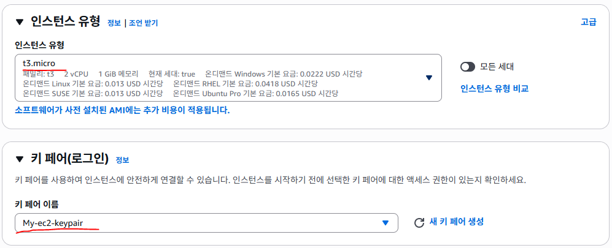

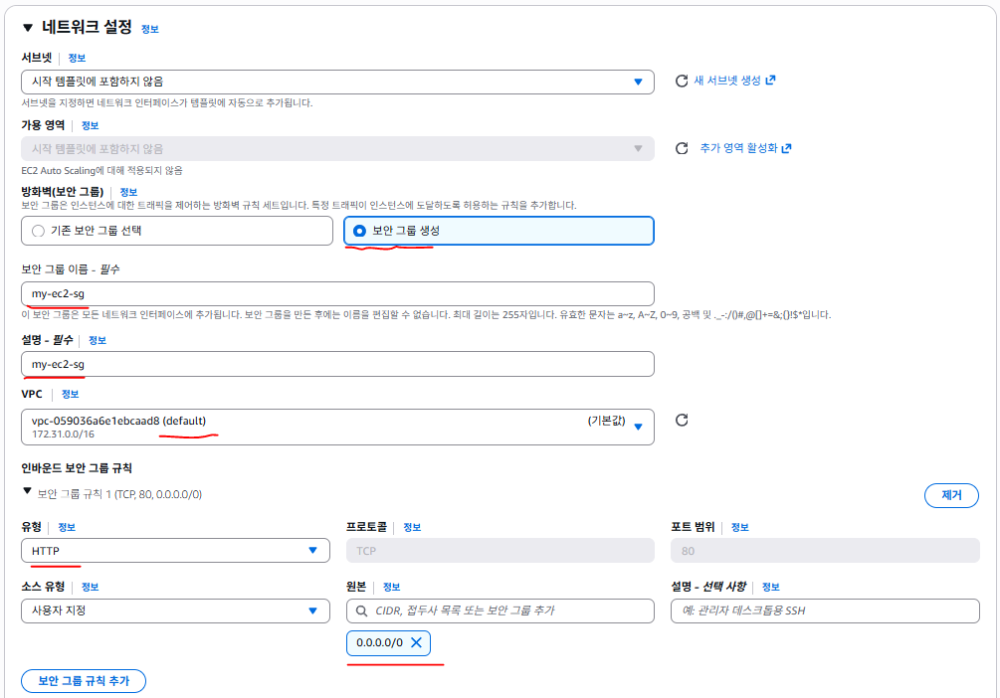


## 52. 실습: ASG 생성

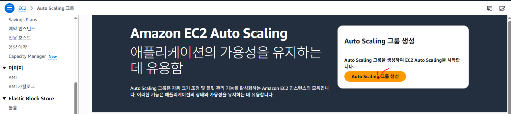

* Auto Scaling 그룹 이름: my-asg
* 시작 템플릿: MyTemplate
* 버전: Default (1)

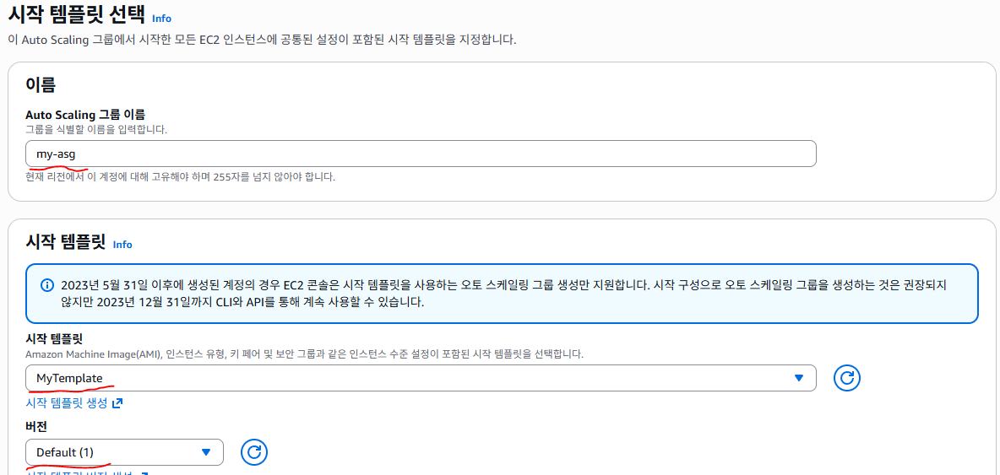


* default VPC

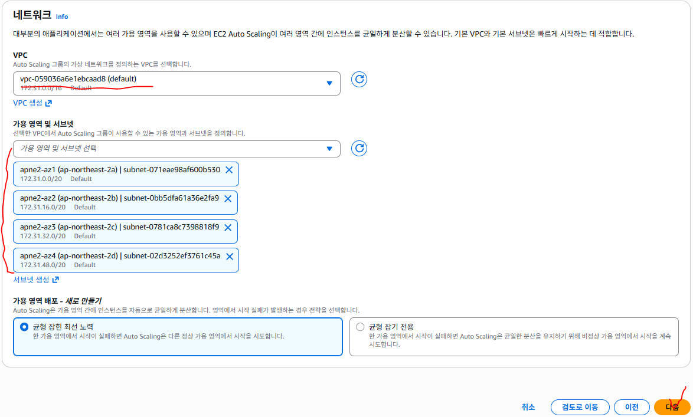

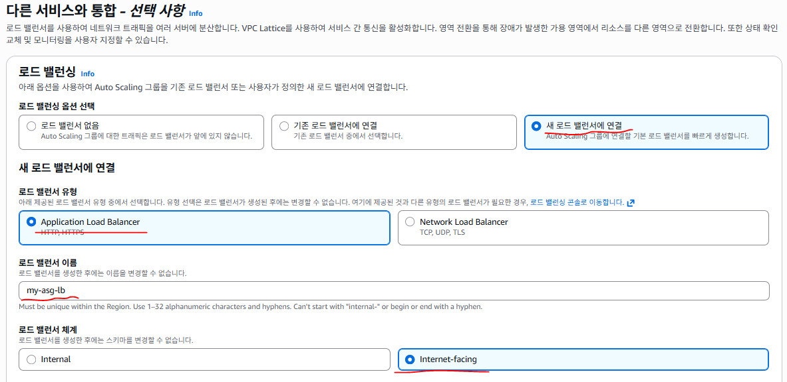

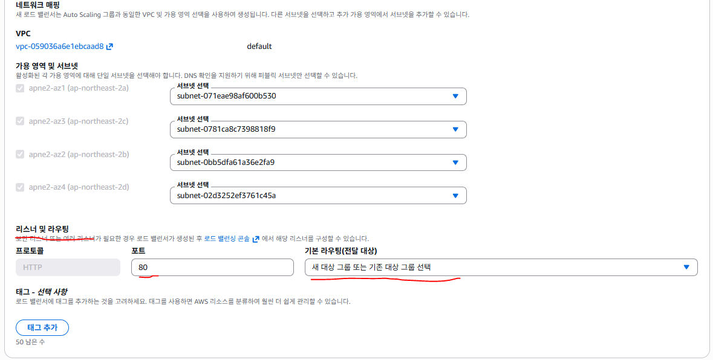

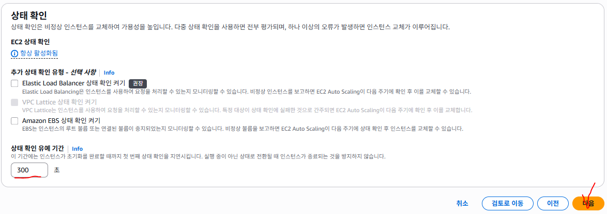

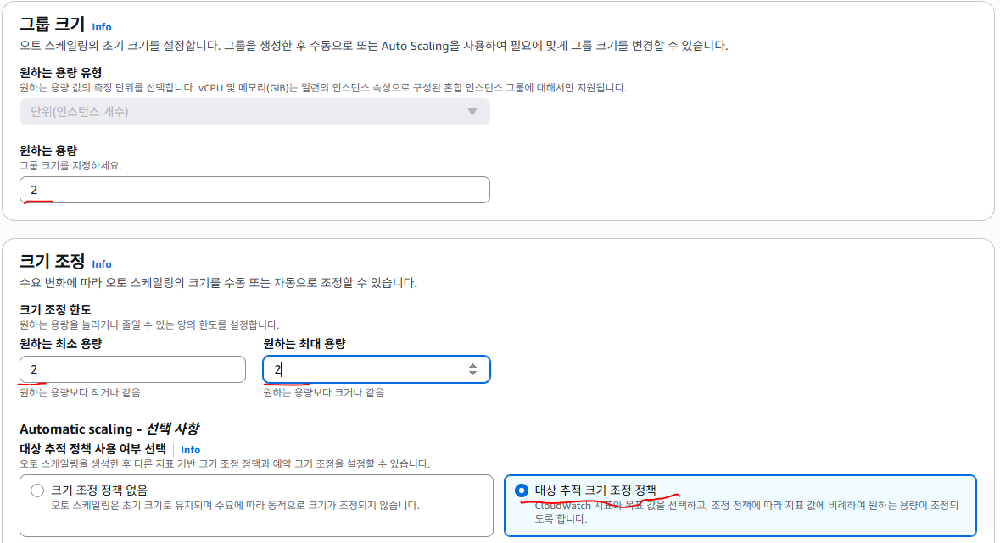


http://my-asg-lb-1652433411.ap-northeast-2.elb.amazonaws.com/

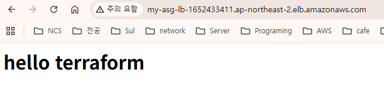

## 53. 실습: Terraform을 활용한 ASG 서비스 구성

이 구조는 단순히 EC2를 여러 대 만드는 것이 아니라, 트래픽이 증가하면 EC2가 자동으로 늘어나고, 트래픽이 줄어들면 EC2가 자동으로 줄어드는 웹 서비스 구조를 만드는 것이다.

* 이때 핵심 구성은 다음과 같이 연결된다.
  * 사용자 요청 --> ALB(Application Load Balancer) --> Target Group --> Auto Scaling Group --> EC2 인스턴스
* 그리고 서버의 CPU 사용률을 감시하는 역할은 CloudWatch가 담당한다.

1. 사용자가 웹 브라우저로 접속하면 먼저 ALB가 요청을 받는다.
2. ALB는 요청을 Target Group으로 전달하고, Target Group은 현재 ASG가 관리하는 EC2 인스턴스 중 정상 상태의 서버로 요청을 분산한다.
3. CloudWatch는 EC2들의 CPU 사용률을 계속 감시하고 있다가, 사용률이 높아지면 ASG에게 서버를 더 늘리라고 지시하고, 사용률이 낮아지면 서버를 줄이도록 동작한다.

* 즉 이 구조는 로드밸런싱 + 자동확장 + 자동축소를 모두 갖춘 구조다.

## 54. 실습: 런치 템플릿 구성

* ASG는 그냥 혼자서 EC2를 만들어내는 서비스가 아니다.
* ASG가 EC2를 만들려면 어떤 AMI를 쓸지, 어떤 인스턴스 타입을 쓸지, 어떤 보안 그룹을 붙일지, 처음 실행될 때 무슨 작업을 할지 같은 정보가 필요하다.
* 이 설정을 담아두는 것이 Launch Template이다.
* 쉽게 말하면 Launch Template은 나중에 EC2를 만들 때 이 설정대로 만들어라 라고 미리 저장해 두는 템플릿이다.
* 여기에는 보통 다음 정보가 들어간다.
  * image\_id : 어떤 AMI로 EC2를 만들 것인지
  * instance\_type : 어떤 인스턴스 유형을 쓸 것인지
  * security\_groups : 어떤 보안 그룹을 붙일 것인지
  * key\_name : 어떤 키페어를 연결할 것인지
  * user\_data : EC2가 처음 켜질 때 어떤 초기화 작업을 할 것인지
* 특히 user\_data는 매우 중요하다. 왜냐하면 ASG가 서버를 자동으로 만들 때, 매번 사람이 들어가서 nginx를 설치할 수 없기 때문이다. 그래서 서버가 생성되자마자 자동으로 웹 서버를 설치하고, index.html 파일을 만들고, 서비스를 시작하도록 스크립트를 넣어두는 것이다.
* 런치 템플릿 설정 예시 코드

## 55. 실습: 부트스트랩 스크립트를 base64로 인코딩하여 로컬 변수에 저장

```hcl
locals {
  bootstrap_script = base64encode(<<-EOT
    #!/bin/bash
    yum install -y nginx                               # nginx 설치
    systemctl start nginx                              # nginx 시작
    echo "Hello, Nginx! $(hostname)" > /usr/share/nginx/html/index.html  # 인덱스 페이지 생성
  EOT
  )
}

# Launch Template을 정의하여 인스턴스 시작 템플릿 설정
resource "aws_launch_template" "example" {
  name_prefix   = "example-launch-template"      # 시작 템플릿 이름 prefix
  image_id      = data.aws_ami.al2023.id            # 위에서 가져온 AMI ID 사용
  instance_type = var.instance_type                 # 인스턴스 유형 변수 사용

  user_data = local.bootstrap_script                 # 부트스트랩 스크립트 사용

  key_name = aws_key_pair.example.key_name     # 생성된 키 페어 이름 설정

  # 네트워크 인터페이스 설정 (보안 그룹 포함)
  network_interfaces {
    security_groups = [aws_security_group.example.id]# EC2에 적용할 보안 그룹
  }
}

코드 설명
```

* 이 코드에서 먼저 locals 블록은 EC2가 처음 실행될 때 사용할 쉘 스크립트를 저장하는 부분이다.
* 여기서는 nginx를 설치하고, nginx를 실행하고, 웹 브라우저에서 접속했을 때 보일 index.html 파일을 생성한다.
* 그 다음 aws\_launch\_template 리소스는 ASG가 사용할 EC2 생성 템플릿이다.
* name\_prefix는 템플릿 이름의 시작 부분이다.
* image\_id는 EC2를 생성할 때 사용할 AMI이고, instance\_type은 EC2 크기이다.
* user\_data는 아까 만든 쉘 스크립트를 넣는 부분이다. 즉 새 EC2가 만들어지면 자동으로 nginx가 깔리고 실행된다.
* key\_name은 SSH 접속할 때 사용할 키페어이고,
* network\_interfaces 안의 security\_groups는 EC2에 어떤 보안 그룹을 붙일지 정하는 부분이다.

## 56. 실습: Auto Scaling Group 구성

* Launch Template이 EC2 생성설정이라면, ASG는 그 템플릿을 바탕으로 EC2 개수를 자동으로 관리하는 서비스이다.
* ASG가 하는 일은 다음과 같다.
  * 처음 시작할 때 원하는 수만큼 EC2 생성
  * 트래픽이 늘어나면 EC2 추가 생성
  * 트래픽이 줄어들면 EC2 삭제
  * 장애가 난 EC2가 있으면 자동 교체 즉 ASG는 서버 수를 자동으로 유지하는 관리자 역할을 한다.

## 57. 실습: ASG 설정 코드

## 58. 실습: 오토 스케일링 그룹 정의

```hcl
resource "aws_autoscaling_group" "example" {
  name = "my-asg"

  launch_template {
    id      = aws_launch_template.example.id     # Launch Template ID 참조
    version = "$Latest"                            # 최신 Launch Template 버전 사용
  }

  health_check_type         = "EC2"              # EC2 상태 확인 방식 사용
  health_check_grace_period = 300                  # 인스턴스 상태 확인 대기 시간 300초

  vpc_zone_identifier = module.vpc.private_subnets # 오토 스케일링 그룹의 VPC 서브넷 설정

  desired_capacity = 2                            # 초기 인스턴스 수 2개
  max_size         = 3                              # 최대 인스턴스 수 3개
  min_size         = 1                              # 최소 인스턴스 수 1개
}
```

* launch\_template 블록은 ASG가 EC2를 만들 때 어떤 템플릿을 쓸 것인가를 정하는 부분이다.
* 여기서는 위에서 만든 aws\_launch\_template.example을 사용한다.
* version = "$Latest"는 템플릿 최신 버전을 사용하겠다는 뜻이다.
* health\_check\_type = "EC2"는 EC2 자체 상태를 기준으로 살아있는지 죽었는지 판단하겠다는 뜻이다.
* 나중에 ALB와 더 강하게 연결해서 판단할 때는 ELB를 쓸 수도 있다.
* health\_check\_grace\_period = 300은 새 서버가 막 생성되었을 때 바로 상태 이상으로 판단하지 않고, 5분 정도 준비 시간을 주겠다는 의미다.
* 이 값이 중요한 이유는 서버가 생성되자마자 nginx 설치, 서비스 시작 등 시간이 조금 걸릴 수 있기 때문이다.
* vpc\_zone\_identifier는 EC2를 어느 서브넷에 배치할지를 정하는 부분이다.
* 보통 ALB는 public subnet에 두고, EC2는 private subnet에 둔다.

desired\_capacity = 2는 처음 시작 시 2대를 유지하겠다는 뜻이다. min\_size = 1은 최소 1대는 항상 유지하겠다는 뜻이고, max\_size = 3은 아무리 늘어나도 최대 3대까지만 증가하도록 제한하는 값이다.

즉 이 코드는 최소 1대, 최대 3대, 기본 2대로 서버를 운영하라는 뜻이다.

## 59. 실습: 스케일링 정책 구성

* ASG를 만들었다고 해서 자동으로 늘고 줄지는 않는다. 늘고 줄어드는 기준이 있어야 한다. 이 기준이 바로 Scaling Policy다.
* 예를 들어
  * CPU 사용률이 너무 높으면 서버를 1대 늘리고
  * CPU 사용률이 너무 낮으면 서버를 1대 줄이도록 정책을 만드는 것이다. 즉 Scaling Policy는 제 몇 대를 얼마나 늘리고 줄일 것인지를 정하는 규칙이다.

## 60. 실습: 스케일 아웃 정책 코드

## 61. 실습: 오토 스케일링 정책 정의 (스케일 아웃)

```hcl
resource "aws_autoscaling_policy" "scale_out_policy" {
  name                   = "scale-out-policy"       # 스케일 아웃 정책 이름
  scaling_adjustment     = 1                         # 인스턴스 1개 추가
  adjustment_type        = "ChangeInCapacity"       # 용량 변경 유형으로 설정
  cooldown               = 300                     # 정책 쿨다운 기간 300초
  autoscaling_group_name = aws_autoscaling_group.example.name  # 대상 오토 스케일링 그룹 이름
}

# 스케일 인 정책 코드
# 오토 스케일링 정책 정의 (스케일 인)
resource "aws_autoscaling_policy" "scale_in_policy" {
  name                   = "scale-in-policy"           # 스케일 인 정책 이름
  scaling_adjustment     = -1                          # 인스턴스 1개 감소
  adjustment_type        = "ChangeInCapacity"          # 용량 변경 유형으로 설정
  cooldown               = 300                         # 정책 쿨다운 기간 300초
  autoscaling_group_name = aws_autoscaling_group.example.name  # 대상 오토 스케일링 그룹 이름
}
코드 설명
```

* scale\_out\_policy는 서버를 늘리는 정책이다.
* scaling\_adjustment = 1이므로 한 번 실행되면 EC2를 1대 늘린다.
* scale\_in\_policy는 서버를 줄이는 정책이다.
* scaling\_adjustment = -1이므로 한 번 실행되면 EC2를 1대 줄인다.
* adjustment\_type = "ChangeInCapacity"는 현재 서버 수에서 지정된 수만큼 더하거나 빼겠다는 뜻이다. 즉 현재 2대인데 +1이면 3대가 되고, -1이면 1대가 되는 구조다.
* cooldown = 300은 한 번 정책이 실행된 뒤 300초 동안은 또 바로 실행되지 않게 하는 값이다. 이 값을 두는 이유는 서버 수가 너무 빠르게 들쭉날쭉 변하지 않게 하기 위해서다.

## 62. 실습: CloudWatch 알람 설정

* Scaling Policy는 단독으로 실행되지 않는다.
* 누군가가 지금 CPU가 높다, 지금 CPU가 낮다 라고 판단해서 정책을 호출하는 것이 CloudWatch Alarm이다. 즉 CloudWatch Alarm은 조건이 만족되면 Scaling Policy를 실행하는 트리거 역할을 한다.
* 예를 들어
  * CPU가 60% 이상이면 scale out 정책 실행
  * CPU가 30% 이하이면 scale in 정책 실행 처럼 연결하는 것이다.

## 63. 실습: CPU 사용률이 높을 때 알람 코드

## 64. 실습: CPU 사용률이 높을 때 알람을 설정하여 스케일 아웃 트리거

```hcl
resource "aws_cloudwatch_metric_alarm" "cpu_high" {
  alarm_name          = "cpu_high"                     # 알람 이름
  comparison_operator= "GreaterThanOrEqualToThreshold"# 임계값 이상일 때 트리거
  evaluation_periods  = "2"                           # 평가 기간 2회
  metric_name        = "CPUUtilization"              # CPU 사용률 메트릭
  namespace          = "AWS/EC2"                     # 메트릭 네임스페이스
  period             = "120"                         # 측정 주기 120초
  statistic          = "Average"                     # 평균 값 사용
  threshold         = "60"                          # 임계값 60%
  alarm_actions    = [aws_autoscaling_policy.scale_out_policy.arn]# 스케일 아웃 정책으로 연결

  dimensions = {
    AutoScalingGroupName = aws_autoscaling_group.example.name# 오토 스케일링 그룹 이름과 연결
  }
}

# CPU 사용률이 낮을 때 알람 코드

# CPU 사용률이 낮을 때 알람을 설정하여 스케일 인 트리거
resource "aws_cloudwatch_metric_alarm" "cpu_low" {
  alarm_name        = "cpu_low"                      # 알람 이름
  comparison_operator= "LessThanOrEqualToThreshold" # 임계값 이하일 때 트리거
  evaluation_periods  = "2"                            # 평가 기간 2회
  metric_name       = "CPUUtilization"               # CPU 사용률 메트릭
  namespace        = "AWS/EC2"                      # 메트릭 네임스페이스
  period            = "120"                          # 측정 주기 120초
  statistic       = "Average"                      # 평균 값 사용
  threshold         = "30"                           # 임계값 30%
  alarm_actions    = [aws_autoscaling_policy.scale_in_policy.arn]# 스케일 인 정책으로 연결

  dimensions = {
    AutoScalingGroupName = aws_autoscaling_group.example.name# 오토 스케일링 그룹 이름과 연결
  }
}

코드 설명
```

* metric\_name = "CPUUtilization"은 CPU 사용률을 감시하겠다는 뜻이다.
* threshold = "60"이면 CPU 평균 사용률이 60% 이상일 때 알람이 울린다. 그리고 alarm\_actions에 연결된 scale\_out\_policy가 실행된다. (즉 서버가 늘어난다.) 반대로 threshold = "30"인 알람은 CPU가 30% 이하일 때 스케일 인 정책을 실행한다. (즉 서버가 줄어든다.)
* evaluation\_periods = "2"와 period = "120"을 같이 보면, 120초 간격으로 2번 연속 조건이 만족될 때 실행된다. 즉 잠깐 CPU가 튄 것 때문에 바로 스케일 아웃하는 것이 아니라, 조금 안정적으로 평균을 보고 판단하겠다는 의미다.

## 65. 실습: ELB 생성 및 설정

* 이제 서버 개수는 자동으로 늘고 줄 수 있게 되었지만, 사용자 요청을 어느 서버로 보낼지 결정하는 장치가 필요하다.
* 그게 바로 ALB(Application Load Balancer)다.
* ALB는 외부 사용자의 요청을 받아서, 현재 정상 상태인 EC2 인스턴스들로 트래픽을 분산한다. 즉 ALB의 역할은
  * 사용자 요청 수신
  * 여러 EC2로 요청 분산
  * 헬스 체크를 통해 죽은 서버 제외이다.

## 66. 실습: ALB 보안 그룹 생성

* ALB도 하나의 AWS 리소스이므로 보안 그룹이 필요하다.
* 웹 접속을 받기 위해 보통 HTTP 80 포트를 열어준다.

## 67. 실습: HTTP 및 SSH 트래픽을 허용하는 보안 그룹 정의

```hcl
resource "aws_security_group" "example" {
  name_prefix = "example-sg"           # 보안 그룹 이름 접두사

  ingress {
    from_port   = 22                      # 허용할 SSH 포트 (22)
    to_port     = 22                          # 허용할 SSH 포트 (22)
    protocol    = "tcp"                      # 프로토콜 (TCP)
    cidr_blocks = ["0.0.0.0/0"]                # 모든 IP에서 SSH 트래픽 허용
  }

  ingress {
    from_port   = 80                         # 허용할 HTTP 포트 (80)
    to_port     = 80                          # 허용할 HTTP 포트 (80)
    protocol    = "tcp"                        # 프로토콜 (TCP)
    cidr_blocks = ["0.0.0.0/0"]                # 모든 IP에서 HTTP 트래픽 허용
  }

  egress {
    from_port   = 0                          # 아웃바운드 포트 범위 시작
    to_port     = 0                          # 아웃바운드 포트 범위 끝
    protocol    = "-1"                        # 모든 프로토콜 허용
    cidr_blocks = ["0.0.0.0/0"]                 # 모든 IP로의 아웃바운드 트래픽 허용
  }

  vpc_id = module.vpc.vpc_id                          # 연결할 VPC ID

  tags = {
    Name = "example-sg"                               # 보안 그룹 이름 태그 추가
  }
}

코드 설명
```

* 이 보안 그룹은 ALB 또는 예시 리소스가 외부에서 HTTP 요청을 받을 수 있게 해준다.
* ingress는 들어오는 규칙이고, egress는 나가는 규칙이다.
* 80번 포트를 열어두었기 때문에 사용자는 브라우저에서 웹 접속이 가능하다.
* protocol = "-1"은 모든 프로토콜을 허용한다는 뜻이다.
* 즉 나가는 트래픽은 전부 허용하겠다는 의미다.

## 68. 실습: ALB 생성

## 69. 실습: 애플리케이션 로드 밸런서 설정

```hcl
resource "aws_lb" "example" {
  name               = "example-alb"                  # 로드 밸런서 이름
  internal           = false                          # 외부 접근 가능하도록 설정
  load_balancer_type= "application"                  # ALB 유형 설정
  subnets            = module.vpc.public_subnets      # 퍼블릭 서브넷에 배치
  security_groups    = [aws_security_group.example.id]# 연결된 보안 그룹 ID

  enable_deletion_protection = false                  # 삭제 방지 비활성화
}
```

* 코드 설명
* internal = false이므로 외부 인터넷에서 접근 가능한 ALB가 된다. 즉 사용자 브라우저에서 접속 가능한 공개형 로드밸런서다.
* load\_balancer\_type = "application"은 ALB를 만들겠다는 뜻이다. (여기서 network를 설정하면 NLB가 된다.)
* subnets = module.vpc.public\_subnets는 ALB를 public subnet에 배치하겠다는 뜻이다.
* ALB는 외부 요청을 받아야 하므로 보통 public subnet에 둔다.

## 70. 실습: ALB 리스너 및 대상 그룹 구성

* ALB가 어떤 포트로 요청을 받을지, 받은 요청을 어디로 보낼지를 알아야 한다.
* 리스너는 로드밸런서가 들어오는 요청을 어떻게 처리할지 결정하는 규칙이다. 이때 사용하는 것이 Listener, Target Group 이다.
* Listener는 ALB가 받는 포트와 프로토콜을 정하는 것이다.
* Target Group은 ALB가 요청을 전달할 대상 서버 그룹이다.
* 즉 쉽게 말하면
  * 리스너 = 입구
  * 대상 그룹 = 목적지

## 71. 실습: 대상 그룹 생성

## 72. 실습: 로드 밸런서의 타겟 그룹 설정

```hcl
resource "aws_lb_target_group" "example" {
  name     = "example-tg"           # 타겟 그룹 이름
  port     = 80                     # 타겟 그룹 포트 번호 (HTTP)
  protocol = "HTTP"                  # 타겟 그룹 프로토콜 (HTTP)
  vpc_id   = module.vpc.vpc_id# 타겟 그룹의 VPC ID

  health_check {
    path     = "/index.html"         # 상태 확인 경로
    protocol = "HTTP"               # 상태 확인 프로토콜 (HTTP)
  }
}
```

* 코드 설명
* Target Group은 ALB가 트래픽을 전달할 목적지 집합이다. (여기서는 80번 HTTP로 전달)
* ALB는 EC2 인스턴스가 살아있는지 확인하기 위해 지정한 경로로 주기적으로 health\_check 요청을 보낸다.
* 여기서는 /index.html을 검사하므로, 앞에서 user\_data에서 만든 index.html이 제대로 응답해야 정상 서버로 인정된다.
* 즉 앞의 Launch Template에서 만든

```hcl
echo "Hello, Nginx! $(hostname)" > /usr/share/nginx/html/index.html
이 코드와 지금 Target Group의 health check가 서로 연결되는 구조다.

# 리스너 생성
# 로드 밸런서 리스너 설정
resource "aws_lb_listener" "example" {
  load_balancer_arn = aws_lb.example.arn     # 연결할 로드 밸런서 ARN
  port              = "80"                      # 리스너 포트 번호 (HTTP)
  protocol          = "HTTP"                 # 리스너 프로토콜 (HTTP)

  default_action {
    target_group_arn = aws_lb_target_group.example.arn  # 포워딩 대상 타겟 그룹 ARN
    type             = "forward"                        # 기본 동작을 타겟 그룹으로 포워딩
  }
}
```

* 코드 설명
* 리스너는 ALB의 80번 포트로 들어오는 HTTP 요청을 받는다.
* 그리고 받은 요청을 aws\_lb\_target\_group.example으로 전달한다.
* 즉 사용자가 브라우저에서 ALB DNS 주소로 접속하면
  * ALB 80번 포트 수신 --> 리스너 동작 --> Target Group으로 전달 --> Target Group 안의 EC2로 연결

## 73. 실습: ASG와 대상 그룹 연결

## 74. 실습: 오토 스케일링 그룹 인스턴스를 타겟 그룹에 연결

```hcl
resource "aws_autoscaling_attachment" "example" {
  autoscaling_group_name = aws_autoscaling_group.example.name# 연결할 오토 스케일링 그룹
  lb_target_group_arn    = aws_lb_target_group.example.arn     # 연결할 타겟 그룹 ARN
}

코드 설명
```

* 이 리소스는 ASG와 Target Group을 연결해 주는 역할을 한다.
* 이 연결이 있어야 ASG가 만든 EC2 인스턴스들이 자동으로 Target Group에 등록된다.
* 즉 서버가 늘어나면 새로 생성된 EC2도 자동으로 로드밸런서 뒤에 붙고, 서버가 줄어들면 제거되는 EC2도 Target Group에서 빠진다.
* ASG만 있고 Target Group 연결이 없으면, EC2는 늘어나도 ALB가 그 서버들을 모를 수 있기 때문이다.

```powershell
PS C:\terraform-aws\terraform-aws\03_elb-asg-terraform\03_asg-elb-infra> terraform init

PS C:\terraform-aws\terraform-aws\03_elb-asg-terraform\03_asg-elb-infra> terraform plan

PS C:\terraform-aws\terraform-aws\03_elb-asg-terraform\03_asg-elb-infra> terraform apply -auto-approve

PS C:\terraform-aws\terraform-aws\03_elb-asg-terraform\03_asg-elb-infra> terraform destroy -auto-approve

# Launch Template +　ASG +　ELB , Taget-Group 실습

# STEP 1) 기존 EC2 Security Group의 HTTP 규칙 수정

   # main.tf
resource "aws_security_group" "my_ec2_sg" {
  name = "my-ec2-sg"
  vpc_id = data.aws_vpc.default.id

  ingress {
    description = "SSH"
    from_port = 22
    to_port = 22
    protocol = "tcp"
    cidr_blocks = [
      "0.0.0.0/0"
    ]
  }

  ingress {
    description = "HTTP from ALB"
    from_port = 80
    to_port = 80
    protocol = "tcp"

    security_groups = [ aws_security_group.my_alb_sg.id ]# 허용을 ALB의 Security-Group으로 변경
  }

  egress {
    from_port = 0
    to_port   = 0
    protocol = "-1"
    cidr_blocks = [
      "0.0.0.0/0"
    ]
  }
  depends_on = [ aws_security_group.my_alb_sg ]# ALB의 Security-Group이 먼저 생성되어야 한다.
  tags = {
    Name = "My-ASG-EC2-SG"
  }
}
# STEP 2) ALB Security Group 생성

   # main.tf
# Application Load Balancer가 사용할 전용 Security Group을 만든다.
resource "aws_security_group" "my_alb_sg" {
  name = "my-alb-sg"
  vpc_id = data.aws_vpc.default.id

  ingress {
    to_port = 80
    protocol = "tcp"
    cidr_blocks = [ "0.0.0.0/0"  ]
  }

  egress {
    from_port = 0
    to_port   = 0
    protocol = "-1"
    cidr_blocks = [ "0.0.0.0/0" ]
  }
  tags = {
    Name = "My-ALB-SG"
  }
}
```

## 75. 실습: STEP 3) Default VPC의 Subnet 조회

* ALB와 Auto Scaling Group에서 사용할
* Subnet ID를 직접 입력할 필요가 없다.

```hcl
   # main.tf
data "aws_subnets" "default" {
  # Subnet 검색 조건
  filter {
    name = "vpc-id"# VPC ID를 기준으로 검색
    values = [ data.aws_vpc.default.id ]# 현재 사용 중인 Default VPC에 속한 Subnet만 조회
  }
}
```

## 76. 실습: STEP 4) Target Group 생성

* ALB가 실제 요청을 전달할 대상 그룹을 만든다.
* Target Group은 EC2의 HTTP 80번 Port로 요청을 전달하고, "/" 경로를 이용하여 Web Server 상태를 검사한다.

```hcl
   # main.tf
resource "aws_lb_target_group" "my_tg" {
  name = "my-target-group"# Target Group 이름
  port = 80# Target Group 이름
  protocol = "HTTP"# HTTP Protocol 사용
  vpc_id = data.aws_vpc.default.id# Target Group을 생성할 VPC
  target_type = "instance"# Target을 EC2 Instance 단위로 등록

  # Target EC2 상태 확인
  health_check {
    path = "/"# Target을 EC2 Instance 단위로 등록
    protocol = "HTTP"# HTTP로 Health Check
    port = "traffic-port"# 실제 Target Group Port인 80번 사용
    healthy_threshold = 2# 2번 연속 성공하면 Healthy
    unhealthy_threshold = 2# 2번 연속 실패하면 Unhealthy
    timeout = 5# 5초 동안 응답 없으면 실패
    interval = 30# 30초마다 Health Check
    matcher = "200"# HTTP Status Code 200이면 정상
  }

  tags = {
    Name = "My-Target-Group"
  }
}
```

## 77. 실습: STEP 5) Application Load Balancer 생성

* 외부 사용자의 HTTP 요청을 받을 Application Load Balancer를 생성한다.
* ALB는 Default VPC의 여러 Subnet에 배치된다.

```hcl
   # main.tf
resource "aws_lb" "my_alb" {
  name = "my-asg-alb"
  internal = false# 인터넷에서 접근 가능한 Internet-facing ALB

  load_balancer_type = "application"# Application Load Balancer 생성
  security_groups = [ aws_security_group.my_alb_sg.id ]ALB 전용 Security Group 적용

  subnets = data.aws_subnets.default.ids# Default VPC의 Subnet들을 ALB에 연결
  enable_deletion_protection = false# 실습이므로 삭제 방지 기능 사용하지 않음

  tags = {
    Name = "My-ASG-ALB"
  }
}
```

## 78. 실습: STEP 6) ALB Listener 생성

* Listener는 ALB의 특정 Port에서 요청을 기다린다.

```hcl
   # main.tf
resource "aws_lb_listener" "my_listener" {
  load_balancer_arn = aws_lb.my_alb.arn# Listener를 연결할 ALB
  port = 80# ALB의 80번 Port에서 요청 대기
  protocol = "HTTP"# Listener를 연결할 ALB

  # 요청이 들어왔을 때 수행할 기본 동작
  default_action {
    type = "forward"# 요청을 다른 Target으로 전달
    target_group_arn = aws_lb_target_group.my_tg.arn# 요청을 다른 Target으로 전달
  }
}
```

## 79. 실습: STEP 7) Auto Scaling Group 생성

* 앞에서 이미 만든 Launch Template을 이용해서 EC2를 자동으로 생성하는 Auto Scaling Group을 만든다.

```hcl
   # main.tf
resource "aws_autoscaling_group" "my_asg" {
  name = "my-asg"# Auto Scaling Group 이름

  # 기존에 생성한 Launch Template 사용
  launch_template {
    id = aws_launch_template.my_launch_template.id# Launch Template ID
    version = "$Latest"# 가장 최신 Version 사용
  }

  # EC2가 생성될 Subnet
  # Default VPC의 Subnet 목록을 자동으로 사용
  vpc_zone_identifier = data.aws_subnets.default.ids

  # ASG와 Target Group 연결, ASG가 EC2를 생성하면 자동으로 Target Group에 등록
  target_group_arns = [ aws_lb_target_group.my_tg.arn ]

  min_size    = 1# 최소 EC2 개수
  desired_capacity = 2# 처음 생성할 EC2 개수
  max_size    = 3# 최대 EC2 개수

  health_check_type = "ELB"# ALB Target Group의 Health Check 결과 사용
  health_check_grace_period = 300# 새 EC2가 부팅되고 Apache가 준비될 시간을 기다림

  # ASG가 생성하는 EC2에 Tag 적용
  tag {
    key = "Name"# Tag Key
    value = "My-ASG-EC2"# Tag Value
    propagate_at_launch = true# 앞으로 새로 만들어지는 EC2에도 Tag 적용
  }
}
```

## 80. 실습: STEP 8) ALB 접속 확인

* ALB의 DNS 주소를 복사해서 브라우저로 접속

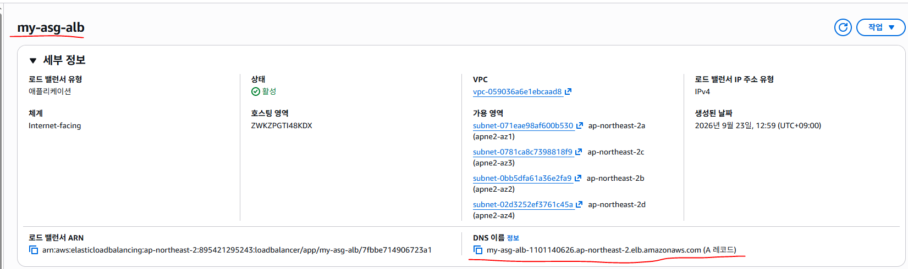

http://my-asg-alb-1101140626.ap-northeast-2.elb.amazonaws.com/

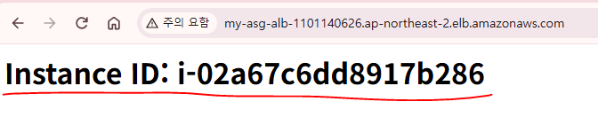

새로고침 (Instace-ID가 변경되는 것을 확인)

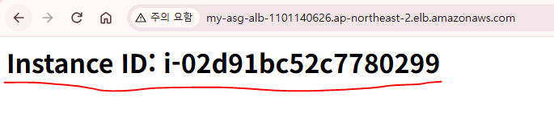

## 81. 실습: STEP 9) Scale Out Policy 생성

* CloudWatch CPU High Alarm이 발생했을 때
* EC2를 1대 증가시키는 정책이다.

```hcl
   # main.tf
resource "aws_autoscaling_policy" "scale_out" {
  name = "my-scale-out"# Scaling Policy 이름
  autoscaling_group_name = aws_autoscaling_group.my_asg.name# 이 Policy가 적용될 Auto Scaling Group
  adjustment_type = "ChangeInCapacity"# 현재 EC2 개수를 기준으로 증가/감소
  scaling_adjustment = 1
  cooldown = 300# Scaling 실행 후 300초 동안 추가 Scaling 동작 대기
}
```

* cooldown = 300
  * EC2가 새로 생성된 직후 CPU가 계속 높다고 해서 바로 또 +1, 또 +1 되지 않도록 5분간 추가 스케일링을 잠깐 막는 역할

## 82. 실습: STEP 10. Scale In Policy 생성

## 83. 실습: CPU 사용률이 낮아지면 EC2를 1대 감소시키는 정책이다.

```hcl
resource "aws_autoscaling_policy" "scale_in" {
  name = "my-scale-in"# Scaling Policy 이름
  autoscaling_group_name = aws_autoscaling_group.my_asg.name# 대상 Auto Scaling Group
  adjustment_type = "ChangeInCapacity"# 현재 EC2 개수를 기준으로 변경
  scaling_adjustment = -1# 현재 EC2 개수를 기준으로 변경
  cooldown = 300# Scaling 실행 후 300초 대기
}
```

## 84. 실습: STEP 10. CPU High CloudWatch Alarm 생성

* ASG에 속한 EC2들의 평균 CPU 사용률이
* 60% 이상인 상태가 2번 연속 발생하면 Scale Out Policy를 실행

```hcl
   # main.tf
resource "aws_cloudwatch_metric_alarm" "cpu_high" {
  alarm_name = "my-asg-cpu-high"# CloudWatch Alarm 이름
  comparison_operator= "GreaterThanOrEqualToThreshold"# CPU 값이 Threshold보다 크거나 같은지 검사

  evaluation_periods = 2# 2번 연속 조건을 만족해야 Alarm
  metric_name = "CPUUtilization"# 2번 연속 조건을 만족해야 Alarm
  namespace = "AWS/EC2"# EC2 CloudWatch Namespace
  period = 60# 60초 단위로 CPU 확인
  statistic = "Average"# 평균 CPU 사용률 사용
  threshold = 60# CPU 60% 이상이면 조건 충족
  alarm_actions = [ aws_autoscaling_policy.scale_out.arn ]# Alarm 발생시 실행할 Action(Scale Out Policy 실행)

  # 특정 EC2 한 대가 아니라 Auto Scaling Group 전체의 CPU 평균을 감시
  dimensions = {
    AutoScalingGroupName = aws_autoscaling_group.my_asg.name
  }
}
```

## 85. 실습: STEP 11. CPU Low CloudWatch Alarm 생성

* ASG 평균 CPU가 30% 이하인 상태가
* 2번 연속 발생하면 Scale In Policy를 실행한다.

```hcl
   # main.tf
resource "aws_cloudwatch_metric_alarm" "cpu_low" {
  alarm_name = "my-asg-cpu-low"# Alarm 이름
  comparison_operator = "LessThanOrEqualToThreshold"# Threshold 이하인지 검사
  evaluation_periods = 2# 2번 연속 조건 만족
  metric_name = "CPUUtilization"# EC2 CPU Metric 사용
  namespace = "AWS/EC2"# EC2 Namespace
  period = 60# 60초 단위 측정
  statistic = "Average"# 평균값 사용
  threshold = 30# CPU 30% 이하

  # Alarm 발생 시 Scale In 실행
  alarm_actions = [ aws_autoscaling_policy.scale_in.arn ]

  # ASG 전체 EC2 CPU 평균 감시
  dimensions = {
    AutoScalingGroupName = aws_autoscaling_group.my_asg.name
  }
}

   # outputs.tf
output "alb_url" {
  description = "Application Load Balancer URL"
  value = "http://${aws_lb.my_alb.dns_name}"
}

# ASG 이름 출력
output "autoscaling_group_name" {
  description = "Auto Scaling Group Name"
  value = aws_autoscaling_group.my_asg.name
}

# Target Group ARN 출력
output "target_group_arn" {
  description = "Target Group ARN"
  value = aws_lb_target_group.my_tg.arn
}

PS C:\trf2\4) ELB,ASG\4_1_ELB-ALB> terraform  plan

PS C:\trf2\4) ELB,ASG\4_1_ELB-ALB> terraform  apply

# 첫 번째 EC2 접속
[root@ip-172-31-28-13 ~]# dnf install  -y  stress

[root@ip-172-31-28-13 ~]# stress --cpu 1 &

# 두 번째 EC2 접속
[root@ip-172-31-46-82 ~]# dnf install  -y  stress

[root@ip-172-31-46-82 ~]# stress --cpu 1 &
```

* t3.micro는 vcpu를 2개 지원하기 때문에 1개의 CPU만큼 부하를 주면 50%까지만 상승한다.

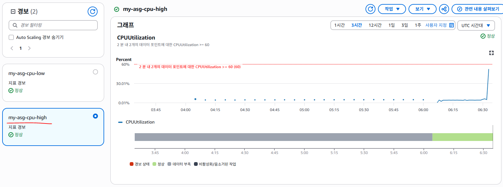

## 86. 실습: 첫 번째 EC2 접속

```
[root@ip-172-31-28-13 ~]# stress --cpu 2

# 두 번째 EC2 접속
[root@ip-172-31-46-82 ~]# stress --cpu 2
```

* 경보상태가 확인되며 EC2 인스턴스 개수가 증가해야 한다.

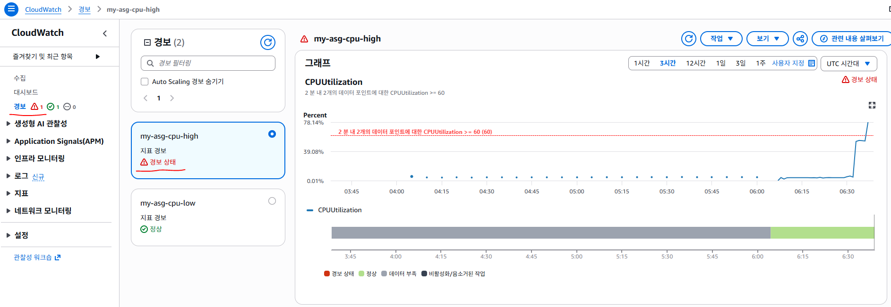

* EC2 인스턴스가 2대에서 3대로 증가한다.

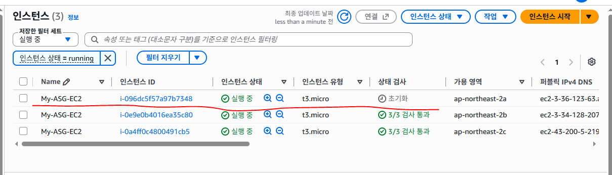

## 87. 실습: SNS Topic 구성

* Auto Scaling에서 Scale Out 또는 Scale In이 발생했을 때 관리자에게 알림을 전송하기 위해 SNS를 사용한다.
* SNS Topic을 생성하고 이메일 구독을 연결하여 CloudWatch Alarm 발생 시 이메일 알림을 전송한다.

```hcl
   # variables.tf
# SNS 알림을 받을 이메일 주소
variable "notification_email" {
  type    = string
  default = "konan7979@gmail.com"
}

# SNS 알림을 받을 전화번호
variable "notification_phone" {
  type    = string
  default = "+123456789012"
}

   # main.tf
# Auto Scaling 알림을 전달하기 위한 SNS Topic 생성
resource "aws_sns_topic" "asg_alert" {
  name = "asg-scaling-alert"
}
```

## 88. 실습: SNS Email 구독 구성

* SNS Topic에서 발생한 메시지를 이메일로 전달하기 위해 Email Subscription을 생성한다.

```hcl
   # main.tf
resource "aws_sns_topic_subscription" "asg_email" {
  topic_arn = aws_sns_topic.asg_alert.arn# 구독할 SNS Topic 지정
  protocol  = "email"                       # 이메일 방식으로 메시지 전송
  endpoint  = var.notification_email        # 알림을 받을 이메일 주소
}

resource "aws_sns_topic_subscription" "asg_sms" {
  topic_arn = aws_sns_topic.asg_alert.arn# 기존 SNS Topic 사용
  protocol  = "sms"                       # SMS 방식으로 메시지 전송
  endpoint  = var.notification_phone        # Sandbox에 인증된 전화번호
}
PS C:\trf2\4) ELB,ASG\4_1_ELB-ALB> terraform  plan

PS C:\trf2\4) ELB,ASG\4_1_ELB-ALB> terraform  apply -auto-approve
```

## 89. 실습: SNS Email 구독 확인

* Terraform Apply 후 설정한 이메일 주소로 AWS에서 Subscription Confirmation 메일이 전송된다.
* 메일에서 Confirm subscription을 클릭해야 실제 SNS 알림을 받을 수 있다.

## 90. 실습: CPU High CloudWatch Alarm + SNS 구성

* CPU 평균 사용률이 60% 이상이면 Scale Out Policy를 실행한다.
* 동시에 SNS Topic으로 알림을 전송하여 관리자에게 이메일로 알린다.

```hcl
   # main.tf
resource "aws_cloudwatch_metric_alarm" "cpu_high" {
  alarm_name = "cpu_high"

  comparison_operator = "GreaterThanOrEqualToThreshold"
  evaluation_periods  = 2
  metric_name = "CPUUtilization"
  namespace   = "AWS/EC2"
  period    = 120
  statistic = "Average"
  threshold = 60

  alarm_actions = [
    aws_autoscaling_policy.scale_out_policy.arn ,
    aws_sns_topic.asg_alert.arn    # 추가 : SNS Topic으로 알림 전송
  ]

  dimensions = {
    AutoScalingGroupName = aws_autoscaling_group.example.name
  }
}

    # main.tf
resource "aws_cloudwatch_metric_alarm" "cpu_low" {
  alarm_name = "cpu_low"

  comparison_operator = "LessThanOrEqualToThreshold"
  evaluation_periods  = 2

  metric_name = "CPUUtilization"
  namespace   = "AWS/EC2"

  period    = 120
  statistic = "Average"
  threshold = 30

  alarm_actions = [
    aws_autoscaling_policy.scale_in_policy.arn ,
    aws_sns_topic.asg_alert.arn    # 추가 : SNS Topic으로 알림 전송
  ]

  dimensions = {
    AutoScalingGroupName = aws_autoscaling_group.example.name   # 해당 ASG의 CPU 사용률 모니터링
  }
}
```

## 91. 실습: Terraform Output 구성

* Terraform Apply 완료 후 생성된 SNS Topic의 ARN을 확인하기 위해 Output을 설정한다.

```hcl
   # outputs.tf
output "sns_topic_arn" {
  value       = aws_sns_topic.asg_alert.arn
}

PS C:\trf2\4) ELB,ASG\4_1_ELB-ALB> terraform  plan

PS C:\trf2\4) ELB,ASG\4_1_ELB-ALB> terraform  apply -auto-approve

# 첫 번째 EC2 접속
[root@ip-172-31-28-13 ~]# stress --cpu 2

# 두 번째 EC2 접속
[root@ip-172-31-46-82 ~]# stress --cpu 2
```

* 경보상태가 확인되며 EC2 인스턴스 개수가 증가해야 한다.


* EC2 인스턴스가 2대에서 3대로 증가한다.


* ASG에 의해 EC2가 증가 또는 감소시 SNS에 의해 Email, SMS가 수신되는지 확인

## 92. 실습: Terraform Module을 활용한 ALB + ASG + CloudWatch + SNS 구성

## 93. 실습: 전체 구조

```hcl
terraform-asg-alb-module/
│
├── provider.tf
├── variables.tf
├── terraform.tfvars
├── main.tf
├── outputs.tf
│
└── modules/
    │
    ├── network/
    │   ├── main.tf
    │   ├── variables.tf
    │   └── outputs.tf
    │
    ├── alb/
    │   ├── main.tf
    │   ├── variables.tf
    │   └── outputs.tf
    │
    └── asg/
        ├── main.tf
        ├── variables.tf
        └── outputs.tf
```

* "terraform-asg-alb-module/" 자체가 Root Module이다.
* Root 아래의 "modules/"에 Child Module을 작성한다.
* Child Module에는 "provider "aws"" 블록을 만들지 않는다.
* 실제 AWS Provider 설정은 마지막 Root에서 관리한다.
  * STEP 0 프로젝트 디렉터리 구성
* modules 디렉터리에는 재사용할 Terraform Module을 작성한다.
* Root 디렉터리의 main.tf에서는 AWS Resource를 직접 만들기보다는 각 Module을 호출하여 전체 인프라를 연결한다.
* Module = AWS Resource를 정의하는 부품
* Root Module = 여러 Module을 연결하는 조립 공간

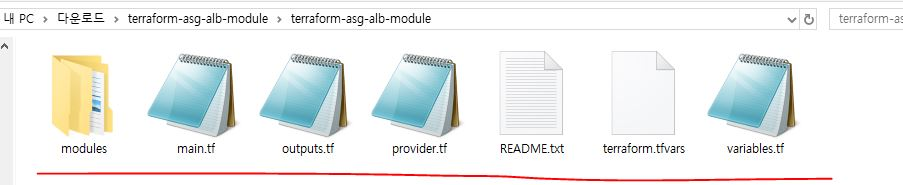

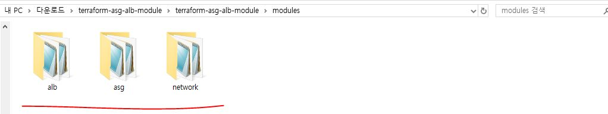

## 94. 실습: STEP 1) Network Module 작성

* 작성 위치: terraform-asg-alb-module/modules/network/
* 생성 파일:

```hcl
 # main.tf
 # variables.tf
 # outputs.tf

# STEP 1-1. VPC 기본 변수 작성

  # modules/network/variables.tf
variable "aws_region" {
  description = "AWS Region"
  type        = string
  default     = "ap-northeast-2"
}

variable "vpc_name" {
  description = "VPC 이름"
  type        = string
  default     = "my-vpc"
}

variable "vpc_cidr" {
  description = "VPC CIDR"
  type        = string
  default     = "10.0.0.0/16"
}

# STEP 1-2. VPC 기본 코드 작성

   # modules/network/main.tf
terraform {
  required_version = ">= 1.16.0"

  required_providers {
    aws = {
      source  = "hashicorp/aws"
      version = ">= 5.73.0"
    }
  }
}

# STEP 1-3. VPC 첫 번째 Plan 확인

## VPC Module 디렉터리로 이동 (powershell)
PS :\terraform-asg-alb> PS :\terraform-asg-alb\modules\vpc>

## Terraform 초기화 (powershell)
PS :\terraform-asg-alb\modules\vpc> terraform init
```

* 다음 파일이 생성된다.
  * .terraform/

```hcl
 # .terraform.lock.hcl

# STEP 1-4. Subnet 변수 추가

   # modules/network/variables.tf
variable "public_subnets" {
  description = "Public Subnet CIDR 목록"
  type        = list(string)

  default = [
    "10.0.1.0/24",
    "10.0.2.0/24"
  ]
}

variable "private_subnets" {
  description = "Private Subnet CIDR 목록"
  type        = list(string)

  default = [
    "10.0.3.0/24",
    "10.0.4.0/24"
  ]
}

# STEP 1-5. VPC 설정 추가

   # modules/network/main.tf의
# module "vpc" 내부에 추가
module "network" {
  source  = "terraform-aws-modules/vpc/aws"
  version = "5.15.0"
  name   = var.vpc_name
  cidr    = var.vpc_cidr

  azs = [
    "${var.aws_region}a", # 첫 번째 Availability Zone
    "${var.aws_region}b"  # 두 번째 Availability Zone
  ]

  public_subnets  = var.public_subnets  # Public Subnet 2개 생성
  private_subnets = var.private_subnets # Private Subnet 2개 생성

  enable_dns_hostnames = true # VPC DNS Hostname 활성화
  enable_dns_support   = true # VPC DNS Resolution 활성화

  create_igw = true # Internet Gateway 생성

  enable_nat_gateway = true # NAT Gateway 생성
  single_nat_gateway = true # NAT Gateway를 1개만 생성

  public_subnet_tags = {
    Name = "my-public-subnet" # Public Subnet Name Tag
  }

  private_subnet_tags = {
    Name = "my-private-subnet" # Private Subnet Name Tag
  }

  tags = {
    Name = var.vpc_name # VPC Name Tag
  }
}

## Terraform VPC Module
```

* terraform-aws-modules/vpc/aws는 Terraform Registry에 공개되어 있는 AWS VPC용 Module이다.
* 이 Module을 사용하면 VPC만 생성하는 것이 아니라, VPC와 함께 자주 사용하는 Subnet, Internet Gateway, NAT Gateway, Route Table까지 필요한 Network 구성을 한 번에 만들 수 있다.
* 예를 들어 다음과 같이 설정한다.

```hcl
module "network" {
  source  = "terraform-aws-modules/vpc/aws"
  version = "5.15.0"

  name = var.vpc_name
  cidr = var.vpc_cidr

  azs = [
    "${var.aws_region}a",
    "${var.aws_region}b"
  ]

  public_subnets  = var.public_subnets
  private_subnets = var.private_subnets

  create_igw         = true
  enable_nat_gateway = true
  single_nat_gateway = true
}
```

* public\_subnets를 설정하면 Public Subnet을 생성하고, private\_subnets를 설정하면 Private Subnet을 생성한다.
* create\_igw = true는 VPC에 Internet Gateway를 생성하겠다는 의미이다.
* Public Subnet이 인터넷과 통신하려면 Internet Gateway가 필요하다.
* enable\_nat\_gateway = true는 NAT Gateway를 생성하겠다는 의미이다.
* NAT Gateway는 Private Subnet에 있는 EC2가 인터넷으로 나갈 때 사용한다.
* NAT Gateway는 인터넷과 통신해야 하기 때문에 Public Subnet에 생성된다.
* single\_nat\_gateway = true는 Public Subnet이 여러 개 있어도 NAT Gateway를 여러 개 만들지 않고 한 개만 사용하겠다는 의미이다.
* VPC Module은 Route Table도 함께 구성한다.
* Public Subnet은 기본적으로 Internet Gateway를 통해 인터넷으로 나가도록 Route를 설정한다.
* 예를 들면 다음과 같다.
  * Public Subnet
  * 0.0.0.0/0 --> Internet Gateway
* Private Subnet은 NAT Gateway를 통해 인터넷으로 나가도록 Route를 설정한다.
  * Private Subnet
  * 0.0.0.0/0 --> NAT Gateway
* 또한 생성된 Subnet과 Route Table의 연결도 Module이 자동으로 처리한다. 따라서 이 VPC Module을 사용하는 경우 일반적인 Public/Private Subnet 구성에서는 다음 Resource를 직접 작성하지 않아도 된다.
* aws\_route\_table
* aws\_route
* aws\_route\_table\_association
* 사용자가 VPC, Subnet, Internet Gateway, NAT Gateway, Route Table을 하나씩 직접 만들고 연결하는 것이 아니라, VPC Module에 필요한 값을 전달하면 Module 내부의 Terraform 코드가 이러한 Resource를 생성하고 연결해주는 방식이다.

## 95. 실습: STEP 1-6. VPC vpc 중간 Plan

실행 위치 :

```hcl
C:\terraform-asg-alb-module\modules\network

# 새로 추가한 VPC vpc 코드를 Terraform 표준 형식으로 정렬
powershell
terraform fmt

# Subnet, Availability Zone, Internet Gateway, NAT Gateway 관련 설정을 검사한다.
powershell
terraform validate

# 현재 VPC vpc 전체 구성이 정상적으로 생성 가능한지 확인한다.
powershell
terraform plan

## [확인]
VPC
Public Subnet 2개
Private Subnet 2개
Internet Gateway
NAT Gateway
Route Table
Route
Route Table Association

# STEP 1-7. VPC Output 작성

   # modules/network/outputs.tf
output "vpc_id" {
  description = "생성된 VPC ID"
  value       = module.network.vpc_id
}

output "public_subnets" {
  description = "Public Subnet ID 목록"
  value = module.network.public_subnets # Public Subnet ID 목록
}

output "private_subnets" {
  description = "Private Subnet ID 목록"
  value = module.network.private_subnets # Private Subnet ID 목록
}
```

* VPC Module에서 생성한 값을 다른 Module에서 사용할 수 있도록 Output으로 내보낸다.
* VPC Module에서 생성한 VPC ID와 Subnet ID는 다른 Module에서도 필요하다.
  * VPC ID: ALB Module에서 사용
  * Public Subnet ID: ALB Module에서 사용
  * Private Subnet ID: ASG Module에서 사용
* 그래서 outputs.tf를 이용해 VPC Module의 값을 Root로 전달한다.

```hcl
output "vpc_id" {
  value = module.network.vpc_id
}

Root에서는 다음처럼 사용할 수 있다.
 # module.vpc.vpc_id
```

* 즉, VPC Module에서 생성한 값
  * output
  * Root
  * 다른 Module에 전달

## 96. 실습: STEP 1-8. VPC Module 최종 Plan

```hcl
실행 위치 : C:\terraform-asg-alb-module\modules\network

powershell
terraform fmt
```

## 97. 실습: STEP 2) ALB Module 작성

* 작성 위치 : terraform-asg-alb-module/modules/alb/
* 생성 파일 : main.tf , variables.tf , outputs.tf

## 98. 실습: STEP 2-1. Provider 요구사항 작성

```hcl
   # modules/alb/main.tf
terraform {
  required_version = ">= 1.16.0" # Terraform 최소 버전

  required_providers {
    aws = {
      source  = "hashicorp/aws" # AWS Provider 사용
      version = ">= 5.73.0"     # AWS Provider 최소 버전
    }
  }
}

# STEP 2-2. Security Group 변수 작성

   # modules/alb/variables.tf
variable "vpc_id" {
  description = "Security Group과 Target Group을 생성할 VPC ID"
  type        = string
  default     = "vpc-0123456789abcdef0"
}

variable "security_group_name" {
  description = "ALB Security Group 이름"
  type        = string
  default     = "my-alb-sg"
}

variable "http_port" {
  description = "HTTP Port"
  type        = number
  default     = 80
}
# STEP 2-3. Security Group 생성

   # modules/alb/main.tf
resource "aws_security_group" "alb_sg" {
  name_prefix = "${var.security_group_name}-" # Security Group 이름 Prefix

  vpc_id = var.vpc_id # Security Group을 생성할 VPC

  ingress {
    from_port   = var.http_port # 시작 Port 80
    to_port     = var.http_port # 종료 Port 80
    protocol    = "tcp"         # TCP Protocol 사용
    cidr_blocks = ["0.0.0.0/0"] # 모든 IPv4에서 HTTP 허용
  }

  egress {
    from_port   = 0             # 모든 Port
    to_port     = 0             # 모든 Port
    protocol    = "-1"          # 모든 Protocol
    cidr_blocks = ["0.0.0.0/0"] # 모든 목적지 허용
  }

  tags = {
    Name = var.security_group_name # my-alb-sg
  }
}

- 외부 사용자가 ALB의 HTTP 80 Port에 접근할 수 있도록 Security Group을 생성한다.

# STEP 2-4. Security Group Plan 확인

실행 위치 : C:\terraform-asg-alb-module\modules\alb

powershell
cd C:\terraform-asg-alb-module\modules\alb

# STEP 2-5. Target Group 변수 추가

   # modules/alb/variables.tf
variable "target_group_name" {
  description = "Target Group 이름"
  type        = string
  default     = "my-target-group"
}

variable "health_check_path" {
  description = "Target Group Health Check 경로"
  type        = string
  default     = "/index.html"
}

- Target Group 이름은 "my-target-group"을 사용한다.
- Health Check는 "/index.html" 경로를 검사한다.

# STEP 2-6. Target Group 생성

   # modules/alb/main.tf
resource "aws_lb_target_group" "web_tg" {
  name = var.target_group_name # Target Group 이름

  port = var.http_port # EC2 Web Server Port 80
  protocol = "HTTP" # HTTP Protocol 사용
  vpc_id = var.vpc_id # Target Group을 생성할 VPC

  health_check {
    path     = var.health_check_path # /index.html 검사
    protocol = "HTTP"                # HTTP Health Check
  }
}

# STEP 2-7. Target Group 중간 Plan

실행 위치 : C:\terraform-asg-alb-module\modules\alb

# STEP 2-8. ALB 변수 추가

   # modules/alb/variables.tf
variable "alb_name" {
  description = "Application Load Balancer 이름"
  type        = string
  default     = "my-alb"
}

variable "public_subnets" {
  description = "ALB가 배치될 Public Subnet ID 목록"
  type        = list(string)

  default = [
    "subnet-0123456789abcdef0",
    "subnet-0fedcba9876543210"
  ]
}

# STEP 2-9. ALB 생성

   # modules/alb/main.tf
resource "aws_lb" "alb" {
  name = var.alb_name # ALB 이름

  internal = false # Internet-facing ALB

  load_balancer_type = "application"# Application Load Balancer

  subnets = var.public_subnets # Public Subnet 2개에 배치

  security_groups = [ aws_security_group.alb_sg.id ]# ALB Security Group 적용

  enable_deletion_protection = false # 삭제 방지 기능 비활성화
}

- ALB는 외부 사용자의 요청을 받아야 하므로 Public Subnet에 배치한다.

# STEP 2-10. Listener 생성

   # modules/alb/main.tf
resource "aws_lb_listener" "http_listener" {
  load_balancer_arn = aws_lb.alb.arn # my-alb 연결

  port = var.http_port # HTTP Port 80

  protocol = "HTTP" # HTTP Listener
  default_action {
    type = "forward" # 요청 전달 방식
    target_group_arn = aws_lb_target_group.web_tg.arn # my-target-group으로 전달
  }
}

# STEP 2-11. ALB 전체 Plan

실행 위치 : C:\terraform-asg-alb-module\modules\alb

# ALB Module 전체 코드를 표준 형식으로 정렬한다.
powershell
terraform fmt

#Security Group, Target Group, ALB, Listener의 연결을 검사한다.
powershell
terraform validate

#ALB Module 전체 구성이 정상적으로 생성 가능한지 확인한다.
powershell
terraform plan

# STEP 2-12. ALB Output 작성

   # modules/alb/outputs.tf
output "security_group_id" {
  description = "ALB Security Group ID"
  value       = aws_security_group.alb_sg.id
}

output "target_group_arn" {
  description = "Target Group ARN"
  value       = aws_lb_target_group.web_tg.arn # Target Group ARN
}

output "alb_dns_name" {
  description = "ALB DNS Name"
  value       = aws_lb.alb.dns_name # ALB DNS Name
}

# STEP 2-13. ALB 최종 Plan

실행 위치 : C:\terraform-asg-alb-module\modules\alb

# ALB Module 전체 코드를 최종 정렬한다.
powershell
terraform fmt

# ALB Module Resource와 Output 참조를 최종 검사한다.
powershell
terraform validate

# Root에 연결하기 전 ALB Module 전체 구성을 확인한다.
powershell
terraform plan
```

## 99. 실습: STEP 3) ASG Module 작성

* 작성 위치 : terraform-asg-alb-module/modules/asg/
* 생성 파일:

```hcl
 # main.tf
 # variables.tf
 # outputs.tf

# STEP 3-1. Provider 요구사항 작성

   # modules/asg/main.tf
terraform {
  required_version = ">= 1.16.0"

  required_providers {
    aws = {
      source  = "hashicorp/aws"
      version = ">= 5.73.0"
    }

    random = {
      source  = "hashicorp/random"
      version = "~> 3.9"
    }
  }
}

# STEP 3-2. Public Key 변수 작성

   # modules/asg/variables.tf
variable "pub_key_file_path" {
  description = "SSH Public Key 파일 경로"
  type        = string
  default     = "C:/Users/soldesk/.ssh/my-key.pub"
}

# STEP 3-3. Public Key 확인

# Public Key 파일이 실제로 존재하는지 확인
powershell
Test-Path C:\Users\soldesk\.ssh\my-key.pub

# STEP 3-4. Random Integer 생성

   # modules/asg/main.tf
resource "random_integer" "key_suffix" {
  min = 1000 # 최소 랜덤 숫자
  max = 9999 # 최대 랜덤 숫자
}

# STEP 3-5. AWS Key Pair 생성

   # modules/asg/main.tf
resource "aws_key_pair" "asg_key" {
  key_name = "my-keypair-${random_integer.key_suffix.result}" # 랜덤 숫자를 포함한 Key Pair 이름

  public_key = file(
    pathexpand(var.pub_key_file_path) # Public Key 파일 읽기
  )
}

# STEP 3-6. ASG 첫 번째 Plan

실행 위치 : C:\terraform-asg-alb-module\modules\asg

# AWS Provider와 Random Provider를 준비
powershell
terraform init

# STEP 3-7. Amazon Linux 2023 AMI 조회

   # modules/asg/main.tf
data "aws_ami" "al2023" {
  most_recent = true # 조건에 맞는 가장 최신 AMI 선택

  owners = ["amazon"] # Amazon 공식 AMI만 검색

  filter {
    name = "name"

    values = [
      "al2023-ami-*" # Amazon Linux 2023 AMI 검색
    ]
  }

  filter {
    name = "architecture"

    values = [
      "x86_64" # x86_64 Architecture
    ]
  }
}

- AMI ID를 직접 고정하지 않고 최신 Amazon Linux 2023 AMI를 조회한다.
```

## 100. 실습: STEP 3-8. EC2 Security Group 생성

* Launch Template을 만들기 전에 EC2에 적용할 Security Group을 먼저 생성한다.

```hcl
   # modules/asg/variables.tf

variable "vpc_id" {
  description = "Security Group을 생성할 VPC ID"
  type        = string
  default     = "vpc-0123456789abcdef0"
}

variable "security_group_name" {
  description = "EC2 Security Group 이름"
  type        = string
  default     = "my-ec2-sg"
}

variable "http_port" {
  description = "HTTP Port"
  type        = number
  default     = 80
}

   # modules/asg/main.tf
resource "aws_security_group" "ec2_sg" {

  # Security Group 이름
  name = var.security_group_name

  # Security Group을 생성할 VPC
  vpc_id = var.vpc_id

  # HTTP 80 Port 허용
  ingress {
    from_port   = var.http_port
    to_port     = var.http_port
    protocol    = "tcp"
    cidr_blocks = ["0.0.0.0/0"]
  }

  # 모든 Outbound 허용
  egress {
    from_port   = 0
    to_port     = 0
    protocol    = "-1"
    cidr_blocks = ["0.0.0.0/0"]
  }

  tags = {
    Name = var.security_group_name
  }
}
```

* Launch Template에서 사용할 EC2용 Security Group을 미리 생성한다.
* HTTP 80 Port를 허용하여 ALB에서 전달되는 웹 요청을 받을 수 있도록 한다.
* 이후 Launch Template에서는 별도의 `security_group_id` 변수를 받지 않고 다음처럼 직접 참조한다.

## 101. 실습: STEP 3-9 Launch Template 변수 추가

```hcl
   # modules/asg/variables.tf
variable "instance_type" {
  description = "EC2 Instance Type"
  type        = string
  default     = "t3.micro"
}

variable "launch_template_name" {
  description = "Launch Template 이름"
  type        = string
  default     = "my-launch-template"
}

- "security_group_id"는 Child Module 단독 테스트용 값이다.
- 마지막 Root에서는 ALB Module의 실제 Security Group ID를 전달한다.

# STEP 3-10. User Data 작성

   # modules/asg/main.tf
locals {
  bootstrap_script = base64encode(<<-EOT
    #!/bin/bash
    yum install -y nginx
    systemctl start nginx
    systemctl enable nginx

    TOKEN=$(curl -X PUT \
      "http://169.254.169.254/latest/api/token" \
```

* H "X-aws-ec2-metadata-token-ttl-seconds: 21600")

```
    INSTANCE_ID=$(curl -s \
```

* H "X-aws-ec2-metadata-token: $TOKEN" \\

```
      http://169.254.169.254/latest/meta-data/instance-id)

    echo "<h1>$INSTANCE_ID</h1>" > /usr/share/nginx/html/index.html

  EOT
  )
}
```

* EC2 생성 시 자동으로 다음 작업을 수행한다.
  * Nginx 설치
  * Nginx 시작
  * IMDSv2 Token 발급
  * 현재 EC2 Instance ID 조회
  * index.html 생성
  * 브라우저 출력 예: i-0123456789abcdef0

## 102. 실습: STEP 3-11. Launch Template 생성

```hcl
   # modules/asg/main.tf
resource "aws_launch_template" "web_lt" {
  name_prefix = "${var.launch_template_name}-" # Launch Template 이름 Prefix

  image_id = data.aws_ami.al2023.id # 최신 Amazon Linux 2023 AMI
  instance_type= var.instance_type # EC2 Instance Type
  key_name = aws_key_pair.asg_key.key_name # AWS Key Pair 연결
  user_data = local.bootstrap_script # EC2 User Data

  monitoring {
    enabled = true # Detailed Monitoring 활성화
  }

  network_interfaces {
  security_groups = [aws_security_group.ec2_sg.id] # EC2 Security Group 적용
  }
}

# STEP 3-12 ASG 변수 추가

   # modules/asg/variables.tf
variable "private_subnets" {
  description = "EC2를 생성할 Private Subnet ID 목록"
  type        = list(string)

  default = [
    "subnet-0123456789abcdef0",
    "subnet-0fedcba9876543210"
  ]
}

variable "desired_capacity" {
  description = "기본 EC2 개수"
  type        = number
  default     = 2
}

variable "min_size" {
  description = "최소 EC2 개수"
  type        = number
  default     = 1
}

variable "max_size" {
  description = "최대 EC2 개수"
  type        = number
  default     = 3
}

variable "health_check_grace_period" {
  description = "EC2 생성 후 Health Check 대기 시간"
  type        = number
  default     = 300
}
```

* 현재 ASG Capacity
  * 최소 EC2 = 1대
  * 기본 EC2 = 2대
  * 최대 EC2 = 3대

## 103. 실습: STEP 3-13 Auto Scaling Group 생성

```hcl
   # modules/asg/main.tf
resource "aws_autoscaling_group" "web_asg" {
  launch_template {
    id      = aws_launch_template.web_lt.id # Launch Template 연결
    version = "$Latest"                     # 최신 Launch Template Version 사용
  }

  health_check_type = "ELB" # Target Group Health Check 사용
  health_check_grace_period = var.health_check_grace_period # 초기 Health Check 대기 시간
  vpc_zone_identifier = var.private_subnets # EC2를 Private Subnet에 생성
  desired_capacity = var.desired_capacity # 기본 EC2 2대

  max_size = var.max_size # 최대 EC2 3대
  min_size = var.min_size # 최소 EC2 1대
}

Launch Template과 Auto Scaling Group의 연결을 검사
terraform validate

# STEP 3-14 Target Group ARN 변수 추가

   # modules/asg/variables.tf
variable "target_group_arn" {
  description = "ASG와 연결할 Target Group ARN"
  type        = string
  default = "arn:aws:elasticloadbalancing:ap-northeast-2:123456789012:targetgroup/my-target-group/0123456789abcdef"
}

- ASG에서 생성한 EC2를 ALB Target Group에 자동 등록하기 위해 필요하다.
- 최종 Root에서는 ALB Module의 실제 Target Group ARN을 전달한다.

# STEP 3-15. ASG와 Target Group 연결

   # modules/asg/main.tf
resource "aws_autoscaling_attachment" "tg_attachment" {
  autoscaling_group_name = aws_autoscaling_group.web_asg.name # ASG 지정
  lb_target_group_arn = var.target_group_arn # Target Group 연결
}
```

* Scale In으로 EC2가 제거되면 Target Group에서도 자동으로 제거된다.

## 104. 실습: STEP 3-16. Scale Out 변수 추가

```hcl
   # modules/asg/variables.tf
variable "scale_out_adjustment" {
  description = "Scale Out 시 증가할 EC2 개수"
  type        = number
  default     = 1
}

variable "scaling_cooldown" {
  description = "Scaling 후 추가 Scaling 대기 시간"
  type        = number
  default     = 300
}

- Scale Out 시 EC2를 1대 증가시킨다.
- Scaling 실행 후 300초 동안 추가 Scaling을 기다린다.

# STEP 3-17. Scale Out Policy 생성

   # modules/asg/main.tf
resource "aws_autoscaling_policy" "scale_out_policy" {
  name = "my-scale-out-policy" # Scale Out Policy 이름
  scaling_adjustment = var.scale_out_adjustment # EC2 +1

  adjustment_type = "ChangeInCapacity" # 현재 Capacity 기준으로 증감
  cooldown = var.scaling_cooldown # 300초 Cooldown

  autoscaling_group_name = aws_autoscaling_group.web_asg.name # 적용할 ASG
}

# STEP 3-18. Scale In 변수 추가

   # modules/asg/variables.tf
variable "scale_in_adjustment" {
  description = "Scale In 시 감소할 EC2 개수"
  type        = number
  default     = -1
}
- Scale In 발생 시 EC2를 1대 감소시킨다.

# STEP 3-19 Scale In Policy 생성

   # modules/asg/main.tf
resource "aws_autoscaling_policy" "scale_in_policy" {
  name  = "my-scale-in-policy"

  scaling_adjustment  = var.scale_in_adjustment
  adjustment_type  = "ChangeInCapacity"
  cooldown  = var.scaling_cooldown
  autoscaling_group_name = aws_autoscaling_group.web_asg.name # 적용할 ASG
}
```

* 현재 EC2 2대
  * Scale In --> EC2 -1
  * EC2 1대
  * 단 min\_size = 1 이므로 EC2가 0대까지 감소하지 않는다.

## 105. 실습: STEP 3-20. Scaling 중간 Plan

```hcl
terraform plan

# STEP 3-21 SNS 변수 추가

   # modules/asg/variables.tf
variable "notification_email" {
  description = "SNS Email 주소"
  type        = string
  default     = "본인이메일@example.com"
}

variable "notification_phone" {
  description = "SNS SMS 전화번호"
  type        = string
  default     = "+123456789012"
}

- CloudWatch Alarm 발생 시 Email과 SMS로 알림을 받을 값을 설정한다.

# STEP 3-24. SNS Topic 생성

   # modules/asg/main.tf
resource "aws_sns_topic" "asg_alert" {
  name = "my-asg-scaling-alert" # ASG Scaling Alarm SNS Topic
}

# STEP 3-22 Email Subscription 생성

   # modules/asg/main.tf
resource "aws_sns_topic_subscription" "asg_email" {
  topic_arn = aws_sns_topic.asg_alert.arn # SNS Topic 연결
  protocol = "email" # Email Protocol
  endpoint = var.notification_email # Email 주소
}

- SNS 메시지를 Email로 전달한다.
- 최종 "terraform apply" 후 Email Subscription 승인 메일을 확인해야 한다.

# STEP 3-26. SMS Subscription 생성

   # modules/asg/main.tf
resource "aws_sns_topic_subscription" "asg_sms" {
  topic_arn = aws_sns_topic.asg_alert.arn # SNS Topic 연결
  protocol = "sms" # SMS Protocol
  endpoint = var.notification_phone # SMS 전화번호
}

- SNS Alarm 메시지를 SMS로 전달한다.

# STEP 3-27. CloudWatch 변수 추가

   # modules/asg/variables.tf
variable "cpu_high_threshold" {
  description = "Scale Out CPU 임계값"
  type        = number
  default     = 60
}

variable "cpu_low_threshold" {
  description = "Scale In CPU 임계값"
  type        = number
  default     = 30
}

variable "alarm_period" {
  description = "CloudWatch 평가 주기"
  type        = number
  default     = 120
}

variable "evaluation_periods" {
  description = "CloudWatch 연속 평가 횟수"
  type        = number
  default     = 2
}

# STEP 3-28. CPU High Alarm 생성

   # modules/asg/main.tf
resource "aws_cloudwatch_metric_alarm" "cpu_high" {
  alarm_name = "my-asg-cpu-high" # CPU High Alarm 이름

  comparison_operator = "GreaterThanOrEqualToThreshold" # 임계값 이상
  evaluation_periods = var.evaluation_periods # 연속 평가 횟수

  metric_name = "CPUUtilization" # EC2 CPU 사용률
  namespace = "AWS/EC2" # EC2 CloudWatch Metric
  period = var.alarm_period # 평가 주기 120초
  statistic = "Average" # 평균 CPU 사용률
  threshold = var.cpu_high_threshold # 60%

  alarm_actions = [
    aws_autoscaling_policy.scale_out_policy.arn, # Scale Out 실행
    aws_sns_topic.asg_alert.arn                  # SNS 알림
  ]

  dimensions = {
    AutoScalingGroupName = aws_autoscaling_group.web_asg.name # 감시할 ASG
  }
}
```

* Scale Out 조건
  * CPU >= 60%
* Scale In 조건
  * CPU <= 30%
* 평가 주기 : 120초
* 연속 평가: 2회

## 106. 실습: STEP 3-29. CPU Low Alarm 생성

```hcl
   # modules/asg/main.tf
resource "aws_cloudwatch_metric_alarm" "cpu_low" {
  alarm_name = "my-asg-cpu-low" # CPU Low Alarm 이름

  comparison_operator = "LessThanOrEqualToThreshold" # 임계값 이하
  evaluation_periods = var.evaluation_periods # 연속 평가 횟수

  metric_name = "CPUUtilization" # EC2 CPU 사용률
  namespace = "AWS/EC2" # EC2 CloudWatch Metric
  period = var.alarm_period # 평가 주기 120초
  statistic = "Average" # 평균 CPU 사용률
  threshold = var.cpu_low_threshold # 30%

  alarm_actions = [
    aws_autoscaling_policy.scale_in_policy.arn, # Scale In 실행
    aws_sns_topic.asg_alert.arn                 # SNS 알림
  ]

  dimensions = {
    AutoScalingGroupName = aws_autoscaling_group.web_asg.name # 감시할 ASG
  }
}

[설명]
```

* Scale In 조건
  * CPU <= 30%

연속 2회 만족

## 107. 실습: STEP 3-30. ASG Output 작성

```hcl
   # modules/asg/outputs.tf
output "autoscaling_group_name" {
  description = "Auto Scaling Group 이름"
  value       = aws_autoscaling_group.web_asg.name # ASG 이름
}

output "sns_topic_arn" {
  description = "SNS Topic ARN"
  value       = aws_sns_topic.asg_alert.arn # SNS Topic ARN
}
```

* Root에서는 다음과 같이 사용할 수 있다.

```hcl
module.asg.autoscaling_group_name
module.asg.sns_topic_arn

# STEP 3-31. ASG Module 최종 Plan

C:\terraform-asg-alb-module\modules\asg

terraform plan

- ASG Child Module 전체가 정상적으로 실행 가능한지 최종 확인한다.

# STEP 4) Child Module 테스트 파일 정리

[설명]

각 Child Module에서 "terraform init"을 실행했기 때문에 다음 테스트 파일이 만들어져 있다.

modules/network/.terraform/
modules/network/.terraform.lock.hcl

modules/alb/.terraform/
modules/alb/.terraform.lock.hcl

modules/asg/.terraform/
modules/asg/.terraform.lock.hcl
```

* 최종 실행은 Root에서 다시 초기화할 것이므로 Child Module 테스트 파일을 정리한다.

## 108. 실습: STEP 4-1. VPC 테스트 파일 삭제

## 109. 실습: VPC Module 디렉터리로 이동한다.

```bash
cd C:\terraform-asg-alb-module\modules\network

# VPC Module 테스트 과정에서 생성된 ".terraform" 디렉터리를 삭제
Remove-Item -Recurse -Force .terraform

# VPC Module 테스트용 Provider Lock 파일을 삭제한다.
Remove-Item -Force .terraform.lock.hcl

[명령어 설명]

- VPC Module 테스트용 Provider Lock 파일을 삭제한다.

# STEP 4-2. ALB 테스트 파일 삭제

# ALB Module 디렉터리로 이동
cd C:\terraform-asg-alb-module\modules\alb

# ALB Module 테스트용 ".terraform" 디렉터리를 삭제
Remove-Item -Recurse -Force .terraform

# ALB Module 테스트용 Provider Lock 파일을 삭제한다.
Remove-Item -Force .terraform.lock.hcl

# STEP 4-3. ASG 테스트 파일 삭제

# ASG Module 디렉터리로 이동
cd C:\terraform-asg-alb-module\modules\asg

# ASG Module 테스트용 ".terraform" 디렉터리를 삭제
Remove-Item -Recurse -Force .terraform

# ASG Module 테스트용 Provider Lock 파일을 삭제
Remove-Item -Force .terraform.lock.hcl
```

## 110. 실습: STEP 4-4. 불필요한 테스트 파일 확인

* Child Module에 다음 테스트 파일을 따로 만들었다면 삭제한다.

```
 # terraform.tfvars
 # test.tf
 # test-provider.tf
 # terraform.tfstate
 # terraform.tfstate.backup

- "terraform plan"만 실행했다면 일반적으로 State 파일은 생성되지 않는다.
- Child Module에서 실제 "terraform apply"를 실행했다면 State 파일을 임의로 삭제하면 안 된다.
```

## 111. 실습: STEP 5) Root Module 작성

* Root 위치: C:\terraform-asg-alb-module
* Root 파일:

```hcl
 # provider.tf
 # variables.tf
 # terraform.tfvars
 # main.tf
 # outputs.tf

# STEP 5-1. Root AWS 변수 작성

   # variables.tf
variable "aws_region" {
  description = "AWS Region"
  type        = string
  default     = "ap-northeast-2"
}

variable "aws_profile" {
  description = "AWS CLI Profile"
  type        = string
  default     = "my-profile"
}

- Root Provider에서 사용할 Region과 AWS CLI Profile이다.

# STEP 5-2. Root Provider 설정

   # provider.tf
terraform {
  required_version = ">= 1.16.0"

  required_providers {
    aws = {
      source  = "hashicorp/aws"
      version = ">= 5.73.0"
    }

    random = {
      source  = "hashicorp/random"
      version = "~> 3.9"
    }
  }
}

provider "aws" {
  region  = var.aws_region
  profile = var.aws_profile
}

- 실제 AWS Provider 설정은 Root에서만 관리한다.
- Child Module은 Root Provider를 상속해서 사용한다.

# STEP 5-3. Root VPC 변수 추가

   # variables.tf에
variable "vpc_name" {
  description = "VPC 이름"
  type        = string
  default     = "my-vpc"
}

variable "vpc_cidr" {
  description = "VPC CIDR"
  type        = string
  default     = "10.0.0.0/16"
}

variable "public_subnets" {
  description = "Public Subnet CIDR"
  type        = list(string)

  default = [
    "10.0.1.0/24",
    "10.0.2.0/24"
  ]
}

variable "private_subnets" {
  description = "Private Subnet CIDR"
  type        = list(string)

  default = [
    "10.0.3.0/24",
    "10.0.4.0/24"
  ]
}

- VPC Child Module에 전달할 Root 변수이다.

# STEP 5-4. Root에서 Network Module 호출

   # main.tf
module "network" {
  source = "./modules/network" # Local Network Module 호출

  aws_region = var.aws_region # AWS Region 전달

  vpc_name = var.vpc_name # VPC 이름 전달

  vpc_cidr = var.vpc_cidr # VPC CIDR 전달

  public_subnets = var.public_subnets # Public Subnet CIDR 전달

  private_subnets = var.private_subnets # Private Subnet CIDR 전달
}

Root에서 다음 Child Module을 호출한다.

./modules/network

# STEP 5-5. Root ALB 변수 추가

  # variables.tf
variable "security_group_name" {
  description = "Security Group 이름"
  type        = string
  default     = "my-alb-sg"
}

variable "http_port" {
  description = "HTTP Port"
  type        = number
  default     = 80
}

variable "target_group_name" {
  description = "Target Group 이름"
  type        = string
  default     = "my-target-group"
}

variable "health_check_path" {
  description = "Health Check Path"
  type        = string
  default     = "/index.html"
}

variable "alb_name" {
  description = "ALB 이름"
  type        = string
  default     = "my-alb"
}

- ALB Child Module에 전달할 Root 변수이다.

# STEP 5-6. Root에서 ALB Module 호출

   # main.tf
module "alb" {
  source = "./modules/alb" # Local ALB Module 호출

  vpc_id = module.network.vpc_id# VPC Module의 실제 VPC ID 전달
  public_subnets = module.network.public_subnets# VPC Module의 실제 Public Subnet 전달
  security_group_name = var.security_group_name # ALB Security Group 이름
  http_port = var.http_port # HTTP Port
  target_group_name = var.target_group_name # Target Group 이름
  health_check_path = var.health_check_path # Health Check 경로
  alb_name = var.alb_name # ALB 이름
}

# STEP 5-7. Root ASG 기본 변수 추가

   # variables.tf
variable "pub_key_file_path" {
  description = "SSH Public Key"
  type        = string
  default     = "C:/Users/soldesk/.ssh/my-key.pub"
}

variable "instance_type" {
  description = "EC2 Instance Type"
  type        = string
  default     = "t3.micro"
}

variable "launch_template_name" {
  description = "Launch Template 이름"
  type        = string
  default     = "my-launch-template"
}

- "pub_key_file_path"는 AWS Key Pair 생성에 사용할 Public Key 경로이다.
- "instance_type"은 ASG EC2 Instance Type이다.
- "launch_template_name"은 Launch Template 이름 Prefix이다.

# STEP 5-8. Root ASG Capacity 변수 추가

  # variables.tf
variable "desired_capacity" {
  description = "기본 EC2 개수"
  type        = number
  default     = 2
}

variable "min_size" {
  description = "최소 EC2 개수"
  type        = number
  default     = 1
}

variable "max_size" {
  description = "최대 EC2 개수"
  type        = number
  default     = 3
}

variable "health_check_grace_period" {
  description = "Health Check Grace Period"
  type        = number
  default     = 300
}
```

* 최소 EC2 = 1대
* 기본 EC2 = 2대
* 최대 EC2 = 3대
* Health Check Grace Period = 300초

## 112. 실습: STEP 5-9. Root Scaling 변수 추가

```hcl
   # variables.tf
variable "scale_out_adjustment" {
  description = "Scale Out 증가 개수"
  type        = number
  default     = 1
}

variable "scale_in_adjustment" {
  description = "Scale In 감소 개수"
  type        = number
  default     = -1
}

variable "scaling_cooldown" {
  description = "Scaling Cooldown"
  type        = number
  default     = 300
}
```

* Scale Out: EC2 +1
* Scale In: EC2 -1
* Cooldown: 300초

## 113. 실습: STEP 5-10. Root SNS 변수 추가

```hcl
   # variables.tf
variable "notification_email" {
  description = "SNS Email"
  type        = string
  default     = "본인이메일@example.com"
}

variable "notification_phone" {
  description = "SNS SMS 전화번호"
  type        = string
  default     = "+123456789012"
}
- CloudWatch Alarm 발생 시 SNS로 Email과 SMS를 전송하기 위한 값이다.
# STEP 5-11. Root CloudWatch 변수 추가

  # variables.tf
variable "cpu_high_threshold" {
  description = "CPU High Threshold"
  type        = number
  default     = 60
}

variable "cpu_low_threshold" {
  description = "CPU Low Threshold"
  type        = number
  default     = 30
}

variable "alarm_period" {
  description = "CloudWatch 평가 주기"
  type        = number
  default     = 120
}

variable "evaluation_periods" {
  description = "CloudWatch 평가 횟수"
  type        = number
  default     = 2
}

[설명]
```

* CPU >= 60%
  * Scale Out
* CPU <= 30%
  * Scale In
* 평가 주기 = 120초
* 연속 평가 = 2회

## 114. 실습: STEP 5-12. Root에서 ASG Module 호출

```hcl
   # main.tf
module "asg" {
  source = "./modules/asg" # Local ASG Module 호출

  private_subnets = module.network.private_subnets # 실제 Private Subnet ID 전달
  vpc_id = module.network.vpc_id # Network Module의 실제 VPC ID 전달
  target_group_arn = module.alb.target_group_arn # ALB Target Group ARN 전달
  pub_key_file_path= var.pub_key_file_path # SSH Public Key 경로
  instance_type = var.instance_type # EC2 Instance Type
  launch_template_name = var.launch_template_name # Launch Template 이름
  desired_capacity = var.desired_capacity # 기본 EC2 개수
  min_size = var.min_size # 최소 EC2 개수
  max_size = var.max_size # 최대 EC2 개수
  health_check_grace_period = var.health_check_grace_period# Health Check 유예 시간
  scale_out_adjustment= var.scale_out_adjustment # Scale Out +1
  scale_in_adjustment = var.scale_in_adjustment # Scale In -1
  scaling_cooldown = var.scaling_cooldown # Scaling Cooldown
  notification_email = var.notification_email # SNS Email
  notification_phone = var.notification_phone # SNS SMS 번호
  cpu_high_threshold = var.cpu_high_threshold # CPU High 임계값
  cpu_low_threshold = var.cpu_low_threshold # CPU Low 임계값
  alarm_period = var.alarm_period # CloudWatch 평가 주기
  evaluation_periods = var.evaluation_periods # 연속 평가 횟수
}

# STEP 5-13. terraform.tfvars 작성

   # terraform.tfvars

aws_region  = "ap-northeast-2"
aws_profile = "my-profile"

vpc_name = "my-vpc"
vpc_cidr = "10.0.0.0/16"

public_subnets = [
  "10.0.1.0/24",
  "10.0.2.0/24"
]

private_subnets = [
  "10.0.3.0/24",
  "10.0.4.0/24"
]

security_group_name = "my-alb-sg"

http_port = 80

target_group_name = "my-target-group"

health_check_path = "/index.html"

alb_name = "my-alb"

pub_key_file_path = "C:/Users/soldesk/.ssh/my-key.pub"

instance_type = "t3.micro"

launch_template_name = "my-launch-template"

desired_capacity = 2

min_size = 1

max_size = 3

health_check_grace_period = 300

scale_out_adjustment = 1

scale_in_adjustment = -1

scaling_cooldown = 300

notification_email = "본인이메일@example.com"

notification_phone = "+123456789012"

cpu_high_threshold = 60

cpu_low_threshold = 30

alarm_period = 120

evaluation_periods = 2

- "variables.tf"에는 변수 정의와 기본값을 작성한다.

- "terraform.tfvars"에는 이번 실습에서 실제 사용할 값을 작성한다.

- 같은 변수에 값이 존재하면 "terraform.tfvars"의 값이 "default"보다 우선한다.

# STEP 5-14. Root Output 작성

   # outputs.tf

output "vpc_id" {
  description = "VPC ID"
  value       = module.network.vpc_id # VPC ID
}

output "public_subnets" {
  description = "Public Subnet ID"
  value       = module.network.public_subnets # Public Subnet ID
}

output "private_subnets" {
  description = "Private Subnet ID"
  value       = module.network.private_subnets # Private Subnet ID
}

output "security_group_id" {
  description = "Security Group ID"
  value       = module.alb.security_group_id # ALB Security Group ID
}

output "alb_dns_name" {
  description = "ALB DNS Name"
  value       = module.alb.alb_dns_name # ALB DNS
}

output "autoscaling_group_name" {
  description = "Auto Scaling Group 이름"
  value       = module.asg.autoscaling_group_name # ASG 이름
}

output "sns_topic_arn" {
  description = "SNS Topic ARN"
  value       = module.asg.sns_topic_arn # SNS Topic ARN
}
```

* 최종 생성된 주요 AWS Resource 정보를 확인하기 위한 Output이다.

## 115. 실습: STEP 6) Root 최종 실행

## 116. 실습: 최종 Terraform 실행을 위해 Root 디렉터리로 이동

```bash
cd C:\terraform-asg-alb-module

- 최종 Terraform 실행을 위해 Root 디렉터리로 이동한다.
```

## 117. 실습: STEP 6-1. Root 초기화

* Root Terraform 프로젝트를 초기화
* 다음 Child Module을 모두 읽는다.
  * ./modules/network
  * ./modules/alb
  * ./modules/asg

```hcl
terraform init

- AWS Provider와 Random Provider를 준비한다.
- Root에 다음 파일이 생성된다.
 # .terraform/
 # .terraform.lock.hcl

# STEP 6-2 Root 최종 Plan

# 지금까지 Child Module별로 확인한 Terraform 구성을 Root 기준으로 통합해서 확인
# 아직 AWS Resource는 생성하지 않는다.
C:\terraform-asg-alb-module
terraform plan
.

# STEP 6-5. AWS Resource 생성

# Root에서 VPC, ALB, ASG Child Module을 모두 호출하여 실제 AWS Resource를 생성
terraform apply

# STEP 7) 생성 결과 확인

# Root "outputs.tf"에 정의한 모든 Output 값을 확인한다.
terraform output

- Root "outputs.tf"에 정의한 모든 Output 값을 확인한다.
```

* 확인 가능한 값:
  * vpc\_id
  * public\_subnets
  * private\_subnets
  * security\_group\_id
  * alb\_dns\_name
  * autoscaling\_group\_name
  * sns\_topic\_arn
