# Terraform - AWS와 Terraform 개요

이 문서는 Terraform이 무엇이고 AWS 인프라를 코드로 관리하는 방식이 기존 콘솔 방식과 어떻게 다른지, 기본 워크플로우와 첫 실습을 정리한다. 환경 구축 문서의 설정이 끝났다는 전제로 진행한다.

## 1. AWS와 Terraform 개요와 워크플로우 이해

## 2. Terraform의 정의와 역할

- Terraform은 HashiCorp에서 개발한 IaC(Infrastructure as Code) 도구이다.

- 기존 방식
  - 콘솔에서 클릭으로 서버 생성
  - 보안 그룹 수동 설정
  - 네트워크 수동 구성
  - 누가 어떻게 만들었는지 기록이 불명확

- IaC 방식
  - 인프라를 코드 파일로 작성
  - Git으로 버전 관리
  - 동일한 환경을 언제든지 재현 가능
  - 자동화 배포 가능

- 즉, Terraform은 클라우드 인프라를 코드로 정의하고 자동으로 생성, 변경, 삭제할 수 있게 해주는 도구이다.

- Terraform은 애플리케이션을 배포하는 도구가 아니라 인프라 자체를 만드는 도구이다.
  - EC2 인스턴스 생성
  - VPC 생성
  - 서브넷 구성
  - RDS 생성
  - S3 버킷 생성
  - IAM 역할 생성

## 3. Terraform이 필요한 이유

- 반복 가능성 (Reproducibility)
  - 같은 코드로 동일한 인프라를 여러 번 생성 가능

- 자동화 (Automation)
  - CI/CD와 연동 가능

- 버전 관리 (Version Control)
  - Git으로 변경 이력 관리

- 협업 가능
  - 코드 리뷰 기반 인프라 관리

- 실무 표준
  - 기업에서는 콘솔 클릭으로 운영하지 않는다.
  - Terraform, CloudFormation 같은 IaC를 사용한다.

## 4. 기존 방식 vs Terraform 방식

- 기존 콘솔 방식
  - 사람이 클릭
  - 실수 발생 가능
  - 누가 무엇을 수정했는지 추적 어렵다.

- Terraform 방식
  - 코드 작성
  - terraform plan으로 변경 내용 확인
  - terraform apply로 적용
  - terraform destroy로 전체 삭제 가능
  - 즉, Terraform은 인프라를 "선언형(Declarative)"으로 관리한다.

- 선언형 :  이렇게 만들어줘"라고 원하는 상태를 정의하는 방식
예시:

```hcl
resource "aws_instance" "web" {
ami = "ami-xxxxxx"
instance_type = "t3.micro"
}
```

- 이 코드는 "t3.micro EC2 인스턴스를 하나 만들어라" 라고 선언

## 5. 프로바이더(Provider) 기반 아키텍처

- Provider
  - Terraform은 직접 AWS를 제어하지 않는다.
  - 중간에 Provider라는 모듈을 사용한다.
  - 구조: Terraform  -->  Provider  -->  AWS API  -->  실제 리소스 생성

예시:

```hcl
provider "aws" {
region = "ap-northeast-2"
}
```

- 이 코드는 Terraform이 AWS 서울 리전과 통신하도록 설정

- Provider 종류:
  - AWS
  - Azure
  - GCP (Google Cloud Platform)
  - Kubernetes
  - Helm
  - GitHub

- 즉, Terraform은 클라우드 종속 도구가 아니라 멀티 클라우드 지원 도구이다.

- EC2 생성 예시

```hcl
provider "aws" {
  region = "ap-northeast-2"
}

resource "aws_instance" "example" {
  ami = "ami-xxxxxxx"
  instance_type = "t3.micro"
}
```

- 실행 순서:

- terraform init
  - provider 다운로드

- terraform plan
  - 어떤 리소스가 생성될지 미리 확인

- terraform apply
  - 실제 AWS에 생성

- terraform destroy
  - 전체 삭제

## 6. HCL (HashiCorp Configuration Language)

5-1. HCL이란?

- Terraform은 HCL이라는 문법을 사용한다.

- 특징
  - 사람이 읽기 쉬움
  - JSON보다 가독성 좋음
  - 선언형 구조

- 기본 구조

블록 구조

```hcl
resource "리소스종류" "이름" {
  key = value
}

예시
resource "aws_s3_bucket" "mybucket" {
  bucket = "my-unique-bucket-name"
}
```

## 7. Terraform 기본 Workflow

- Terraform의 전체 동작 흐름을 의미한다.

- write  -->  init  -->  plan  -->  apply  -->  destroy

1단계: 코드 작성
main.tf 작성

2단계: 초기화

```hcl
terraform init
 # provider 설치
 # .terraform 폴더 생성

3단계: 실행 계획 확인
terraform plan
 # 어떤 리소스가 추가/변경/삭제될지 표시

4단계: 적용
terraform apply
 # 실제 인프라 생성

5단계: 상태 파일 관리
terraform.tfstate 생성
 # 현재 인프라 상태 저장

6단계: 삭제
terraform destroy
 # 리소스 전체 삭제
```

- terraform.tfstate 역할:
  - Terraform이 현재 인프라 상태를 기억
  - 다음 변경 시 비교 기준
  - drift(콘솔에서 몰래 수정한 변경) 탐지

## 8. Terraform 전체 워크플로우 이해

- Terraform은 현재 인프라 상태와 원하는 상태를 비교하여 차이만 반영하는 선언형 인프라 관리 시스템이다.

- 시스템이 동작하는 흐름이 바로 다음 6단계이다.

## 9. 1단계: 코드 작성 (main.tf 작성)

- Terraform의 출발점은 명령 실행이 아니라 원하는 인프라의 최종 상태 정의이다.

- Terraform은 다음과 같이 동작한다.
  - EC2를 하나 생성해라 : X
  - EC2가 존재하는 상태가 되도록 맞춰라 : O
  - 즉, 코드가 곧 인프라 설계도이다.

- 기본 코드 예시

```hcl
provider "aws" {
  region = "ap-northeast-2"
}

resource "aws_instance" "web" {
  ami           = "ami-xxxxxxx"
  instance_type = "t3.micro"

  tags = {
    Name = "my-ec2-server"
  }
}
```

- provider 블록
  - Terraform이 어떤 클라우드와 통신할 것인지 정의한다.
  - 이 블록이 없으면 Terraform은 AWS API를 호출할 수 없다.

- resource 블록
  - 어떤 리소스를 어떤 속성으로 만들 것인지 정의한다.
  - aws_instance: EC2 리소스 타입
  - web: Terraform 내부 식별자
  - ami: 사용할 OS 이미지
  - instance_type: 인스턴스 사양
  - tags: AWS 콘솔에 보이는 이름

- 이 단계에서 일어나는 일
  - AWS에는 아무 변화도 없다.
  - 단지 목표 상태를 선언했을 뿐이다.
  - 이 코드가 Terraform의 기준이 된다.

## 10. 2단계: 초기화 (terraform init)

- 현재 작업 디렉토리를 Terraform 실행 환경으로 준비한다.
- Terraform은 실행 전에 필요한 구성 요소를 준비해야 한다.

- 실행 명령어
  - terraform init

- 내부 동작 과정

1) Provider 다운로드
- 코드에 선언된 provider를 다운로드한다.
- 예를 들어 AWS provider가 자동 설치된다.
- Terraform은 provider를 통해 AWS API와 통신한다.

2) .terraform 디렉토리 생성
- 실행에 필요한 내부 파일이 저장된다.

3) 버전 잠금 파일 생성
- .terraform.lock.hcl 파일이 생성된다.
- 이 파일은 사용 중인 provider 버전을 고정한다.

- 왜 init이 중요한가?
  - Provider 없이는 AWS와 통신 불가
  - 모듈 추가 시 재실행 필요
  - 새로운 프로젝트 디렉토리에서는 항상 실행해야 한다

## 11. 3단계: 실행 계획 수립 (terraform plan)

- plan은 단순 미리보기가 아니다.
- 이 단계는 Terraform이 변경 전략을 계산하는 과정이다.

- 실행 명령어
  - terraform plan

- 내부 동작 과정 (Terraform은 다음 순서로 작업한다.)
1) 코드 읽기

```
2) terraform.tfstate 읽기
3) AWS 실제 상태 조회
4) 차이(Diff) 계산
```

- plan을 사용하는 이유
  - 실수로 인한 리소스 삭제 방지
  - 운영 환경 변경 전 검토 필수
  - 의도하지 않은 교체 작업 사전 확인 가능

4단계: 변경 적용 (terraform apply)

- plan에서 계산된 변경 전략을 실제 AWS에 반영하는 단계이다.

- 실행 명령어
  - terraform apply

- 내부 동작 과정
  - 변경 사항 재계산
  - 의존성 그래프(DAG) 생성
  - AWS API 호출
  - 리소스 생성/수정/삭제
  - state 파일 업데이트

- Terraform은 자동으로 리소스 생성 순서를 계산한다.

## 12. 5단계: 상태 관리 (terraform.tfstate)

- Terraform이 현재 인프라 상태를 기억하기 위한 데이터 저장소이다.

- 역할
  - 생성된 리소스 ID 저장
  - 속성값 저장
  - 다음 변경 시 비교 기준 제공

- Terraform의 멱등성은 이 state를 기반으로 유지된다.

## 13. 6단계: 삭제 (terraform destroy)

- Terraform이 관리하는 리소스를 모두 제거하는 단계이다.

- 실행 명령어
  - terraform destroy

- 내부 동작
  - state 기준 삭제 대상 계산
  - 의존성 역순 삭제

## 14. vsCode를 사용한 Terraform 환경 구성

## 15. 설치와 환경 구성

- VSCode 환경에서 Terraform 설치와 환경 구성

- VS Code 확장 설치

- HashiCorp Terraform
  - Terraform HCL 언어 지원
* Terraform의 HCL에 대해 구문 강조, 코드 자동완성(IntelliSense), 코드 스니펫 등을 제공
  - Terraform 명령어 지원
* 'terraform init', 'terraform apply' 등 주요 명령어를 통합 터미널에서 쉽게 실행할 수 있도록 지원
  - 코드 검증 및 오류 탐지
* 코드 작성 시 구문 오류나 잘못된 구성을 탐지하는 Linting 및 코드 검증 기능을 제공

- IntelliCode
  - AI 기반 코드 추천
* Microsoft의 AI 기반 기술로 코드 작성 중 지능형 코드 추천 기능을 제공
* 패턴을 학습하여 자주 사용하는 코드와 변수 자동 완성을 지원
  - 다양한 언어 및 라이브러리 지원
* Terraform뿐만 아니라 다양한 프로그래밍 언어와 라이브러리를 지원하여 VS Code에서의 개발 생산성 증대

Prettier - Code Formatter
  - 코드 포맷팅 및 일관성 유지: Terraform을 포함한 모든 코드에 줄바꿈, 들여쓰기, 중괄호 규칙을 적용하여
일관된 포맷으로 정리해 가독성 증가
  - 자동 포맷팅 지원: 코드 저장 시 자동으로 포맷팅이 적용되어 코드를 항상 깔끔하게 유지

## 16. 실습: AWS와 Terraform 개요와 워크플로우 이해

## 17. 실습: Terraform의 정의와 역할

- Terraform은 HashiCorp에서 개발한 IaC(Infrastructure as Code) 도구이다.

- Infrastructure as Code

- 기존 방식
  - 콘솔에서 클릭으로 서버 생성
  - 보안 그룹 수동 설정
  - 네트워크 수동 구성
  - 누가 어떻게 만들었는지 기록이 불명확

- IaC 방식
  - 인프라를 코드 파일로 작성
  - Git으로 버전 관리
  - 동일한 환경을 언제든지 재현 가능
  - 자동화 배포 가능

- 즉, Terraform은 클라우드 인프라를 코드로 정의하고 자동으로 생성, 변경, 삭제할 수 있게 해주는 도구이다.

- Terraform은 애플리케이션을 배포하는 도구가 아니라 인프라 자체를 만드는 도구이다.
  - EC2 인스턴스 생성
  - VPC 생성
  - 서브넷 구성
  - RDS 생성
  - S3 버킷 생성
  - IAM 역할 생성

## 18. 실습: Terraform이 필요한 이유

- 반복 가능성 (Reproducibility)
  - 같은 코드로 동일한 인프라를 여러 번 생성 가능

- 자동화 (Automation)
  - CI/CD와 연동 가능

- 버전 관리 (Version Control)
  - Git으로 변경 이력 관리

- 협업 가능
  - 코드 리뷰 기반 인프라 관리

- 실무 표준
  - 기업에서는 콘솔 클릭으로 운영하지 않는다.
  - Terraform, CloudFormation 같은 IaC를 사용한다.

## 19. 실습: 기존 방식 vs Terraform 방식

- 기존 콘솔 방식:
  - 사람이 클릭
  - 실수 발생 가능
  - 누가 무엇을 수정했는지 추적 어렵다.

- Terraform 방식
  - 코드 작성
  - terraform plan으로 변경 내용 확인
  - terraform apply로 적용
  - terraform destroy로 전체 삭제 가능
  - 즉, Terraform은 인프라를 "언형(Declarative)으로 관리한다.

- 선언형 :  이렇게 만들어줘"라고 원하는 상태를 정의하는 방식
예시:

```hcl
resource "aws_instance" "web" {
ami = "ami-xxxxxx"
instance_type = "t3.micro"
}
```

- 이 코드는 "t3.micro EC2 인스턴스를 하나 만들어라" 라고 선언

## 20. 실습: 프로바이더(Provider) 기반 아키텍처

- Provider
  - Terraform은 직접 AWS를 제어하지 않는다.
  - 중간에 Provider라는 모듈을 사용한다.
  - 구조: Terraform  -->  Provider  -->  AWS API  -->  실제 리소스 생성

예시:

```hcl
provider "aws" {
region = "ap-northeast-2"
}
```

- 이 코드는 Terraform이 AWS 서울 리전과 통신하도록 설정

- Provider 종류:
  - AWS
  - Azure
  - GCP (Google Cloud Platform)
  - Kubernetes
  - Helm
  - GitHub

- 즉, Terraform은 클라우드 종속 도구가 아니라 멀티 클라우드 지원 도구이다.

- EC2 생성 예시

```hcl
provider "aws" {
region = "ap-northeast-2"
}

resource "aws_instance" "example" {
ami = "ami-xxxxxxx"
instance_type = "t3.micro"
}
```

- 실행 순서:

- terraform init
  - provider 다운로드

- terraform plan
  - 어떤 리소스가 생성될지 미리 확인

- terraform apply
  - 실제 AWS에 생성

- terraform destroy
  - 전체 삭제

## 21. 실습: HCL (HashiCorp Configuration Language)

5-1. HCL이란?

- Terraform은 HCL이라는 문법을 사용한다.

- 특징
  - 사람이 읽기 쉬움
  - JSON보다 가독성 좋음
  - 선언형 구조

- 기본 구조

블록 구조

```hcl
resource "리소스종류" "이름" {
key = value
}

예시
resource "aws_s3_bucket" "mybucket" {
bucket = "my-unique-bucket-name"
}
```

## 22. 실습: Terraform 기본 Workflow

- Terraform의 전체 동작 흐름을 의미한다.

- write  -->  init  -->  plan  -->  apply  -->  destroy

1단계: 코드 작성
main.tf 작성

2단계: 초기화

```hcl
terraform init
 # provider 설치
 # terraform 폴더 생성

3단계: 실행 계획 확인
terraform plan
 # 어떤 리소스가 추가/변경/삭제될지 표시

4단계: 적용
terraform apply
 # 실제 인프라 생성

5단계: 상태 파일 관리
terraform.tfstate 생성
 # 현재 인프라 상태 저장

6단계: 삭제
terraform destroy
 # 리소스 전체 삭제
```

- terraform.tfstate 역할:
  - Terraform이 현재 인프라 상태를 기억
  - 다음 변경 시 비교 기준
  - drift(콘솔에서 몰래 수정한 변경) 탐지

## 23. 실습: Terraform 전체 워크플로우 이해

- Terraform은 현재 인프라 상태와 원하는 상태를 비교하여 차이만 반영하는 선언형 인프라 관리 시스템이다.

- 시스템이 동작하는 흐름이 바로 다음 6단계이다.

## 24. 실습: 1단계: 코드 작성 (main.tf 작성)

Terraform의 출발점은 명령 실행이 아니라 원하는 인프라의 최종 상태 정의이다.

- Terraform은 다음과 같이 동작한다.
  - EC2를 하나 생성해라 : X
  - EC2가 존재하는 상태가 되도록 맞춰라 : O
  - 즉, 코드가 곧 인프라 설계도이다.

- 기본 코드 예시

```hcl
provider "aws" {
  region = "ap-northeast-2"
}

resource "aws_instance" "web" {
  ami           = "ami-xxxxxxx"
  instance_type = "t3.micro"

  tags = {
    Name = "my-ec2-server"
  }
}
```

- provider 블록
  - Terraform이 어떤 클라우드와 통신할 것인지 정의한다.
  - 이 블록이 없으면 Terraform은 AWS API를 호출할 수 없다.

- resource 블록
  - 어떤 리소스를 어떤 속성으로 만들 것인지 정의한다.
  - aws_instance: EC2 리소스 타입
  - web: Terraform 내부 식별자
  - ami: 사용할 OS 이미지
  - instance_type: 인스턴스 사양
  - tags: AWS 콘솔에 보이는 이름

- 이 단계에서 일어나는 일
  - 제 AWS에는 아무 변화도 없다.
  - 단지 목표 상태를 선언했을 뿐이다.
  - 이 코드가 Terraform의 기준이 된다.

## 25. 실습: 2단계: 초기화 (terraform init)

- 현재 작업 디렉토리를 Terraform 실행 환경으로 준비한다.
- Terraform은 실행 전에 필요한 구성 요소를 준비해야 한다.

- 실행 명령어
  - terraform init

- 내부 동작 과정

1) Provider 다운로드
- 코드에 선언된 provider를 다운로드한다.
- 예를 들어 AWS provider가 자동 설치된다.
- Terraform은 provider를 통해 AWS API와 통신한다.

2) .terraform 디렉토리 생성
- 실행에 필요한 내부 파일이 저장된다.

3) 버전 잠금 파일 생성
- .terraform.lock.hcl 파일이 생성된다.
- 이 파일은 사용 중인 provider 버전을 고정한다.

- 왜 init이 중요한가?
  - Provider 없이는 AWS와 통신 불가
  - 모듈 추가 시 재실행 필요
  - 새로운 프로젝트 디렉토리에서는 항상 실행해야 한다

## 26. 실습: 3단계: 실행 계획 수립 (terraform plan)

- plan은 단순 미리보기가 아니다.
- 이 단계는 Terraform이 변경 전략을 계산하는 과정이다.

- 실행 명령어
  - terraform plan

- 내부 동작 과정 (Terraform은 다음 순서로 작업한다.)
1) 코드 읽기

```
2) terraform.tfstate 읽기
3)  AWS 실제 상태 조회
4) 차이(Diff) 계산
```

- plan을 사용하는 이유
  - 실수로 인한 리소스 삭제 방지
  - 운영 환경 변경 전 검토 필수
  - 의도하지 않은 교체 작업 사전 확인 가능

4단계: 변경 적용 (terraform apply)

- plan에서 계산된 변경 전략을 실제 AWS에 반영하는 단계이다.

- 실행 명령어
  - terraform apply

- 내부 동작 과정
  - 변경 사항 재계산
  - 의존성 그래프(DAG) 생성
  - AWS API 호출
  - 리소스 생성/수정/삭제
  - state 파일 업데이트

- Terraform은 자동으로 리소스 생성 순서를 계산한다.

## 27. 실습: 5단계: 상태 관리 (terraform.tfstate)

- Terraform이 현재 인프라 상태를 기억하기 위한 데이터 저장소이다.

- 역할
  - 생성된 리소스 ID 저장
  - 속성값 저장
  - 다음 변경 시 비교 기준 제공

- Terraform의 멱등성은 이 state를 기반으로 유지된다.

## 28. 실습: 6단계: 삭제 (terraform destroy)

- Terraform이 관리하는 리소스를 모두 제거하는 단계이다.

- 실행 명령어
  - terraform destroy

- 내부 동작
  - state 기준 삭제 대상 계산
  - 의존성 역순 삭제

## 29. 실습: vsCode를 사용한 Terraform 환경 구성

## 30. 실습: 설치와 환경 구성

- VSCode 환경에서 Terraform 설치와 환경 구성

- VS Code 확장 설치

- HashiCorp Terraform
  - Terraform HCL 언어 지원
* Terraform의 HCL에 대해 구문 강조, 코드 자동완성(IntelliSense), 코드 스니펫 등을 제공
  - Terraform 명령어 지원
* 'terraform init', 'terraform apply' 등 주요 명령어를 통합 터미널에서 쉽게 실행할 수 있도록 지원
  - 코드 검증 및 오류 탐지
* 코드 작성 시 구문 오류나 잘못된 구성을 탐지하는 Linting 및 코드 검증 기능을 제공

- IntelliCode
  - AI 기반 코드 추천
* Microsoft의 AI 기반 기술로 코드 작성 중 지능형 코드 추천 기능을 제공
* 패턴을 학습하여 자주 사용하는 코드와 변수 자동 완성을 지원
  - 다양한 언어 및 라이브러리 지원
* Terraform뿐만 아니라 다양한 프로그래밍 언어와 라이브러리를 지원하여 VS Code에서의 개발 생산성 증대

Prettier - Code Formatter
  - 코드 포맷팅 및 일관성 유지: Terraform을 포함한 모든 코드에 줄바꿈, 들여쓰기, 중괄호 규칙을 적용하여
일관된 포맷으로 정리해 가독성 증가
  - 자동 포맷팅 지원: 코드 저장 시 자동으로 포맷팅이 적용되어 코드를 항상 깔끔하게 유지

## 31. 실습: 플러그인 설치

- HashiCorp Terraform
- IntelliCode (GitHub Copilot)
- Prettier - Code formatter
- Hashicorp HCL

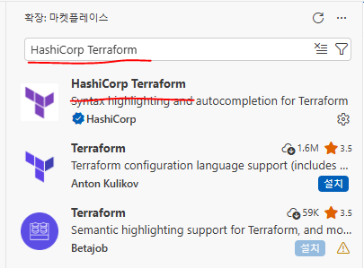

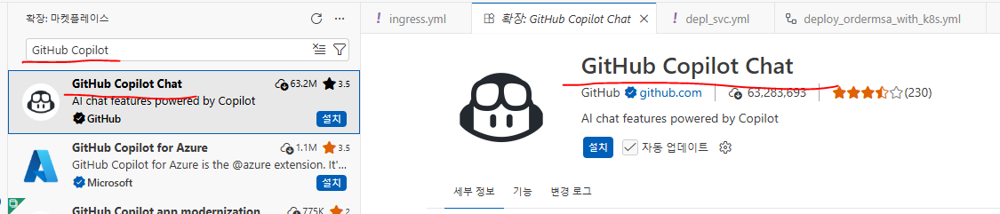

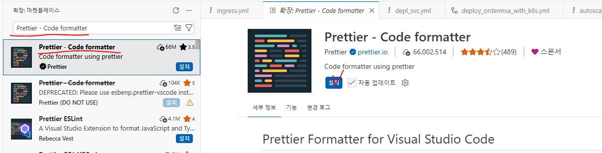

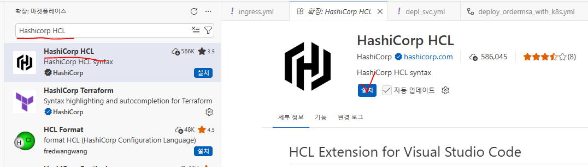

## 32. 실습: 환경 설정

- F1 키  -->  setting json
- 기본 설정 : 사용자 설정 열기

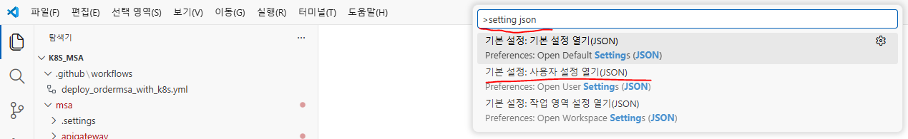

## 33. 실습: 기존 설정에 붙여넣기

```json
{
    "workbench.colorTheme": "Default Light Modern",
    "liveServer.settings.CustomBrowser": "firefox",
    "editor.wordWrap": "on",
    "liveServer.settings.donotVerifyTags": true,
    "editor.formatOnSave": true,
    "redhat.telemetry.enabled": true ,

    // Terraform 파일(.tf)에 대한 설정
    "[terraform]": {// Terraform 코드 파일(.tf)에 적용되는 VS Code 편집기 설정 시작
        // 파일 저장 시 수정된 부분만이 아니라 파일 전체를 기준으로 포맷팅 수행
        "editor.formatOnSaveMode": "file",
        // 파일을 저장할 때 자동으로 코드 정렬 및 포맷팅 실행
        "editor.formatOnSave": true,
        // Terraform 파일의 기본 포맷터를 HashiCorp Terraform 확장으로 지정
        "editor.defaultFormatter": "hashicorp.terraform",
        // 들여쓰기 시 탭을 2칸(2 spaces)으로 설정
        "editor.tabSize": 2 // optionally
    },

    // Terraform 변수 파일(.tfvars)에 대한 설정
    "[terraform-vars]": {
        // 파일을 저장할 때 자동으로 코드 포맷팅을 수행
        "editor.formatOnSave": true,
        // Terraform 변수 파일의 기본 포맷터를 HashiCorp Terraform 확장으로 지정
        "editor.defaultFormatter": "hashicorp.terraform",
        // 파일 전체를 저장할 때 포맷팅 적용
        "editor.formatOnSaveMode": "file",
        // 옵션: 편집기에서 탭을 2개의 스페이스로 설정
        "editor.tabSize": 2 // optionally
    }

}

//Terraform 코드 파일(.tf)에 적용되는 VS Code 편집기 설정 시
```

- C드라이브에 trf 폴더 생성

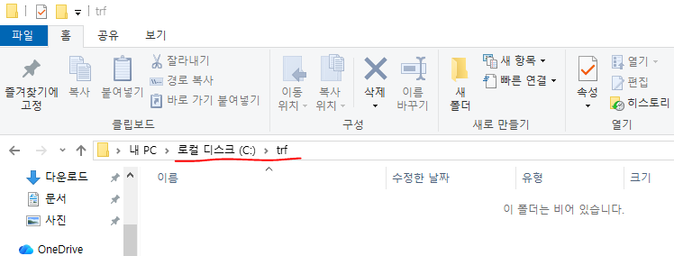

https://developer.hashicorp.com/terraform/install#windows# 다운로드

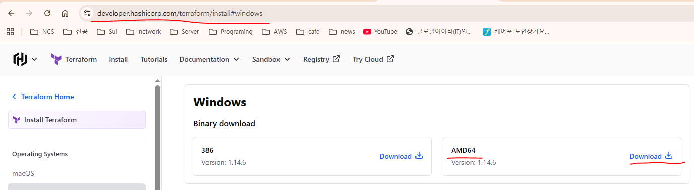

- C드라이브에 tool 폴더 생성  -->  압축 해제한 폴더의 내용을 tool 폴더로 복사 또는 이동

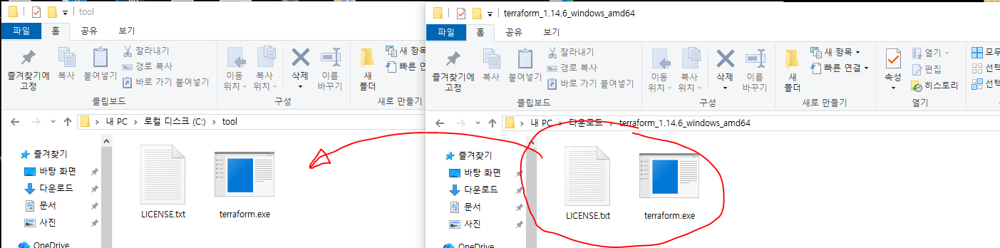

- 찿기  -->  시스템 환경 변수 편집  -->  고급  -->  환경 변수

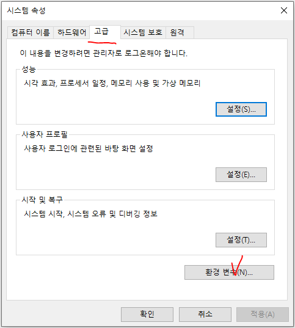

- path 클릭  -->  편집

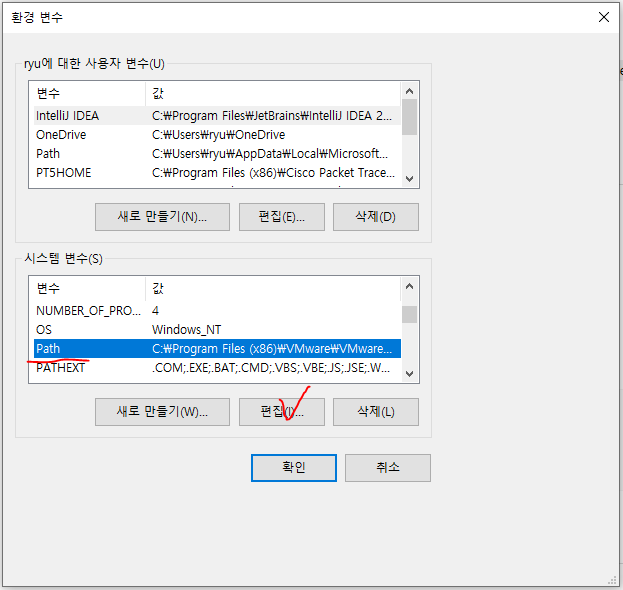

- 조금전 만든 C:\tool 설정  -->  확인  -->  확인

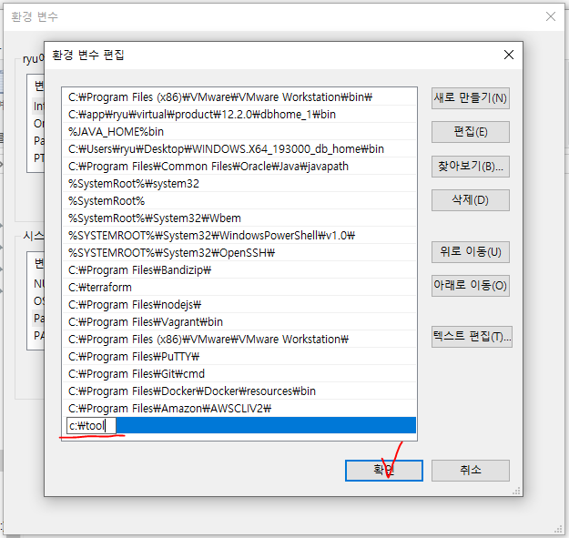

## 34. 실습: cmd

```
C:\Users\ryu> terraform -v
Terraform v1.14.6
on windows_amd64

# AWS CLI 설치 (이미 설치 완료)
```

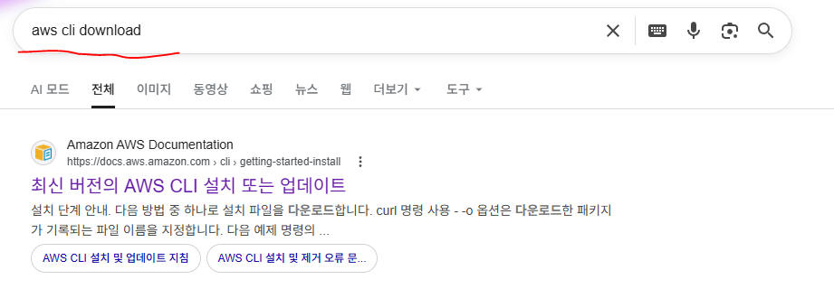

- 다운로드 후 설치까지

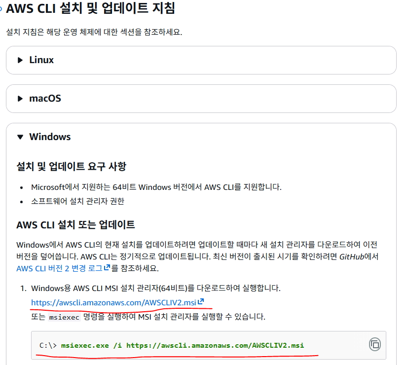

```powershell
PS C:\trf\HCL_01> aws  configure

Tip: You can deliver temporary credentials to the AWS CLI using your AWS Console session by running the command 'aws login'.

AWS Access Key ID [None]: <ACCESS_KEY_ID> 설정
AWS Secret Access Key [None]: <SECRET_ACCESS_KEY> 설정
Default region name [None]: ap-northeast-2
Default output format [None]:

PS C:\trf\HCL_01> aws configure list-profiles
default

PS C:\trf\HCL_01> aws  configure  --profile  my-profile

Tip: You can deliver temporary credentials to the AWS CLI using your AWS Console session by running the command 'aws login'.

AWS Access Key ID [None]: <ACCESS_KEY_ID> 설정
AWS Secret Access Key [None]: <SECRET_ACCESS_KEY> 설정
Default region name [None]: ap-northeast-2
Default output format [None]:

PS C:\trf\HCL_01> aws configure list-profiles
default
my-profile
```

- 테라폼 코드 압축파일을 압축 해제 후 vsCode를 사용해서 실행

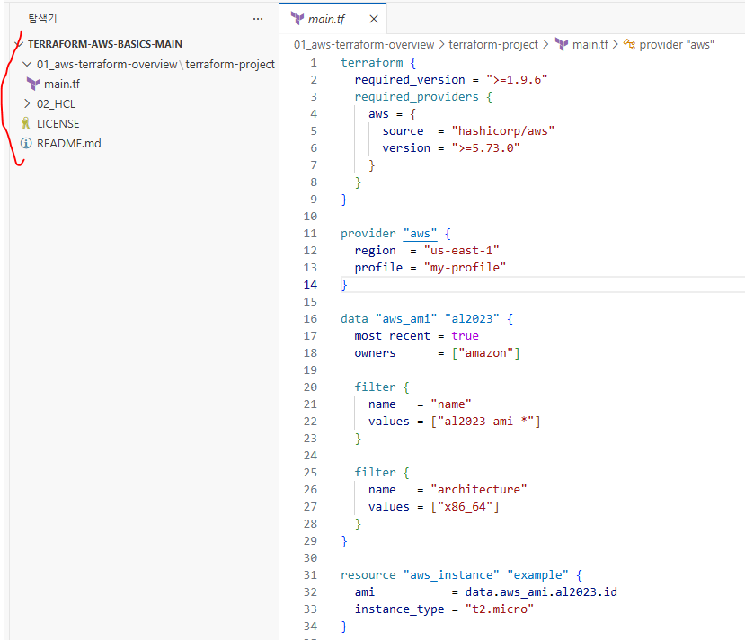

```hcl
# main.tf
# Terraform 전체 설정 블록
terraform {

  # 이 Terraform 코드를 실행할 때 필요한 Terraform CLI 최소 버전 (erraform 1.15.6 이상 버전에서 실행 가능)
  required_version = ">= 1.15.6"

  # Terraform이 사용할 Provider 정의
  # Provider = 특정 클라우드 서비스(AWS, Azure, GCP 등)와 통신하기 위한 플러그인
  required_providers {

    # AWS Provider 설정
    aws = {

      # Provider의 위치 (hashicorp/aws --> HashiCorp에서 공식 제공하는 AWS Provider)
      source = "hashicorp/aws"

      # 사용할 AWS Provider 버전 (AWS Provider 6.62.0 이상 버전을 사용하도록 설정)
      version = ">= 6.62.0"
    }
  }
}

# AWS Provider 설정, Terraform이 AWS와 통신할 때 사용하는 기본 설정
provider "aws" {
  # AWS 리전 설정
  # us-east-1 --> 서울리전
  region = "ap-northeast-2"
  # AWS CLI에 등록된 프로파일 사용
  # ~/.aws/credentials 파일에 설정된 profile 이름
  # 예
  # aws configure --profile my-profile
  profile = "my-profile"
}

# AWS에서 이미 존재하는 데이터를 조회하는 data 블록
# data = 리소스를 생성하는 것이 아니라 기존 정보를 가져오는 역할
data "aws_ami" "al2023" {
  # 가장 최신 AMI를 선택
  most_recent = true
  # AMI 소유자 설정
  # amazon --> AWS 공식 AMI
  owners = ["amazon"]

# AMI 필터 조건
  filter {
    # 필터 기준 이름
    # AMI 이름으로 검색
    name = "name"
    # AL2023 (Amazon Linux 2023) AMI만 조회
    values = ["al2023-ami-*"]
  }
  # 두 번째 필터 조건
  filter {
    # CPU 아키텍처 조건
    name = "architecture"
    # x86_64 아키텍처만 사용
    values = ["x86_64"]
  }
}

# output.tf
output "ami_id_print" {
  value = data.aws_ami.al2023.id
}

output "ami_name_print" {
  value = data.aws_ami.al2023.name
}

output "ami_architecture_print" {
  value = data.aws_ami.al2023.architecture
}

PS C:\trf\HCL_01> terraform  plan
data.aws_ami.al2023: Reading...
data.aws_ami.al2023: Read complete after 0s [id=ami-0c6cc074db0c3f65d]

Changes to Outputs:
  + ami_architecture_print = "x86_64"
  + ami_id_print           = "ami-0c6cc074db0c3f65d"
  + ami_name_print         = "al2023-ami-minimal-2023.12.20260914.0-kernel-6.18-x86_64"

You can apply this plan to save these new output values to the Terraform state, without changing any real infrastructure.

# main.tf
~~~~~~~~~~~~~~~~ 중간 생략 ~~~~~~~~~~~~~~~~
# AWS EC2 인스턴스를 생성하는 리소스 블록
resource "aws_instance" "example" {
  # EC2에서 사용할 AMI (위에서 조회한 Amazon Linux 2023 AMI를 사용)
  # data.aws_ami.al2023.id
  # data 블록에서 가져온 AMI ID
  ami = data.aws_ami.al2023.id
  # EC2 인스턴스 타입 (t2.micro 프리티어 인스턴스)
  instance_type = "t2.micro"

  # EC2 Name 태그 설정
  tags = {
    Name = "terraform-ec2"
  }
}

# output.tf
~~~~~~~~~~~~~~~~ 중간 생략 ~~~~~~~~~~~~~~~~
output "instance_id" {# EC2 인스턴스 ID 출력
  value = aws_instance.example.id
}

output "instance_type" {# EC2 인스턴스 타입 출력
  value = aws_instance.example.instance_type
}

output "public_ip" {# EC2 퍼블릭 IP 출력
  value = aws_instance.example.public_ip
}
```

- main.tf  우클릭  -->  통합 터미널에서 열기

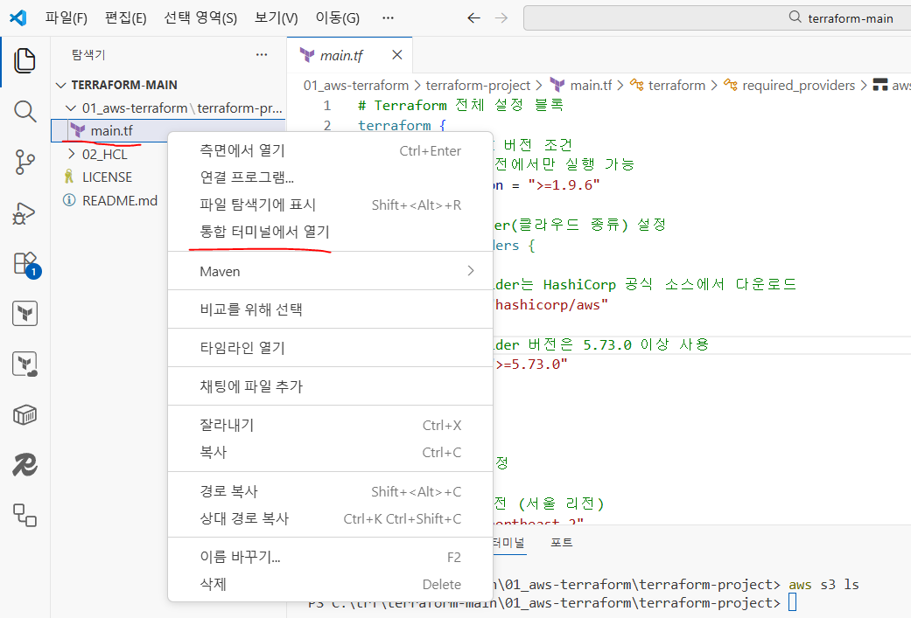

```powershell
PS C:\trf\terraform-main\01_aws-terraform\terraform-project> terraform -v
Terraform v1.14.6
on windows_amd64

PS C:\trf\terraform-main\01_aws-terraform\terraform-project> aws s3 ls

# 해당 폴더를 Terraform 프로젝트로 준비하는 작업
# 지금 이 폴더에서 Terraform을 쓸 수 있게 세팅하는 단계 (AWS Provider 다운로드)
PS C:\trf\terraform-main\01_aws-terraform\terraform-project> terraform  init
Initializing the backend...
Initializing provider plugins...
- Finding hashicorp/aws versions matching ">= 5.73.0"...
- Installing hashicorp/aws v6.34.0...
- Installed hashicorp/aws v6.34.0 (signed by HashiCorp)
Terraform has created a lock file .terraform.lock.hcl to record the provider
selections it made above. Include this file in your version control repository
so that Terraform can guarantee to make the same selections by default when
you run "terraform init" in the future.

Terraform has been successfully initialized!

You may now begin working with Terraform. Try running "terraform plan" to see
any changes that are required for your infrastructure. All Terraform commands
should now work.

If you ever set or change modules or backend configuration for Terraform,
rerun this command to reinitialize your working directory. If you forget, other
commands will detect it and remind you to do so if necessary.

 .terraform\providers\registry.terraform.io 생성
 .terraform.lock.hcl 생성
```


.terraform 폴더는 Terraform이 AWS 같은 Provider 실행파일을 다운로드해서 저장하는 작업용 폴더

.terraform.lock.hcl 파일은 Provider 버전을 고정해서 팀원이나 학생 환경이 달라도
동일한 버전으로 동작하게 만드는 버전 잠금 파일

```powershell
PS C:\trf\terraform-main\01_aws-terraform\terraform-project> terraform  plan
data.aws_ami.al2023: Reading...
data.aws_ami.al2023: Read complete after 0s [id=ami-0fae3369c34baac8b

~~~~~~~~~~~~~~~~~~~~~~~~~~ 중간 생략 ~~~~~~~~~~~~~~~~~~~~~~~~~~

Plan: 1 to add, 0 to change, 0 to destroy.

Note: You didn't use the -out option to save this plan, so Terraform can't guarantee to take exactly these actions if
you run "terraform apply" now.

PS C:\trf\terraform-main\01_aws-terraform\terraform-project> terraform  apply
data.aws_ami.al2023: Reading...
data.aws_ami.al2023: Read complete after 1s [id=ami-0fae3369c34baac8b]

~~~~~~~~~~~~~~~~~~~~~~~~~~ 중간 생략 ~~~~~~~~~~~~~~~~~~~~~~~~~~

Plan: 1 to add, 0 to change, 0 to destroy.

Do you want to perform these actions?
  Terraform will perform the actions described above.
  Only 'yes' will be accepted to approve.

  Enter a value: yes

aws_instance.example: Creating...
aws_instance.example: Still creating... [00m10s elapsed]
aws_instance.example: Creation complete after 13s [id=i-08481f634e282c90f]

Apply complete! Resources: 1 added, 0 changed, 0 destroyed.
```

- AWS에 접속해서 확인하면 EC2 인스턴스가 생성되어 있다.

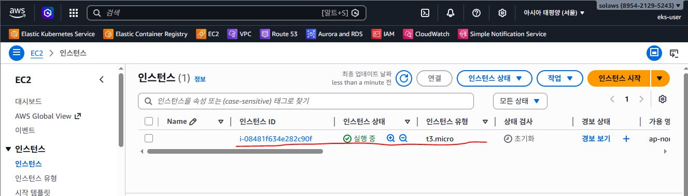

```powershell
PS C:\trf\terraform-main\01_aws-terraform\terraform-project> terraform  destroy
data.aws_ami.al2023: Reading...
data.aws_ami.al2023: Read complete after 1s [id=ami-0fae3369c34baac8b]
aws_instance.example: Refreshing state... [id=i-08481f634e282c90f]

Terraform used the selected providers to generate the following execution plan. Resource actions are indicated with the
following symbols:
  - destroy

Terraform will perform the following actions:

  # aws_instance.example will be destroyed

~~~~~~~~~~~~~~~~~~~~~~~~~~ 중간 생략 ~~~~~~~~~~~~~~~~~~~~~~~~~~

Do you really want to destroy all resources?
  Terraform will destroy all your managed infrastructure, as shown above.
  There is no undo. Only 'yes' will be accepted to confirm.

  Enter a value: yes

aws_instance.example: Destroying... [id=i-08481f634e282c90f]
aws_instance.example: Still destroying... [id=i-08481f634e282c90f, 00m10s elapsed]
aws_instance.example: Still destroying... [id=i-08481f634e282c90f, 00m20s elapsed]
aws_instance.example: Still destroying... [id=i-08481f634e282c90f, 00m30s elapsed]
aws_instance.example: Still destroying... [id=i-08481f634e282c90f, 00m40s elapsed]
aws_instance.example: Destruction complete after 50s

Destroy complete! Resources: 1 destroyed.
PS C:\trf\terraform-main\01_aws-terraform\terraform-project>
```

- AWS 접속해서 EC2 삭제 확인
