# Terraform - HCL 문법

## 이론

#### HCL (HashiCorp Configuration Language)

- HCL(HashiCorp Configuration Language)은 Terraform에서 사용하는 구성 언어이다.
- Terraform은 인프라를 코드로 관리하기 위한 도구이며, HCL은 그 인프라를 정의하기 위한 문법 체계다.

- AWS 콘솔에 들어가서 EC2를 생성시 리전을 선택하고, AMI를 선택하고, 인스턴스 타입을 고르고,
키페어를 선택하고, 보안 그룹을 설정한다.
이 모든 과정을 클릭으로 진행한다.

- 하지만 Terraform을 사용하면 이렇게 말하지 않는다.
  - 이 과정을 순서대로 실행해라.
  - 대신 이렇게 선언한다.
  - 이런 속성을 가진 EC2 인스턴스가 존재해야 한다.
  - 그리고 Terraform은 현재 상태를 검사한 뒤, 존재하지 않으면 생성하고, 다르면 수정하고, 불필요하면 삭제한다.

- 이처럼 HCL은 절차를 나열하는 언어가 아니라 원하는 인프라의 최종 상태를 선언하는 언어다.

#### 선언형 방식이 왜 중요한가

- HCL은 선언형(Declarative) 언어이다.

- 절차형 언어라면 다음과 같이 작성했을 것이다.
  - 1단계 : VPC 생성
  - 2단계 : 서브넷 생성
  - 3단계 : EC2 생성

- 그러나 HCL에서는 이런 순서를 작성하지 않는다.
예를 들어 EC2가 특정 VPC에 속해야 한다고 선언하면,Terraform은 내부적으로 의존성 그래프를 만든다.
그리고 어떤 리소스를 먼저 생성해야 하는지 자동으로 판단한다.

- 즉, 우리는 무엇이 존재해야 하는가만 정의한다.
- 어떻게 만들 것인가는 Terraform이 처리한다.

- 이 방식은 인프라 규모가 커질수록 엄청난 차이를 만든다.
- 수십, 수백 개의 리소스가 얽혀 있을 때 사람이 순서를 관리하는 것은 사실상 불가능하다.

#### HCL 문법 구조의 개념

- HCL은 블록 기반 언어이다.
- 모든 구성은 블록 안에서 정의된다.

- 기본 형태는
블록타입 "라벨1" "라벨2" {

```hcl
    key = value
}
```

- 여기서 중요한 것은 블록 타입과 라벨이다.

- 블록 타입은 이 코드가 어떤 종류의 구성인지 나타낸다.
- 예를 들어 provider, resource, variable, output 등이 있다.

- 라벨은 블록을 식별하기 위한 이름이다.
- 라벨은 항상 2개가 아니다.
- 0개일 수도 있고, 1개일 수도 있고, 2개일 수도 있다.

- 예를 들어 terraform 블록은 라벨이 없다.

```hcl
terraform {
    required_version = ">= 1.9.6"
}
```

- provider 블록은 라벨이 하나다.

```hcl
provider "aws" {
    region = "ap-northeast-2"
}
```

- resource 블록은 라벨이 두 개다.

```hcl
resource "aws_instance" "web" {
    ami           = "ami-xxxx"
    instance_type = "t3.micro"
}
```

- 여기서 첫 번째 라벨은 리소스 타입이고, 두 번째 라벨은 우리가 정의하는 이름이다.

#### 키-값 구조의 의미

- 블록 내부는 모두 key = value 형태로 구성된다.

- 예를 들어:

```hcl
region = "us-west-2"
instance_type = "t3.micro"
```

- 이것은 단순히 변수를 선언하는 것이 아니다.
- 리소스의 속성을 정의하는 것이다.
- 즉, 이 리소스가 어떤 설정을 가져야 하는지를 명시하는 것이다.

- HCL에서는 이 구조가 매우 중요하다.
- 모든 설정은 결국 속성 정의이며, Terraform은 이 속성 값을 기준으로 실제 인프라 상태를 비교한다.

#### 주석의 역할

- HCL에서는 주석을 두 가지 방식으로 작성할 수 있다.

- 한 줄 주석은 # 또는 // 로 작성한다.
  - 이것은 한 줄 주석입니다
// 이것도 한 줄 주석입니다

- 여러 줄 주석은 /* */ 로 감싼다.

```
/*
이것은 여러 줄 주석입니다.
설명용 텍스트를 작성할 때 사용합니다.
*/
```

- 주석은 실행에 영향을 주지 않는다.
- 하지만 협업과 유지보수에서 매우 중요하다.
- 특히 실무에서는 인프라 변경 이유를 반드시 남겨야 한다.

#### Terraform 프로젝트 구조

- Terraform은 일반적으로 하나의 디렉토리를 하나의 프로젝트 단위로 사용한다.
- 예를 들어 my-terraform-project라는 폴더가 있다면 그 안에 여러 개의 .tf 파일을 구성한다.
- Terraform은 같은 디렉토리안의 .tf 파일들을 하나의 설정으로 인식하여 함께 실행한다.

- main.tf
  - 실제 생성할 인프라 리소스를 정의하는 파일이다.
  - EC2, VPC, Subnet, Security Group, RDS, S3 등의 주요 리소스를 선언한다.
  - 파일 이름이 반드시 main.tf여야 하는 것은 아니지만, 일반적으로 핵심 리소스를 모아두는 용도로 사용한다.

- variables.tf
  - Terraform 프로젝트에서 사용할 변수를 정의하는 파일이다.
  - 변수의 이름, 타입, 기본값, 설명 등을 설정할 수 있다.
  - IP 주소, 인스턴스 타입, 리전 등 변경 가능성이 있는 값을 변수로 관리하면 재사용하기 편리하다.
  - 예: instance_type, region, vpc_cidr

- terraform.tfvars
  - variables.tf에서 선언한 변수에 실제 값을 입력하는 파일이다.
  - 개발, 테스트, 운영 환경에 따라 서로 다른 값을 적용할 수 있다.
  - 예를 들어 같은 Terraform 코드에서 EC2 타입이나 VPC CIDR만 변경해서 사용할 수 있다.
  - 비밀번호나 Access Key 같은 민감한 정보는 GitHub 등에 업로드하지 않도록 주의해야 한다.

- outputs.tf
  - Terraform 실행 후 확인하고 싶은 값을 출력하도록 정의하는 파일이다.
  - 생성된 EC2 Public IP, ALB DNS 주소, RDS Endpoint 등을 출력할 수 있다.
  - terraform apply 완료 후 결과를 쉽게 확인할 때 사용한다.

- providers.tf
  - Terraform이 어떤 클라우드 또는 서비스를 사용할 것인지 정의하는 파일이다.
  - AWS, Azure, GCP, Kubernetes 등 다양한 Provider를 사용할 수 있다.
  - AWS를 사용하는 경우 Region 등의 Provider 설정을 지정할 수 있다.

- versions.tf
  - Terraform과 Provider의 사용할 버전 범위를 지정하는 파일이다.
  - 사용자마다 다른 버전을 사용해서 발생하는 문제를 방지하기 위해 사용한다.
  - 예: Terraform 1.x, AWS Provider 6.x 등의 버전 조건을 설정할 수 있다.

- terraform.tfstate
  - Terraform이 현재 관리하고 있는 인프라 상태를 기록하는 파일이다.
  - AWS에 실제로 어떤 리소스를 생성했는지 Terraform이 추적하기 위해 사용한다.
  - 사용자가 직접 수정하는 파일이 아니다.
  - 여러 사람이 Terraform을 사용하는 환경에서는 S3 같은 원격 저장소에 State를 저장하기도 한다.

- .terraform/
  - terraform init 실행 시 생성되는 디렉토리이다.
  - 사용하는 Provider 플러그인과 Terraform 초기화 관련 파일이 저장된다.
  - 일반적으로 사용자가 직접 수정하지 않는다.

- .terraform.lock.hcl
  - 사용 중인 Provider 버전을 기록하는 잠금 파일이다.
  - 다른 환경에서도 동일한 Provider 버전을 사용할 수 있도록 도와준다.
  - 일반적으로 Git에 함께 저장하는 것을 권장한다.

- 일반적인 프로젝트 구조

my-terraform-project/
│
├── main.tf
├── variables.tf
├── terraform.tfvars
├── outputs.tf
├── providers.tf
├── versions.tf
├── terraform.tfstate
└── .terraform.lock.hcl

- 이 파일들이 하나의 프로젝트를 구성한다.

#### 환경 분리의 필요성

- 실무에서는 개발(dev), 테스트(test), 운영(production) 환경을 분리한다.

- 각 환경은 설정 값이 다를 수 있다.
- 예를 들어 운영 환경은 인스턴스 타입이 더 클 수 있고,
- 개발 환경은 비용 절감을 위해 작은 인스턴스를 사용할 수 있다.
- 그래서 보통 다음과 같이 디렉토리를 구성한다.

my-terraform-project/
├── dev/
├── test/
└── production/

각 환경 폴더 안에 main.tf, variables.tf, outputs.tf 등을 둔다.
이렇게 하면 환경 간 설정이 섞이지 않는다.

#### 모듈화의 중요성

- 프로젝트가 커지면 코드가 길어지고 복잡해진다.
- 이때 모듈을 사용한다.

- 모듈은 재사용 가능한 Terraform 코드 묶음이다.

- 예를 들어 VPC를 구성하는 코드가 있다면 그것을 하나의 모듈로 만들어 여러 프로젝트에서 재사용할 수 있다.

- 모듈화를 하면 다음과 같은 장점이 있다.
  - 코드 중복 제거
  - 유지보수 쉬움
  - 구조적 설계 가능
  - 팀 단위 협업 가능
  - 대규모 인프라에서는 모듈 없이 관리하는 것이 거의 불가능하다.

#### Terraform Provider

- Terraform을 처음 배울 때 가장 많이 헷갈리는 개념이 바로 프로바이더(provider)다.
- Provider란 쉽게 말해 Terraform과 외부 시스템을 연결해주는 중간 계층이다.

- Terraform은 자체적으로 EC2를 만들 수 있는 프로그램이 아니다.
- S3를 생성하는 기능도 없고, Kubernetes Pod를 만드는 기능도 없다.
- Terraform은 단지 상태를 계산하고, "이 리소스가 있어야 한다."고 판단하는 도구일 뿐이다.

- 실제로 AWS에 API 요청을 보내는 건 바로 Provider다.

- 프로바이더는 특정 플랫폼의 API와 통신하는 플러그인이라고 이해하면 된다.
  - Terraform: 원하는 상태 계산
  - Provider: 해당 클라우드 API 호출
  - 클라우드: 실제 리소스 생성

#### 프로바이더 정의 방식

- Terraform에서 프로바이더는 .tf 파일 안에서 provider 블록으로 정의한다.

- 예를 들어 AWS를 사용한다고 가정해보자.

```hcl
terraform {
  required_providers {
    aws = {
      source  = "hashicorp/aws"
      version = "~> 5.0"
    }
  }
}

provider "aws" {
  region = "us-east-1"
}
```

- 이 설정 에는 크게 세 가지 의미가 있다.

첫째, 어떤 플랫폼의 Provider를 사용할 것인지 선언한다.
  - aws Provider를 사용한다고 명시한다.
  - source = "hashicorp/aws"는 HashiCorp에서 제공하는 AWS Provider를 사용한다는 의미다.

둘째, 어떤 버전의 Provider를 사용할 것인지 지정한다.
  - version = "~> 5.0"은 AWS Provider 5.x 버전 범위를 사용한다는 의미다.
  - Provider 버전이 달라지면 일부 리소스의 옵션이나 동작 방식이 변경될 수 있다.
  - 따라서 실무에서는 Provider 버전을 일정 범위로 제한하여 사용하는 것이 중요하다.

셋째, 어떤 리전에 API 요청을 보낼 것인지 정의한다.
  - provider "aws" 블록의 region에서 기본 리전을 설정한다.
  - 여기서는 us-east-1 리전을 사용한다.
  - 이후 별도의 리전을 지정하지 않은 AWS 리소스들은 기본적으로 이 리전을 기준으로 생성된다.

- required_providers와 provider는 서로 역할이 다르다.
  - required_providers : 어떤 Provider를 어디서 가져오고 어떤 버전을 사용할지 정의
  - provider : 가져온 Provider를 실제로 어떤 설정으로 사용할지 정의

- required_providers
  - AWS Provider 사용 선언
  - Provider 출처 지정
  - Provider 버전 지정

- provider "aws"
  - AWS Provider 실제 설정
  - 사용할 기본 Region 지정

- terraform init을 실행하면 required_providers 설정을 기준으로 필요한 AWS Provider를 다운로드한다.
- 이후 terraform plan이나 terraform apply를 실행하면 provider "aws" 설정을 사용하여 지
정된 AWS 리전에 API 요청을 보낸다.

#### 프로바이더는 왜 필요한가

- Terraform이 직접 AWS를 제어할 수 없다면 왜 이런 구조로 설계했을까?
- 이유는 확장성 때문이다.

- 만약 Terraform 내부에 AWS 코드가 내장되어 있었다면 Azure를 쓰기 위해서는 Terraform 자체를 수정해야 한다.
하지만 프로바이더 구조를 사용하면 AWS, Azure, GCP, Kubernetes, Docker 등
각 플랫폼별로 별도의 플러그인을 연결할 수 있다.
즉, Terraform은 플랫폼 중립적인 도구가 된다.

#### 프로바이더 구성과 인증

- 프로바이더를 정의했다고 해서 바로 리소스를 만들 수 있는 것은 아니다.
- 클라우드에 접근하려면 인증 정보가 필요하다.

- AWS의 경우 대표적으로 다음이 필요하다.
  - Access Key ID
  - Secret Access Key

- 하지만 이 인증 정보를 코드 안에 직접 적는 것은 매우 위험하다.

- 예를 들어 이렇게 작성하면 안 된다.

```hcl
provider "aws" {
  region     = "ap-northeast-2"
  access_key = "..."
  secret_key = "..."
}
```

- 이 코드를 Git에 올리는 순간 계정이 해킹될 수 있다.
그래서 실무에서는 인증 정보를 다음과 같은 방식으로 제공한다.

- 첫 번째 방법은 환경 변수 방식이다.

```
export AWS_ACCESS_KEY_ID="your-access-key-id"
export AWS_SECRET_ACCESS_KEY="your-secret-access-key"

Terraform은 실행 시 환경 변수를 자동으로 읽는다.

두 번째 방법은 AWS CLI 설정 파일을 사용하는 방식이다.

aws configure 명령어로 설정하면
~/.aws/credentials 파일에 인증 정보가 저장된다.
Terraform은 이 파일을 자동으로 참조한다.
```

- 실무에서는 절대 코드에 키를 직접 작성하지 않는다.
- 이건 보안 기본 원칙이다.

#### 멀티 프로바이더 구조

- Terraform은 하나의 프로젝트에서 여러 프로바이더를 동시에 사용할 수 있다.

- 예제1) 다음과 같은 상황을 생각해보자.
  - AWS에 EC2 생성
  - GCP에 Cloud Storage 생성
  - Kubernetes 클러스터 내부에 Deployment 생성
  - 이 모든 것을 하나의 Terraform 프로젝트에서 관리할 수 있다.

예를 들어:

```hcl
provider "aws" {
  region = "ap-northeast-2"
}

provider "google" {
  project = "my-gcp-project"
  region  = "asia-northeast1"
}
```

- 이렇게 두 개의 프로바이더를 동시에 선언할 수 있다.
- 이것이 멀티 클라우드 관리의 핵심이다.

- Terraform은 단일 클라우드 전용 도구가 아니라 멀티 클라우드 통합 관리 도구다.

- 예제2) 다음과 같은 상황을 생각해보자.

- EKS는 AWS가 제공하는 관리형 Kubernetes 서비스다.
  - AWS가 제공하는 것은 Kubernetes 클러스터 인프라
  - 우리가 관리하는 것은 그 안의 Kubernetes 리소스

- 이 둘은 완전히 다른 레벨이다.

- 인프라 레벨 (AWS 영역)
  - VPC
  - Subnet
  - Security Group
  - IAM Role
  - EKS Cluster
  - Node Group

- 이 모든 것은 AWS API를 통해 생성된다.
따라서 이 영역은 aws 프로바이더가 담당한다.

- 클러스터 내부 레벨 (Kubernetes 영역)
  - EKS 클러스터가 생성되고 나면 그 안에서 다음을 관리해야 한다.
  - Namespace
  - Deployment
  - Service
  - Ingress
  - ConfigMap
  - Secret

- 이것은 AWS API가 아니라 Kubernetes API를 통해 생성된다.
따라서 이 영역은 kubernetes 프로바이더 또는 helm 프로바이더가 담당한다.

#### 다양한 프로바이더 종류

- Terraform에는 AWS만 있는 것이 아니다.

- 대표적인 프로바이더는 다음과 같다.

- aws 프로바이더는 Amazon Web Services 리소스를 관리한다.
  - EC2, S3, VPC, RDS 등 거의 모든 AWS 서비스를 지원한다.

- azurerm 프로바이더는 Microsoft Azure 리소스를 관리한다.
  - 가상 머신, 네트워크, 데이터베이스 등 Azure 전용 리소스를 제어한다.

- google 프로바이더는 Google Cloud Platform을 관리한다.
  - Compute Engine, GKE, Cloud Storage 등을 생성할 수 있다.

- kubernetes 프로바이더는 Kubernetes 클러스터 내부 리소스를 관리한다.
  - Pod, Service, Deployment, ConfigMap 등을 생성할 수 있다.

- docker 프로바이더는 Docker 컨테이너 및 네트워크를 관리한다.

- 이 구조를 보면 Terraform은 단순한 클라우드 생성 도구가 아니라 인프라 통합 제어 엔진에 가깝다.

#### 프로바이더 동작 원리

- Terraform을 실행하면 다음과 같은 순서로 동작한다.

- terraform init 실행
  - 프로바이더 플러그인을 다운로드한다.

- terraform plan 실행
  - 현재 상태와 원하는 상태를 비교한다.

- terraform apply 실행
  - 프로바이더가 API를 호출하여 실제 리소스를 생성한다.

- 즉, 프로바이더는 terraform init 단계에서 설치되고 apply 단계에서 실제 API 호출을 수행한다.

#### Terraform 블록의 개념

- Terraform에서 가장 중요한 개념은 블록(Block)이다.
- Terraform 코드는 전부 블록으로 구성된다.
- 변수도 블록, 리소스도 블록, 출력도 블록이다.

#### 블록이란?

- 블록은 구성(Configuration)을 정의하는 가장 기본 단위다.
즉, Terraform은 선언형 언어이며 우리는 이런 상태가 되도록 구성해라라고 블록 단위로 명령한다.

- 각 블록은 하나의 기능을 담당한다.
  - terraform 블록: Terraform 자체 설정
  - provider 블록: 클라우드 연결 설정
  - resource 블록: 실제 인프라 생성
  - data 블록: 기존 리소스 조회
  - variable 블록: 입력 변수 정의
  - output 블록: 결과 출력
  - locals 블록: 내부 계산용 변수

- 이 모든 블록이 유기적으로 연결되어 최종 인프라 상태를 완성한다.

#### 블록 간의 관계와 동작 방식

- 각 블록은 문법적으로는 독립적이다.
하지만 실제 프로젝트에서는 서로 참조하면서 동작한다.

- 예를 들어 다음과 같은 흐름이 있다.

- variable 블록에서 정의한 값이 resource 블록에서 사용된다.
- resource 블록에서 생성된 리소스 값이 output 블록에서 출력된다.
- data 블록에서 가져온 기존 리소스 정보가 resource 블록에서 사용된다.

- 이처럼 블록은 독립적인 문법 구조이지만 논리적으로는 하나의 흐름을 형성한다.

- Terraform은 내부적으로 이 블록들의 참조 관계를 그래프로 계산한다.
- 이를 Dependency Graph라고 한다.

#### terraform 블록

- terraform 블록은 Terraform 자체 설정을 정의하는 블록이다.

- 이 블록은 인프라를 만드는 것이 아니라 Terraform 실행 환경을 정의한다.

- 예를 들어 다음과 같이 작성할 수 있다.

```hcl
terraform {
  required_version = ">= 1.9.6"

  required_providers {
    aws = {
      source  = "hashicorp/aws"
      version = ">= 5.73.0"
    }
  }
}
```

- 여기서 중요한 개념이 있다.

첫째, required_version은 이 코드가 어떤 Terraform 버전 이상에서 실행되어야 하는지를 지정한다.

둘째, required_providers는 어떤 프로바이더를 어떤 버전으로 사용할지를 명시한다.
  - 이 설정은 terraform init 단계에서프로바이더를 다운로드할 때 사용된다.

- 실무에서는 버전을 고정하지 않으면 나중에 버전 변경으로 동작이 달라질 수 있다.

#### provider 블록

- provider 블록은 Terraform이 연결할 클라우드 또는 플랫폼을 정의한다.
- 예를 들어 AWS를 사용할 경우 다음과 같이 작성한다.

```hcl
provider "aws" {
  region = "us-east-1"
}
```

- 이 블록은 단순히 region만 지정하는 것이 아니다.
- 이 블록은 어떤 API에 요청을 보낼 것인지, 어떤 리전에 리소스를 생성할 것인지,
어떤 인증 정보를 사용할 것인지를 결정한다.

- provider는 실제로 Terraform과 외부 시스템을 연결하는 플러그인이다.
  - terraform init 시 다운로드되고 terraform apply 시 API 호출을 수행한다.

#### backend 블록

- backend 블록은 Terraform 상태 파일(tfstate)의 저장 위치를 정의한다.
- Terraform은 단순히 리소스를 만드는 도구가 아니다.
- 현재 인프라 상태를 tfstate 파일에 기록한다.

- 이 파일에는 다음이 저장된다.
  - 생성된 리소스 ID
  - 속성 값
  - 종속성 정보
  - 이 파일이 있어야 Terraform은 이미 존재하는 리소스인지 새로 생성해야 하는지 판단할 수 있다.

예를 들어 S3를 backend로 사용하는 경우:

```hcl
terraform {
  backend "s3" {
    bucket = "my-terraform-state"
    key    = "terraform.tfstate"
    region = "us-east-1"
  }
}

실무에서는 반드시 remote backend를 사용한다.
```

- 왜냐하면 팀 협업 시 로컬 tfstate는 충돌을 일으키기 때문이다.

#### resource 블록 (가장 많이 사용하는 블록)

- resource 블록은 실제 인프라를 생성하는 블록이며 Terraform에서 가장 중요한 블록중 하나이다.

예:

```hcl
resource "aws_instance" "example" {
  ami           = "ami-0c55b159cbfafe1f0"
  instance_type = "t3.micro"
}
```

- 여기서 구조를 분석해보면
  - resource "리소스타입" "이름"
  - aws_instance: 리소스 타입
  - example: 이 코드 내부에서 참조할 이름

- 이 블록은 실제로 EC2 인스턴스를 생성한다.

- Terraform apply 시 aws 프로바이더가 AWS API를 호출하여 실제 인스턴스를 생성한다.

#### data 블록

- data 블록은 이미 존재하는 리소스 정보를 가져오는 블록이다.
- 즉, 생성이 아니라 조회다.

예:

```hcl
data "aws_ami" "al2023" {
  most_recent = true
  owners      = ["amazon"]

  filter {
    name   = "name"
    values = ["al2023-ami-*"]
  }
}
```

- 이 코드는 새로운 AMI를 만드는 것이 아니라 기존에 존재하는 최신 AMI ID를 조회한다.

- 실무에서는 다음과 같은 상황에서 사용된다.
  - 기존 VPC 참조
  - 기존 Subnet 참조
  - 최신 AMI 자동 조회
  - 기존 EKS 정보 가져오기

- data 블록은 인프라 재사용과 자동화에 매우 중요하다.

#### variable 블록

- variable 블록은 입력 변수를 정의한다.
- Terraform 코드를 재사용 가능하게 만드는 핵심 요소다.

예:

```hcl
variable "instance_type" {
  description = "The type of instance to create"
  type        = string
  default     = "t3.micro"
}
```

- 이렇게 정의하면 resource에서 다음과 같이 사용할 수 있다.
  - instance_type = var.instance_type

- 변수를 사용하면
  - 코드 재사용 가능
  - 환경별 분리 가능
  - dev, prod 분리 가능

- 값 전달 방식은
  - CLI 입력
  - 환경 변수
  - .tfvars 파일 등이 있다.

#### locals 블록

- locals 블록은 프로젝트 내부 계산용 변수다. (외부 입력을 받지 않는다.)

예:

```hcl
locals {
  instance_name = "my-instance"
  ami_id         = "ami-0c55b159cbfafe1f0"
}
```

- locals는 중복 코드 제거와 가독성 향상에 사용된다.

- 예를 들어 태그를 여러 리소스에 동일하게 적용할 경우 locals로 정의해두면 관리가 쉬워진다.

#### output 블록

output 블록은 Terraform 실행 후 결과를 출력하는 블록이다.

예:

```hcl
output "instance_ip" {
  description = "The public IP of the EC2 instance"
  value       = aws_instance.example.public_ip
}
```

- terraform apply 이후 터미널에 해당 값이 출력된다.

- 실무에서는 다음 용도로 사용한다.
  - EC2 공인 IP 확인
  - EKS endpoint 확인
  - RDS endpoint 확인
  - 모듈 간 값 전달
  - 특히 모듈 구조에서는 output이 매우 중요하다.

#### Terraform 데이터 타입

- Terraform에서는 모든 값(Value)이 특정 데이터 타입(Type)을 가진다.
- Terraform은 선언형 언어이기 때문에 어떻게 만들 것인가보다 어떤 상태를 원하는가를 정의한다.
- 이때 변수나 리소스에 전달되는 값의 타입이 맞아야 Terraform이 정상적으로 동작한다.

- 데이터 타입이 중요한 이유는 다음과 같다.
  - 모든 표현식(Expression)은 값을 반환한다.
  - 모든 값은 특정 타입을 가진다.
  - 타입에 따라 사용할 수 있는 연산과 표현 방식이 달라진다.
  - 잘못된 타입을 사용하면 terraform plan이나 검증 단계에서 오류가 발생할 수 있다.

- 예를 들어,
  - 문자열이 필요한 곳에 잘못된 형태의 값을 넣으면 오류가 발생할 수 있다.
  - list가 필요한 곳에 단일 값을 넣으면 오류가 발생할 수 있다.
  - object에서 필요한 속성이 빠지거나 타입이 맞지 않으면 검증에 실패할 수 있다.

- VPC, EC2, Auto Scaling, RDS, IAM처럼 설정이 복잡해질수록 데이터 타입을 정확히 이해하는 것이 중요하다.

#### Terraform 데이터 타입의 구조

- Terraform 데이터 타입은 크게 다음과 같이 구분할 수 있다.
  - 기본 타입 (Primitive Types)
  - 복합 타입 (Collection / Structural Types)

#### 기본 데이터 타입

- 기본 타입은 하나의 단순한 값을 표현한다.

  - 1) string

- 문자열을 저장하는 타입이다.

- 문자열은 " " 안에 값을 작성한다.
  - "ap-northeast-2"
  - "t3.micro"
  - "production"

- 주요 사용 예:
  - AWS Region
  - EC2 Instance Type
  - VPC CIDR
  - AMI ID
  - Tag 값

- string은 Terraform에서 가장 많이 사용하는 타입 중 하나이다.

  - 2) number

- 숫자를 저장하는 타입이다.

- 정수와 실수를 모두 표현할 수 있다.
  - 10
  - 3.14
  - 3306

- 주요 사용 예:
  - 포트 번호
  - 디스크 용량
  - 인스턴스 개수
  - 서브넷 개수
  - CPU 또는 메모리 관련 숫자 값

- 예를 들어 VPC에서 생성할 서브넷 개수를 변수로 관리할 수 있다.

```hcl
variable "public_subnet_count" {
  type    = number
  default = 2
}

- public_subnet_count는 숫자 값이므로 number 타입을 사용한다.
```

  - 3) bool

- 참 또는 거짓을 표현하는 타입이다.
- 사용할 수 있는 값은 true, false 두 가지이다.
  - enable_monitoring = true
  - public_access = false

- 주요 사용 예
  - 특정 기능 활성화 / 비활성화
  - 리소스 생성 여부
  - 모니터링 활성화 여부
  - Public Access 허용 여부

- bool 타입은 조건문이나 count 같은 조건 기반 설정에서 많이 사용된다.

#### 복합 데이터 타입

- 복합 타입은 여러 개의 값을 하나로 묶어서 관리할 때 사용한다.

  - 1) list(TYPE)

- 동일한 타입의 여러 값을 순서대로 저장하는 타입이다.

- 예: list(string)
- 값: ["ap-northeast-2a", "ap-northeast-2c"]

- 특징:
  - 순서가 있다.
  - 인덱스로 접근할 수 있다.
  - 중복 값을 허용한다.

- 예:

```hcl
availability_zones = [
  "ap-northeast-2a",
  "ap-northeast-2c"
]
```

- VPC에서 여러 가용 영역을 하나의 리스트로 관리할 때 사용할 수 있다.
- 인덱스를 이용하여 특정 값을 가져올 수도 있다.
  - var.availability_zones[0]
  - 첫 번째 값인 ap-northeast-2a를 가져온다.

  - 2) set(TYPE)

- list와 비슷하게 여러 값을 저장하지만 순서를 보장하지 않고 중복을 허용하지 않는다.

- 예: set(string)
- 값 예: ["web", "production"]

- 특징:
  - 순서가 없다.
  - 중복 값을 허용하지 않는다.
  - 값 자체가 중요한 경우 사용한다.

- 고유한 이름 목록이나 중복이 필요 없는 값들을 관리할 때 사용할 수 있다.
  - 3) map(TYPE)

- Key-Value 형태로 값을 저장하는 타입이다.
- 하나의 Key에 하나의 Value가 연결된다.

- 예: map(string)
- 값:  { env  = "prod"  team = "devops" }

- 특징:
  - Key 이름을 이용하여 값에 접근한다.
  - 환경별 설정을 관리하기 편리하다.
  - 여러 설정 값을 이름과 함께 관리할 수 있다.

- 예:

```hcl
instance_type = {
  dev  = "t3.micro"
  prod = "m5.large"
}
```

- 환경에 따라 다른 EC2 Instance Type을 사용할 수 있다.
  - var.instance_type["dev"]
  - 결과 : t3.micro

  - 4) object({ key = type })

- object는 여러 개의 속성을 하나의 구조로 묶어서 관리하는 타입이다.
- map과 달리 각각의 속성에 서로 다른 데이터 타입을 지정할 수 있다.

- 예:

```hcl
object({
  name      = string
  instance_type = string
  disk_size     = number
})
```

- 값:

```hcl
{
  name      = "web-server"
  instance_type= "t3.micro"
  disk_size  = 50
}
```

- 특징:
  - 여러 관련 설정을 하나의 구조로 관리할 수 있다.
  - 각 속성마다 다른 타입을 사용할 수 있다.
  - 구조가 명확하기 때문에 복잡한 설정 관리에 유리하다.

- EC2, RDS, ALB, VPC처럼 여러 설정 값을 하나로 묶어서 관리할 때 유용하다.

  - 5) tuple([TYPE, TYPE, ...])

- tuple은 list와 비슷하지만 각 위치마다 서로 다른 타입을 지정할 수 있다.

- 예: tuple([string, number, bool])
- 값: ["db-server", 3306, true]

- 각 위치의 의미는 다음과 같다.
  - 0번 : string = "db-server"
  - 1번 : number= 3306
  - 2번 : bool   = true

- 특징:
  - 순서가 중요하다.
  - 각 위치별 데이터 타입이 정해져 있다.
  - 서로 다른 타입의 값을 하나의 묶음으로 저장할 수 있다.

- 하지만 각 값의 의미를 이름으로 표현하기 어려워 실무에서는 object가 더 많이 사용되는 경우가 많다.

#### list와 set 차이

list
  - 순서 있음
  - 인덱스 접근 가능
  - 중복 허용

set
  - 순서 없음
  - 인덱스 접근 불가
  - 중복 허용하지 않음
  - map과 object 차이

map
  - Key-Value 구조
  - Value의 타입이 동일함

object
  - 여러 속성을 하나의 구조로 관리
  - 속성마다 서로 다른 타입 사용 가능

#### 실제 변수 선언 예제

- 문자열 변수

```hcl
variable "instance_type" {
  description= "사용할 인스턴스 타입"
  type        = string
  default     = "t3.micro"
}
```

- 이 변수는 EC2, EKS node group, ASG에 그대로 전달 가능하다.

- 숫자 변수

```hcl
variable "file_count" {
  type    = number
  default = 3
}
```

- count와 연결 가능하다.

- bool 변수

```hcl
variable "create_files" {
  type    = bool
  default = true
}
```

- 조건문에서 사용 가능하다.

- list(string) 변수

```hcl
variable "file_names" {
  type = list(string)
}
count.index와 연결 가능하다.
```

- map(string) 변수

```hcl
variable "file_contents" {
  type = map(string)
}
```

- 키 기반 접근 가능하다.

- object 변수

```hcl
variable "server_config" {
  type = object({
    name      = string
    instance_type= string
    disk_size     = number
  })
}
```

- 이렇게 하면 잘못된 구조를 입력하면 plan 단계에서 바로 오류 발생한다.
- 타입 검증을 통해 안정성이 올라간다.

#### 데이터 타입이 코드 품질에 미치는 영향

- 데이터 타입을 명확히 정의하면
  - 코드 자동 검증 가능
  - 실수 방지
  - 협업 시 안정성 증가
  - 유지보수성 향상
  - 모듈 재사용 가능

- 특히 EKS 모듈 설계 시 node group, VPC, IAM 설정을 object 구조로 설계하면
대형 프로젝트에서도 관리가 가능하다.

#### 예시 (EC2)

- 예를 들어 여러 EC2 서버의 설정을 이렇게 만들 수 있다.

```hcl
variable "instances" {
  type = map(object({
    instance_type = string
    disk_size     = number
    monitoring    = bool
  }))
}
```

- 이렇게 하면 여러 노드 그룹을 구조적으로 관리할 수 있다.

#### Terraform 명령어

- Terraform CLI 명령어는 단순히 실행 순서가 있는 도구가 아니다.
- 각 명령어는 Terraform의 내부 동작 단계와 정확히 대응한다.

#### Terraform은 기본적으로 다음 4단계를 가진다.

```
1) 초기화 (Initialization)
2) 계획 수립 (Planning)
3) 적용 (Apply)
4) 상태 관리 (State Management)
```

#### 1) terraform init

- 프로젝트를 Terraform 환경으로 초기화한다.
- 이 명령어는 반드시 가장 먼저 실행해야 한다.

- 내부적으로 일어나는 일
  - 1 terraform 블록을 읽는다.
  - 2 required_providers를 확인한다.
  - 3 해당 프로바이더 플러그인을 다운로드한다.
  - 4 backend가 있다면 상태 저장 위치를 초기화한다.
  - 6 .terraform 디렉토리를 생성한다.
  - 7 .terraform.lock.hcl 파일을 생성한다.
  - 즉, init은 환경 준비 단계다.

```powershell
PS C:\terrform> terraform init
```

- 팀 프로젝트에서 provider 버전이 맞지 않으면 반드시 다시 init 해야한다.
- backend를 변경하면 -reconfigure 옵션 사용
- 모듈 구조 변경 시에도 init 재실행 필요

#### 2) terraform plan

- 코드가 실제 인프라에 어떤 영향을 줄지 미리 계산한다.

- Terraform의 가장 중요한 안전장치다.

- 내부 동작
  - 1 현재 tfstate 파일을 읽는다.
  - 2 코드(.tf 파일)를 읽는다.
  - 3 현재 상태와 코드의 차이를 계산한다.
  - 4 실행 계획을 출력한다.

- 출력 결과 예
  - create
  - ~ modify
  - destroy

```powershell
PS C:\terrform> terraform plan
```

- 실수로 리소스를 삭제하는 것을 방지
- 변경 사항을 팀과 공유 가능
- CI/CD에서 plan 단계는 필수

- 실무에서는 plan 없이 apply 금지가 기본 원칙이다.

#### 3) terraform apply

- plan에서 계산된 변경 사항을 실제 인프라에 적용한다.

- 내부 동작
  - 1 plan을 다시 계산
  - 2 사용자 확인 요청
  - 3 클라우드 API 호출
  - 4 상태 파일 업데이트

```powershell
PS C:\terrform> terraform apply
PS C:\terrform> terraform apply -auto-approve# 자동 승인
```

- 자동 승인 (CI/CD에서는 auto-approve 사용)
- 사람이 직접 운영 환경에 적용할 때는 확인 필수
- apply 이후 tfstate가 반드시 최신 상태로 업데이트됨

#### 4) terraform destroy

- 현재 상태 파일에 정의된 모든 리소스를 삭제한다.

```powershell
PS C:\terrform> terraform destroy
PS C:\terrform> terraform destroy -auto-approve# 자동 승인
실무 관점
```

- 테스트 환경 정리
- 비용 절감 목적
- 운영 환경에서는 매우 신중하게 사용
- destroy는 삭제 엔진이다.

#### 5) terraform show

- 현재 상태 파일(tfstate)의 내용을 출력한다.

```powershell
PS C:\terrform> terraform show
```

- 언제 쓰는가
  - 실제 리소스 속성 확인
  - state 내부 값 디버깅
  - JSON 형태로 출력하여 자동화에 활용 가능
  - terraform show -json

#### 6) terraform output

- output 블록에 정의된 값만 출력한다.

```powershell
PS C:\terrform> terraform output
PS C:\terrform> terraform output instance_ip
```

- EC2 public IP 확인
- EKS endpoint 확인
- RDS endpoint 확인
- 다른 시스템으로 값 전달
- CI/CD 파이프라인에서 매우 중요하다.

#### 7) terraform validate

- 코드 문법과 내부 구조가 올바른지 검사한다.

```powershell
PS C:\terrform> terraform validate
```

- 특징
  - 클라우드 API 호출하지 않음
  - 문법 오류 검출
  - 타입 오류 검출
  - CI 파이프라인에서 필수 단계다.

#### 8) terraform fmt

- 코드를 자동 정렬한다.

```powershell
PS C:\terrform> terraform fmt
```

- 기능
  - 들여쓰기 정리
  - 공백 정리
  - 일관된 코드 스타일 유지
  - 팀 프로젝트에서 매우 중요하다.

  - 9) terraform state

- tfstate 파일을 직접 조작하는 명령어

- 주요 서브 명령어
  - terraform state list
  - terraform state show aws_instance.example
  - terraform state rm aws_instance.example

- 리소스가 꼬였을 때
- 수동 삭제 후 state 정리
- 모듈 구조 변경 시
- state는 고급 기능이므로 초보자는 함부로 사용하면 안 된다.

#### 10) terraform import

- 이미 존재하는 리소스를 Terraform 관리 대상으로 가져온다.

```powershell
PS C:\terrform> terraform import aws_instance.example i-1234567890abcdef0
```

- 기존 운영 EC2를 코드화
- 수동 생성 리소스를 IaC에 편입

- import는 코드 자동 생성이 아니라 state에만 등록한다.

#### 11) terraform refresh

- 실제 클라우드 상태를 읽어서 tfstate를 최신 상태로 업데이트한다.

```powershell
PS C:\terrform> terraform refresh
```

- Terraform 1.0 이후에는 refresh는 plan 내부 동작에 포함되었다.
- 단독 사용은 점점 줄어드는 추세다.

#### Terraform 흐름 제어 (Flow Control)

- Terraform은 선언형 언어이지만 조건에 따라 리소스를 생성하거나 값을 동적으로 변경할 수 있다.
즉, 코드의 흐름을 완전히 바꾸는 것은 아니지만 조건에 따라 결과를 다르게 만드는 기능을 제공한다.

- 이 기능을 통해
  - 특정 환경에서만 리소스를 생성
  - 조건에 따라 속성값 변경
  - 불필요한 속성 제거
  - 반복과 결합하여 동적 리소스 생성이 가능하다.

- Terraform에서 흐름 제어가 필요한 이유
  - 운영(prod) 환경과 개발(dev) 환경의 구성이 다를 수 있다.
  - 특정 기능을 켜고 끌 수 있어야 한다.
  - 옵션 값이 있을 때만 속성을 적용해야 한다.
  - 비용 절감을 위해 조건부 리소스 생성이 필요하다.

#### 조건 표현식 (삼항 연산자)

- Terraform의 조건 표현식은 C, Java와 동일한 삼항 연산자 형태를 사용한다.

문법 : condition ? true_value : false_value

- 구성 요소
  - condition: true 또는 false로 평가되는 조건
  - true_value: 조건이 참일 때 반환되는 값
  - false_value: 조건이 거짓일 때 반환되는 값

예제 1. 변수 값 제어하기
  - enable_monitoring 값이 true이면 EC2 인스턴스 모니터링 활성화 false이면 비활성화

변수 정의

```hcl
variable "enable_monitoring" {
  description = "EC2 모니터링 활성화 여부"
  type        = bool
  default     = true
}
리소스 정의
resource "aws_instance" "example" {
  ami           = "ami-xxxxxxxx"
  instance_type = "t3.micro"

  monitoring = var.enable_monitoring ? true : false
}
```

- 코드 설명
  - var.enable_monitoring이 true이면 monitoring = true
  - false이면 monitoring = false
  - 즉, 조건에 따라 속성값이 달라진다.

예제 2. 동적 값 할당 (locals 활용)
  - 운영 환경에서는 큰 인스턴스
  - 개발 환경에서는 작은 인스턴스 사용

변수 정의

```hcl
variable "environment" {
  description = "환경 설정 (dev 또는 prod)"
  type        = string
  default     = "dev"
}

locals 블록
locals {
  instance_type = var.environment == "prod" ? "m5.large" : "t3.micro"
}

리소스에서 사용
resource "aws_instance" "example" {
  ami           = "ami-xxxxxxxx"
  instance_type = local.instance_type
}
```

- 설명
  - environment가 "prod"이면 m5.large 사용
  - 그렇지 않으면 t3.micro 사용

- 환경에 따라 동적으로 리소스 구성이 변경된다.

#### 조건과 리소스 생성 제어 (count 활용)

- 조건이 true일 때만 리소스를 생성하고 싶을 경우 count를 사용한다.

예제 3. S3 버킷 조건부 생성

```hcl
variable "create_bucket" {
  type    = bool
  default = false
}

resource "aws_s3_bucket" "example" {
  count  = var.create_bucket ? 1 : 0
  bucket = "my-example-bucket"
  acl    = "private"
}
```

- 설명
  - create_bucket이 true이면 count = 1 (리소스 생성)
  - create_bucket이 false이면 count = 0 (리소스 생성 안 됨)
  - 이 방식은 실무에서 매우 자주 사용된다.

#### null 값과 조건 표현식

- Terraform에서 null은 값 없음을 의미한다.

- 속성에 null을 지정하면 Terraform은 해당 속성을 무시한다.

```hcl
variable "name" {
  type    = string
  default = ""
}
```

- 이건 name 변수에 값은 있지만 길이가 0인 문자열을 의미

- value = null
  - 값이 없음, Terraform에서 "설정 안 함"과 같은 의미

예제 4. user_data 조건 적용

```hcl
variable "custom_user_data" {
  type    = string
  default = ""
}
resource "aws_instance" "example" {
  ami           = "ami-xxxxxxxx"
  instance_type = "t3.micro"

  user_data = var.custom_user_data != "" ? var.custom_user_data : null
}
```

- 설명
  - custom_user_data 값이 존재하면 해당 값을 user_data에 적용
  - 값이 없으면 null 설정 (user_data 속성 자체를 무시)
  - 이 방식은 선택 옵션 처리에 매우 유용하다.

#### count vs for_each와 조건 결합

- 조건문은 반복문과 함께 사용할 수 있다.

```hcl
resource "aws_instance" "example" {
  for_each = var.environment == "prod" ? toset(["a","b"]) : toset(["a"])

  ami           = "ami-xxxxxxxx"
  instance_type = "t3.micro"
}
```

- prod 환경이면 EC2 인스턴스를 2개 생성
- 그 외에는 EC2 인스턴스를 1개 생성

- 환경 분리 (dev / stage / prod)
- 옵션 기능 ON/OFF
- 선택적 속성 적용
- 비용 제어용 리소스 조건 생성

#### Terraform 반복문

- 인프라를 코드로 정의할 때 동일한 유형의 리소스를 여러 개 생성하거나 설정해야 하는 상황이 매우 자주 발생한다.
  - EC2 인스턴스를 3대 이상 생성해야 하는 경우
  - dev / test / prod 환경을 각각 구성해야 하는 경우
  - 보안 그룹에 여러 개의 인바운드 규칙을 추가해야 하는 경우
  - 동일한 구조의 모듈을 여러 번 호출해야 하는 경우

- 이때 모든 리소스를 복사하여 작성하면 코드가 길어지고, 유지보수가 어려워지며,
일부 수정 시 오류 발생 확률이 크게 증가한다.

- Terraform은 이러한 문제를 해결하기 위해 반복문 구조를 제공한다.

- Terraform에서 사용하는 주요 반복 구조는 다음 네 가지이다.
  - count
  - for_each
  - for 표현식
  - dynamic 블록

- 이 네 가지는 모두 반복과 관련되어 있지만, 목적과 사용 방식이 서로 다르다.

#### count를 사용한 반복

- count는 Terraform에서 가장 기본적인 반복 방식이다.
- 특정 리소스를 몇 개 생성할 것인가를 정수 값으로 지정한다.

```hcl
example)
resource "aws_instance" "example" {
  count = 3
}
```

- 위 설정은 동일한 리소스를 3개 생성한다.

- Terraform 내부에서는 이 리소스를 다음과 같이 관리한다.

```bash
aws_instance.example[0]
aws_instance.example[1]
aws_instance.example[2]
```

- 즉, 배열 인덱스 기반으로 관리된다. (인덱스는 0부터 시작한다.)

- count.index의 의미
  - count.index는 현재 반복의 번호를 의미한다.
  - 이를 활용하면 반복되는 리소스에 서로 다른 값을 지정할 수 있다.

예:

```hcl
tags = {
  Name = "Example-Instance-${count.index}"
}
```

- 이 경우 생성되는 인스턴스 이름은 다음과 같다.
  - Example-Instance-0
  - Example-Instance-1
  - Example-Instance-2

- count 사용 시 주의할 점
  - count는 인덱스 기반으로 관리되기 때문에 중간 리소스를 제거하면 인덱스 재정렬이 발생할 수 있다.

- 예를 들어:
  - count = 3 (운영 중)
  - count = 2로 변경

- 이 경우 마지막 리소스가 제거된다.
하지만 중간 값을 제거하는 경우, Terraform은 리소스를 재생성할 가능성이 있다.

- 따라서 count는 다음과 같은 경우에 적합하다.
  - 완전히 동일한 리소스를 단순히 여러 개 생성할 때
  - 개수만 중요하고 개별 식별자가 중요하지 않을 때
  - 테스트 환경 등 단순 복제 구조일 때

#### for_each를 사용한 반복

- for_each는 count와 유사하지만 훨씬 유연하다.
- count가 개수 기준이라면 for_each는 키 또는 값 기준이다.
- for_each는 set과 map만 사용 가능하다.

```hcl
toset(["dev", "test", "prod"])
예:
for_each = toset(["dev", "test", "prod"])
```

- Terraform 내부에서는 다음과 같이 관리된다.
  - aws_instance.example["dev"]
  - aws_instance.example["test"]
  - aws_instance.example["prod"]
  - 즉, 인덱스가 아니라 식별자 기반이다.

- each.key와 each.value
  - for_each 내부에서는 다음 변수를 사용할 수 있다.
  - each.key : 현재 반복의 키
  - each.value: 현재 반복의 값

예:

```hcl
tags = {
  Name = "Example-Instance-${each.key}"
}
```

- 이 경우 생성되는 이름은 다음과 같다.
  - Example-Instance-dev
  - Example-Instance-test
  - Example-Instance-prod

- for_each의 장점
  - 특정 키만 제거해도 다른 리소스에 영향이 없음
  - 환경 분리 구조에 적합
  - 서로 다른 설정값을 지정할 수 있음
  - 운영 환경에서 안정성이 높음

- count보다 for_each가 더 자주 사용된다.

  - 예시 1. Set 타입으로 EC2 여러 개 생성

```hcl
variable "server_names" {
  type    = set(string)
  default = ["dev", "test", "prod"]
}

resource "aws_instance" "set_example" {
  for_each = var.server_names

  ami         = "ami-0389ea382ca31bd7f"
  instance_type= "t3.micro"

  tags = {
    Name = each.value
  }
}

   # 예시 2. Map 타입으로 EC2 여러 개 생성

variable "instance_types" {
  type = map(string)
  default = {
    dev    = "t3.micro"
    test= "t3.small"
    prod    = "t3.medium"
  }
}

resource "aws_instance" "map_example" {
  for_each= var.instance_types

  ami        = "ami-0389ea382ca31bd7f"
  instance_type= each.value  # Map의 Value 사용

  tags = {
    Name = each.key    # Map의 Key 사용
  }
}

   # 예시 3. Map + Object 타입 (실무에서 많이 사용하는 형태)

variable "servers" {
  type = map(object({
    instance_type = string
    monitoring    = bool
  }))

  default = {
    dev = {
      instance_type = "t3.micro"
      monitoring    = false
    }
    test = {
      instance_type = "t3.small"
      monitoring    = false
    }
    prod = {
      instance_type = "t3.medium"
      monitoring    = true
    }
  }
}

resource "aws_instance" "object_example" {
  for_each= var.servers

  ami = "ami-0389ea382ca31bd7f"

  instance_type= each.value.instance_type

  monitoring = each.value.monitoring

  tags = {
    Name = each.key
  }
}
```

- 1번째 EC2

```hcl
Name          = dev
instance_type= t3.micro
monitoring    = false
```

- 2번째 EC2

```hcl
Name        = test
instance_type = t3.small
monitoring    = false
```

- 3번째 EC2

```hcl
Name       = prod
instance_type= t3.medium
monitoring = true
```

#### for 표현식을 사용한 값 생성

- for 표현식은 리소스를 생성하는 반복이 아니다.

- 데이터를 생성하거나 변환하는 반복이다.

- 리스트, 맵, 셋 등의 구조를 가공할 때 사용한다.

예:

```hcl
variable "instance_names" {
  type = list(string)
  default = ["web1", "web2", "db1"]
}

locals {
  name_tags = [for  name  in  var.instance_names : "Name-${name}"]
}
```

- 결과:

```
["Name-web1", "Name-web2", "Name-db1"]
```

- 사용 목적
  - 기존 리스트를 변환
  - 특정 조건으로 필터링
  - 태그 자동 생성
  - 모듈 입력값 가공
  - CIDR 계산

- 조건문과 함께 사용할 수도 있다.

```
[for name in var.instance_names : name if name != "db1"]

이 경우 db1은 제외된다.
```

#### dynamic 블록을 사용한 리소스 내부 반복

- dynamic은 리소스 자체를 반복하는 것이 아니다.
- 리소스 내부 블록을 반복 생성하는 구조이다.

- 대표적인 예는 보안 그룹의 ingress 규칙이다.

- 보안 그룹에 여러 개의 ingress 블록이 필요한 경우 다음과 같이 작성한다.

```hcl
resource "aws_security_group" "example" {
  name = "example-sg"

  dynamic "ingress" {
    for_each = var.ingress_rules
    content {
      from_port   = ingress.value.from_port
      to_port     = ingress.value.to_port
      protocol    = ingress.value.protocol
      cidr_blocks = ingress.value.cidr_blocks
    }
  }
}
```

- 보안 그룹을 하나 만들고 여러 개의 인바운드 규칙을 변수로 받아서 자동으로 반복 생성하는 구조

- 이 구조는 다음과 같이 동작한다.
  - ingress_rules를 순회한다.
  - ingress 블록을 반복 생성한다.
  - content 내부가 실제로 생성되는 블록이다.

- dynamic 사용 목적
  - 보안 그룹 규칙 여러 개 생성
  - ALB listener rule 반복 생성
  - IAM 정책 블록 반복
  - 특정 리소스의 하위 설정 반복

#### 반복문 선택 기준

- count
  - 동일 구성 리소스를 단순히 여러 개 생성할 때
  - 조건부 생성에 활용 가능

- for_each
  - 각 리소스에 서로 다른 값을 지정해야 할 때
  - 환경 분리 구조에 적합
  - 운영 환경에서 가장 많이 사용

- for 표현식
  - 데이터 변환 및 필터링
  - 태그 자동화
  - 모듈 입력값 가공

- dynamic
  - 리소스 내부 블록 반복 생성

#### 내장 함수

- 함수(Function)는 어떤 값을 입력받아서 가공해서 새로운 값을 반환하는 도구다.

- 수학에서 f(x) = x + 1
  - x를 넣으면 1 더한 결과가 나온다.

- Terraform은 설정 파일처럼 보이지만 내부적으로는 값을 계산하는 언어다.

- 예를 들어 instance_type = "t3.micro" 이건 단순 값이다.

- 그런데 이런 상황이 생긴다.
  - 여러 값을 합쳐야 할 때
  - 문자열을 분리해야 할 때
  - CIDR을 계산해야 할 때
  - 조건에 따라 값을 바꿔야 할 때
  - 리스트를 가공해야 할 때
  - 이때 사용하는 게 내장 함수다.

#### 함수의 기본 구조

- Terraform 함수 구조 형태
  - 함수이름(입력값1, 입력값2, ...)
  - 예 : join(",", ["a","b","c"])
  - 해석: join 함수에 "," 와 ["a","b","c"]를 넣으면 문자열을 반환한다.

- Terraform에서 함수가 왜 중요한가?

- Terraform은 선언형 언어지만 실제로는 내부적으로 값을 계속 계산한다.

- 예를 들어:
  - tags = merge(local.common_tags, local.env_tags)

- 이건 단순 선언이 아니라 두 맵을 합쳐서 새로운 맵을 만들어낸다.

즉, Terraform은 정적인 YAML이 아니라 계산이 가능한 설정 언어다.

#### 문자열 함수

- join(separator, list)
  - 리스트를 하나의 문자열로 결합한다.

기본 예시

```
join(", " , ["apple", "banana", "cherry"])

결과 : "apple, banana, cherry"
```

- 사용 예
  - 태그를 문자열로 합칠 때:

```hcl
locals {
  tag_string = join("-", ["dev", "web", "01"])
}

결과: "dev-web-01"
```

- split(separator, string)
  - 문자열을 특정 구분자로 분리하여 리스트로 만든다.

```
split(",", "dev,prod,test")

결과 : ["dev", "prod", "test"]
```

- 사용 예
  - 사용자가 문자열로 넘긴 값을 반복 리소스로 변환할 때:

```hcl
locals {
  envs = split(",", var.env_string)
}
```

- replace(string, substring, replacement)
  - 문자열 치환

#### world문자열을 Terraform 문자열로 치환

```
replace("hello world", "world", "Terraform")

결과: "hello Terraform"

실무 예

# 환경 이름에 따라 접두어 변경:
replace(var.env, "prod", "production")
```

- trimspace(string)
  - 앞뒤 공백 제거

```
trimspace("   hello   ")

결과 : "hello"
```

- user_data나 templatefile 처리 시 불필요한 공백 제거

#### 컬렉션 함수 (리스트 & 맵)

- merge(map1, map2, ...)
  - 여러 map을 합친다.
  - 키가 중복되면 뒤에 오는 map이 덮어쓴다.

```
merge(
  { a = "apple" },
  { b = "banana" },
  { a = "avocado" }
)

결과:
{ a = "avocado", b = "banana" }
```

- 사용 예
  - 공통 태그 + 환경 태그 합치기

```hcl
locals {
  common_tags = { owner = "devops" }
  env_tags    = { env = "prod" }

  final_tags = merge(local.common_tags, local.env_tags)
}
```

- contains(list, element)
  - 리스트에 특정 값 존재 여부 확인

```
contains(["dev", "prod"], "prod")

결과 : true
```

- 특정 환경일 때만 리소스 생성:

```hcl
count = contains(["prod"], var.env) ? 1 : 0
```

- length(collection)
  - 리스트, 맵, 문자열 길이 반환

```
length(["a", "b", "c"])
결과 : 3
```

- 사용 예 : 동적 서브넷 개수 확인

- flatten(list_of_lists)
  - 중첩 리스트를 평탄화

```
flatten([["a","b"], ["c","d"], ["e"]])

결과 : ["a","b","c","d","e"]
```

- 사용 예 : 여러 AZ 서브넷 리스트 통합

- keys(map)
  - 맵의 키만 리스트로 반환

```
keys({ a = 1, b = 2 })

결과 : ["a", "b"]
```

- values(map)
  - 맵의 값만 리스트로 반환

```
values({ a = 1, b = 2 })

결과 : [1, 2]
```

#### 변환 함수 (Type Conversion Functions)

- Terraform은 타입이 엄격하다.
- 리소스 속성은 특정 타입만 허용한다.

예:
- tags : map(string)
- count : number
- for_each: set 또는 map
- 그래서 타입을 맞춰주는 변환 함수가 필요하다.

- tostring(value)
  - 숫자(number) 또는 불리언(boolean)을 문자열(string)로 변환
  - AWS 리소스의 tags는 항상 문자열만 허용한다.

만약:

```hcl
tags = {
  version = 1
}
```

- 이렇게 쓰면 에러가 날 수 있다.

- tostring(123)
- 결과 : "123"

사용 예

```hcl
tags = {
  version = tostring(var.app_version)
}
```

- tolist(value)
  - 특정 값을 list 타입으로 변환

- tolist(["apple", "banana"])
- 결과: ["apple", "banana"]

사용 예

```hcl
locals {
  az_list = tolist(data.aws_availability_zones.available.names)
}
```

#### tomap(value)

- 값을 map 타입으로 변환
  - merge() 함수는 map만 받는다.
  - for_each는 list를 직접 못 받는다. (set이나 map만 받는다.)
  - map 타입으로 강제 변환할 때 사용한다.

```hcl
tomap({
  a = 1
  b = 2
})

locals {
  final_tags = merge(
    tomap(var.common_tags),
    tomap(var.env_tags)
  )
}
```

#### 파일 및 템플릿 함수

- file(path)
  - 파일 내용을 문자열로 읽어온다.
  - file("config.txt")

```hcl
resource "aws_instance" "example" {
  ami           = "ami-xxxx"
  instance_type = "t3.micro"

  user_data = file("init.sh")
}
```

- init.sh 파일의 내용이 그대로 user_data로 들어간다.

#### filebase64(path)

- 파일 내용을 Base64로 인코딩해서 반환
  - Launch Template, EKS, 일부 AWS API는 Base64 인코딩된 문자열을 요구한다.

- user_data_base64 = filebase64("init.sh")

#### templatefile(path, vars)

- templatefile는 파일 안에 있는 ${변수} 부분을 Terraform에서 넘겨준 값으로 치환해서 최종 문자열을 만들어주는 함수다.

- 즉, 템플릿 파일 + 변수 값  -->  완성된 문자열 반환

예제 구조 전체 흐름

1) 템플릿 파일 (config.tpl)
#!/bin/bash

```
echo "Hello ${name}"
```

- 이 파일은 아직 완성된 스크립트가 아니다.
  - ${name} 부분이 비어 있다.

```hcl
2) Terraform 코드
templatefile("config.tpl", {
  name = "Terraform"
})
```

- 이 코드의 의미는 config.tpl 파일을 읽는다.
  - ${name} 자리에 "Terraform"을 넣어라.

3-1) Terraform은 config.tpl 파일을 읽는다.
3-2) ${name} 변수를 찾는다.
3-3) vars 맵에서 name 값을 찾는다.
3-4) ${name}를 "Terraform"으로 교체한다.
3-5) 최종 문자열을 반환한다.

#### 5. 네트워크 함수

- 네트워크 자동화에서 매우 중요하다.
- CIDR 계산을 수동으로 하면 실수 가능성이 높다.

```
1) cidrsubnet(base_cidr_block, new_bits, net_num)
 # 상위 CIDR 블록을 더 작은 서브넷으로 분할한다.

예제
cidrsubnet("10.0.0.0/16", 8, 1)
```

- 해석
  - 기본 CIDR: 10.0.0.0/16
  - new_bits = 9 (/24로 확장)
  - net_num = 1 (두 번째 서브넷)

- 결과 : 10.0.1.0/24

사용 예

```hcl
resource "aws_subnet" "example" {
  count      = 3
  cidr_block = cidrsubnet(var.vpc_cidr, 8, count.index)
}
```

- AZ 개수만큼 자동 서브넷 생성 가능.

```
2) cidrhost(cidr_block, host_num)
 # CIDR 블록 내부에서 특정 호스트 번호에 해당하는 IP를 반환한다.

예제
```

- cidrhost("10.0.0.0/24", 5)
- 결과 : 10.0.0.5

사용 예

```hcl
locals {
  db_ip = cidrhost(var.subnet_cidr, 10)
}
```

- 고정 IP를 계산할 때 사용한다.

## 실습

#### HCL (HashiCorp Configuration Language)

- HCL(HashiCorp Configuration Language)은 Terraform에서 사용하는 구성 언어이다.
- Terraform은 인프라를 코드로 관리하기 위한 도구이며, HCL은 그 인프라를 정의하기 위한 문법 체계다.

- AWS 콘솔에 들어가서 EC2를 생성시 리전을 선택하고, AMI를 선택하고, 인스턴스 타입을 고르고,
키페어를 선택하고, 보안 그룹을 설정한다.
이 모든 과정을 클릭으로 진행한다.

- 하지만 Terraform을 사용하면 이렇게 말하지 않는다.
  - 이 과정을 순서대로 실행해라.
  - 대신 이렇게 선언한다.
  - 이런 속성을 가진 EC2 인스턴스가 존재해야 한다.
  - 그리고 Terraform은 현재 상태를 검사한 뒤, 존재하지 않으면 생성하고, 다르면 수정하고, 불필요하면 삭제한다.

- 이처럼 HCL은 절차를 나열하는 언어가 아니라 원하는 인프라의 최종 상태를 선언하는 언어다.

#### 선언형 방식이 왜 중요한가

- HCL은 선언형(Declarative) 언어이다.

- 절차형 언어라면 다음과 같이 작성했을 것이다.
  - 1단계 : VPC 생성
  - 2단계 : 서브넷 생성
  - 3단계 : EC2 생성

- 그러나 HCL에서는 이런 순서를 작성하지 않는다.
예를 들어 EC2가 특정 VPC에 속해야 한다고 선언하면,Terraform은 내부적으로 의존성 그래프를 만든다.
그리고 어떤 리소스를 먼저 생성해야 하는지 자동으로 판단한다.

- 즉, 우리는 무엇이 존재해야 하는가만 정의한다.
- 어떻게 만들 것인가는 Terraform이 처리한다.

- 이 방식은 인프라 규모가 커질수록 엄청난 차이를 만든다.
- 수십, 수백 개의 리소스가 얽혀 있을 때 사람이 순서를 관리하는 것은 사실상 불가능하다.

#### HCL 문법 구조의 개념

- HCL은 블록 기반 언어이다.
- 모든 구성은 블록 안에서 정의된다.

- 기본 형태는
블록타입 "라벨1" "라벨2" {

```hcl
    key = value
}
```

- 여기서 중요한 것은 블록 타입과 라벨이다.

- 블록 타입은 이 코드가 어떤 종류의 구성인지 나타낸다.
- 예를 들어 provider, resource, variable, output 등이 있다.

- 라벨은 블록을 식별하기 위한 이름이다.
- 라벨은 항상 2개가 아니다.
- 0개일 수도 있고, 1개일 수도 있고, 2개일 수도 있다.

- 예를 들어 terraform 블록은 라벨이 없다.

```hcl
terraform {
    required_version = ">= 1.9.6"
}
```

- provider 블록은 라벨이 하나다.

```hcl
provider "aws" {
    region = "ap-northeast-2"
}
```

- resource 블록은 라벨이 두 개다.

```hcl
resource "aws_instance" "web" {
    ami           = "ami-xxxx"
    instance_type = "t3.micro"
}
```

- 여기서 첫 번째 라벨은 리소스 타입이고, 두 번째 라벨은 우리가 정의하는 이름이다.

#### 키-값 구조의 의미

- 블록 내부는 모두 key = value 형태로 구성된다.

- 예를 들어:

```hcl
region = "us-west-2"
instance_type = "t3.micro"
```

- 이것은 단순히 변수를 선언하는 것이 아니다.
- 리소스의 속성을 정의하는 것이다.
- 즉, 이 리소스가 어떤 설정을 가져야 하는지를 명시하는 것이다.

- HCL에서는 이 구조가 매우 중요하다.
- 모든 설정은 결국 속성 정의이며, Terraform은 이 속성 값을 기준으로 실제 인프라 상태를 비교한다.

#### 주석의 역할

- HCL에서는 주석을 두 가지 방식으로 작성할 수 있다.

- 한 줄 주석은 # 또는 // 로 작성한다.
  - 이것은 한 줄 주석입니다
  - // 이것도 한 줄 주석입니다

- 여러 줄 주석은 /* */ 로 감싼다.

```
/*
이것은 여러 줄 주석입니다.
설명용 텍스트를 작성할 때 사용합니다.
*/
```

- 주석은 실행에 영향을 주지 않는다.
- 하지만 협업과 유지보수에서 매우 중요하다.
- 특히 실무에서는 인프라 변경 이유를 반드시 남겨야 한다.

#### Terraform 프로젝트 구조

- Terraform은 일반적으로 하나의 디렉토리를 하나의 프로젝트 단위로 사용한다.
- 예를 들어 my-terraform-project라는 폴더가 있다면 그 안에 여러 개의 .tf 파일을 구성한다.
- Terraform은 같은 디렉토리 안의 .tf 파일들을 하나의 설정으로 인식하여 함께 실행한다.

- main.tf
  - 실제 생성할 인프라 리소스를 정의하는 파일이다.
  - EC2, VPC, Subnet, Security Group, RDS, S3 등의 주요 리소스를 선언한다.
  - 파일 이름이 반드시 main.tf여야 하는 것은 아니지만, 일반적으로 핵심 리소스를 모아두는 용도로 사용한다.

- variables.tf
  - Terraform 프로젝트에서 사용할 변수를 정의하는 파일이다.
  - 변수의 이름, 타입, 기본값, 설명 등을 설정할 수 있다.
  - IP 주소, 인스턴스 타입, 리전 등 변경 가능성이 있는 값을 변수로 관리하면 재사용하기 편리하다.
  - 예: instance_type, region, vpc_cidr

- terraform.tfvars
  - variables.tf에서 선언한 변수에 실제 값을 입력하는 파일이다.
  - 개발, 테스트, 운영 환경에 따라 서로 다른 값을 적용할 수 있다.
  - 예를 들어 같은 Terraform 코드에서 EC2 타입이나 VPC CIDR만 변경해서 사용할 수 있다.
  - 비밀번호나 Access Key 같은 민감한 정보는 GitHub 등에 업로드하지 않도록 주의해야 한다.

- outputs.tf
  - Terraform 실행 후 확인하고 싶은 값을 출력하도록 정의하는 파일이다.
  - 생성된 EC2 Public IP, ALB DNS 주소, RDS Endpoint 등을 출력할 수 있다.
  - terraform apply 완료 후 결과를 쉽게 확인할 때 사용한다.

- providers.tf
  - Terraform이 어떤 클라우드 또는 서비스를 사용할 것인지 정의하는 파일이다.
  - AWS, Azure, GCP, Kubernetes 등 다양한 Provider를 사용할 수 있다.
  - AWS를 사용하는 경우 Region 등의 Provider 설정을 지정할 수 있다.

- versions.tf
  - Terraform과 Provider의 사용할 버전 범위를 지정하는 파일이다.
  - 사용자마다 다른 버전을 사용해서 발생하는 문제를 방지하기 위해 사용한다.
  - 예: Terraform 1.x, AWS Provider 6.x 등의 버전 조건을 설정할 수 있다.

- terraform.tfstate
  - Terraform이 현재 관리하고 있는 인프라 상태를 기록하는 파일이다.
  - AWS에 실제로 어떤 리소스를 생성했는지 Terraform이 추적하기 위해 사용한다.
  - 사용자가 직접 수정하는 파일이 아니다.
  - 여러 사람이 Terraform을 사용하는 환경에서는 S3 같은 원격 저장소에 State를 저장하기도 한다.

- .terraform/
  - terraform init 실행 시 생성되는 디렉토리이다.
  - 사용하는 Provider 플러그인과 Terraform 초기화 관련 파일이 저장된다.
  - 일반적으로 사용자가 직접 수정하지 않는다.

- .terraform.lock.hcl
  - 사용 중인 Provider 버전을 기록하는 잠금 파일이다.
  - 다른 환경에서도 동일한 Provider 버전을 사용할 수 있도록 도와준다.
  - 일반적으로 Git에 함께 저장하는 것을 권장한다.

- 일반적인 프로젝트 구조

my-terraform-project/
│
├── main.tf
├── variables.tf
├── terraform.tfvars
├── outputs.tf
├── providers.tf
├── versions.tf
├── terraform.tfstate
└── .terraform.lock.hcl

- 이 파일들이 하나의 프로젝트를 구성한다.

#### 환경 분리의 필요성

- 실무에서는 개발(dev), 테스트(test), 운영(production) 환경을 분리한다.

- 각 환경은 설정 값이 다를 수 있다.
- 예를 들어 운영 환경은 인스턴스 타입이 더 클 수 있고,
- 개발 환경은 비용 절감을 위해 작은 인스턴스를 사용할 수 있다.
- 그래서 보통 다음과 같이 디렉토리를 구성한다.

my-terraform-project/
├── dev/
├── test/
└── production/

각 환경 폴더 안에 main.tf, variables.tf, outputs.tf 등을 둔다.
이렇게 하면 환경 간 설정이 섞이지 않는다.

#### 모듈화의 중요성

- 프로젝트가 커지면 코드가 길어지고 복잡해진다.
- 이때 모듈을 사용한다.

- 모듈은 재사용 가능한 Terraform 코드 묶음이다.

- 예를 들어 VPC를 구성하는 코드가 있다면 그것을 하나의 모듈로 만들어 여러 프로젝트에서 재사용할 수 있다.

- 모듈화를 하면 다음과 같은 장점이 있다.
  - 코드 중복 제거
  - 유지보수 쉬움
  - 구조적 설계 가능
  - 팀 단위 협업 가능
  - 대규모 인프라에서는 모듈 없이 관리하는 것이 거의 불가능하다.

#### Terraform Provider

- Terraform을 처음 배울 때 가장 많이 헷갈리는 개념이 바로 프로바이더(provider)다.
- Provider란 쉽게 말해 Terraform과 외부 시스템을 연결해주는 중간 계층이다.

- Terraform은 자체적으로 EC2를 만들 수 있는 프로그램이 아니다.
- S3를 생성하는 기능도 없고, Kubernetes Pod를 만드는 기능도 없다.
- Terraform은 단지 상태를 계산하고, "이 리소스가 있어야 한다."고 판단하는 도구일 뿐이다.

- 실제로 AWS에 API 요청을 보내는 건 바로 Provider다.

- 프로바이더는 특정 플랫폼의 API와 통신하는 플러그인이라고 이해하면 된다.
  - Terraform: 원하는 상태 계산
  - Provider: 해당 클라우드 API 호출
  - 클라우드: 실제 리소스 생성

#### 프로바이더 정의 방식

- Terraform에서 프로바이더는 .tf 파일 안에서 provider 블록으로 정의한다.

- 예를 들어 AWS를 사용한다고 가정해보자.

```hcl
terraform {
  required_providers {
    aws = {
      source  = "hashicorp/aws"
      version = "~> 5.0"
    }
  }
}

provider "aws" {
  region = "us-east-1"
}
```

- 이 설정 에는 크게 세 가지 의미가 있다.

첫째, 어떤 플랫폼의 Provider를 사용할 것인지 선언한다.
  - aws Provider를 사용한다고 명시한다.
  - source = "hashicorp/aws"는 HashiCorp에서 제공하는 AWS Provider를 사용한다는 의미다.

둘째, 어떤 버전의 Provider를 사용할 것인지 지정한다.
  - version = "~> 5.0"은 AWS Provider 5.x 버전 범위를 사용한다는 의미다.
  - Provider 버전이 달라지면 일부 리소스의 옵션이나 동작 방식이 변경될 수 있다.
  - 따라서 실무에서는 Provider 버전을 일정 범위로 제한하여 사용하는 것이 중요하다.

셋째, 어떤 리전에 API 요청을 보낼 것인지 정의한다.
  - provider "aws" 블록의 region에서 기본 리전을 설정한다.
  - 여기서는 us-east-1 리전을 사용한다.
  - 이후 별도의 리전을 지정하지 않은 AWS 리소스들은 기본적으로 이 리전을 기준으로 생성된다.

- required_providers와 provider는 서로 역할이 다르다.
  - required_providers : 어떤 Provider를 어디서 가져오고 어떤 버전을 사용할지 정의
  - provider : 가져온 Provider를 실제로 어떤 설정으로 사용할지 정의

- required_providers
  - AWS Provider 사용 선언
  - Provider 출처 지정
  - Provider 버전 지정

- provider "aws"
  - AWS Provider 실제 설정
  - 사용할 기본 Region 지정

- terraform init을 실행하면 required_providers 설정을 기준으로 필요한 AWS Provider를 다운로드한다.
- 이후 terraform plan이나 terraform apply를 실행하면 provider "aws" 설정을 사용하여 지
정된 AWS 리전에 API 요청을 보낸다.

#### 프로바이더는 왜 필요한가

- Terraform이 직접 AWS를 제어할 수 없다면 왜 이런 구조로 설계했을까?
- 이유는 확장성 때문이다.

- 만약 Terraform 내부에 AWS 코드가 내장되어 있었다면 Azure를 쓰기 위해서는 Terraform 자체를 수정해야 한다.
하지만 프로바이더 구조를 사용하면 AWS, Azure, GCP, Kubernetes, Docker 등
각 플랫폼별로 별도의 플러그인을 연결할 수 있다.
즉, Terraform은 플랫폼 중립적인 도구가 된다.

#### 프로바이더 구성과 인증

- 프로바이더를 정의했다고 해서 바로 리소스를 만들 수 있는 것은 아니다.
- 클라우드에 접근하려면 인증 정보가 필요하다.

- AWS의 경우 대표적으로 다음이 필요하다.
  - Access Key ID
  - Secret Access Key

- 하지만 이 인증 정보를 코드 안에 직접 적는 것은 매우 위험하다.

- 예를 들어 이렇게 작성하면 안 된다.

```hcl
provider "aws" {
  region     = "ap-northeast-2"
  access_key = "..."
  secret_key = "..."
}
```

- 이 코드를 Git에 올리는 순간 계정이 해킹될 수 있다.
그래서 실무에서는 인증 정보를 다음과 같은 방식으로 제공한다.

- 첫 번째 방법은 환경 변수 방식이다.

```
export AWS_ACCESS_KEY_ID="your-access-key-id"
export AWS_SECRET_ACCESS_KEY="your-secret-access-key"

Terraform은 실행 시 환경 변수를 자동으로 읽는다.

두 번째 방법은 AWS CLI 설정 파일을 사용하는 방식이다.

aws configure 명령어로 설정하면
~/.aws/credentials 파일에 인증 정보가 저장된다.
Terraform은 이 파일을 자동으로 참조한다.
```

- 실무에서는 절대 코드에 키를 직접 작성하지 않는다.
- 이건 보안 기본 원칙이다.

#### 멀티 프로바이더 구조

- Terraform은 하나의 프로젝트에서 여러 프로바이더를 동시에 사용할 수 있다.

- 예제1) 다음과 같은 상황을 생각해보자.
  - AWS에 EC2 생성
  - GCP에 Cloud Storage 생성
  - Kubernetes 클러스터 내부에 Deployment 생성
  - 이 모든 것을 하나의 Terraform 프로젝트에서 관리할 수 있다.

예를 들어:

```hcl
provider "aws" {
  region = "ap-northeast-2"
}

provider "google" {
  project = "my-gcp-project"
  region  = "asia-northeast1"
}
```

- 이렇게 두 개의 프로바이더를 동시에 선언할 수 있다.
- 이것이 멀티 클라우드 관리의 핵심이다.

- Terraform은 단일 클라우드 전용 도구가 아니라 멀티 클라우드 통합 관리 도구다.

- 예제2) 다음과 같은 상황을 생각해보자.

- EKS는 AWS가 제공하는 관리형 Kubernetes 서비스다.
  - AWS가 제공하는 것은 Kubernetes 클러스터 인프라
  - 우리가 관리하는 것은 그 안의 Kubernetes 리소스

- 이 둘은 완전히 다른 레벨이다.

- 인프라 레벨 (AWS 영역)
  - VPC
  - Subnet
  - Security Group
  - IAM Role
  - EKS Cluster
  - Node Group

- 이 모든 것은 AWS API를 통해 생성된다.
따라서 이 영역은 aws 프로바이더가 담당한다.

- 클러스터 내부 레벨 (Kubernetes 영역)
  - EKS 클러스터가 생성되고 나면 그 안에서 다음을 관리해야 한다.
  - Namespace
  - Deployment
  - Service
  - Ingress
  - ConfigMap
  - Secret

- 이것은 AWS API가 아니라 Kubernetes API를 통해 생성된다.
따라서 이 영역은 kubernetes 프로바이더 또는 helm 프로바이더가 담당한다.

#### 다양한 프로바이더 종류

- Terraform에는 AWS만 있는 것이 아니다.

- 대표적인 프로바이더는 다음과 같다.

- aws 프로바이더는 Amazon Web Services 리소스를 관리한다.
  - EC2, S3, VPC, RDS 등 거의 모든 AWS 서비스를 지원한다.

- azurerm 프로바이더는 Microsoft Azure 리소스를 관리한다.
  - 가상 머신, 네트워크, 데이터베이스 등 Azure 전용 리소스를 제어한다.

- google 프로바이더는 Google Cloud Platform을 관리한다.
  - Compute Engine, GKE, Cloud Storage 등을 생성할 수 있다.

- kubernetes 프로바이더는 Kubernetes 클러스터 내부 리소스를 관리한다.
  - Pod, Service, Deployment, ConfigMap 등을 생성할 수 있다.

- docker 프로바이더는 Docker 컨테이너 및 네트워크를 관리한다.

- 이 구조를 보면 Terraform은 단순한 클라우드 생성 도구가 아니라 인프라 통합 제어 엔진에 가깝다.

#### 프로바이더 동작 원리

- Terraform을 실행하면 다음과 같은 순서로 동작한다.

- terraform init 실행
  - 프로바이더 플러그인을 다운로드한다.

- terraform plan 실행
  - 현재 상태와 원하는 상태를 비교한다.

- terraform apply 실행
  - 프로바이더가 API를 호출하여 실제 리소스를 생성한다.

- 즉, 프로바이더는 terraform init 단계에서 설치되고 apply 단계에서 실제 API 호출을 수행한다.

#### Terraform 블록의 개념

- Terraform에서 가장 중요한 개념은 블록(Block)이다.
- Terraform 코드는 전부 블록으로 구성된다.
- 변수도 블록, 리소스도 블록, 출력도 블록이다.

#### 블록이란?

- 블록은 구성(Configuration)을 정의하는 가장 기본 단위다.
즉, Terraform은 선언형 언어이며 우리는 이런 상태가 되도록 구성해라라고 블록 단위로 명령한다.

- 각 블록은 하나의 기능을 담당한다.
  - terraform 블록: Terraform 자체 설정
  - provider 블록: 클라우드 연결 설정
  - resource 블록: 실제 인프라 생성
  - data 블록: 기존 리소스 조회
  - variable 블록: 입력 변수 정의
  - output 블록: 결과 출력
  - locals 블록: 내부 계산용 변수

- 이 모든 블록이 유기적으로 연결되어 최종 인프라 상태를 완성한다.

#### 블록 간의 관계와 동작 방식

- 각 블록은 문법적으로는 독립적이다.
하지만 실제 프로젝트에서는 서로 참조하면서 동작한다.

- 예를 들어 다음과 같은 흐름이 있다.

- variable 블록에서 정의한 값이 resource 블록에서 사용된다.
- resource 블록에서 생성된 리소스 값이 output 블록에서 출력된다.
- data 블록에서 가져온 기존 리소스 정보가 resource 블록에서 사용된다.

- 이처럼 블록은 독립적인 문법 구조이지만 논리적으로는 하나의 흐름을 형성한다.

- Terraform은 내부적으로 이 블록들의 참조 관계를 그래프로 계산한다.
- 이를 Dependency Graph라고 한다.

#### terraform 블록

- terraform 블록은 Terraform 자체 설정을 정의하는 블록이다.

- 이 블록은 인프라를 만드는 것이 아니라 Terraform 실행 환경을 정의한다.

- 예를 들어 다음과 같이 작성할 수 있다.

```hcl
terraform {
  required_version = ">= 1.9.6"

  required_providers {
    aws = {
      source  = "hashicorp/aws"
      version = ">= 5.73.0"
    }
  }
}
```

- 여기서 중요한 개념이 있다.

첫째, required_version은 이 코드가 어떤 Terraform 버전 이상에서 실행되어야 하는지를 지정한다.

둘째, required_providers는 어떤 프로바이더를 어떤 버전으로 사용할지를 명시한다.
  - 이 설정은 terraform init 단계에서프로바이더를 다운로드할 때 사용된다.

- 실무에서는 버전을 고정하지 않으면 나중에 버전 변경으로 동작이 달라질 수 있다.

#### provider 블록

- provider 블록은 Terraform이 연결할 클라우드 또는 플랫폼을 정의한다.
- 예를 들어 AWS를 사용할 경우 다음과 같이 작성한다.

```hcl
provider "aws" {
  region = "us-east-1"
}
```

- 이 블록은 단순히 region만 지정하는 것이 아니다.
- 이 블록은 어떤 API에 요청을 보낼 것인지, 어떤 리전에 리소스를 생성할 것인지,
어떤 인증 정보를 사용할 것인지를 결정한다.

- provider는 실제로 Terraform과 외부 시스템을 연결하는 플러그인이다.
  - terraform init 시 다운로드되고 terraform apply 시 API 호출을 수행한다.

#### backend 블록

- backend 블록은 Terraform 상태 파일(tfstate)의 저장 위치를 정의한다.
- Terraform은 단순히 리소스를 만드는 도구가 아니다.
- 현재 인프라 상태를 tfstate 파일에 기록한다.

- 이 파일에는 다음이 저장된다.
  - 생성된 리소스 ID
  - 속성 값
  - 종속성 정보
  - 이 파일이 있어야 Terraform은 이미 존재하는 리소스인지 새로 생성해야 하는지 판단할 수 있다.

예를 들어 S3를 backend로 사용하는 경우:

```hcl
terraform {
  backend "s3" {
    bucket = "my-terraform-state"
    key    = "terraform.tfstate"
    region = "us-east-1"
  }
}

실무에서는 반드시 remote backend를 사용한다.
```

- 왜냐하면 팀 협업 시 로컬 tfstate는 충돌을 일으키기 때문이다.

#### resource 블록 (가장 많이 사용하는 블록)

- resource 블록은 실제 인프라를 생성하는 블록이며 Terraform에서 가장 중요한 블록중 하나이다.

예:

```hcl
resource "aws_instance" "example" {
  ami           = "ami-0c55b159cbfafe1f0"
  instance_type = "t3.micro"
}
```

- 여기서 구조를 분석해보면
  - resource "리소스타입" "이름"
  - aws_instance: 리소스 타입
  - example: 이 코드 내부에서 참조할 이름

- 이 블록은 실제로 EC2 인스턴스를 생성한다.

- Terraform apply 시 aws 프로바이더가 AWS API를 호출하여 실제 인스턴스를 생성한다.

#### data 블록

- data 블록은 이미 존재하는 리소스 정보를 가져오는 블록이다.
- 즉, 생성이 아니라 조회다.

예:

```hcl
data "aws_ami" "al2023" {
  most_recent = true
  owners      = ["amazon"]

  filter {
    name   = "name"
    values = ["al2023-ami-*"]
  }
}
```

- 이 코드는 새로운 AMI를 만드는 것이 아니라 기존에 존재하는 최신 AMI ID를 조회한다.

- 실무에서는 다음과 같은 상황에서 사용된다.
  - 기존 VPC 참조
  - 기존 Subnet 참조
  - 최신 AMI 자동 조회
  - 기존 EKS 정보 가져오기

- data 블록은 인프라 재사용과 자동화에 매우 중요하다.

#### variable 블록

- variable 블록은 입력 변수를 정의한다.
- Terraform 코드를 재사용 가능하게 만드는 핵심 요소다.

예:

```hcl
variable "instance_type" {
  description = "The type of instance to create"
  type        = string
  default     = "t3.micro"
}
```

- 이렇게 정의하면 resource에서 다음과 같이 사용할 수 있다.
  - instance_type = var.instance_type

- 변수를 사용하면
  - 코드 재사용 가능
  - 환경별 분리 가능
  - dev, prod 분리 가능

- 값 전달 방식은
  - CLI 입력
  - 환경 변수
  - .tfvars 파일 등이 있다.

#### locals 블록

- locals 블록은 프로젝트 내부 계산용 변수다. (외부 입력을 받지 않는다.)

예:

```hcl
locals {
  instance_name = "my-instance"
  ami_id         = "ami-0c55b159cbfafe1f0"
}
```

- locals는 중복 코드 제거와 가독성 향상에 사용된다.

- 예를 들어 태그를 여러 리소스에 동일하게 적용할 경우 locals로 정의해두면 관리가 쉬워진다.

#### output 블록

output 블록은 Terraform 실행 후 결과를 출력하는 블록이다.

예:

```hcl
output "instance_ip" {
  description = "The public IP of the EC2 instance"
  value       = aws_instance.example.public_ip
}
```

- terraform apply 이후 터미널에 해당 값이 출력된다.

- 실무에서는 다음 용도로 사용한다.
  - EC2 공인 IP 확인
  - EKS endpoint 확인
  - RDS endpoint 확인
  - 모듈 간 값 전달
  - 특히 모듈 구조에서는 output이 매우 중요하다.

#### 실습

- C드라이브에 terraform 폴더 생성

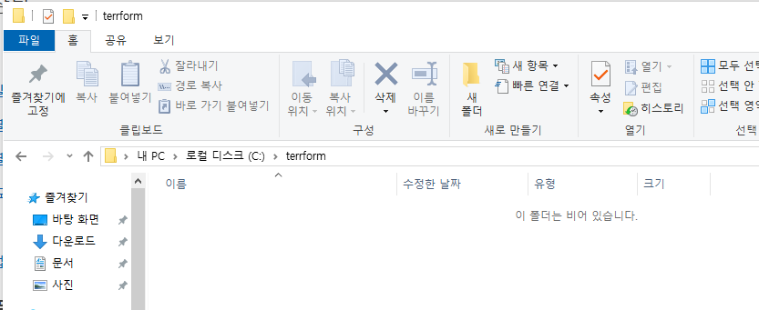

- Terraform 폴더 안에 HCL-01-block 폴더 생성

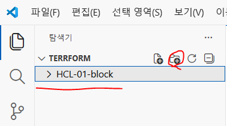

- HCL-01-block 폴더안에 main.tf, outputs,tf, variables.tf 파일 생성

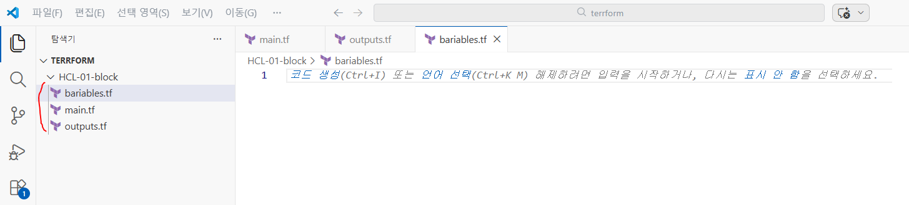

```hcl
variables.tf
variable "filename" {
  description = "파일 이름 변수"
  type        = string
  default     = "test.txt"
}

# main.tf
# local_file     = 로컬 PC에 파일을 생성하는 테라폼 리소스
# ${path.module} = 현재 main.tf 파일의 위치
# var.filename   = variables.tf의 filename을 사용
resource "local_file" "examplefile" {
  # C:/trf/HCL_02_block/test.txt
  filename = "${path.module}/${var.filename}"
  content  = "이것은 첫번째 테라폼 HCL 실습입니다."
}

# outputs.tf
output "file_path" {
  value = local_file.example.filename
}
```

- variables.tf에 filename이라는 변수를 만들고 type은 string이고 입력이 없을시 text.txt가 적용된다.

- main.tf에서 resource를 만드는데 resource 이름은 local_file이고 path.module는 해당 모듈을 경로를 의미한다.

- var.filename은 test.txt를 의미한다. 테라폼 실행시 file_path를 출력하는데
filename = "${path.module}/${var.filename}" 이 값을 출력한다.

```powershell
PS C:\terrform\HCL-01-block> terraform init
Initializing the backend...
Initializing provider plugins...
- Finding latest version of hashicorp/local...
- Installing hashicorp/local v2.7.0...
- Installed hashicorp/local v2.7.0 (signed by HashiCorp)
Terraform has created a lock file .terraform.lock.hcl to record the provider
selections it made above. Include this file in your version control repository
so that Terraform can guarantee to make the same selections by default when
you run "terraform init" in the future.

Terraform has been successfully initialized!

You may now begin working with Terraform. Try running "terraform plan" to see
any changes that are required for your infrastructure. All Terraform commands
should now work.

If you ever set or change modules or backend configuration for Terraform,
rerun this command to reinitialize your working directory. If you forget, other
commands will detect it and remind you to do so if necessary.

PS C:\terrform\HCL-01-block> terraform plan

Terraform used the selected providers to generate the following execution plan. Resource actions are indicated with the
following symbols:
  + create

Terraform will perform the following actions:

  # local_file.example will be created
  + resource "local_file" "example" {
      + content              = "Hello, Terraform world"
      + content_base64sha256 = (known after apply)
      + content_base64sha512 = (known after apply)
      + content_md5          = (known after apply)
      + content_sha1         = (known after apply)
~~~~~~~~~~~~~~~~~~~ 중간 생략 ~~~~~~~~~~~~~~~~~~~
Plan: 1 to add, 0 to change, 0 to destroy.

Changes to Outputs:
  + file_path = "./test.txt"

PS C:\terrform\HCL-01-block> terraform plan

Terraform used the selected providers to generate the following execution plan. Resource actions are indicated with the
following symbols:
  + create

Terraform will perform the following actions:

  # local_file.example will be created
  + resource "local_file" "example" {
      + content              = "Hello, Terraform world"
      + content_base64sha256 = (known after apply)
      + content_base64sha512 = (known after apply)
      + content_md5          = (known after apply)
      + content_sha1         = (known after apply)
~~~~~~~~~~~~~~~~~~~ 중간 생략 ~~~~~~~~~~~~~~~~~~~
Do you want to perform these actions?
  Terraform will perform the actions described above.
  Only 'yes' will be accepted to approve.

  Enter a value: yes

local_file.example: Creating...
local_file.example: Creation complete after 0s [id=ed3aadfcef97002b59247a6949c4b1f47dfdc83c]

Apply complete! Resources: 1 added, 0 changed, 0 destroyed.

Outputs:

file_path = "./test.txt"
```

- test.txt 파일이 생성되고 test.txt 파일안에 Hello, Terraform world 가 확인된다.

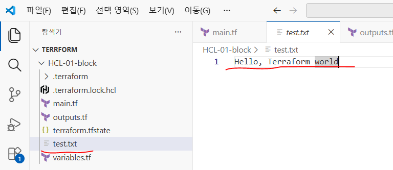

#### 변수를 변경할 때

- terraform.tfvars 파일 생성

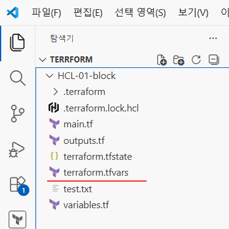

#### terraform.tfvars (파일 생성)

```hcl
filename = "terraform-text-file.txt"

# varials.tf
variable "filename" {
  description = "파일 이름 변수"
  type        = string
  default     = "test.txt"# 파일명이 있기 때문에 default가 적용되지 않는다.
}

PS C:\terrform\HCL-01-block> terraform apply

Terraform used the selected providers to generate the following execution plan. Resource actions are indicated with the
following symbols:
  + create
~~~~~~~~~~~~~~~~~~~ 중간 생략 ~~~~~~~~~~~~~~~~~~~
  # local_file.example must be replaced
```

- /+ resource "local_file" "example" {

```hcl
      ~ content_base64sha256 = "Am2MpNqYX0mYpnPdcHkKyBC2Q06frKlYiEvUhUvv0Y4=" -> (known after apply)
      ~ content_base64sha512 = "bh/ZhMQaTsE7k4YOytvwjO3yCgajTOLbo34E9eD1+IN8cSXTxQNiaCt76uEfD4azmgyB7YH4XKi/jM8u4XAiLA==" -> (known after apply)
      ~ content_md5          = "c950cad8429f0a17f123456789012a6d" -> (known after apply)
      ~ content_sha1         = "ed3aadfcef97002b59247a6949c4b1f47dfdc83c" -> (known after apply)
      ~ content_sha256       = "026d8ca4da985f4998a673dd70790ac810b6434e9faca958884bd4854befd18e" -> (known after apply)
      ~ content_sha512       = "6e1fd984c41a4ec13b93860ecadbf08cedf20a06a34ce2dba37e04f5e0f5f8837c7125d3c50362682b7beae11f0f86b39a0c81ed81f85ca8bf8ccf2ee170222c" -> (known after apply)
      ~ filename             = "./test.txt" -> "./terraform-text-file.txt" # forces replacement
      ~ id                   = "ed3aadfcef97002b59247a6949c4b1f47dfdc83c" -> (known after apply)
        # (3 unchanged attributes hidden)
    }

Plan: 1 to add, 0 to change, 1 to destroy.# 1개가 추가되고 1개가 삭제된다.

Changes to Outputs:
  ~ file_path = "./test.txt" -> "./terraform-text-file.txt"
PS C:\terrform\HCL-01-block> terraform apply

Terraform used the selected providers to generate the following execution plan. Resource actions are indicated with the
following symbols:
  + create

Terraform will perform the following actions:
~~~~~~~~~~~~~~~~~~~ 중간 생략 ~~~~~~~~~~~~~~~~~~~
      ~ filename             = "./test.txt" -> "./terraform-text-file.txt" # forces replacement
      ~ id                   = "ed3aadfcef97002b59247a6949c4b1f47dfdc83c" -> (known after apply)
        # (3 unchanged attributes hidden)
    }

Plan: 1 to add, 0 to change, 1 to destroy.

Changes to Outputs:
  ~ file_path = "./test.txt" -> "./terraform-text-file.txt"

Do you want to perform these actions?
  Terraform will perform the actions described above.
  Only 'yes' will be accepted to approve.

  Enter a value: yes

local_file.example: Destroying... [id=ed3aadfcef97002b59247a6949c4b1f47dfdc83c]
local_file.example: Destruction complete after 0s
local_file.example: Creating...
local_file.example: Creation complete after 0s [id=ed3aadfcef97002b59247a6949c4b1f47dfdc83c]

Apply complete! Resources: 1 added, 0 changed, 1 destroyed.

Outputs:

file_path = "./terraform-text-file.txt"
```

- 기존 text.txt 파일이 삭제되고 terraform-text-file.txt 파일이 생성되어 있다.

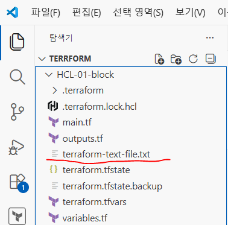

```powershell
PS C:\terrform\HCL-01-block> terraform destroy -auto-approve
local_file.example: Refreshing state... [id=ed3aadfcef97002b59247a6949c4b1f47dfdc83c]

Terraform used the selected providers to generate the following execution plan. Resource actions are indicated with the
following symbols:
  - destroy

Terraform will perform the following actions:
~~~~~~~~~~~~~~~~~~~ 중간 생략 ~~~~~~~~~~~~~~~~~~~
      - directory_permission = "0777" -> null
      - file_permission      = "0777" -> null
      - filename             = "./terraform-text-file.txt" -> null
      - id                   = "ed3aadfcef97002b59247a6949c4b1f47dfdc83c" -> null
    }

Plan: 0 to add, 0 to change, 1 to destroy.

Changes to Outputs:
  - file_path = "./terraform-text-file.txt" -> null
local_file.example: Destroying... [id=ed3aadfcef97002b59247a6949c4b1f47dfdc83c]
local_file.example: Destruction complete after 0s

Destroy complete! Resources: 1 destroyed.
```

#### Terraform 데이터 타입

- Terraform에서는 모든 값(Value)이 특정 데이터 타입(Type)을 가진다.
- Terraform은 선언형 언어이기 때문에 어떻게 만들 것인가보다 어떤 상태를 원하는가를 정의한다.
- 이때 변수나 리소스에 전달되는 값의 타입이 맞아야 Terraform이 정상적으로 동작한다.

- 데이터 타입이 중요한 이유는 다음과 같다.
  - 모든 표현식(Expression)은 값을 반환한다.
  - 모든 값은 특정 타입을 가진다.
  - 타입에 따라 사용할 수 있는 연산과 표현 방식이 달라진다.
  - 잘못된 타입을 사용하면 terraform plan이나 검증 단계에서 오류가 발생할 수 있다.

- 예를 들어,
  - 문자열이 필요한 곳에 잘못된 형태의 값을 넣으면 오류가 발생할 수 있다.
  - list가 필요한 곳에 단일 값을 넣으면 오류가 발생할 수 있다.
  - object에서 필요한 속성이 빠지거나 타입이 맞지 않으면 검증에 실패할 수 있다.

- VPC, EC2, Auto Scaling, RDS, IAM처럼 설정이 복잡해질수록 데이터 타입을 정확히 이해하는 것이 중요하다.

#### Terraform 데이터 타입의 구조

- Terraform 데이터 타입은 크게 다음과 같이 구분할 수 있다.
  - 기본 타입 (Primitive Types)
  - 복합 타입 (Collection / Structural Types)

#### 기본 데이터 타입

- 기본 타입은 하나의 단순한 값을 표현한다.

  - 1) string

- 문자열을 저장하는 타입이다.

- 문자열은 " " 안에 값을 작성한다.
  - "ap-northeast-2"
  - "t3.micro"
  - "production"

- 주요 사용 예:
  - AWS Region
  - EC2 Instance Type
  - VPC CIDR
  - AMI ID
  - Tag 값

- string은 Terraform에서 가장 많이 사용하는 타입 중 하나이다.

  - 2) number

- 숫자를 저장하는 타입이다.

- 정수와 실수를 모두 표현할 수 있다.
  - 10
  - 3.14
  - 3306

- 주요 사용 예:
  - 포트 번호
  - 디스크 용량
  - 인스턴스 개수
  - 서브넷 개수
  - CPU 또는 메모리 관련 숫자 값

- 예를 들어 VPC에서 생성할 서브넷 개수를 변수로 관리할 수 있다.

```hcl
variable "public_subnet_count" {
  type    = number
  default = 2
}

- public_subnet_count는 숫자 값이므로 number 타입을 사용한다.
```

  - 3) bool

- 참 또는 거짓을 표현하는 타입이다.
- 사용할 수 있는 값은 true, false 두 가지이다.
  - enable_monitoring = true
  - public_access = false

- 주요 사용 예
  - 특정 기능 활성화 / 비활성화
  - 리소스 생성 여부
  - 모니터링 활성화 여부
  - Public Access 허용 여부

- bool 타입은 조건문이나 count 같은 조건 기반 설정에서 많이 사용된다.

#### 복합 데이터 타입

- 복합 타입은 여러 개의 값을 하나로 묶어서 관리할 때 사용한다.

  - 1) list(TYPE)

- 동일한 타입의 여러 값을 순서대로 저장하는 타입이다.

- 예: list(string)
- 값: ["ap-northeast-2a", "ap-northeast-2c"]

- 특징:
  - 순서가 있다.
  - 인덱스로 접근할 수 있다.
  - 중복 값을 허용한다.

- 예:

```hcl
availability_zones = [
  "ap-northeast-2a",
  "ap-northeast-2c"
]
```

- VPC에서 여러 가용 영역을 하나의 리스트로 관리할 때 사용할 수 있다.
- 인덱스를 이용하여 특정 값을 가져올 수도 있다.
  - var.availability_zones[0]
  - 첫 번째 값인 ap-northeast-2a를 가져온다.

  - 2) set(TYPE)

- list와 비슷하게 여러 값을 저장하지만 순서를 보장하지 않고 중복을 허용하지 않는다.

- 예: set(string)
- 값 예: ["web", "production"]

- 특징:
  - 순서가 없다.
  - 중복 값을 허용하지 않는다.
  - 값 자체가 중요한 경우 사용한다.

- 고유한 이름 목록이나 중복이 필요 없는 값들을 관리할 때 사용할 수 있다.
  - 3) map(TYPE)

- Key-Value 형태로 값을 저장하는 타입이다.
- 하나의 Key에 하나의 Value가 연결된다.

- 예: map(string)
- 값:  { env  = "prod"  team = "devops" }

- 특징:
  - Key 이름을 이용하여 값에 접근한다.
  - 환경별 설정을 관리하기 편리하다.
  - 여러 설정 값을 이름과 함께 관리할 수 있다.

- 예:

```hcl
instance_type = {
  dev  = "t3.micro"
  prod = "m5.large"
}
```

- 환경에 따라 다른 EC2 Instance Type을 사용할 수 있다.
  - var.instance_type["dev"]
  - 결과 : t3.micro

  - 4) object({ key = type })

- object는 여러 개의 속성을 하나의 구조로 묶어서 관리하는 타입이다.
- map과 달리 각각의 속성에 서로 다른 데이터 타입을 지정할 수 있다.

- 예:

```hcl
object({
  name      = string
  instance_type = string
  disk_size     = number
})
```

- 값:

```hcl
{
  name      = "web-server"
  instance_type= "t3.micro"
  disk_size  = 50
}
```

- 특징:
  - 여러 관련 설정을 하나의 구조로 관리할 수 있다.
  - 각 속성마다 다른 타입을 사용할 수 있다.
  - 구조가 명확하기 때문에 복잡한 설정 관리에 유리하다.

- EC2, RDS, ALB, VPC처럼 여러 설정 값을 하나로 묶어서 관리할 때 유용하다.

  - 5) tuple([TYPE, TYPE, ...])

- tuple은 list와 비슷하지만 각 위치마다 서로 다른 타입을 지정할 수 있다.

- 예: tuple([string, number, bool])
- 값: ["db-server", 3306, true]

- 각 위치의 의미는 다음과 같다.
  - 0번 : string = "db-server"
  - 1번 : number= 3306
  - 2번 : bool   = true

- 특징:
  - 순서가 중요하다.
  - 각 위치별 데이터 타입이 정해져 있다.
  - 서로 다른 타입의 값을 하나의 묶음으로 저장할 수 있다.

- 하지만 각 값의 의미를 이름으로 표현하기 어려워 실무에서는 object가 더 많이 사용되는 경우가 많다.

#### list와 set 차이

list
  - 순서 있음
  - 인덱스 접근 가능
  - 중복 허용

set
  - 순서 없음
  - 인덱스 접근 불가
  - 중복 허용하지 않음
  - map과 object 차이

map
  - Key-Value 구조
  - Value의 타입이 동일함

object
  - 여러 속성을 하나의 구조로 관리
  - 속성마다 서로 다른 타입 사용 가능

#### 실제 변수 선언 예제

- 문자열 변수

```hcl
variable "instance_type" {
  description= "사용할 인스턴스 타입"
  type        = string
  default     = "t3.micro"
}
```

- 이 변수는 EC2, EKS node group, ASG에 그대로 전달 가능하다.

- 숫자 변수

```hcl
variable "file_count" {
  type    = number
  default = 3
}
```

- count와 연결 가능하다.

- bool 변수

```hcl
variable "create_files" {
  type    = bool
  default = true
}
```

- 조건문에서 사용 가능하다.

- list(string) 변수

```hcl
variable "file_names" {
  type = list(string)
}
count.index와 연결 가능하다.
```

- map(string) 변수

```hcl
variable "file_contents" {
  type = map(string)
}
```

- 키 기반 접근 가능하다.

- object 변수

```hcl
variable "server_config" {
  type = object({
    name      = string
    instance_type= string
    disk_size     = number
  })
}
```

- 이렇게 하면 잘못된 구조를 입력하면 plan 단계에서 바로 오류 발생한다.
- 타입 검증을 통해 안정성이 올라간다.

#### 데이터 타입이 코드 품질에 미치는 영향

- 데이터 타입을 명확히 정의하면
  - 코드 자동 검증 가능
  - 실수 방지
  - 협업 시 안정성 증가
  - 유지보수성 향상
  - 모듈 재사용 가능

- 특히 EKS 모듈 설계 시 node group, VPC, IAM 설정을 object 구조로 설계하면
대형 프로젝트에서도 관리가 가능하다.

#### 예시 (EC2)

- 예를 들어 여러 EC2 서버의 설정을 이렇게 만들 수 있다.

```hcl
variable "instances" {
  type = map(object({
    instance_type = string
    disk_size     = number
    monitoring    = bool
  }))
}
```

- 이렇게 하면 여러 노드 그룹을 구조적으로 관리할 수 있다.

#### 변수 실습

```hcl
# variables.tf
# 기본 데이터 변수 (문자열)
variable "instance-type" {
  description = "use instance type"
  type        = string
  default     = "t3.micro"
}

# 기본 데이터 변수 (숫자)
variable "file_count" {
  default    = "생성할 파일 개수"
  type       = number
  deprecated = 3
}

# 기본 데이터 변수 (논리형)
variable "create_file" {
  description = "파일 생성 유/무"
  type        = bool
  default     = false
}

# 복합 데이터 변수 (list, 문자)
variable "file_name" {
  description = "생성할 파일 목록"
  type        = list(string)
  default     = ["web", "db", "api", "web"]
}

# 복합 데이터 변수 (list, 숫자)
variable "score" {
  description = "점수"
  type        = list(number)
  default     = [10, 20, 30, 40, 50]
}

# 복합 데이터 변수 (set, 문자)
variable "set_list" {
  description = "set 목록"
  type        = set(string)
  default     = ["web", "db", "api", "web"]
}

# 복합 데이터 변수 (set, 숫자)
variable "set_lotto" {
  description = "로또 번호"
  type        = set(number)
  default     = [1, 45, 22, 42, 19, 22, 19, 6]
}

# 복합 데이터 변수 (map)
variable "instance_tag" {
  description = "instance tag"
  type        = map(string)
  default = {
    "file1.txt" = "this is file 1",
    "file2.txt" = "this is file 2",
    "file3.txt" = "this is file 3",
    "file4.txt" = "this is file 4"
  }
}

# 복합 데이터 변수 (Object)
variable "server_config" {
  description = "Server Config File"
  type = object({
    name         = string
    instance_type= string
    disk_size     = number
    tag           = map(string)
  })
  default = {
    name          = "web-server"
    instance_type = "t3.micro"
    disk_size     = 8
    tag = {
      "env" = "prod"
    }
  }
}

# 값 가져오기
# var.serve_config["name"]
# var.serve_config["instance_type"]
# var.serve_config["disk_size"]

# tuple 변수
variable "file_detail" {
  description= "파일의 이름, 크기, 생성 여부"
  type        = tuple([string, number, bool])
  default     = ["file1.txt", 20, true]
}

   # main.tf
```

- resource "local_file" "name" {} : Terraform으로 내 로컬 컴퓨터에 파일을 생성하는 리소스

```hcl
resource "local_file" "example" {
  count    = var.create_file ? var.file_count : 0
  filename = "${path.module}/file${count.index + 1}.txt"
  content  = "Hello Terraform ${count.index + 1}"
}

   #　ouput.tf
output "file_path" {
  value = local_file.my_file[*].filename
}

PS C:\terrform\HCL-02-data-type> terraform init

PS C:\terrform\HCL-02-data-type> terraform plan

Terraform used the selected providers to generate the following execution plan. Resource actions are indicated with the following symbols:
  + create

Terraform will perform the following actions:

  # local_file.my_file[0] will be created
  + resource "local_file" "my_file" {
      + content              = "Hello TerraForm 1"
      + content_base64sha256 = (known after apply)
      + content_base64sha512 = (known after apply)
      + content_md5          = (known after apply)
      + content_sha1         = (known after apply)
      + content_sha256       = (known after apply)
      + content_sha512       = (known after apply)
      + directory_permission = "0777"
      + file_permission      = "0777"
      + filename             = "./file1.txt"
      + id                   = (known after apply)
    }
~~~~~~~~~~~~~~ 중간 생략 ~~~~~~~~~~~~~~
Plan: 3 to add, 0 to change, 0 to destroy.

Changes to Outputs:
  + file_path = [
      + "./file1.txt",
      + "./file2.txt",
      + "./file3.txt",
    ]
─────────────────────────────────────────────────────────
Note: You didn't use the -out option to save this plan, so Terraform can't guarantee to take exactly these actions if you run "terraform apply" now.

PS C:\terrform\HCL-02-data-type> terraform apply
local_file.example[1]: Refreshing state... [id=4b12046facfee0eca1fa3d1910c4c5baad3e660f]
local_file.example[0]: Refreshing state... [id=c6e077a4ccaf1a7f3a709f164f6973afa86b168b]
local_file.example[2]: Refreshing state... [id=48e898a73eb526daf9f900462bc95a874cf3c051]

Terraform used the selected providers to generate the following execution plan. Resource actions are indicated with the
following symbols:
  + create
Terraform will perform the following actions:
~~~~~~~~~~~~~~~~~~ 중간 생략 ~~~~~~~~~~~~~~~~~~
  # local_file.example[2] will be created
  + resource "local_file" "example" {
      + content              = "Hello Terraform 3"
      + content_base64sha256 = (known after apply)
      + content_base64sha512 = (known after apply)
      + content_md5          = (known after apply)
      + content_sha1         = (known after apply)
      + content_sha256       = (known after apply)
      + content_sha512       = (known after apply)
      + directory_permission = "0777"
      + file_permission      = "0777"
      + filename             = "./file3.txt"
      + id                   = (known after apply)
    }
Plan: 3 to add, 0 to change, 0 to destroy.

Do you want to perform these actions?
  Terraform will perform the actions described above.
  Only 'yes' will be accepted to approve.

  Enter a value: yes

local_file.example[2]: Creating...
local_file.example[0]: Creating...
local_file.example[1]: Creating...
local_file.example[2]: Creation complete after 0s [id=d58ee4c45f7554bee97749269dc6e1012da9b129]
local_file.example[0]: Creation complete after 0s [id=a08859acde39c44859eb1a04345289af8637ab46]
local_file.example[1]: Creation complete after 0s [id=9f208f64a66e0644684e1cf62f50636715ceeca0]

Apply complete! Resources: 3 added, 0 changed, 0 destroyed.
```

- file1, file2, file3이 생성되고 파일안에 값이 확인된다.

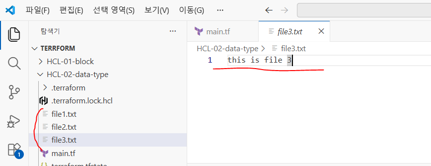

```hcl
# main.tf
resource "local_file" "example" {
  count = var.create_file ? var.file_count : 0
  # filename = var.file_name[0]
  # filename = "${path.module}/file${count.index + 1}.txt"
  #  content  = "Hello Terraform ${count.index + 1}"
  filename = var.file_name[count.index]
  content  = var.file_contents[var.file_name[count.index]]
}

PS C:\terrform\HCL-02-data-type> terraform plan
local_file.example[0]: Refreshing state... [id=a08859acde39c44859eb1a04345289af8637ab46]
local_file.example[1]: Refreshing state... [id=9f208f64a66e0644684e1cf62f50636715ceeca0]
local_file.example[2]: Refreshing state... [id=d58ee4c45f7554bee97749269dc6e1012da9b129]

Terraform used the selected providers to generate the following execution plan. Resource actions are indicated with the
following symbols:
```

- /+ destroy and then create replacement

Terraform will perform the following actions:
~~~~~~~~~~~~~~~~~~ 중간 생략 ~~~~~~~~~~~~~~~~~~
  - local_file.example[2] must be replaced
- /+ resource "local_file" "example" {

```
      ~ content              = "Hello Terraform 3" -> "this is file 3" # forces replacement
      ~ content_base64sha256 = "bmt4FXaEd6gEEs7mIttGqgCLormYT82uISVCvMWj8vs=" -> (known after apply)
      ~ content_base64sha512 = "wU+otQ1loUsKbfCwhMkgLP9EPubith8feiAPU92V9NvJ3kWGCv9+M/pZ9F/0MbEpww01dKGbYgJ69Z2jf7WZDA==" -> (known after apply)
      ~ content_md5          = "0bcbd0649a2cf5726aa4cafea13d9fa5" -> (known after apply)
      ~ content_sha1         = "d58ee4c45f7554bee97749269dc6e1012da9b129" -> (known after apply)
      ~ content_sha256       = "6e6b7815768477a80412cee622db46aa008ba2b9984fcdae212542bcc5a3f2fb" ->

Plan: 3 to add, 0 to change, 3 to destroy.# 3개 생성 , 3개 삭제

────────────────────────────────────────────────────────

Note: You didn't use the -out option to save this plan, so Terraform can't guarantee to take exactly these actions if
you run "terraform apply" now.

PS C:\terrform\HCL-02-data-type> terraform apply
local_file.example[2]: Refreshing state... [id=d58ee4c45f7554bee97749269dc6e1012da9b129]
local_file.example[0]: Refreshing state... [id=a08859acde39c44859eb1a04345289af8637ab46]
local_file.example[1]: Refreshing state... [id=9f208f64a66e0644684e1cf62f50636715ceeca0]

Terraform used the selected providers to generate the following execution plan. Resource actions are indicated with the
following symbols:
```

- /+ destroy and then create replacement
~~~~~~~~~~~~~~~~~~ 중간 생략 ~~~~~~~~~~~~~~~~~~
Plan: 3 to add, 0 to change, 3 to destroy.

Do you want to perform these actions?
Terraform will perform the actions described above.
Only 'yes' will be accepted to approve.

Enter a value: yes

```
local_file.example[0]: Destroying... [id=a08859acde39c44859eb1a04345289af8637ab46]
local_file.example[2]: Destroying... [id=d58ee4c45f7554bee97749269dc6e1012da9b129]
local_file.example[1]: Destroying... [id=9f208f64a66e0644684e1cf62f50636715ceeca0]
local_file.example[2]: Destruction complete after 0s
local_file.example[0]: Destruction complete after 0s
local_file.example[1]: Destruction complete after 0s
local_file.example[1]: Creating...
local_file.example[0]: Creating...
local_file.example[2]: Creating...
local_file.example[1]: Creation complete after 0s [id=4b12046facfee0eca1fa3d1910c4c5baad3e660f]
local_file.example[0]: Creation complete after 0s [id=c6e077a4ccaf1a7f3a709f164f6973afa86b168b]
local_file.example[2]: Creation complete after 0s [id=48e898a73eb526daf9f900462bc95a874cf3c051]

Apply complete! Resources: 3 added, 0 changed, 3 destroyed.
```

- file1, file2, file3이 생성되고 파일안에 값이 확인된다.


```hcl
# variables.tf
# 기본 데이터 변수
# 문자열 변수
variable "instance_type" {
  description = "use instance type"
  type        = string
  default     = "t3.micro"
}

# 숫자 변수
variable "file_count" {
  description = "생성할 파일 개수"
  type        = number
  default     = 3
}

# boolean 변수
variable "create_file" {
  description = "파일 생성 여부"
  type        = bool
  default     = false
}
~~~~~~~~~~~~~~~~~~ 중간 생략 ~~~~~~~~~~~~~~~~~~

PS C:\terrform\HCL-02-data-type> terraform plan
~~~~~~~~~~~~~~~~~~ 중간 생략 ~~~~~~~~~~~~~~~~~
  # local_file.example[2] will be destroyed
  # (because index [2] is out of range for count)
  - resource "local_file" "example" {
      - content              = "this is file 3" -> null
      - content_base64sha256 = "SJxtRGMBhUg5z5fu/O+peJs5cA3lgBskUJw3RDj77PM=" -> null
      - content_base64sha512 = "P+PojtfQR+dDNUASd1Dywa4ZB3Wl0x7FONF1U3Y5NSA6aM/tTgb9G/dmhciMygeXvd5O6N8D8UTnSw6uxhHWZw==" -> null
      - content_md5          = "51d56a38185b0135590662284982492c" -> null
      - content_sha1         = "48e898a73eb526daf9f900462bc95a874cf3c051" -> null
      - content_sha256       = "489c6d123456789012cf97eefcefa9789b39700de5801b24509c374438fbecf3" -> null
      - content_sha512       = "3fe3e88ed7d047e7433540127750f2c1ae190775a5d31ec538d17553763935203a68cfed4e06fd1bf76685c88cca0797bdde4ee8df03f144e74b0eaec611d667" -> null
      - directory_permission = "0777" -> null
      - file_permission      = "0777" -> null
      - filename             = "file3.txt" -> null
      - id                   = "48e898a73eb526daf9f900462bc95a874cf3c051" -> null
    }

Plan: 0 to add, 0 to change, 3 to destroy.

PS C:\terrform\HCL-02-data-type> terraform apply
local_file.example[0]: Refreshing state... [id=c6e077a4ccaf1a7f3a709f164f6973afa86b168b]
local_file.example[1]: Refreshing state... [id=4b12046facfee0eca1fa3d1910c4c5baad3e660f]
local_file.example[2]: Refreshing state... [id=48e898a73eb526daf9f900462bc95a874cf3c051]

Terraform used the selected providers to generate the following execution plan. Resource actions are indicated with the
following symbols:
  - destroy

Terraform will perform the following actions:

~~~~~~~~~~~~~~~~~~ 중간 생략 ~~~~~~~~~~~~~~~~~
      - content_md5          = "51d56a38185b0135590662284982492c" -> null
      - content_sha1         = "48e898a73eb526daf9f900462bc95a874cf3c051" -> null
      - content_sha256       = "489c6d123456789012cf97eefcefa9789b39700de5801b24509c374438fbecf3" -> null
      - content_sha512       = "3fe3e88ed7d047e7433540127750f2c1ae19077503f144e74b0eaec611d667" -> null
      - directory_permission = "0777" -> null
      - file_permission      = "0777" -> null
      - filename             = "file3.txt" -> null
      - id                   = "48e898a73eb526daf9f900462bc95a874cf3c051" -> null
    }

Plan: 0 to add, 0 to change, 3 to destroy.

Do you want to perform these actions?
  Terraform will perform the actions described above.
  Only 'yes' will be accepted to approve.

  Enter a value: yes

local_file.example[0]: Destroying... [id=c6e077a4ccaf1a7f3a709f164f6973afa86b168b]
local_file.example[1]: Destroying... [id=4b12046facfee0eca1fa3d1910c4c5baad3e660f]
local_file.example[2]: Destroying... [id=48e898a73eb526daf9f900462bc95a874cf3c051]
local_file.example[1]: Destruction complete after 0s
local_file.example[2]: Destruction complete after 0s
local_file.example[0]: Destruction complete after 0s

Apply complete! Resources: 0 added, 0 changed, 3 destroyed.
```

- file1, file2, file3이 모두 삭제되어 확인되지 않는다.

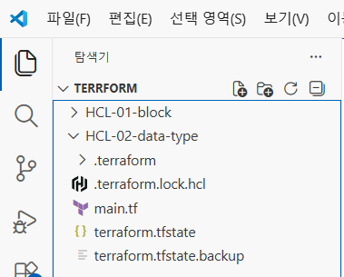

#### output.tf 출력

```hcl
# variables.tf
~~~~~~~~~~~~~~~~~~ 중간 생략 ~~~~~~~~~~~~~~~~~
# boolean 변수
variable "create_file" {
  description = "파일 생성 여부"
  type        = bool
  default     = true
}
~~~~~~~~~~~~~~~~~~ 중간 생략 ~~~~~~~~~~~~~~~~~
resource "local_file" "example" {
  count    = var.create_file ? var.file_count : 0
# tuple 변수
variable "file_detail" {
  description = "파일의 이름, 크기, 생성 여부"
  type        = tuple([string, number, bool])
  default     = ["file1.txt", 20, true]
}

   # outputstf
# 출력 : 생성된 파일 경로와 튜플 변수 출력
output "file_path" {
  value = local_file.example[*].filename# 생성되는 파일 이름 출력
}

output "file_detail" {
  value = var.file_detail# 튜플값이 없기 때문에 default 값이 출력된다.
}

PS C:\terrform\HCL-02-data-type> terraform plan
~~~~~~~~~~~~~~~~~~ 중간 생략 ~~~~~~~~~~~~~~~~~

Plan: 3 to add, 0 to change, 0 to destroy.

Changes to Outputs:
  + file_detail = [
      + "file1.txt",
      + 20,
      + true,
    ]
  + file_path   = [
      + "file1.txt",
      + "file2.txt",
      + "file3.txt",
    ]

PS C:\terrform\HCL-02-data-type> terraform apply

~~~~~~~~~~~~~~~~~~ 중간 생략 ~~~~~~~~~~~~~~~~~

Apply complete! Resources: 3 added, 0 changed, 0 destroyed.

Outputs:

file_detail = [
  "file1.txt",
  20,
  true,
]
file_path = [
  "file1.txt",
  "file2.txt",
  "file3.txt",
]
```

- terraform destroy -auto-approve는 Terraform이 관리 중인 리소스를 삭제하면서 확인 질문을 생략하는 명령어

```powershell
PS C:\terrform\HCL-02-data-type> terraform destroy -auto-approve
local_file.example[0]: Refreshing state... [id=c6e077a4ccaf1a7f3a709f164f6973afa86b168b]
local_file.example[2]: Refreshing state... [id=48e898a73eb526daf9f900462bc95a874cf3c051]
local_file.example[1]: Refreshing state... [id=4b12046facfee0eca1fa3d1910c4c5baad3e660f]

~~~~~~~~~~~~~~~~~~ 중간 생략 ~~~~~~~~~~~~~~~~~

Changes to Outputs:
  - file_detail = [
      - "file1.txt",
      - 20,
      - true,
    ] -> null
  - file_path   = [
      - "file1.txt",
      - "file2.txt",
      - "file3.txt",
    ] -> null
local_file.example[1]: Destroying... [id=4b12046facfee0eca1fa3d1910c4c5baad3e660f]
local_file.example[0]: Destroying... [id=c6e077a4ccaf1a7f3a709f164f6973afa86b168b]
local_file.example[2]: Destroying... [id=48e898a73eb526daf9f900462bc95a874cf3c051]
local_file.example[0]: Destruction complete after 0s
local_file.example[1]: Destruction complete after 0s
local_file.example[2]: Destruction complete after 0s

Destroy complete! Resources: 3 destroyed.
```

#### Terraform 명령어

- Terraform CLI 명령어는 단순히 실행 순서가 있는 도구가 아니다.
- 각 명령어는 Terraform의 내부 동작 단계와 정확히 대응한다.

#### Terraform은 기본적으로 다음 4단계를 가진다.

```
1) 초기화 (Initialization)
2) 계획 수립 (Planning)
3) 적용 (Apply)
4) 상태 관리 (State Management)
```

#### 1) terraform init

- 프로젝트를 Terraform 환경으로 초기화한다.
- 이 명령어는 반드시 가장 먼저 실행해야 한다.

- 내부적으로 일어나는 일
  - 1 terraform 블록을 읽는다.
  - 2 required_providers를 확인한다.
  - 3 해당 프로바이더 플러그인을 다운로드한다.
  - 4 backend가 있다면 상태 저장 위치를 초기화한다.
  - 6 .terraform 디렉토리를 생성한다.
  - 7 .terraform.lock.hcl 파일을 생성한다.
  - 즉, init은 환경 준비 단계다.

```powershell
PS C:\terrform> terraform init
```

- 팀 프로젝트에서 provider 버전이 맞지 않으면 반드시 다시 init 해야한다.
- backend를 변경하면 -reconfigure 옵션 사용
- 모듈 구조 변경 시에도 init 재실행 필요

#### 2) terraform plan

- 코드가 실제 인프라에 어떤 영향을 줄지 미리 계산한다.

- Terraform의 가장 중요한 안전장치다.

- 내부 동작
  - 1 현재 tfstate 파일을 읽는다.
  - 2 코드(.tf 파일)를 읽는다.
  - 3 현재 상태와 코드의 차이를 계산한다.
  - 4 실행 계획을 출력한다.

- 출력 결과 예
  - create
  - ~ modify
  - destroy

```powershell
PS C:\terrform> terraform plan
```

- 실수로 리소스를 삭제하는 것을 방지
- 변경 사항을 팀과 공유 가능
- CI/CD에서 plan 단계는 필수

- 실무에서는 plan 없이 apply 금지가 기본 원칙이다.

#### 3) terraform apply

- plan에서 계산된 변경 사항을 실제 인프라에 적용한다.

- 내부 동작
  - 1 plan을 다시 계산
  - 2 사용자 확인 요청
  - 3 클라우드 API 호출
  - 4 상태 파일 업데이트

```powershell
PS C:\terrform> terraform apply
PS C:\terrform> terraform apply -auto-approve# 자동 승인
```

- 자동 승인 (CI/CD에서는 auto-approve 사용)
- 사람이 직접 운영 환경에 적용할 때는 확인 필수
- apply 이후 tfstate가 반드시 최신 상태로 업데이트됨

#### 4) terraform destroy

- 현재 상태 파일에 정의된 모든 리소스를 삭제한다.

```powershell
PS C:\terrform> terraform destroy
PS C:\terrform> terraform destroy -auto-approve# 자동 승인
실무 관점
```

- 테스트 환경 정리
- 비용 절감 목적
- 운영 환경에서는 매우 신중하게 사용
- destroy는 삭제 엔진이다.

#### 5) terraform show

- 현재 상태 파일(tfstate)의 내용을 출력한다.

```powershell
PS C:\terrform> terraform show
```

- 언제 쓰는가
  - 실제 리소스 속성 확인
  - state 내부 값 디버깅
  - JSON 형태로 출력하여 자동화에 활용 가능
  - terraform show -json

#### 6) terraform output

- output 블록에 정의된 값만 출력한다.

```powershell
PS C:\terrform> terraform output
PS C:\terrform> terraform output instance_ip
```

- EC2 public IP 확인
- EKS endpoint 확인
- RDS endpoint 확인
- 다른 시스템으로 값 전달
- CI/CD 파이프라인에서 매우 중요하다.

#### 7) terraform validate

- 코드 문법과 내부 구조가 올바른지 검사한다.

```powershell
PS C:\terrform> terraform validate
```

- 특징
  - 클라우드 API 호출하지 않음
  - 문법 오류 검출
  - 타입 오류 검출
  - CI 파이프라인에서 필수 단계다.

#### 8) terraform fmt

- 코드를 자동 정렬한다.

```powershell
PS C:\terrform> terraform fmt
```

- 기능
  - 들여쓰기 정리
  - 공백 정리
  - 일관된 코드 스타일 유지
  - 팀 프로젝트에서 매우 중요하다.

  - 9) terraform state

- tfstate 파일을 직접 조작하는 명령어

- 주요 서브 명령어
  - terraform state list
  - terraform state show aws_instance.example
  - terraform state rm aws_instance.example

- 리소스가 꼬였을 때
- 수동 삭제 후 state 정리
- 모듈 구조 변경 시
- state는 고급 기능이므로 초보자는 함부로 사용하면 안 된다.

#### 10) terraform import

- 이미 존재하는 리소스를 Terraform 관리 대상으로 가져온다.

```powershell
PS C:\terrform> terraform import aws_instance.example i-1234567890abcdef0
```

- 기존 운영 EC2를 코드화
- 수동 생성 리소스를 IaC에 편입

- import는 코드 자동 생성이 아니라 state에만 등록한다.

#### 11) terraform refresh

- 실제 클라우드 상태를 읽어서 tfstate를 최신 상태로 업데이트한다.

```powershell
PS C:\terrform> terraform refresh
```

- Terraform 1.0 이후에는 refresh는 plan 내부 동작에 포함되었다.
- 단독 사용은 점점 줄어드는 추세다.

#### Terraform 명령어 실습

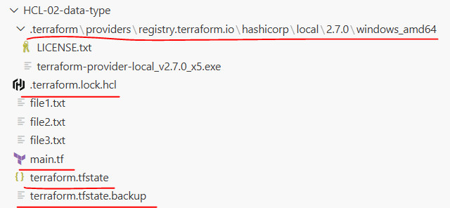

```powershell
PS C:\terrform\HCL-02-data-type> terraform apply

# HCL-02-data-type 폴더 구조 설명

# terraform 폴더

- .terraform\providers\registry.terraform.io\hashicorp\local\2.7.0\windows_amd64
- Terraform이 terraform init 할 때 다운로드한 프로바이더 파일 저장소
```

- 안에 있는 파일
  - terraform-provider-local_v2.7.0_x5.exe
  - local_file 리소스를 동작시키는 실제 실행 파일이다.
  - Terraform이 이 파일을 통해 파일을 생성한다.

- local_file 리소스를 쓰면 local provider가 필요하고 init 할 때 여기 다운로드된다.

```
# terraform.lock.hcl
```

- 프로바이더 버전 잠금 파일

- 역할
  - 어떤 provider 버전을 쓸지 기록
  - 팀원 간 동일 버전 보장
  - 재현 가능한 환경 유지

- 예:
  - local = 2.7.0
  - 다음에 init해도 동일 버전 사용하게 만든다.

```
# main.tf
```

- Terraform 코드 파일
- 여기에 리소스, 변수, 출력 등이 정의되어 있다.
- 이게 원하는 상태(Desired State)다.

#### terraform.tfstate

- 이 파일이 Terraform의 기억이다.

- 여기에 저장되는 것:
  - local_file.example[0]
  - local_file.example[1]
  - local_file.example[2]
  - 각 파일의 ID (sha1 값)
  - 현재 상태 정보

- Terraform은 이 파일을 기준으로 다음 apply에서 무엇을 바꿀지 결정한다.

#### terraform.tfstate.backup

- tfstate 백업 파일이다.

- apply 할 때마다 이전 상태를 자동으로 백업해둔다.

- 혹시 state 깨지면 복구용이다.

- terraform.tfstate

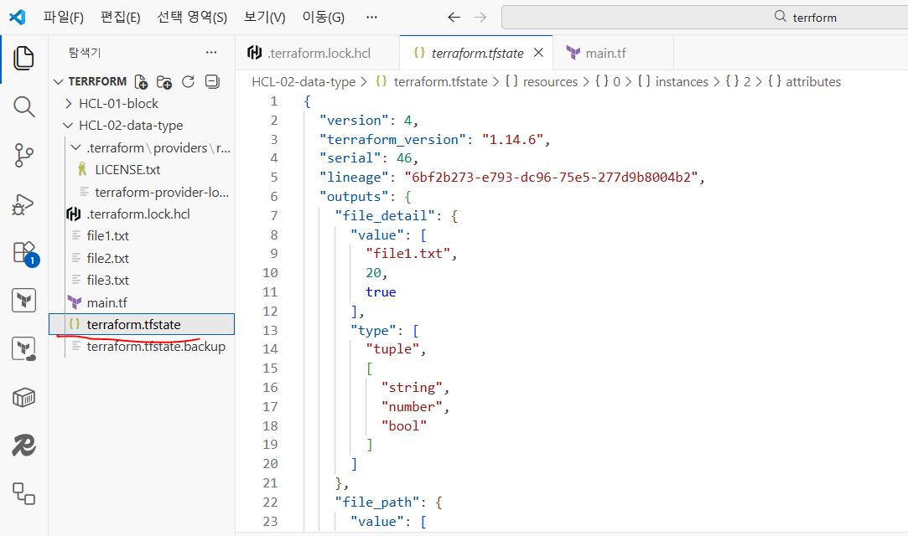

```powershell
PS C:\terrform\HCL-02-data-type> terraform show# terraform.tfstate와 같은 정보이다. (보여지는 방식은 다르다.)
~~~~~~~~~~~~ 중간 생략 ~~~~~~~~~~~~
Outputs:

file_detail = [
    "file1.txt",
    20,
    true,
]
file_path = [
    "file1.txt",
    "file2.txt",
    "file3.txt",
]

# 특정 리소스를 타겟해서 실행할 수 있다.
PS C:\terrform\HCL-02-data-type> terraform destroy -target local_file.example[1]
local_file.example[1]: Refreshing state... [id=4b12046facfee0eca1fa3d1910c4c5baad3e660f]

Terraform used the selected providers to generate the following execution plan. Resource actions are indicated with the following
symbols:
  - destroy

Terraform will perform the following actions:
~~~~~~~~~~~~ 중간 생략 ~~~~~~~~~~~~
Plan: 0 to add, 0 to change, 1 to destroy.
╷
│ Warning: Resource targeting is in effect
│
│ Note that the -target option is not suitable for routine use, and is provided only for exceptional situations such as recovering
│ from errors or mistakes, or when Terraform specifically suggests to use it as part of an error message.
╵

Destroy complete! Resources: 1 destroyed.
```

- file2.txt 파일이 삭제된다.

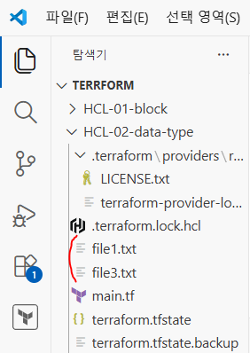

```powershell
PS C:\terrform\HCL-02-data-type> terraform apply -target local_file.example[1]

Terraform used the selected providers to generate the following execution plan. Resource actions are indicated with the following
symbols:
  + create

Terraform will perform the following actions:

  # local_file.example[1] will be created
  + resource "local_file" "example" {
      + content              = "this is file 2"
      + content_base64sha256 = (known after apply)
      + content_base64sha512 = (known after apply)
      + content_md5          = (known after apply)
      + content_sha1         = (known after apply)
      + content_sha256       = (known after apply)
      + content_sha512       = (known after apply)
      + directory_permission = "0777"
      + file_permission      = "0777"
      + filename             = "file2.txt"
      + id                   = (known after apply)
    }

Plan: 1 to add, 0 to change, 0 to destroy.
~~~~~~~~~~~~ 중간 생략 ~~~~~~~~~~~~
Apply complete! Resources: 1 added, 0 changed, 0 destroyed.

Outputs:

file_detail = [
  "file1.txt",
  20,
  true,
]
file_path = [
  "file1.txt",
  "file2.txt",
  "file3.txt",
]
```

- file2.txt 파일이 생성된다.

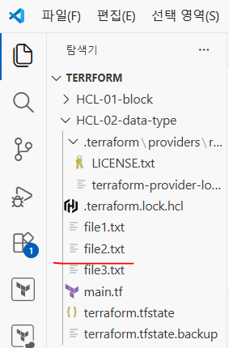

```powershell
PS C:\terrform\HCL-02-data-type> terraform  --help# 여러 가지 명령어를 사용할 수 있다.
~~~~~~~~~~~~ 중간 생략 ~~~~~~~~~~~~
Main commands:
  init          Prepare your working directory for other commands
  validate      Check whether the configuration is valid
  plan          Show changes required by the current configuration
  apply         Create or update infrastructure
  destroy       Destroy previously-created infrastructure
~~~~~~~~~~~~ 중간 생략 ~~~~~~~~~~~~
  version       Show the current Terraform version
  workspace     Workspace management

Global options (use these before the subcommand, if any):
```

- chdir=DIR    Switch to a different working directory before executing the
given subcommand.
- help         Show this help output or the help for a specified subcommand.
- version      An alias for the "version" subcommand.

```hcl
   # main.tf
# resource "local_file" "myfile" {
#   count = var.create_file ? var.file_count : 0
#   # ./file1.txt = Hello Terraform 1th
#   # ./file2.txt = Hello Terraform 2th
#   # ./file3.txt = Hello Terraform 3th
#   filename = "${path.module}/file${count.index + 1}.txt"
#   content  = "Hello Terraform ${count.index + 1}th"
# }

terraform {
  required_providers {
    aws = {
      source  = "hashicorp/aws"
      version = "~> 6.0"
    }
  }
}

provider "aws" {
  region  = "ap-northeast-2"
  profile = var.profile
}

# 최신 Amazon Linux 2023 AMI 조회
data "aws_ami" "al2023" {
  most_recent = true
  owners      = ["amazon"]

  filter {
    name   = "name"
    values = ["al2023-ami-2023*x86_64"]
  }

  filter {
    name   = "architecture"
    values = ["x86_64"]
  }
}

resource "aws_instance" "my-ec2" {
  ami           = data.aws_ami.al2023.id
  instance_type = var.instance-type
  # tags = {
  #   Name = var.my-ec2-tag# 단일 태그
  # }

  tags = var.my-map-ec2-tag# 여러개 태그
}

   # variables.tf
~~~~~~~~~ 중간 생략(기존 변수 타입에 이서어) ~~~~~~~~~
variable "my-ec2-tag" {# 단일 태그
  description = "my-ec2-tag"
  type        = string
  default     = "terraform-ec2"
}

variable "my-map-ec2-tag" {# 여러개 태그
  description = "my-map-ec2-tag"
  type        = map(string)
  default = {
    Name      = "terraform-ec2"
    Env       = "dev"
    ManagedBy = "terraform"
  }
}

   # output.tf
# output "file_print" {
#   value = local_file.myfile[*].filename
# }

output "instance_id" {
  description = "my-ec2-intance-id"
  value       = aws_instance.my-ec2.id
}

output "instance_public_ip" {
  description = "my-ec2-intance-public-ip"
  value       = aws_instance.my-ec2.public_ip
}

output "instance_private_ip" {
  description = "my-ec2-intance-private-ip"
  value       = aws_instance.my-ec2.private_ip
}

output "instance_public_dns" {
  description = "my-ec2-intance-public-dns"
  value       = aws_instance.my-ec2.public_dns
}

PS C:\trf\HCL_03_variables> terraform  plan

PS C:\trf\HCL_03_variables> terraform  apply
~~~~~~~~~~~~~~~~~~ 중간 생략 ~~~~~~~~~~~~~~~~~~
  Enter a value: yes

aws_instance.my-ec2: Creating...
aws_instance.my-ec2: Still creating... [00m10s elapsed]
aws_instance.my-ec2: Creation complete after 13s [id=i-0731669fef59ba169]

Apply complete! Resources: 1 added, 0 changed, 0 destroyed.

Outputs:

instance_id = "i-0731669fef59ba169"
instance_private_ip = "172.31.35.48"
instance_public_dns = "ec2-3-35-9-167.ap-northeast-2.compute.amazonaws.com"
instance_public_ip = "3.35.9.167"
```

#### import 실습

- 콘솔에서 EC2 인스턴스 생성
- 인스턴스 ID 복사

- AWS 콘솔을 사용해서 EC2 1개 생성

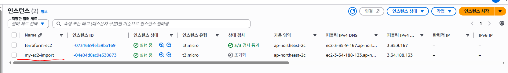

```hcl
   # main.tf
~~~~~~~~~~~~~~~~~~ 중간 생략 ~~~~~~~~~~~~~~~~~~
resource "aws_instance" "my-ec2" {
  ami           = data.aws_ami.al2023.id
  instance_type = var.instance-type
  # tags = {
  #   Name = var.my-ec2-tag
  # }

  tags = var.my-map-ec2-tag
}

resource "aws_instance" "my-ec2-import" {
  ami           = "al2023-ami-2023.12.20260914.0-kernel-6.18-x86_64"
  instance_type = "t3.micro"

  tags = {
    Name = "my-ec2-import"
  }
}

PS C:\trf\HCL_03_variables> terraform  import  aws_instance.my-ec2-import  i-04e04d0ac9e530873
aws_instance.my-ec2-import: Importing from ID "i-04e04d0ac9e530873"...
data.aws_ami.al2023: Reading...
aws_instance.my-ec2-import: Import prepared!
  Prepared aws_instance for import
aws_instance.my-ec2-import: Refreshing state... [id=i-04e04d0ac9e530873]
data.aws_ami.al2023: Read complete after 1s [id=ami-0c97793ee5ea0967f]

Import successful!

The resources that were imported are shown above. These resources are now in
your Terraform state and will henceforth be managed by Terraform.
```

- 현재 State 전체 내용을 사람이 읽기 쉬운 형태로 출력

```powershell
PS C:\trf\HCL_03_variables> terraform  state  list
data.aws_ami.al2023
aws_instance.my-ec2
aws_instance.my-ec2-import
```

- 특정 리소스의 상세 정보 확인 (AMI, 인스턴스 타입, 서브넷, 보안 그룹, IP, 태그 등을 확인 가능)

```powershell
PS C:\trf\HCL_03_variables> terraform  state  show  aws_instance.my-ec2-import
```

- 현재 State 전체 내용을 사람이 읽기 쉬운 형태로 출력

```powershell
PS C:\trf\HCL-01-block> terraform show

# EC2 인스턴스 삭제

PS C:\trf\HCL-01-block> terraform  destroy

#　EC2 1개만 삭제도 가능하다.
PS C:\trf\HCL_03_variables> terraform destroy -target="aws_instance.my-ec2-import"
```

#### Terraform 흐름 제어 (Flow Control)

- Terraform은 선언형 언어이지만 조건에 따라 리소스를 생성하거나 값을 동적으로 변경할 수 있다.
즉, 코드의 흐름을 완전히 바꾸는 것은 아니지만 조건에 따라 결과를 다르게 만드는 기능을 제공한다.

- 이 기능을 통해
  - 특정 환경에서만 리소스를 생성
  - 조건에 따라 속성값 변경
  - 불필요한 속성 제거
  - 반복과 결합하여 동적 리소스 생성이 가능하다.

- Terraform에서 흐름 제어가 필요한 이유
  - 운영(prod) 환경과 개발(dev) 환경의 구성이 다를 수 있다.
  - 특정 기능을 켜고 끌 수 있어야 한다.
  - 옵션 값이 있을 때만 속성을 적용해야 한다.
  - 비용 절감을 위해 조건부 리소스 생성이 필요하다.

#### 조건 표현식 (삼항 연산자)

- Terraform의 조건 표현식은 C, Java와 동일한 삼항 연산자 형태를 사용한다.

문법 : condition ? true_value : false_value

- 구성 요소
  - condition: true 또는 false로 평가되는 조건
  - true_value: 조건이 참일 때 반환되는 값
  - false_value: 조건이 거짓일 때 반환되는 값

예제 1. 변수 값 제어하기
  - enable_monitoring 값이 true이면 EC2 인스턴스 모니터링 활성화 false이면 비활성화

변수 정의

```hcl
variable "enable_monitoring" {
  description = "EC2 모니터링 활성화 여부"
  type        = bool
  default     = true
}
리소스 정의
resource "aws_instance" "example" {
  ami           = "ami-xxxxxxxx"
  instance_type = "t3.micro"

  monitoring = var.enable_monitoring ? true : false
}
```

- 코드 설명
  - var.enable_monitoring이 true이면 monitoring = true
  - false이면 monitoring = false
  - 즉, 조건에 따라 속성값이 달라진다.

예제 2. 동적 값 할당 (locals 활용)
  - 운영 환경에서는 큰 인스턴스
  - 개발 환경에서는 작은 인스턴스 사용

변수 정의

```hcl
variable "environment" {
  description = "환경 설정 (dev 또는 prod)"
  type        = string
  default     = "dev"
}

locals 블록
locals {
  instance_type = var.environment == "prod" ? "m5.large" : "t3.micro"
}

리소스에서 사용
resource "aws_instance" "example" {
  ami           = "ami-xxxxxxxx"
  instance_type = local.instance_type
}
```

- 설명
  - environment가 "prod"이면 m5.large 사용
  - 그렇지 않으면 t3.micro 사용

- 환경에 따라 동적으로 리소스 구성이 변경된다.

#### 조건과 리소스 생성 제어 (count 활용)

- 조건이 true일 때만 리소스를 생성하고 싶을 경우 count를 사용한다.

예제 3. S3 버킷 조건부 생성

```hcl
variable "create_bucket" {
  type    = bool
  default = false
}

resource "aws_s3_bucket" "example" {
  count  = var.create_bucket ? 1 : 0
  bucket = "my-example-bucket"
  acl    = "private"
}
```

- 설명
  - create_bucket이 true이면 count = 1 (리소스 생성)
  - create_bucket이 false이면 count = 0 (리소스 생성 안 됨)
  - 이 방식은 실무에서 매우 자주 사용된다.

#### null 값과 조건 표현식

- Terraform에서 null은 “”dhk값 없음을 의미한다.

- 속성에 null을 지정하면 Terraform은 해당 속성을 무시한다.

```hcl
variable "name" {
  type    = string
  default = ""
}
```

- 이건 name 변수에 값은 있지만 길이가 0인 문자열을 의미

- value = null
  - 값이 없음, Terraform에서 "설정 안 함"과 같은 의미

예제 4. user_data 조건 적용

```hcl
variable "custom_user_data" {
  type    = string
  default = ""
}
resource "aws_instance" "example" {
  ami           = "ami-xxxxxxxx"
  instance_type = "t3.micro"

  user_data = var.custom_user_data != "" ? var.custom_user_data : null
}
```

- 설명
  - custom_user_data 값이 존재하면 해당 값을 user_data에 적용
  - 값이 없으면 null 설정 (user_data 속성 자체를 무시)
  - 이 방식은 선택 옵션 처리에 매우 유용하다.

#### count vs for_each와 조건 결합

- 조건문은 반복문과 함께 사용할 수 있다.

```hcl
resource "aws_instance" "example" {
  for_each = var.environment == "prod" ? toset(["a","b"]) : toset(["a"])

  ami           = "ami-xxxxxxxx"
  instance_type = "t3.micro"
}
```

- prod 환경이면 EC2 인스턴스를 2개 생성
- 그 외에는 EC2 인스턴스를 1개 생성

- 환경 분리 (dev / stage / prod)
- 옵션 기능 ON/OFF
- 선택적 속성 적용
- 비용 제어용 리소스 조건 생성

#### flow controll 실습

- HCL-03-flow controll 폴더 생성
- HCL-03-flow controll 폴더 안에 main.tf 파일 생성

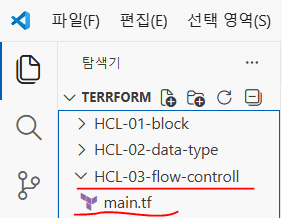

```powershell
PS C:\terrform\HCL-03-flow-controll> terraform -version
Terraform v1.14.6
on windows_amd64
```

- EC2  -->  인스턴스  -->  인스턴스 생성 (서울 리전)

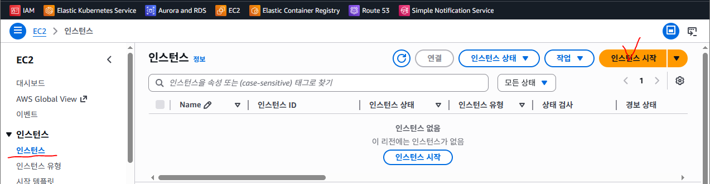

- AIM-ID는 리전마다 값이 다르다.
- AIM-ID : ami-0389ea382ca31bd7f

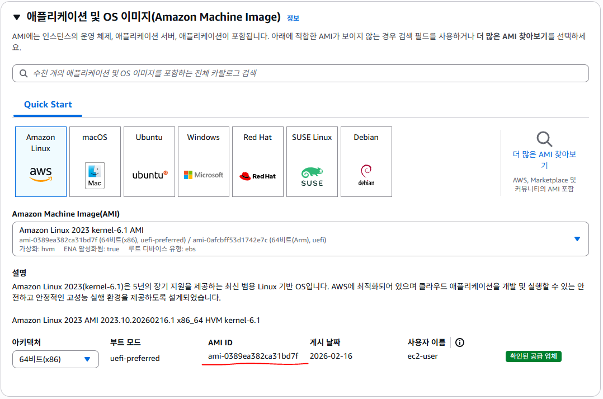

- EC2  -->  인스턴스  -->  인스턴스 생성 (도쿄 리전)


- AIM-ID는 리전마다 값이 다르다.
- AIM-ID : ami-088103e734f7e0529

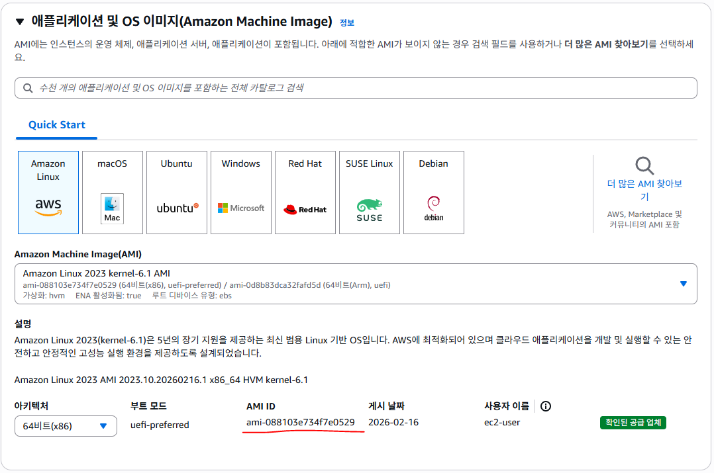

```hcl
# main.tf
terraform {
  required_version = "1.14.6"# 사용할 Terraform 프로그램의 버전 (Terraform CLI 버전이 1.14.6이어야 실행 가능)

  required_providers {  # Terraform에서 사용할 Provider 설정
    aws = {
      source = "hashicorp/aws"# AWS Provider를 HashiCorp 공식 저장소에서 가져옴
      version = ">=5.73.0"# AWS Provider 버전 (5.73.0 이상 버전을 사용)
    }
  }
}

provider "aws" {
  region = "ap-northeast-2"  # Terraform으로 AWS 리소스를 생성할 리전
  profile = "my-profile"  # AWS CLI에 미리 등록된 인증 프로파일 사용
}
# variables.tf
# EC2 Instance-Type 설정 변수 (prod, dev)
variable "environment" {
  type    = string
  default = "dev"
}

# EC2 region 설정 변수
variable "region" {
  type    = string
  default = "ap-northeast-2"
}

# 회사가 서울
variable "company" {
  type    = string
  default = "seoul"
}

# main.tf
locals {# 동적인 값 할당
  instance_type = var.environment == "prod" ? "t3.small" : "t3.micro"
}

locals {# map 타입
  ami_map = {
    "ap-northeast-1" : "ami-0c3ffc371dc7c0c4c"
    "ap-northeast-2" : "ami-010bbf6096e7bb791"
  }
  selected_resion = var.company == "seoul" ? "ap-northeast-2" : "ap-northeast-1"
  selected_ami    = local.ami_map[local.selected_resion]
}

# variables.tf
# EC2 Instance-Type 설정 변수 (prod, dev)
variable "environment" {
  type    = string
  default = "dev"
}

# EC2 Resion 설정 변수
variable "region" {
  type    = string
  default = "ap-northeast-2"
}

# EC2 모니터링 활성화 여부
variable "enable_monitoring" {
  type    = bool
  default = false
}

# EC2 인스턴스로 전달할 지정 데이터
variable "custom_user_data" {
  type    = string
  default = ""
}

# main.tf
# EC2 인스턴스 생성
resource "aws_instance" "my-flow-ec2" {
  ami         = local.selected_ami
  instance_type= local.instance-type
  monitoring = var.enable_monitoring
  user_data  = var.custom_user_data == "" ? null : var.custom_user_data
}

PS C:\trf\HCL-03-flow controll> terraform  init

PS C:\trf\HCL-03-flow controll> terraform plan

Terraform used the selected providers to generate the following execution plan. Resource actions are indicated with the following symbols:
  + create

Terraform will perform the following actions:
  # aws_instance.example will be created
  + resource "aws_instance" "example" {
~~~~~~~~~~~~ 중간 생략 ~~~~~~~~~~~~
      + secondary_network_interface (known after apply)
    }

Plan: 1 to add, 0 to change, 0 to destroy.

PS C:\trf\HCL-03-flow controll> terraform apply

Terraform used the selected providers to generate the following execution plan. Resource actions are indicated with the following symbols:
  + create

Terraform will perform the following actions:

  # aws_instance.example will be created
  + resource "aws_instance" "example" {
~~~~~~~~~~~~ 중간 생략 ~~~~~~~~~~~~
      + secondary_network_interface (known after apply)
    }

Plan: 1 to add, 0 to change, 0 to destroy.

Do you want to perform these actions?
  Terraform will perform the actions described above.
  Only 'yes' will be accepted to approve.

  Enter a value: yes

aws_instance.example: Creating...
aws_instance.example: Still creating... [00m10s elapsed]
aws_instance.example: Creation complete after 13s [id=i-0cef7c72d8d593aea]

Apply complete! Resources: 1 added, 0 changed, 0 destroyed.
```

- AWS EC2 인스턴스가 생성된다.

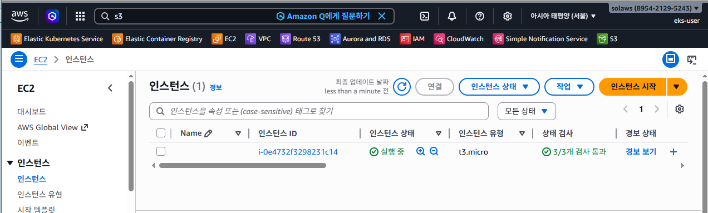

- 모니터링 기능이 disabled되어 있다.

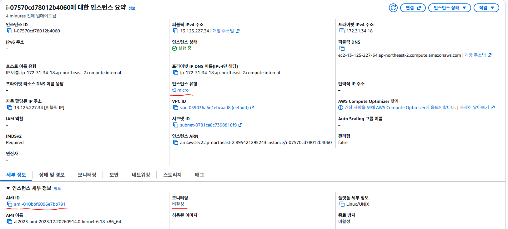

```hcl
# terraform.tfvars
region            = "ap-northeast-2"
profile           = "default"
environment       = "dev"
company           = "seoul"
enable_monitoring = true
custom_user_data= ""

PS C:\terrform\HCL-03-flow-controll> terraform plan
aws_s3_bucket.example[0]: Refreshing state... [id=my-example-123456789012]
aws_instance.example: Refreshing state... [id=i-0e4732f3298231c14]

Terraform used the selected providers to generate the following execution plan. Resource actions are indicated with the following symbols:
  ~ update in-place

Terraform will perform the following actions:

  # aws_instance.example will be updated in-place
  ~ resource "aws_instance" "example" {
        id                                   = "i-0e4732f3298231c14"
      ~ monitoring                           = false -> true
~~~~~~~~~~~~~~~~~~~~~~ 중간 생략 ~~~~~~~~~~~~~~~~~~~~~~
  # aws_instance.example will be updated in-place
  ~ resource "aws_instance" "example" {
        id                                   = "i-0e4732f3298231c14"
      ~ instance_type                        = "t3.micro" -> "t3.small"
      ~ monitoring                           = false -> true
      ~ public_dns                           = "ec2-3-36-125-67.ap-northeast-2.compute.amazonaws.com" -> (known after apply)
      ~ public_ip                            = "3.36.125.67" -> (known after apply)
        tags                                 = {}
      - user_data                            = "<h1>environment = prod</h1>  <h1>region = ap-northeast-2</h1>  <h1>enable_monitoring = true</h1>  <h1>create_bucket = true</h1>" -> null
        # (36 unchanged attributes hidden)

        # (9 unchanged blocks hidden)
    }

Plan: 0 to add, 0 to change, 1 to destroy.

PS C:\terrform\HCL-03-flow-controll> terraform apply
aws_s3_bucket.example[0]: Refreshing state... [id=my-example-123456789012]
aws_instance.example: Refreshing state... [id=i-0e4732f3298231c14]

Terraform used the selected providers to generate the following execution plan. Resource actions are indicated with the following symbols:
  ~ update in-place

Terraform will perform the following actions:

  # aws_instance.example will be updated in-place
  ~ resource "aws_instance" "example" {
        id                                   = "i-0e4732f3298231c14"
      ~ monitoring                           = false -> true
      ~ public_dns                           = "ec2-3-36-125-67.ap-northeast-2.compute.amazonaws.com" ->
      ~ public_ip                            = "3.36.125.67" -> (known after apply)
        tags                                 = {}

~~~~~~~~~~~~~~~~~~~~~~ 중간 생략 ~~~~~~~~~~~~~~~~~~~~~~

Plan: 0 to add, 1 to change, 0 to destroy.

Do you want to perform these actions?
  Terraform will perform the actions described above.
  Only 'yes' will be accepted to approve.

  Enter a value: yes

aws_instance.example: Modifying... [id=i-0e4732f3298231c14]
aws_instance.example: Still modifying... [id=i-0e4732f3298231c14, 00m10s elapsed]
aws_instance.example: Still modifying... [id=i-0e4732f3298231c14, 00m20s elapsed]
aws_instance.example: Still modifying... [id=i-0e4732f3298231c14, 00m30s elapsed]
aws_instance.example: Still modifying... [id=i-0e4732f3298231c14, 00m40s elapsed]
aws_instance.example: Modifications complete after 43s [id=i-0e4732f3298231c14]

Apply complete! Resources: 0 added, 1 changed, 0 destroyed.
```

- 모니터링 기능이 enabled로 변경 확인

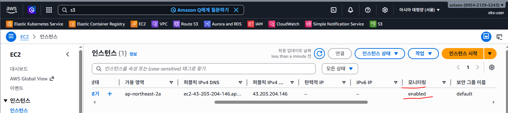

```hcl
# terraform.tfvars
region            = "ap-northeast-2"
profile           = "default"
environment       = "prod"
company           = "seoul"
enable_monitoring = true
custom_user_data = ""

PS C:\trf\HCL_04_flow_ctr> terraform  plan

PS C:\trf\HCL_04_flow_ctr> terraform  apply
aws_instance.my-flow-ec2: Refreshing state... [id=i-07570cd78012b4060]

Terraform will perform the following actions:

  # aws_instance.my-flow-ec2 will be updated in-place
  ~ resource "aws_instance" "my-flow-ec2" {
        id                                   = "i-07570cd78012b4060"
      ~ instance_type= "t3.micro" -> "t3.small"
      ~ public_dns= "ec2-13-125-227-34.ap-northeast-2.compute.amazonaws.com" -> (known after apply)
      ~ public_ip      = "13.125.227.34" -> (known after apply)
        tags          = {}
        # (37 unchanged attributes hidden)

        # (9 unchanged blocks hidden)
    }

Plan: 0 to add, 1 to change, 0 to destroy.

Do you want to perform these actions?
  Terraform will perform the actions described above.
  Only 'yes' will be accepted to approve.

aws_instance.my-flow-ec2: Modifying... [id=i-07570cd78012b4060]
aws_instance.my-flow-ec2: Still modifying... [id=i-07570cd78012b4060, 00m10s elapsed]
aws_instance.my-flow-ec2: Still modifying... [id=i-07570cd78012b4060, 00m20s elapsed]
aws_instance.my-flow-ec2: Still modifying... [id=i-07570cd78012b4060, 00m30s elapsed]
aws_instance.my-flow-ec2: Modifications complete after 32s [id=i-07570cd78012b4060]

Apply complete! Resources: 0 added, 1 changed, 0 destroyed.
```

- 인스턴스 타입이 t3.small로 변경

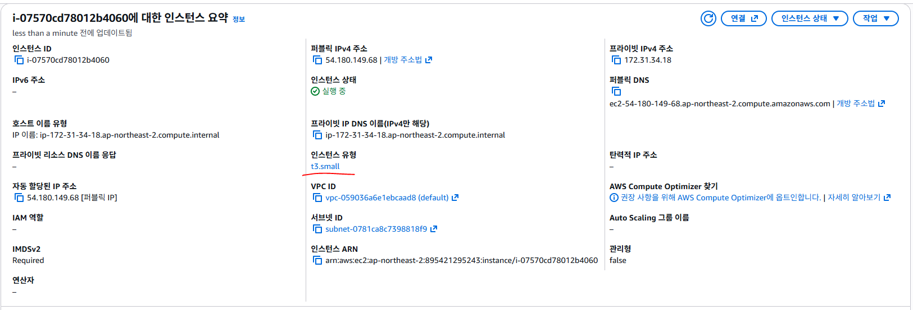

```hcl
# terraform.tfvars
region            = "ap-northeast-2"
profile           = "default"
environment       = "prod"
company           = "tokyo"
enable_monitoring = true
custom_user_data  = <<EOF
#!/bin/bash

dnf install httpd -y
systemctl start httpd
systemctl enable httpd

TOKEN=$(curl -s -X PUT "http://169.254.169.254/latest/api/token" \
```

- H "X-aws-ec2-metadata-token-ttl-seconds: 21600")

```
INSTANCE_ID=$(curl -s \
```

- H "X-aws-ec2-metadata-token: $TOKEN" \

```
  http://169.254.169.254/latest/meta-data/instance-id)

echo "<h1>$INSTANCE_ID</h1>" > /var/www/html/index.html
echo "<h1>hello Soldesk IT Academy</h1>" >> /var/www/html/index.html
EOF

PS C:\trf\HCL_04_flow_ctr> terraform  apply  -auto-approve
aws_instance.my-flow-ec2: Refreshing state... [id=i-07570cd78012b4060]
~~~~~~~~~ 중간 생략 ~~~~~~~~~
Plan: 1 to add, 0 to change, 1 to destroy.
aws_instance.my-flow-ec2: Destroying... [id=i-07570cd78012b4060]
aws_instance.my-flow-ec2: Still destroying... [id=i-07570cd78012b4060, 00m10s elapsed]
aws_instance.my-flow-ec2: Still destroying... [id=i-07570cd78012b4060, 00m20s elapsed]
aws_instance.my-flow-ec2: Destruction complete after 29s
aws_instance.my-flow-ec2: Creating...
╷
│ Error: creating EC2 Instance: operation error EC2: RunInstances, https response error StatusCode: 400, RequestID: f863f8cc-4d7d-4093-8c6b-bb2c8ebe5e09, api error InvalidAMIID.NotFound: The image id '[ami-0c3ffc371dc7c0c4c]' does not exist
│
│   with aws_instance.my-flow-ec2,
│   on main.tf line 34, in resource "aws_instance" "my-flow-ec2":
│   34: resource "aws_instance" "my-flow-ec2" {
```

- AMI는 변경되지만 리전은 그대로 ap-northeast-2이므로 서울 리전에 해당 AMI가 없다는 에러가 발생한다.

```hcl
   # main.tf
~~~~~~~~~ 중간 생략 ~~~~~~~~~
provider "aws" {
  region  = local.selected_region# AMI를 선택시 리전도 변경되도록 수정
  profile = var.profile
}

locals {
  instance-type = var.environment == "prod" ? "t3.small" : "t3.micro"
}

locals {
  ami_map = {          "ami-0c3ffc371dc7c0c4c"
    "ap-northeast-1" : "ami-0c3ffc371dc7c0c4c"
    "ap-northeast-2" : "ami-010bbf6096e7bb791"
  }
  selected_region = var.company == "seoul" ? "ap-northeast-2" : "ap-northeast-1"
  selected_ami    = local.ami_map[local.selected_region]
}
~~~~~~~~~ 중간 생략 ~~~~~~~~~

PS C:\trf\HCL_04_flow_ctr> terraform  apply  -auto-approve
```

- 서울 리전의 EC2 인스턴스가 삭제

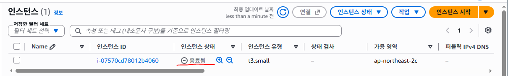

- 도쿄 리전에 EC2 인스턴스가 생성

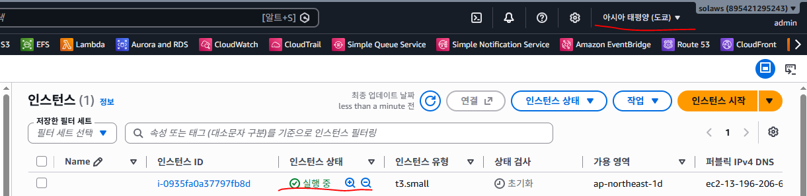

http://ec2-13-196-206-60.ap-northeast-1.compute.amazonaws.com/

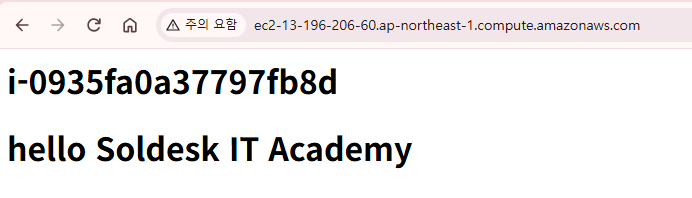

- 도쿄리전의 EC2로 접속하게되면 유저 데이터로 설정한 정보가 확인된다.

```hcl
   # variables.tf
# EC2 생성 유/무
variable "create_ec2" {
  type    = bool
  default = false
}

   # main.tf
resource "aws_instance" "my-flow-ec2" {
  count         = var.create_ec2 ? 1 : 0# false이므로 EC2를 생성하지 않는다.
  ami           = local.selected_ami
  instance_type = local.instance-type
  monitoring    = var.enable_monitoring
  user_data     = var.custom_user_data == "" ? null : var.custom_user_data
}

# terraform.tfvars
region            = "ap-northeast-2"
profile           = "default"
environment       = "prod"
company           = "tokyo"
enable_monitoring= true
custom_user_data= ...# 기존 값 유지
create_ec2     = false

PS C:\trf\HCL_04_flow_ctr> terraform  plan
aws_instance.my-flow-ec2[0]: Refreshing state... [id=i-0935fa0a37797fb8d]

Terraform used the selected providers to generate the following execution plan. Resource actions are indicated with the following
symbols:
  - destroy

Terraform will perform the following actions:

  # aws_instance.my-flow-ec2[0] will be destroyed

~~~~~~~~~~~~~~~~~~~~ 중간 생략 ~~~~~~~~~~~~~~~~~~~~
Plan: 0 to add, 0 to change, 1 to destroy.
```

- EC2를 생성하지 않는다는 의미가 아니라 "EC2가 없어야 한다." 이므로 실행하게되면 생성된 EC2가 삭제된다.

#### S3 Bucket 생성

```hcl
# variables.tf
~~~~~ 중간 생략 ~~~~~
# S3 Bucket 생성 유/무
variable "create_bucket" {
  type    = bool
  default = false
}

# main.tf
~~~~~ 중간 생략 ~~~~~
resource "aws_s3_bucket" "s3-example" {
  count  = var.create_bucket ? 1 : 0
  bucket = "my-example-123456789012"
}

# terraform.tfvars
region            = "ap-northeast-2"
profile           = "default"
environment       = "prod"
company           = "tokyo"
enable_monitoring= true
custom_user_data= ...# 기존 값 유지
create_bucket     = false
```

- terraform.tfvars를 사용하여 각 변수의 값을 작성할 수 있다.
- 이렇게 분리하는 이유는 단순히 값을 바꾸기 편의성도 제공하지만 환경별 설정 분리가 가장 큰 장점이다.

- variables.tf
  - 변수 종류와 기본값 정의

- dev.tfvars
  - 개발환경 값

- stage.tfvars
  - 테스트환경 값

- prod.tfvars
  - 운영환경 값

```hcl
# terraform.tfvars
region            = "ap-northeast-2"
profile           = "default"
environment       = "prod"
company           = "tokyo"
enable_monitoring= true
custom_user_data= ...# 기존 값 유지
create_bucket     = true

PS C:\trf\HCL-03-flow controll> terraform plan
~~~~~~~~~~~~~~~~~~~~ 중간 생략 ~~~~~~~~~~~~~~~~~~~~
  # aws_s3_bucket.s3-example[0] will be created
  + resource "aws_s3_bucket" "s3-example" {
~~~~~~~~~~~~~~~~~~~~ 중간 생략 ~~~~~~~~~~~~~~~~~~~~
Plan: 1 to add, 1 to change, 0 to destroy.

PS C:\trf\HCL-03-flow controll> terraform apply
aws_instance.example: Refreshing state... [id=i-0cef7c72d8d593aea]

~~~~~~~~~~~~~~~~~~~~ 중간 생략 ~~~~~~~~~~~~~~~~~~~~

  Enter a value: yes

aws_s3_bucket.s3-example[0]: Creating...
aws_instance.example: Modifying... [id=i-0cef7c72d8d593aea]
aws_s3_bucket.s3-example[0]: Creation complete after 1s [id=my-example-123456789012]
aws_instance.example: Still modifying... [id=i-0cef7c72d8d593aea, 00m10s elapsed]
aws_instance.example: Still modifying... [id=i-0cef7c72d8d593aea, 00m20s elapsed]
aws_instance.example: Still modifying... [id=i-0cef7c72d8d593aea, 00m30s elapsed]
aws_instance.example: Modifications complete after 32s [id=i-0cef7c72d8d593aea]

Apply complete! Resources: 1 added, 1 changed, 0 destroyed.
```

- 도쿄 리전에 S3 버킷이 생성되어있다.

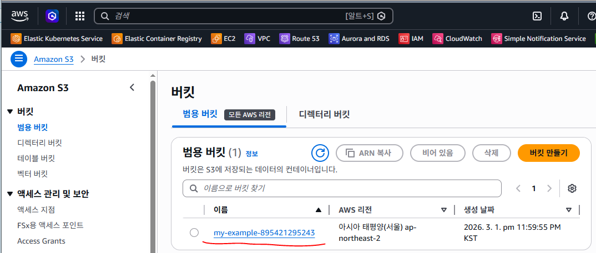

#### S3 bucket만 삭제하기위한 plan

```powershell
PS C:\trf\HCL_04_flow_ctr> terraform  plan  -destroy  -target="aws_s3_bucket.my-bucket"

# S3 bucket만 삭제
PS C:\trf\HCL_04_flow_ctr> terraform  destroy  -target="aws_s3_bucket.my-bucket"

# EC2는 도쿄 리전, S3 bucket은 서울 리전에 생성

   # main.tf
~~~~~~~~~~~~~~~~~~~~ 중간 생략 ~~~~~~~~~~~~~~~~~~~~
provider "aws" {
  region  = local.selected_region
  profile = var.profile
}

provider "aws" {
  alias   = "seoul"
  region  = var.region_seoul
  profile = var.profile
}

provider "aws" {
  alias   = "tokyo"
  region  = var.region_tokyo
  profile = var.profile
}

~~~~~~~~~~~~~~~~~~~~ 중간 생략 ~~~~~~~~~~~~~~~~~~~~

resource "aws_instance" "my-flow-ec2" {
  provider      = aws.tokyo
  count         = var.create_ec2 ? 1 : 0
  ami           = local.selected_ami
  instance_type = local.instance-type
  monitoring    = var.enable_monitoring
  user_data     = var.custom_user_data == "" ? null : var.custom_user_data
}

########################## S3 Bucket ##########################

resource "aws_s3_bucket" "my-bucket" {
  provider = aws.seoul
  count    = var.create_bucket ? 1 : 0
  bucket   = "my-s3-bucket-flow-123456789012"
}

   # variables.tf
# 리소스를 생성할 서울 리전
variable "region" {
  type    = string
  default = "ap-northeast-2"
}

# 리소스를 생성할 서울 리전
variable "region_seoul" {
  type    = string
  default = "ap-northeast-2"
}

# 리소스를 생성할 도쿄 리전
variable "region_tokyo" {
  type    = string
  default = "ap-northeast-1"
}
~~~~~~~~~~~~~~~~~~~~ 중간 생략 ~~~~~~~~~~~~~~~~~~~~

PS C:\trf\HCL_04_flow_ctr> terraform  plan
aws_instance.my-flow-ec2[0]: Refreshing state... [id=i-0935fa0a37797fb8d]

Terraform used the selected providers to generate the following execution plan. Resource actions are
indicated with the following symbols:
  + create

Terraform will perform the following actions:

  # aws_s3_bucket.my-bucket[0] will be created
  + resource "aws_s3_bucket" "my-bucket" {
~~~~~~~~~~~~~~~~~~~~ 중간 생략 ~~~~~~~~~~~~~~~~~~~~
Plan: 1 to add, 0 to change, 0 to destroy.

PS C:\trf\HCL_04_flow_ctr> terraform  apply
```

- EC2 생성은 ap-northeast-1 도쿄 리전에서 생성되며 S2 bucket은 ap-northeast-2 서울 리전에 생성된다.

#### Terraform 반복문

- 인프라를 코드로 정의할 때 동일한 유형의 리소스를 여러 개 생성하거나 설정해야 하는 상황이 매우 자주 발생한다.
  - EC2 인스턴스를 3대 이상 생성해야 하는 경우
  - dev / stage / prod 환경을 각각 구성해야 하는 경우
  - 보안 그룹에 여러 개의 인바운드 규칙을 추가해야 하는 경우
  - 동일한 구조의 모듈을 여러 번 호출해야 하는 경우

- 이때 모든 리소스를 복사하여 작성하면 코드가 길어지고, 유지보수가 어려워지며,
일부 수정 시 오류 발생 확률이 크게 증가한다.

- Terraform은 이러한 문제를 해결하기 위해 반복문 구조를 제공한다.

- Terraform에서 사용하는 주요 반복 구조는 다음 네 가지이다.
  - count
  - for_each
  - for 표현식
  - dynamic 블록

- 이 네 가지는 모두 반복과 관련되어 있지만, 목적과 사용 방식이 서로 다르다.

#### count를 사용한 반복

- count는 Terraform에서 가장 기본적인 반복 방식이다.
- 특정 리소스를 몇 개 생성할 것인가를 정수 값으로 지정한다.

```hcl
example)
resource "aws_instance" "example" {
  count = 3
}
```

- 위 설정은 동일한 리소스를 3개 생성한다.

- Terraform 내부에서는 이 리소스를 다음과 같이 관리한다.

```bash
aws_instance.example[0]
aws_instance.example[1]
aws_instance.example[2]
```

- 즉, 배열 인덱스 기반으로 관리된다. (인덱스는 0부터 시작한다.)

- count.index의 의미
  - count.index는 현재 반복의 번호를 의미한다.
  - 이를 활용하면 반복되는 리소스에 서로 다른 값을 지정할 수 있다.

예:

```hcl
tags = {
  Name = "Example-Instance-${count.index}"
}
```

- 이 경우 생성되는 인스턴스 이름은 다음과 같다.
  - Example-Instance-0
  - Example-Instance-1
  - Example-Instance-2

- count 사용 시 주의할 점
  - count는 인덱스 기반으로 관리되기 때문에 중간 리소스를 제거하면 인덱스 재정렬이 발생할 수 있다.

- 예를 들어:
  - count = 3 (운영 중)
  - count = 2로 변경

- 이 경우 마지막 리소스가 제거된다.
하지만 중간 값을 제거하는 경우, Terraform은 리소스를 재생성할 가능성이 있다.

- 따라서 count는 다음과 같은 경우에 적합하다.
  - 완전히 동일한 리소스를 단순히 여러 개 생성할 때
  - 개수만 중요하고 개별 식별자가 중요하지 않을 때
  - 테스트 환경 등 단순 복제 구조일 때

#### for_each를 사용한 반복

- for_each는 count와 유사하지만 훨씬 유연하다.

- count가 개수 기준이라면 for_each는 키 또는 값 기준이다.

예:

```hcl
for_each = toset(["dev", "staging", "prod"])
```

- Terraform 내부에서는 다음과 같이 관리된다.
  - aws_instance.example["dev"]
  - aws_instance.example["staging"]
  - aws_instance.example["prod"]
  - 즉, 인덱스가 아니라 식별자 기반이다.

- each.key와 each.value
  - for_each 내부에서는 다음 변수를 사용할 수 있다.
  - each.key : 현재 반복의 키
  - each.value: 현재 반복의 값

예:

```hcl
tags = {
  Name = "Example-Instance-${each.key}"
}
```

- 이 경우 생성되는 이름은 다음과 같다.
  - Example-Instance-dev
  - Example-Instance-staging
  - Example-Instance-prod

- for_each의 장점
  - 특정 키만 제거해도 다른 리소스에 영향이 없음
  - 환경 분리 구조에 적합
  - 서로 다른 설정값을 지정할 수 있음
  - 운영 환경에서 안정성이 높음

- count보다 for_each가 더 자주 사용된다.

  - 예시 1. Set 타입으로 EC2 여러 개 생성

```hcl
variable "server_names" {
  type    = set(string)
  default = ["dev", "staging", "prod"]
}

resource "aws_instance" "set_example" {
  for_each = var.server_names

  ami           = "ami-0389ea382ca31bd7f"
  instance_type = "t3.micro"

  tags = {
    Name = each.value
  }
}

   # 예시 2. Map 타입으로 EC2 여러 개 생성

variable "instance_types" {
  type = map(string)
  default = {
    dev     = "t3.micro"
    staging = "t3.small"
    prod    = "t3.medium"
  }
}

resource "aws_instance" "map_example" {
  for_each= var.instance_types

  ami        = "ami-0389ea382ca31bd7f"
  instance_type= each.value  # Map의 Value 사용

  tags = {
    Name = each.key    # Map의 Key 사용
  }
}

   # 예시 3. Map + Object 타입 (실무에서 많이 사용하는 형태)

variable "servers" {

  type = map(object({
    instance_type = string
    monitoring    = bool
  }))

  default = {

    dev = {
      instance_type = "t3.micro"
      monitoring    = false
    }

    staging = {
      instance_type = "t3.small"
      monitoring    = false
    }

    prod = {
      instance_type = "t3.medium"
      monitoring    = true
    }
  }
}

resource "aws_instance" "object_example" {
  for_each= var.servers
  ami = "ami-0389ea382ca31bd7f"
  instance_type= each.value.instance_type
  monitoring = each.value.monitoring
  tags = {
    Name = each.key
  }
}
```

- 1번째 EC2

```hcl
Name          = dev
instance_type= t3.micro
monitoring    = false
```

- 2번째 EC2

```hcl
Name        = staging
instance_type = t3.small
monitoring    = false
```

- 3번째 EC2

```hcl
Name       = prod
instance_type= t3.medium
monitoring = true
```

#### for 표현식을 사용한 값 생성

- for 표현식은 리소스를 생성하는 반복이 아니다.

- 데이터를 생성하거나 변환하는 반복이다.

- 리스트, 맵, 셋 등의 구조를 가공할 때 사용한다.

예:

```hcl
variable "instance_names" {
  default = ["web1", "web2", "db1"]
}

locals {
  name_tags = [for name in var.instance_names : "Name-${name}"]
}
```

- 결과:

```
["Name-web1", "Name-web2", "Name-db1"]
```

- 사용 목적
  - 기존 리스트를 변환
  - 특정 조건으로 필터링
  - 태그 자동 생성
  - 모듈 입력값 가공
  - CIDR 계산

- 조건문과 함께 사용할 수도 있다.

```
[for name in var.instance_names : name if name != "db1"]

이 경우 db1은 제외된다.
```

#### dynamic 블록을 사용한 리소스 내부 반복

- dynamic은 리소스 자체를 반복하는 것이 아니다.
- 리소스 내부 블록을 반복 생성하는 구조이다.

- 대표적인 예는 보안 그룹의 ingress 규칙이다.

- 보안 그룹에 여러 개의 ingress 블록이 필요한 경우 다음과 같이 작성한다.

```hcl
resource "aws_security_group" "example" {
  name = "example-sg"

  dynamic "ingress" {
    for_each = var.ingress_rules
    content {
      from_port   = ingress.value.from_port
      to_port     = ingress.value.to_port
      protocol    = ingress.value.protocol
      cidr_blocks = ingress.value.cidr_blocks
    }
  }
}
```

- 보안 그룹을 하나 만들고 여러 개의 인바운드 규칙을 변수로 받아서 자동으로 반복 생성하는 구조

- 이 구조는 다음과 같이 동작한다.
  - ingress_rules를 순회한다.
  - ingress 블록을 반복 생성한다.
  - content 내부가 실제로 생성되는 블록이다.

- dynamic 사용 목적
  - 보안 그룹 규칙 여러 개 생성
  - ALB listener rule 반복 생성
  - IAM 정책 블록 반복
  - 특정 리소스의 하위 설정 반복

#### 반복문 선택 기준

- count
  - 동일 구성 리소스를 단순히 여러 개 생성할 때
  - 조건부 생성에 활용 가능

- for_each
  - 각 리소스에 서로 다른 값을 지정해야 할 때
  - 환경 분리 구조에 적합
  - 운영 환경에서 가장 많이 사용

- for 표현식
  - 데이터 변환 및 필터링
  - 태그 자동화
  - 모듈 입력값 가공

- dynamic
  - 리소스 내부 블록 반복 생성

#### for loop 실습

- HCL-04-for-loop 폴더 생성
  - main.tf 파일 생성
  - outputs.tf 파일 생성
  - variables.tf 파일 생성

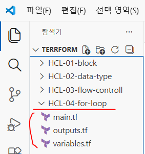

EX1) count로 EC2 여러 개 생성
  - count 값을 이용해서 동일한 리소스를 여러 개 생성하는 가장 기본적인 형태

```hcl
main.tf
terraform {
  required_version = "1.16.2"
  required_providers {
    aws = {
      source  = "hashicorp/aws"
      version = "~> 6.0"
    }
  }
}

provider "aws" {
  region  = "ap-northeast-2"
  profile = "default"
}

# 최신 AMI 조회
data "aws_ami" "al2023" {
  most_recent = true

  filter {
    name   = "name"
    values = ["al2023-ami-*"]
  }

  filter {
    name   = "architecture"
    values = ["x86_64"]
  }
}

# EC2 인스턴스 생성
resource "aws_instance" "my-ec2" {

  count = 3   # EC2를 3개 생성

  ami           = data.aws_ami.al2023.id
  instance_type = "t3.micro"

  tags = {
    Name = "count-ec2-${count.index}"
  }
}

동작
count = 3
```

- Terraform은 내부적으로
  - aws_instance.example[0]
  - aws_instance.example[1]
  - aws_instance.example[2]

3개의 리소스를 만든다.

EX2) 변수로 count 제어
  - count 값을 변수로 제어하는 방식

```hcl
# variables.tf
variable "instance_count" {
  description = "EC2 개수"
  default     = 2
}

# main.tf
resource "aws_instance" "example" {

  count = var.instance_count

  ami           = data.aws_ami.al2023.id
  instance_type = "t3.micro"

  tags = {
    Name = "variable-ec2-${count.index}"
  }
}

PS C:\trf\HCL_05_for_loop> terraform  apply 실행 시
PS C:\trf\HCL_05_for_loop> terraform  apply  -var="instance_count=4"
PS C:\trf\HCL_05_for_loop> terraform  plan   -var="instance_count=4", -var="instance_type=t3.mall"

결과

EC2 4개 생성

EX3) 조건문과 count 사용
 # 조건에 따라 리소스를 만들거나 안 만들기

# variables.tf
variable "instance_create1" {
  description = "EC2 생성 여부 boolean"
  type    = bool
  default = false
}

variable "instance_create2" {
  description = "EC2 생성 여부 string"
  type    = string
  default = "create"
}

# main.tf
resource "aws_instance" "example" {
  #count  = var.instance_count
  #count  = var.cinstance_create1 ? 1 : 0
  count   = var.instance_create2 == "create" ? 1 : 0

  ami          = data.aws_ami.al2023.id
  instance_type= "t3.micro"

  tags = {
    Name = "conditional-ec2"
  }
}

동작

create_instance = true  -> EC2 생성
create_instance = false -> EC2 생성 안함

EX4) AWS에 Name 태그가 "my-ec2"인 EC2 인스턴스가 존재하는지 확인하고, 존재하지 않으면 EC2 인스턴스 1개를 생성

   # main.tf
# 특정 태그를 갖은 EC2 인스턴스가 있으면 EC2 인스턴스를 생성하지 않고
# 특정 태그가 없는 경우에만 EC2 인스턴스를 생성
data "aws_instances" "ec2_existing" {
  # EC2의 Name을 기준으로 조회
  filter {
    name   = "tag:Name"
    values = ["my-ec2"]
  }

  # 실행중이거나 중지된 EC2 인스턴스만 조회
  filter {
    name   = "instance-state-name"
    values = ["pending", "running", "stopping", "stopped"]
  }
}

resource "aws_instance" "my-data-ec2" {
  # data.aws_instance.ec2_existing.ids = my-ec2 태그로 검색된 id들을 반환
  # length() : list, set, tuple, map등의 개수를 반환한다.
  count         = length(data.aws_instances.ec2_existing.ids) == 0 ? 1 : 0
  ami           = data.aws_ami.al2023.id
  instance_type = var.instance_type
  tags = {
    Name = "my-ec2"
  }
}

PS C:\trf\HCL_05_for_loop> terraform plan
~~~~~~~~~~ 중간 생략 ~~~~~~~~~~
Plan: 1 to add, 0 to change, 0 to destroy.
```

- 검색으로 EC2를 생성하는 리소스 블록을 주석 처리 후 my-ec2의 인스턴스를 미리 생성
- 그 후 다시 검색으로 EC2를 생성하는 리소스 블록의 주석을 삭제하게 되면 리소스를 생성하지 않게된다.

```hcl
   # main.tf
resource "aws_instance" "existing_my_ec2" {
  ami           = data.aws_ami.al2023.id
  instance_type = var.instance_type
  tags = {
    Name = "my-ec2"
  }
}

# resource "aws_instance" "my-data-ec2" {
#   # data.aws_instance.ec2_existing.ids = my-ec2 태그로 검색된 id들을 반환
#   # length() : list, set, tuple, map등의 개수를 반환한다.
#   count         = length(data.aws_instances.ec2_existing.ids) == 0 ? 1 : 0
#   ami           = data.aws_ami.al2023.id
#   instance_type = var.instance_type
#   tags = {
#     Name = "my-ec2"
#   }
# }

PS C:\trf\HCL_05_for_loop> terraform apply
```

- my-ec2 이름의 EC2 인스턴스가 생성된다.
- 다시 EC2 인스턴스를 생성하는 리소스 블록을 삭제하고 검색으로 EC2를 생성하는 리소스 블록의 주석을 해제

```powershell
PS C:\trf\HCL_05_for_loop> terraform plan
~~~~~~~~~~ 중간 생략 ~~~~~~~~~~
Plan: 0 to add, 0 to change, 1 to destroy.

# EC2 리소스 삭제

EX5) 리스트 길이를 이용한 count
 # 리스트 길이만큼 리소스를 생성하는 방식

# variables.tf
variable "instance_types" {
  type = list(string)
  default = [
    "t3.micro",  "t3.small", "t3.medium"
  ]
}

# main.tf
resource "aws_instance" "example" {

  count = length(var.instance_types)

  ami           = "ami-0389ea382ca31bd7f"
  instance_type = var.instance_types[count.index]

  tags = {
    # Name = "list-ec2-${count.index}"
    Name = "ec2-list-${var.ec2_instance_type[count.index]}"
  }
}

   # outputs.tf
output "instance_type" {
  value = aws_instance.ec2-list[*].instance_type
}

PS C:\trf\HCL_05_for_loop> terraform plan
~~~~~~~~~~ 중간 생략 ~~~~~~~~~~
Changes to Outputs:
  + instance_type   = [
      + "t3.micro",
      + "t3.small",
      + "t3.medium",
    ]

EX6) map 길이를 이용한 count
 # 각 EC2의 Name 태그에는 map의 key를 사용하고
 # Instance Type에는 map의 value를 사용

   # variables.tf
variable "instance_types" {
  type = map(string)
  default = {
    web = "t3.micro"
    app = "t3.small"
    db  = "t3.medium"
  }
}

   # main.tf
resource "aws_instance" "my-map-ec2" {
  # map의 항목 개수만큼 EC2 생성
  count = length(var.instance_types)
  ami           = data.aws_ami.al2023.id

  # map의 value를 인덱스로 하나씩 가져옴
  instance_type= values(var.instance_types)[count.index]

  tags = {
    # map의 key를 인덱스로 하나씩 가져옴
    Name = keys(var.instance_types)[count.index]
  }
}

   # outputs.tf
output "instance_types" {
  value = aws_instance.my-map-ec2[*].instance_type
}

output "instance_names" {
  value = aws_instance.my-map-ec2[*].tags["Name"]
}

PS C:\trf\HCL_05_for_loop> terraform plan
~~~~~~~~~~ 중간 생략 ~~~~~~~~~~
Changes to Outputs:
  + instance_names  = [
      + "app",
      + "db",
      + "web",
    ]
  + instance_types  = [
      + "t3.small",
      + "t3.medium",
      + "t3.micro",
    ]
```

#### for 표현식 (for expression)

- Terraform에서 리스트(list), 맵(map), 셋(set) 데이터를 변환하거나 새로운 값을 만들 때 사용하는 반복식
  - 즉 기존 데이터  -->  반복  -->  새로운 데이터 생성

- 리소스를 만드는 것이 아니라 값을 가공하는 문법이다.

#### 기본 문법

- 리스트 생성 방식
[for 변수 in 리스트 : 결과]

- 맵 생성 방식
{for 키,값 in 맵 : 새로운키 => 결과}

EX1) 리스트 값 계산 (기본 for 표현식)
  - 리스트 값을 반복하면서 새로운 리스트 생성

```hcl
main.tf
variable "numbers" {
  type = list(number)
  default = [1, 2, 3, 4]
}

output "result" {
  value = [for n in var.numbers : n * 5]
}

입력 [1,2,3,4]

결과 [5,10,15,20]

설명

for n in var.numbers
 # 리스트 값을 하나씩 꺼낸다.
 # n * 5
 # 각 값을 계산하여 새로운 리스트 생성

EX2) 문자열 가공
 # 문자열 리스트를 가공하여 새로운 값 생성

# main.tf
locals {
  numbers = [1, 2, 3, 4, 5]

  server_names = [
    for num in local.numbers : "server-${num}"
  ]
}

# output.tf
output "server-name" {
  value = local.server_names
}

PS C:\trs\terraform-aws\02_HCL\HCL-04-for-loop> terraform  plan

  + server-name = [
      + "server-1",
      + "server-2",
      + "server-3",
      + "server-4",
      + "server-5",
    ]

EX3) 리스트  --> map 변환
 # 리스트 데이터를 map 구조로 변환
```

- Map/Object 형태

```hcl
{
  for 변수 in 컬렉션 : key => value
}

# =>는 왼쪽을 key로, 오른쪽을 value로 만들어라라는 의미

# variables.tf
variable "users" {

  type = list(string)
  default = [ "kim",   "lee",   "park",  "ryu" ]
}

# main.tf
locals {
  user_map = {
    for user in var.users : user => "${user}@naver.com"
  }
}

# outputs.tf
output "user_map" {
  value = local.user_map
}

PS C:\trs\terraform-aws\02_HCL\HCL-04-for-loop> terraform  plan

  + user_map    = {
      + kim  = "kim@naver.com"
      + lee  = "lee@naver.com"
      + park = "park@naver.com"
      + ryu  = "ryu@naver.com"
    }

실습 3-2 리스트  --> map 변환

다음 서버 리스트가 있다.
["web","db","cache"]

for 표현식을 사용하여 다음 map을 생성하시오

{
  web   = "web:8080"
  db    = "db:8080"
  cache = "cache:8080"
}

# variables.tf
variable "servers" {
  default = ["web","db","cache"]
}

# main.tf
locals {
  server_port_map = {
    for s in var.servers :
    s => "${s}:8080"
  }
}

# outputs.tf
output "server_port_map" {
  value = local.server_port_map
}

PS C:\trs\terraform-aws\02_HCL\HCL-04-for-loop> terraform  plan

  + server_port_map = {
      + cache = "cache:8080"
      + db    = "db:8080"
      + web   = "web:8080"
    }

   # EC2 생성으로 응용

# variables.tf
variable "servers" {
  type    = list(string)
  default = ["web", "db", "cache"]
}

# main.tf
terraform {
  required_version = "1.14.6"

  required_providers {
    aws = {
      source  = "hashicorp/aws"
      version = ">=5.73.0"
    }
  }
}

provider "aws" {
  region  = "ap-northeast-2"
  profile = "my-profile"
}
resource "aws_instance" "example" {

  for_each = {
    for s in var.servers :
    s => "${s}:8080"
  }

  ami           = "ami-0389ea382ca31bd7f"
  instance_type = "t3.micro"

  tags = {
    Name = each.key
    Port = each.value
  }
}

# outputs.tf
output "server_info" {
  value = {
    for key, instance in aws_instance.example :
    key => {
      name = instance.tags["Name"]
      port = instance.tags["Port"]
    }
  }
}
```

#### outputs.tf 해석

- for_each로 생성한 EC2는 아래의 구조를 갖게된다.
  - aws_instance.example["web"]
  - aws_instance.example["db"]
  - aws_instance.example["cache"]

- for key, instance in aws_instance.my-ec2-for :

- map 형태

```json
{
  "web"   = web EC2 객체
  "db"    = db EC2 객체
  "cache" = cache EC2 객체
}

   # 1회차
key  -->  "web"
instance-->  aws_instance.example["web"]의 전체 인스턴스 정보
```

- 1번째 인스턴스
instance

```
 ├─ id            = "i-xxxxxxxx"
 ├─ instance_type= "t3.micro"
 ├─ public_ip     = "3.x.x.x"
 ├─ private_ip    = "172.31.x.x"
 └─ tags
        ├─ Name = "web"
        └─ Port = "web:8080"
```

- name = instance.tags["Name"] 은 현재 EC2의 Name 태그를 가져온다.
- port = instance.tags["Port"] 는 현재 EC2의 Port 태그를 가져온다.

```powershell
PS C:\trs\terraform-aws\02_HCL\HCL-04-for-loop> terraform plan

Terraform used the selected providers to generate the following execution plan. Resource actions are indicated with the following symbols:
  + create

Terraform will perform the following actions:
~~~~~~~~~ 중간 생략 ~~~~~~~~~

Plan: 3 to add, 0 to change, 0 to destroy.

PS C:\trs\terraform-aws\02_HCL\HCL-04-for-loop> terraform apply
```

- EC2 인스턴스가 생성된다.

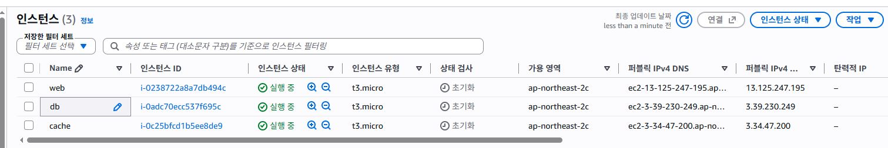

```powershell
PS C:\trs\terraform-aws\02_HCL\HCL-04-for-loop> terraform destory

실습 4-1 조건 필터 사용
 # 특정 조건을 만족하는 값만 선택

# variables.tf
variable "numbers" {
  description = "숫자 리스트"
  type        = list(number)
  default = [1, 2, 3, 4, 5, 6]
}

# main.tf
locals {
  even_numbers = [
    for n in var.numbers : n if n % 2 == 0
  ]
}

# outputs.tf
output "even_numbers" {
  value = local.even_numbers
}

PS C:\trs\terraform-aws\02_HCL\HCL-04-for-loop> terraform  plan

  + even_numbers    = [
      + 2,
      + 4,
      + 6,
      + 8,
      + 10,
    ]

실습 4-2 조건 필터 사용
 # 특정 조건을 만족하는 값만 선택

# variables.tf
variable "numbers" {
  default = [2,4,6,8,10]
}

# main.tf
locals {
  greater_than_five = [
    for n in var.numbers :
    n if n > 5
  ]
}

# outputs.tf
output "greater_than_five" {
  value = local.greater_than_five
}

PS C:\trs\terraform-aws\02_HCL\HCL-04-for-loop> terraform  plan

  + greater_then_five = [
      + 6,
      + 7,
      + 8,
      + 9,
      + 10,
    ]

실습 4-３ 조건 필터 사용)　다음 사용자 리스트에서 "admin"을 제외
["admin","kim","lee","park"]

# variables.tf
variable "users" {
  type    = list(string)
  default = ["kim", "lee", "admin", "park", "choi", "ryu"]
}

# main.tf
locals {
  # normals = [# 실습 1
  #   for user in var.users : user if user != "admin"
  # ]

# outputs.tf
output "normal_users" {
  value = local.normal_users
}

PS C:\trs\terraform-aws\02_HCL\HCL-04-for-loop> terraform  plan

Changes to Outputs:
  + normal = [
      + "kim",
      + "lee",
      + "park",
      + "choi",
      + "ryu",
    ]

# 실습 2 (이전 실습은 주석 처리)
# main.tf
locals {
  # normal_users = [
  #   for user in var.users : user if user != "admin"
  # ]

  # contains() : 특정값이 있는지를 검색해서 있으면 true 없으면 false
  normal_users = [
    for user in var.users : user if contains(["admin", "kim", "ryu"], user)
  ]
}

PS C:\trs\terraform-aws\02_HCL\HCL-04-for-loop> terraform  plan

  + normal = [
      + "kim",
      + "admin",
      + "ryu",
    ]

# main.tf
locals {
~~~~~~~~~~~~~~~ 중간 생략 ~~~~~~~~~~~~~~~
  # admin", "kim", "ryu" 유저만 제외
  normal_users = [
    for user in var.users : user if contains(["admin", "kim", "ryu"], user)
  ]
}

PS C:\trs\terraform-aws\02_HCL\HCL-04-for-loop> terraform  plan
Changes to Outputs:
  + normal = [
      + "lee",
      + "park",
      + "choi",
    ]
실습 5. 가용영역 생성 실습 (서울 리전의 가용영역 이름을 직접 만들고 출력)

# main.tf
terraform {
  required_version = "1.14.6"

  required_providers {
    aws = {
      source  = "hashicorp/aws"
      version = ">=5.73.0"
    }
  }
}

provider "aws" {
  region  = "ap-northeast-2"
  profile = "my-profile"
}

locals {
  az_letters = ["a", "b", "c", "d"]
}

locals {
  azs = [
    for letter in local.az_letters :
    "ap-northeast-2${letter}"
  ]
}
```

- variable과 locals의 차이
  - variable
- 사용자가 외부에서 값을 입력하거나 변경할 수 있도록 만드는 입력값
- terraform.tfvars, -var 옵션 등을 통해 값을 변경할 수 있음
- 환경마다 값이 달라질 수 있는 설정에 적합

  - locals
- Terraform 코드 내부에서만 사용하는 값
- 외부에서 직접 값을 변경할 수 없음
- 계산값, 가공값, 중간값을 저장할 때 적합

```hcl
# outputs.tf
output "az_letters" {
  value = local.az_letters
}

output "azs" {
  value = local.azs
}

PS C:\trs\terraform-aws\02_HCL\HCL-04-for-loop> terraform  plan

  + azs               = [
      + "ap-northeast-2a",
      + "ap-northeast-2b",
      + "ap-northeast-2c",
      + "ap-northeast-2d",
    ]
```

- 아래 조건을 만족하도록 Terraform 코드를 작성
  - VPC CIDR은 10.20.0.0/16 으로 생성
  - 서울 리전의 a, b, c, d 가용영역을 사용
  - for 표현식으로 가용영역 리스트 생성
  - count를 사용하여 subnet 3개 생성
  - subnet CIDR은 아래와 같이 설정 (10.20.1.0/24, 10.20.2.0/24, 10.20.3.0/24 10.20.4.0/24)
  - subnet 이름은 다음과 같이 태그 설정 (app-subnet-1, app-subnet-2, app-subnet-3, app-subnet-4)

```hcl
# main.tf
terraform {
  required_version = ">=1.9.0"

  required_providers {
    aws = {
      source  = "hashicorp/aws"
      version = ">=5.73.0"
    }
  }
}

provider "aws" {
  region  = "ap-northeast-2"
  profile = "default"
}

resource "aws_vpc" "main" {
  cidr_block = "10.20.0.0/16"

  tags = {
    Name = "app-vpc"
  }
}

locals {
  letters = ["a", "b", "c" "d"]

  azs = [
    for x in local.letters :
    "ap-northeast-2${x}"
  ]
}

resource "aws_subnet" "app_subnet" {
  count = length(local.azs)

  vpc_id            = aws_vpc.main.id
  cidr_block        = "10.20.${count.index + 1}.0/24"
  availability_zone = local.azs[count.index]

  tags = {
    Name = "app-subnet-${count.index + 1}"
  }
}

# output.tf
output "vpc_id" {
  description = "생성된 VPC ID"
  value       = aws_vpc.main.id
}

output "vpc_cidr" {
  description = "VPC CIDR"
  value       = aws_vpc.main.cidr_block
}

output "subnet_ids" {
  description = "생성된 Subnet ID 목록"
  value       = aws_subnet.app_subnet[*].id
}

output "subnet_cidrs" {
  description = "Subnet CIDR 목록"
  value       = aws_subnet.app_subnet[*].cidr_block
}

output "subnet_azs" {
  description = "Subnet AZ 목록"
  value       = aws_subnet.app_subnet[*].availability_zone
}
```

#### for_each

- for_each는 리소스를 여러 개 생성할 때 사용하는 반복 방식
  - 즉 데이터 개수만큼 리소스를 반복 생성

- count와 비슷하지만 map / set 기반으로 동작한다.

- 기본 문법

```hcl
resource "리소스" "이름" {
  for_each = 반복데이터
}

실습 1 : 문자열 리스트로 EC2 여러 개 생성
```

- 다음 instance_type 리스트를 사용해서 EC2를 여러 개 생성

```hcl
# variables.tf
variable "instance_types" {
  type = list(string)

  default = [
    "t3.micro",
    "t3.small",
    "t3.medium"
  ]
}

# main.tf
resource "aws_instance" "example" {
  for_each = toset(var.instance_types)

  ami           = data.aws_ami.al2023.id
  instance_type = each.value

  tags = {
    Name = "ec2-${each.value}"
  }
}

실습 2 : map 사용해서 EC2 생성
 # for_each에서 key / value 개념 이해
```

- 다음 map을 사용하여 EC2를 생성

- 조건
  - key는 태그 이름
  - value는 instance_type

```hcl
# variables.tf
variable "ec2_instances" {
  type = map(string)

  default = {
    web1 = "t3.micro"
    web2 = "t3.small"
    web3 = "t3.medium"
  }
}

# main.tf
resource "aws_instance" "example" {
  for_each = var.ec2_instances

  ami           = "ami-0389ea382ca31bd7f"
  instance_type = each.value

  tags = {
    Name = each.key
  }
}

실습 3-1) for_each로 리스트를 사용하여 보안 그룹을 생성
 # 보안그룹 이름
 # ingress 80 허용

# varialbles.tf
variable "security_groups" {
  type = list(string)
  default = [
    "web-sg",
    "db-sg",
    "monitoring-sg"
  ]
}

# main.tf
resource "aws_security_group" "example" {

  for_each = toset(var.security_groups)
  name = each.value

  ingress {
    from_port   = 80
    to_port     = 80
    protocol    = "tcp"
    cidr_blocks = ["0.0.0.0/0"]
  }

  tags = {
    Name = each.key
  }
}

PS C:\trs\terraform-aws\02_HCL\HCL-04-for-loop\for_each> terraform paln

PS C:\trs\terraform-aws\02_HCL\HCL-04-for-loop\for_each> terraform apply -auto-approve

PS C:\trs\terraform-aws\02_HCL\HCL-04-for-loop\for_each> terraform destroy -auto-approve

실습 3-2) for_each로 보안그룹 여러 개 생성
 # 리소스 반복 생성 + 포트 반복 이해
```

- 다음 리스트를 사용하여 보안 그룹을 생성

```hcl
# variables.tf
variable "security_groups" {
  type = map(list(number))
  default = {
    web-sg        = [80, 443, 22]
    db-sg         = [3306]
    monitoring-sg = [3000, 9090]
  }
}

# main.tf
resource "aws_security_group" "example" {
  for_each = var.security_groups

  name = each.key
  dynamic "ingress" {

    for_each = each.value
    content {
      from_port  = ingress.value
      to_port     = ingress.value
      protocol    = "tcp"
      cidr_blocks = ["0.0.0.0/0"]
    }
  }
  tags = {
    Name = each.key
  }
}

PS C:\trs\terraform-aws\02_HCL\HCL-04-for-loop\for_each> terraform paln
PS C:\trs\terraform-aws\02_HCL\HCL-04-for-loop\for_each> terraform apply -auto-approve
PS C:\trs\terraform-aws\02_HCL\HCL-04-for-loop\for_each> terraform destroy -auto-approve

실습 4 : EC2 + 보안그룹 연결
```

- EC2를 생성하고 각 EC2에 보안그룹을 연결

- 조건
  - web
  - db
  - monitor

```hcl
# variables.tf
variable "servers" {
  default = {
    web     = "t3.micro"
    db      = "t3.small"
    monitor = "t3.micro"
  }
}

# main.tf
resource "aws_security_group" "sg" {

  for_each = var.servers

  name = "${each.key}-sg"

}

resource "aws_instance" "example" {
  for_each = var.servers

  ami           = "ami-0389ea382ca31bd7f"
  instance_type = each.value

  vpc_security_group_ids = [ aws_security_group.sg[each.key].id ]
  tags = {
    Name = each.key
  }
}

실습 5) 다음 서버 목록 중에서 environment가 "prod"인 서버만 EC2를 생성
 # prod 서버만 생성
 # 태그 Name은 key 사용
 # instance_type은 value.instance_type 사용

variables.tf
variable "servers" {
  default = {
    web1 = {
      instance_type = "t3.micro"
      environment   = "test"
    }
    web2 = {
      instance_type = "t3.small"
      environment   = "dev"
    }
    web3 = {
      instance_type = "t3.medium"
      environment   = "prod"
    }
  }
}

main.tf
locals {
  prod_servers = {
    for name, info in var.servers :
    name => info if info.environment == "prod"
  }
}

resource "aws_instance" "example" {
  for_each = local.prod_servers
  ami           = "ami-0389ea382ca31bd7f"
  instance_type = each.value.instance_type
  tags = {
    Name        = each.key
    environment = each.value.environment
  }
}

실습6) 서버별로 다른 포트를 가진 보안그룹 생성
 # key를 보안그룹 이름으로 사용
 # ports 리스트에 있는 포트를 모두 ingress로 허용

variables.tf
variable "security_groups" {
  default = {
    web = [80, 443]
    ssh = [22]
    db = [3306]
    monitor = [3000, 9090]
  }
}

main.tf
resource "aws_security_group" "example" {
  for_each = var.security_groups

  name = "${each.key}-sg"

  dynamic "ingress" {
    for_each = each.value

    content {
      from_port   = ingress.value
      to_port     = ingress.value
      protocol    = "tcp"
      cidr_blocks = ["0.0.0.0/0"]
    }
  }

  egress {
    from_port   = 0
    to_port     = 0
    protocol    = "-1"
    cidr_blocks = ["0.0.0.0/0"]
  }
}
```

#### 반복문 전체 복습

- 아래 조건을 만족하도록 Terraform 코드를 작성
  - VPC CIDR은 10.20.0.0/16 으로 생성
  - 서울 리전의 a, b, c, d 가용영역을 사용
  - for 표현식으로 가용영역 리스트 생성
  - count를 사용하여 subnet 5개 생성
  - subnet CIDR은 아래와 같이 설정 (10.20.1.0/24, 10.20.2.0/24, 10.20.3.0/24, 10.20.4.0/24)
  - subnet 이름은 다음과 같이 태그 설정 (app-subnet-1, app-subnet-2, app-subnet-3, app-subnet-4)
  - EC2생성 , 보안그룹 생성 , EC2에 보안그룹 적용

```hcl
# variables.tf
variable "aws_region" {
  type    = string
  default = "ap-northeast-2"
}

variable "aws_profile" {
  type    = string
  default = "my-profile"
}

variable "vpc_cidr_block" {
  type    = string
  default = "10.20.0.0/16"
}

variable "servers" {
  type = map(object({
    instance_type = string
    environment   = string
    subnet_index  = number
  }))

  default = {
    web = {
      instance_type = "t3.micro"
      environment   = "test"
      subnet_index  = 0
    }

    app = {
      instance_type = "t3.small"
      environment   = "dev"
      subnet_index  = 1
    }

    db = {
      instance_type = "t3.medium"
      environment   = "prod"
      subnet_index  = 2
    }
  }
}

variable "ingress_ports" {
  type = list(number)
  default = [22, 80, 443]
}

   # main.tf
terraform {
  required_version = "1.14.6"

  required_providers {
    aws = {
      source  = "hashicorp/aws"
      version = ">=5.73.0"
    }
  }
}

provider "aws" {
  region  = var.aws_region
  profile = var.aws_profile
}

# AMI 조회
data "aws_ami" "al2023" {
  most_recent = true
  owners      = ["amazon"]

  filter {
    name   = "name"
    values = ["al2023-ami-*"]
  }

  filter {
    name   = "architecture"
    values = ["x86_64"]
  }
}

# VPC 생성
resource "aws_vpc" "main" {
  cidr_block = var.vpc_cidr_block

  tags = {
    Name = "my-vpc"
  }
}

# 가용영역 리스트 생성
locals {
  az_letters = ["a", "b", "c", "d"]

  azs = [
    for letter in local.az_letters :
    "${var.aws_region}${letter}"
  ]
}

# Subnet 생성 (위에서 생성한 가용 영역 개수만큼 Subnet 생성)
resource "aws_subnet" "main_subnet" {
  count = length(local.azs)

  vpc_id                  = aws_vpc.main.id# 생성한 VPC에 Subnet 연결
  cidr_block              = "10.20.${count.index + 1}.0/24"# count.index를 이용하여 Subnet CIDR 생성
  availability_zone       = local.azs[count.index]# 각 Subnet을 서로 다른 가용영역에 생성
  map_public_ip_on_launch = true  # Subnet에 생성되는 EC2에 Public IP 자동할당

  tags = {
    Name = "app-subnet-${count.index + 1}"
  }
}

# Security Group 생성
resource "aws_security_group" "main_sg" {
  name   = "main-sg"
  vpc_id = aws_vpc.main.id

  dynamic "ingress" {
    for_each = var.ingress_ports

    content {
      from_port   = ingress.value
      to_port      = ingress.value
      protocol     = "tcp"
      cidr_blocks  = ["0.0.0.0/0"]
    }
  }

  egress {
    from_port   = 0
    to_port     = 0
    protocol    = "-1"
    cidr_blocks = ["0.0.0.0/0"]
  }

  tags = {
    Name = "my-vpc-ec2-sg"
  }
}
```

#### EC2 생성

- web
  - instance_type = t3.micro
  - Environment   = test
  - Subnet        = app-subnet-1
  - SecurityGroup = main_sg

- app
  - instance_type = t3.small
  - Environment   = dev
  - Subnet        = app-subnet-2
  - SecurityGroup = main_sg

- db
  - instance_type = t3.medium
  - Environment   = prod
  - Subnet        = app-subnet-3
  - SecurityGroup = main_sg

```hcl
resource "aws_instance" "my_ec2" {
  for_each = var.servers

  ami           = data.aws_ami.al2023.id
  instance_type = each.value.instance_type

  subnet_id = aws_subnet.main_subnet[each.value.subnet_index].id

  vpc_security_group_ids = [ ws_security_group.main_sg.id  ]

  tags = {
    Name        = each.key
    Environment = each.value.environment
  }
}

   # outputs.tf
output "aws_vpc_id" {
  value = aws_vpc.main.id
}

output "aws_azs" {
  value = local.azs
}

output "main_subnet_ids" {
  value = aws_subnet.main_subnet[*].id
}

output "main_subnet_names" {
  value = aws_subnet.main_subnet[*].tags["Name"]
}

output "main_security_group_id" {
  value = aws_security_group.main_sg.id
}

output "ec2_instance_ids" {
  value = {
    for key, instance in aws_instance.my_ec2 : key => instance.id
  }
}
```

#### 내장 함수

- 함수(Function)는 어떤 값을 입력받아서 가공해서 새로운 값을 반환하는 도구다.

- 수학에서 f(x) = x + 1
  - x를 넣으면 1 더한 결과가 나온다.

- Terraform은 설정 파일처럼 보이지만 내부적으로는 값을 계산하는 언어다.

- 예를 들어 instance_type = "t3.micro" 이건 단순 값이다.

- 그런데 이런 상황이 생긴다.
  - 여러 값을 합쳐야 할 때
  - 문자열을 분리해야 할 때
  - CIDR을 계산해야 할 때
  - 조건에 따라 값을 바꿔야 할 때
  - 리스트를 가공해야 할 때
  - 이때 사용하는 게 내장 함수다.

#### 함수의 기본 구조

- Terraform 함수 구조 형태
  - 함수이름(입력값1, 입력값2, ...)
  - 예 : join(",", ["a","b","c"])
  - 해석: join 함수에 "," 와 ["a","b","c"]를 넣으면 문자열을 반환한다.

- Terraform에서 함수가 왜 중요한가?

- Terraform은 선언형 언어지만 실제로는 내부적으로 값을 계속 계산한다.

- 예를 들어:
  - tags = merge(local.common_tags, local.env_tags)

- 이건 단순 선언이 아니라 두 맵을 합쳐서 새로운 맵을 만들어낸다.

즉, Terraform은 정적인 YAML이 아니라 계산이 가능한 설정 언어다.

#### 문자열 함수

- join(separator, list)
  - 리스트를 하나의 문자열로 결합한다.

기본 예시

```
join(", " , ["apple", "banana", "cherry"])

결과 : "apple, banana, cherry"
```

- 사용 예
  - 태그를 문자열로 합칠 때:

```hcl
locals {
  tag_string = join("-", ["dev", "web", "01"])
}

결과: "dev-web-01"
```

- split(separator, string)
  - 문자열을 특정 구분자로 분리하여 리스트로 만든다.

```
split(",", "dev,prod,test")

결과 : ["dev", "prod", "test"]
```

- 사용 예
  - 사용자가 문자열로 넘긴 값을 반복 리소스로 변환할 때:

```hcl
locals {
  envs = split(",", var.env_string)
}
```

- replace(string, substring, replacement)
  - 문자열 치환

#### world문자열을 Terraform 문자열로 치환

```
replace("hello world", "world", "Terraform")

결과: "hello Terraform"

실무 예

# 환경 이름에 따라 접두어 변경:
replace(var.env, "prod", "production")
```

- trimspace(string)
  - 앞뒤 공백 제거

```
trimspace("   hello   ")

결과 : "hello"
```

- user_data나 templatefile 처리 시 불필요한 공백 제거

#### 컬렉션 함수 (리스트 & 맵)

- merge(map1, map2, ...)
  - 여러 map을 합친다.
  - 키가 중복되면 뒤에 오는 map이 덮어쓴다.

```
merge(
  { a = "apple" },
  { b = "banana" },
  { a = "avocado" }
)

결과:
{ a = "avocado", b = "banana" }
```

- 사용 예
  - 공통 태그 + 환경 태그 합치기:

```hcl
locals {
  common_tags = { owner = "devops" }
  env_tags    = { env = "prod" }

  final_tags = merge(local.common_tags, local.env_tags)
}
```

- contains(list, element)
  - 리스트에 특정 값 존재 여부 확인

```
contains(["dev", "prod"], "prod")

결과 : true
```

- 특정 환경일 때만 리소스 생성:

```hcl
count = contains(["prod"], var.env) ? 1 : 0
```

- length(collection)
  - 리스트, 맵, 문자열 길이 반환

```
length(["a", "b", "c"])
결과 : 3
```

- 사용 예 : 동적 서브넷 개수 확인

- flatten(list_of_lists)
  - 중첩 리스트를 평탄화

```
flatten([["a","b"], ["c","d"], ["e"]])

결과 : ["a","b","c","d","e"]
```

- 사용 예 : 여러 AZ 서브넷 리스트 통합

- keys(map)
  - 맵의 키만 리스트로 반환

```
keys({ a = 1, b = 2 })

결과 : ["a", "b"]
```

- values(map)
  - 맵의 값만 리스트로 반환

```
values({ a = 1, b = 2 })

결과 : [1, 2]
```

#### 변환 함수 (Type Conversion Functions)

- Terraform은 타입이 엄격하다.
- 리소스 속성은 특정 타입만 허용한다.

예:
- tags : map(string)
- count : number
- for_each: set 또는 map
- 그래서 타입을 맞춰주는 변환 함수가 필요하다.

- tostring(value)
  - 숫자(number) 또는 불리언(boolean)을 문자열(string)로 변환
  - AWS 리소스의 tags는 항상 문자열만 허용한다.

만약:

```hcl
tags = {
  version = 1
}
```

- 이렇게 쓰면 에러가 날 수 있다.

- tostring(123)
- 결과 : "123"

사용 예

```hcl
tags = {
  version = tostring(var.app_version)
}
```

- tolist(value)
  - 특정 값을 list 타입으로 변환

- tolist(["apple", "banana"])
- 결과: ["apple", "banana"]

사용 예

```hcl
locals {
  az_list = tolist(data.aws_availability_zones.available.names)
}
```

#### tomap(value)

- 값을 map 타입으로 변환
  - merge() 함수는 map만 받는다.
  - for_each는 list를 직접 못 받는다. (set이나 map만 받는다.)
  - map 타입으로 강제 변환할 때 사용한다.

```hcl
tomap({
  a = 1
  b = 2
})

locals {
  final_tags = merge(
    tomap(var.common_tags),
    tomap(var.env_tags)
  )
}
```

#### 파일 및 템플릿 함수

- file(path)
  - 파일 내용을 문자열로 읽어온다.
  - file("config.txt")

```hcl
resource "aws_instance" "example" {
  ami           = "ami-xxxx"
  instance_type = "t3.micro"

  user_data = file("init.sh")
}
```

- init.sh 파일의 내용이 그대로 user_data로 들어간다.

#### filebase64(path)

- 파일 내용을 Base64로 인코딩해서 반환
  - Launch Template, EKS, 일부 AWS API는 Base64 인코딩된 문자열을 요구한다.

- user_data_base64 = filebase64("init.sh")

#### templatefile(path, vars)

- templatefile는 파일 안에 있는 ${변수} 부분을 Terraform에서 넘겨준 값으로 치환해서 최종 문자열을 만들어주는 함수다.

- 즉, 템플릿 파일 + 변수 값  -->  완성된 문자열 반환

예제 구조 전체 흐름

1) 템플릿 파일 (config.tpl)
#!/bin/bash

```
echo "Hello ${name}"
```

- 이 파일은 아직 완성된 스크립트가 아니다.
  - ${name} 부분이 비어 있다.

```hcl
2) Terraform 코드
templatefile("config.tpl", {
  name = "Terraform"
})
```

- 이 코드의 의미는 config.tpl 파일을 읽는다.
  - ${name} 자리에 "Terraform"을 넣어라.

3-1) Terraform은 config.tpl 파일을 읽는다.
3-2) ${name} 변수를 찾는다.
3-3) vars 맵에서 name 값을 찾는다.
3-4) ${name}를 "Terraform"으로 교체한다.
3-5) 최종 문자열을 반환한다.

#### 5. 네트워크 함수

- 네트워크 자동화에서 매우 중요하다.
- CIDR 계산을 수동으로 하면 실수 가능성이 높다.

```
1) cidrsubnet(base_cidr_block, new_bits, net_num)
 # 상위 CIDR 블록을 더 작은 서브넷으로 분할한다.

예제
cidrsubnet("10.0.0.0/16", 8, 1)
```

- 해석
  - 기본 CIDR: 10.0.0.0/16
  - new_bits = 8 (/24로 확장)
  - net_num = 1 (두 번째 서브넷)

- 결과 : 10.0.1.0/24

사용 예

```hcl
resource "aws_subnet" "example" {
  count      = 3
  cidr_block = cidrsubnet(var.vpc_cidr, 8, count.index)
}
```

- AZ 개수만큼 자동 서브넷 생성 가능.

```
2) cidrhost(cidr_block, host_num)
 # CIDR 블록 내부에서 특정 호스트 번호에 해당하는 IP를 반환한다.

예제
```

- cidrhost("10.0.0.0/24", 5)
- 결과 : 10.0.0.5

사용 예

```hcl
locals {
  db_ip = cidrhost(var.subnet_cidr, 10)
}
```

- 고정 IP를 계산할 때 사용한다.

```hcl
# main.tf
terraform {
  required_providers {
    random = {
      source  = "hashicorp/random"
      version = "~> 3.9"
    }
  }
}

# varialbles.tf
variable "num1" {
  default = 10
}

variable "num2" {
  default = 20
}

# 숫자 함수 예제: 두 숫자 중 최대값 구하기
# main.tf
locals {
  max_value = max(var.num1, var.num2)
}

# outputs.tf
output "max_value" {
  value = local.max_value
}

# 결과 : 20

PS C:\terrform\HCL-05-functions> terraform  init

PS C:\terrform\HCL-05-functions> terraform  plan

Changes to Outputs:
  + max_value = 20

# max() : 매개변수중 작은 값을 리턴

# 최소 값
# main.tf
locals {
  max_value = max(var.num1, var.num2)
  min_value = min(var.num1, var.num2)
}

# outputs.tf
output "minx_value" {
  value = local.min_value
}

PS C:\terrform\HCL-05-functions> terraform  plan
Changes to Outputs:
  + max_value = 20
  + min_value = 10

# 합계

# varialbles.tf
variable "sum" {
  type    = list(number)
  default = [10, 20, 30]
}

# main.tf
locals {
  max_value = max(var.num1, var.num2)
  min_value = min(var.num1, var.num2)
  sum_value = sum(var.sum)
}

# outputs.tf
output "sum_value" {
  value = local.sum_value
}

PS C:\terrform\HCL-05-functions> terraform  plan
Changes to Outputs:
  + max_value = 20
  + min_value = 10
  + sum_value = 60

# 평균
# main.tf
locals {
  max_value = max(var.num1, var.num2)
  min_value = min(var.num1, var.num2)
  sum_value = sum(var.sum)
  avg_value = sum(var.sum) / length(var.sum)
}

# outputs.tf
output "avg_value" {
  value = local.avg_value
}

PS C:\terrform\HCL-05-functions> terraform  plan
Changes to Outputs:
  + avg_value = 20
  + max_value = 20
  + min_value = 10
  + sum_value = 60

# 소문자를 대문자로 변환

# varialbles.tf
variable "upper_greeting" {
  type    = string
  default = "hello, terraform"
}

# main.tf
# 문자열 함수 예제
locals {
  upper_value = upper(var.greeting) # 문자열을 대문자로 변환
}

# outputs.tf
# 문자열 함수 예제
output "upper_value" {
  value = local.upper_value # 문자열을 대문자로 변환
}

PS C:\terrform\HCL-05-functions> terraform  plan
Changes to Outputs:
  + upper_greeting = "HELLO, TERRAFORM"

variables.tf
variable "lower_greeting" {
  type    = string
  default = "HELLO, TERRAFORM"
}

# main.tf
locals {
  lower_value = lower(var.greeting)   # 문자열을 소문자로 변환
}

# outputs.tf
output "lower_greeting" {
  value = local.lower_value   # 문자열을 소문자로 변환
}

PS C:\terrform\HCL-05-functions> terraform  plan
Changes to Outputs:
  + max_value      = 20
  + upper_greeting = "HELLO, TERRAFORM"
  + lower_greeting = "hello, terraform"

# join()

variables.tf
variable "fruits" {
  type    = list(string)
  default = ["apple", "banana", "cherry", "mango"]
}

# main.tf
# join(separator string, …lists list of string) string
locals {
  result = join(" ", var.fruits)
}

# outputs.tf
output "join_result" {
  value = local.result
}

PS C:\trs\terraform-aws\02_HCL\HCL-06-function> terraform plan
  + join_result    = "apple, banana, cherry, mango"

    ＃ split()

variables.tf
variable "split_string" {
  type    = string
  default = "hello, soldesk, aws, terraform"
}

# main.tf
locals {
  split_result = split(", ", var.split_string)
}

# outputs.tf
output "split_result" {
  value = local.split_result
}

PS C:\terrform\HCL-05-functions> terraform  plan
Changes to Outputs:
  + split-list-output = [
      + "hello",
      + "soldesk",
      + "aws",
      + "terraform",
    ]

# main.tf
locals {
  result = join(" ", var.fruits)
  split_result = split(", ", var.split_string)

  az_string       = "ap-northeast-2a|ap-northeast-2b|ap-northeast-2c"
  split_result_az = split("|", local.az_string)
}

# outputs.tf
output "split_result_az" {
  value = local.split_result_az
}

PS C:\terrform\HCL-05-functions> terraform  plan
  + split_result_az = [
      + "ap-northeast-2a",
      + "ap-northeast-2b",
      + "ap-northeast-2c",
    ]

# 변환 함수 예제

# varialbles.tf
variable "bool_value" {
  default = true
}

# main.tf
locals {
  tring_value = tostring(var.bool_value) # 불리언 값을 문자열로 변환
}

# main.tf
output "string_value" {
  value = local.tring_value # 불리언 값을 문자열로 변환
}

PS C:\terrform\HCL-05-functions> terraform  plan

Changes to Outputs:
  + string_value      = "true"

# varialbles.tf
variable "config_path" {
  default = "config.txt"
}

# main.tf
# 파일 함수 예제
# 결과 : config.txt 경로 지정
check "config_file_exists" {# check 블록은 어떤 조건이 정상인지 검사하는 블록
  assert {# assert 는 반드시 만족해야 하는 조건을 정의

    # condition은 true / false 결과가 나오는 조건식
    # var.config_path에 지정된 파일이 존재하면 true 파일이 존재하지 않으면 false
    # # fileexists()는 Terraform 함수, 지정한 파일이 존재하는지 검사
    condition     = fileexists(var.config_path)

    # condition의 결과가 false일 때 출력할 메시지
    error_message = "Configuration file does not exist at the specified path."
  }
}

# config.txt 파일이 없기 때문에 경고가 발생한다. (에러 아님)
PS C:\terrform\HCL-05-functions> terraform  plan
Changes to Outputs:

│ Warning: Check block assertion failed
│
│   on main.tf line 38, in check "config_file_exists":
│   38:     condition     = fileexists(var.config_path)
│     ├────────────────
│     │ var.config_path is "config.txt"
│
│ Configuration file does not exist at the specified path.
```

- config.txt 파일 생성

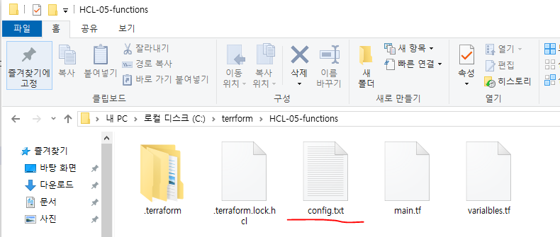

this is config.txt file

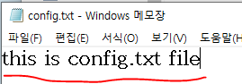

#### cnfig.txt 파일이 있기 때문에 에러가 발생하지 않는다.

```powershell
PS C:\terrform\HCL-05-functions> terraform  plan

Changes to Outputs:
  + joined_fruit      = "apple, banana, cherry"
  + max_value         = 20
  + split-list-output = [
      + "hello",
      + "soldesk",
      + "aws",
      + "terraform",
    ]
  + string_value      = "true"
  + upper_greeting    = "HELLO, TERRAFORM"

# main.tf
check "config_file_exists" {
  assert {
    condition     = fileexists(var.config_path)
    error_message = "Configuration file does not exist at the specified path."
  }
}

locals {
  # fileexists는 파일이 있으면 true 없으면 flase
  # var.config_path 에 파일이 있으면 true 없으면 flase
  file_exists = fileexists(var.config_path)
}

output "file_exists" {
  value = local.file_exists
}

PS C:\terrform\HCL-05-functions> terraform  plan

Changes to Outputs:
  + file_exists       = true
  + joined_fruit      = "apple, banana, cherry"
  + max_value         = 20
  + split-list-output = [
      + "hello",
      + "soldesk",
      + "aws",
      + "terraform",
    ]
  + string_value      = "true"
  + upper_greeting    = "HELLO, TERRAFORM"

# replace()

# main.tf
locals {
  env                = "prod"
  replace_env_result = replace(local.env, "prod", "production")
}

# outputs.tf
output "replace_env_result" {
  value = local.replace_env_result
}

PS C:\terrform\HCL-05-functions> terraform  plan
  + replace_env_result  = "production"

# main.tf
locals {
  env                = "prod"
  replace_env_result = replace(local.env, "prod", "production")

  cidr                = "172.16.1.0/24"
  replace_cidr_result = replace(local.cidr, "172.16", "192.168")
}

# outputs.tf
output "replace_cidr_result" {
  value = local.replace_cidr_result
}

PS C:\terrform\HCL-05-functions> terraform  plan
  + replace_cidr_result = "192.168.1.0/24"
  + replace_env_result  = "production"

# trimspace()

# main.tf
locals {
  text_space       = "   hello terraform ~~!!   "
  trimspace_result = trimspace(local.text_space)
}

# outputs.tf
output "trimspace_result" {
  value = local.trimspace_result
}

PS C:\terrform\HCL-05-functions> terraform  plan
  + trimspace_result    = "hello terraform ~~!!"

# contains()

# main.tf
locals {
  envs            = ["dev", "prod", "test"]
  contains_result = contains(local.envs, "prod")
}

# outputs.tf
output "contains_result" {
  value = local.contains_result
}

PS C:\terrform\HCL-05-functions> terraform  plan
  + contains_result     = true

# length()

# main.tf
# length() : list 또는 문자열의 개수를 리턴
# list = 해당 리스트에 저장된 요소(element)의 개수
# string = 해당 문자열의 개수
locals {
  list_value  = ["10.10.1.0/24", "10.10.2.0/24", "10.10.3.0/24"]
  list_length = length(local.list_value)
}

# outputs.tf
output "list_length" {
  value = local.list_length
}

PS C:\terrform\HCL-05-functions> terraform  plan
  + list_length         = 3

# main.tf
locals {
  list_value  = ["10.10.1.0/24", "10.10.2.0/24", "10.10.3.0/24"]
  list_length = length(local.list_value)

  string_value  = "hello terraform"
  string_length = length(local.string_value)
}

# outputs.tf
output "string_length" {
  value = local.string_length
}

PS C:\terrform\HCL-05-functions> terraform  plan
  + list_length          = 3
  + string_length       = 15

# keys(map), values(map)

# main.tf
# keys(map), values(map)
locals {
  servers = {
    web1 = "t3.micro"
    web2 = "t3.small"
    web3 = "t3.medium"
  }

  result_key   = keys(local.servers)
  result_value = values(local.servers)
}

# outputs.tf
output "result_key" {
  value = local.result_key
}

output "result_value" {
  value = local.result_value
}

PS C:\terrform\HCL-05-functions> terraform  plan
  + result_key          = [
      + "web1",
      + "web2",
      + "web3",
    ]
  + result_value        = [
      + "t3.micro",
      + "t3.small",
      + "t3.medium",
    ]

# 네트워크 함수 cidrsubnet(), cidrhost()

# varialbles.tf
variable "vpc_cidr_block" {
  default = "172.16.0.0/16"
}

# main.tf
locals {
  cidr_value1 = cidrsubnet(var.vpc_cidr_block, 8, 1)
  cidr_value2 = cidrsubnet(var.vpc_cidr_block, 8, 2)
  cidr_value3 = cidrsubnet(var.vpc_cidr_block, 8, 3)
}

# outputs.tf
output "cidr_value1" {
  value = local.cidr_value1
}

output "cidr_value2" {
  value = local.cidr_value2
}

output "cidr_value3" {
  value = local.cidr_value3
}

PS C:\terrform\HCL-05-functions> terraform  plan
  + cidr_value1         = "172.16.1.0/24"
  + cidr_value2         = "172.16.2.0/24"
  + cidr_value3         = "172.16.3.0/24"

# main.tf
locals {
  cidr_value1 = cidrsubnet(var.vpc_cidr_block, 8, 1)
  cidr_value2 = cidrsubnet(var.vpc_cidr_block, 8, 2)
  cidr_value3 = cidrsubnet(var.vpc_cidr_block, 8, 3)

  cidrhost_ip1 = cidrhost(local.cidr_value1, 5)
  cidrhost_ip2 = cidrhost(local.cidr_value2, 7)
  cidrhost_ip3 = cidrhost(local.cidr_value3, 9)
}

# outputs.tf
output "cidrhost_ip1" {
  value = local.cidrhost_ip1
}

output "cidrhost_ip2" {
  value = local.cidrhost_ip2
}

output "cidrhost_ip3" {
  value = local.cidrhost_ip3
}

PS C:\terrform\HCL-05-functions> terraform  plan
  + cidr_value1         = "172.16.1.0/24"
  + cidr_value2         = "172.16.2.0/24"
  + cidr_value3         = "172.16.3.0/24"
  + cidrhost_ip1        = "172.16.1.5"
  + cidrhost_ip2        = "172.16.2.7"
  + cidrhost_ip3        = "172.16.3.9"

# main.tf

# 랜덤 정수 생성
resource "random_integer" "example_int" {
  min = 1   # 생성할 최소 정수값
  max = 100# 생성할 최대 정수값
}

# outputs.tf
output "random_int" {
  value = random_integer.random_int.result
}

PS C:\terrform\HCL-05-functions> terraform  plan
~~~~~~~~~~~~ 중간 생략 ~~~~~~~~~~~~
Plan: 1 to add, 0 to change, 0 to destroy.

Changes to Outputs:
  + host_ip              = "10.0.0.5"
  + random_integer_value = (known after apply)# 아직 값이 결정되지 않아 출력되지 않는다.
  + subnet_cidr          = "10.0.1.0/24"

PS C:\terrform\HCL-05-functions> terraform  apply
~~~~~~~~~~~~ 중간 생략 ~~~~~~~~~~~~
  Enter a value: yes
random_integer.example: Creating...
random_integer.example: Creation complete after 0s [id=98]

Apply complete! Resources: 1 added, 0 changed, 0 destroyed.
Outputs:

random_int = 98

# 랜덤 문자열 생성
resource "random_string" "example_string" {
  length = 8      # 생성할 문자열 길이
  upper   = true   # 대문자 포함 여부
  lower   = true   # 소문자 포함 여부
  numeric= true   # 숫자 포함 여부
  special = false  # 특수문자 포함 여부
}

PS C:\terrform\HCL-05-functions> terraform  apply
Outputs:

random_int = 59
random_str = "2L7jopj!ZJAn?w2N"
```

#### Check, Import

- Terraform 1.5부터는 단순히 리소스를 생성하는 도구를 넘어 검증과 상태 통합까지 코드로 관리하는 도구로 확장되었다.

- 그 핵심이 check 블록과 import 블록 이다.

#### check 블록

- Terraform은 기본적으로
  - 코드 작성
  - terraform plan
  - terraform apply 흐름으로 동작한다.

- 그런데 문제는, 코드 안의 값이 올바른지 특정 조건을 만족하는지 자동으로 검증하지는 않는다.

- 예를 들어
  - 파일 경로가 실제 존재하는지
  - 특정 변수 값이 허용 범위인지
  - 어떤 값이 null이 아닌지 이런 것들은 apply 전에 미리 막는 것이 좋다.

- 이걸 해결하는 기능이 check 블록이다.

- check 블록의 역할
  - check 블록은 Terraform 실행 중 특정 조건이 참인지 검사하는 기능 이다.
  - 즉, 인프라를 만들기 전에 잘못된 설정을 차단하는 안전장치다.

#### 기존 validation과 차이점

- variable validation
  - 변수 값만 검증 가능
  - variable 블록 안에서만 사용

- check 블록
  - 변수, 리소스 속성, 함수 결과 등 Terraform 구성 전체를 대상으로 검증 가능

예제: 파일 존재 여부 검증

```hcl
variable "file_path" {
  default = "./app/config.txt"
}

check "valid_file_path" {
  condition = fileexists(var.file_path)
  error_message = "설정 파일 경로가 존재하지 않거나 접근할 수 없습니다."
}
```

- 동작 흐름
  - 1) Terraform이 plan 단계에서 fileexists 실행
  - 2) 해당 경로가 존재하면 true
  - 3) 존재하지 않으면 false
  - 4) false면 즉시 에러 발생
  - 5) apply 진행되지 않음

- user_data 스크립트 파일 존재 여부 확인
- TLS 인증서 파일 존재 여부 확인
- 외부 설정 파일 체크 같은 상황에서 매우 유용하다.

#### import 블록 이해하기

- 기존 terraform import 방식은 CLI에서만 가능했다.
  - terraform import aws_s3_bucket.example my-existing-bucket

- 문제점
  - 코드에는 기록이 남지 않음
  - 협업 시 누가 import 했는지 알기 어려움
  - 반복 작업 자동화 어려움

- Terraform 1.5 이후 import 블록은 코드 안에 import를 작성할 수 있다.

예시

```hcl
resource "aws_s3_bucket" "example" {
 bucket = "my-existing-bucket-20241027"
}

import {
  to = aws_s3_bucket.example
  id = "my-existing-bucket-20241027"
}
```

- to = 어떤 리소스 블록에 연결할지
- id = 실제 AWS 리소스의 고유 식별자

#### import 블록 동작 흐름

- terraform plan 실행 시
  - 1) Terraform은 import 블록을 읽는다.
  - 2) 지정된 리소스 ID를 조회한다.
  - 3) 해당 리소스를 state에 등록한다.
  - 4) 코드와 실제 리소스를 비교한다.

- 이 과정에서 리소스는 새로 생성되지 않는다. (state에만 등록된다.)

- 이 기능이 왜 중요한가?
  - 이미 운영 중인 인프라
  - 콘솔로 만들어진 리소스
  - 다른 팀이 만든 리소스

- 이걸 Terraform으로 전환해야 하는 상황이 많다.
- 이때 import 블록을 사용하면 기존 인프라를 코드 관리 체계로 편입 할 수 있다.

- import 이후 반드시 해야 할 작업
  - import  -->  plan  -->  코드 수정  -->  동기화

- 왜냐하면 코드와 실제 설정이 다르면 Terraform은 변경하려고 한다.
- 예를 들어 실제 버킷에 versioning이 켜져 있는데 코드에 versioning이 없다면 다음 apply에서 꺼질 수 있다.
그래서 import는 항상 신중하게 진행해야 한다.

#### 실습

```hcl
# main.tf
terraform {
  required_version = ">= 1.9.6" # Terraform의 최소 요구 버전을 1.9.6 이상으로 설정
  required_providers {
    aws = {
      source  = "hashicorp/aws" # AWS 프로바이더의 소스를 HashiCorp 레지스트리로 지정
      version = ">= 5.73.0"     # AWS 프로바이더의 최소 버전을 5.73.0 이상으로 설정
    }
  }
}

provider "aws" {# AWS 프로바이더 설정
  region  = "ap-northeast-2"  # AWS 리전을 ap-northeast-2로 설정
  profile = "default" # AWS CLI의 프로파일 이름을 'my-profile'로 사용
}

# resource "aws_s3_bucket" "example" {
#   bucket        = "my-existing-bucket-123456789012"
#   bucket_prefix = null
#   tags          = {}
#   tags_all      = {}
# }

resource "aws_s3_bucket" "example" {# S3 버킷 리소스 생성
  bucket = "my-existing-bucket-123456789012"# 생성할 S3 버킷 이름을 'my-existing-bucket-20241027'로 지정
}

import {# 기존 S3 버킷을 Terraform 상태와 연결
  to = aws_s3_bucket.example             # Terraform 리소스 'aws_s3_bucket.example'와 연결
  id = "my-existing-bucket-123456789012" # 연결할 기존 버킷 ID (이름)
}

PS C:\terrform\HCL-06-import> terraform init
Initializing the backend...
Initializing provider plugins...
- Finding hashicorp/aws versions matching ">= 5.73.0"...
- Installing hashicorp/aws v6.34.0...
- Installed hashicorp/aws v6.34.0 (signed by HashiCorp)
Terraform has created a lock file .terraform.lock.hcl to record the provider
selections it made above. Include this file in your version control repository
so that Terraform can guarantee to make the same selections by default when
you run "terraform init" in the future.

Terraform has been successfully initialized!

You may now begin working with Terraform. Try running "terraform plan" to see
any changes that are required for your infrastructure. All Terraform commands
should now work.

If you ever set or change modules or backend configuration for Terraform,
rerun this command to reinitialize your working directory. If you forget, other
commands will detect it and remind you to do so if necessary.

# 아직 my-existing-bucket-123456789012 이름의 S3 Bucket이 없기 때문에 에러 발생
PS C:\terrform\HCL-06-import> terraform plan
aws_s3_bucket.example: Preparing import... [id=my-existing-bucket-123456789012]
aws_s3_bucket.example: Refreshing state... [id=my-existing-bucket-123456789012]

Planning failed. Terraform encountered an error while generating this plan.

╷
│ Error: Cannot import non-existent remote object
│
│ While attempting to import an existing object to "aws_s3_bucket.example", the provider detected that no object exists with the given id. Only
│ pre-existing objects can be imported; check that the id is correct and that it is associated with the provider's configured region or endpoint, or use
│ "terraform apply" to create a new remote object for this resource.
```

- Amazon S3  -->  버킷  -->  버킷 만들기

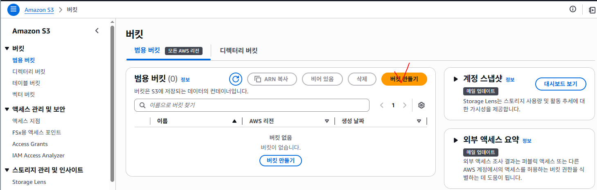

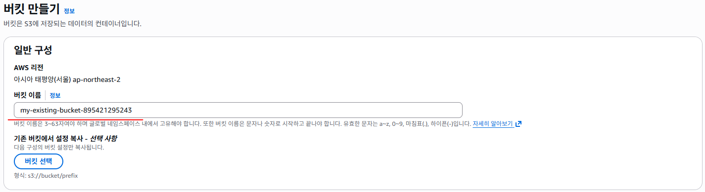


```powershell
PS C:\terrform\HCL-06-import> terraform plan
aws_s3_bucket.example: Preparing import... [id=my-existing-bucket-123456789012]
aws_s3_bucket.example: Refreshing state... [id=my-existing-bucket-123456789012]

Terraform will perform the following actions:

  # aws_s3_bucket.example will be imported
    resource "aws_s3_bucket" "example" {
        acceleration_status       = null
        arn                         = "arn:aws:s3:::my-existing-bucket-123456789012"
        bucket                      = "my-existing-bucket-123456789012"
        bucket_domain_name          = "my-existing-bucket-123456789012.s3.amazonaws.com"
        bucket_prefix               = null
        bucket_region               = "ap-northeast-2"
        bucket_regional_domain_name= "my-existing-bucket-123456789012.s3.ap-northeast-2.amazonaws.com"
        force_destroy               = false
        hosted_zone_id              = "Z3W03O7B5YMIYP"
        id                          = "my-existing-bucket-123456789012"
        object_lock_enabled         = false
        policy                      = null
        region                      = "ap-northeast-2"
        request_payer               = "BucketOwner"
        tags                        = {}
        tags_all                    = {}

~~~~~~~~~~~~~~~~~~~~~ 중간 생략 ~~~~~~~~~~~~~~~~~~~~~

        versioning {
            enabled    = false
            mfa_delete = false
        }
    }

Plan: 1 to import, 0 to add, 0 to change, 0 to destroy.

PS C:\terrform\HCL-06-import> terraform apply
aws_s3_bucket.example: Preparing import... [id=my-existing-bucket-123456789012]
aws_s3_bucket.example: Refreshing state... [id=my-existing-bucket-123456789012]

Terraform will perform the following actions:

  # aws_s3_bucket.example will be imported
    resource "aws_s3_bucket" "example" {

~~~~~~~~~~~~~~~~~~~~~ 중간 생략 ~~~~~~~~~~~~~~~~~~~~~

Plan: 1 to import, 0 to add, 0 to change, 0 to destroy.

Do you want to perform these actions?
  Terraform will perform the actions described above.
  Only 'yes' will be accepted to approve.

  Enter a value: yes

aws_s3_bucket.example: Importing... [id=my-existing-bucket-123456789012]
aws_s3_bucket.example: Import complete [id=my-existing-bucket-123456789012]

Apply complete! Resources: 1 imported, 0 added, 0 changed, 0 destroyed.
```

- terraform.tfstate 파일을 확인해보면 S3 버킷이 Terraform에 의해 관리되고 있다.

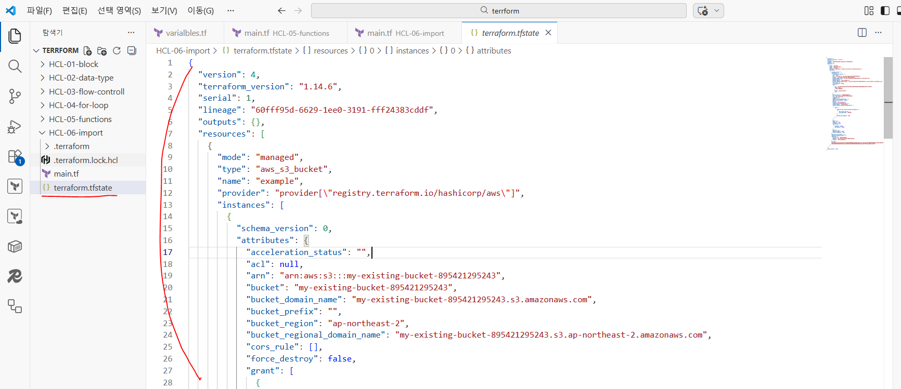

```powershell
PS C:\terrform\HCL-06-import> terraform  state  show  AWS_s3_bucket.example

# terraform에 의해 관리되기 때문에 S3 버킷이 삭제된다.
PS C:\terrform\HCL-06-import> terraform destroy  -auto-approve
aws_s3_bucket.example: Refreshing state... [id=my-existing-bucket-123456789012]

Terraform used the selected providers to generate the following execution plan. Resource actions are indicated with the following symbols:
  - destroy

Terraform will perform the following actions:

  # aws_s3_bucket.example will be destroyed
~~~~~~~~~~~~~~~~~~~~~ 중간 생략 ~~~~~~~~~~~~~~~~~~~~~
Plan: 0 to add, 0 to change, 1 to destroy.
aws_s3_bucket.example: Destroying... [id=my-existing-bucket-123456789012]
aws_s3_bucket.example: Destruction complete after 0s

Destroy complete! Resources: 1 destroyed
```

- AWS S3 버킷을 확인하게되면 버킷이 확인되지 않는다.

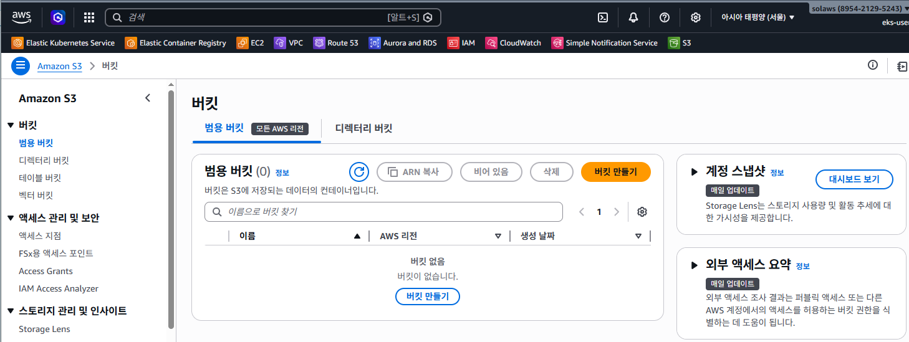

#### Terraform Module

- Terraform에서 모듈(Module)은 리소스들을 하나의 논리적 단위로 묶은 재사용 가능한 구성 단위이다.

- 쉽게 말하면 인프라 설계 블록을 캡슐화한 재사용 패키지이다.

#### 모든 Terraform 프로젝트는 이미 하나의 모듈이다

- Terraform에서 현재 작업 중인 디렉토리 자체가 이미 하나의 루트 모듈(Root Module)이다.

- 우리가 main.tf, variables.tf를 작성하는 현재 폴더
- terraform init, plan, apply를 실행하는 위치 이 자체가 루트 모듈이다.
그리고 우리가 따로 만들어서 불러오는 모듈을 하위 모듈(Child Module)이라고 한다.

#### 모듈이 왜 필요한가?

- 예를 들어 dev 환경, stage 환경, prod 환경 각각에 VPC, Subnet, IGW, NAT, Route Table을 만들어야 한다.

- 모듈 없이 작성하면 같은 코드가 3번 반복된다.

- 이건 다음과 같은 문제를 만든다.
  - 코드 중복
  - 수정 시 3곳을 모두 수정
  - 실수 발생 가능성 증가
  - 유지보수 비용 증가

- 모듈을 사용하면
  - 한 번 정의
  - 여러 환경에서 재사용
  - 버전 관리 가능
  - 표준화 가능

- 즉, 모듈은 인프라의 라이브러리화다.

#### 모듈의 기본 구조

- Terraform 모듈은 보통 다음 3개 파일로 구성된다.

```
1) main.tf
```

- 모듈의 핵심 로직이 들어가는 파일이다.

- 예를 들어 VPC 모듈이라면
  - aws_vpc
  - aws_subnet
  - aws_internet_gateway
  - aws_route_table 등이 여기 정의된다.

- 즉, "무엇을 만들 것인가"가 들어간다.

```
2) variables.tf
```

- 모듈이 외부로부터 받아야 할 입력값을 정의한다.

- 예:
  - vpc_name
  - cidr_block
  - subnet_count

- 이 파일이 중요한 이유는 모듈을 재사용 가능하게 만드는 핵심 요소가 변수이기 때문이다.

```
3) outputs.tf
```

- 모듈이 생성한 리소스의 결과를 외부에 반환하는 파일이다.

- 예:
  - vpc_id
  - subnet_ids
  - security_group_id

- 이 출력값이 있어야 다른 모듈과 연결할 수 있다.

#### 루트 모듈과 하위 모듈 관계

루트 모듈은 실제 실행 지점이다.

예를 들어 프로젝트 구조가 이렇게 있다고 하자:

project-name/
├── dev/
│      ├── main.tf
│      ├── variables.tf
│      └── outputs.tf
├── prod/
│      ├── main.tf
│      ├── variables.tf
│      └── outputs.tf
├── test/
│      ├── main.tf
│      ├── variables.tf
│      └── outputs.tf
└── modules/
└── vpc/
├── main.tf
├── variables.tf
└── outputs.tf

- 루트 모듈에서 이렇게 호출한다.

```hcl
module "vpc" {
  source     = "./modules/vpc"
  vpc_name   = "my-vpc"
  cidr_block = "10.0.0.0/16"
}
```

- 여기서 중요한 포인트는

#### module "vpc": 모듈 호출 블록

#### source: 모듈 위치

#### 아래 변수들: 모듈에 전달하는 입력값

#### 모듈을 활용한 베스트 권장 구성

1) 코드 재사용성
- dev, stage, prod에서 동일한 인프라 구조를 쓸 경우
- 모듈을 만들면 코드 중복을 제거할 수 있다.

- 특히 기업에서는
  - 네트워크 표준
  - 보안 표준
  - 태그 표준을 모듈로 만들어서 모든 프로젝트가 동일한 구조를 쓰게 한다.

2) 모듈 버전 관리
- 실무에서는 모듈을 Git으로 관리한다.
  - 예 : source = "git::https://github.com/company/vpc-module.git?ref=v1.0.0"
  - v1.0.0 고정
  - 안정성 확보
  - 무분별한 변경 방지

3) 입력과 출력 명확화
- 좋은 모듈은
  - 입력 변수 최소화
  - 출력값 명확화
  - 의존성 단순화가 특징이다.

4) 단일 책임 원칙
- 좋은 모듈은 하나의 역할만 한다.
- 예:
  - VPC 모듈
  - EC2 모듈
  - RDS 모듈
  - EKS 모듈 이렇게 분리하는 게 좋다.

- VPC + EC2 + RDS 다 포함한 거대 모듈은 유지보수에 매우 불리하다.

5) 버전 고정 필수
- 공유 모듈은 반드시 버전을 고정해야 한다.
그렇지 않으면 누군가 모듈 수정 모든 프로젝트 영향을 받고 장애가 발생할 수 있다.

#### VPC 생성 모듈 실습

- HCL-07-module 폴더 생성 : main.tf, outputs.tf 파일 생성
- HCL-07-module/modules/vpc 폴더 생성: main.tf, outputs.tf, variables.tf 파일 생성

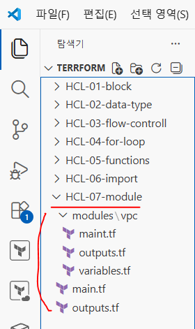

```hcl
# ./module/vpc/main.tf
resource "aws_vpc" "sol_vpc" {
  cidr_block = var.cidr_block
  tags = {
    name = var.vpc_name
  }
}

# ./module/vpc/outputs.tf
output "vpc_id" {
  description = "vpc_id_print"
  value       = aws_vpc.sol_vpc.id
}

# ./module/vpc/varialbles.tf
variable "cidr_block" {
  description = "VPC CIDR-Block"
  type        = string
  default     = "172.16.0.0/16"
}

variable "vpc_name" {
  description = "VPC Name"
  type        = string
  default     = "my-vpc"
}

# main.tf
terraform {
  required_version = "> 1.9.8"
  required_providers {
    aws = {
      source  = "hashicorp/aws"
      version = "5.73.0"
    }
  }
}

provider "aws" {
  region  = "ap-northeast-2"
  profile = "default"
}

module "my_vpc" {
  source = "./modules/vpc"

  # variables.tf 정보
  vpc_name   = "my_vpc"
  cidr_block = "10.0.0.0/16"
}

# ./module/vpc/outputs.tf
output "vpc_id" {
  value = module.my_vpc.vpc_id
}

PS C:\terrform\HCL-07-module> terraform  plan

Terraform used the selected providers to generate the following execution plan. Resource actions are indicated with the following symbols:
  + create

Terraform will perform the following actions:

  # module.my_vpc.aws_vpc.sol_vpc will be created
  + resource "aws_vpc" "sol_vpc" {
~~~~~~~~~~~~~~~~~~~~~~~~~~~~ 중간 생략 ~~~~~~~~~~~~~~~~~~~~~~~~~~~~
      + tags                                 = {
          + "name" = "my_vpc"
        }
      + tags_all                             = {
          + "name" = "my_vpc"
Plan: 1 to add, 0 to change, 0 to destroy.

Changes to Outputs:
  ~ vpc_id = "vpc-04e32c99daa08436f" -> (known after apply)

Note: You didn't use the -out option to save this plan, so Terraform can't guarantee to take exactly these actions if you run "terraform apply"
now.

PS C:\terrform\HCL-07-module> terraform  apply  -auto-approve

Terraform used the selected providers to generate the following execution plan. Resource actions are indicated with the following symbols:
  + create

Terraform will perform the following actions:

  # module.my_vpc.aws_vpc.sol_vpc will be created
  + resource "aws_vpc" "sol_vpc" {
~~~~~~~~~~~~~~~~~~~~~~~~~~~~ 중간 생략 ~~~~~~~~~~~~~~~~~~~~~~~~~~~~
Plan: 1 to add, 0 to change, 0 to destroy.

Changes to Outputs:
  ~ vpc_id = "vpc-04e32c99daa08436f" -> (known after apply)
module.my_vpc.aws_vpc.sol_vpc: Creating...
module.my_vpc.aws_vpc.sol_vpc: Creation complete after 2s [id=vpc-0d66e697d12ea0ed2]

Apply complete! Resources: 1 added, 0 changed, 0 destroyed.

Outputs:

vpc_id = "vpc-0d66e697d12ea0ed2"
```

- VPC 생성 확인

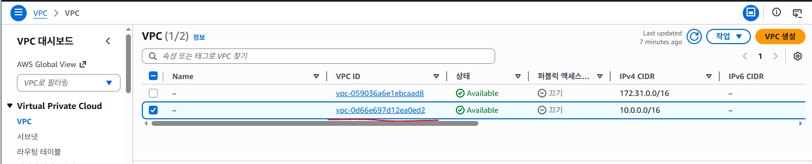

- CIDR 정보 확인

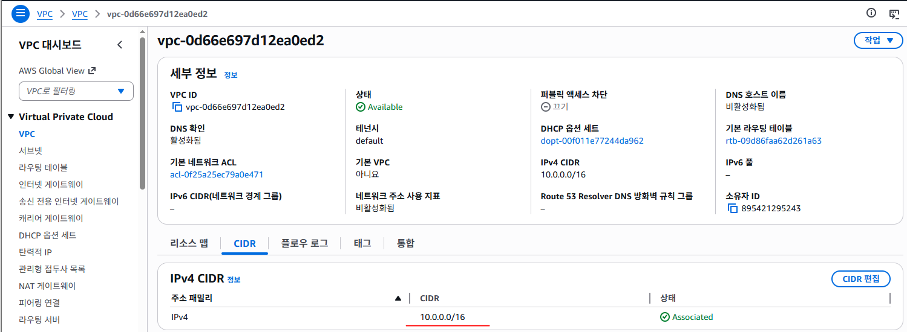

- 태그 정보 확인

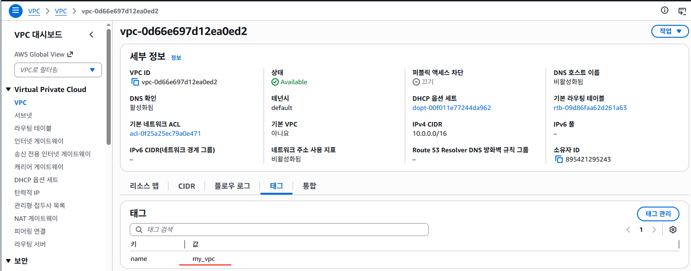

```hcl
# main.tf
terraform {
  required_version = "> 1.9.8"
  required_providers {
    aws = {
      source  = "hashicorp/aws"
      version = "5.73.0"
    }
  }
}

provider "aws" {
  region  = "ap-northeast-2"
  profile = "default"
}

module "my_vpc" {
  source = "./modules/vpc"

  # variables.tf 정보
  vpc_name   = "your_vpc"
  cidr_block = "10.10.0.0/16"
}
```

- CIDR은 한번 할당하게되면 변경이 불가능하다.
- 만약 이상태에서 terraform  apply를 실행하게되면 기존 vpc는 삭제되고 새로운 vpc를 생성한다.

```powershell
PS C:\terrform\HCL-07-module> terraform  apply  -auto-approve
module.my_vpc.aws_vpc.sol_vpc: Refreshing state... [id=vpc-04e32c99daa08436f]

Note: Objects have changed outside of Terraform

Terraform detected the following changes made outside of Terraform since the last "terraform apply" which may have affected this plan:

  # module.my_vpc.aws_vpc.sol_vpc has been deleted
  - resource "aws_vpc" "sol_vpc" {
      - id                                   = "vpc-04e32c99daa08436f" -> null
        tags                                 = {
            "name" = "my_vpc"
        }
        # (19 unchanged attributes hidden)
    }
~~~~~~~~~~~~~~~~~~~~~~~~~~~~ 중간 생략 ~~~~~~~~~~~~~~~~~~~~~~~~~~~~
Plan: 1 to add, 0 to change, 1 to destroy.

Changes to Outputs:
  ~ vpc_id = "vpc-0d66e697d12ea0ed2" -> (known after apply)
module.my_vpc.aws_vpc.sol_vpc: Destroying... [id=vpc-0d66e697d12ea0ed2]
module.my_vpc.aws_vpc.sol_vpc: Destruction complete after 1s
module.my_vpc.aws_vpc.sol_vpc: Creating...
module.my_vpc.aws_vpc.sol_vpc: Creation complete after 1s [id=vpc-0f69376c7bf1f07cf]

Apply complete! Resources: 1 added, 0 changed, 1 destroyed.

Outputs:

vpc_id = "vpc-0f69376c7bf1f07cf

# AWS 접속 후 CIDR , tag 정보 확인

PS C:\terrform\HCL-07-module> terraform  destroy  -auto-approve
```
