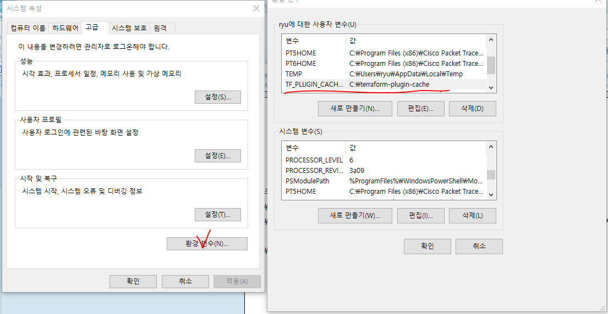
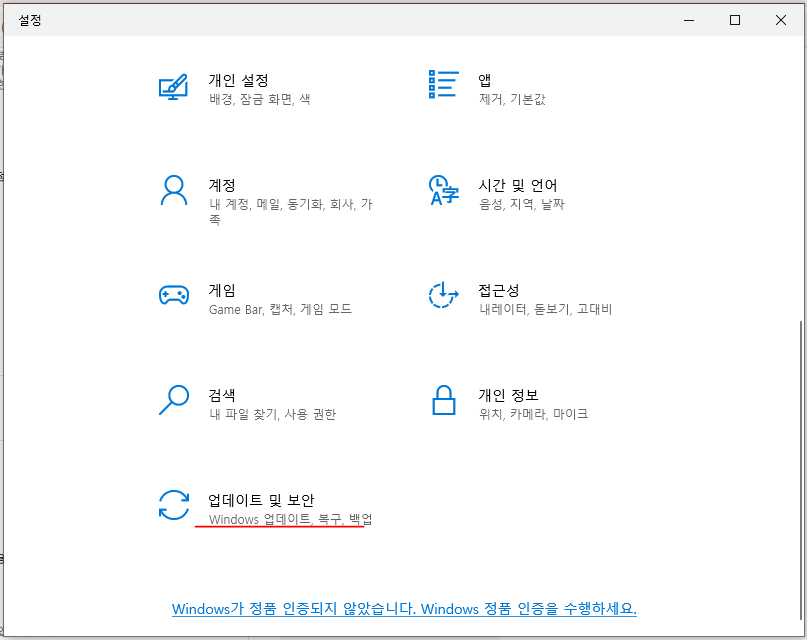
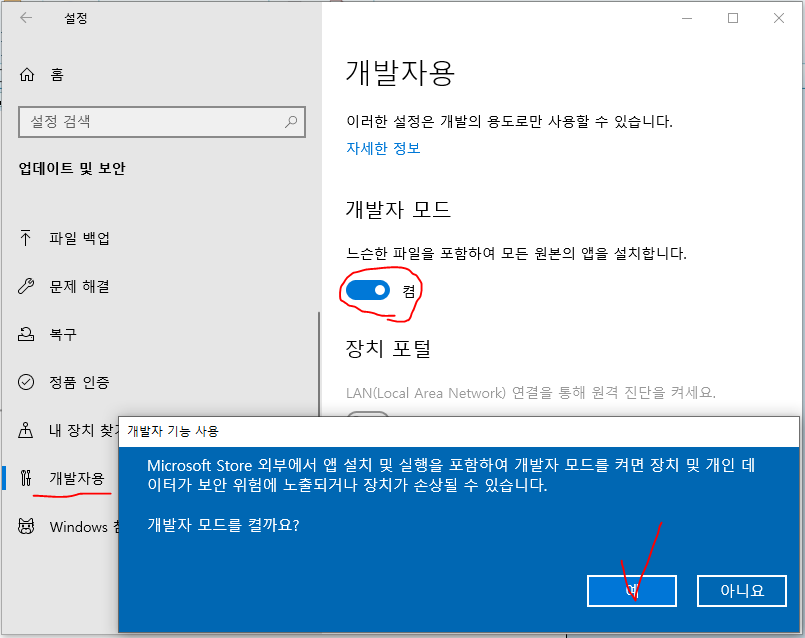
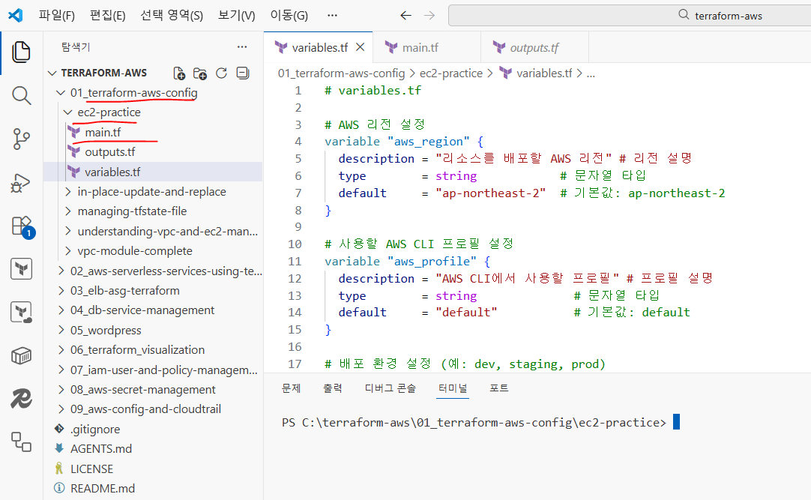
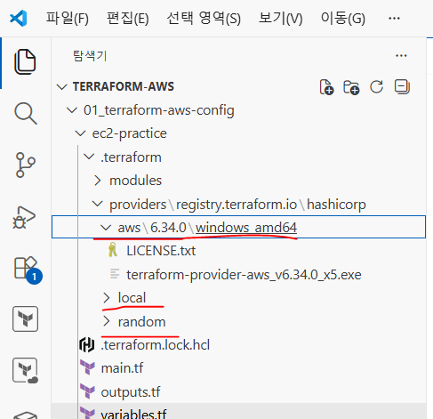
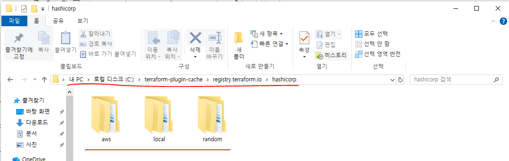
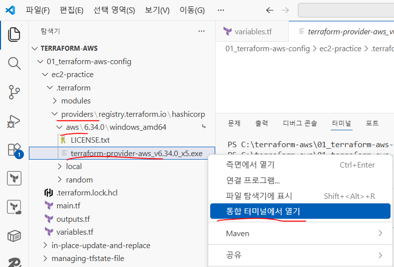

# Terraform - Provider

## 이론

#### Terraform 프로바이더 이해

- Terraform에서 프로바이더(Provider)는 Terraform이 외부 시스템과 통신할 수 있도록 해주는 플러그인이다.

- Terraform 자체는 단순히 인프라를 정의하는 코드 도구일 뿐이며,
실제로 AWS나 GCP 같은 클라우드에 접속하여 리소스를 생성하거나 삭제하는 기능은 프로바이더가 담당한다.
즉 Terraform이 직접 AWS API를 호출하는 것이 아니라 AWS Provider 플러그인을 통해 AWS API와 통신한다.

- 예를 들어 AWS Provider를 사용하면 Terraform 코드로 다음과 같은 AWS 리소스를 관리할 수 있다.
  - EC2 인스턴스 생성
  - VPC 네트워크 구성
  - S3 버킷 생성
  - IAM 사용자 및 정책 관리
  - ALB / ASG / RDS 생성

- 따라서 Terraform에서 프로바이더는 Terraform과 클라우드 서비스 사이의 연결 역할을 하는 핵심 구성 요소이다.

#### Terraform AWS 프로바이더 구성

- Terraform에서 AWS 리소스를 생성하려면 AWS Provider를 먼저 설정해야 한다.

- AWS Provider 설정에는 다음과 같은 요소가 필요하다.
  - 1 어떤 클라우드를 사용할 것인지 지정
  - 2 어떤 리전(region)에 리소스를 생성할 것인지 지정
  - 3 AWS에 접근하기 위한 인증 정보 설정

#### 1) AWS 프로바이더 기본 설정

- Terraform에서 AWS를 사용하려면 provider 블록을 작성해야 한다.

- 예시 코드

```hcl
provider "aws" {
  region = "ap-northeast-2"
}
```

- provider: Terraform에서 사용할 프로바이더를 정의하는 키워드
- aws: AWS 클라우드 프로바이더를 사용한다는 의미
- region: 리소스를 생성할 AWS 리전
- Terraform은 이 설정을 통해 어느 AWS 리전에 리소스를 생성할지 결정한다.

#### 2) AWS 인증 정보 설정

- Terraform이 AWS 리소스를 생성하려면 AWS API에 접근할 수 있는 인증 정보(credentials)가 필요하다.

- Terraform은 여러 가지 방법으로 인증 정보를 가져올 수 있다.

- 대표적인 방식은 다음 세 가지이다.

1) 환경 변수 방식

- AWS CLI에서 사용하는 환경 변수를 그대로 사용할 수 있다.

- Linux/Mac 환경
  - export AWS_ACCESS_KEY_ID="your-access-key-id"
  - export AWS_SECRET_ACCESS_KEY="your-secret-access-key"

- Windows 환경
  - setx AWS_ACCESS_KEY_ID "your-access-key-id"
  - setx AWS_SECRET_ACCESS_KEY "your-secret-access-key"

- 이 방법은 Terraform 실행 환경에서 자동으로 AWS 인증을 사용하게 된다.

- 장점
  - CI/CD 환경에서 사용하기 좋음
  - GitHub Actions 등 자동화 환경에 적합

```
2) AWS credentials 파일 사용
```

- AWS CLI를 설치하면 다음 경로에 인증 파일이 생성된다.

~/.aws/credentials

예

```hcl
[default]
aws_access_key_id = AKIAxxxx
aws_secret_access_key = xxxxxxxxx
```

- Terraform은 이 파일을 자동으로 읽어 인증을 수행한다.

#### 3) AWS Profile 사용

- 여러 개의 AWS 계정을 사용할 경우 Profile을 지정할 수 있다.

```hcl
provider "aws" {
  region  = "us-east-1"
  profile = "my-profile"
}

예
aws configure --profile dev
aws configure --profile prod
```

- 이렇게 여러 계정을 분리해서 사용할 수 있다.

```powershell
PS C:\Users\ryu> aws configure --profile my-profile
AWS Access Key ID [None]: <ACCESS_KEY_ID>
AWS Secret Access Key [None]: <SECRET_ACCESS_KEY>
Default region name [None]: ap-northeast-2
Default output format [None]: json

# credentials 확인 1 (파워쉘)
PS C:\Users\ryu> type $env:USERPROFILE\.aws\credentials
[default]
aws_access_key_id = your-access-key-id
aws_secret_access_key = your-secret-access-key

# credentials 확인 2 (파워쉘)
PS C:\Users\ryu> notepad $env:USERPROFILE\.aws\credentials
```

#### Terraform Provider 버전 관리

- Terraform Provider는 계속 업데이트되기 때문에 버전을 명시적으로 관리하는 것이 중요하다.

- 버전 관리의 목적
  - 코드 호환성 유지
  - 예기치 않은 업데이트 방지
  - 팀 협업 환경 유지

- Terraform 설정 예시

```hcl
terraform {
  required_version = ">= 1.9.6"

  required_providers {
    aws = {
      source  = "hashicorp/aws"
      version = ">= 5.73.0"
    }
  }
}

required_version
 # 사용 가능한 Terraform 최소 버전

required_providers
 # 사용할 Provider 정의

source
 # Provider 다운로드 위치

version
 # 사용할 Provider 버전
```

#### Terraform 버전 제약 연산자

- Terraform에서는 다양한 버전 조건을 설정할 수 있다.
=: 특정 버전만 사용
!=: 특정 버전 제외
, >=: 해당 버전 이상
<, <=: 해당 버전 이하
~>: Terraform에서 가장 많이 사용하는 연산자 (같은 마이너 버전 범위 내 업데이트 허용)

```
예) version = "~> 5.0"
```

- 가능
  - 5.0 ,  5.1 , 5.2

- 불가능
  - 6.0

- 즉 major 버전 변경은 막고 minor 업데이트만 허용한다.

#### AWS Provider 리소스 목록 확인

- Terraform AWS Provider는 매우 많은 리소스를 제공한다.

- 대표적인 AWS 리소스
  - aws_instance: EC2 인스턴스
  - aws_vpc: VPC 네트워크
  - aws_subnet: 서브넷
  - aws_security_group: 보안 그룹
  - aws_s3_bucket: S3 저장소
  - aws_lb: Application Load Balancer
  - aws_autoscaling_group : Auto Scaling
  - aws_db_instance: RDS 데이터베이스

공식 문서
https://registry.terraform.io/providers/hashicorp/aws/latest/docs

이 문서는 Terraform으로 생성할 수 있는 모든 AWS 리소스의 목록과 사용법을 제공한다.

#### Terraform Provider 플러그인 캐시

- Terraform은 실행 시 필요한 Provider 플러그인을 자동으로 다운로드한다.

- 예) terraform init 실행 시
  - provider binary 다운로드
  - 작업 디렉토리에 저장
  - 주의) 프로젝트가 여러 개 있을 경우 각 프로젝트마다 동일한 Provider를 다시 다운로드한다.

- Provider 크기는 수십 MB ~ 수백 MB이므로 인터넷 환경이 느리면 불편할 수 있다.
- 이를 해결하기 위해 Plugin Cache 기능을 사용할 수 있다.

- Plugin Cache 기능
  - Plugin Cache는 Provider 플러그인을 하나의 공용 디렉토리에 저장하는 기능이다.
  - 즉 여러 Terraform 프로젝트에서 동일한 Provider를 공유할 수 있다.

- 장점
  - terraform init 속도 개선
  - 네트워크 다운로드 감소
  - 여러 프로젝트에서 동일 Provider 재사용

- Plugin Cache 설정 방법

방법 1) terraform CLI 설정 파일 사용
  - Windows: %APPDATA%\terraform.rc
  - 설정 예시: plugin_cache_dir = "C:\\terraform-plugin-cache"
  - 이 설정을 하면 Terraform이 Provider를 캐시에 저장한다.

방법 2) 환경 변수 설정
  - mkdir C:\terraform-plugin-cache
  - setx TF_PLUGIN_CACHE_DIR "C:\terraform-plugin-cache"
  - 이 방법은 특정 세션 또는 시스템 환경에서 Plugin Cache를 활성화한다.

- Plugin Cache 동작 과정
  - 1): terraform init 실행
  - 2): Terraform이 Provider registry에서 필요한 플러그인 정보를 조회
  - 3): 캐시 디렉토리 확인
  - 4): 캐시에 이미 Provider가 존재하면 다운로드하지 않고 사용
  - 5): 캐시에 없으면 다운로드 후 캐시에 저장
  - 6): 현재 프로젝트 디렉토리에 복사 또는 심볼릭 링크 생성

- 주의 사항
  - Terraform은 한 번 캐시에 추가된 플러그인을 스스로 삭제하지 않는다.
  - 시간이 지나면서 플러그인이 업그레이드됨에 따라 캐시 디렉토리는 여러 사용하지 않는 버전을 ‘
포함하게 될수 있으며, 이러한 버전은 수동으로 삭제해야 한다.
  - 플러그인 캐시 디렉토리는 동시성에 안전하지 않을 수 있음

## 실습

#### Terraform 프로바이더 이해

- Terraform에서 프로바이더(Provider)는 Terraform이 외부 시스템과 통신할 수 있도록 해주는 플러그인이다.

- Terraform 자체는 단순히 인프라를 정의하는 코드 도구일 뿐이며,
실제로 AWS나 GCP 같은 클라우드에 접속하여 리소스를 생성하거나 삭제하는 기능은 프로바이더가 담당한다.
즉 Terraform이 직접 AWS API를 호출하는 것이 아니라 AWS Provider 플러그인을 통해 AWS API와 통신한다.

- 예를 들어 AWS Provider를 사용하면 Terraform 코드로 다음과 같은 AWS 리소스를 관리할 수 있다.
  - EC2 인스턴스 생성
  - VPC 네트워크 구성
  - S3 버킷 생성
  - IAM 사용자 및 정책 관리
  - ALB / ASG / RDS 생성

- 따라서 Terraform에서 프로바이더는 Terraform과 클라우드 서비스 사이의 연결 역할을 하는 핵심 구성 요소이다.

#### Terraform AWS 프로바이더 구성

- Terraform에서 AWS 리소스를 생성하려면 AWS Provider를 먼저 설정해야 한다.

- AWS Provider 설정에는 다음과 같은 요소가 필요하다.
  - 1 어떤 클라우드를 사용할 것인지 지정
  - 2 어떤 리전(region)에 리소스를 생성할 것인지 지정
  - 3 AWS에 접근하기 위한 인증 정보 설정

#### 1) AWS 프로바이더 기본 설정

- Terraform에서 AWS를 사용하려면 provider 블록을 작성해야 한다.

- 예시 코드

```hcl
provider "aws" {
  region = "ap-northeast-2"
}
```

- provider: Terraform에서 사용할 프로바이더를 정의하는 키워드
- aws: AWS 클라우드 프로바이더를 사용한다는 의미
- region: 리소스를 생성할 AWS 리전
- Terraform은 이 설정을 통해 어느 AWS 리전에 리소스를 생성할지 결정한다.

#### 2) AWS 인증 정보 설정

- Terraform이 AWS 리소스를 생성하려면 AWS API에 접근할 수 있는 인증 정보(credentials)가 필요하다.

- Terraform은 여러 가지 방법으로 인증 정보를 가져올 수 있다.

- 대표적인 방식은 다음 세 가지이다.

1) 환경 변수 방식

- AWS CLI에서 사용하는 환경 변수를 그대로 사용할 수 있다.

- Linux/Mac 환경
  - export AWS_ACCESS_KEY_ID="your-access-key-id"
  - export AWS_SECRET_ACCESS_KEY="your-secret-access-key"

- Windows 환경
  - setx AWS_ACCESS_KEY_ID "your-access-key-id"
  - setx AWS_SECRET_ACCESS_KEY "your-secret-access-key"

- 이 방법은 Terraform 실행 환경에서 자동으로 AWS 인증을 사용하게 된다.

- 장점
  - CI/CD 환경에서 사용하기 좋음
  - GitHub Actions 등 자동화 환경에 적합

```
2) AWS credentials 파일 사용
```

- AWS CLI를 설치하면 다음 경로에 인증 파일이 생성된다.

~/.aws/credentials

예

```hcl
[default]
aws_access_key_id = AKIAxxxx
aws_secret_access_key = xxxxxxxxx
```

- Terraform은 이 파일을 자동으로 읽어 인증을 수행한다.

#### 3) AWS Profile 사용

- 여러 개의 AWS 계정을 사용할 경우 Profile을 지정할 수 있다.

```hcl
provider "aws" {
  region  = "us-east-1"
  profile = "my-profile"
}

예
aws configure --profile dev
aws configure --profile prod
```

- 이렇게 여러 계정을 분리해서 사용할 수 있다.

```powershell
PS C:\Users\ryu> aws configure --profile my-profile
AWS Access Key ID [None]: <ACCESS_KEY_ID>
AWS Secret Access Key [None]: <SECRET_ACCESS_KEY>
Default region name [None]: ap-northeast-2
Default output format [None]: json

# credentials 확인 1 (파워쉘)
PS C:\Users\ryu> type $env:USERPROFILE\.aws\credentials
[default]
aws_access_key_id = your-access-key-id
aws_secret_access_key = your-secret-access-key

# credentials 확인 2 (파워쉘)
PS C:\Users\ryu> notepad $env:USERPROFILE\.aws\credentials
```

#### Terraform Provider 버전 관리

- Terraform Provider는 계속 업데이트되기 때문에 버전을 명시적으로 관리하는 것이 중요하다.

- 버전 관리의 목적
  - 코드 호환성 유지
  - 예기치 않은 업데이트 방지
  - 팀 협업 환경 유지

- Terraform 설정 예시

```hcl
terraform {
  required_version = ">= 1.9.6"

  required_providers {
    aws = {
      source  = "hashicorp/aws"
      version = ">= 5.73.0"
    }
  }
}

required_version
 # 사용 가능한 Terraform 최소 버전

required_providers
 # 사용할 Provider 정의

source
 # Provider 다운로드 위치

version
 # 사용할 Provider 버전
```

#### Terraform 버전 제약 연산자

- Terraform에서는 다양한 버전 조건을 설정할 수 있다.
=: 특정 버전만 사용
!=: 특정 버전 제외
, >=: 해당 버전 이상
<, <=: 해당 버전 이하
~>: Terraform에서 가장 많이 사용하는 연산자 (같은 마이너 버전 범위 내 업데이트 허용)

```
예) version = "~> 5.0"
```

- 가능
  - 5.0 ,  5.1 , 5.2

- 불가능
  - 6.0

- 즉 major 버전 변경은 막고 minor 업데이트만 허용한다.

#### AWS Provider 리소스 목록 확인

- Terraform AWS Provider는 매우 많은 리소스를 제공한다.

- 대표적인 AWS 리소스
  - aws_instance: EC2 인스턴스
  - aws_vpc: VPC 네트워크
  - aws_subnet: 서브넷
  - aws_security_group: 보안 그룹
  - aws_s3_bucket: S3 저장소
  - aws_lb: Application Load Balancer
  - aws_autoscaling_group : Auto Scaling
  - aws_db_instance: RDS 데이터베이스

공식 문서
https://registry.terraform.io/providers/hashicorp/aws/latest/docs

이 문서는 Terraform으로 생성할 수 있는 모든 AWS 리소스의 목록과 사용법을 제공한다.

#### Terraform Provider 플러그인 캐시

- Terraform은 실행 시 필요한 Provider 플러그인을 자동으로 다운로드한다.

- 예) terraform init 실행 시
  - provider binary 다운로드
  - 작업 디렉토리에 저장
  - 주의) 프로젝트가 여러 개 있을 경우 각 프로젝트마다 동일한 Provider를 다시 다운로드한다.

- Provider 크기는 수십 MB ~ 수백 MB이므로 인터넷 환경이 느리면 불편할 수 있다.
- 이를 해결하기 위해 Plugin Cache 기능을 사용할 수 있다.

- Plugin Cache 기능
  - Plugin Cache는 Provider 플러그인을 하나의 공용 디렉토리에 저장하는 기능이다.
  - 즉 여러 Terraform 프로젝트에서 동일한 Provider를 공유할 수 있다.

- 장점
  - terraform init 속도 개선
  - 네트워크 다운로드 감소
  - 여러 프로젝트에서 동일 Provider 재사용

- Plugin Cache 설정 방법

방법 1) terraform CLI 설정 파일 사용
  - Windows: %APPDATA%\terraform.rc
  - 설정 예시: plugin_cache_dir = "C:\\terraform-plugin-cache"
  - 이 설정을 하면 Terraform이 Provider를 캐시에 저장한다.

방법 2) 환경 변수 설정
  - mkdir C:\terraform-plugin-cache
  - setx TF_PLUGIN_CACHE_DIR "C:\terraform-plugin-cache"
  - 이 방법은 특정 세션 또는 시스템 환경에서 Plugin Cache를 활성화한다.

- Plugin Cache 동작 과정
  - 1): terraform init 실행
  - 2): Terraform이 Provider registry에서 필요한 플러그인 정보를 조회
  - 3): 캐시 디렉토리 확인
  - 4): 캐시에 이미 Provider가 존재하면 다운로드하지 않고 사용
  - 5): 캐시에 없으면 다운로드 후 캐시에 저장
  - 6): 현재 프로젝트 디렉토리에 복사 또는 심볼릭 링크 생성

- 주의 사항
  - Terraform은 한 번 캐시에 추가된 플러그인을 스스로 삭제하지 않는다.
  - 시간이 지나면서 플러그인이 업그레이드됨에 따라 캐시 디렉토리는 여러 사용하지 않는 버전을 ‘
포함하게 될수 있으며, 이러한 버전은 수동으로 삭제해야 한다.
  - 플러그인 캐시 디렉토리는 동시성에 안전하지 않을 수 있음

#### 파워쉘 업데이트

```powershell
PS C:\Users\soldesk> winget install --id Microsoft.PowerShell --source winget
찾음 PowerShell [Microsoft.PowerShell] 버전 7.6.6.0
이 응용 프로그램의 라이선스는 그 소유자가 사용자에게 부여했습니다.
Microsoft는 타사 패키지에 대한 책임을 지지 않고 라이선스를 부여하지도 않습니다.
설치 관리자 해시를 확인했습니다.
패키지 설치를 시작하는 중...
  ██████████████████████████████  100%
설치 성공

PS C:\Users\soldesk> pwsh
PowerShell 7.6.6

# 명령어를 전부 검정색으로 변환

PS C:\Users\soldesk> notepad $PROFILE
```

- 메모장에 작성 후 저장

```hcl
Set-PSReadLineOption -Colors @{
    Command   = 'Black'
    Parameter = 'Black'
    Operator  = 'Black'
    Variable  = 'Black'
    String    = 'Black'
    Number    = 'Black'
}

# cmd 관리자 권한 실행

C:\WINDOWS\system32> mkdir C:\terraform-plugin-cache# 폴더 생성

C:\WINDOWS\system32> setx TF_PLUGIN_CACHE_DIR "C:\terraform-plugin-cache"# 환경 변수 설정
성공: 지정한 값을 저장했습니다.
```



#### 윈도우 사용시 심볼릭 링크 제한

- Windows에서는 기본적으로 일반 사용자에게 심볼릭 링크(Symbolic Link) 생성 권한이 제한되어 있다.
그래서 mklink 명령을 실행하면 다음과 같은 오류가 발생할 수 있다.

```
C:\WINDOWS\system32> mklink TestLink TestTarget
You do not have sufficient privilege to perform this operation.
```

- 이 메시지는 현재 사용자 계정이 심볼릭 링크를 생성할 권한이 없다는 의미이다.

- 심볼릭 링크(Symbolic Link)
  - 심볼릭 링크는 특정 파일이나 폴더를 다른 위치에서 가리키도록 만드는 링크 파일이다.
  - 원본 파일  -->  실제 위치
  - 링크 파일  -->  원본 파일을 가리키는 바로가기

```
예) C:\real-folder\data.txt
```

- 심볼릭 링크 생성
  - mklink C:\link\data.txt  C:\real-folder\data.txt
  - 그러면 C:\link\data.txt 파일을 열어도 실제로는 C:\real-folder\data.txt 파일이 사용된다.
  - 즉 같은 파일을 여러 위치에서 접근할 수 있도록 하는 기능이다.

- Terraform은 terraform init 실행 시 Provider 플러그인을 다운로드한다.

- Plugin Cache를 사용하는 경우 Terraform은 다음과 같은 방식으로 동작한다.
1) Provider를 캐시 디렉토리에 저장
  - C:\terraform-plugin-cache

2) 프로젝트 .terraform 폴더에서 캐시 파일을 참조
  - 이때 파일을 복사하지 않고 심볼릭 링크를 생성할 수 있다.

- 즉 project/.terraform/providers에서 C:\terraform-plugin-cache 에 있는 Provider를 링크 방식으로 연결한다.

- 이 방식의 장점
  - 디스크 공간 절약
  - Provider 재사용
  - terraform init 속도 향상

- 업데이트 및 보안



- 개발자용  -->  개발자 모드 켬  -->  예



#### 임시 테스트

```
C:\WINDOWS\system32> mklink TestLink TestTarget
TestLink <<===>> TestTarget에 대한 기호화된 링크를 만들었습니다.
```

- 심볼릭 링크를 생성하기위해서 terraform  init 진행



```powershell
PS C:\terraform-aws\01_terraform-aws-config\ec2-practice> terraform  init
Initializing the backend...
Initializing modules...
Downloading registry.terraform.io/terraform-aws-modules/vpc/aws 5.15.0 for my_vpc...
- my_vpc in .terraform\modules\my_vpc
Initializing provider plugins...
~~~~~~~~~~~~~~~~~ 중간 생략 ~~~~~~~~~~~~~~~~~
Terraform has been successfully initialized!

You may now begin working with Terraform. Try running "terraform plan" to see
any changes that are required for your infrastructure. All Terraform commands
should now work.

If you ever set or change modules or backend configuration for Terraform,
rerun this command to reinitialize your working directory. If you forget, other
commands will detect it and remind you to do so if necessary.
```



- aws (hashicorp/aws)
  - AWS Provider 즉 Terraform이 AWS 리소스를 생성할 때 사용하는 플러그인이다.
  - 예 : aws_instance, aws_vpc, aws_s3_bucket 같은 리소스를 관리한다.

- local (hashicorp/local)
  - Local Provider는 로컬 컴퓨터에서 파일을 생성하거나 관리할 때 사용한다.

예시

```hcl
resource "local_file" "test" {
  filename = "test.txt"
  content  = "hello terraform"
}
이 리소스를 실행하면 test.txt 파일이 생성된다.
```

- random (hashicorp/random)
  - Random Provider
  - 랜덤 값을 생성할 때 사용한다.
  - 예 : random_id , random_password , random_string

예

```hcl
resource "random_password" "db" {
  length = 16
}
```

- DB 비밀번호 같은 랜덤 값을 생성할 때 사용한다.
- 로컬에도 파일이 같이 생성된다.





#### 버전은 다운로드 받은 것으로 수정해야 한다.

```powershell
PS C:\Users\ryu>
 cd C:\my-terraform\01_EC2_VPC\01-1_EC2\.terraform\providers\registry.terraform.io\hashicorp\aws\6.64.0\windows_amd64

PS C:\terraform-aws\01_terraform-aws-config\ec2-practice\.terraform\providers\registry.terraform.io\
hashicorp\aws\6.34.0\windows_amd64>
Get-Item .\terraform-provider-aws_v6.34.0_x5.exe | Select-Object LinkType, Target

LinkType Target
```

- -------  ------

```json
{C:\terraform-plugin-cache\registry.terraform.io\hashicorp\aws\6.34.0\windows_amd64\terraform-provider-aws_v6.34.0_x5.exe}

# 연결 확인
PS C:\my-terraform\01_EC2_VPC\.terraform\providers\registry.terraform.io\hashicorp\aws\6.64.0\windows_amd64>
$env:TF_PLUGIN_CACHE_DIR
C:\terraform-plugin-cache
```
