# Terraform - EC2 · VPC

## 이론

#### VPC와 EC2의 개념 이해

#### VPC (Virtual Private Cloud)

- VPC는 AWS 클라우드 환경에서 사용자가 직접 네트워크를 설계하고 관리할 수 있는 가상 네트워크 서비스이다.
- 사용자는 AWS 내부에 자신만의 독립적인 네트워크 환경을 만들 수 있으며,
IP 주소 범위, 서브넷, 라우팅 정책 등을 직접 설정할 수 있다.
즉 VPC는 클라우드 상의 데이터센터 네트워크를 직접 설계하는 기능이라고 볼 수 있다.

#### VPC의 주요 구성 요소

- VPC는 여러 네트워크 리소스로 구성된다.

- Subnet (서브넷)
  - VPC 내부에서 IP 주소 범위를 나누어 사용하는 네트워크 영역

- Route Table (라우팅 테이블)
  - 네트워크 트래픽이 어디로 이동할지 결정하는 규칙

- Internet Gateway (인터넷 게이트웨이)
  - VPC 내부 리소스가 인터넷과 통신할 수 있도록 연결하는 장치

- NAT Gateway / NAT Instance
  - Private Subnet이 인터넷에 접근할 수 있도록 중계 역할 수행

- Security Group / Network ACL
  - 네트워크 접근 제어 및 보안 정책 관리

- 이러한 요소들을 조합하여 AWS 네트워크 아키텍처를 구성하게 된다.

#### EC2 (Elastic Compute Cloud)

- EC2는 AWS에서 제공하는 가상 서버 서비스이다.

- 사용자는 필요에 따라 CPU, 메모리, 스토리지, 네트워크 성능 등을 선택하여 서버를 생성할 수 있다.

- EC2는 다음과 같은 특징을 가진다.
  - 클라우드 기반 가상 서버
  - 필요할 때 생성하고 삭제 가능
  - 서버 크기(Instance Type) 자유 선택
  - Auto Scaling 가능
  - 다양한 OS 지원 (Linux, Windows)

- EC2는 대부분 VPC 내부의 Subnet에 배치된다.

- 또한 다음과 같은 보안 및 접속 요소를 사용한다.
  - Security Group : 네트워크 접근 제어
  - Key Pair : SSH 접속 인증

- 주요 특징
  - 안전하고 확장 가능한 컴퓨팅 환경 제공
  - 클라우드에서 컴퓨팅 자원 제공
  - 개발자가 쉽게 서버 환경 구축 가능
  - 웹 기반 관리 인터페이스 제공
  - 컴퓨팅 리소스에 대한 완전한 제어 제공
  - Amazon의 안정적인 인프라에서 실행

EC2 기본 구성 요소

- EC2 인스턴스는 다음과 같은 요소로 구성된다.

```
1) AMI (Amazon Machine Image)
 # EC2 서버를 생성할 때 사용하는 서버 이미지이다.
```

- 포함 내용
  - OS
  - 기본 소프트웨어
  - 설정 정보
  - 예) Amazon Linux, Ubuntu, RedHat, Windows Server

```
2) ENI (Elastic Network Interface)
```

- EC2의 네트워크 인터페이스 카드(NIC) 역할을 한다.

- 기능
  - IP 주소 관리
  - Security Group 연결
  - 네트워크 트래픽 처리

```
3) EBS (Elastic Block Store)
```

- EC2에 연결되는 디스크 스토리지이다.

- 특징
  - 네트워크 기반 블록 스토리지
  - 영구 저장 가능
  - Snapshot 지원
  - SSD / HDD 타입 제공

- EC2 인스턴스 범주
  - AWS는 다양한 목적에 맞는 인스턴스 타입을 제공한다.

- 범용 (General Purpose)
  - 예) T, M
  - 특징 : 웹 서버, 일반 애플리케이션
  - CPU / Memory 균형형

- 컴퓨팅 최적화 (Compute Optimized)
  - 예) C
  - 특징 : CPU 중심 작업, 비디오 인코딩, 고성능 계산

- 메모리 최적화 (Memory Optimized)
  - 예)R, X
  - 특징 : 대형 데이터베이스, 캐시 서버, 빅데이터 분석

- 가속 컴퓨팅 (Accelerated Computing)
  - 예) P, G, F
  - 특징 : GPU 사용, 머신러닝, 과학 계산,그래픽 처리

- 스토리지 최적화 (Storage Optimized)
  - 예) I, D, H
  - 특징 : 대용량 스토리지 처리, 분산 파일 시스템, 로그 분석,

#### EC2 인스턴스 크기

- 인스턴스는 다음과 같은 크기를 가진다.
  - nano
  - micro
  - small
  - medium
  - large
  - xlarge
  - 2xlarge

```
예시)
인스턴스vCPUMemory
a1.medium12GB
a1.large24GB
a1.xlarge48GB
a1.2xlarge816GB
```

#### VPC 네트워크 구조

- VPC는 보통 다음과 같은 구조를 가진다.

VPC
├ Public Subnet
│    └ Web Server
│
├ Private Subnet
│    └ Application Server
│
└ Private Subnet
└ Database

- 구성 요소
  - Internet Gateway
  - Route Table
  - Subnet
  - Security Group

#### Terraform을 활용한 VPC와 EC2 관리 이해

- Terraform을 사용하면 AWS 인프라를 코드로 정의하고 자동으로 배포할 수 있다.
- 이 방식을 Infrastructure as Code (IaC) 라고 한다.

#### Terraform을 통한 VPC 관리

```
1) VPC 생성
```

- Terraform에서 "aws_vpc" 리소스를 사용한다.

예시 코드

```hcl
resource "aws_vpc" "my_vpc" {
  cidr_block = "10.0.0.0/16"
  tags = {
    Name = "MyVPC"
  }
}
```

- 설명
  - resource: Terraform에서 생성할 인프라 리소스를 정의하는 블록
  - aws_vpc: AWS에서 제공하는 VPC 리소스 타입
  - my_vpc: Terraform 내부에서 사용하는 리소스 식별자 (논리적 이름, 다른 리소스에서 참조할 때 사용)
  - cidr_block: VPC에서 사용할 IP 주소 범위  예) 10.0.0.0/16
  - tags: AWS 리소스에 붙이는 태그 정보 (관리 및 식별을 위한 메타데이터)
  - Name = "MyVPC" : AWS 콘솔에서 표시되는 VPC 이름 태그

```
2) Subnet 생성
```

- VPC 내부 네트워크를 분리하기 위해 사용한다.

```hcl
resource "aws_subnet" "public_subnet" {
  vpc_id = aws_vpc.my_vpc.id# ex) vpc-0a3b5c7d9e123456
  cidr_block = "10.0.1.0/24"
  availability_zone = "ap-northeast-2a"
  tags = {
    Name = "PublicSubnet"
  }
}
```

- 설명
  - vpc_id : 어느 VPC에 속하는지 지정
  - cidr_block : 서브넷 IP 범위
  - availability_zone : AZ 위치

```
3) Internet Gateway 생성
```

- VPC가 인터넷과 연결되도록 한다.

```hcl
resource "aws_internet_gateway" "my_igw" {
  vpc_id = aws_vpc.my_vpc.id
  tags = {
    Name = "MyInternetGateway"
  }
}

역할 : VPC  <-->  Internet 연결

4) Route Table 구성
```

- 인터넷 트래픽을 어디로 보낼지 결정한다.

```hcl
resource "aws_route_table" "public_route_table" {
  vpc_id = aws_vpc.my_vpc.id
  route {
    cidr_block = "0.0.0.0/0"
    gateway_id = aws_internet_gateway.my_igw.id
  }
  tags = {
    Name = "PublicRouteTable"
  }
}
```

- 설명 : 0.0.0.0/0 = 모든 트래픽

- 즉 모든 인터넷 트래픽  -->  Internet Gateway

#### Terraform을 통한 EC2 관리

```hcl
1) EC2 생성

resource "aws_instance" "my_ec2" {
  ami = var.ami_id
  instance_type = var.instance_type
  subnet_id = aws_subnet.public_subnet.id
  vpc_security_group_ids = [
    aws_security_group.my_sg.id
  ]

  associate_public_ip_address = var.associate_public_ip
  key_name = aws_key_pair.my_key_pair.key_name

  root_block_device {
    volume_size = 20
    volume_type = "gp3"
    delete_on_termination = true# EC2 삭제시 EBS도 삭제
    encrypted = true
  }
  tags = {
    Name = "MyEC2Instance"
  }
}
```

- 주요 옵션
항목설명
amiOS 이미지
instance_type인스턴스 크기
subnet_id배치할 서브넷
security_group보안 그룹
key_nameSSH 키
root_block_device디스크 설정

```
2) Security Group 설정
```

- 보안 그룹은 EC2의 방화벽 역할을 한다.

```hcl
resource "aws_security_group" "my_sg" {
  vpc_id = aws_vpc.my_vpc.id
  ingress {
    from_port = 22
    to_port = 22
    protocol = "tcp"
    cidr_blocks = ["0.0.0.0/0"]
  }

  egress {
    from_port = 0
    to_port = 0
    protocol = "-1"
    cidr_blocks = ["0.0.0.0/0"]
  }

  tags = {
    Name = "MySecurityGroup"
  }
}
```

- Ingress: 외부  -->  EC2
- Egress: 외부  <--  EC2

- Security Group 적용

```hcl
vpc_security_group_ids = [
  aws_security_group.my_sg.id
]
```

- 생성한 보안 그룹을 EC2에 연결한다.

4) EBS 추가 디스크 설정

- 추가 스토리지를 EC2에 연결할 수 있다.

EBS 생성

```hcl
resource "aws_ebs_volume" "example_volume" {
  availability_zone = "ap-northeast-2"
  size = 10
  type = "gp2"
  encrypted = true

  tags = {
    Name = "ExampleVolume"
  }
}

EC2에 디스크 연결
resource "aws_volume_attachment" "example_attachment" {
  device_name = "/dev/xvdf"
  volume_id = aws_ebs_volume.example_volume.id
  instance_id = aws_instance.my_ec2.id
}
```

- VPC와 EC2 관리 베스트 프랙티스

1. 모듈화
- Terraform 코드를 모듈로 분리

예
vpc module
ec2 module
security module

- 장점
코드 재사용
유지보수 쉬움

2. 변수 활용
IP , instance type 등을 변수로 관리

예

```hcl
variable "instance_type"
```

- 장점
  - 환경마다 설정 변경 가능

3. 태그 활용
- AWS 리소스 관리에 매우 중요

예

```hcl
tags = {
  Name = "WebServer"
  Environment = "dev"
  Project = "TerraformLab"
}
```

- 목적
  - 리소스 식별
  - 비용 관리
  - 자동화

#### 공식 테라폼 AWS 모듈을 활용한 인프라 배포

- Terraform Registry에는 다양한 공개 모듈이 올라와 있고, 그중 terraform-aws-modules 네임스페이스는
AWS 인프라를 빠르게 구성할 수 있도록 만든 대표적인 오픈소스 모듈 모음이다.

- 이 조직은 GitHub에서 다수의 AWS용 모듈 저장소를 운영하고 있고,
Registry에서도 같은 네임스페이스로 배포되고 있다.
즉, 사용자는 VPC, EC2, S3, RDS, EKS 같은 자주 쓰는 AWS 자원을 처음부터 모두 직접 작성하지 않고,
검증된 모듈을 불러와 필요한 값만 넣는 방식으로 인프라를 배포할 수 있다.

- 쉽게 말하면, 공식 모듈이라는 표현은 "HashiCorp가 직접 만든 유일한 정답 코드"라는 뜻이라기보다,
Terraform Registry와 오픈소스 커뮤니티에서 널리 사용되고 유지보수되는 표준형 AWS 모듈 세트다.
특히 terraform-aws-modules 조직은 EC2, VPC, S3, IAM, EKS, RDS 등
핵심 AWS 서비스를 위한 모듈을 지속적으로 관리하고 있다.

- 직접 리소스 설정 방식

```hcl
resource "aws_vpc" ...
resource "aws_subnet" ...
resource "aws_route_table" ...
resource "aws_nat_gateway" ...

모듈 방식:
module "vpc" {
  source = "terraform-aws-modules/vpc/aws"
  ...
}
```

- 즉, 모듈은 여러 resource를 하나의 기능 단위로 묶어놓은 재사용 가능한 패키지다.
- 내가 전부 조립해서 만들 수도 있지만, 검증된 조립 세트를 가져와서 입력값만 바꿔 쓰는 방식이라고 보면 된다.

```
https://registry.terraform.io/search/modules?namespace=terraform-aws-modules

# module을 사용하는 이유

가장 큰 이유는 속도와 안정성이다. 이미 많은 사용자가 써본 구조를 기반으로 만들어져 있어서,
 초보자가 VPC, 서브넷, IGW, NAT, 라우팅, 태그, IAM 연동 등을 하나하나 직접 구현할 때 발생하는 실수를 줄일 수 있다.
 예를 들어 S3 모듈은 버전 관리, 수명 주기, 서버 측 암호화, 로그 전달 정책 등 S3에서 자주 요구되는 기능을
 폭넓게 지원하고, RDS 모듈은 RDS 자원 생성을 위한 루트 모듈과 세부 모듈 구조를 제공한다.
 EKS 모듈 역시 EKS 클러스터 구성에 필요한 다양한 설정과 하위 모듈을 제공한다.

또 하나 중요한 이유는 일관성이다.
학생마다, 팀마다, 회사마다 처음부터 전부 직접 짜면 이름 규칙, 태그 규칙, 변수 구조, 출력값 구조가 다 달라진다.
그런데 공통 모듈을 쓰면 입력 변수와 출력 구조가 어느 정도 표준화되기 때문에 협업과 유지보수가 쉬워진다.
특히 같은 유형의 인프라를 반복 배포해야 하는 교육 환경이나 실무 환경에서는 이 장점이 크다.
```

#### 주요 특징

- 재사용 가능한 검증된 구성
  - terraform-aws-modules는 AWS 자주 쓰는 서비스를 모듈화해두었기 때문에,
사용자는 복잡한 리소스 연결 구조를 매번 새로 짤 필요가 없다.
예를 들어 VPC 모듈 하나만 써도 VPC, 퍼블릭/프라이빗 서브넷, 라우팅, NAT Gateway, 태그 등을
한 번에 관리할 수 있는 패턴을 만들 수 있다. 이는 반복 실습이나 팀 프로젝트에서 큰 장점이다.

- 표준화된 입력 변수와 출력값
  - 잘 만든 모듈은 변수 이름과 출력값이 체계적이다.
그래서 다른 사람이 만든 Terraform 코드도 구조를 비교적 빨리 읽을 수 있다.
예를 들어 vpc_id, private_subnets, public_subnets 같은 출력값을 다음 모듈에서 바로 참조하는 식으로 코드를
계층적으로 구성할 수 있다.

- 기능 확장성과 커스터마이징 가능
  - 모듈은 편한 대신 유연성이 떨어질 것 같지만, 실제로는 대부분 많은 옵션을 제공한다.
  - 예를 들어 S3 모듈은 버전 관리, 수명 주기, 서버 측 암호화, 로깅, 객체 잠금, 다양한 로그 전달 정책까지 지원한다.
  - 즉, 단순히 버킷 하나 만드는 수준이 아니라 부가 기능까지 한 번에 관리할 수 있다.

- 하위 모듈과 조합형 설계
  - 최근 모듈들은 큰 덩어리 하나만 있는 것이 아니라, 상황에 따라 서브모듈로 쪼개어 사용할 수 있다.
  - 예를 들어 EKS 모듈은 클러스터 본체만이 아니라 관련 기능을 서브모듈 형태로 제공하고,
Registry에는 karpenter 같은 하위 모듈도 별도로 확인된다.

#### 장점 정리 보강판

- 시간 절약
  - 직접 리소스를 전부 작성하면, 단순히 VPC 하나여도 서브넷, 라우팅, IGW, NAT, 보안 관련 설정까지 손이 많이 간다.
  - 모듈은 이런 반복 코드를 줄여준다.

- 안정성 향상

#### 많은 사용자가 쓰는 코드 구조를 기반으로 하기 때문에, 기초 단계에서 자주 발생하는 누락 실수나 연결 실수를 줄일 수 있다.

#### 예를 들어 S3 로깅 정책이나 EKS 관련 부가 구성처럼 손이 많이 가는 부분에서 장점이 더 크다.

- 유지보수 편의성
  - 리소스를 직접 수십 개 나열한 코드보다, 모듈 단위로 나눈 코드가 구조적으로 읽기 쉽다.
  - 특히 module.vpc, module.eks, module.rds처럼 구획이 나뉘어 있으면 책임 범위가 분리된다.

- 협업에 유리
  - 실무에서는 한 사람이 모든 AWS 자원을 다 직접 작성하기보다, 검증된 모듈을 조합해 공통 표준을 맞추는 경우가 많다.
  - 모듈 기반 코드는 리뷰, 재사용, 환경 분리(dev/stage/prod)에 유리하다.
  - 이 부분은 Registry와 GitHub의 표준화된 모듈 제공 방식에서 확인할 수 있다.

#### 단점

- 모듈을 쓴다고 AWS 구조를 몰라도 되는 것은 아니다

- VPC 모듈을 쓴다고 해서 서브넷, 라우팅, NAT, IGW 개념을 몰라도 되는 것이 아니다.
오히려 내부에서 어떤 리소스가 생성되는지 이해해야, plan 결과를 읽고 장애를 분석할 수 있다.

- 옵션이 많아서 초보자에게 오히려 어려울 수 있다
  - 모듈은 편하지만, 입력 변수 수가 많아지면 "뭘 꼭 넣어야 하고 뭘 생략해도 되는지"가 헷갈릴 수 있다.
  - 그래서 초급 단계에서는 직접 resource 방식으로 먼저 구조를 배우고, 그다음 모듈로 넘어가는 수업 순서가 가장 좋다.

- 모듈 버전 업그레이드 시 변경 영향이 있을 수 있다
  - 특히 EKS처럼 변화가 빠른 영역은 모듈 내부 동작이나 권장 설정이 달라질 수 있다.

- 모든 상황에 100% 딱 맞는 것은 아니다
  - 조직 표준, 네이밍, 보안정책, 네트워크 구조가 복잡한 경우에는 모듈만으로 부족해서 직접 resource를 섞어 써야 한다.
  - 실무는 "모듈만 사용" 또는 "직접 작성만 사용"의 이분법이 아니라,
공통 영역은 모듈, 특수 영역은 직접 리소스 작성 방식으로 혼합되는 경우가 많다.

#### Terraform in-place update와 replace 이해

- Terraform으로 인프라를 관리할 때 가장 중요한 개념 중 하나는 리소스 변경이 어떻게 적용되는지 이해하는 것이다.

- Terraform은 기존 인프라를 변경할 때 단순히 설정만 바꾸는 것이 아니라,
현재 상태(state)와 코드(configuration)를 비교하여 어떤 방식으로 변경해야 하는지 결정한다.

- 이때 Terraform이 사용하는 두 가지 대표적인 변경 방식이 있다.
  - in-place update
  - replace (recreate)

- 이 두 개념을 이해해야 Terraform plan 결과를 정확히 읽을 수 있고, 운영 환경에서 서비스 중단을 예방할 수 있다.

- Terraform은 리소스를 수정할 때 아래 과정으로 동작한다.
  - Terraform 코드(configuration)를 읽는다.
  - Terraform state 파일을 확인한다.
  - 실제 AWS 리소스 상태를 확인한다.
  - 세 가지를 비교하여 변경 계획을 만든다.

- 이 결과가 바로 terraform plan이다.

- 예를 들어 plan 결과에서 이런 표시가 나온다.
  - ~ update in-place
  - -/+ replace
  - + create
  - - destroy

- 각 의미는 다음과 같다.
표시의미
~기존 리소스 수정
- /+기존 리소스 삭제 후 새로 생성
+새 리소스 생성
- 리소스 삭제

- 여기서 핵심이 되는 개념이 바로 in-place update와 replace이다.

#### in-place update

- in-place update는 기존 리소스를 삭제하지 않고 속성만 수정하는 방식이다.

- 즉 리소스는 그대로 유지되고 일부 설정만 변경된다.

- 이 방식의 특징은 다음과 같다.
  - 리소스 ID가 유지된다
  - 기존 리소스가 삭제되지 않는다
  - 서비스 중단 가능성이 낮다
  - 빠르게 변경 적용 가능

- Terraform이 지원하는 변경 유형 중 가장 안전한 변경 방식이다.

- in-place update 예시 (EC2 인스턴스에서 태그를 변경하는 경우)

```hcl
resource "aws_instance" "example" {
  ami           = "ami-xxxxx"
  instance_type = "t2.micro"

  tags = {
    Name = "MyOldInstance"
  }
}
```

- 태그를 다음과 같이 변경한다.

```hcl
tags = {
  Name = "MyNewInstance"
}
```

- 이 경우 Terraform은 다음과 같이 판단한다.
  - ~ update in-place

- 즉 기존 EC2 인스턴스를 삭제하지 않고 태그만 수정한다.

- 실제 AWS에서는 다음 작업만 수행된다.
  - EC2 인스턴스 유지
  - Tag 값만 변경
  - 서비스 중단 없이 변경된다.

#### replace (recreate)

- replace는 기존 리소스를 삭제하고 새로운 리소스를 생성하는 방식이다.

- Terraform에서 replace는 다음 상황에서 발생한다.
  - 리소스의 기본 속성이 변경된 경우
  - 해당 속성이 immutable 속성인 경우
  - AWS API가 수정(update)을 지원하지 않는 경우

- replace가 발생하면 다음 과정이 실행된다.
  - 기존 리소스 삭제
  - 새 리소스 생성
  - 이 경우 리소스 ID는 유지되지 않는다.

- replace 예시 (EC2 인스턴스의 subnet을 변경하는 경우)

```hcl
resource "aws_instance" "example" {
  subnet_id = aws_subnet.public.id
}
```

- 이를 다음과 같이 변경한다.
  - subnet_id = aws_subnet.private.id

- EC2는 서브넷 이동을 지원하지 않는다.
따라서 Terraform은 다음과 같이 판단한다.
  - -/+ replace

- 실제 동작 과정은 다음과 같다.
  - 기존 EC2 삭제
  - 새로운 EC2 생성
  - 새 subnet에 배치

- 이 과정에서 서비스 중단이 발생할 수 있다.

#### Terraform이 in-place와 replace를 결정하는 기준

- Terraform은 리소스 속성을 두 가지 유형으로 나눈다.

1. Mutable 속성

- 수정이 가능한 속성이다.

- 예
  - 태그 변경
  - 보안 그룹 규칙 변경
  - 일부 정책 변경

- 이 경우 Terraform은 in-place update를 수행한다.

2. Immutable 속성

- 생성 이후 변경할 수 없는 속성이다.

- 예
  - subnet 변경
  - AMI 변경
  - 일부 네트워크 설정

- 이 경우 Terraform은 replace 방식으로 처리한다.
- 즉 기존 리소스를 삭제하고 새로 생성한다.

Replace가 발생하는 주요 사례

#### Terraform에서 replace가 자주 발생하는 사례

1. 네트워크 변경
- 예
  - subnet 변경
  - VPC CIDR 변경
  - 이러한 변경은 리소스 구조 자체를 바꾸기 때문에 replace가 발생한다.

2. 컴퓨팅 리소스 변경
- 예
  - AMI 변경
  - 일부 instance 설정 변경
  - EC2 인스턴스는 AMI를 변경하면 재생성이 필요하다.

3. 의존성 구조 변경
- 리소스 간 의존 관계가 바뀌는 경우도 replace가 발생할 수 있다.
- 예
  - 다른 VPC로 이동
  - 다른 Subnet으로 이동
  - 새로운 네트워크 연결

#### Terraform 변경 시 고려해야 할 사항

- Terraform을 운영 환경에서 사용할 때 가장 중요한 것은 변경으로 인한 서비스 영향 분석이다.
- 특히 replace가 발생하는 경우 다음 문제가 생길 수 있다.
  - 서비스 중단
  - IP 변경
  - DNS 변경
  - 데이터 손실

- 따라서 Terraform에서는 항상 다음 과정을 거쳐야 한다.

- terraform plan
  - 변경 내용 확인
  - 영향 분석
  - terraform apply

plan 단계는 Terraform 운영에서 필수 단계다.

## 실습

#### VPC와 EC2의 개념 이해

#### VPC (Virtual Private Cloud)

- VPC는 AWS 클라우드 환경에서 사용자가 직접 네트워크를 설계하고 관리할 수 있는 가상 네트워크 서비스이다.
- 사용자는 AWS 내부에 자신만의 독립적인 네트워크 환경을 만들 수 있으며,
IP 주소 범위, 서브넷, 라우팅 정책 등을 직접 설정할 수 있다.
즉 VPC는 클라우드 상의 데이터센터 네트워크를 직접 설계하는 기능이라고 볼 수 있다.

#### VPC의 주요 구성 요소

- VPC는 여러 네트워크 리소스로 구성된다.

- Subnet (서브넷)
  - VPC 내부에서 IP 주소 범위를 나누어 사용하는 네트워크 영역

- Route Table (라우팅 테이블)
  - 네트워크 트래픽이 어디로 이동할지 결정하는 규칙

- Internet Gateway (인터넷 게이트웨이)
  - VPC 내부 리소스가 인터넷과 통신할 수 있도록 연결하는 장치

- NAT Gateway / NAT Instance
  - Private Subnet이 인터넷에 접근할 수 있도록 중계 역할 수행

- Security Group / Network ACL
  - 네트워크 접근 제어 및 보안 정책 관리

- 이러한 요소들을 조합하여 AWS 네트워크 아키텍처를 구성하게 된다.

#### EC2 (Elastic Compute Cloud)

- EC2는 AWS에서 제공하는 가상 서버 서비스이다.

- 사용자는 필요에 따라 CPU, 메모리, 스토리지, 네트워크 성능 등을 선택하여 서버를 생성할 수 있다.

- EC2는 다음과 같은 특징을 가진다.
  - 클라우드 기반 가상 서버
  - 필요할 때 생성하고 삭제 가능
  - 서버 크기(Instance Type) 자유 선택
  - Auto Scaling 가능
  - 다양한 OS 지원 (Linux, Windows)

- EC2는 대부분 VPC 내부의 Subnet에 배치된다.

- 또한 다음과 같은 보안 및 접속 요소를 사용한다.
  - Security Group : 네트워크 접근 제어
  - Key Pair : SSH 접속 인증

- 주요 특징
  - 안전하고 확장 가능한 컴퓨팅 환경 제공
  - 클라우드에서 컴퓨팅 자원 제공
  - 개발자가 쉽게 서버 환경 구축 가능
  - 웹 기반 관리 인터페이스 제공
  - 컴퓨팅 리소스에 대한 완전한 제어 제공
  - Amazon의 안정적인 인프라에서 실행

EC2 기본 구성 요소

- EC2 인스턴스는 다음과 같은 요소로 구성된다.

```
1) AMI (Amazon Machine Image)
 # EC2 서버를 생성할 때 사용하는 서버 이미지이다.
```

- 포함 내용
  - OS
  - 기본 소프트웨어
  - 설정 정보
  - 예) Amazon Linux, Ubuntu, RedHat, Windows Server

```
2) ENI (Elastic Network Interface)
```

- EC2의 네트워크 인터페이스 카드(NIC) 역할을 한다.

- 기능
  - IP 주소 관리
  - Security Group 연결
  - 네트워크 트래픽 처리

```
3) EBS (Elastic Block Store)
```

- EC2에 연결되는 디스크 스토리지이다.

- 특징
  - 네트워크 기반 블록 스토리지
  - 영구 저장 가능
  - Snapshot 지원
  - SSD / HDD 타입 제공

- EC2 인스턴스 범주
  - AWS는 다양한 목적에 맞는 인스턴스 타입을 제공한다.

- 범용 (General Purpose)
  - 예) T, M
  - 특징 : 웹 서버, 일반 애플리케이션
  - CPU / Memory 균형형

- 컴퓨팅 최적화 (Compute Optimized)
  - 예) C
  - 특징 : CPU 중심 작업, 비디오 인코딩, 고성능 계산

- 메모리 최적화 (Memory Optimized)
  - 예)R, X
  - 특징 : 대형 데이터베이스, 캐시 서버, 빅데이터 분석

- 가속 컴퓨팅 (Accelerated Computing)
  - 예) P, G, F
  - 특징 : GPU 사용, 머신러닝, 과학 계산,그래픽 처리

- 스토리지 최적화 (Storage Optimized)
  - 예) I, D, H
  - 특징 : 대용량 스토리지 처리, 분산 파일 시스템, 로그 분석,

#### EC2 인스턴스 크기

- 인스턴스는 다음과 같은 크기를 가진다.
  - nano
  - micro
  - small
  - medium
  - large
  - xlarge
  - 2xlarge

```
예시)
인스턴스vCPUMemory
a1.medium12GB
a1.large24GB
a1.xlarge48GB
a1.2xlarge816GB
```

#### VPC 네트워크 구조

- VPC는 보통 다음과 같은 구조를 가진다.

VPC
├ Public Subnet
│    └ Web Server
│
├ Private Subnet
│    └ Application Server
│
└ Private Subnet
└ Database

- 구성 요소
  - Internet Gateway
  - Route Table
  - Subnet
  - Security Group

#### Terraform을 활용한 VPC와 EC2 관리 이해

- Terraform을 사용하면 AWS 인프라를 코드로 정의하고 자동으로 배포할 수 있다.
- 이 방식을 Infrastructure as Code (IaC) 라고 한다.

#### Terraform을 통한 VPC 관리

```
1) VPC 생성
```

- Terraform에서 "aws_vpc" 리소스를 사용한다.

예시 코드

```hcl
resource "aws_vpc" "my_vpc" {
  cidr_block = "10.0.0.0/16"
  tags = {
    Name = "MyVPC"
  }
}
```

- 설명
  - resource: Terraform에서 생성할 인프라 리소스를 정의하는 블록
  - aws_vpc: AWS에서 제공하는 VPC 리소스 타입
  - my_vpc: Terraform 내부에서 사용하는 리소스 식별자 (논리적 이름, 다른 리소스에서 참조할 때 사용)
  - cidr_block: VPC에서 사용할 IP 주소 범위  예) 10.0.0.0/16
  - tags: AWS 리소스에 붙이는 태그 정보 (관리 및 식별을 위한 메타데이터)
  - Name = "MyVPC" : AWS 콘솔에서 표시되는 VPC 이름 태그

```
2) Subnet 생성
```

- VPC 내부 네트워크를 분리하기 위해 사용한다.

```hcl
resource "aws_subnet" "public_subnet" {
  vpc_id = aws_vpc.my_vpc.id# ex) vpc-0a3b5c7d9e123456
  cidr_block = "10.0.1.0/24"
  availability_zone = "ap-northeast-2a"
  tags = {
    Name = "PublicSubnet"
  }
}
```

- 설명
  - vpc_id : 어느 VPC에 속하는지 지정
  - cidr_block : 서브넷 IP 범위
  - availability_zone : AZ 위치

```
3) Internet Gateway 생성
```

- VPC가 인터넷과 연결되도록 한다.

```hcl
resource "aws_internet_gateway" "my_igw" {
  vpc_id = aws_vpc.my_vpc.id
  tags = {
    Name = "MyInternetGateway"
  }
}

역할 : VPC  <-->  Internet 연결

4) Route Table 구성
```

- 인터넷 트래픽을 어디로 보낼지 결정한다.

```hcl
resource "aws_route_table" "public_route_table" {
  vpc_id = aws_vpc.my_vpc.id
  route {
    cidr_block = "0.0.0.0/0"
    gateway_id = aws_internet_gateway.my_igw.id
  }
  tags = {
    Name = "PublicRouteTable"
  }
}
```

- 설명 : 0.0.0.0/0 = 모든 트래픽

- 즉 모든 인터넷 트래픽  -->  Internet Gateway

#### Terraform을 통한 EC2 관리

```hcl
1) EC2 생성

resource "aws_instance" "my_ec2" {
  ami = var.ami_id
  instance_type = var.instance_type
  subnet_id = aws_subnet.public_subnet.id
  vpc_security_group_ids = [
    aws_security_group.my_sg.id
  ]

  associate_public_ip_address = var.associate_public_ip
  key_name = aws_key_pair.my_key_pair.key_name

  root_block_device {
    volume_size = 20
    volume_type = "gp3"
    delete_on_termination = true# EC2 삭제시 EBS도 삭제
    encrypted = true
  }
  tags = {
    Name = "MyEC2Instance"
  }
}
```

- 주요 옵션
항목설명
amiOS 이미지
instance_type인스턴스 크기
subnet_id배치할 서브넷
security_group보안 그룹
key_nameSSH 키
root_block_device디스크 설정

```
2) Security Group 설정
```

- 보안 그룹은 EC2의 방화벽 역할을 한다.

```hcl
resource "aws_security_group" "my_sg" {
  vpc_id = aws_vpc.my_vpc.id
  ingress {
    from_port = 22
    to_port = 22
    protocol = "tcp"
    cidr_blocks = ["0.0.0.0/0"]
  }

  egress {
    from_port = 0
    to_port = 0
    protocol = "-1"
    cidr_blocks = ["0.0.0.0/0"]
  }

  tags = {
    Name = "MySecurityGroup"
  }
}
```

- Ingress: 외부  -->  EC2
- Egress: 외부  <--  EC2

- Security Group 적용

```hcl
vpc_security_group_ids = [
  aws_security_group.my_sg.id
]
```

- 생성한 보안 그룹을 EC2에 연결한다.

4) EBS 추가 디스크 설정

- 추가 스토리지를 EC2에 연결할 수 있다.

EBS 생성

```hcl
resource "aws_ebs_volume" "example_volume" {
  availability_zone = "ap-northeast-2"
  size = 10
  type = "gp2"
  encrypted = true

  tags = {
    Name = "ExampleVolume"
  }
}

EC2에 디스크 연결
resource "aws_volume_attachment" "example_attachment" {
  device_name = "/dev/xvdf"
  volume_id = aws_ebs_volume.example_volume.id
  instance_id = aws_instance.my_ec2.id
}
```

- VPC와 EC2 관리 베스트 프랙티스

1. 모듈화
- Terraform 코드를 모듈로 분리

예
vpc module
ec2 module
security module

- 장점
코드 재사용
유지보수 쉬움

2. 변수 활용
IP , instance type 등을 변수로 관리

예

```hcl
variable "instance_type"
```

- 장점
  - 환경마다 설정 변경 가능

3. 태그 활용
- AWS 리소스 관리에 매우 중요

예

```hcl
tags = {
  Name = "WebServer"
  Environment = "dev"
  Project = "TerraformLab"
}
```

- 목적
  - 리소스 식별
  - 비용 관리
  - 자동화

- Terraform의 data는 이미 존재하는 리소스나 정보를 조회해서 가져오는 기능
- resource를 새로 만드는 경우 최신 AMI나 VPC등의 정보를 모르기때문에
data를 사용하여 조회한 후 해당 값을 사용하여 EC2생성 또는 VPC의 Subnet정보를 읽어온 후 설정할 수 있다.

- 테라폼 설정 폴더 생성

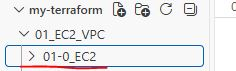

```hcl
# variables.tf
# AWS Region
variable "aws_region" {
  description = "AWS 리전"
  type        = string
  default     = "ap-northeast-2"
}

# AWS CLI Profile
variable "aws_profile" {
  description = "AWS CLI Profile 이름"
  type        = string
  default     = "my_profile"
}

# main.tf
# Terraform 기본 설정
terraform {
  required_version = ">= 1.9.6"

  required_providers {
    aws = {
      source  = "hashicorp/aws"
      version = ">= 5.73.0"
    }
  }
}

# AWS Provider 설정
provider "aws" {
  region  = var.aws_region
  profile = var.aws_profile
}

# main.tf
# 기본 VPC 조회
data "aws_vpc" "default" {
  default = true
}

# output.tf
# VPC CIDR
output "vpc_cidr" {
  value = data.aws_vpc.default.cidr_block
}

PS C:\my-terraform\01_EC2_VPC\01-0_EC2> terraform plan
~~~~~~~~~~ 중간 생략 ~~~~~~~~~~
Changes to Outputs:
  + vpc_id      = "vpc-059036a6e1ebcaad8"

# main.tf
# 기본 VPC에 속한 Subnet 조회
data "aws_subnets" "default_vpc_subnets" {
  filter {
    name   = "vpc-id"
    values = [data.aws_vpc.default.id]
  }
}

# output.tf
# Subnet ID 목록
output "subnet_ids" {
  value = data.aws_subnets.default_vpc_subnets.ids
}

PS C:\my-terraform\01_EC2_VPC\01-0_EC2> terraform plan
~~~~~~~~~~ 중간 생략 ~~~~~~~~~~
Changes to Outputs:
  + subnet_ids  = [
      + "subnet-071eae98af600b530",
      + "subnet-0781ca8c7398818f9",
      + "subnet-0bb5dfa61a36e2fa9",
      + "subnet-02d3252ef3761c45a",
    ]

# main.tf
# 각 Subnet 상세 정보 조회
data "aws_subnet" "subnets" {
  for_each = toset(data.aws_subnets.default_vpc_subnets.ids)

  id = each.value
}

# Subnet 상세 정보
output "subnet_info" {
  value = {
    for id, subnet in data.aws_subnet.subnets : id => {
      cidr_block        = subnet.cidr_block
      availability_zone = subnet.availability_zone
      vpc_id            = subnet.vpc_id
    }
  }
}

PS C:\my-terraform\01_EC2_VPC\01-0_EC2> terraform plan
~~~~~~~~~~ 중간 생략 ~~~~~~~~~~
Changes to Outputs:
  + subnet_info = {
      + subnet-02d3252ef3761c45a = {
          + availability_zone = "ap-northeast-2d"
          + cidr_block        = "172.31.48.0/20"
          + vpc_id            = "vpc-059036a6e1ebcaad8"
        }
      + subnet-071eae98af600b530 = {
          + availability_zone = "ap-northeast-2a"
          + cidr_block        = "172.31.0.0/20"
          + vpc_id            = "vpc-059036a6e1ebcaad8"
        }
      + subnet-0781ca8c7398818f9 = {
          + availability_zone = "ap-northeast-2c"
          + cidr_block        = "172.31.32.0/20"
          + vpc_id            = "vpc-059036a6e1ebcaad8"
        }
      + subnet-0bb5dfa61a36e2fa9 = {
          + availability_zone = "ap-northeast-2b"
          + cidr_block        = "172.31.16.0/20"
          + vpc_id            = "vpc-059036a6e1ebcaad8"
        }
    }

   # main.tf
# 기본 VPC의 Route Table 조회
data "aws_route_tables" "default_vpc_route_tables" {
  vpc_id = data.aws_vpc.default.id
}

   # variables.tf
# Route Table ID 목록 출력
output "default_vpc_route_table_ids" {
  value = data.aws_route_tables.default_vpc_route_tables.ids
}

PS C:\my-terraform\01_EC2_VPC\01-0_EC2> terraform plan
Changes to Outputs:
  + default_vpc_route_tables = [
      + "rtb-068a433a79afadcc6",
    ]

   # main.tf
# 기본 VPC의 Security Group 조회
data "aws_security_groups" "default_vpc_security_groups" {
  filter {
    name   = "vpc-id"
    values = [data.aws_vpc.default.id]
  }
}

   # variables.tf
# Security Group ID 목록 출력
output "default_vpc_security_group_ids" {
  value = data.aws_security_groups.default_vpc_security_groups.ids
}

PS C:\my-terraform\01_EC2_VPC\01-0_EC2> terraform plan
Changes to Outputs:
  + default_sg               = [
      + "sg-08931df02981415d3",
      + "sg-0bfc6f09c2ee697d7",
      + "sg-033b7c296a345d397",
      + "sg-0ef0c6c43843341ad",
      + "sg-0f64759867d60150d",
      + "sg-03b5df6ef2852f3dc",
      + "sg-02709af0870b1c5b7",
      + "sg-07d04c237ab3052b3",
      + "sg-02d25a28aac618242",
      + "sg-0bef46c9e9f9828b6",
    ]

# 최신 Amazon Linux AMI 조회

# main.tf
# 최신 Amazon Linux 2023 AMI 조회
data "aws_ami" "amazon_linux_2023" {

  most_recent = true# 조회 조건에 맞는 AMI가 여러 개일 때, 그중 가장 최신 AMI 1개를 선택
  owners = ["amazon"]

  filter {
    name   = "name"
    values = ["al2023-ami-2023.*-x86_64"]
  }

  filter {
    name   = "architecture"
    values = ["x86_64"]
  }
}

# output.tf
# AMI ID
output "amazon_linux_2023_ami_id" {
  value = data.aws_ami.amazon_linux_2023.id
}

# AMI 이름
output "amazon_linux_2023_ami_name" {
  value = data.aws_ami.amazon_linux_2023.name
}

# AMI Architecture
output "amazon_linux_2023_architecture" {
  value = data.aws_ami.amazon_linux_2023.architecture
}

# AMI Owner ID
output "amazon_linux_2023_owner_id" {
  value = data.aws_ami.amazon_linux_2023.owner_id
}
PS C:\my-terraform\01_EC2_VPC\01-0_EC2> terraform plan
data.aws_ami.amazon_linux_2023: Reading...
data.aws_ami.amazon_linux_2023: Read complete after 1s [id=ami-071eb8c676c4c4bf5]

Changes to Outputs:
  + amazon_linux_2023_ami_id       = "ami-071eb8c676c4c4bf5"
  + amazon_linux_2023_ami_name     = "al2023-ami-2023.12.20260909.0-kernel-6.1-x86_64"
  + amazon_linux_2023_architecture = "x86_64"
  + amazon_linux_2023_owner_id = "123456789012"
```

#### Terraform을 활용한 VPC + EC2 서비스 구성

- 이번 실습에서는 Terraform을 사용하여 VPC, Public Subnet, Internet Gateway,
Route Table, Security Group, Key Pair, EC2 Instance 등의 AWS 리소스를 자동으로 생성한다.

- 기존 Default VPC를 사용하지 않고 Terraform을 이용하여 새로운 VPC 네트워크 환경을 직접 구성한다.
- EC2 인스턴스는 Public Subnet에 생성하고 Public IP를 할당하여 외부에서 SSH로 접속할 수 있도록 구성한다.
- 최신 Amazon Linux 2023 AMI는 AMI ID를 직접 입력하지 않고 AWS Data Source를 이용하여 자동으로 조회한다.

#### Terraform 기본 설정

- Terraform을 실행하기 위한 최소 버전과 사용할 Provider를 설정한다.

- 이번 실습에서는 다음 Provider를 사용한다.
  - AWS Provider
  - Random Provider

- AWS Provider는 AWS 리소스를 생성하기 위해 사용한다.
- Random Provider는 AWS Key Pair 이름이 중복되지 않도록 랜덤 문자열을 생성하기 위해 사용한다.

```hcl
   # main.tf
# Terraform 기본 설정
terraform {
  required_version = ">= 1.16.6"

  required_providers {
    aws = {
      source  = "hashicorp/aws"
      version = "~> 6.62"
    }

    random = {
      source  = "hashicorp/random"
      version = "~> 3.9"
    }
  }
}
```

#### VPC 구성

- AWS Resource를 생성하기 위한 독립적인 가상 네트워크인 VPC를 생성한다.

- 이번 실습에서는 다음 CIDR을 사용한다.
  - VPC CIDR : 10.0.0.0/16

- DNS Support와 DNS Hostname 기능도 활성화한다.

#### Terraform 변수 설정

- 실습에서 변경될 가능성이 있는 값은 variables.tf 파일에서 변수로 관리한다.

#이번 실습에서는 다음 값을 변수로 사용
  - AWS Region
  - AWS CLI Profile
  - VPC CIDR
  - Subnet CIDR
  - Availability Zone
  - EC2 Instance Type
  - Public IP 할당 여부

```hcl
   # variables.tf
#VPC에 할당할 CIDR 블록
variable "vpc_cidr_block" {"
  type        = string
  default     = "10.0.0.0/16"
}

# 서브넷에 할당할 CIDR 블록
variable "subnet_cidr_block" {
  type        = string
  default     = "10.0.1.0/24"
}

# VPC에 할당할 CIDR 블록
variable "vpc_cidr_block" {
  type        = string
  default     = "10.0.0.0/16"
}

# 서브넷을 배치할 가용영역(AZ)
variable "availability_zone" {
  type        = string
  default     = "ap-northeast-2a"
}

# EC2 인스턴스에 퍼블릭 IP 할당 여부
variable "associate_public_ip" {
  type        = bool
  default     = true
}

   # main.tf
# VPC 생성
resource "aws_vpc" "my_vpc" {
  cidr_block = var.vpc_cidr_block

  enable_dns_support   = true
  enable_dns_hostnames = true

  tags = {
    Name = "my-vpc"
  }
}
```

#### 코드 설명

- enable_dns_support: DNS 조회/해석 기능 사용
- enable_dns_hostnames: 리소스에 DNS 호스트 이름 부여

#### Public Subnet 구성

- VPC 내부에 EC2 Instance를 배치하기 위한 Public Subnet을 생성한다.

- 현재 Public Subnet은 다음과 같이 구성한다.
  - VPC       : my-vpc
  - CIDR      : 10.0.1.0/24
  - AZ        : ap-northeast-2a
  - Public IP : 자동 할당 활성화

```hcl
   # main.tf
# Subnet 생성
resource "aws_subnet" "public_subnet" {
  vpc_id = aws_vpc.my_vpc.id

  cidr_block = var.subnet_cidr_block

  availability_zone = var.availability_zone

  map_public_ip_on_launch = true

  tags = {
    Name = "public-subnet"
  }
}
```

#### 코드 설명

- vpc_id
  - Subnet을 생성할 VPC를 지정한다.
  - 앞에서 생성한 my_vpc의 ID를 사용한다.

- cidr_block
  - Subnet에서 사용할 IP 주소 범위를 지정한다.

- availability_zone
  - Subnet을 생성할 Availability Zone을 지정한다.

- map_public_ip_on_launch = true
  - 해당 Subnet에 생성되는 EC2에 Public IP를 자동으로 할당한다.

#### Internet Gateway 구성

- VPC 내부의 Resource가 Internet과 통신하려면 Internet Gateway가 필요하다.
- Internet Gateway를 생성한 후 앞에서 만든 VPC에 연결한다.

```hcl
   # main.tf
# Internet Gateway 생성
resource "aws_internet_gateway" "my_igw" {
  vpc_id = aws_vpc.my_vpc.id

  tags = {
    Name = "my-internet-gateway"
  }
}
```

#### 코드 설명

- aws_internet_gateway
  - VPC가 Internet과 통신할 수 있도록 Internet Gateway를 생성한다.

#### Public Route Table 구성

- Public Subnet에서 Internet으로 나가는 Traffic을
Internet Gateway로 전달하기 위한 Route Table을 생성한다.
- 모든 외부 목적지인 0.0.0.0/0을 Internet Gateway로 전달한다.

```hcl
   # main.tf
# Route Table 생성
resource "aws_route_table" "public_route_table" {
  vpc_id = aws_vpc.my_vpc.id

  route {
    cidr_block = "0.0.0.0/0"
    gateway_id = aws_internet_gateway.my_igw.id
  }

  tags = {
    Name = "public-route-table"
  }
}
```

#### 코드 설명

- cidr_block = "0.0.0.0/0"
  - 모든 외부 목적지 주소를 의미한다.

- gateway_id
  - 0.0.0.0/0으로 이동하는 Traffic을 Internet Gateway로 전달한다.

- 현재 Routing
  - 10.0.0.0/16: local
  - 0.0.0.0/0: Internet Gateway

#### Public Subnet과 Route Table 연결

- Route Table을 생성했다고 Subnet에서 자동으로 사용하는 것은 아니다.

- Public Subnet이 Public Route Table을 사용하도록  Route Table Association을 구성한다.

```hcl
   # main.tf
# Subnet과 Route Table 연결
resource "aws_route_table_association" "public_subnet_association" {
  route_table_id = aws_route_table.public_route_table.id
  subnet_id      = aws_subnet.public_subnet.id
}
```

#### 코드 설명

- route_table_id
  - Public Subnet에서 사용할 Route Table을 지정한다.

- subnet_id
  - Route Table을 연결할 Subnet을 지정한다.

#### Security Group 구성

- EC2 Instance의 Network Traffic을 제어하기 위해 Security Group을 생성한다.
- 현재 실습에서는 SSH 접속을 위해 TCP 22번 Port를 허용한다.
- Outbound Traffic은 모든 Protocol과 모든 목적지에 대해 허용한다.

```hcl
   # main.tf
# Security Group 생성
resource "aws_security_group" "my_sg" {
  vpc_id = aws_vpc.my_vpc.id

  ingress {
    from_port = 22
    to_port   = 22
    protocol = "tcp"
    cidr_blocks = ["0.0.0.0/0"]
  }

  egress {
    from_port = 0
    to_port   = 0
    protocol = "-1"
    cidr_blocks = ["0.0.0.0/0"]
  }

  tags = {
    Name = "my-security-group"
  }
}
```

#### Amazon Linux 2023 AMI 조회

- EC2 Instance를 생성하려면 운영체제 이미지인 AMI가 필요하다.
- AMI ID를 직접 입력하면 Region이나 시점에 따라 AMI ID가 변경될 수 있다.
- 따라서 Data Source를 사용하여 Amazon에서 제공하는 최신 Amazon Linux 2023 AMI를 자동으로 조회한다.

```hcl
   # main.tf
# AMI 조회
data "aws_ami" "al2023" {
  most_recent = true
  owners = ["amazon"]

  filter {
    name   = "name"
    values = ["al2023-ami-2023*-x86_64"]
  }

  filter {
    name   = "architecture"
    values = ["x86_64"]
  }

  filter {
    name   = "root-device-type"
    values = ["ebs"]
  }
}
```

#### EC2 Instance 구성

- 앞에서 구성한 Public Subnet에 EC2 Instance를 생성한다.
- EC2 Instance에는 다음 설정을 적용한다.
  - 최신 Amazon Linux 2023 AMI
  - t3.micro Instance Type
  - Public Subnet
  - Security Group
  - SSH Key Pair
  - Public IP
  - 10GB gp3 EBS
  - EBS 암호화

```hcl
   # variables.tf
# EC2 인스턴스 유형
variable "instance_type" {
  type        = string
  default     = "t3.micro"
}

   # main.tf
# EC2 인스턴스 생성
resource "aws_instance" "my_ec2" {
  ami = data.aws_ami.al2023.id
  instance_type = var.instance_type
  subnet_id = aws_subnet.public_subnet.id
  vpc_security_group_ids = [ aws_security_group.my_sg.id ]
  associate_public_ip_address = var.associate_public_ip

  root_block_device {
    volume_size = 30
    volume_type = "gp3"
    delete_on_termination = true
    encrypted = true
  }

  tags = {
    Name = "my-ec2-instance"
  }

  depends_on = [
    aws_internet_gateway.my_igw,
    aws_route_table_association.public_subnet_association
  ]
}
```

#### 코드 설명

- ami
  - EC2 Instance에서 사용할 AMI ID를 지정한다. (앞에서 Data Source로 조회한 최신 Amazon Linux 2023 AMI를 사용)

- instance_type
  - EC2 Instance Type을 지정한다.
  - variables.tf의 instance_type 값을 사용한다.

- subnet_id
  - EC2 Instance를 생성할 Subnet을 지정한다.
  - 앞에서 생성한 public_subnet을 사용한다.

- vpc_security_group_ids
  - EC2 Instance에 적용할 Security Group을 지정한다.

- associate_public_ip_address
  - EC2 Instance에 Public IP를 할당할지 결정한다.

- key_name
  - EC2 SSH 접속에 사용할 AWS Key Pair를 지정한다.

- root_block_device
  - EC2 Instance의 Root EBS Volume을 설정한다.

- volume_size = 30
  - Root Volume 크기를 30GB로 설정한다.

- volume_type = "gp3"
  - EBS Volume Type을 gp3로 설정한다.

- delete_on_termination = true
  - EC2 Instance 삭제 시 Root EBS Volume도 함께 삭제한다.

- encrypted = true
  - EBS Volume을 암호화한다.

- depends_on
  - 지정한 Resource가 먼저 생성된 후 EC2를 생성하도록 명시한다.

- 현재 지정된 Resource
  - Internet Gateway
  - Route Table Association
  - AWS Key Pair

```powershell
PS C:\terraform\terraform-aws2\01_aws-config\1_vpc-and-ec2> mkdir $home/.ssh

PS C:\terraform\terraform-aws2\01_aws-config\1_vpc-and-ec2> ssh-keygen -t rsa -b 2048 -f $home/.ssh/my-key
Generating public/private rsa key pair.
Enter passphrase (empty for no passphrase): Enter
Enter same passphrase again: Enter
Your identification has been saved in C:\Users\soldesk/.ssh/my-key
Your public key has been saved in C:\Users\soldesk/.ssh/my-key.pub
The key fingerprint is:
SHA256:JwuE/34IWUdz2PiARmvO3W5hmWUOLUSzBBYEr+jTZ7U soldesk@DESKTOP-HUCPIK3
The key's randomart image is:
+-----[RSA 2048]-----+
|       .o+=B=|
|     .  o+*oo+   |
|    . ..o..=+ +  |
|     o =.o...O   |
|      +oS.o B .  |
|     .o+ + + o   |
|      o.+.o E    |
|       o.o..      |
+------[SHA256]------+

PS C:\terraform-aws\01_ec2-vpc\1_ec2> cd $home/

PS C:\Users\ryu> dir# .ssh 디렉터리가 있는지 확인

PS C:\Users\ryu> cd .\.ssh\

PS C:\Users\ryu\.ssh> dir
    디렉터리: C:\Users\ryu\.ssh
Mode                 LastWriteTime         Length Name
```

- ---                 -------------         ------ ----
- a----      2026-02-01   오후 7:04           2197 known_hosts
- a----      2026-01-20   오전 1:04           1083 known_hosts.old
- a----      2026-03-08   오후 3:38           1831 my-key
- a----      2026-03-08   오후 3:38            402 my-key.pub

- my-key (Private Key / 개인키)
  - EC2 서버에 접속할 때 사용하는 비밀 키
  - 즉 SSH 로그인할 때 사용된다.
  - 예) ssh -i my-key ec2-user@EC2_IP
  - 절대 외부에 공개하면 안됨 (GitHub에 올리면 안됨)
  - 본인 PC에만 보관

- my-key.pub (Public Key / 공개키)
  - 서버(AWS)에 등록되는 키 (EC2에 저장되는 키)
  - Terraform 코드에서 이걸 사용한다.
  - 예) public_key = data.local_file.public_key.content
  - 즉 Terraform이 이 파일을 읽어서 AWS Key Pair 로 등록한다.

- 테라폼으로 my-key.pub 키를 EC2에 등록하고 my-key 로 EC2로 접속

#### Random 문자열을 이용한 Key Pair 이름 생성

- AWS Key Pair를 생성할 때 동일한 이름이 이미 존재하면 이름 충돌이 발생할 수 있다.

- 여러 번 실습할 때 Key Pair 이름이 중복되지 않도록 Random Provider를 이용하여 8자리 랜덤 문자열을 생성한다.

```hcl
   # main.tf
resource "random_string" "key_name_suffix" {
  length  = 8
  special = false
  upper   = false
}
```

#### SSH Public Key 파일 조회

- EC2 SSH 접속에 사용할 Public Key 파일을 사용자 PC에서 읽는다.

- 현재 다음 파일을 사용한다.
  - ~/.ssh/my-key.pub

```hcl
# main.tf
data "local_file" "public_key" {
  filename = pathexpand("~/.ssh/my-key.pub")
}
```

#### 코드 설명

- local_file
  - Local PC에 존재하는 파일을 읽는 Data Source이다.

- filename
  - 읽어올 파일의 경로를 지정한다.

- pathexpand()
  - ~를 사용자 Home Directory 경로로 변환한다.

#### AWS Key Pair 생성

- 사용자 PC에서 읽은 SSH Public Key를 AWS Key Pair로 등록한다.
- Key Pair 이름 뒤에 Random 문자열을 추가하여 이름 중복을 방지한다.

```hcl
   # main.tf
resource "aws_key_pair" "my_key_pair" {
  key_name = "my-key-${random_string.key_name_suffix.result}"
  public_key = data.local_file.public_key.content

  tags = {
    Name = "my-key-pair"
  }
}
```

#### 코드 설명

- key_name
  - AWS에 생성할 Key Pair 이름을 지정한다.

- random_string.key_name_suffix.result
  - 앞에서 생성한 랜덤 문자열을 Key Pair 이름 뒤에 추가한다.

- public_key
  - Local PC에서 읽어온 Public Key 내용을 AWS에 등록한다.

  - main.tf (EC2 생성 파일 수정)

```hcl
resource "aws_instance" "my_ec2" {
  ami = data.aws_ami.al2023.id
  instance_type = var.instance_type
  subnet_id = aws_subnet.public_subnet.id
  vpc_security_group_ids = [aws_security_group.my_sg.id]
  associate_public_ip_address = var.associate_public_ip

  key_name = aws_key_pair.my_key_pair.key_name

  root_block_device {
    volume_size = 30
    volume_type = "gp3"
    delete_on_termination = true
    encrypted = true
  }

  tags = {
    Name = "my-ec2-instance"
  }

  depends_on = [
    aws_internet_gateway.my_igw,
    aws_route_table_association.public_subnet_association,
    aws_key_pair.my_key_pair
  ]
}

PS C:\terraform\terraform-aws2\01_aws-config\1_vpc-and-ec2> terraform init
Initializing the backend...
Initializing provider plugins...
- Reusing previous version of hashicorp/aws from the dependency lock file
- Reusing previous version of hashicorp/random from the dependency lock file
- Installing hashicorp/aws v5.93.0...
- Installed hashicorp/aws v5.93.0 (signed by HashiCorp)
- Installing hashicorp/random v3.7.1...
- Installed hashicorp/random v3.7.1 (signed by HashiCorp)

Terraform has been successfully initialized!

You may now begin working with Terraform. Try running "terraform plan" to see
any changes that are required for your infrastructure. All Terraform commands
should now work.

If you ever set or change modules or backend configuration for Terraform,
rerun this command to reinitialize your working directory. If you forget, other
commands will detect it and remind you to do so if necessary.

PS C:\terraform\terraform-aws2\01_aws-config\1_vpc-and-ec2> terraform plan
data.aws_ami.ami2023: Reading...
data.aws_ami.ami2023: Read complete after 1s [id=ami-0fae3369c34baac8b]

Terraform used the selected providers to generate the following execution plan. Resource actions are indicated with the following symbols:
  + create

Terraform will perform the following actions:

  # aws_ebs_volume.example_volume will be created

~~~~~~~~~~~~~~~~~~~ 중간 생략 ~~~~~~~~~~~~~~~~~~~

Plan: 11 to add, 0 to change, 0 to destroy.

Changes to Outputs:
  + ec2_domain = (known after apply)

PS C:\terraform\terraform-aws2\01_aws-config\1_vpc-and-ec2> terraform apply
data.aws_ami.ami2023: Reading...
data.aws_ami.ami2023: Read complete after 1s [id=ami-0fae3369c34baac8b]

Terraform used the selected providers to generate the following execution plan. Resource actions are indicated with the following symbols:
  + create

Terraform will perform the following actions:
~~~~~~~~~~~~~~~~~~~ 중간 생략 ~~~~~~~~~~~~~~~~~~~
Plan: 11 to add, 0 to change, 0 to destroy.

Changes to Outputs:
  + ec2_domain = (known after apply)

Do you want to perform these actions?
  Terraform will perform the actions described above.
  Only 'yes' will be accepted to approve.

  Enter a value: yes

random_string.key_name_suffix: Creating...
random_string.key_name_suffix: Creation complete after 0s [id=fc5qzj2w]
aws_key_pair.my_key_pair: Creating...
aws_vpc.my_vpc: Creating...
aws_key_pair.my_key_pair: Creation complete after 0s [id=my-key-fc5qzj2w]
aws_vpc.my_vpc: Still creating... [00m10s elapsed]
aws_vpc.my_vpc: Creation complete after 12s [id=vpc-05dc50910822da1a9]
aws_internet_gateway.my_igw: Creating...
aws_subnet.public_subnet: Creating...
~~~~~~~~~~~~~~~~~~~ 중간 생략 ~~~~~~~~~~~~~~~~~~~
aws_volume_attachment.example_attachment: Still creating... [00m10s elapsed]
aws_volume_attachment.example_attachment: Still creating... [00m20s elapsed]
aws_volume_attachment.example_attachment: Creation complete after 21s [id=vai-2802357112]

Apply complete! Resources: 11 added, 0 changed, 0 destroyed.

Outputs:

ec2_domain = "ec2-43-201-150-218.ap-northeast-2.compute.amazonaws.com"
```

- EC2 생성 확인

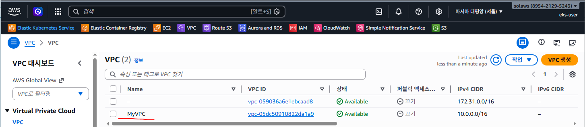

- 서브넷, 라우팅 테이블, InternetGateway 생성 확인

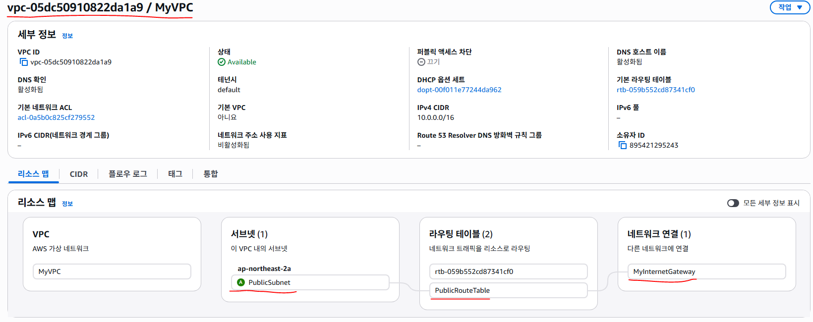

- EC2 생성 확인

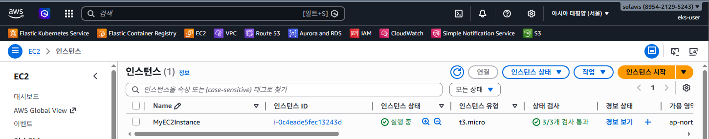

- 생성된 EC2 정보 확인 (SecurityGroup도 확인)

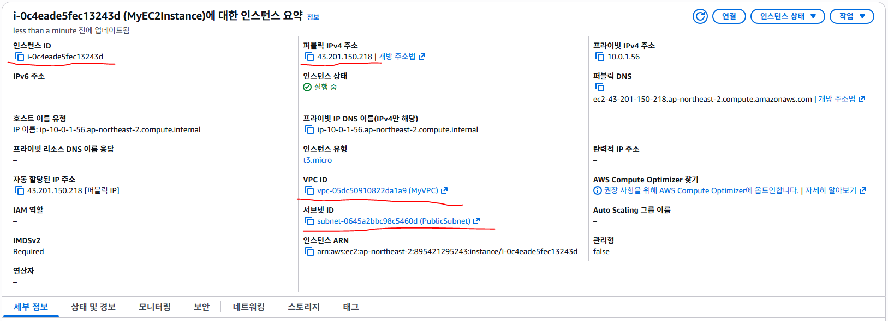

- EBS (스토리지)가 2개 장착된 것을 확인할 수 있다.

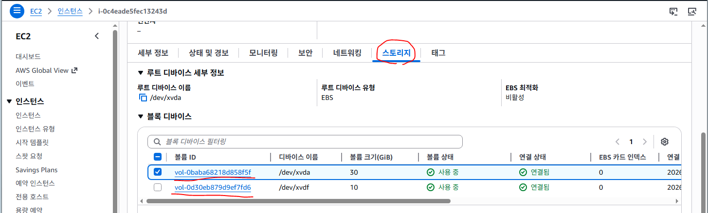

SecurityGroup도 확인

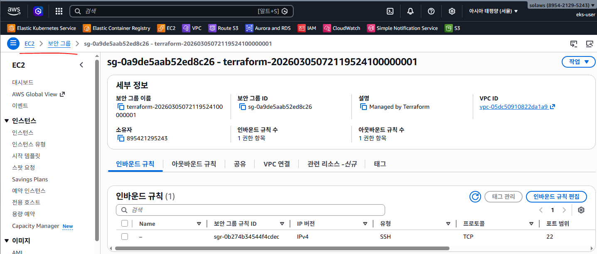

```powershell
PS C:\terraform\terraform-aws2\01_aws-config\1_vpc-and-ec2> terraform apply
data.aws_ami.ami2023: Reading...
data.aws_ami.ami2023: Read complete after 1s [id=ami-0fae3369c34baac8b]

Terraform used the selected providers to generate the following execution plan. Resource actions are indicated with the following symbols:
  + create

Terraform will perform the following actions:
~~~~~~~~~~~~~~~~~~~ 중간 생략 ~~~~~~~~~~~~~~~~~~~
Apply complete! Resources: 11 added, 0 changed, 0 destroyed.

Outputs:

ec2_domain = "ec2-43-201-150-218.ap-northeast-2.compute.amazonaws.com"

PS C:\terraform\terraform-aws2\01_aws-config\1_vpc-and-ec2>
ssh -i $home/.ssh/my-key  ec2-user@ec2-43-201-150-218.ap-northeast-2.compute.amazonaws.com
The authenticity of host 'ec2-43-201-150-218.ap-northeast-2.compute.amazonaws.com (43.201.150.218)' can't be established.
ED25519 key fingerprint is SHA256:54sbVDcl6GImVGRy3jyUHObI9HUeZ737iow8j+XDb7c.
This key is not known by any other names.
Are you sure you want to continue connecting (yes/no/[fingerprint])? yes

   ,     #_
   ~\_  ####_
  ~~  \_#####\
  ~~     \###|
  ~~       \#/ ___   Amazon Linux 2023 (ECS Optimized)
   ~~       V~' '->
    ~~~         /
      ~~._.   _/
         _/ _/
       _/m/'

For documentation, visit http://aws.amazon.com/documentation/ecs
[ec2-user@ip-10-0-1-56 ~]$

[ec2-user@ip-10-0-1-56 ~]$ lsblk
NAME          MAJ:MIN RM SIZE RO TYPE MOUNTPOINTS
nvme0n1       259:0    0  30G  0 disk
├─nvme0n1p1   259:1    0  30G  0 part /
├─nvme0n1p127 259:2    0   1M  0 part
└─nvme0n1p128 259:3    0  10M  0 part /boot/efi
nvme1n1       259:4    0  10G  0 disk

[root@ip-10-0-1-56 ec2-user]# dnf install -y nginx

[root@ip-10-0-1-56 ec2-user]# systemctl  start  nginx

[root@ip-10-0-1-56 ec2-user]# systemctl  enable  nginx
Created symlink /etc/systemd/system/multi-user.target.wants/nginx.service → /usr/lib/systemd/system/nginx.service.

[root@ip-10-0-1-56 ec2-user]# systemctl  status  nginx
● nginx.service - The nginx HTTP and reverse proxy server
     Loaded: loaded (/usr/lib/systemd/system/nginx.service; enabled; preset: disabled)
     Active: active (running) since Thu 2026-03-05 07:54:47 UTC; 10s ago
   Main PID: 32424 (nginx)
      Tasks: 3 (limit: 1067)
     Memory: 4.0M
        CPU: 60ms
     CGroup: /system.slice/nginx.service
             ├─32424 "nginx: master process /usr/sbin/nginx"
             ├─32425 "nginx: worker process"
             └─32426 "nginx: worker process"

# SecurityGroup에서 SSH만 허용했기 때문에 접속할 수 없다.
http://ec2-43-201-150-218.ap-northeast-2.compute.amazonaws.com/
```

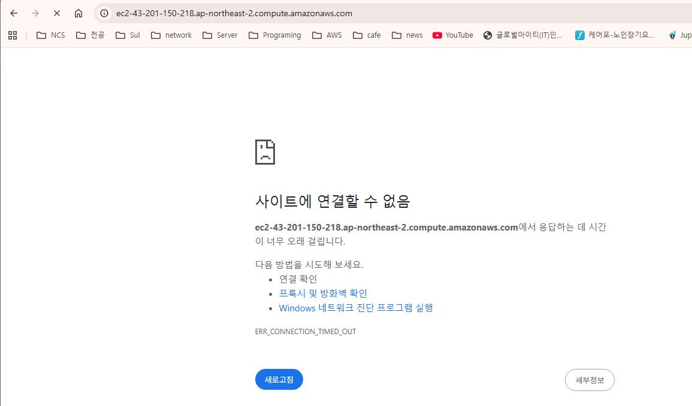

```hcl
# main.tf
# 보안 그룹 생성
resource "aws_security_group" "my_sg" {
  vpc_id = aws_vpc.my_vpc.id # 보안 그룹이 속할 VPC

  # 인바운드 규칙 (외부  -->  EC2 접근 허용)
  ingress {
    from_port   = 22        # SSH 포트
    to_port     = 22        # SSH 포트
    protocol    = "tcp"       # TCP 프로토콜
    cidr_blocks = ["0.0.0.0/0"]# 모든 IP 허용 (실습용)
  }

  ingress {
    from_port   = 80         # SSH 포트
    to_port     = 80         # SSH 포트
    protocol    = "tcp"   # TCP 프로토콜
    cidr_blocks = ["0.0.0.0/0"] # 모든 IP 허용 (실습용)
  }

  # 아웃바운드 규칙 (EC2  -->  외부 접근 허용)
  egress {
    from_port   = 0
    to_port     = 0
    protocol    = "-1"       # -1 = 모든 프로토콜
    cidr_blocks = ["0.0.0.0/0"]# 모든 IP 허용
  }

  tags = {
    Name = "MySecrutiyGroup"
  }
}

PS C:\terraform\terraform-aws2\01_aws-config\1_vpc-and-ec2> terraform plan
random_string.key_name_suffix: Refreshing state... [id=fc5qzj2w]
data.aws_ami.ami2023: Reading...
~~~~~~~~~~~~~~~~~~~ 중간 생략 ~~~~~~~~~~~~~~~~~~~
Plan: 0 to add, 1 to change, 0 to destroy.

PS C:\terraform\terraform-aws2\01_aws-config\1_vpc-and-ec2> terraform apply -auto-approve
random_string.key_name_suffix: Refreshing state... [id=fc5qzj2w]
aws_key_pair.my_key_pair: Refreshing state... [id=my-key-fc5qzj2w]
data.aws_ami.ami2023: Reading...
~~~~~~~~~~~~~~~~~~~ 중간 생략 ~~~~~~~~~~~~~~~~~~~
Plan: 0 to add, 1 to change, 0 to destroy.
aws_security_group.my_sg: Modifying... [id=sg-0a9de5aab52ed8c26]
aws_security_group.my_sg: Modifications complete after 1s [id=sg-0a9de5aab52ed8c26]

Apply complete! Resources: 0 added, 1 changed, 0 destroyed.

Outputs:

ec2_domain = "ec2-43-201-150-218.ap-northeast-2.compute.amazonaws.com"
```

- 보안 그룹을 확인해보면 HTTP가 허용된 것을 확인할 수 있다.

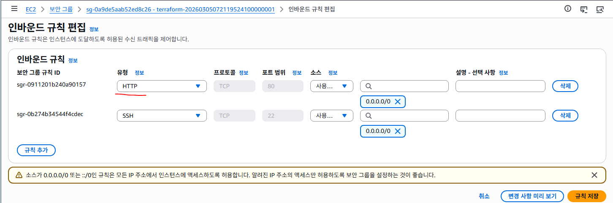

http://ec2-43-201-150-218.ap-northeast-2.compute.amazonaws.com/# HTTP 접속 허용

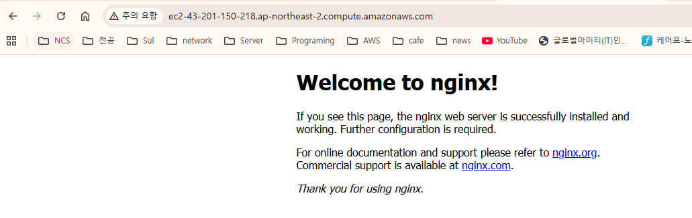

https://graphviz.org/download/

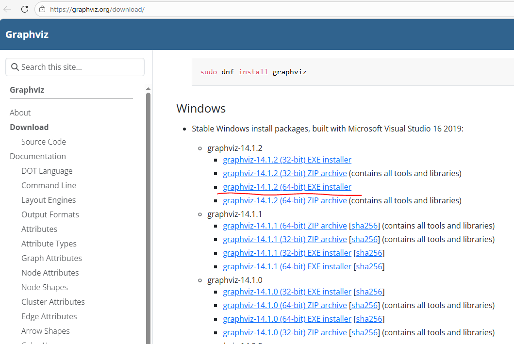

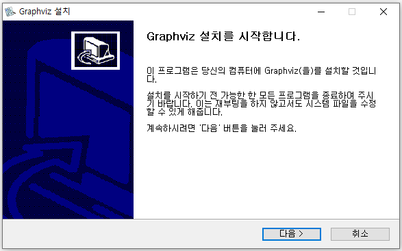

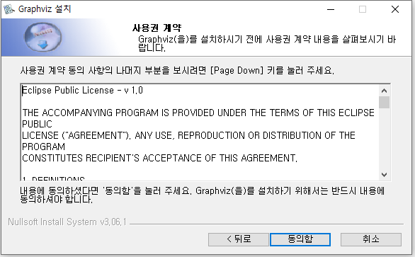

Add Graphviz to the system PATH for all users
  - dot 명령을 어디서든 사용할 수 있게 됨
  - PowerShell / CMD / VSCode 모두 사용 가능

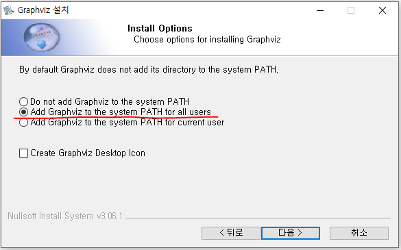

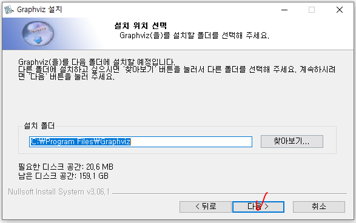

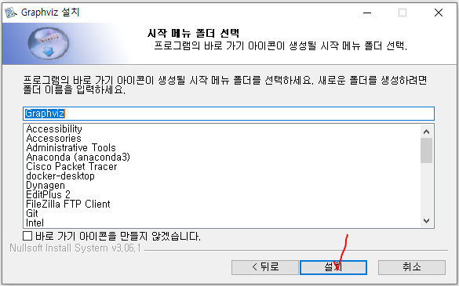

```powershell
PS C:\terraform\terraform-aws2\01_aws-config\1_vpc-and-ec2>
terraform graph | Out-File -Encoding ASCII graph.dot; dot -Tpng graph.dot -o graph.png
```

- terraform graph
  - Terraform 리소스들의 의존 관계를 그래프 형식으로 출력

- |
  - 앞 명령의 결과를 뒤 명령으로 전달

- Out-File -Encoding ASCII graph.dot
  - 결과를 graph.dot 파일로 저장

- ;
  - 앞 명령 실행 후 다음 명령 실행

- dot
  - Graphviz의 그래프 변환 명령어

- Tpng
  - 출력 형식을 PNG로 지정

- graph.dot
  - 변환할 입력 파일

- o graph.png
  - 결과를 graph.png 파일로 저장

```hcl
terraform graph  -->  Out-File graph.dot  -->  dot -Tpng graph.dot  -->  graph.png 생성
```

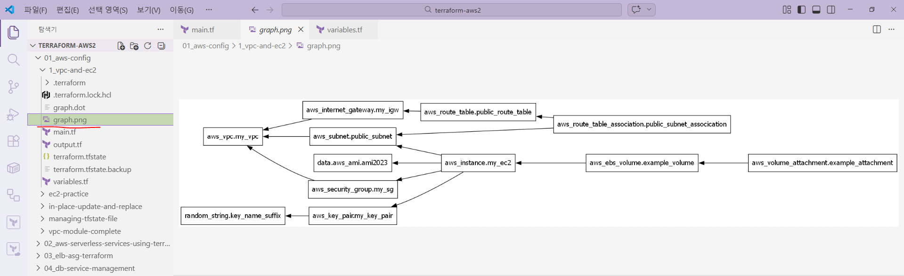

```powershell
PS C:\terraform\terraform-aws2\01_aws-config\1_vpc-and-ec2> terraform  destroy  -auto-approve
random_string.key_name_suffix: Refreshing state... [id=fc5qzj2w]
data.aws_ami.ami2023: Reading...
aws_key_pair.my_key_pair: Refreshing state... [id=my-key-fc5qzj2w]
aws_vpc.my_vpc: Refreshing state... [id=vpc-05dc50910822da1a9]
aws_internet_gateway.my_igw: Refreshing state... [id=igw-02f6031ac32a13011]
aws_subnet.public_subnet: Refreshing state... [id=subnet-0645a2bbc98c5460d]
aws_security_group.my_sg: Refreshing state... [id=sg-0a9de5aab52ed8c26]
~~~~~~~~~~~~~~~~~~~ 중간 생략 ~~~~~~~~~~~~~~~~~~~
random_string.key_name_suffix: Destruction complete after 0s
aws_subnet.public_subnet: Destruction complete after 1s
aws_security_group.my_sg: Destruction complete after 1s
aws_vpc.my_vpc: Destroying... [id=vpc-05dc50910822da1a9]
aws_vpc.my_vpc: Destruction complete after 1s

Destroy complete! Resources: 11 destroyed.

# AWS에서 VPC, EC2 , SG 삭제 확인
```

#### 공식 테라폼 AWS 모듈을 활용한 인프라 배포

- Terraform Registry에는 다양한 공개 모듈이 올라와 있고, 그중 terraform-aws-modules 네임스페이스는
AWS 인프라를 빠르게 구성할 수 있도록 만든 대표적인 오픈소스 모듈 모음이다.

- 이 조직은 GitHub에서 다수의 AWS용 모듈 저장소를 운영하고 있고,
Registry에서도 같은 네임스페이스로 배포되고 있다.
즉, 사용자는 VPC, EC2, S3, RDS, EKS 같은 자주 쓰는 AWS 자원을 처음부터 모두 직접 작성하지 않고,
검증된 모듈을 불러와 필요한 값만 넣는 방식으로 인프라를 배포할 수 있다.

- 쉽게 말하면, 공식 모듈이라는 표현은 "HashiCorp가 직접 만든 유일한 정답 코드"라는 뜻이라기보다,
Terraform Registry와 오픈소스 커뮤니티에서 널리 사용되고 유지보수되는 표준형 AWS 모듈 세트다.
특히 terraform-aws-modules 조직은 EC2, VPC, S3, IAM, EKS, RDS 등
핵심 AWS 서비스를 위한 모듈을 지속적으로 관리하고 있다.

- 직접 리소스 설정 방식

```hcl
resource "aws_vpc" ...
resource "aws_subnet" ...
resource "aws_route_table" ...
resource "aws_nat_gateway" ...

모듈 방식:
module "vpc" {
  source = "terraform-aws-modules/vpc/aws"
  ...
}
```

- 즉, 모듈은 여러 resource를 하나의 기능 단위로 묶어놓은 재사용 가능한 패키지다.
- 내가 전부 조립해서 만들 수도 있지만, 검증된 조립 세트를 가져와서 입력값만 바꿔 쓰는 방식이라고 보면 된다.

```
https://registry.terraform.io/search/modules?namespace=terraform-aws-modules

# module을 사용하는 이유

가장 큰 이유는 속도와 안정성이다. 이미 많은 사용자가 써본 구조를 기반으로 만들어져 있어서,
 초보자가 VPC, 서브넷, IGW, NAT, 라우팅, 태그, IAM 연동 등을 하나하나 직접 구현할 때 발생하는 실수를 줄일 수 있다.
 예를 들어 S3 모듈은 버전 관리, 수명 주기, 서버 측 암호화, 로그 전달 정책 등 S3에서 자주 요구되는 기능을
 폭넓게 지원하고, RDS 모듈은 RDS 자원 생성을 위한 루트 모듈과 세부 모듈 구조를 제공한다.
 EKS 모듈 역시 EKS 클러스터 구성에 필요한 다양한 설정과 하위 모듈을 제공한다.

또 하나 중요한 이유는 일관성이다.
학생마다, 팀마다, 회사마다 처음부터 전부 직접 짜면 이름 규칙, 태그 규칙, 변수 구조, 출력값 구조가 다 달라진다.
그런데 공통 모듈을 쓰면 입력 변수와 출력 구조가 어느 정도 표준화되기 때문에 협업과 유지보수가 쉬워진다.
특히 같은 유형의 인프라를 반복 배포해야 하는 교육 환경이나 실무 환경에서는 이 장점이 크다.
```

#### 주요 특징

- 재사용 가능한 검증된 구성
  - terraform-aws-modules는 AWS 자주 쓰는 서비스를 모듈화해두었기 때문에,
사용자는 복잡한 리소스 연결 구조를 매번 새로 짤 필요가 없다.
예를 들어 VPC 모듈 하나만 써도 VPC, 퍼블릭/프라이빗 서브넷, 라우팅, NAT Gateway, 태그 등을
한 번에 관리할 수 있는 패턴을 만들 수 있다. 이는 반복 실습이나 팀 프로젝트에서 큰 장점이다.

- 표준화된 입력 변수와 출력값
  - 잘 만든 모듈은 변수 이름과 출력값이 체계적이다.
그래서 다른 사람이 만든 Terraform 코드도 구조를 비교적 빨리 읽을 수 있다.
예를 들어 vpc_id, private_subnets, public_subnets 같은 출력값을 다음 모듈에서 바로 참조하는 식으로 코드를
계층적으로 구성할 수 있다.

- 기능 확장성과 커스터마이징 가능
  - 모듈은 편한 대신 유연성이 떨어질 것 같지만, 실제로는 대부분 많은 옵션을 제공한다.
  - 예를 들어 S3 모듈은 버전 관리, 수명 주기, 서버 측 암호화, 로깅, 객체 잠금, 다양한 로그 전달 정책까지 지원한다.
  - 즉, 단순히 버킷 하나 만드는 수준이 아니라 부가 기능까지 한 번에 관리할 수 있다.

- 하위 모듈과 조합형 설계
  - 최근 모듈들은 큰 덩어리 하나만 있는 것이 아니라, 상황에 따라 서브모듈로 쪼개어 사용할 수 있다.
  - 예를 들어 EKS 모듈은 클러스터 본체만이 아니라 관련 기능을 서브모듈 형태로 제공하고,
Registry에는 karpenter 같은 하위 모듈도 별도로 확인된다.

#### 장점 정리 보강판

- 시간 절약
  - 직접 리소스를 전부 작성하면, 단순히 VPC 하나여도 서브넷, 라우팅, IGW, NAT, 보안 관련 설정까지 손이 많이 간다.
  - 모듈은 이런 반복 코드를 줄여준다.

- 안정성 향상

#### 많은 사용자가 쓰는 코드 구조를 기반으로 하기 때문에, 기초 단계에서 자주 발생하는 누락 실수나 연결 실수를 줄일 수 있다.

#### 예를 들어 S3 로깅 정책이나 EKS 관련 부가 구성처럼 손이 많이 가는 부분에서 장점이 더 크다.

- 유지보수 편의성
  - 리소스를 직접 수십 개 나열한 코드보다, 모듈 단위로 나눈 코드가 구조적으로 읽기 쉽다.
  - 특히 module.vpc, module.eks, module.rds처럼 구획이 나뉘어 있으면 책임 범위가 분리된다.

- 협업에 유리
  - 실무에서는 한 사람이 모든 AWS 자원을 다 직접 작성하기보다, 검증된 모듈을 조합해 공통 표준을 맞추는 경우가 많다.
  - 모듈 기반 코드는 리뷰, 재사용, 환경 분리(dev/stage/prod)에 유리하다.
  - 이 부분은 Registry와 GitHub의 표준화된 모듈 제공 방식에서 확인할 수 있다.

#### 단점

- 모듈을 쓴다고 AWS 구조를 몰라도 되는 것은 아니다

- VPC 모듈을 쓴다고 해서 서브넷, 라우팅, NAT, IGW 개념을 몰라도 되는 것이 아니다.
오히려 내부에서 어떤 리소스가 생성되는지 이해해야, plan 결과를 읽고 장애를 분석할 수 있다.

- 옵션이 많아서 초보자에게 오히려 어려울 수 있다
  - 모듈은 편하지만, 입력 변수 수가 많아지면 "뭘 꼭 넣어야 하고 뭘 생략해도 되는지"가 헷갈릴 수 있다.
  - 그래서 초급 단계에서는 직접 resource 방식으로 먼저 구조를 배우고, 그다음 모듈로 넘어가는 수업 순서가 가장 좋다.

- 모듈 버전 업그레이드 시 변경 영향이 있을 수 있다
  - 특히 EKS처럼 변화가 빠른 영역은 모듈 내부 동작이나 권장 설정이 달라질 수 있다.

- 모든 상황에 100% 딱 맞는 것은 아니다
  - 조직 표준, 네이밍, 보안정책, 네트워크 구조가 복잡한 경우에는 모듈만으로 부족해서 직접 resource를 섞어 써야 한다.
  - 실무는 "모듈만 사용" 또는 "직접 작성만 사용"의 이분법이 아니라,
공통 영역은 모듈, 특수 영역은 직접 리소스 작성 방식으로 혼합되는 경우가 많다.

#### Terraform in-place update와 replace 이해

- Terraform으로 인프라를 관리할 때 가장 중요한 개념 중 하나는 리소스 변경이 어떻게 적용되는지 이해하는 것이다.

- Terraform은 기존 인프라를 변경할 때 단순히 설정만 바꾸는 것이 아니라,
현재 상태(state)와 코드(configuration)를 비교하여 어떤 방식으로 변경해야 하는지 결정한다.

- 이때 Terraform이 사용하는 두 가지 대표적인 변경 방식이 있다.
  - in-place update
  - replace (recreate)

- 이 두 개념을 이해해야 Terraform plan 결과를 정확히 읽을 수 있고, 운영 환경에서 서비스 중단을 예방할 수 있다.

- Terraform은 리소스를 수정할 때 아래 과정으로 동작한다.
  - Terraform 코드(configuration)를 읽는다.
  - Terraform state 파일을 확인한다.
  - 실제 AWS 리소스 상태를 확인한다.
  - 세 가지를 비교하여 변경 계획을 만든다.

- 이 결과가 바로 terraform plan이다.

- 예를 들어 plan 결과에서 이런 표시가 나온다.
  - ~ update in-place
  - -/+ replace
  - + create
  - - destroy

- 각 의미는 다음과 같다.
표시의미
~기존 리소스 수정
- /+기존 리소스 삭제 후 새로 생성
+새 리소스 생성
- 리소스 삭제

- 여기서 핵심이 되는 개념이 바로 in-place update와 replace이다.

#### in-place update

- in-place update는 기존 리소스를 삭제하지 않고 속성만 수정하는 방식이다.

- 즉 리소스는 그대로 유지되고 일부 설정만 변경된다.

- 이 방식의 특징은 다음과 같다.
  - 리소스 ID가 유지된다
  - 기존 리소스가 삭제되지 않는다
  - 서비스 중단 가능성이 낮다
  - 빠르게 변경 적용 가능

- Terraform이 지원하는 변경 유형 중 가장 안전한 변경 방식이다.

- in-place update 예시 (EC2 인스턴스에서 태그를 변경하는 경우)

```hcl
resource "aws_instance" "example" {
  ami           = "ami-xxxxx"
  instance_type = "t2.micro"

  tags = {
    Name = "MyOldInstance"
  }
}
```

- 태그를 다음과 같이 변경한다.

```hcl
tags = {
  Name = "MyNewInstance"
}
```

- 이 경우 Terraform은 다음과 같이 판단한다.
  - ~ update in-place

- 즉 기존 EC2 인스턴스를 삭제하지 않고 태그만 수정한다.

- 실제 AWS에서는 다음 작업만 수행된다.
  - EC2 인스턴스 유지
  - Tag 값만 변경
  - 서비스 중단 없이 변경된다.

#### replace (recreate)

- replace는 기존 리소스를 삭제하고 새로운 리소스를 생성하는 방식이다.

- Terraform에서 replace는 다음 상황에서 발생한다.
  - 리소스의 기본 속성이 변경된 경우
  - 해당 속성이 immutable 속성인 경우
  - AWS API가 수정(update)을 지원하지 않는 경우

- replace가 발생하면 다음 과정이 실행된다.
  - 기존 리소스 삭제
  - 새 리소스 생성
  - 이 경우 리소스 ID는 유지되지 않는다.

- replace 예시 (EC2 인스턴스의 subnet을 변경하는 경우)

```hcl
resource "aws_instance" "example" {
  subnet_id = aws_subnet.public.id
}
```

- 이를 다음과 같이 변경한다.
  - subnet_id = aws_subnet.private.id

- EC2는 서브넷 이동을 지원하지 않는다.
따라서 Terraform은 다음과 같이 판단한다.
  - -/+ replace

- 실제 동작 과정은 다음과 같다.
  - 기존 EC2 삭제
  - 새로운 EC2 생성
  - 새 subnet에 배치

- 이 과정에서 서비스 중단이 발생할 수 있다.

#### Terraform이 in-place와 replace를 결정하는 기준

- Terraform은 리소스 속성을 두 가지 유형으로 나눈다.

1. Mutable 속성

- 수정이 가능한 속성이다.

- 예
  - 태그 변경
  - 보안 그룹 규칙 변경
  - 일부 정책 변경

- 이 경우 Terraform은 in-place update를 수행한다.

2. Immutable 속성

- 생성 이후 변경할 수 없는 속성이다.

- 예
  - subnet 변경
  - AMI 변경
  - 일부 네트워크 설정

- 이 경우 Terraform은 replace 방식으로 처리한다.
- 즉 기존 리소스를 삭제하고 새로 생성한다.

Replace가 발생하는 주요 사례

#### Terraform에서 replace가 자주 발생하는 사례

1. 네트워크 변경
- 예
  - subnet 변경
  - VPC CIDR 변경
  - 이러한 변경은 리소스 구조 자체를 바꾸기 때문에 replace가 발생한다.

2. 컴퓨팅 리소스 변경
- 예
  - AMI 변경
  - 일부 instance 설정 변경
  - EC2 인스턴스는 AMI를 변경하면 재생성이 필요하다.

3. 의존성 구조 변경
- 리소스 간 의존 관계가 바뀌는 경우도 replace가 발생할 수 있다.
- 예
  - 다른 VPC로 이동
  - 다른 Subnet으로 이동
  - 새로운 네트워크 연결

#### Terraform 변경 시 고려해야 할 사항

- Terraform을 운영 환경에서 사용할 때 가장 중요한 것은 변경으로 인한 서비스 영향 분석이다.
- 특히 replace가 발생하는 경우 다음 문제가 생길 수 있다.
  - 서비스 중단
  - IP 변경
  - DNS 변경
  - 데이터 손실

- 따라서 Terraform에서는 항상 다음 과정을 거쳐야 한다.

- terraform plan
  - 변경 내용 확인
  - 영향 분석
  - terraform apply

plan 단계는 Terraform 운영에서 필수 단계다.

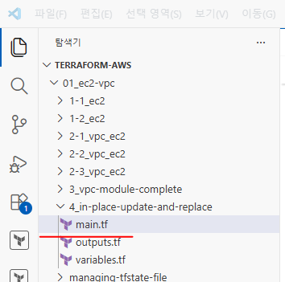

```powershell
PS C:\terraform-aws\01_ec2-vpc\4_in-place-update-and-replace> terraform  init
Initializing the backend...
Initializing provider plugins...
- Finding latest version of hashicorp/null...
- Finding latest version of hashicorp/random...
- Finding latest version of hashicorp/local...
- Finding hashicorp/aws versions matching ">= 5.73.0"...
- Installing hashicorp/null v3.2.4...
~~~~~~~~~~~ 중간 생략 ~~~~~~~~~~~
Terraform has been successfully initialized!

You may now begin working with Terraform. Try running "terraform plan" to see
any changes that are required for your infrastructure. All Terraform commands
should now work.

If you ever set or change modules or backend configuration for Terraform,
rerun this command to reinitialize your working directory. If you forget, other
commands will detect it and remind you to do so if necessary.

PS C:\terraform-aws\01_ec2-vpc\4_in-place-update-and-replace> terraform  plan
data.local_file.public_key: Reading...
data.local_file.public_key: Read complete after 0s [id=b6683932437a27e031634bed107a118d9e0bfa27]
data.aws_ami.al2023: Reading...
data.aws_ami.ubuntu: Reading...
data.aws_ami.ubuntu: Read complete after 0s [id=ami-04f851a80be515079]
data.aws_ami.al2023: Read complete after 1s [id=ami-00d2265ac70838f15]

Terraform used the selected providers to generate the following execution plan. Resource actions are indicated with the following symbols:
  + create
~~~~~~~~~~~ 중간 생략 ~~~~~~~~~~~
Plan: 4 to add, 0 to change, 0 to destroy.

Changes to Outputs:
  + ec_domain = (known after apply)

# main.tf
~~~~~~~~~~~ 중간 생략 ~~~~~~~~~~~
# EC2 인스턴스 생성
resource "aws_instance" "my_ec2" {
  # 사용할 AMI ID - AMI ID 변경 시 replace 업데이트됨
  ami           = true ? data.aws_ami.al2023.id : data.aws_ami.ubuntu.id
  instance_type = "t3.micro" # 인스턴스 유형 설정 - in-place 업데이트됨
  # instance_type = "c5.large"

  # 태그 이름 - in-place 업데이트됨
  tags = {
    Name        = "MyEC2Instance" # 인스턴스의 이름 태그
    Environment = "dev"           # 배포 환경 태그 (예: dev, prod)
  }
~~~~~~~~~~~ 중간 생략 ~~~~~~~~~~~

PS C:\terraform-aws\01_ec2-vpc\4_in-place-update-and-replace> terraform  plan
data.local_file.public_key: Reading...
null_resource.trigger_bootstrap_change: Refreshing state... [id=2875209987308979950]
data.local_file.public_key: Read complete after 0s [id=b6683932437a27e031634bed107a118d9e0bfa27]
random_string.key_name_suffix: Refreshing state... [id=73u3pxgy]
Terraform used the selected providers to generate the following execution plan. Resource actions are indicated with the following symbols:
```

- /+ destroy and then create replacement

Terraform will perform the following actions:

  - aws_instance.my_ec2 must be replaced
- /+ resource "aws_instance" "my_ec2" {
~~~~~~~~~~~ 중간 생략 ~~~~~~~~~~~

Plan: 1 to add, 0 to change, 1 to destroy.

Changes to Outputs:

```hcl
  ~ ec_domain = "ec2-3-38-100-182.ap-northeast-2.compute.amazonaws.com" -> (known after apply)

# 확인 후 다시 true로 변경

# main.tf
# EC2 인스턴스 생성
resource "aws_instance" "my_ec2" {
  # 사용할 AMI ID - AMI ID 변경 시 replace 업데이트됨
  ami           = true ? data.aws_ami.al2023.id : data.aws_ami.ubuntu.id
  instance_type = "t3.micro" # 인스턴스 유형 설정 - in-place 업데이트됨
  # instance_type = "c5.large"

  # 태그 이름 - in-place 업데이트됨
  tags = {
    Name        = "MyEC2Instance-in-place" # 인스턴스의 이름 태그
    Environment = "dev"                    # 배포 환경 태그 (예: dev, prod)
  }
PS C:\terraform-aws\01_ec2-vpc\4_in-place-update-and-replace> terraform  plan
data.local_file.public_key: Reading...
data.local_file.public_key: Read complete after 0s [id=b6683932437a27e031634bed107a118d9e0bfa27]
null_resource.trigger_bootstrap_change: Refreshing state... [id=2875209987308979950]
random_string.key_name_suffix: Refreshing state... [id=73u3pxgy]
data.aws_ami.al2023: Reading...
data.aws_ami.ubuntu: Reading...
aws_key_pair.my_key_pair: Refreshing state... [id=my-key-73u3pxgy]
data.aws_ami.ubuntu: Read complete after 1s [id=ami-04f851a80be515079]
data.aws_ami.al2023: Read complete after 1s [id=ami-00d2265ac70838f15]
aws_instance.my_ec2: Refreshing state... [id=i-0723f649eaad1dcf4]

Terraform used the selected providers to generate the following execution plan. Resource actions are indicated with the following symbols:
  ~ update in-place

Terraform will perform the following actions:

  # aws_instance.my_ec2 will be updated in-place
  ~ resource "aws_instance" "my_ec2" {
        id                                   = "i-0723f649eaad1dcf4"
      ~ tags                                 = {
            "Environment" = "dev"
          ~ "Name"        = "MyEC2Instance" -> "MyEC2Instance-in-place"
        }
      ~ tags_all                             = {
          ~ "Name"        = "MyEC2Instance" -> "MyEC2Instance-in-place"
            # (1 unchanged element hidden)
        }
        # (40 unchanged attributes hidden)

        # (9 unchanged blocks hidden)
    }

Plan: 0 to add, 1 to change, 0 to destroy.

# user_data 변경 시 강제 replace

user_data에 중요한 초기 설정 데이터가 변경되면 ec2의 재생성이 필요할 수 있다.
그러나 기본적으로는 user_data가 변경되면 in-place 업데이트를 수행하면서 ec2가 재부팅 될 뿐
기존의 파일 시스템은 그대로 유지된다. 그러면 기존의 설정과 새 설정이 충돌을 일으킬 수 있다.

여기서는 다음과 같이 `replace_triggered_by` 를 구성하여 user_data 변경시 강제로 replace를 진행하도록 설정할 수 있다.

local 변수인 user_data는 replace_triggered_by에 배치할 수 없으므로 여기서는 null_resource를 사용해서
triggers를 걸고 그것을 replace_triggered_by와 연결하여 부트스트랩 스크립트 변경 시
인스턴스가 replace 될 수 있도록 연결할 수 있다.

PS C:\terraform-aws\01_ec2-vpc\4_in-place-update-and-replace>
ssh -i $home/.ssh/my-key  ec2-user@ec2-13-125-197-34.ap-northeast-2.compute.amazonaws.com
   ,     #_
   ~\_  ####_        Amazon Linux 2023
  ~~  \_#####\
  ~~     \###|
  ~~       \#/ ___   https://aws.amazon.com/linux/amazon-linux-2023
   ~~       V~' '->
    ~~~         /
      ~~._.   _/
         _/ _/

[ec2-user@ip-172-31-13-135 ~]$ curl localhost
Hello, Httpd!
```

- http가 동작하는거을 확인할 수 있다.

```hcl
# main.tf
~~~~~~~~~~~ 중간 생략 ~~~~~~~~~~~
# 부트스트랩 스크립트를 로컬 변수로 정의 (Nginx 설치)
# 주석 해제
locals {
  bootstrap_script = <<-EOT
    #!/bin/bash
    yum install -y nginx
    systemctl start nginx
    echo "Hello, Nginx!" > /usr/share/nginx/html/index.html
  EOT
}

# 부트스트랩 스크립트를 로컬 변수로 정의 (Httpd 설치)
# 이 값은 EC2가 "처음 생성될 때" 실행할 초기 설정 스크립트이다.
# 주석 처리
# locals {
#   bootstrap_script = <<-EOT
#     #!/bin/bash
#     yum install -y httpd
#     systemctl start httpd
#     echo "Hello, Httpd!" > /var/www/html/index.html
#   EOT
# }
~~~~~~~~~~~ 중간 생략 ~~~~~~~~~~~

PS C:\terraform-aws\01_ec2-vpc\4_in-place-update-and-replace> terraform  plan
data.local_file.public_key: Reading...
random_string.key_name_suffix: Refreshing state... [id=73u3pxgy]
data.local_file.public_key: Read complete after 0s [id=b6683932437a27e031634bed107a118d9e0bfa27]
null_resource.trigger_bootstrap_change: Refreshing state... [id=2875209987308979950]
~~~~~~~~~~~ 중간 생략 ~~~~~~~~~~~
Terraform will perform the following actions:

  # aws_instance.my_ec2 will be replaced due to changes in replace_triggered_by
~~~~~~~~~~~ 중간 생략 ~~~~~~~~~~~
Plan: 2 to add, 0 to change, 2 to destroy.

Changes to Outputs:
  ~ ec_domain = "ec2-13-125-197-34.ap-northeast-2.compute.amazonaws.com" -> (known after apply)
```

#### S3 저장소와 정적 웹서비스

- AWS에서 웹사이트를 운영하는 방법은 여러 가지가 있다.

- 일반적으로는 EC2 인스턴스에 Nginx 또는 Apache 같은 웹서버를 설치하고 HTML 파일을 제공하는 방식이 사용된다.
하지만 웹사이트가 단순히 HTML, CSS, JavaScript 파일만 제공하는 구조라면 웹서버가 반드시 필요하지 않다.
이 경우 AWS의 S3(Simple Storage Service) 를 이용하면 서버 없이도 웹사이트 운영이 가능하다.

- S3는 객체 스토리지 서비스이지만 정적 웹 호스팅 기능을 제공하기 때문에
웹 서버처럼 HTML 파일을 사용자에게 전달할 수 있다.

- 즉 다음과 같은 구조가 가능하다.  -->  인터넷  -->  S3 버킷  -->  HTML / CSS / JS 파일 전달

- 이 구조에서는 EC2나 웹 서버가 필요하지 않기 때문에 운영 비용이 낮고 관리가 매우 단순하다.

#### AWS S3 개요

- S3(Simple Storage Service)는 AWS에서 제공하는 객체 기반 스토리지 서비스이다.
- 파일을 저장하는 서비스이지만 일반적인 파일 시스템과는 구조가 다르다.
S3는 다음 구조로 데이터를 관리한다.

- Bucket
├ index.html
├ style.css
├ script.js
├ image1.png
└ image2.png

- Bucket
  - 파일을 저장하는 컨테이너

- Object
  - 실제 저장되는 파일

- Object Key
  - 파일의 경로 역할을 하는 문자열
  - 예 : images/logo.png (이 경로는 실제 폴더가 아니라 Object Key이다.)

#### S3의 주요 특징

#### 무제한에 가까운 저장 용량

- S3는 사용자가 직접 디스크 크기를 관리하지 않는다.

- 필요한 만큼 데이터를 계속 저장할 수 있으며 용량 제한을 따로 설정하지 않는 이상 사실상 무제한 저장이 가능하다.

- 예
  - 이미지 저장
  - 영상 파일 저장
  - 데이터 백업
  - 로그 저장

- 대규모 데이터 저장소로도 많이 사용된다.

#### 높은 데이터 내구성

- S3는 AWS에서 가장 안정적인 스토리지 서비스 중 하나이다.

- 데이터 내구성
  - 99.999999999% (11 nines)

- 이는 저장된 데이터가 매우 낮은 확률로만 손실된다는 의미이다.

- 이러한 높은 내구성이 가능한 이유는 S3가 데이터를 여러 Availability Zone(AZ) 에 복제 저장하기 때문이다.

- 예 서울 리전
  - ap-northeast-2a
  - ap-northeast-2b
  - ap-northeast-2c
  - 여러 데이터센터에 데이터를 분산 저장한다.

#### 높은 서비스 가용성

- S3는 높은 가용성을 제공한다.

- 가용성
  - 약 99.99%
  - 즉 대부분의 시간 동안 서비스가 정상적으로 동작한다는 의미이다.

#### 객체 기반 스토리지 구조

- S3는 일반적인 파일 시스템처럼 디렉터리 구조로 파일을 관리하지 않는다.

- 대신 Object Key 기반 구조를 사용한다.

- 예

```
 # index.html
 # css/style.css
 # images/logo.png
```

- 이 구조는 실제 폴더가 아니라 문자열 기반 경로이다.

#### 정적 웹 호스팅 기능

- S3는 단순한 저장소 기능 외에도 정적 웹사이트 호스팅 기능을 제공한다.
  - HTML
  - CSS
  - JavaScript
  - 이미지
  - 동영상 과 같은 정적 파일을 웹 브라우저에 전달하는 기능이다.

- 이 기능을 이용하면 다음과 같은 사이트 운영이 가능하다.
  - 회사 소개 사이트
  - 문서 사이트
  - React / Vue 프론트엔드
  - Landing Page

#### 정적 웹사이트의 개념

- 정적 웹사이트는 서버에서 프로그램을 실행하지 않는 웹사이트를 의미한다.

- 사용자 요청

```
 # example.com/index.html
```

- 서버 동작
  - index.html 파일 그대로 전달

- S3 버킷은 기본적으로 외부 접근이 차단되어 있다.
- 웹사이트로 사용하려면 외부 사용자가 파일을 읽을 수 있도록 설정이 필요하다.

- 설정 항목
  - Block Public Access 비활성화
  - 버킷 정책 설정
  - 버킷 정책을 통해 파일 읽기 권한을 공개한다.

예

```json
{
  "Version": "2012-10-17",
  "Statement": [
    {
      "Effect": "Allow",
      "Principal": "*",
      "Action": "s3:GetObject",
      "Resource": "arn:aws:s3:::my-bucket/*"
    }
  ]
}
```

- "Statement": [ ... ]
  - 권한 규칙 목록이다.
  - 하나의 정책 안에 여러 개의 권한 규칙을 넣을 수 있다.
  - 예 : 읽기 권한, 쓰기 권한, 삭제 권한

- Effect
  - Allow: 권한 허용
  - Deny: 권한 차단

- "Principal": "*"
  - 누가 접근할 수 있는지 의미한다.
  - * 는 모든 사용자 즉 인터넷 전체 사용자 를 의미한다.
  - 따라서 이 정책은 AWS 계정 사용자뿐 아니라 인터넷에 있는 모든 사용자가 접근 가능한 상태이다.

- "Action": "s3:GetObject"
  - 허용할 작업을 의미한다.
  - s3:GetObject = S3 객체(파일) 읽기 권한 즉 다운로드 가능

#### S3 웹사이트 엔드포인트

- S3 정적 웹 호스팅을 활성화하면 AWS가 웹사이트 주소를 제공한다.

- 형식
  - http://bucket-name.s3-website-region.amazonaws.com
  - 예) http://kino-site.s3-website-ap-northeast-2.amazonaws.com
  - 이 주소로 웹사이트 접근이 가능하다.

#### Terraform을 이용한 자동화

- AWS 콘솔에서 직접 설정할 수도 있지만 실무에서는 Terraform 같은 IaC 도구를 사용해 인프라를 코드로 관리한다.

- Terraform을 사용하면 다음 항목을 자동으로 생성할 수 있다.
  - S3 버킷 생성
  - 버킷 정책 생성
  - 정적 웹 호스팅 설정
  - 파일 업로드

#### 버킷 콘솔 실습

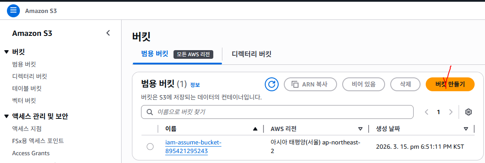

- 버킷 이름: my-terraform-bucket-123456789012

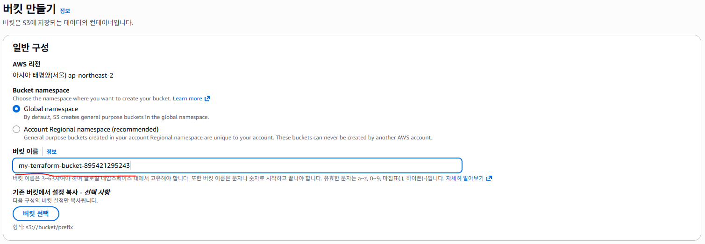


- index.html , error.html 파일 2개 업로드

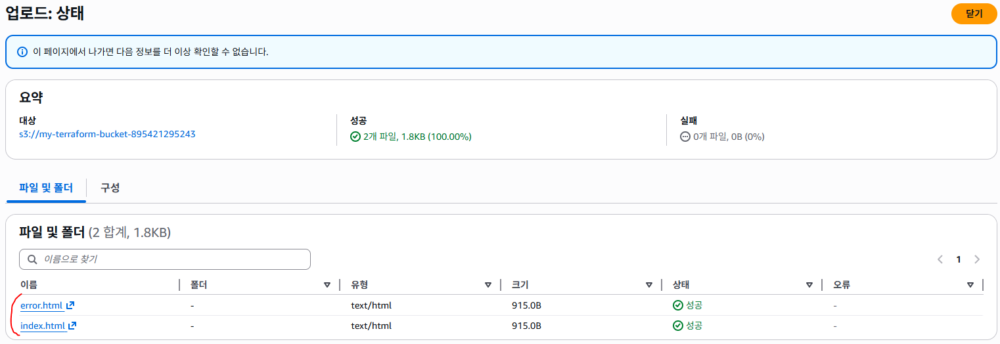

- Amazon S3  -->  버킷  -->  my-terraform-bucket-123456789012  -->  속성  -->  정접 웹 사이트 호스팅  -->  편집

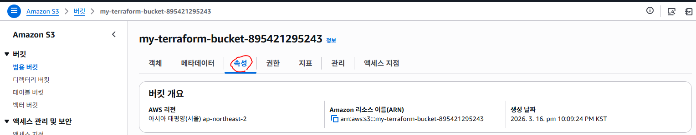

~~~~~~~~~~~~~~~~~~~~~ 중간 생략 ~~~~~~~~~~~~~~~~~~~~~

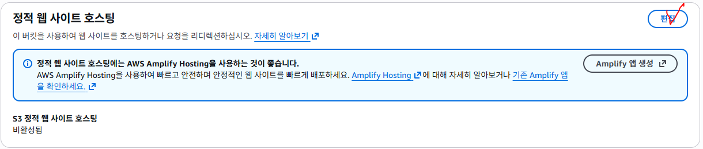

- 정적 웹 사이트 호스팅: 활성화
- 호스팅 유형: 정적 웹 사이트 호스팅
- 인덱스 문서: index.html
- 오류 문서: error.html

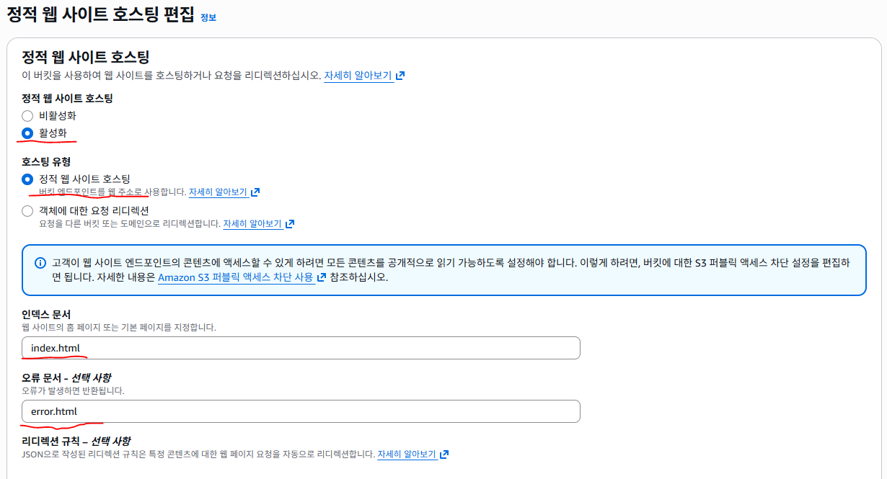


- 변경 사항을 저장하게되면 버킷 웹 사이트 엔드포인트가 생성된다.

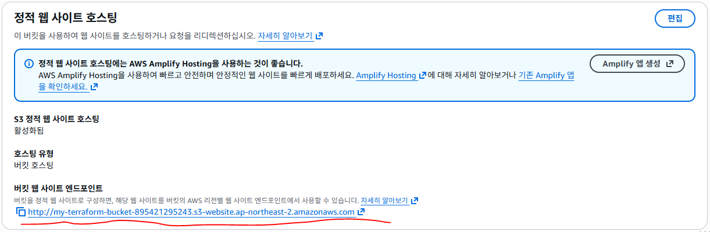

http://my-terraform-bucket-123456789012.s3-website.ap-northeast-2.amazonaws.com/

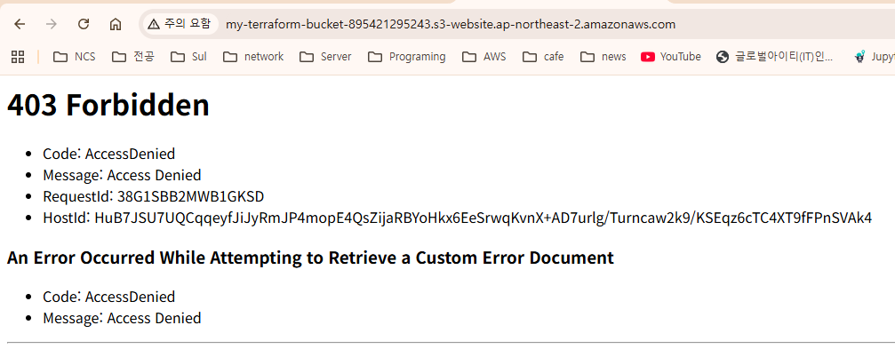

- 403 Forbidden
  - 서버는 요청을 이해했지만 접근 권한이 없어서 요청을 거부한 상태
  - 즉 파일은 존재하지만 읽을 권한이 없어서 서버가 접근을 막은 상태

- Code: AccessDenied
  - S3 권한 정책 때문에 접근이 차단됨

- Amazon S3  -->  버킷  -->  my-terraform-bucket-123456789012  -->  권한  -->  편집

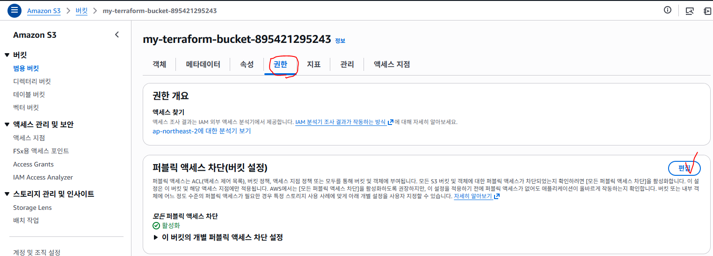

- 퍼블릭 엑세스 차단 해제 (차단만 해제했을뿐 권한이 없기 때문에 아직까지는 접속되지 않는다.)

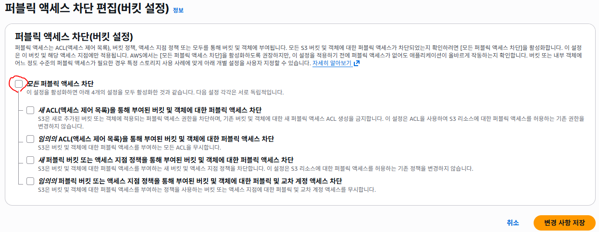

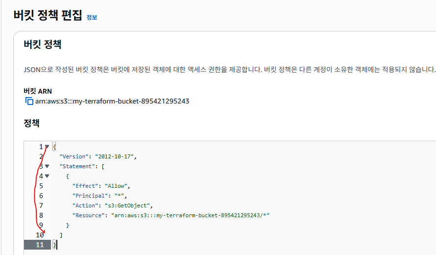


```json
{
  "Version": "2012-10-17",
  "Statement": [
    {
      "Effect": "Allow",
      "Principal": "*",
      "Action": "s3:GetObject",
      "Resource": "arn:aws:s3:::my-terraform-bucket-123456789012/*"
    }
  ]
}

http://my-terraform-bucket-123456789012.s3-website.ap-northeast-2.amazonaws.com/
```

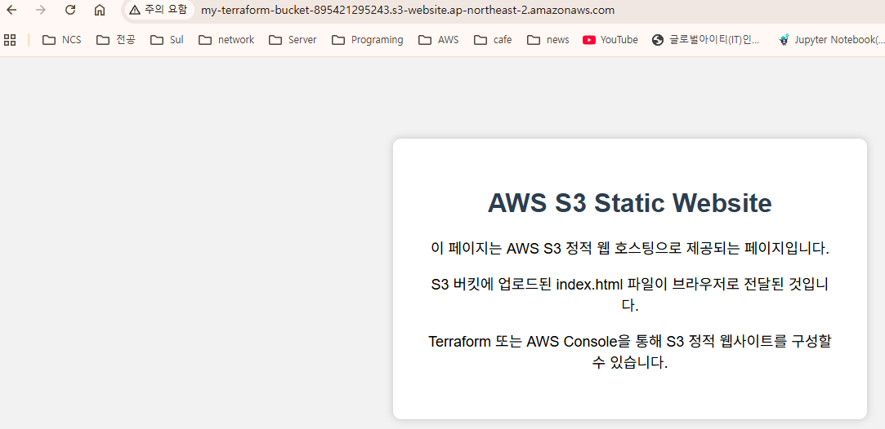

http://my-terraform-bucket-123456789012.s3-website.ap-northeast-2.amazonaws.com/soldesk

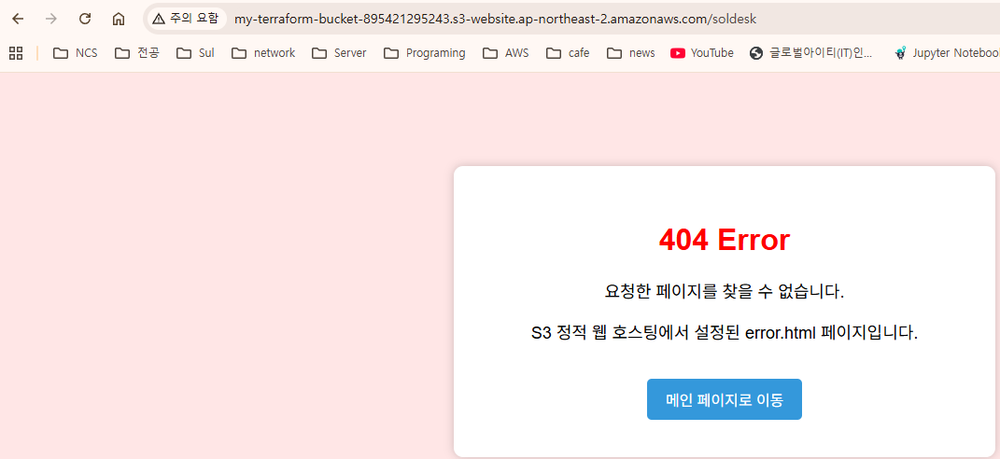

#### S3 리소스 삭제

#### Terraform VPC + Public/Private Subnet + NAT Gateway + EC2 실습

Internet
│
Internet Gateway
│
┌───────────────┴───────────────┐
│                               │
Public Subnet 1                 Public Subnet 2
10.0.1.0/24                     10.0.2.0/24
ap-northeast-2a                 ap-northeast-2c
│
Public EC2
│
NAT Gateway
│
Elastic IP
│
Private Route Table
│
┌───────┴───────┐
│               │
Private Subnet 1    Private Subnet 2
10.0.11.0/24        10.0.12.0/24
ap-northeast-2a     ap-northeast-2c
│
Private EC2

  - STEP 1) Terraform Provider + VPC

- Terraform 기본 설정과 AWS Provider를 설정
- VPC CIDR : 10.0.0.0/16

```hcl
　　　# variables.tf
# AWS Region
variable "aws_region" {
  description = "AWS 리전"
  type        = string
  default     = "ap-northeast-2"
}

# AWS CLI Profile
variable "aws_profile" {
  description = "AWS CLI Profile 이름"
  type        = string
  default     = "my-profile"
}

　　　# main.tf
# Terraform 기본 설정
terraform {
  required_version = ">= 1.16.0"

  required_providers {
    aws = {
      source  = "hashicorp/aws"
      version = "~> 6.62"
    }
    random = {
      source  = "hashicorp/random"
      version = "~> 3.9"
    }
  }
}

# AWS Provider 설정
provider "aws" {
  region  = var.aws_region   # AWS 리전
  profile = var.aws_profile  # AWS CLI Profile
}

　　　# variables.tf
# VPC CIDR
variable "vpc_cidr_block" {
  description = "VPC에서 사용할 CIDR 블록"
  type        = string
  default     = "10.0.0.0/16"
}

　　　# main.tf
# VPC 생성
resource "aws_vpc" "my_vpc" {
  cidr_block = var.vpc_cidr_block   # VPC IP 주소 범위

  enable_dns_support   　= true        # VPC 내부 DNS 해석 기능 활성화
  enable_dns_hostnames = true        # DNS Hostname 기능 활성화

  tags = {
    Name = "my-vpc"
  }
}

　　　# outputs.tf
# VPC ID 출력
output "vpc_id" {
  description = "생성된 VPC ID"
  value       = aws_vpc.my_vpc.id
}

# VPC CIDR 출력
output "vpc_cidr" {
  description = "생성된 VPC CIDR"
  value       = aws_vpc.my_vpc.cidr_block
}

PS C:\trf2\1) VPC\1-3_VPC_total> terraform plan
        # STEP 2) Public Subnet 2개 + Private Subnet 2개
```

- VPC 내부에 총 4개의 Subnet을 생성
  - Public Subnet 1  : 10.0.1.0/24
  - Public Subnet 2  : 10.0.2.0/24
  - Private Subnet 1 : 10.0.11.0/24
  - Private Subnet 2 : 10.0.12.0/24

- 두 개의 Availability Zone을 사용
  - ap-northeast-2a
  - ap-northeast-2c

```hcl
　　　# variables.tf
variable "public_subnet_1_cidr" {
  description = "Public Subnet 1 CIDR"
  type        = string
  default     = "10.0.1.0/24"
}

variable "public_subnet_2_cidr" {
  description = "Public Subnet 2 CIDR"
  type        = string
  default     = "10.0.2.0/24"
}

variable "private_subnet_1_cidr" {
  description = "Private Subnet 1 CIDR"
  type        = string
  default     = "10.0.11.0/24"
}

variable "private_subnet_2_cidr" {
  description = "Private Subnet 2 CIDR"
  type        = string
  default     = "10.0.12.0/24"
}

variable "availability_zone_1" {
  description = "첫 번째 Availability Zone"
  type        = string
  default     = "ap-northeast-2a"
}

variable "availability_zone_2" {
  description = "두 번째 Availability Zone"
  type        = string
  default     = "ap-northeast-2c"
}

　　　# main.tf
# Public Subnet 1 생성
resource "aws_subnet" "public_subnet_1" {
  vpc_id           = aws_vpc.my_vpc.id
  cidr_block       = var.public_subnet_1_cidr
  availability_zone = var.availability_zone_1

  # EC2 생성 시 Public IP 자동 할당
  map_public_ip_on_launch = true

  tags = {
    Name = "public-subnet-1"
  }
}

# Public Subnet 2 생성
resource "aws_subnet" "public_subnet_2" {
  vpc_id           = aws_vpc.my_vpc.id
  cidr_block       = var.public_subnet_2_cidr
  availability_zone = var.availability_zone_2

  # EC2 생성 시 Public IP 자동 할당
  map_public_ip_on_launch = true

  tags = {
    Name = "public-subnet-2"
  }
}

# Private Subnet 1 생성
resource "aws_subnet" "private_subnet_1" {
  vpc_id            = aws_vpc.my_vpc.id
  cidr_block        = var.private_subnet_1_cidr
  availability_zone = var.availability_zone_1

  # Private Subnet은 Public IP 자동 할당 비활성화
  map_public_ip_on_launch = false

  tags = {
    Name = "private-subnet-1"
  }
}

# Private Subnet 2 생성
resource "aws_subnet" "private_subnet_2" {
  vpc_id            = aws_vpc.my_vpc.id
  cidr_block        = var.private_subnet_2_cidr
  availability_zone = var.availability_zone_2

  # Private Subnet은 Public IP 자동 할당 비활성화
  map_public_ip_on_launch = false

  tags = {
    Name = "private-subnet-2"
  }
}

　　　# outputs.tf
# Public Subnet ID 출력
output "public_subnet_ids" {
  description = "Public Subnet ID 목록"

  value = [
    aws_subnet.public_subnet_1.id,
    aws_subnet.public_subnet_2.id
  ]
}

# Private Subnet ID 출력
output "private_subnet_ids" {
  description = "Private Subnet ID 목록"

  value = [
    aws_subnet.private_subnet_1.id,
    aws_subnet.private_subnet_2.id
  ]
}

PS C:\trf2\1) VPC\1-3_VPC_total> terraform fmt
PS C:\trf2\1) VPC\1-3_VPC_total> terraform validate
PS C:\trf2\1) VPC\1-3_VPC_total> terraform plan
```

  - STEP 3) Internet Gateway + Public Route Table

- Public Subnet이 Internet과 통신할 수 있도록 Internet Gateway를 생성
- Public Route Table에는 다음 Route를 등록
  - 0.0.0.0/0  -->  Internet Gateway

- Public Subnet 1과 Public Subnet 2 모두 같은 Public Route Table을 사용

```hcl
　　　# main.tf
# Internet Gateway 생성
resource "aws_internet_gateway" "my_igw" {
  vpc_id = aws_vpc.my_vpc.id   # Internet Gateway를 연결할 VPC

  tags = {
    Name = "my-internet-gateway"
  }
}

# Public Route Table 생성
resource "aws_route_table" "public_route_table" {
  vpc_id = aws_vpc.my_vpc.id

  # 모든 외부 Internet Traffic을 Internet Gateway로 전달
  route {
    cidr_block = "0.0.0.0/0"
    gateway_id = aws_internet_gateway.my_igw.id
  }

  tags = {
    Name = "public-route-table"
  }
}

# Public Subnet 1과 Public Route Table 연결
resource "aws_route_table_association" "public_subnet_1_association" {
  subnet_id      = aws_subnet.public_subnet_1.id
  route_table_id = aws_route_table.public_route_table.id
}

# Public Subnet 2와 Public Route Table 연결
resource "aws_route_table_association" "public_subnet_2_association" {
  subnet_id      = aws_subnet.public_subnet_2.id
  route_table_id = aws_route_table.public_route_table.id
}

　　　# outputs.tf
# Internet Gateway ID
output "internet_gateway_id" {
  description = "Internet Gateway ID"
  value       = aws_internet_gateway.my_igw.id
}

# Public Route Table ID
output "public_route_table_id" {
  description = "Public Route Table ID"
  value       = aws_route_table.public_route_table.id
}

# 실행
PS C:\trf2\1) VPC\1-3_VPC_total> terraform fmt
PS C:\trf2\1) VPC\1-3_VPC_total> terraform validate
PS C:\trf2\1) VPC\1-3_VPC_total> terraform plan
```

  - STEP 4) NAT Gateway + Private Route Table

- Private Subnet의 EC2가 Internet으로 나갈 수 있도록 NAT Gateway를 생성
- NAT Gateway는 Private Subnet이 아니라 Public Subnet에 생성
- 이번 실습에서는 Public Subnet 1에 NAT Gateway 1개를 생성

```hcl
　　　# main.tf
# NAT Gateway에서 사용할 Elastic IP 생성
resource "aws_eip" "nat_eip" {
  domain = "vpc"# VPC용 Elastic IP

  tags = {
    Name = "nat-eip"
  }

  depends_on = [ aws_internet_gateway.my_igw ]
}

# NAT Gateway 생성
resource "aws_nat_gateway" "my_nat_gateway" {
  # NAT Gateway에 Elastic IP 연결
  allocation_id = aws_eip.nat_eip.id

  # NAT Gateway를 Public Subnet 1에 생성
  subnet_id = aws_subnet.public_subnet_1.id

  tags = {
    Name = "my-nat-gateway"
  }

  depends_on = [ aws_internet_gateway.my_igw ]
}

# Private Route Table 생성
resource "aws_route_table" "private_route_table" {
  vpc_id = aws_vpc.my_vpc.id

  # 모든 외부 Traffic을 NAT Gateway로 전달
  route {
    cidr_block     = "0.0.0.0/0"
    nat_gateway_id = aws_nat_gateway.my_nat_gateway.id
  }

  tags = {
    Name = "private-route-table"
  }
}

# Private Subnet 1과 Private Route Table 연결
resource "aws_route_table_association" "private_subnet_1_association" {
  subnet_id      = aws_subnet.private_subnet_1.id
  route_table_id = aws_route_table.private_route_table.id
}

# Private Subnet 2와 Private Route Table 연결
resource "aws_route_table_association" "private_subnet_2_association" {
  subnet_id      = aws_subnet.private_subnet_2.id
  route_table_id = aws_route_table.private_route_table.id
}

　　　# outputs.tf
# NAT Gateway ID
output "nat_gateway_id" {
  description = "NAT Gateway ID"
  value       = aws_nat_gateway.my_nat_gateway.id
}

# NAT Gateway Public IP
output "nat_gateway_public_ip" {
  description = "NAT Gateway에서 사용하는 Elastic IP"
  value       = aws_eip.nat_eip.public_ip
}

# Private Route Table ID
output "private_route_table_id" {
  description = "Private Route Table ID"
  value       = aws_route_table.private_route_table.id
}

# 실행
PS C:\trf2\1) VPC\1-3_VPC_total> terraform fmt
PS C:\trf2\1) VPC\1-3_VPC_total> terraform validate
PS C:\trf2\1) VPC\1-3_VPC_total> terraform plan
```

  - STEP 5) EC2 AMI + SSH Key Pair

- EC2 Instance 생성에 사용할 Amazon Linux 2023 AMI를 자동 조회
- 사용자 PC의 SSH Public Key를 읽어 AWS Key Pair로 등록
- 현재 사용할 Public Key 경로

#### C:/Users/soldesk/.ssh/my-key.pub

```hcl
　　　# variables.tf
# EC2 Instance Type
variable "instance_type" {
  description = "EC2 Instance Type"
  type        = string
  default     = "t3.micro"
}

# SSH Public Key 파일 경로
variable "pub_key_file_path" {
  description = "SSH Public Key 파일 경로"
  type        = string
  default     = "~/.ssh/my-key.pub"
}

　　　# main.tf
# 최신 Amazon Linux 2023 AMI 조회
data "aws_ami" "al2023" {
  most_recent = true       # 조건에 맞는 AMI 중 가장 최신 AMI 선택
  owners      = ["amazon"] # Amazon 공식 AMI만 조회

  # Amazon Linux 2023 x86_64
  filter {
    name   = "name"
    values = ["al2023-ami-2023*-x86_64"]
  }

  # CPU Architecture
  filter {
    name   = "architecture"
    values = ["x86_64"]
  }
}

# Key Pair 이름 중복 방지를 위한 Random 문자열 생성
resource "random_string" "key_name_suffix" {
  length  = 8      # 8자리
  special = false  # 특수문자 제외
  upper   = false# 대문자 제외
}

# 사용자 PC의 Public Key 파일 읽기
data "local_file" "public_key" {
  filename = pathexpand(var.pub_key_file_path)
}

# AWS Key Pair 생성
resource "aws_key_pair" "my_key_pair" {
  # 예: my-key-a1b2c3d4
  key_name = "my-key-${random_string.key_name_suffix.result}"

  # Local Public Key 등록
  public_key = data.local_file.public_key.content

  tags = {
    Name = "my-key-pair"
  }
}

　　　# outputs.tf
output "amazon_linux_2023_ami_id" {
  description = "Amazon Linux 2023 AMI ID"
  value       = data.aws_ami.al2023.id
}

output "key_pair_name" {
  description = "생성된 AWS Key Pair 이름"
  value       = aws_key_pair.my_key_pair.key_name
}

PS C:\trf2\1) VPC\1-3_VPC_total> terraform fmt
PS C:\trf2\1) VPC\1-3_VPC_total> terraform validate
PS C:\trf2\1) VPC\1-3_VPC_total> terraform plan
        # STEP 6) Public EC2 / Private EC2 Security Group
```

- Public EC2용 Security Group과 Private EC2용 Security Group을 분리

```hcl
　　　# main.tf
# Public EC2 Security Group
resource "aws_security_group" "public_ec2_sg" {
  name        = "public-ec2-sg"
  description = "Security Group for Public EC2"
  vpc_id      = aws_vpc.my_vpc.id

  # SSH 접속 허용
  ingress {
    from_port   = 22
    to_port     = 22
    protocol    = "tcp"
    cidr_blocks = ["0.0.0.0/0"]
  }

  # HTTP 접속 허용
  ingress {
    from_port   = 80
    to_port     = 80
    protocol    = "tcp"
    cidr_blocks = ["0.0.0.0/0"]
  }

  # 모든 Outbound Traffic 허용
  egress {
    from_port   = 0
    to_port     = 0
    protocol    = "-1"
    cidr_blocks = ["0.0.0.0/0"]
  }

  tags = {
    Name = "public-ec2-sg"
  }
}

# Private EC2 Security Group
resource "aws_security_group" "private_ec2_sg" {
  name        = "private-ec2-sg"
  description = "Security Group for Private EC2"
  vpc_id      = aws_vpc.my_vpc.id

  # Public EC2 Security Group이 적용된 Instance에서 SSH 접속 허용
  ingress {
    from_port = 22
    to_port   = 22
    protocol = "tcp"

    security_groups = [ aws_security_group.public_ec2_sg.id ]
  }

  # Private EC2의 모든 Outbound Traffic 허용
  # NAT Gateway를 통한 Internet 통신에 사용
  egress {
    from_port = 0
    to_port   = 0
    protocol  = "-1"
    cidr_blocks= ["0.0.0.0/0"]
  }

  tags = {
    Name = "private-ec2-sg"
  }
}
```

- Security Group의 security_groups은 AWS Security Group의 인바운드 규칙에서는
특정 IP 주소뿐만 아니라 다른 Security Group을 접근 허용 대상으로 지정할 수 있다.

```hcl
security_groups = [
  aws_security_group.alb_sg.id
]
```

- 이 설정은 alb_sg라는 Security Group이 연결된 리소스에서 들어오는 트래픽을 허용한다는 의미
- 예를 들어 ALB의 Security-group을 허용할수 있다.

```hcl
　　　# outputs.tf
# Public EC2 Security Group ID
output "public_ec2_security_group_id" {
  description = "Public EC2 Security Group ID"
  value       = aws_security_group.public_ec2_sg.id
}

# Private EC2 Security Group ID
output "private_ec2_security_group_id" {
  description = "Private EC2 Security Group ID"
  value       = aws_security_group.private_ec2_sg.id
}

# 실행
PS C:\trf2\1) VPC\1-3_VPC_total> terraform fmt
PS C:\trf2\1) VPC\1-3_VPC_total> terraform validate
PS C:\trf2\1) VPC\1-3_VPC_total> terraform plan
```

  - STEP 7. Public EC2 생성

- Public Subnet 1에 Public EC2 Instance를 생성

- Public IP를 할당

- nginx를 자동 설치하여 HTTP 접속을 확인

```hcl
　　　# main.tf
# Public EC2 생성
resource "aws_instance" "public_ec2" {
  # 최신 Amazon Linux 2023 AMI
  ami = data.aws_ami.al2023.id

  # EC2 Instance Type
  instance_type = var.instance_type

  # Public Subnet 1에 배치
  subnet_id = aws_subnet.public_subnet_1.id

  # Public EC2 Security Group 연결
  vpc_security_group_ids = [ aws_security_group.public_ec2_sg.id ]

  # Public IP 할당
  associate_public_ip_address = true

  # SSH Key Pair 연결
  key_name = aws_key_pair.my_key_pair.key_name

  # Root EBS 설정
  root_block_device {
    volume_size           = 10     # EBS 크기 10GB
    volume_type           = "gp3"  # gp3 SSD
    delete_on_termination = true   # EC2 삭제 시 EBS 같이 삭제
    encrypted             = true   # EBS 암호화
  }

  # EC2 최초 실행 시 nginx 설치
  user_data = <<-EOF
              #!/bin/bash

              dnf install -y nginx

              systemctl start nginx
              systemctl enable nginx

              # IMDSv2 토큰 발급
              TOKEN=$(curl -s -X PUT \
```

- H "X-aws-ec2-metadata-token-ttl-seconds: 21600" \

```
                http://169.254.169.254/latest/api/token)

              # 현재 EC2 Instance ID 조회
              INSTANCE_ID=$(curl -s \
```

- H "X-aws-ec2-metadata-token: $TOKEN" \

```hcl
                http://169.254.169.254/latest/meta-data/instance-id)

              # 현재 Hostname 조회
              HOSTNAME=$(hostname)

              # Instance ID와 Hostname을 웹 페이지에 출력
              echo "<h1>Instance ID : $INSTANCE_ID</h1>" > /usr/share/nginx/html/index.html
              echo "<h1>Hostname : $HOSTNAME</h1>" >> /usr/share/nginx/html/index.html
              EOF

  tags = {
    Name = "public-ec2"
  }

  # Internet 연결 구성이 완료된 후 EC2 생성
  depends_on = [
    aws_internet_gateway.my_igw,
    aws_route_table_association.public_subnet_1_association
  ]
}

　　　# outputs.tf
# Public EC2 Instance ID
output "public_ec2_instance_id" {
  description = "Public EC2 Instance ID"
  value       = aws_instance.public_ec2.id
}

# Public EC2 Public IP
output "public_ec2_public_ip" {
  description = "Public EC2 Public IP"
  value       = aws_instance.public_ec2.public_ip
}

# Public EC2 Private IP
output "public_ec2_private_ip" {
  description = "Public EC2 Private IP"
  value       = aws_instance.public_ec2.private_ip
}

# Public EC2 Public DNS
output "public_ec2_public_dns" {
  description = "Public EC2 Public DNS"
  value       = aws_instance.public_ec2.public_dns
}

# Public EC2 HTTP 주소
output "public_ec2_http" {
  description = "Public EC2 HTTP 접속 주소"
  value       = "http://${aws_instance.public_ec2.public_dns}"
}

# 실행
PS C:\trf2\1) VPC\1-3_VPC_total> terraform fmt
PS C:\trf2\1) VPC\1-3_VPC_total> terraform validate
PS C:\trf2\1) VPC\1-3_VPC_total> terraform plan
```

  - STEP 8. Private EC2 생성

- Private Subnet 1에 Private EC2 Instance를 생성

- Public IP는 할당하지 않는다.

- NAT Gateway를 통해 Internet에 접근

```hcl
　　　# main.tf
# Private EC2 생성
resource "aws_instance" "private_ec2" {
  # 최신 Amazon Linux 2023 AMI
  ami = data.aws_ami.al2023.id

  # EC2 Instance Type
  instance_type = var.instance_type

  # Private Subnet 1에 배치
  subnet_id = aws_subnet.private_subnet_1.id

  # Private EC2 Security Group 연결
  vpc_security_group_ids = [ aws_security_group.private_ec2_sg.id ]

  # Private EC2는 Public IP 할당하지 않음
  associate_public_ip_address = false

  # SSH Key Pair 연결
  key_name = aws_key_pair.my_key_pair.key_name

  # Root EBS 설정
  root_block_device {
    volume_size           = 10
    volume_type           = "gp3"
    delete_on_termination = true
    encrypted             = true
  }

  # NAT Gateway를 통해 nginx 설치
  user_data = <<-EOF
              #!/bin/bash

              dnf install -y nginx

              systemctl start nginx
              systemctl enable nginx

              # IMDSv2 토큰 발급
              TOKEN=$(curl -s -X PUT \
```

- H "X-aws-ec2-metadata-token-ttl-seconds: 21600" \

```
                http://169.254.169.254/latest/api/token)

              # 현재 EC2 Instance ID 조회
              INSTANCE_ID=$(curl -s \
```

- H "X-aws-ec2-metadata-token: $TOKEN" \

```hcl
                http://169.254.169.254/latest/meta-data/instance-id)

              # 현재 Hostname 조회
              HOSTNAME=$(hostname)

              # Instance ID와 Hostname을 웹 페이지에 출력
              echo "<h1>Instance ID : $INSTANCE_ID</h1>" > /usr/share/nginx/html/index.html
              echo "<h1>Hostname : $HOSTNAME</h1>" >> /usr/share/nginx/html/index.html
              EOF

  tags = {
    Name = "private-ec2"
  }

  # NAT Gateway와 Private Route 설정이 완료된 후 생성
  depends_on = [
    aws_nat_gateway.my_nat_gateway,
    aws_route_table_association.private_subnet_1_association
  ]
}

　　　# outputs.tf
# Private EC2 Instance ID
output "private_ec2_instance_id" {
  description = "Private EC2 Instance ID"
  value       = aws_instance.private_ec2.id
}

# Private EC2 Private IP
output "private_ec2_private_ip" {
  description = "Private EC2 Private IP"
  value       = aws_instance.private_ec2.private_ip
}

# 실행
PS C:\trf2\1) VPC\1-3_VPC_total> terraform fmt
PS C:\trf2\1) VPC\1-3_VPC_total> terraform validate
PS C:\trf2\1) VPC\1-3_VPC_total> terraform plan

        # STEP 10. Public EC2 접속 확인

# public EC2 접속
PS C:\terraform\terraform-aws2\01_aws-config\1_vpc-and-ec2>
ssh -i $home/.ssh/my-key  ec2-user@ec2-43-201-150-218.ap-northeast-2.compute.amazonaws.com
The authenticity of host 'ec2-43-201-150-218.ap-northeast-2.compute.amazonaws.com (43.201.150.218)' can't be established.
ED25519 key fingerprint is SHA256:54sbVDcl6GImVGRy3jyUHObI9HUeZ737iow8j+XDb7c.
This key is not known by any other names.
Are you sure you want to continue connecting (yes/no/[fingerprint])? yes

   ,     #_
   ~\_  ####_
  ~~  \_#####\
  ~~     \###|
  ~~       \#/ ___   Amazon Linux 2023 (ECS Optimized)
   ~~       V~' '->
    ~~~         /
      ~~._.   _/
         _/ _/
       _/m/'

For documentation, visit http://aws.amazon.com/documentation/ecs
[ec2-user@ip-10-0-1-56 ~]$

# private EC2는 바로 접속할 수 없다.

[ec2-user@ip-10-0-1-56 ~]$
ssh  -i  $home/.ssh/my-key ec2-user@<Public EC2 Public DNS>

# Terraform Registry Module 방식 (VPC + EC2)

   # 구조

terraform-vpc-module/
│
├── main.tf
├── variables.tf
├── outputs.tf
│
└── modules/
    │
    ├── vpc/
    │   ├── main.tf
    │   ├── variables.tf
    │   └── outputs.tf
    │
    └── ec2/
        ├── main.tf
        ├── variables.tf
        └── outputs.tf
```

- Root Module : terraform-vpc-module/
  - AWS Provider 설정
  - 실제 변수값 관리
  - Network Module 호출
  - EC2 Module 호출
  - Module 간 Output/Input 연결

- Child Module 1 : modules/network/
  - VPC
  - Public Subnet 2개
  - Private Subnet 2개
  - Internet Gateway
  - Public Route Table
  - NAT Gateway
  - Private Route Table

- Child Module 2 : modules/ec2/
  - Amazon Linux 2023 AMI
  - SSH Key Pair
  - Public EC2 Security Group
  - Private EC2 Security Group
  - Public EC2
  - Private EC2

  - STEP 1. 프로젝트 디렉터리 생성

#### PowerShell

```bash
mkdir terraform-vpc-module
cd terraform-vpc-module

# PowerShell
mkdir modules
mkdir modules\network
mkdir modules\ec2
```

- terraform-vpc-module
  - Root Module

- modules\network
  - Network용 Wrapper Child Module

- modules\ec2
  - EC2용 Wrapper Child Module

  - STEP 2. Network Child Module variables.tf 작성

  - terraform-vpc-module\modules\network\variables.tf

```hcl
variable "aws_region" {
  description = "AWS Region"
  type        = string
  default     = "ap-northeast-2"
}

# VPC 이름
variable "vpc_name" {
  description = "VPC 이름"
  type        = string
  default     = "my-vpc"
}

# VPC CIDR
variable "vpc_cidr" {
  description = "VPC CIDR"
  type        = string
  default     = "10.0.0.0/16"
}

# Availability Zone
variable "availability_zones" {
  description = "Availability Zone 목록"
  type        = list(string)

  default = [
    "ap-northeast-2a",
    "ap-northeast-2c"
  ]
}

# Public Subnet CIDR
variable "public_subnets" {
  description = "Public Subnet CIDR 목록"
  type        = list(string)

  default = [  "10.0.1.0/24", "10.0.2.0/24" ]
}

# Private Subnet CIDR
variable "private_subnets" {
  description = "Private Subnet CIDR 목록"
  type        = list(string)

  default = [
    "10.0.11.0/24",
    "10.0.12.0/24"
  ]
}

# NAT Gateway 생성 여부
variable "enable_nat_gateway" {
  description = "NAT Gateway 생성 여부"
  type        = bool
  default     = true
}

# NAT Gateway를 1개만 사용할지 여부
variable "single_nat_gateway" {
  description = "Single NAT Gateway 사용 여부"
  type        = bool
  default     = true
}
```

- 모든 변수에 default 값을 넣는다.
- 따라서 Root Module을 아직 작성하지 않아도 Network Child Module 자체를 먼저 테스트할 수 있다.

https://registry.terraform.io/search/modules

  - STEP 3. Network Child Module에서 Terraform Registry VPC Module 호출

  - terraform-vpc-module\modules\network\main.tf

```hcl
terraform {
  required_version = ">= 1.16.0"

  required_providers {
    aws = {
      source  = "hashicorp/aws"
      version = ">= 6.28"
    }
  }
}

# Terraform Registry VPC Module
module "network" {
  # Terraform Registry에 공개된 VPC Module
  source = "terraform-aws-modules/vpc/aws"

  # Module Version
  version = "6.7.2"

  # VPC
  name = var.vpc_name
  cidr = var.vpc_cidr

  # VPC DNS
  enable_dns_support = true
  enable_dns_hostnames = true

  # Availability Zone
  azs = var.availability_zones

  # Public Subnet
  public_subnets = var.public_subnets
  public_subnet_names = [ "public-subnet-1", "public-subnet-2"  ]

  # Public Subnet에 생성되는 EC2의 Public IP 자동 할당
  map_public_ip_on_launch = true

  # Private Subnet
  private_subnets = var.private_subnets
  private_subnet_names = [ "private-subnet-1", "private-subnet-2" ]

  # Internet Gateway
  create_igw = true

  # NAT Gateway
  enable_nat_gateway = var.enable_nat_gateway

  # NAT Gateway를 1개만 생성
  single_nat_gateway = var.single_nat_gateway

  # Tag
  tags = {
    Project   = "terraform-module-lab"
    ManagedBy = "Terraform"
  }
}

        # STEP 4. Network Child Module outputs.tf 작성

   # terraform-vpc-module\modules\network\outputs.tf

# VPC ID
output "vpc_id" {
  description = "VPC ID"
  value       = module.network.vpc_id
}

# Public Subnet ID 목록
output "public_subnets" {
  description = "Public Subnet ID 목록"
  value       = module.network.public_subnets
}

# Private Subnet ID 목록
output "private_subnets" {
  description = "Private Subnet ID 목록"
  value       = module.network.private_subnets
}

# Public Route Table ID 목록
output "public_route_table_ids" {
  description = "Public Route Table ID 목록"
  value       = module.network.public_route_table_ids
}

# Private Route Table ID 목록
output "private_route_table_ids" {
  description = "Private Route Table ID 목록"
  value       = module.network.private_route_table_ids
}

# NAT Gateway ID 목록
output "nat_gateway_ids" {
  description = "NAT Gateway ID 목록"
  value       = module.network.natgw_ids
}

# NAT Gateway Public IP 목록
output "nat_gateway_public_ips" {
  description = "NAT Gateway Public IP 목록"
  value       = module.network.nat_public_ips
}

        # STEP 5. Network Child Module 단독 테스트용 Provider 작성

   # terraform-vpc-module\modules\network\test-provider.tf

provider "aws" {
  region = "ap-northeast-2"
  profile = "my-profile"
}
```

- Child Module 자체의 동작을 먼저 확인하기 위한 테스트용 Provider다.

- 최종 구조에서는 삭제한다.
- 실제 Provider는 Root Module에서 관리한다.

  - STEP 6. Network Child Module 테스트

#### 실행 위치 : C:\   # terraform-vpc-module\modules\network

```powershell
PS C:\trf2\1) VPC\1-4_vpc_modue> terraform init

PS C:\trf2\1) VPC\1-4_vpc_modue> terraform plan

https://huneylife.tistory.com/13?utm_source=chatgpt.com

        # STEP 7. EC2 Child Module variables.tf 작성

   # terraform-vpc-module\modules\ec2\variables.tf
# VPC ID
variable "vpc_id" {
  description = "Security Group을 생성할 VPC ID"
  type        = string
}

# Public Subnet ID
variable "public_subnet_id" {
  description = "Public EC2를 생성할 Public Subnet ID"
  type        = string
}

# Private Subnet ID
variable "private_subnet_id" {
  description = "Private EC2를 생성할 Private Subnet ID"
  type        = string
}

# EC2 Instance Type
variable "instance_type" {
  description = "EC2 Instance Type"
  type        = string
  default     = "t3.micro"
}

# SSH Public Key 파일
variable "pub_key_file_path" {
  description = "SSH Public Key 파일 경로"
  type        = string
  default     = "~/.ssh/my-key.pub"
}

# AWS Key Pair 이름
variable "key_pair_name" {
  description = "AWS Key Pair 이름"
  type        = string
  default     = "my-key-module"
}

# Public EC2 이름
variable "public_ec2_name" {
  description = "Public EC2 이름"
  type        = string
  default     = "public-ec2"
}

# Private EC2 이름
variable "private_ec2_name" {
  description = "Private EC2 이름"
  type        = string
  default     = "private-ec2"
}

# Public EC2 Public IP 할당
variable "public_ec2_public_ip" {
  description = "Public EC2 Public IP 할당 여부"
  type        = bool
  default     = true
}

# Private EC2 Public IP 할당
variable "private_ec2_public_ip" {
  description = "Private EC2 Public IP 할당 여부"
  type        = bool
  default     = false
}

        # STEP 8. EC2 Child Module Terraform 요구사항 작성

   # terraform-vpc-module\modules\ec2\main.tf
terraform {
  required_version = ">= 1.16.0"

  required_providers {

    aws = {
      source  = "hashicorp/aws"
      version = ">= 6.37"
    }
  }
}

        # STEP 9. EC2 Child Module에서 Registry Key Pair Module 호출

   # terraform-vpc-module\modules\ec2\main.tf
# Terraform Registry Key Pair Module
module "key_pair" {

  # Terraform Registry Module
  source = "terraform-aws-modules/key-pair/aws"
  version = "3.0.1"

  # AWS Key Pair 이름
  key_name = var.key_pair_name

  # Terraform이 새로운 Private Key를 생성하지 않음
  create_private_key = false

  # 기존 Local Public Key를 AWS에 등록
  public_key = file(
    pathexpand(var.pub_key_file_path)
  )

  tags = {
    Name = var.key_pair_name
  }
}
        # STEP 10. Public EC2 Registry Module 호출

   # terraform-vpc-module\modules\ec2\main.tf
# Public EC2
module "public_ec2" {

  # Terraform Registry EC2 Instance Module
  source = "terraform-aws-modules/ec2-instance/aws"
  version = "6.4.0"

  # EC2 기본 설정
  name = var.public_ec2_name

  # Amazon Linux 2023
  #
  # EC2 Module의 기본 Amazon Linux 2023 SSM Parameter를 명시적으로 지정
  ami_ssm_parameter = "/aws/service/ami-amazon-linux-latest/al2023-ami-kernel-default-x86_64"

  instance_type = var.instance_type

  # Network
  subnet_id = var.public_subnet_id
  associate_public_ip_address = var.public_ec2_public_ip

  # SSH Key
  key_name = module.key_pair.key_pair_name

  # EC2 인스턴스에서 사용할 Security Group을 새로 생성
  create_security_group = true

  # 생성할 Security Group 이름을 지정
  security_group_name = "public-ec2-sg"

  # Security Group 이름 뒤에 임의의 접미사를 붙이지 않고 security_group_name에 지정한 이름을 그대로 사용
  security_group_use_name_prefix = false

  # Security Group을 생성할 VPC ID를 지정
  # Root Module에서 전달받은 VPC ID를 사용
  security_group_vpc_id = var.vpc_id

  # Inbound
  security_group_ingress_rules = {

    ssh = {
      from_port   = 22
      to_port     = 22
      ip_protocol = "tcp"
      cidr_ipv4   = "0.0.0.0/0"
      description = "SSH"
    }

    http = {
      from_port   = 80
      to_port     = 80
      ip_protocol = "tcp"
      cidr_ipv4   = "0.0.0.0/0"
      description = "HTTP"
    }
  }

  # Outbound
  security_group_egress_rules = {

    all_ipv4 = {
      ip_protocol = "-1"
      cidr_ipv4   = "0.0.0.0/0"
      description = "Allow all IPv4 traffic"
    }
  }

  # EBS
  root_block_device = {
    size = 10
    type = "gp3"
    encrypted = true
    delete_on_termination = true
  }

  # User Data
  user_data = <<-EOF
              #!/bin/bash
              dnf install -y nginx
              systemctl start nginx
              systemctl enable nginx

              TOKEN=$(curl -s -X PUT \
```

- H "X-aws-ec2-metadata-token-ttl-seconds: 21600" \

```
                http://169.254.169.254/latest/api/token)

              INSTANCE_ID=$(curl -s \
```

- H "X-aws-ec2-metadata-token: $TOKEN" \

```hcl
                http://169.254.169.254/latest/meta-data/instance-id)

              HOSTNAME=$(hostname)

              echo "<h1>Public EC2</h1>" > /usr/share/nginx/html/index.html
              echo "<h2>Instance ID : $INSTANCE_ID</h2>" >> /usr/share/nginx/html/index.html
              echo "<h2>Hostname : $HOSTNAME</h2>" >> /usr/share/nginx/html/index.html
              EOF

  tags = {
    Name      = var.public_ec2_name
    ManagedBy = "Terraform"
  }
}

        # STEP 11. Private EC2 Registry Module 호출

   # terraform-vpc-module\modules\ec2\main.tf
# Private EC2
module "private_ec2" {
  # Public EC2와 동일한 Terraform Registry Module
  source = "terraform-aws-modules/ec2-instance/aws"
  version = "6.4.0"

  # EC2 기본 설정
  name = var.private_ec2_name
  ami_ssm_parameter = "/aws/service/ami-amazon-linux-latest/al2023-ami-kernel-default-x86_64"
  instance_type = var.instance_type

  # Network
  subnet_id = var.private_subnet_id
  associate_public_ip_address = var.private_ec2_public_ip

  # SSH Key
  key_name = module.key_pair.key_pair_name

  # Security Group
  create_security_group = true
  security_group_name = "private-ec2-sg"
  security_group_use_name_prefix = false
  security_group_vpc_id = var.vpc_id

  # Public EC2 SG에서 SSH 접근 허용
  security_group_ingress_rules = {
    ssh_from_public_ec2 = {
      from_port  = 22
      to_port   = 22
      ip_protocol = "tcp"
      referenced_security_group_id = module.public_ec2.security_group_id
      description = "SSH from Public EC2"
    }
  }

  security_group_egress_rules = {
    all_ipv4 = {
      ip_protocol = "-1"
      cidr_ipv4 = "0.0.0.0/0"
      description = "Allow all IPv4 traffic"
    }
  }

  # EBS
  root_block_device = {
    size = 10
    type = "gp3"
    encrypted = true
    delete_on_termination = true
  }

  # User Data
  user_data = <<-EOF
              #!/bin/bash
              dnf install -y nginx
              systemctl start nginx
              systemctl enable nginx

              TOKEN=$(curl -s -X PUT \
```

- H "X-aws-ec2-metadata-token-ttl-seconds: 21600" \

```
                http://169.254.169.254/latest/api/token)

              INSTANCE_ID=$(curl -s \
```

- H "X-aws-ec2-metadata-token: $TOKEN" \

```hcl
                http://169.254.169.254/latest/meta-data/instance-id)

              HOSTNAME=$(hostname)

              echo "<h1>Private EC2</h1>" > /usr/share/nginx/html/index.html
              echo "<h2>Instance ID : $INSTANCE_ID</h2>" >> /usr/share/nginx/html/index.html
              echo "<h2>Hostname : $HOSTNAME</h2>" >> /usr/share/nginx/html/index.html
              EOF

  tags = {
    Name      = var.private_ec2_name
    ManagedBy = "Terraform"
  }
}

        # STEP 11. EC2 Child Module outputs.tf 작성

   # terraform-vpc-module\modules\ec2\outputs.tf
# Key Pair
output "key_pair_name" {
  description = "AWS Key Pair 이름"
  value       = module.key_pair.key_pair_name
}

# Public EC2 Instance ID
output "public_ec2_instance_id" {
  description = "Public EC2 Instance ID"
  value       = module.public_ec2.id
}

# Public EC2 Public IP
output "public_ec2_public_ip" {
  description = "Public EC2 Public IP"
  value       = module.public_ec2.public_ip
}

# Public EC2 Private IP
output "public_ec2_private_ip" {
  description = "Public EC2 Private IP"
  value       = module.public_ec2.private_ip
}

# Public EC2 Public DNS
output "public_ec2_public_dns" {
  description = "Public EC2 Public DNS"
  value       = module.public_ec2.public_dns
}

# Public EC2 Security Group
output "public_ec2_security_group_id" {
  description = "Public EC2 Security Group ID"
  value       = module.public_ec2.security_group_id
}

# Private EC2 Instance ID
output "private_ec2_instance_id" {
  description = "Private EC2 Instance ID"
  value       = module.private_ec2.id
}

# Private EC2 Private IP
output "private_ec2_private_ip" {
  description = "Private EC2 Private IP"
  value       = module.private_ec2.private_ip
}

# Private EC2 Security Group
output "private_ec2_security_group_id" {
  description = "Private EC2 Security Group ID"
  value       = module.private_ec2.security_group_id
}
```

  - STEP 12. Child Module 테스트 파일 정리

- Child Module 확인이 끝났으므로 테스트용 Provider와 초기화 파일을 삭제한다.

- 최종 Provider는 Root에서 관리한다.

  - STEP 15-1. Network Module 정리

```hcl
cd C:\   # terraform-vpc-module\modules\network

Remove-Item -Force test-provider.tf
Remove-Item -Recurse -Force .terraform
Remove-Item -Force .terraform.lock.hcl

        # STEP 13 EC2 Module 정리

cd C:\   # terraform-vpc-module\modules\ec2

Remove-Item -Force test-provider.tf
Remove-Item -Recurse -Force .terraform
Remove-Item -Force .terraform.lock.hcl

# 정리 후 Child Module 구조
modules/
│
├── network/
│   ├── main.tf
│   ├── variables.tf
│   └── outputs.tf
│
└── ec2/
    ├── main.tf
    ├── variables.tf
    └── outputs.tf

        # STEP 14 Root variables.tf 작성

   # terraform-vpc-module\variables.tf
# AWS Region
variable "aws_region" {
  description = "AWS Region"
  type        = string
  default     = "ap-northeast-2"
}

# AWS Profile
variable "aws_profile" {
  description = "AWS CLI Profile"
  type        = string
  default     = "my-profile"
}

# VPC 이름
variable "vpc_name" {
  description = "VPC 이름"
  type        = string
  default     = "my-vpc"
}

# VPC CIDR
variable "vpc_cidr" {
  description = "VPC CIDR"
  type        = string
  default     = "10.0.0.0/16"
}

# Availability Zone
variable "availability_zones" {
  description = "Availability Zone 목록"
  type        = list(string)

  default = [
    "ap-northeast-2a",
    "ap-northeast-2c"
  ]
}

# Subnet
variable "public_subnets" {
  description = "Public Subnet CIDR 목록"
  type        = list(string)

  default = [
    "10.0.1.0/24",
    "10.0.2.0/24"
  ]
}

# Private Subnet
variable "private_subnets" {
  description = "Private Subnet CIDR 목록"
  type        = list(string)

  default = [
    "10.0.11.0/24",
    "10.0.12.0/24"
  ]
}

# NAT Gateway
variable "enable_nat_gateway" {
  description = "NAT Gateway 생성 여부"
  type        = bool
  default     = true
}

# Single NAT
variable "single_nat_gateway" {
  description = "Single NAT Gateway 사용 여부"
  type        = bool
  default     = true
}

# EC2 Instance Type
variable "instance_type" {
  description = "EC2 Instance Type"
  type        = string
  default     = "t3.micro"
}

# SSH Public Key
variable "pub_key_file_path" {
  description = "SSH Public Key 파일"
  type        = string
  default     = "~/.ssh/my-key.pub"
}

# Key Pair 이름
variable "key_pair_name" {
  description = "AWS Key Pair 이름"
  type        = string
  default     = "my-key-module"
}

# Public EC2
variable "public_ec2_name" {
  description = "Public EC2 이름"
  type        = string
  default     = "public-ec2"
}

# Private EC2
variable "private_ec2_name" {
  description = "Private EC2 이름"
  type        = string
  default     = "private-ec2"
}

        # STEP 15 Root provider.tf 작성

   # terraform-vpc-module\provider.tf
terraform {
  required_version = ">= 1.16.0"

  required_providers {

    aws = {
      source  = "hashicorp/aws"
      version = ">= 6.37"
    }
  }
}

provider "aws" {
  region = var.aws_region
  profile = var.aws_profile
}

        # STEP 18. Root main.tf - Network Child Module 호출

   # terraform-vpc-module\main.tf
# Network Wrapper Child Module

module "network" {
  # 우리가 만든 Local Wrapper Module
  source = "./modules/network"

  # Root --> Child 값 전달
  aws_region = var.aws_region
  vpc_name = var.vpc_name
  vpc_cidr = var.vpc_cidr
  availability_zones = var.availability_zones
  public_subnets = var.public_subnets
  private_subnets = var.private_subnets
  enable_nat_gateway = var.enable_nat_gateway
  single_nat_gateway = var.single_nat_gateway
}

        # STEP 16 Root main.tf - EC2 Child Module 호출

   # terraform-vpc-module\main.tf
# EC2 Wrapper Child Module
module "ec2" {
  source = "./modules/ec2"

  # Network Module에서 생성한 실제 VPC ID 전달
  vpc_id = module.network.vpc_id

  # 첫 번째 Public Subnet
  public_subnet_id = module.network.public_subnets[0]

  # 첫 번째 Private Subnet
  private_subnet_id = module.network.private_subnets[0]

  # EC2 정보
  instance_type = var.instance_type
  pub_key_file_path = var.pub_key_file_path
  key_pair_name = var.key_pair_name
  public_ec2_name = var.public_ec2_name
  private_ec2_name = var.private_ec2_name

  # Network 전체 구성이 완료된 후 EC2 생성
  depends_on = [
    module.network
  ]
}

        # STEP 17 Root terraform.tfvars 작성

   # terraform-vpc-module\terraform.tfvars
# AWS
aws_region = "ap-northeast-2"
aws_profile = "my-profile"

# VPC
vpc_name = "my-vpc"
vpc_cidr = "10.0.0.0/16"

# Availability Zone
availability_zones = ["ap-northeast-2a", "ap-northeast-2c"]

# Public Subnet
public_subnets = ["10.0.1.0/24", "10.0.2.0/24"]

# Private Subnet
private_subnets = ["10.0.11.0/24", "10.0.12.0/24"]

# NAT Gateway
enable_nat_gateway = true
single_nat_gateway = true

# EC2
instance_type = "t3.micro"
pub_key_file_path = "~/.ssh/my-key.pub"
key_pair_name = "my-key-module"
public_ec2_name = "public-ec2"
private_ec2_name = "private-ec2"

        # STEP 18 Root outputs.tf 작성

   # terraform-vpc-module\outputs.tf
# Network
output "vpc_id" {
  description = "VPC ID"
  value       = module.network.vpc_id
}

output "public_subnets" {
  description = "Public Subnet ID 목록"
  value       = module.network.public_subnets
}

output "private_subnets" {
  description = "Private Subnet ID 목록"
  value       = module.network.private_subnets
}

output "public_route_table_ids" {
  description = "Public Route Table ID"
  value       = module.network.public_route_table_ids
}

output "private_route_table_ids" {
  description = "Private Route Table ID"
  value       = module.network.private_route_table_ids
}

output "nat_gateway_ids" {
  description = "NAT Gateway ID"
  value       = module.network.nat_gateway_ids
}

output "nat_gateway_public_ips" {
  description = "NAT Gateway Public IP"
  value       = module.network.nat_gateway_public_ips
}

# EC2
output "key_pair_name" {
  description = "AWS Key Pair 이름"
  value       = module.ec2.key_pair_name
}

output "public_ec2_instance_id" {
  description = "Public EC2 Instance ID"
  value       = module.ec2.public_ec2_instance_id
}

output "public_ec2_public_ip" {
  description = "Public EC2 Public IP"
  value       = module.ec2.public_ec2_public_ip
}

output "public_ec2_private_ip" {
  description = "Public EC2 Private IP"
  value       = module.ec2.public_ec2_private_ip
}

output "public_ec2_public_dns" {
  description = "Public EC2 Public DNS"
  value       = module.ec2.public_ec2_public_dns
}

output "public_ec2_http" {
  description = "Public EC2 HTTP 접속 주소"

  value = "http://${module.ec2.public_ec2_public_dns}"
}

output "private_ec2_instance_id" {
  description = "Private EC2 Instance ID"
  value       = module.ec2.private_ec2_instance_id
}

output "private_ec2_private_ip" {
  description = "Private EC2 Private IP"
  value       = module.ec2.private_ec2_private_ip
}
        # STEP 19 Root Terraform 실행

# 실행 위치 : C:\terraform-vpc-module

terraform init
terraform plan
terraform apply

        # STEP 20 Output 확인

terraform output
```

- 확인
  - vpc_id
  - public_subnets
  - private_subnets
  - nat_gateway_ids
  - nat_gateway_public_ips
  - key_pair_name
  - public_ec2_instance_id
  - public_ec2_public_ip
  - public_ec2_private_ip
  - public_ec2_public_dns
  - private_ec2_instance_id
  - private_ec2_private_ip

  - STEP 21 Public EC2 HTTP 확인

  - STEP 31. Public EC2 SSH 확인
